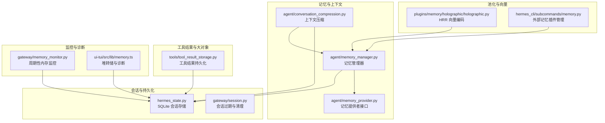
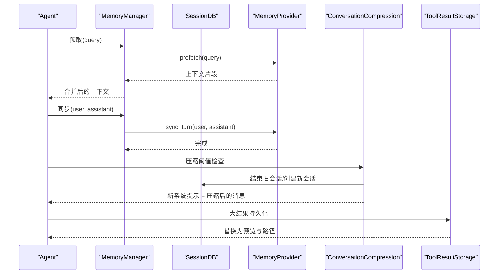
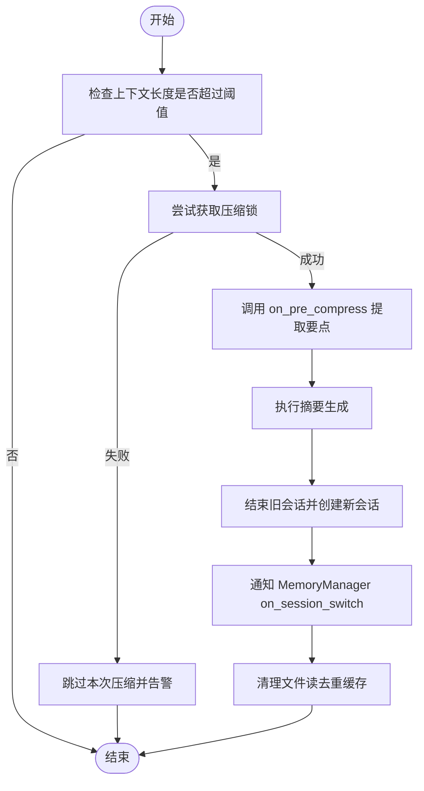
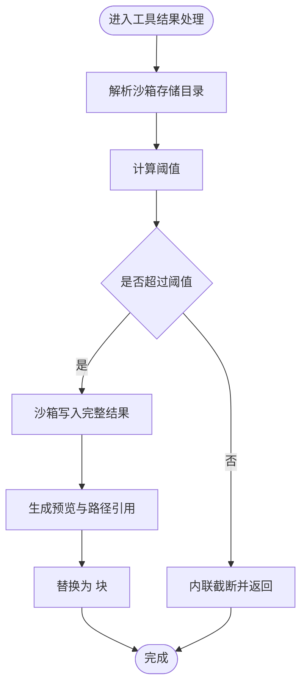
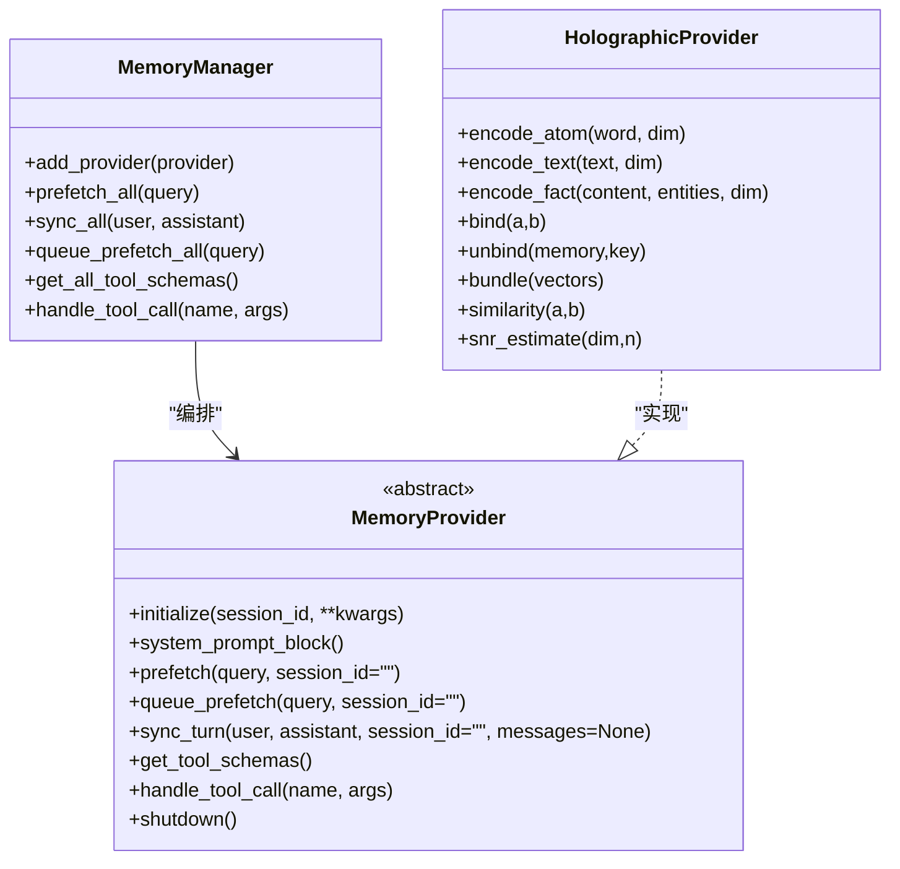
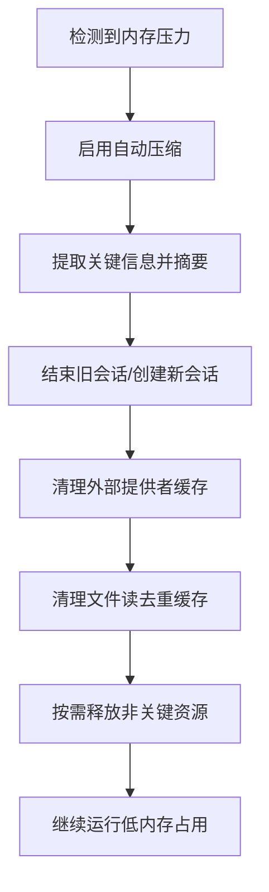
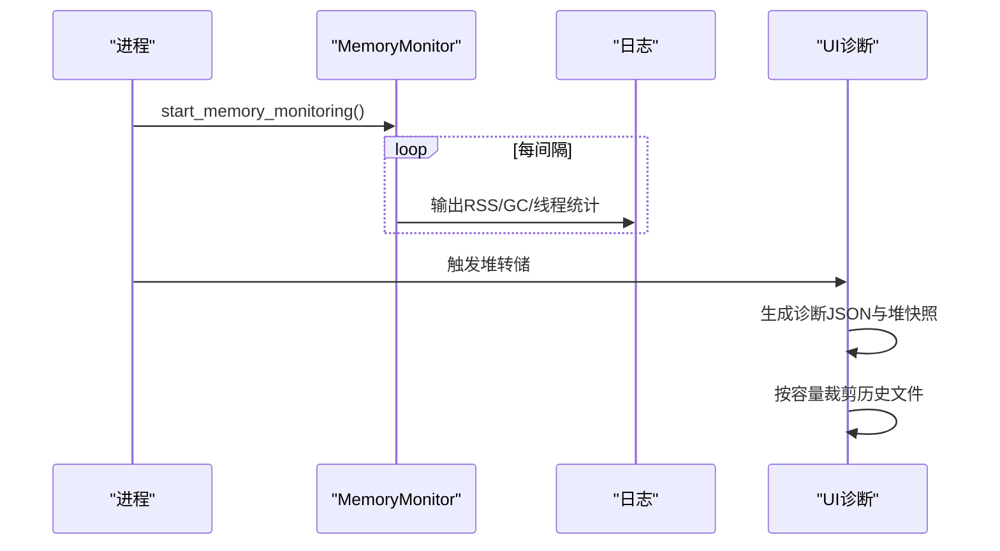
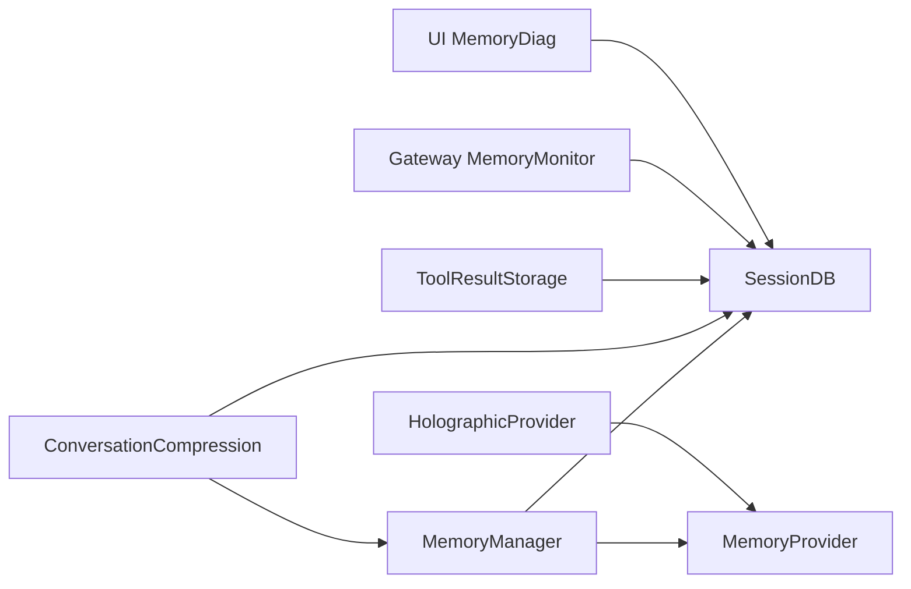

# 内存使用优化

<cite>
**本文档引用的文件**
- [memory_manager.py](file://agent/memory_manager.py)
- [memory_provider.py](file://agent/memory_provider.py)
- [conversation_compression.py](file://agent/conversation_compression.py)
- [hermes_state.py](file://hermes_state.py)
- [memory_monitor.py](file://gateway/memory_monitor.py)
- [memory.ts](file://ui-tui/src/lib/memory.ts)
- [tool_result_storage.py](file://tools/tool_result_storage.py)
- [memory.py](file://plugins/memory/holographic/holographic.py)
- [session.py](file://gateway/session.py)
- [memory.py](file://hermes_cli/subcommands/memory.py)
- [memory.test.ts](file://ui-tui/src/__tests__/memoryMonitor.test.ts)
- [memoryMonitor.test.ts](file://ui-tui/src/__tests__/memoryMonitor.test.ts)
- [test_file_read_guards.py](file://tests/tools/test_file_read_guards.py)
- [test_read_loop_detection.py](file://tests/tools/test_read_loop_detection.py)
</cite>

## 目录
1. [引言](#引言)
2. [项目结构](#项目结构)
3. [核心组件](#核心组件)
4. [架构总览](#架构总览)
5. [详细组件分析](#详细组件分析)
6. [依赖关系分析](#依赖关系分析)
7. [性能考量](#性能考量)
8. [故障排查指南](#故障排查指南)
9. [结论](#结论)
10. [附录](#附录)

## 引言
本指南聚焦于系统内存使用优化，围绕会话状态管理、消息缓存策略、工具结果存储、大对象管理、池化技术、内存压力下的降级策略以及监控与分析工具展开。目标是帮助开发者在不同硬件配置（低内存设备、高并发场景）下实现稳定、可扩展且低内存占用的运行时行为。

## 项目结构
本仓库中与内存优化直接相关的核心模块分布如下：
- 会话与持久化：hermes_state.py（SQLite 状态存储）、gateway/session.py（会话过期与清理）
- 记忆与上下文：agent/memory_manager.py、agent/memory_provider.py、agent/conversation_compression.py
- 工具结果与大对象：tools/tool_result_storage.py
- 内存监控与诊断：gateway/memory_monitor.py、ui-tui/src/lib/memory.ts
- 内存池化与向量编码：plugins/memory/holographic/holographic.py
- CLI 内存插件管理：hermes_cli/subcommands/memory.py
- 测试与回归：tests/tools/test_file_read_guards.py、tests/tools/test_read_loop_detection.py、ui-tui/src/__tests__/memoryMonitor.test.ts

图表来源
- [hermes_state.py:657-800](file://hermes_state.py#L657-L800)
- [gateway/session.py:762-793](file://gateway/session.py#L762-L793)
- [agent/memory_manager.py:313-800](file://agent/memory_manager.py#L313-L800)
- [agent/memory_provider.py:42-297](file://agent/memory_provider.py#L42-L297)
- [agent/conversation_compression.py:281-653](file://agent/conversation_compression.py#L281-L653)
- [tools/tool_result_storage.py:1-233](file://tools/tool_result_storage.py#L1-L233)
- [gateway/memory_monitor.py:1-231](file://gateway/memory_monitor.py#L1-L231)
- [ui-tui/src/lib/memory.ts:1-247](file://ui-tui/src/lib/memory.ts#L1-L247)
- [plugins/memory/holographic/holographic.py:1-204](file://plugins/memory/holographic/holographic.py#L1-L204)
- [hermes_cli/subcommands/memory.py:12-54](file://hermes_cli/subcommands/memory.py#L12-L54)

章节来源
- [hermes_state.py:657-800](file://hermes_state.py#L657-L800)
- [gateway/session.py:762-793](file://gateway/session.py#L762-L793)
- [agent/memory_manager.py:313-800](file://agent/memory_manager.py#L313-L800)
- [agent/memory_provider.py:42-297](file://agent/memory_provider.py#L42-L297)
- [agent/conversation_compression.py:281-653](file://agent/conversation_compression.py#L281-L653)
- [tools/tool_result_storage.py:1-233](file://tools/tool_result_storage.py#L1-L233)
- [gateway/memory_monitor.py:1-231](file://gateway/memory_monitor.py#L1-L231)
- [ui-tui/src/lib/memory.ts:1-247](file://ui-tui/src/lib/memory.ts#L1-L247)
- [plugins/memory/holographic/holographic.py:1-204](file://plugins/memory/holographic/holographic.py#L1-L204)
- [hermes_cli/subcommands/memory.py:12-54](file://hermes_cli/subcommands/memory.py#L12-L54)

## 核心组件
- 记忆管理器（MemoryManager）：统一编排内置与外部记忆提供者，负责预取、同步、工具路由与生命周期事件通知；通过单线程后台执行器串行化写入，避免阻塞主流程。
- 记忆提供者接口（MemoryProvider）：抽象外部记忆后端（如 Honcho、Hindsight、Mem0、Holographic 等），定义初始化、系统提示注入、预取、同步、工具暴露等钩子。
- 会话数据库（SessionDB）：基于 SQLite 的会话与消息持久化，支持 WAL 模式与 FTS5 全文检索；内置写入竞争处理与自动修复机制。
- 上下文压缩（ConversationCompression）：在达到阈值时对历史消息进行摘要与拆分，旋转 session_id 并通知外部上下文引擎与记忆提供者。
- 工具结果存储（ToolResultStorage）：对超大工具输出进行沙箱持久化，避免上下文溢出；支持逐轮预算控制与按大小排序的溢出策略。
- 内存监控（Gateway MemoryMonitor、UI-TUI MemoryDiag）：周期性记录 RSS、GC 统计、线程数等指标；支持自动堆转储与诊断文件裁剪，辅助定位泄漏与增长趋势。
- 向量编码（Holographic）：基于相位向量的 HRR 编码，提供绑定、解绑、叠加与相似度计算，用于可复现的记忆表示与检索。

章节来源
- [agent/memory_manager.py:313-800](file://agent/memory_manager.py#L313-L800)
- [agent/memory_provider.py:42-297](file://agent/memory_provider.py#L42-L297)
- [hermes_state.py:657-800](file://hermes_state.py#L657-L800)
- [agent/conversation_compression.py:281-653](file://agent/conversation_compression.py#L281-L653)
- [tools/tool_result_storage.py:1-233](file://tools/tool_result_storage.py#L1-L233)
- [gateway/memory_monitor.py:1-231](file://gateway/memory_monitor.py#L1-L231)
- [ui-tui/src/lib/memory.ts:1-247](file://ui-tui/src/lib/memory.ts#L1-L247)
- [plugins/memory/holographic/holographic.py:1-204](file://plugins/memory/holographic/holographic.py#L1-L204)

## 架构总览
系统通过 MemoryManager 将“会话状态”“消息历史”“工具结果”“外部记忆后端”整合为统一的内存使用闭环。SessionDB 提供稳定的持久化层，ConversationCompression 在必要时降低上下文规模，ToolResultStorage 将大对象外置到沙箱，MemoryMonitor 与 UI 诊断工具持续观测内存增长与潜在泄漏。

图表来源
- [agent/memory_manager.py:452-571](file://agent/memory_manager.py#L452-L571)
- [agent/conversation_compression.py:281-653](file://agent/conversation_compression.py#L281-L653)
- [tools/tool_result_storage.py:122-233](file://tools/tool_result_storage.py#L122-L233)
- [hermes_state.py:657-800](file://hermes_state.py#L657-L800)

## 详细组件分析

### 会话状态管理与消息缓存
- SessionDB 使用 WAL 模式提升并发读能力，并在多进程共享 state.db 场景下采用短超时 + 应用层随机抖动重试，避免 SQLite 内部“ convoy effect”。同时内置 FTS5 虚表索引以支持全文检索。
- 会话过期与清理：gateway/session.py 支持基于策略的会话过期检测与内存中会话数据的主动刷新，防止长时间驻留导致的内存膨胀。
- 会话切换与压缩：conversation_compression.py 在压缩前通知 MemoryManager 执行 on_pre_compress，并在旋转 session_id 后调用 on_session_switch，确保外部提供者缓存的会话状态正确迁移。

图表来源
- [agent/conversation_compression.py:281-653](file://agent/conversation_compression.py#L281-L653)
- [agent/memory_manager.py:777-794](file://agent/memory_manager.py#L777-L794)
- [gateway/session.py:762-793](file://gateway/session.py#L762-L793)

章节来源
- [hermes_state.py:657-800](file://hermes_state.py#L657-L800)
- [gateway/session.py:762-793](file://gateway/session.py#L762-L793)
- [agent/conversation_compression.py:281-653](file://agent/conversation_compression.py#L281-L653)
- [agent/memory_manager.py:777-794](file://agent/memory_manager.py#L777-L794)

### 工具结果存储与大对象管理
- 分层防护：每工具输出上限（工具内部）、结果持久化（沙箱写入）、每轮聚合预算（按大小排序溢出）三级策略，避免上下文窗口溢出。
- 沙箱写入：通过 env.execute 将内容经 stdin 推送，绕开命令行参数长度限制，保证大结果可靠落盘。
- 预览与路径替换：对超限结果生成预览文本与文件路径引用，模型可通过 read_file 以 offset/limit 方式按需访问。

图表来源
- [tools/tool_result_storage.py:122-233](file://tools/tool_result_storage.py#L122-L233)

章节来源
- [tools/tool_result_storage.py:1-233](file://tools/tool_result_storage.py#L1-L233)

### 内存池化与对象复用
- 单线程后台执行器：MemoryManager 使用单工作线程串行化所有提供者的同步与预取任务，避免多线程竞争带来的额外内存与锁开销。
- 向量编码（HRR）：holographic 插件提供确定性相位向量编码，支持绑定、解绑、叠加与相似度计算，便于跨进程一致的记忆表示与检索，减少重复计算与缓存不一致。
- 连接与后端池：gateway 中存在后端连接池的 LRU 清理逻辑，结合最近活跃标记与保活窗口，避免空闲连接长期占用内存。

图表来源
- [agent/memory_manager.py:313-800](file://agent/memory_manager.py#L313-L800)
- [agent/memory_provider.py:42-297](file://agent/memory_provider.py#L42-L297)
- [plugins/memory/holographic/holographic.py:1-204](file://plugins/memory/holographic/holographic.py#L1-L204)

章节来源
- [agent/memory_manager.py:313-800](file://agent/memory_manager.py#L313-L800)
- [agent/memory_provider.py:42-297](file://agent/memory_provider.py#L42-L297)
- [plugins/memory/holographic/holographic.py:1-204](file://plugins/memory/holographic/holographic.py#L1-L204)
- [gateway/session.py:4630-4660](file://gateway/session.py#L4630-L4660)

### 内存压力下的降级策略
- 自动压缩：当上下文长度超过阈值时触发压缩，降低消息数量与 token 消耗，必要时回退至主模型进行摘要生成。
- 延迟加载与按需释放：通过 on_session_switch 与 on_pre_compress 通知外部提供者清理或刷新缓存；压缩完成后清理文件读去重缓存，避免重复读取造成内存累积。
- 临时文件清理：沙箱持久化的结果文件由 UI 侧定期裁剪，保留最新文件并删除最旧文件，防止磁盘与内存快照堆积。

图表来源
- [agent/conversation_compression.py:281-653](file://agent/conversation_compression.py#L281-L653)
- [ui-tui/src/lib/memory.ts:186-222](file://ui-tui/src/lib/memory.ts#L186-L222)

章节来源
- [agent/conversation_compression.py:281-653](file://agent/conversation_compression.py#L281-L653)
- [ui-tui/src/lib/memory.ts:186-222](file://ui-tui/src/lib/memory.ts#L186-L222)

### 内存监控与分析工具
- Gateway 周期性内存监控：记录 RSS、GC 统计、线程数等指标，支持在启动、关闭与关键生命周期节点输出日志，便于追踪内存增长曲线。
- UI 堆转储与诊断：支持自动/手动堆转储，生成诊断 JSON 与堆快照；根据环境变量控制自动转储开关与最大容量，避免磁盘占满。
- 监控测试：提供定时器与阈值触发的单元测试，验证内存监控在不同场景下的行为。

图表来源
- [gateway/memory_monitor.py:129-231](file://gateway/memory_monitor.py#L129-L231)
- [ui-tui/src/lib/memory.ts:60-184](file://ui-tui/src/lib/memory.ts#L60-L184)

章节来源
- [gateway/memory_monitor.py:1-231](file://gateway/memory_monitor.py#L1-L231)
- [ui-tui/src/lib/memory.ts:1-247](file://ui-tui/src/lib/memory.ts#L1-L247)
- [ui-tui/src/__tests__/memoryMonitor.test.ts:42-73](file://ui-tui/src/__tests__/memoryMonitor.test.ts#L42-L73)

### 不同硬件配置下的优化策略
- 低内存设备
  - 启用自动压缩，缩短阈值百分比，降低摘要模型上下文窗口要求。
  - 使用 HRR 向量编码替代高维嵌入，减少内存占用与计算开销。
  - 严格控制工具结果持久化阈值，优先使用预览与按需读取。
- 高并发场景
  - 使用 MemoryManager 的单线程后台执行器串行化写入，避免线程竞争与锁争用。
  - 对会话数据库采用 WAL 模式并在网络文件系统上自动降级为 DELETE 模式，确保稳定性。
  - 通过连接池的 LRU 清理与最近活跃标记，回收空闲后端连接。

章节来源
- [agent/memory_manager.py:575-642](file://agent/memory_manager.py#L575-L642)
- [hermes_state.py:231-280](file://hermes_state.py#L231-L280)
- [plugins/memory/holographic/holographic.py:179-204](file://plugins/memory/holographic/holographic.py#L179-L204)
- [gateway/session.py:4630-4660](file://gateway/session.py#L4630-L4660)

## 依赖关系分析
- MemoryManager 依赖 MemoryProvider 抽象，面向多提供者场景；SessionDB 作为持久化后端，被 ConversationCompression 与工具链共同使用。
- ToolResultStorage 与沙箱环境交互，避免将大对象常驻内存；UI 诊断与 Gateway 监控分别从用户态与进程态观测内存健康。
- Holographic 提供者实现 MemoryProvider 接口，为外部提供者生态增加向量编码能力。

图表来源
- [agent/memory_manager.py:313-800](file://agent/memory_manager.py#L313-L800)
- [agent/memory_provider.py:42-297](file://agent/memory_provider.py#L42-L297)
- [agent/conversation_compression.py:281-653](file://agent/conversation_compression.py#L281-L653)
- [tools/tool_result_storage.py:1-233](file://tools/tool_result_storage.py#L1-L233)
- [gateway/memory_monitor.py:1-231](file://gateway/memory_monitor.py#L1-L231)
- [ui-tui/src/lib/memory.ts:1-247](file://ui-tui/src/lib/memory.ts#L1-L247)
- [plugins/memory/holographic/holographic.py:1-204](file://plugins/memory/holographic/holographic.py#L1-L204)

章节来源
- [agent/memory_manager.py:313-800](file://agent/memory_manager.py#L313-L800)
- [agent/memory_provider.py:42-297](file://agent/memory_provider.py#L42-L297)
- [agent/conversation_compression.py:281-653](file://agent/conversation_compression.py#L281-L653)
- [tools/tool_result_storage.py:1-233](file://tools/tool_result_storage.py#L1-L233)
- [gateway/memory_monitor.py:1-231](file://gateway/memory_monitor.py#L1-L231)
- [ui-tui/src/lib/memory.ts:1-247](file://ui-tui/src/lib/memory.ts#L1-L247)
- [plugins/memory/holographic/holographic.py:1-204](file://plugins/memory/holographic/holographic.py#L1-L204)

## 性能考量
- 写入竞争与锁：SessionDB 通过短超时 + 随机抖动重试缓解“ convoy effect”，并定期 PASSIVE checkpoint 降低 WAL 锁争用。
- GC 与线程：Gateway MemoryMonitor 记录 GC 统计与线程数，有助于识别 GC 压力与线程泄漏。
- 大对象与 I/O：ToolResultStorage 将大结果写入沙箱并通过预览与路径引用降低内存驻留；UI 诊断支持裁剪历史快照，避免磁盘与内存压力。
- 向量编码：HRR 使用确定性相位向量，避免传统复数 HRR 的幅度衰减问题，适合大规模知识存储与检索。

[本节为通用指导，无需列出具体文件来源]

## 故障排查指南
- 泄漏检测
  - 使用 UI MemoryDiag 的潜在泄漏指标（detached context、活跃句柄、native 内存大于堆、高增长速率、过多打开 FD）快速定位可疑点。
  - 启用 Gateway MemoryMonitor，观察 RSS 与 GC 统计随时间的变化趋势。
- 文件读取与去重
  - 若出现重复读取被阻断或警告，检查文件读取去重策略与范围键（路径+offset+limit），必要时重置去重计数。
- 数据库一致性
  - 当遇到“schema 已损坏/磁盘镜像损坏”错误时，使用自动修复流程备份并重建 FTS 层，确保会话与消息数据不丢失。

章节来源
- [ui-tui/src/lib/memory.ts:83-144](file://ui-tui/src/lib/memory.ts#L83-L144)
- [gateway/memory_monitor.py:83-127](file://gateway/memory_monitor.py#L83-L127)
- [tests/tools/test_file_read_guards.py:310-492](file://tests/tools/test_file_read_guards.py#L310-L492)
- [tests/tools/test_read_loop_detection.py:78-105](file://tests/tools/test_read_loop_detection.py#L78-L105)
- [hermes_state.py:410-506](file://hermes_state.py#L410-L506)

## 结论
通过 MemoryManager 的统一编排、SessionDB 的稳健持久化、ConversationCompression 的智能降级、ToolResultStorage 的大对象外置、以及 MemoryMonitor 与 UI 诊断的持续观测，系统在不同硬件配置下均能实现可控的内存占用与稳定的运行表现。建议在生产环境中启用自动压缩、严格控制工具结果阈值、合理设置外部记忆提供者，并配合周期性内存监控与诊断，以尽早发现并解决潜在的内存问题。

[本节为总结性内容，无需列出具体文件来源]

## 附录
- 外部记忆插件管理：通过 hermes_cli 子命令选择与配置单一外部提供者，内置 MEMORY.md 与 USER.md 始终生效。
- 相关文档与参考：上下文压缩与缓存、记忆提供者插件系统、插件体系概览等。

章节来源
- [hermes_cli/subcommands/memory.py:12-54](file://hermes_cli/subcommands/memory.py#L12-L54)