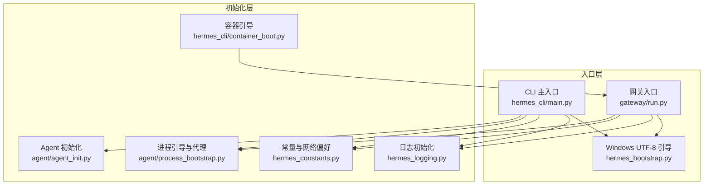
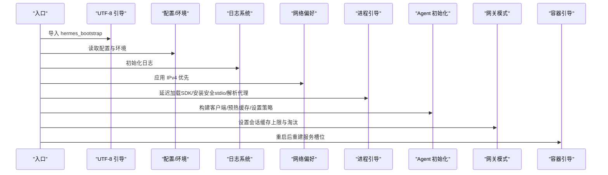
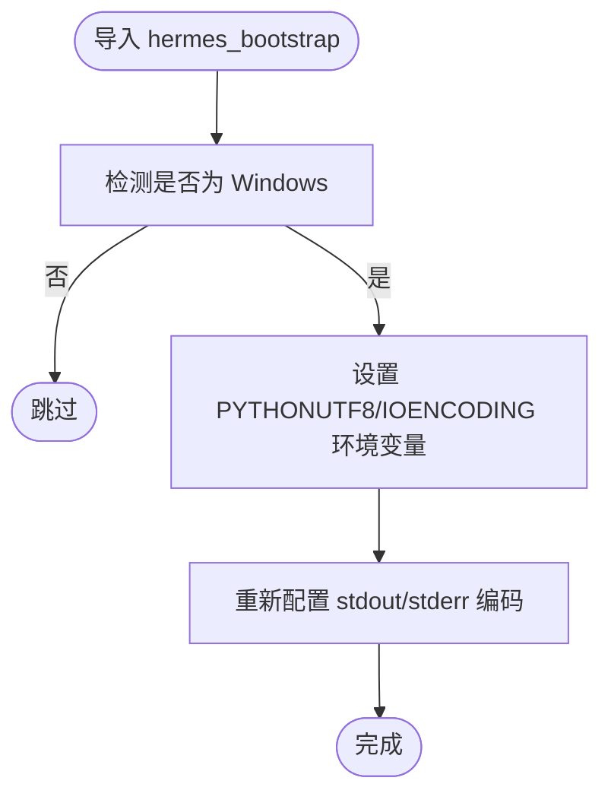
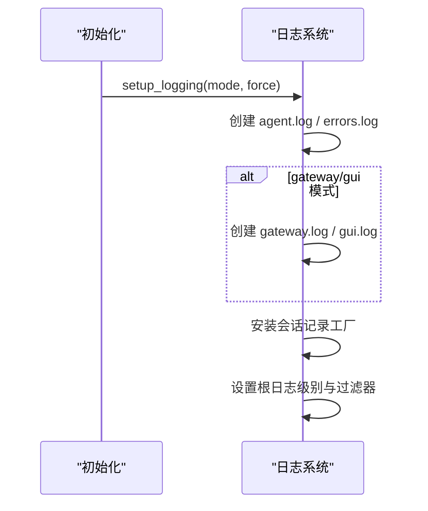
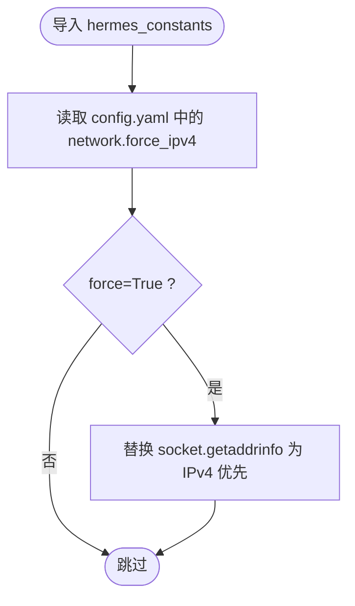
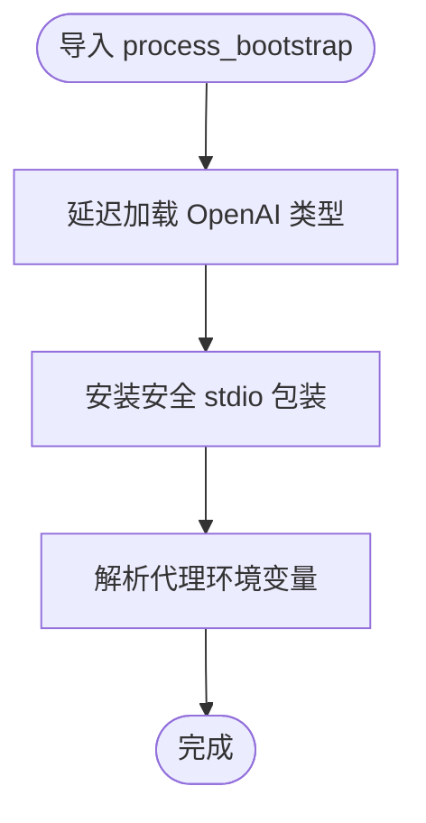
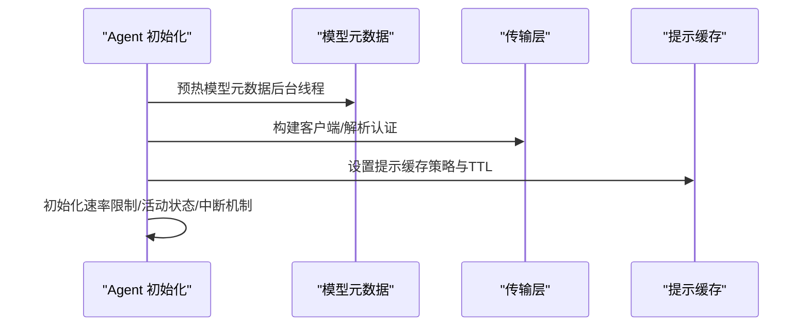
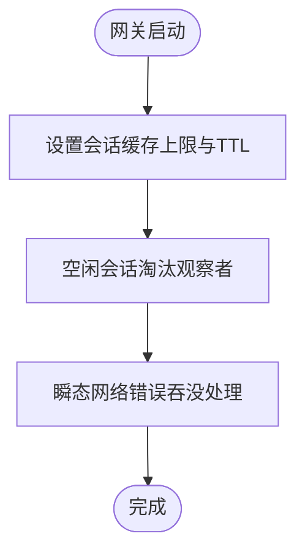
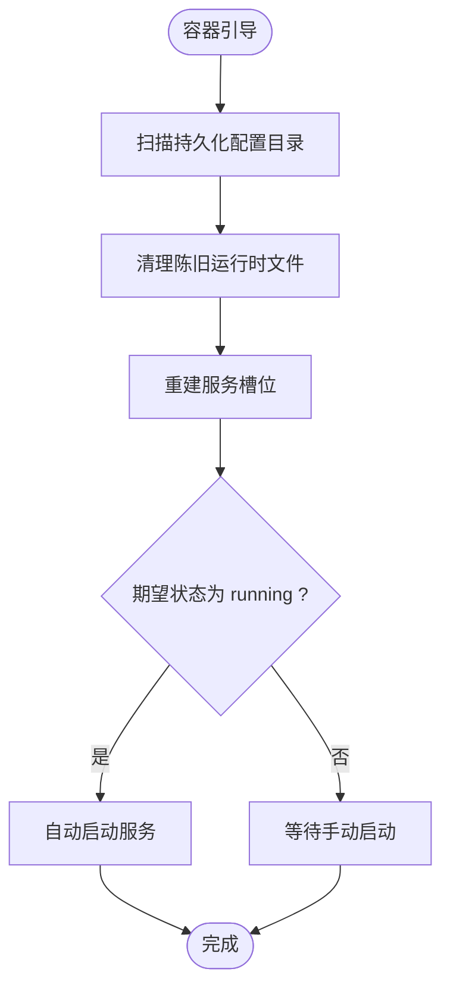
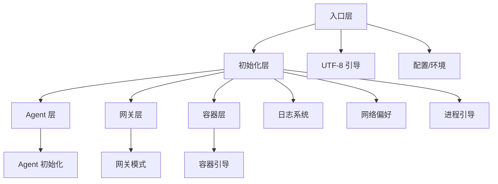

# 启动性能优化

<cite>
**本文档引用的文件**
- [hermes_bootstrap.py](file://hermes_bootstrap.py)
- [agent_init.py](file://agent/agent_init.py)
- [run.py](file://gateway/run.py)
- [main.py](file://hermes_cli/main.py)
- [container_boot.py](file://hermes_cli/container_boot.py)
- [hermes_constants.py](file://hermes_constants.py)
- [hermes_logging.py](file://hermes_logging.py)
- [process_bootstrap.py](file://agent/process_bootstrap.py)
</cite>

## 目录
1. [引言](#引言)
2. [项目结构](#项目结构)
3. [核心组件](#核心组件)
4. [架构总览](#架构总览)
5. [详细组件分析](#详细组件分析)
6. [依赖分析](#依赖分析)
7. [性能考虑](#性能考虑)
8. [故障排查指南](#故障排查指南)
9. [结论](#结论)
10. [附录](#附录)

## 引言
本指南聚焦于系统启动性能优化，围绕启动流程与初始化过程中的关键环节进行深入解析，包括模块加载顺序、依赖注入机制、缓存预热策略等。文档同时提供延迟加载、并行初始化、资源预分配等优化手段，覆盖启动阶段的内存使用优化、网络连接优化，并给出启动性能监控与分析工具的使用方法，以及针对本地开发、生产部署、容器化等不同环境的优化建议。

## 项目结构
从启动路径看，系统在多个入口点执行早期初始化，确保跨平台兼容性、日志可用性、配置读取与网络偏好设置。关键入口包括：
- CLI 入口：负责进程标题设置、界面选择、早期配置读取、日志初始化与网络偏好应用。
- 网关入口：负责网关生命周期管理、平台适配器启动、会话缓存控制与错误处理。
- Agent 初始化：负责模型客户端构建、认证解析、提示缓存策略、并发与中断机制初始化。
- 容器引导：负责容器重启后服务槽位重建与自动启动策略。

**图表来源**
- [main.py:46-110](file://hermes_cli/main.py#L46-L110)
- [run.py:16-26](file://gateway/run.py#L16-L26)
- [hermes_bootstrap.py:59-129](file://hermes_bootstrap.py#L59-L129)
- [hermes_logging.py:231-348](file://hermes_logging.py#L231-L348)
- [hermes_constants.py:543-583](file://hermes_constants.py#L543-L583)
- [process_bootstrap.py:145-151](file://agent/process_bootstrap.py#L145-L151)
- [agent_init.py:154-226](file://agent/agent_init.py#L154-L226)
- [container_boot.py:58-160](file://hermes_cli/container_boot.py#L58-L160)

**章节来源**
- [main.py:46-110](file://hermes_cli/main.py#L46-L110)
- [run.py:16-26](file://gateway/run.py#L16-L26)
- [hermes_bootstrap.py:59-129](file://hermes_bootstrap.py#L59-L129)
- [hermes_logging.py:231-348](file://hermes_logging.py#L231-L348)
- [hermes_constants.py:543-583](file://hermes_constants.py#L543-L583)
- [process_bootstrap.py:145-151](file://agent/process_bootstrap.py#L145-L151)
- [agent_init.py:154-226](file://agent/agent_init.py#L154-L226)
- [container_boot.py:58-160](file://hermes_cli/container_boot.py#L58-L160)

## 核心组件
- Windows UTF-8 引导：在 Windows 平台强制启用 UTF-8 模式，避免子进程与标准输入输出编码问题，保障启动期打印与子进程 I/O 的稳定性。
- 日志系统：集中式日志初始化，支持多文件轮转与按组件路由，为启动阶段诊断提供可靠依据。
- 常量与网络偏好：统一读取 HERMES_HOME，提供 IPv4 优先策略以减少 DNS/连接超时。
- 进程引导与代理：延迟加载 OpenAI SDK 类型，安装安全的 stdio 写入器，解析代理环境变量。
- Agent 初始化：集中式初始化逻辑，包含模型元数据预热、提示缓存策略、速率限制跟踪、活动状态记录等。
- 容器引导：在容器重启后重建 s6 服务槽位，恢复运行中状态，避免丢失用户配置。

**章节来源**
- [hermes_bootstrap.py:59-129](file://hermes_bootstrap.py#L59-L129)
- [hermes_logging.py:231-348](file://hermes_logging.py#L231-L348)
- [hermes_constants.py:543-583](file://hermes_constants.py#L543-L583)
- [process_bootstrap.py:39-151](file://agent/process_bootstrap.py#L39-L151)
- [agent_init.py:154-226](file://agent/agent_init.py#L154-L226)
- [container_boot.py:58-160](file://hermes_cli/container_boot.py#L58-L160)

## 架构总览
启动流程的关键序列如下：
- CLI/Gateway 在最顶部导入 Windows UTF-8 引导模块，确保后续 I/O 不受编码影响。
- 读取配置与环境变量（含早期界面选择、日志级别、网络偏好），尽早完成。
- 初始化日志系统，保证所有后续步骤均有可追踪的日志输出。
- 应用网络偏好（如 IPv4 优先），减少 DNS 解析与连接失败导致的阻塞。
- 进程引导：延迟加载第三方 SDK 类型，安装安全 stdio，解析代理。
- Agent 初始化：根据提供商与模型信息构建客户端，预热模型元数据缓存，设置提示缓存策略与速率限制跟踪。
- 网关模式下，建立会话缓存上限与空闲淘汰策略，避免长期运行导致内存膨胀。
- 容器模式下，重启后重建服务槽位并按期望状态自动启动。

**图表来源**
- [main.py:46-110](file://hermes_cli/main.py#L46-L110)
- [run.py:60-69](file://gateway/run.py#L60-L69)
- [hermes_bootstrap.py:59-129](file://hermes_bootstrap.py#L59-L129)
- [hermes_logging.py:231-348](file://hermes_logging.py#L231-L348)
- [hermes_constants.py:543-583](file://hermes_constants.py#L543-L583)
- [process_bootstrap.py:39-151](file://agent/process_bootstrap.py#L39-L151)
- [agent_init.py:400-415](file://agent/agent_init.py#L400-L415)
- [container_boot.py:58-160](file://hermes_cli/container_boot.py#L58-L160)

## 详细组件分析

### 组件 A：Windows UTF-8 引导
- 目标：在 Windows 上通过设置环境变量与重新配置标准流，避免 Unicode 编码错误，确保父进程与子进程均使用 UTF-8。
- 关键点：幂等设计，避免重复配置；仅在 Windows 生效；对测试或非文本流进行保护性降级。
- 启动优化：在任何可能产生 I/O 或子进程调用前导入，避免后续异常导致的启动失败。

**图表来源**
- [hermes_bootstrap.py:59-129](file://hermes_bootstrap.py#L59-L129)

**章节来源**
- [hermes_bootstrap.py:59-129](file://hermes_bootstrap.py#L59-L129)

### 组件 B：日志系统初始化
- 目标：集中式日志初始化，支持多文件轮转与按组件过滤，确保启动阶段所有输出均可被持久化与检索。
- 关键点：Windows 使用并发旋转处理器；POSIX 使用标准旋转处理器；支持会话上下文标记；抑制噪声日志。
- 启动优化：尽早调用，避免后续模块导入时出现循环依赖；支持强制重初始化。

**图表来源**
- [hermes_logging.py:231-348](file://hermes_logging.py#L231-L348)

**章节来源**
- [hermes_logging.py:231-348](file://hermes_logging.py#L231-L348)

### 组件 C：常量与网络偏好
- 目标：统一读取 HERMES_HOME，提供容器/WSL/Termux 等环境识别；应用 IPv4 优先策略以减少 DNS/连接超时。
- 关键点：IPv4 优先通过替换 socket.getaddrinfo 实现，仅在需要时生效；环境识别结果缓存，避免重复探测。
- 启动优化：在导入网络相关模块前应用 IPv4 优先，显著降低 IPv6 不可达主机上的连接延迟。

**图表来源**
- [hermes_constants.py:543-583](file://hermes_constants.py#L543-L583)

**章节来源**
- [hermes_constants.py:543-583](file://hermes_constants.py#L543-L583)

### 组件 D：进程引导与代理
- 目标：延迟加载第三方 SDK 类型，安装安全 stdio 写入器，解析代理环境变量。
- 关键点：OpenAI 类型延迟加载并缓存；安全 stdio 包装捕获管道断开与句柄关闭异常；代理解析尊重 NO_PROXY 规则。
- 启动优化：避免在启动早期引入重型依赖；提升启动稳定性，防止因 I/O 错误导致崩溃。

**图表来源**
- [process_bootstrap.py:39-151](file://agent/process_bootstrap.py#L39-L151)

**章节来源**
- [process_bootstrap.py:39-151](file://agent/process_bootstrap.py#L39-L151)

### 组件 E：Agent 初始化
- 目标：集中式初始化逻辑，包含模型客户端构建、认证解析、提示缓存策略、并发与中断机制初始化。
- 关键点：预热 OpenRouter 模型元数据缓存；根据提供商与模型自动选择 API 模式；设置提示缓存 TTL；初始化速率限制与活动状态跟踪。
- 启动优化：后台线程预热模型元数据，避免首次请求阻塞；根据配置启用提示缓存策略；合理设置超时与重试参数。

**图表来源**
- [agent_init.py:400-415](file://agent/agent_init.py#L400-L415)
- [agent_init.py:610-800](file://agent/agent_init.py#L610-L800)

**章节来源**
- [agent_init.py:154-226](file://agent/agent_init.py#L154-L226)
- [agent_init.py:400-415](file://agent/agent_init.py#L400-L415)
- [agent_init.py:610-800](file://agent/agent_init.py#L610-L800)

### 组件 F：网关模式初始化
- 目标：在网关模式下设置会话缓存上限与空闲淘汰策略，避免长期运行导致内存膨胀。
- 关键点：限制每个会话的 AIAgent 缓存大小；基于空闲时间进行淘汰；对瞬态网络错误进行吞没处理，避免进程崩溃。
- 启动优化：通过缓存上限与淘汰策略控制内存增长；对网络瞬态错误进行分类处理，提升稳定性。

**图表来源**
- [run.py:60-69](file://gateway/run.py#L60-L69)
- [run.py:242-275](file://gateway/run.py#L242-L275)

**章节来源**
- [run.py:60-69](file://gateway/run.py#L60-L69)
- [run.py:242-275](file://gateway/run.py#L242-L275)

### 组件 G：容器引导
- 目标：在容器重启后重建 s6 服务槽位，恢复运行中状态，避免丢失用户配置。
- 关键点：扫描持久化配置目录，重建服务注册；清理陈旧运行时文件；按期望状态自动启动。
- 启动优化：通过原子发布与预创建监督骨架，确保服务槽位一致性；避免重启后服务丢失。

**图表来源**
- [container_boot.py:58-160](file://hermes_cli/container_boot.py#L58-L160)
- [container_boot.py:293-376](file://hermes_cli/container_boot.py#L293-L376)

**章节来源**
- [container_boot.py:58-160](file://hermes_cli/container_boot.py#L58-L160)
- [container_boot.py:293-376](file://hermes_cli/container_boot.py#L293-L376)

## 依赖分析
- 入口层依赖：CLI/Gateway 在顶部导入 Windows UTF-8 引导模块，确保后续 I/O 行为一致。
- 初始化层依赖：日志系统与网络偏好在配置读取之后尽早初始化；进程引导在导入网络相关模块之前应用 IPv4 优先策略。
- Agent 初始化依赖：模型元数据预热与传输层构建依赖于提供商与模型配置；提示缓存策略依赖于配置文件。
- 网关模式依赖：会话缓存控制与瞬态错误处理依赖于日志系统与网络偏好。
- 容器引导依赖：服务槽位重建依赖于 s6 服务管理器渲染脚本与运行时环境。

**图表来源**
- [main.py:46-110](file://hermes_cli/main.py#L46-L110)
- [run.py:60-69](file://gateway/run.py#L60-L69)
- [hermes_bootstrap.py:59-129](file://hermes_bootstrap.py#L59-L129)
- [hermes_logging.py:231-348](file://hermes_logging.py#L231-L348)
- [hermes_constants.py:543-583](file://hermes_constants.py#L543-L583)
- [process_bootstrap.py:39-151](file://agent/process_bootstrap.py#L39-L151)
- [agent_init.py:400-415](file://agent/agent_init.py#L400-L415)
- [container_boot.py:58-160](file://hermes_cli/container_boot.py#L58-L160)

**章节来源**
- [main.py:46-110](file://hermes_cli/main.py#L46-L110)
- [run.py:60-69](file://gateway/run.py#L60-L69)
- [hermes_bootstrap.py:59-129](file://hermes_bootstrap.py#L59-L129)
- [hermes_logging.py:231-348](file://hermes_logging.py#L231-L348)
- [hermes_constants.py:543-583](file://hermes_constants.py#L543-L583)
- [process_bootstrap.py:39-151](file://agent/process_bootstrap.py#L39-L151)
- [agent_init.py:400-415](file://agent/agent_init.py#L400-L415)
- [container_boot.py:58-160](file://hermes_cli/container_boot.py#L58-L160)

## 性能考虑
- 模块加载顺序
  - 将 Windows UTF-8 引导置于最顶部，确保后续 I/O 不受影响。
  - 早读取配置与环境变量，避免重复解析。
  - 日志系统尽早初始化，保证可观测性。
  - 网络偏好在导入网络相关模块前应用，减少连接超时。
- 延迟加载与并行初始化
  - 延迟加载第三方 SDK 类型，避免启动早期引入重型依赖。
  - 后台线程预热模型元数据，避免首次请求阻塞。
  - 并行初始化可选组件（如某些插件或工具集），但需注意线程安全与资源竞争。
- 资源预分配与缓存预热
  - 提示缓存策略与 TTL 根据配置启用，减少重复计算。
  - 会话缓存上限与空闲淘汰策略控制内存增长。
  - 预热传输层缓存，避免首次调用的导入与验证开销。
- 内存使用优化
  - 对象池化与懒加载策略结合，避免不必要的初始化。
  - 通过会话缓存淘汰与日志轮转控制内存与磁盘占用。
- 网络连接优化
  - IPv4 优先策略减少 DNS/连接超时。
  - 代理解析尊重 NO_PROXY，避免不必要的代理链路。
  - 瞬态网络错误吞没处理，提升稳定性。

[本节为通用指导，不直接分析具体文件]

## 故障排查指南
- 启动阶段常见问题
  - Windows 编码错误：确认已正确导入 UTF-8 引导模块。
  - 日志缺失：检查日志初始化是否成功，确认日志文件路径与权限。
  - 网络连接失败：检查网络偏好设置与代理配置，确认 NO_PROXY 规则。
  - 瞬态网络错误导致崩溃：确认瞬态错误吞没处理逻辑已启用。
- 容器重启后服务未启动
  - 检查容器引导脚本是否正确重建服务槽位。
  - 确认期望状态为 running 且未被其他状态覆盖。
- 性能瓶颈定位
  - 使用日志中的会话标签进行过滤，定位耗时操作。
  - 分析模型元数据预热与传输层初始化耗时。
  - 监控会话缓存命中率与淘汰频率。

**章节来源**
- [hermes_bootstrap.py:59-129](file://hermes_bootstrap.py#L59-L129)
- [hermes_logging.py:231-348](file://hermes_logging.py#L231-L348)
- [hermes_constants.py:543-583](file://hermes_constants.py#L543-L583)
- [run.py:242-275](file://gateway/run.py#L242-L275)
- [container_boot.py:58-160](file://hermes_cli/container_boot.py#L58-L160)

## 结论
通过在启动早期应用 UTF-8 引导、集中式日志初始化、网络偏好设置与进程引导，系统能够在多平台上保持一致的启动行为与稳定性。结合延迟加载、后台预热、缓存策略与会话缓存控制，可以有效缩短启动时间并降低内存占用。针对不同部署环境（本地、生产、容器化）采用相应的优化策略，能够进一步提升启动性能与运行稳定性。

[本节为总结性内容，不直接分析具体文件]

## 附录
- 本地开发环境优化建议
  - 启用 IPv4 优先策略，减少 DNS 解析失败。
  - 使用延迟加载与后台预热，避免启动早期阻塞。
  - 启用详细日志以便快速定位问题。
- 生产部署优化建议
  - 配置合理的日志轮转与保留策略，避免磁盘空间不足。
  - 使用会话缓存上限与淘汰策略，控制内存增长。
  - 对瞬态网络错误进行吞没处理，提升稳定性。
- 容器化优化建议
  - 使用容器引导脚本重建服务槽位，确保重启后服务恢复。
  - 配置期望状态为 running，实现自动启动。
  - 监控容器引导日志，排查服务槽位重建问题。

[本节为通用指导，不直接分析具体文件]