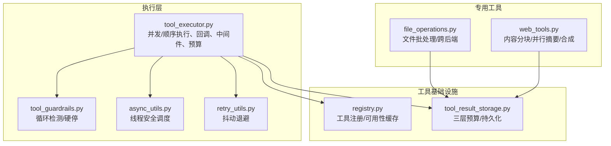
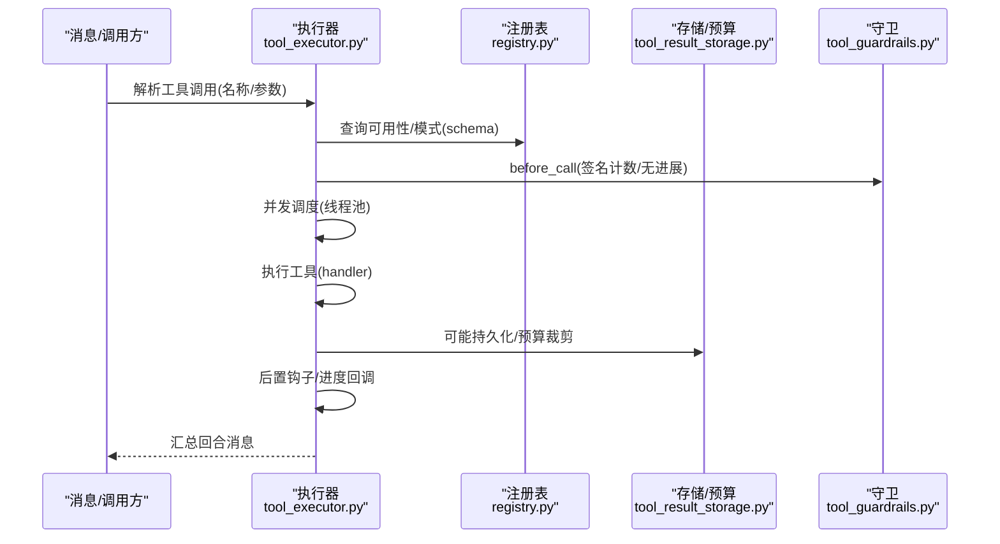
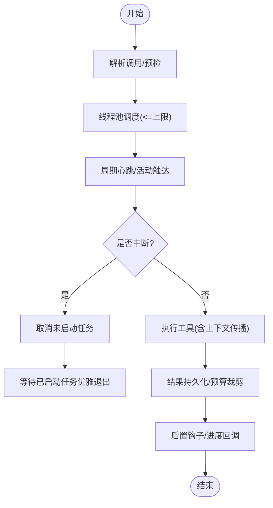
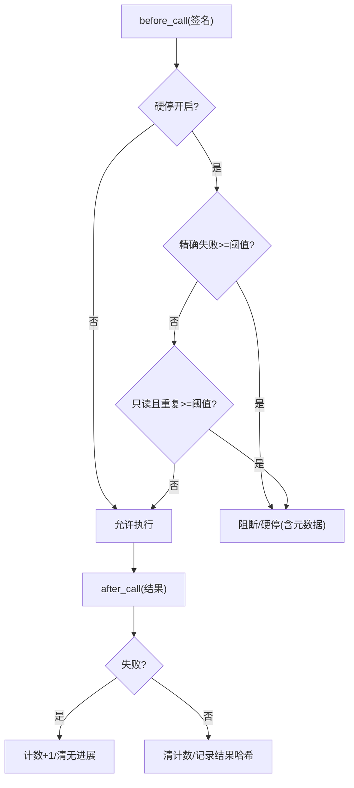
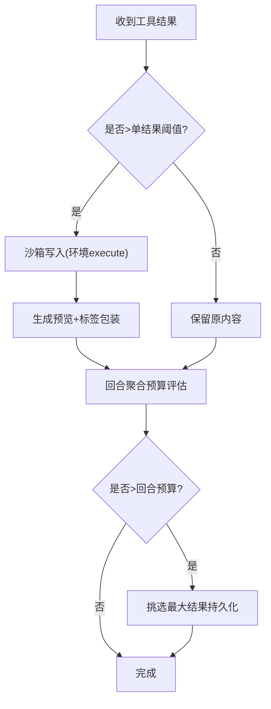
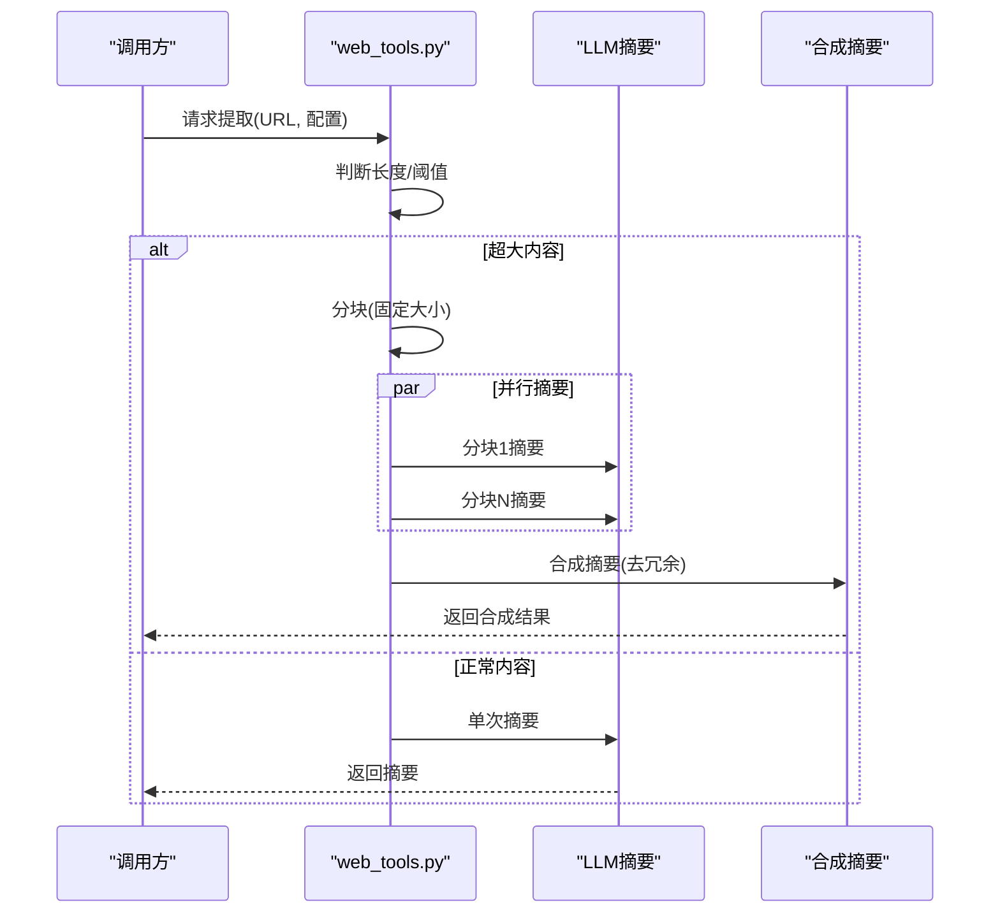
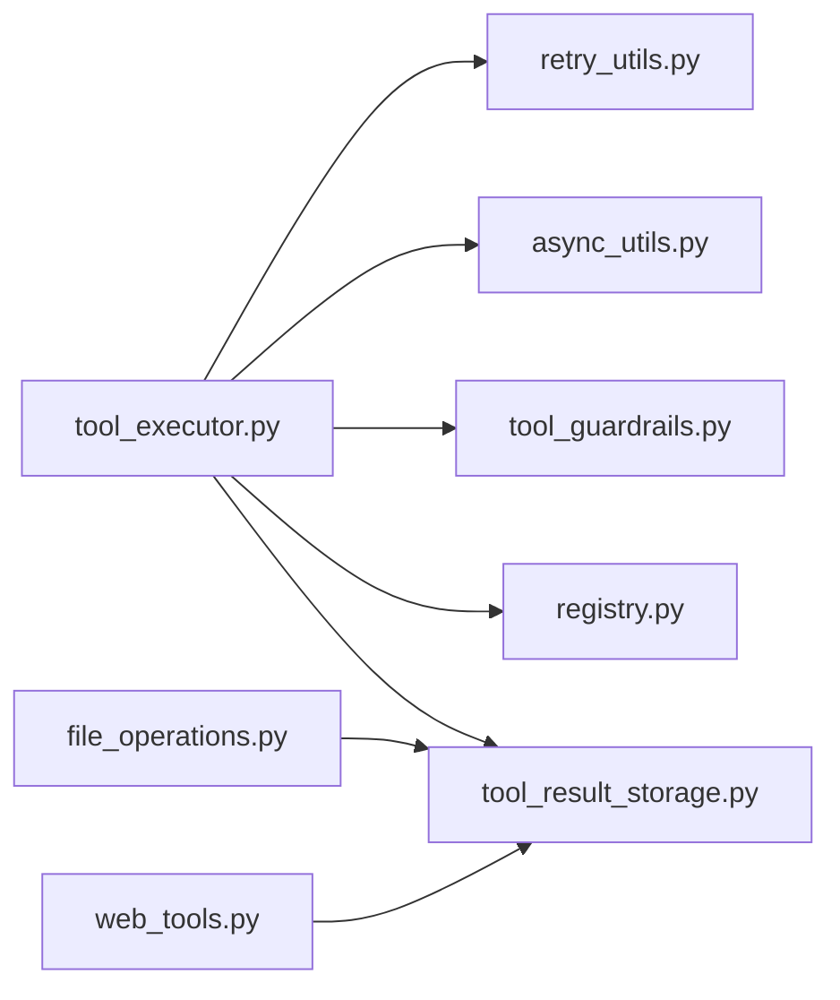

# 工具执行优化

<cite>
**本文引用的文件**
- [agent/tool_executor.py](file://agent/tool_executor.py)
- [agent/async_utils.py](file://agent/async_utils.py)
- [agent/retry_utils.py](file://agent/retry_utils.py)
- [agent/tool_guardrails.py](file://agent/tool_guardrails.py)
- [tools/registry.py](file://tools/registry.py)
- [tools/tool_result_storage.py](file://tools/tool_result_storage.py)
- [tools/file_operations.py](file://tools/file_operations.py)
- [tools/web_tools.py](file://tools/web_tools.py)
</cite>

## 目录
1. [引言](#引言)
2. [项目结构](#项目结构)
3. [核心组件](#核心组件)
4. [架构总览](#架构总览)
5. [详细组件分析](#详细组件分析)
6. [依赖分析](#依赖分析)
7. [性能考虑](#性能考虑)
8. [故障排查指南](#故障排查指南)
9. [结论](#结论)
10. [附录](#附录)

## 引言
本指南聚焦于工具执行的系统性优化，覆盖并发模型（异步桥接、线程池并行调度）、缓存策略（注册表检查函数缓存、结果持久化与预算控制）、生命周期管理（任务提交、执行监控、结果获取、资源清理）、专用优化（文件批处理、网络请求分块与并行、浏览器自动化时间片管理）、错误处理与容错（重试抖动退避、降级与故障隔离）、性能监控与分析（预算与持久化三层防御、超时与回退策略），以及针对 I/O 密集型、CPU 密集型、网络密集型工具的最佳实践。

## 项目结构
围绕工具执行的关键模块分布如下：
- 执行层：agent/tool_executor.py 提供顺序与并发执行入口，统一回调、中间件、后置钩子与预算控制。
- 并发与异步：agent/async_utils.py 提供线程安全调度与协程泄漏防护；agent/retry_utils.py 提供抖动退避。
- 守卫与容错：agent/tool_guardrails.py 提供循环检测与硬停策略。
- 注册与可用性：tools/registry.py 提供工具注册、动态别名、可用性检查缓存。
- 结果持久化与预算：tools/tool_result_storage.py 提供三层预算控制与磁盘持久化。
- 文件与网络工具：tools/file_operations.py 提供跨后端文件操作与批处理；tools/web_tools.py 提供内容分块与并行摘要合成。

**图表来源**
- [agent/tool_executor.py:243-767](file://agent/tool_executor.py#L243-L767)
- [agent/tool_guardrails.py:224-375](file://agent/tool_guardrails.py#L224-L375)
- [agent/async_utils.py:34-69](file://agent/async_utils.py#L34-L69)
- [agent/retry_utils.py:19-58](file://agent/retry_utils.py#L19-L58)
- [tools/registry.py:126-149](file://tools/registry.py#L126-L149)
- [tools/tool_result_storage.py:122-233](file://tools/tool_result_storage.py#L122-L233)
- [tools/file_operations.py:722-800](file://tools/file_operations.py#L722-L800)
- [tools/web_tools.py:342-714](file://tools/web_tools.py#L342-L714)

**章节来源**
- [agent/tool_executor.py:243-767](file://agent/tool_executor.py#L243-L767)
- [tools/registry.py:126-149](file://tools/registry.py#L126-L149)
- [tools/tool_result_storage.py:122-233](file://tools/tool_result_storage.py#L122-L233)
- [tools/file_operations.py:722-800](file://tools/file_operations.py#L722-L800)
- [tools/web_tools.py:342-714](file://tools/web_tools.py#L342-L714)
- [agent/async_utils.py:34-69](file://agent/async_utils.py#L34-L69)
- [agent/retry_utils.py:19-58](file://agent/retry_utils.py#L19-L58)

## 核心组件
- 并发执行器：支持最大工作线程数限制的线程池并发执行，带周期心跳与用户中断取消；为每个工作线程传播上下文变量与本地回调，确保可中断与可观测。
- 守卫与硬停：基于签名（名称+规范化参数哈希）的失败计数与“无进展”重复检测，支持警告与硬停阈值配置。
- 注册表与可用性缓存：对 check_fn 的 TTL 缓存（约 30 秒）降低外部状态探测开销，并以生成号保证快照一致性。
- 结果持久化与预算：三层预算控制（单结果阈值、环境写入沙箱、回合聚合预算），避免上下文溢出。
- 线程安全调度：在工作线程中调度协程时进行泄漏防护，避免“未等待协程”告警与帧泄漏。
- 抖动退避：指数退避加抖动，避免多会话同时重试引发“惊群”。

**章节来源**
- [agent/tool_executor.py:553-624](file://agent/tool_executor.py#L553-L624)
- [agent/tool_guardrails.py:224-375](file://agent/tool_guardrails.py#L224-L375)
- [tools/registry.py:126-149](file://tools/registry.py#L126-L149)
- [tools/tool_result_storage.py:122-233](file://tools/tool_result_storage.py#L122-L233)
- [agent/async_utils.py:34-69](file://agent/async_utils.py#L34-L69)
- [agent/retry_utils.py:19-58](file://agent/retry_utils.py#L19-L58)

## 架构总览
工具执行从消息解析开始，经过预检（作用域、拦截、守卫）、并发调度、结果持久化与预算控制、后置钩子与进度回调，最终汇总到回合消息流。网络与文件工具在此路径上分别应用各自的优化策略。

**图表来源**
- [agent/tool_executor.py:243-767](file://agent/tool_executor.py#L243-L767)
- [tools/registry.py:337-384](file://tools/registry.py#L337-L384)
- [tools/tool_result_storage.py:122-233](file://tools/tool_result_storage.py#L122-L233)
- [agent/tool_guardrails.py:241-375](file://agent/tool_guardrails.py#L241-L375)

## 详细组件分析

### 并发执行与生命周期管理
- 最大并发：根据待执行数量与上限常量选择工作线程数，避免过度并发。
- 周期心跳：定期更新活动状态，防止网关误判空闲超时。
- 用户中断：在等待期间轮询中断标志，对未启动的任务直接取消，已启动任务等待优雅退出。
- 上下文传播：通过线程上下文传播函数将审批/提升回调与上下文变量注入工作线程，保证工具内部中断感知。
- 生命周期钩子：工具前/后置中间件、进度回调、后置终端钩子用于观测与记录。

**图表来源**
- [agent/tool_executor.py:553-624](file://agent/tool_executor.py#L553-L624)
- [agent/tool_executor.py:462-545](file://agent/tool_executor.py#L462-L545)

**章节来源**
- [agent/tool_executor.py:553-624](file://agent/tool_executor.py#L553-L624)
- [agent/tool_executor.py:462-545](file://agent/tool_executor.py#L462-L545)

### 守卫与容错（循环检测/硬停）
- 签名计数：按“名称+规范化参数哈希”统计精确失败次数，超过阈值触发阻断或硬停。
- 无进展检测：对只读工具检测返回结果哈希重复，避免无效重复。
- 警告与硬停：可配置阈值，支持警告提示与自动硬停，附带元数据便于诊断。
- 失败分类：通用失败分类辅助守卫判断，减少误报。

**图表来源**
- [agent/tool_guardrails.py:241-375](file://agent/tool_guardrails.py#L241-L375)

**章节来源**
- [agent/tool_guardrails.py:224-375](file://agent/tool_guardrails.py#L224-L375)

### 注册表与可用性缓存
- check_fn TTL 缓存：对环境探测类检查函数进行约 30 秒缓存，平衡实时性与性能。
- 生成号快照：注册表维护单调递增生成号，外部调用可按生成号做缓存失效策略。
- 动态模式覆盖：部分工具支持运行时动态模式覆盖，结合配置变更自动失效缓存。

**章节来源**
- [tools/registry.py:126-149](file://tools/registry.py#L126-L149)
- [tools/registry.py:337-384](file://tools/registry.py#L337-L384)

### 结果持久化与预算控制（三层防御）
- 单结果阈值：超过工具注册阈值则写入沙箱并替换为预览+路径引用，写入通过环境执行避免参数列表过长问题。
- 回合聚合预算：当回合内所有结果总字节数超过阈值，优先持久化最大的非持久化结果，直至达标。
- 预览与标签：使用特定标签包裹持久化输出，便于模型侧读取文件时识别。

**图表来源**
- [tools/tool_result_storage.py:122-233](file://tools/tool_result_storage.py#L122-L233)

**章节来源**
- [tools/tool_result_storage.py:122-233](file://tools/tool_result_storage.py#L122-L233)

### 线程安全调度与协程泄漏防护
- 在工作线程中调度协程时捕获异常并关闭协程，避免“未等待协程”告警与帧泄漏。
- 返回 Future 或 None，调用方可安全分支处理。

**章节来源**
- [agent/async_utils.py:34-69](file://agent/async_utils.py#L34-L69)

### 抖动退避与重试
- 指数退避加抖动，结合单调计数与时钟混合种子，避免多会话同时重试导致的“惊群”。
- 支持最大延迟上限，防止无限延长。

**章节来源**
- [agent/retry_utils.py:19-58](file://agent/retry_utils.py#L19-L58)

### 文件操作的批量处理与跨后端一致性
- 统一 Shell 命令接口：通过终端后端 execute 实现跨本地/容器/远程的一致文件 API。
- 批处理与分页：读取支持偏移与限制，搜索支持分页与上下文行，避免一次性传输过大。
- 行尾与 BOM 处理：保持原始行结尾与 UTF-8 BOM，避免补丁与写入时的不一致。
- LSP/内联语法检查：对常见格式提供内联检查，减少子进程开销。

**章节来源**
- [tools/file_operations.py:722-800](file://tools/file_operations.py#L722-L800)
- [tools/file_operations.py:677-720](file://tools/file_operations.py#L677-L720)

### 网络请求的分块与并行摘要合成
- 内容分块：对超大网页内容采用固定大小分块，避免一次性处理导致的超时与高内存占用。
- 并行摘要：各分块独立摘要，失败项容忍，最后进行合成摘要，必要时回退为拼接。
- LLM 辅助压缩：使用辅助模型进行智能摘要，保留关键信息并显著降低 token 使用。
- 超限保护：对超大内容拒绝处理或截断，配合调试会话记录压缩率与耗时。

**图表来源**
- [tools/web_tools.py:342-714](file://tools/web_tools.py#L342-L714)

**章节来源**
- [tools/web_tools.py:342-714](file://tools/web_tools.py#L342-L714)

## 依赖分析
- 执行器依赖注册表查询可用性与模式，依赖守卫进行循环检测，依赖存储进行结果持久化与预算控制，依赖异步工具进行线程安全调度，依赖重试工具进行抖动退避。
- 文件与网络工具在执行路径上共享同一预算与持久化策略，形成统一的上下文窗口治理。

**图表来源**
- [agent/tool_executor.py:243-767](file://agent/tool_executor.py#L243-L767)
- [tools/registry.py:337-384](file://tools/registry.py#L337-L384)
- [tools/tool_result_storage.py:122-233](file://tools/tool_result_storage.py#L122-L233)
- [agent/async_utils.py:34-69](file://agent/async_utils.py#L34-L69)
- [agent/retry_utils.py:19-58](file://agent/retry_utils.py#L19-L58)
- [tools/file_operations.py:722-800](file://tools/file_operations.py#L722-L800)
- [tools/web_tools.py:342-714](file://tools/web_tools.py#L342-L714)

**章节来源**
- [agent/tool_executor.py:243-767](file://agent/tool_executor.py#L243-L767)
- [tools/registry.py:337-384](file://tools/registry.py#L337-L384)
- [tools/tool_result_storage.py:122-233](file://tools/tool_result_storage.py#L122-L233)
- [agent/async_utils.py:34-69](file://agent/async_utils.py#L34-L69)
- [agent/retry_utils.py:19-58](file://agent/retry_utils.py#L19-L58)
- [tools/file_operations.py:722-800](file://tools/file_operations.py#L722-L800)
- [tools/web_tools.py:342-714](file://tools/web_tools.py#L342-L714)

## 性能考虑
- 并发度控制：线程池大小与待执行任务数取最小值，避免过度并发导致上下文切换与锁竞争。
- 心跳与中断：周期心跳防止网关误判空闲；中断快速取消未启动任务，缩短整体时延。
- TTL 缓存：注册表 check_fn 缓存降低外部探测成本；持久化阈值与预览大小可调，平衡精度与吞吐。
- I/O 优化：文件读取分页、搜索分页与上下文行，网络内容分块与并行摘要，避免一次性加载。
- 资源回收：工作线程结束后清理中断位与跟踪集合，避免线程复用污染。

[本节为通用指导，无需具体文件引用]

## 故障排查指南
- 中断与取消：若并发执行被中断，未启动任务会被取消，已启动任务等待优雅退出；检查日志中的取消原因与持续时间。
- 守卫硬停：若出现“重复失败/无进展”硬停，查看守卫决策元数据与阈值配置，调整策略或更换工具路径。
- 沙箱写入失败：若结果未持久化而被内联截断，检查环境执行权限与临时目录可用性；确认阈值与预览大小设置。
- LLM 摘要失败：网络密集型场景下，适当增加辅助模型超时或切换更快模型；必要时回退为截断内容。
- 线程安全：若出现协程泄漏告警，确认使用线程安全调度封装；检查事件循环状态与调度失败路径。

**章节来源**
- [agent/tool_executor.py:591-604](file://agent/tool_executor.py#L591-L604)
- [agent/tool_guardrails.py:306-319](file://agent/tool_guardrails.py#L306-L319)
- [tools/tool_result_storage.py:160-178](file://tools/tool_result_storage.py#L160-L178)
- [tools/web_tools.py:421-439](file://tools/web_tools.py#L421-L439)
- [agent/async_utils.py:34-69](file://agent/async_utils.py#L34-L69)

## 结论
通过并发执行与生命周期管理、注册表可用性缓存、三层预算与持久化、守卫硬停与抖动退避、以及文件与网络工具的专用优化，系统在复杂工具链路中实现了高吞吐、低风险与可诊断的执行体验。建议在实际部署中结合业务特征调优并发度、预算阈值与重试策略，并利用守卫与调试会话持续监控瓶颈与异常。

[本节为总结，无需具体文件引用]

## 附录
- 不同类型工具的优化要点
  - I/O 密集型：启用分页/分块、TTL 缓存、线程池并发；避免一次性加载。
  - CPU 密集型：减少不必要的 JSON 解析与字符串拼接，使用内联语法检查替代昂贵子进程。
  - 网络密集型：内容分块与并行摘要、合理超时与重试、辅助模型超时配置、失败回退策略。

[本节为通用指导，无需具体文件引用]