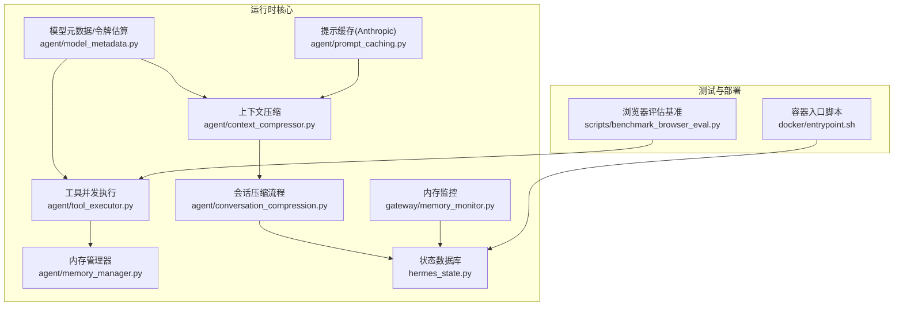
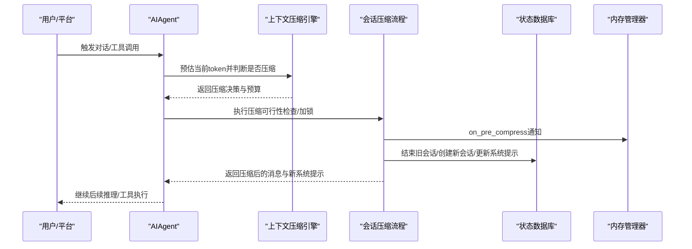
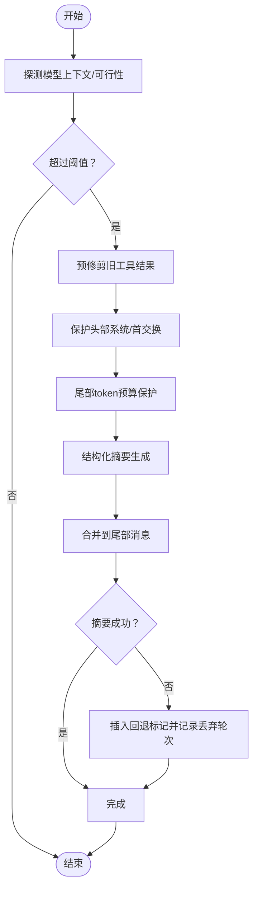
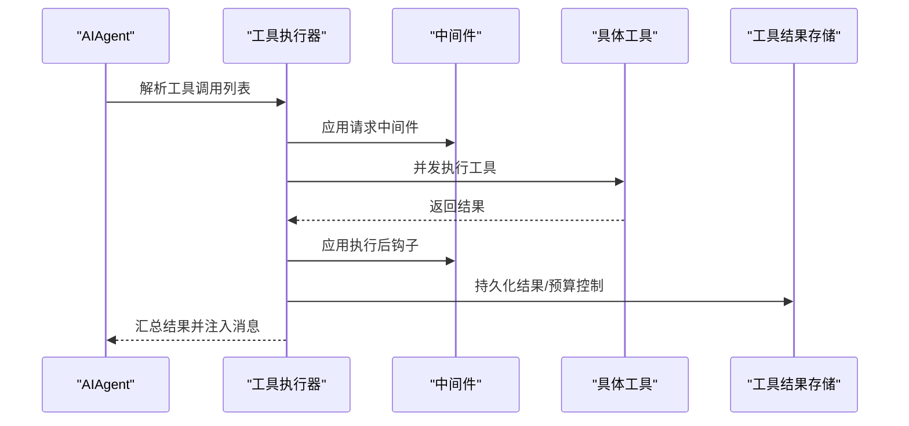
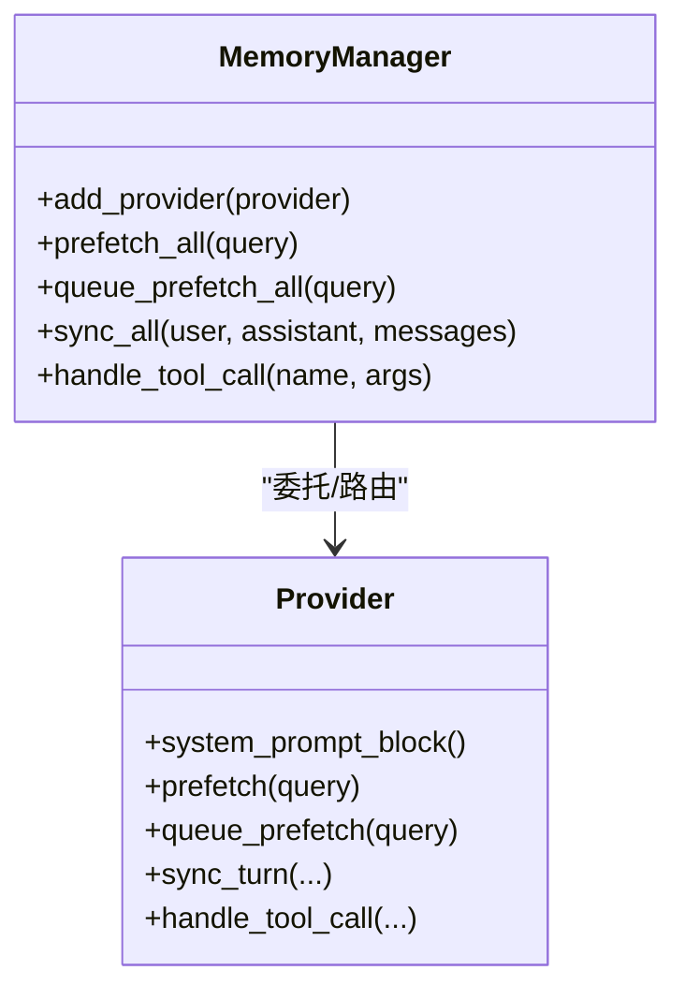
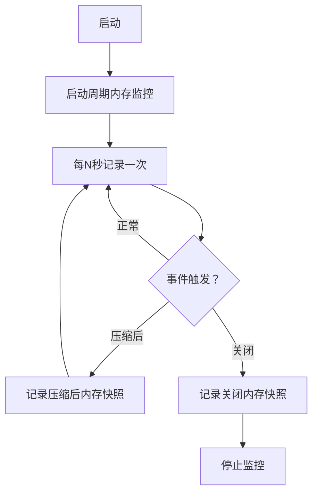
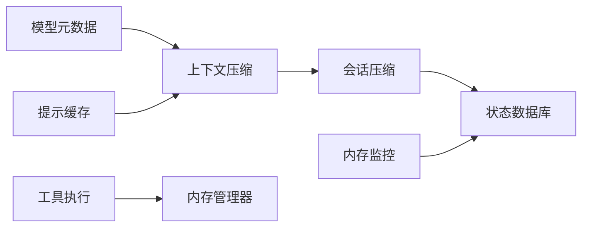

# 性能优化

<cite>
**本文档引用的文件**
- [agent/context_compressor.py](file://agent/context_compressor.py)
- [agent/conversation_compression.py](file://agent/conversation_compression.py)
- [agent/tool_executor.py](file://agent/tool_executor.py)
- [agent/memory_manager.py](file://agent/memory_manager.py)
- [gateway/memory_monitor.py](file://gateway/memory_monitor.py)
- [agent/model_metadata.py](file://agent/model_metadata.py)
- [agent/prompt_caching.py](file://agent/prompt_caching.py)
- [hermes_state.py](file://hermes_state.py)
- [scripts/benchmark_browser_eval.py](file://scripts/benchmark_browser_eval.py)
- [docker/entrypoint.sh](file://docker/entrypoint.sh)
</cite>

## 目录
1. [简介](#简介)
2. [项目结构](#项目结构)
3. [核心组件](#核心组件)
4. [架构总览](#架构总览)
5. [详细组件分析](#详细组件分析)
6. [依赖分析](#依赖分析)
7. [性能考虑](#性能考虑)
8. [故障排查指南](#故障排查指南)
9. [结论](#结论)
10. [附录](#附录)

## 简介
本技术指南聚焦于系统性能优化，覆盖启动时间、内存使用、网络请求、上下文压缩、工具执行并发与缓存、大模型推理优化、资源监控与指标采集、多部署环境调优以及性能测试与基准测试方法。文档基于仓库中的实际实现进行分析，并提供可操作的优化建议与可视化图示。

## 项目结构
围绕性能优化的关键模块分布如下：
- 上下文压缩：agent/context_compressor.py、agent/conversation_compression.py
- 工具执行并发：agent/tool_executor.py
- 内存管理与提供者：agent/memory_manager.py
- 模型元数据与令牌估算：agent/model_metadata.py
- 提示词缓存（Anthropic）：agent/prompt_caching.py
- 数据持久化与状态存储：hermes_state.py
- 运行时内存监控：gateway/memory_monitor.py
- 基准测试脚本：scripts/benchmark_browser_eval.py
- 容器入口脚本：docker/entrypoint.sh

**图表来源**
- [agent/context_compressor.py](file://agent/context_compressor.py)
- [agent/conversation_compression.py](file://agent/conversation_compression.py)
- [agent/tool_executor.py](file://agent/tool_executor.py)
- [agent/memory_manager.py](file://agent/memory_manager.py)
- [agent/model_metadata.py](file://agent/model_metadata.py)
- [agent/prompt_caching.py](file://agent/prompt_caching.py)
- [hermes_state.py](file://hermes_state.py)
- [gateway/memory_monitor.py](file://gateway/memory_monitor.py)
- [scripts/benchmark_browser_eval.py](file://scripts/benchmark_browser_eval.py)
- [docker/entrypoint.sh](file://docker/entrypoint.sh)

**章节来源**
- [agent/context_compressor.py](file://agent/context_compressor.py)
- [agent/conversation_compression.py](file://agent/conversation_compression.py)
- [agent/tool_executor.py](file://agent/tool_executor.py)
- [agent/memory_manager.py](file://agent/memory_manager.py)
- [agent/model_metadata.py](file://agent/model_metadata.py)
- [agent/prompt_caching.py](file://agent/prompt_caching.py)
- [hermes_state.py](file://hermes_state.py)
- [gateway/memory_monitor.py](file://gateway/memory_monitor.py)
- [scripts/benchmark_browser_eval.py](file://scripts/benchmark_browser_eval.py)
- [docker/entrypoint.sh](file://docker/entrypoint.sh)

## 核心组件
- 上下文压缩引擎：通过保护头尾、预算化摘要、迭代更新摘要、图像裁剪与媒体清理等策略降低token占用，保障信息完整性。
- 会话压缩流程：在压缩前进行可行性检查、加锁、通知外部提供者、旋转会话ID、构建新系统提示、清理文件去重缓存等。
- 工具并发执行：线程池并发调度工具调用，支持中断传播、中间件钩子、结果持久化与预算控制。
- 内存管理器：统一接入内置与外部记忆提供者，异步后台同步与预取，避免阻塞主回合并保证写入顺序。
- 模型元数据与令牌估算：提供模型上下文长度探测、默认回退、磁盘缓存、端点元数据拉取与超时策略。
- 提示缓存（Anthropic）：针对Anthropic的prompt caching策略，按布局注入cache_control断点以复用输入文本。
- 状态数据库：SQLite WAL模式、FTS5全文检索、压缩触发的会话拆分、写竞争退避与随机抖动重试。
- 内存监控：周期性记录RSS、GC统计与线程数，便于定位内存泄漏与增长趋势。
- 基准测试：浏览器评估路径对比（WebSocket与子进程），输出均值/中位数/最小/最大耗时与加速比。

**章节来源**
- [agent/context_compressor.py](file://agent/context_compressor.py)
- [agent/conversation_compression.py](file://agent/conversation_compression.py)
- [agent/tool_executor.py](file://agent/tool_executor.py)
- [agent/memory_manager.py](file://agent/memory_manager.py)
- [agent/model_metadata.py](file://agent/model_metadata.py)
- [agent/prompt_caching.py](file://agent/prompt_caching.py)
- [hermes_state.py](file://hermes_state.py)
- [gateway/memory_monitor.py](file://gateway/memory_monitor.py)
- [scripts/benchmark_browser_eval.py](file://scripts/benchmark_browser_eval.py)

## 架构总览
系统采用“压缩-并发-缓存-监控”的性能优化闭环：
- 压缩：在进入阈值前进行预估与可行性检查，避免无效压缩；压缩后重建系统提示并旋转会话ID。
- 并发：工具执行采用线程池并发，结合心跳与中断取消，确保长任务不阻塞。
- 缓存：模型元数据磁盘缓存、端点元数据缓存、提示词缓存（Anthropic）、状态数据库FTS5索引。
- 监控：内存监控周期采样，日志结构化输出，便于趋势分析与问题定位。

**图表来源**
- [agent/context_compressor.py](file://agent/context_compressor.py)
- [agent/conversation_compression.py](file://agent/conversation_compression.py)
- [hermes_state.py](file://hermes_state.py)
- [agent/memory_manager.py](file://agent/memory_manager.py)

## 详细组件分析

### 上下文压缩算法与调优
- 预算化摘要：根据阈值与目标比例计算摘要token上限，保护尾部最近消息，防止固定条数导致的“尾部过短”。
- 多模态内容处理：对图片等媒体进行占位替换与裁剪，避免重复传输大体积数据；对工具调用参数进行安全截断。
- 结构化摘要模板：明确指令边界与参考性质，避免模型将摘要误认为当前任务；支持历史快照与遗留工作区段标题。
- 可靠性与降级：当摘要生成失败时，采用确定性回退标记插入，记录丢弃轮次并允许用户手动重试。
- 迭代更新：在多次压缩中保留先前摘要，逐步累积信息，提升稳定性。

**图表来源**
- [agent/context_compressor.py](file://agent/context_compressor.py)
- [agent/conversation_compression.py](file://agent/conversation_compression.py)

**章节来源**
- [agent/context_compressor.py](file://agent/context_compressor.py)
- [agent/conversation_compression.py](file://agent/conversation_compression.py)

### 工具执行并发与缓存策略
- 并发执行：使用线程池限制最大工作者数量，按工具调用顺序收集结果，支持用户中断时取消未开始的任务。
- 中间件与钩子：在执行前后注入中间件与后置回调，记录时延、状态与错误类型，便于可观测性。
- 结果持久化与预算：工具结果持久化与单轮预算强制，避免无限增长；目录提示注入与多模态内容规范化。
- 资源隔离：为每个工作者线程注册活动回调，确保终端命令等可感知心跳与中断。

**图表来源**
- [agent/tool_executor.py](file://agent/tool_executor.py)

**章节来源**
- [agent/tool_executor.py](file://agent/tool_executor.py)

### 大模型推理优化（批处理、预取、流水线）
- 批处理与预取：通过内存管理器的后台线程执行预取与同步，避免阻塞主回路；单工作线程串行写入，确保时序一致性。
- 流水线：工具执行完成后立即注入消息，缩短等待时间；状态数据库采用WAL模式与随机抖动重试，缓解写竞争。
- 提示缓存（Anthropic）：在系统提示与最后N条非系统消息上注入cache_control断点，减少输入token成本。

**图表来源**
- [agent/memory_manager.py](file://agent/memory_manager.py)

**章节来源**
- [agent/memory_manager.py](file://agent/memory_manager.py)
- [agent/prompt_caching.py](file://agent/prompt_caching.py)
- [hermes_state.py](file://hermes_state.py)

### 资源监控与性能指标采集
- 内存监控：周期性记录RSS、GC计数与线程数，支持在启动、压缩后、关闭时输出标记行，便于趋势分析。
- 日志格式：结构化输出，包含时间戳、RSS、GC统计与线程数，便于grep与自动化分析。
- 状态数据库健康：自动修复FTS5损坏、WAL不可用降级、写竞争退避与随机抖动重试。

**图表来源**
- [gateway/memory_monitor.py](file://gateway/memory_monitor.py)
- [hermes_state.py](file://hermes_state.py)

**章节来源**
- [gateway/memory_monitor.py](file://gateway/memory_monitor.py)
- [hermes_state.py](file://hermes_state.py)

### 不同部署环境下的性能调优建议
- 本地部署：优先使用本地模型服务器，启用磁盘缓存与提示缓存；合理设置工具并发上限，避免CPU/GPU争用。
- 云端部署：选择具备WAL兼容性的存储后端；开启内存监控与日志聚合；利用容器编排的资源配额与HPA。
- 容器化部署：使用s6-overlay的默认ENTRYPOINT，避免旧版入口脚本带来的额外开销；确保状态数据库位于持久卷且具备合适的I/O性能。

**章节来源**
- [docker/entrypoint.sh](file://docker/entrypoint.sh)
- [hermes_state.py](file://hermes_state.py)

### 性能测试与基准测试
- 浏览器评估路径对比：启动Chrome调试端口，分别测试WebSocket监督器与子进程两种路径的Runtime.evaluate延迟，输出均值/中位数/最小/最大与加速比。
- 建议：在CI中定期运行基准脚本，建立基线并监控回归；针对关键路径（如工具执行、上下文压缩、内存管理）制定专项基准。

**章节来源**
- [scripts/benchmark_browser_eval.py](file://scripts/benchmark_browser_eval.py)

## 依赖分析
- 上下文压缩依赖模型元数据进行阈值与预算推导，依赖辅助客户端进行摘要生成。
- 会话压缩流程依赖状态数据库进行会话拆分与旋转，依赖内存管理器进行预压缩通知。
- 工具执行依赖中间件与后置钩子，依赖工具结果存储与预算控制。
- 内存管理器依赖提供者接口，内部使用单工作线程执行后台任务。
- 模型元数据依赖OpenRouter与自定义端点的元数据缓存，提供默认回退与磁盘缓存。
- 状态数据库依赖SQLite WAL/DELETE模式切换与FTS5可用性检测。

**图表来源**
- [agent/model_metadata.py](file://agent/model_metadata.py)
- [agent/context_compressor.py](file://agent/context_compressor.py)
- [agent/conversation_compression.py](file://agent/conversation_compression.py)
- [hermes_state.py](file://hermes_state.py)
- [agent/tool_executor.py](file://agent/tool_executor.py)
- [agent/memory_manager.py](file://agent/memory_manager.py)
- [agent/prompt_caching.py](file://agent/prompt_caching.py)
- [gateway/memory_monitor.py](file://gateway/memory_monitor.py)

**章节来源**
- [agent/model_metadata.py](file://agent/model_metadata.py)
- [agent/context_compressor.py](file://agent/context_compressor.py)
- [agent/conversation_compression.py](file://agent/conversation_compression.py)
- [hermes_state.py](file://hermes_state.py)
- [agent/tool_executor.py](file://agent/tool_executor.py)
- [agent/memory_manager.py](file://agent/memory_manager.py)
- [agent/prompt_caching.py](file://agent/prompt_caching.py)
- [gateway/memory_monitor.py](file://gateway/memory_monitor.py)

## 性能考虑
- 启动时间优化
  - 预估与可行性检查延迟：仅在首次压缩尝试时进行，避免每次会话冷启动开销。
  - 模型元数据缓存：磁盘缓存与端点缓存减少网络请求与解析成本。
  - 状态数据库初始化：自动修复与降级逻辑减少异常恢复时间。
- 内存使用优化
  - 多模态内容裁剪与占位：显著降低传输与存储开销。
  - 内存监控与告警：周期性采样RSS与GC统计，及时发现泄漏。
  - 单工作线程后台同步：避免写入阻塞与竞态。
- 网络请求优化
  - 模型元数据缓存与默认回退：减少探测失败与重试次数。
  - 本地服务器类型检测：针对Ollama/LM Studio/vLLM/llama.cpp提供特定端点探测。
- 推理优化
  - 提示缓存（Anthropic）：减少重复输入token。
  - 工具并发与流水线：缩短等待时间，提升吞吐。
- 存储与I/O
  - SQLite WAL/DELETE自动切换：在不兼容文件系统上自动降级。
  - FTS5可用性检测与警告：避免功能缺失导致的异常路径。

[本节为通用指导，无需列出具体文件来源]

## 故障排查指南
- 上下文压缩失败
  - 现象：摘要生成失败或摘要不可用，系统插入回退标记并记录丢弃轮次。
  - 处理：检查辅助压缩模型配置与上下文长度，必要时降低阈值或更换模型。
- 工具执行卡顿
  - 现象：长时间无心跳或无法中断。
  - 处理：确认中间件与后置钩子未阻塞；检查线程池大小与工作者中断传播。
- 内存泄漏/增长
  - 现象：RSS持续上升。
  - 处理：启用内存监控，查看GC统计与线程数变化；检查提供者与后台任务。
- 状态数据库不可用
  - 现象：WAL不可用或FTS5缺失。
  - 处理：自动降级至DELETE模式；安装含FTS5的Python版本；必要时修复schema。

**章节来源**
- [agent/conversation_compression.py](file://agent/conversation_compression.py)
- [agent/tool_executor.py](file://agent/tool_executor.py)
- [gateway/memory_monitor.py](file://gateway/memory_monitor.py)
- [hermes_state.py](file://hermes_state.py)

## 结论
通过上下文压缩、工具并发、提示缓存、内存监控与状态数据库优化，系统在保证信息完整性与用户体验的前提下实现了显著的性能提升。建议在不同部署环境中结合上述策略进行针对性调优，并持续运行基准测试以监控回归。

[本节为总结性内容，无需列出具体文件来源]

## 附录
- 关键配置与参数
  - 上下文压缩：阈值百分比、摘要目标比例、尾部token预算、摘要最小/最大token限制。
  - 工具并发：最大工作者数量、中断传播、中间件与后置钩子。
  - 内存监控：采样间隔、前置标签（baseline/shutdown）。
  - 状态数据库：WAL/DELETE切换、FTS5可用性检测、写竞争退避参数。
- 基准测试运行
  - 使用浏览器评估脚本对比WebSocket与子进程路径的延迟，输出统计指标与加速比。

**章节来源**
- [agent/context_compressor.py](file://agent/context_compressor.py)
- [agent/tool_executor.py](file://agent/tool_executor.py)
- [gateway/memory_monitor.py](file://gateway/memory_monitor.py)
- [hermes_state.py](file://hermes_state.py)
- [scripts/benchmark_browser_eval.py](file://scripts/benchmark_browser_eval.py)