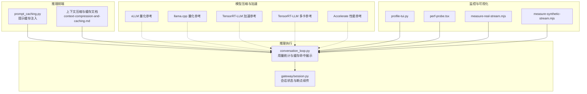
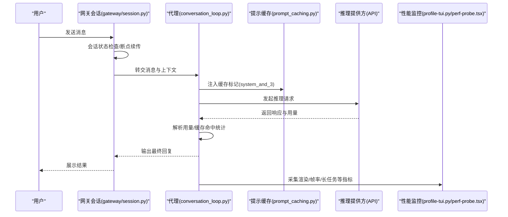
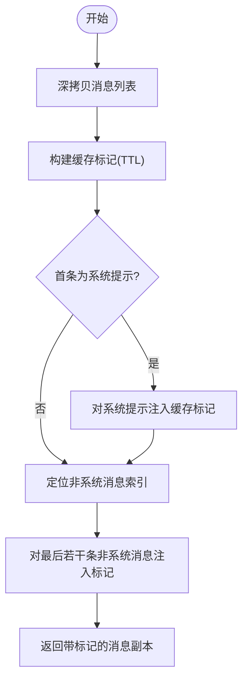
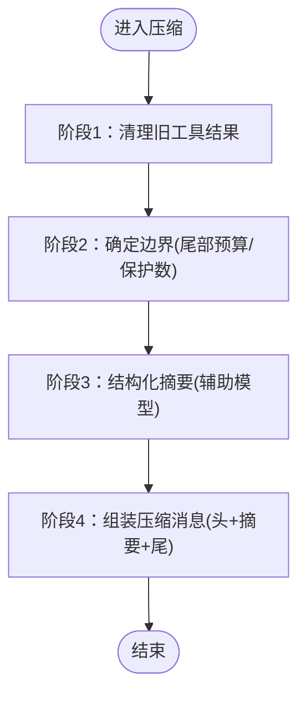
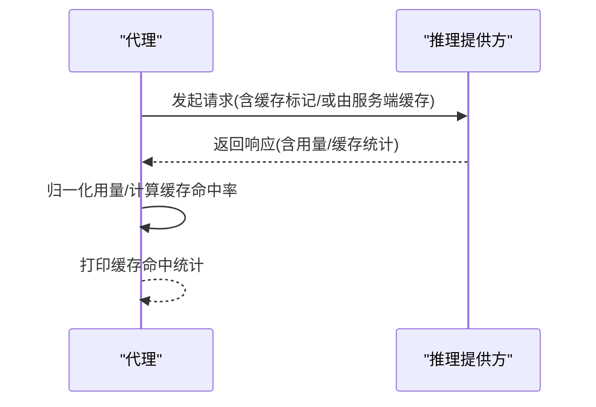
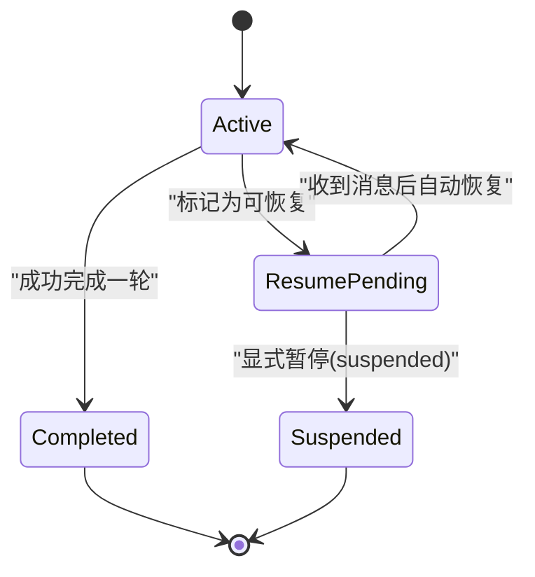
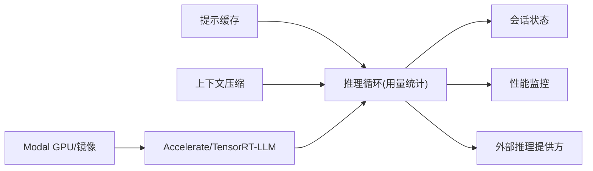

# 模型推理优化

<cite>
**本文引用的文件**
- [prompt_caching.py](file://agent/prompt_caching.py)
- [conversation_loop.py](file://agent/conversation_loop.py)
- [session.py](file://gateway/session.py)
- [context-compression-and-caching.md](file://website/docs/developer-guide/context-compression-and-caching.md)
- [quantization.md（vLLM）](file://skills/mlops/inference/vllm/references/quantization.md)
- [quantization.md（llama.cpp）](file://skills/mlops/inference/llama-cpp/references/quantization.md)
- [optimization.md（TensorRT-LLM）](file://optional-skills/mlops/tensorrt-llm/references/optimization.md)
- [multi-gpu.md（TensorRT-LLM）](file://optional-skills/mlops/tensorrt-llm/references/multi-gpu.md)
- [performance.md（Accelerate）](file://optional-skills/mlops/accelerate/references/performance.md)
- [mlops-modal.md（Modal）](file://website/docs/user-guide/skills/optional/mlops/mlops-modal.md)
- [mlops-accelerate.md（Accelerate 中文）](file://website/i18n/zh-Hans/docusaurus-plugin-content-docs/current/user-guide/skills/optional/mlops/mlops-accelerate.md)
- [profile-tui.py](file://scripts/profile-tui.py)
- [perf-probe.tsx](file://apps/desktop/src/app/chat/perf-probe.tsx)
- [measure-real-stream.mjs](file://apps/desktop/scripts/measure-real-stream.mjs)
- [measure-synthetic-stream.mjs](file://apps/desktop/scripts/measure-synthetic-stream.mjs)
- [test_prompt_caching.py](file://tests/agent/test_prompt_caching.py)
- [test_openrouter_response_cache.py](file://tests/agent/test_openrouter_response_cache.py)
- [test_agent_cache.py](file://tests/gateway/test_agent_cache.py)
- [test_restart_resume_pending.py](file://tests/gateway/test_restart_resume_pending.py)
</cite>

## 目录
1. [引言](#引言)
2. [项目结构](#项目结构)
3. [核心组件](#核心组件)
4. [架构总览](#架构总览)
5. [详细组件分析](#详细组件分析)
6. [依赖分析](#依赖分析)
7. [性能考量](#性能考量)
8. [故障排查指南](#故障排查指南)
9. [结论](#结论)
10. [附录](#附录)

## 引言
本指南聚焦于大模型推理优化，结合仓库中的实际实现与文档，系统阐述性能瓶颈与优化策略，覆盖批处理、预取、流水线、量化与蒸馏、并发推理、缓存策略、状态管理、性能监控与调优，以及跨硬件平台（GPU、TPU、边缘）的适配方案。目标是帮助开发者在保证推理质量的前提下，最大化吞吐与降低时延。

## 项目结构
围绕“推理优化”的关键模块主要分布在以下位置：
- 推理前处理与缓存：agent/prompt_caching.py、website/docs/developer-guide/context-compression-and-caching.md
- 会话与状态管理：gateway/session.py、tests/gateway/test_restart_resume_pending.py
- 推理执行与用量统计：agent/conversation_loop.py
- 模型压缩与量化参考：skills/mlops/inference/vllm/references/quantization.md、skills/mlops/inference/llama-cpp/references/quantization.md
- 推理加速与多卡：optional-skills/mlops/tensorrt-llm/references/optimization.md、optional-skills/mlops/tensorrt-llm/references/multi-gpu.md
- 分布式与混合精度：optional-skills/mlops/accelerate/references/performance.md
- 平台与容器化：website/docs/user-guide/skills/optional/mlops/mlops-modal.md、website/i18n/zh-Hans/.../mlops-accelerate.md
- 性能监控与可视化：scripts/profile-tui.py、apps/desktop/src/app/chat/perf-probe.tsx、apps/desktop/scripts/measure-real-stream.mjs、apps/desktop/scripts/measure-synthetic-stream.mjs
- 测试与验证：tests/agent/test_prompt_caching.py、tests/agent/test_openrouter_response_cache.py、tests/gateway/test_agent_cache.py

图表来源
- [prompt_caching.py:1-80](file://agent/prompt_caching.py#L1-L80)
- [conversation_loop.py:1890-1930](file://agent/conversation_loop.py#L1890-L1930)
- [session.py:1018-1069](file://gateway/session.py#L1018-L1069)
- [context-compression-and-caching.md:1-377](file://website/docs/developer-guide/context-compression-and-caching.md#L1-L377)
- [quantization.md（vLLM）:265-285](file://skills/mlops/inference/vllm/references/quantization.md#L265-L285)
- [quantization.md（llama.cpp）:40-127](file://skills/mlops/inference/llama-cpp/references/quantization.md#L40-L127)
- [optimization.md（TensorRT-LLM）:74-126](file://optional-skills/mlops/tensorrt-llm/references/optimization.md#L74-L126)
- [multi-gpu.md（TensorRT-LLM）:290-299](file://optional-skills/mlops/tensorrt-llm/references/multi-gpu.md#L290-L299)
- [performance.md（Accelerate）:514-526](file://optional-skills/mlops/accelerate/references/performance.md#L514-L526)
- [profile-tui.py:116-520](file://scripts/profile-tui.py#L116-L520)
- [perf-probe.tsx:45-85](file://apps/desktop/src/app/chat/perf-probe.tsx#L45-L85)
- [measure-real-stream.mjs:205-240](file://apps/desktop/scripts/measure-real-stream.mjs#L205-L240)
- [measure-synthetic-stream.mjs:226-258](file://apps/desktop/scripts/measure-synthetic-stream.mjs#L226-L258)

章节来源
- [prompt_caching.py:1-80](file://agent/prompt_caching.py#L1-L80)
- [conversation_loop.py:1890-1930](file://agent/conversation_loop.py#L1890-L1930)
- [session.py:1018-1069](file://gateway/session.py#L1018-L1069)
- [context-compression-and-caching.md:1-377](file://website/docs/developer-guide/context-compression-and-caching.md#L1-L377)

## 核心组件
- 提示缓存（Prompt Caching）：通过在消息中注入缓存标记，复用系统提示与最近若干轮对话片段，显著降低输入 token 成本。
- 上下文压缩（Context Compression）：在会话阈值触发时，对中间历史进行结构化摘要，保留尾部高价值内容，减少上下文长度。
- 用量统计与缓存命中展示：在每次 API 调用后，汇总 prompt/completion/token 用量，并输出缓存命中统计。
- 会话状态与断点续传：维护会话键到会话 ID 的映射，支持重启后自动恢复，避免中断丢失。
- 模型压缩与量化参考：提供 vLLM、llama.cpp 等路径的量化流程与评估方法，指导在不同场景选择合适的精度与格式。
- 推理加速与多卡：TensorRT-LLM 的流水线、Speculative Decoding、CUDA Graphs、KV 缓存分页等；多卡部署最佳实践。
- 分布式与混合精度：Accelerate 的混合精度、梯度裁剪、自定义 AllReduce 等高级技巧。
- 性能监控与可视化：端到端帧率、渲染阶段耗时、长任务与突变频率等指标采集与报告。

章节来源
- [prompt_caching.py:1-80](file://agent/prompt_caching.py#L1-L80)
- [context-compression-and-caching.md:1-377](file://website/docs/developer-guide/context-compression-and-caching.md#L1-L377)
- [conversation_loop.py:1890-1930](file://agent/conversation_loop.py#L1890-L1930)
- [session.py:1018-1069](file://gateway/session.py#L1018-L1069)
- [quantization.md（vLLM）:265-285](file://skills/mlops/inference/vllm/references/quantization.md#L265-L285)
- [quantization.md（llama.cpp）:40-127](file://skills/mlops/inference/llama-cpp/references/quantization.md#L40-L127)
- [optimization.md（TensorRT-LLM）:74-126](file://optional-skills/mlops/tensorrt-llm/references/optimization.md#L74-L126)
- [multi-gpu.md（TensorRT-LLM）:290-299](file://optional-skills/mlops/tensorrt-llm/references/multi-gpu.md#L290-L299)
- [performance.md（Accelerate）:514-526](file://optional-skills/mlops/accelerate/references/performance.md#L514-L526)
- [profile-tui.py:116-520](file://scripts/profile-tui.py#L116-L520)
- [perf-probe.tsx:45-85](file://apps/desktop/src/app/chat/perf-probe.tsx#L45-L85)
- [measure-real-stream.mjs:205-240](file://apps/desktop/scripts/measure-real-stream.mjs#L205-L240)
- [measure-synthetic-stream.mjs:226-258](file://apps/desktop/scripts/measure-synthetic-stream.mjs#L226-L258)

## 架构总览
下图展示了从用户输入到推理完成的端到端路径，以及关键优化点的落位。

图表来源
- [session.py:1018-1069](file://gateway/session.py#L1018-L1069)
- [conversation_loop.py:1890-1930](file://agent/conversation_loop.py#L1890-L1930)
- [prompt_caching.py:49-80](file://agent/prompt_caching.py#L49-L80)
- [profile-tui.py:116-520](file://scripts/profile-tui.py#L116-L520)
- [perf-probe.tsx:45-85](file://apps/desktop/src/app/chat/perf-probe.tsx#L45-L85)

## 详细组件分析

### 提示缓存（Prompt Caching）
- 策略：system_and_3，最多 4 个缓存断点（系统提示 + 最近 3 条非系统消息），统一 TTL（5 分钟或 1 小时）。
- 实现要点：深拷贝消息，按内容类型（字符串/列表/空）将缓存标记注入到合适位置；支持原生 Anthropic 行为。
- 与用量统计联动：在每次成功请求后，打印缓存读写 token 数与命中百分比，便于观测收益。

图表来源
- [prompt_caching.py:15-80](file://agent/prompt_caching.py#L15-L80)

章节来源
- [prompt_caching.py:1-80](file://agent/prompt_caching.py#L1-L80)
- [conversation_loop.py:1890-1930](file://agent/conversation_loop.py#L1890-L1930)
- [context-compression-and-caching.md:300-377](file://website/docs/developer-guide/context-compression-and-caching.md#L300-L377)
- [test_prompt_caching.py:126-141](file://tests/agent/test_prompt_caching.py#L126-L141)

### 上下文压缩（Context Compression）
- 双层安全网：网关会话卫生阈值（85%）作为兜底；代理内部压缩阈值（默认 50%）为主控。
- 算法四阶段：清理旧工具结果、确定边界（尾部预算/固定保护数）、结构化摘要、组装压缩后的消息。
- 迭代更新：后续压缩基于上次摘要增量更新，保留跨轮次信息。
- 配置参数：启用开关、阈值比例、尾部预算占比、保护消息数量等。

图表来源
- [context-compression-and-caching.md:143-240](file://website/docs/developer-guide/context-compression-and-caching.md#L143-L240)

章节来源
- [context-compression-and-caching.md:1-377](file://website/docs/developer-guide/context-compression-and-caching.md#L1-L377)

### 用量统计与缓存命中展示
- 在每次 API 成功后，解析 canonical_usage，提取缓存读取/写入 token 数，计算命中率并在日志中展示。
- 该机制对支持服务端前缀缓存的提供商（OpenAI/Kimi/DeepSeek/Qwen 等）同样生效，不局限于注入缓存标记的场景。

图表来源
- [conversation_loop.py:1890-1930](file://agent/conversation_loop.py#L1890-L1930)

章节来源
- [conversation_loop.py:1890-1930](file://agent/conversation_loop.py#L1890-L1930)
- [test_openrouter_response_cache.py:255-284](file://tests/agent/test_openrouter_response_cache.py#L255-L284)

### 会话状态与断点续传
- 标记可恢复：在意外退出/重启时，将会话标记为 resume_pending，下次同一会话键自动恢复，保留历史与会话 ID。
- 清除逻辑：成功完成一轮对话后清除标志，确保不会误恢复。
- 恢复策略：优先保留现有会话，避免强制新建导致历史丢失；显式暂停（suspended）优先级更高。

图表来源
- [session.py:1018-1069](file://gateway/session.py#L1018-L1069)
- [test_restart_resume_pending.py:328-352](file://tests/gateway/test_restart_resume_pending.py#L328-L352)

章节来源
- [session.py:1018-1069](file://gateway/session.py#L1018-L1069)
- [test_restart_resume_pending.py:229-352](file://tests/gateway/test_restart_resume_pending.py#L229-L352)

### 模型压缩与量化（vLLM/llama.cpp）
- vLLM 量化参考：提供评估基线与量化模型的对比流程，建议以准确度退化百分比作为验收标准。
- llama.cpp 量化参考：涵盖 Hugging Face 到 GGUF 转换、批量量化、K-Quant 方法与质量测试（困惑度）。

章节来源
- [quantization.md（vLLM）:265-285](file://skills/mlops/inference/vllm/references/quantization.md#L265-L285)
- [quantization.md（llama.cpp）:40-127](file://skills/mlops/inference/llama-cpp/references/quantization.md#L40-L127)

### 推理加速与多卡（TensorRT-LLM）
- 流水线与并行：动态批处理吞吐提升 4-8×，GPU 利用率 80-95%。
- Paged KV Cache：虚拟内存式管理 KV 缓存，支持更长序列、减少碎片、提高吞吐。
- Speculative Decoding：使用小草稿模型并行预测多个 token，显著缩短长生成时延。
- CUDA Graphs：减少内核启动开销。
- 多卡最佳实践：优先张量并行（TP）而非流水并行（PP），使用 NVLink/IB，从小 TP 开始，监控 GPU 平衡，优先 FP8（H100）。

章节来源
- [optimization.md（TensorRT-LLM）:74-126](file://optional-skills/mlops/tensorrt-llm/references/optimization.md#L74-L126)
- [multi-gpu.md（TensorRT-LLM）:290-299](file://optional-skills/mlops/tensorrt-llm/references/multi-gpu.md#L290-L299)

### 分布式与混合精度（Accelerate）
- 混合精度：动态损失缩放、梯度裁剪、优化器步进与缩放跟踪。
- 自定义分布式：梯度压缩 + AllReduce 等高级策略。
- 网络带宽检测：NVLink 带宽测试，指导拓扑优化。

章节来源
- [performance.md（Accelerate）:514-526](file://optional-skills/mlops/accelerate/references/performance.md#L514-L526)

### 平台与容器化（Modal）
- GPU 选型与规格：T4/A10G/L40S/H100/H200/B200 等，支持多卡与回退策略。
- 容器镜像：从 CUDA 基础镜像构建，安装系统包与 Python 依赖。
- 持久存储：模型卷持久化与提交。

章节来源
- [mlops-modal.md（Modal）:133-200](file://website/docs/user-guide/skills/optional/mlops/mlops-modal.md#L133-L200)
- [mlops-accelerate.md（Accelerate 中文）:326-350](file://website/i18n/zh-Hans/docusaurus-plugin-content-docs/current/user-guide/skills/optional/mlops/mlops-accelerate.md#L326-L350)

### 性能监控与调优
- TUI 性能分析：解析帧事件与 React 渲染阶段，输出各阶段耗时分布、未归因时间、补丁数、写入字节、背压帧数等。
- 前端性能探针：React Profiler 采样与统计，支持流式驱动压测。
- 实时/合成流测量：帧间隔直方、长任务、突变频率与字符增长速率等。

章节来源
- [profile-tui.py:116-520](file://scripts/profile-tui.py#L116-L520)
- [perf-probe.tsx:45-85](file://apps/desktop/src/app/chat/perf-probe.tsx#L45-L85)
- [measure-real-stream.mjs:205-240](file://apps/desktop/scripts/measure-real-stream.mjs#L205-L240)
- [measure-synthetic-stream.mjs:226-258](file://apps/desktop/scripts/measure-synthetic-stream.mjs#L226-L258)

## 依赖分析
- 组件耦合与协作
  - 提示缓存与用量统计：提示缓存影响输入 token，进而影响用量与缓存命中；用量统计贯穿推理循环，形成可观测闭环。
  - 上下文压缩与提示缓存：压缩会破坏缓存前缀匹配，但系统提示缓存通常不受影响；滚动窗口会在 1-2 轮内重建缓存。
  - 会话状态与压缩：压缩可能改变消息顺序，应避免在缓存窗口内插入/删除消息；断点续传保障恢复一致性。
- 外部依赖与集成点
  - 推理提供方：OpenAI/Kimi/DeepSeek/Qwen 等均支持服务端前缀缓存；Anthropic 支持原生 cache_control。
  - 平台与容器：Modal 提供 GPU 与镜像配置；TensorRT-LLM/加速库提供多卡与混合精度能力。

图表来源
- [prompt_caching.py:1-80](file://agent/prompt_caching.py#L1-L80)
- [conversation_loop.py:1890-1930](file://agent/conversation_loop.py#L1890-L1930)
- [session.py:1018-1069](file://gateway/session.py#L1018-L1069)
- [profile-tui.py:116-520](file://scripts/profile-tui.py#L116-L520)
- [performance.md（Accelerate）:514-526](file://optional-skills/mlops/accelerate/references/performance.md#L514-L526)
- [optimization.md（TensorRT-LLM）:74-126](file://optional-skills/mlops/tensorrt-llm/references/optimization.md#L74-L126)
- [mlops-modal.md（Modal）:133-200](file://website/docs/user-guide/skills/optional/mlops/mlops-modal.md#L133-L200)

## 性能考量
- 批处理与预取
  - 动态批处理：TensorRT-LLM 的动态批处理可将吞吐提升 4-8×，并降低 P50/P99 时延，同时提升 GPU 利用率至 80-95%。
  - 预取与流水线：通过 CUDA Graphs 减少内核启动开销，配合 Paged KV Cache 降低内存碎片，支持更长序列。
- 量化与蒸馏
  - vLLM 量化：以准确度退化百分比作为验收标准，建议控制在 1% 以内方可上线。
  - llama.cpp 量化：K-Quant 混合精度在不同任务上权衡质量与体积；困惑度作为质量指标。
- 并发推理
  - 多实例管理与负载均衡：结合平台 GPU 选型与多卡部署（NVLink/IB），在保证 GPU 利用率均衡的前提下扩展吞吐。
  - 资源调度：根据模型大小与显存上限选择合适的 TP/PP 组合，优先 FP8（H100）获得 2× 速度提升。
- 推理缓存
  - 响应缓存：服务端前缀缓存（OpenAI/Kimi/DeepSeek/Qwen）自动生效，无需客户端干预。
  - 中间结果缓存：提示缓存（system_and_3）与上下文压缩协同，避免在滚动窗口内频繁插入/删除消息。
  - 相似查询重用：保持系统提示稳定、避免中间消息变更，有助于缓存命中。
- 状态管理
  - 会话保持：断点续传仅保留会话 ID 与历史，不强制新建会话；显式暂停优先级更高。
  - 状态同步：压缩与缓存交互需遵循“先压缩再重建缓存窗口”的策略。
  - 断点续传：在重启/崩溃后自动恢复，减少人工干预与数据丢失风险。
- 质量与性能平衡
  - 以准确度退化百分比与困惑度为基准，结合吞吐/时延目标进行权衡；对关键任务优先保证准确度，对批量任务优先追求吞吐。

[本节为通用指导，不直接分析具体文件]

## 故障排查指南
- 缓存命中异常
  - 检查是否正确注入缓存标记（system_and_3）；确认提供方支持服务端前缀缓存。
  - 关注测试用例对缓存状态头的解析与计数逻辑。
- 会话恢复失败
  - 确认会话未被显式暂停（suspended）；检查 resume_pending 标志是否被清除。
  - 验证会话键到会话 ID 的映射是否一致，避免重启后新建会话。
- 性能指标异常
  - 使用 TUI 性能分析脚本与前端探针，关注渲染阶段耗时、长任务、背压帧数与突变频率。
  - 对比实时流与合成流测量结果，定位 UI 卡顿与渲染压力来源。

章节来源
- [test_openrouter_response_cache.py:255-284](file://tests/agent/test_openrouter_response_cache.py#L255-L284)
- [test_agent_cache.py:1558-1591](file://tests/gateway/test_agent_cache.py#L1558-L1591)
- [test_restart_resume_pending.py:229-352](file://tests/gateway/test_restart_resume_pending.py#L229-L352)
- [profile-tui.py:116-520](file://scripts/profile-tui.py#L116-L520)
- [perf-probe.tsx:45-85](file://apps/desktop/src/app/chat/perf-probe.tsx#L45-L85)
- [measure-real-stream.mjs:205-240](file://apps/desktop/scripts/measure-real-stream.mjs#L205-L240)
- [measure-synthetic-stream.mjs:226-258](file://apps/desktop/scripts/measure-synthetic-stream.mjs#L226-L258)

## 结论
通过提示缓存、上下文压缩、用量统计与缓存命中展示、会话断点续传、TensorRT-LLM 加速、多卡与混合精度、以及完善的性能监控体系，可在保证推理质量的前提下显著提升吞吐与降低时延。针对不同硬件平台与部署场景，应结合 GPU 选型、容器化与资源调度策略，持续迭代优化。

[本节为总结性内容，不直接分析具体文件]

## 附录
- 相关参考与示例路径
  - vLLM 量化评估流程：[quantization.md（vLLM）:265-285](file://skills/mlops/inference/vllm/references/quantization.md#L265-L285)
  - llama.cpp 量化与质量测试：[quantization.md（llama.cpp）:40-127](file://skills/mlops/inference/llama-cpp/references/quantization.md#L40-L127)
  - TensorRT-LLM 加速与多卡最佳实践：[optimization.md（TensorRT-LLM）:74-126](file://optional-skills/mlops/tensorrt-llm/references/optimization.md#L74-L126)、[multi-gpu.md（TensorRT-LLM）:290-299](file://optional-skills/mlops/tensorrt-llm/references/multi-gpu.md#L290-L299)
  - Accelerate 性能与网络带宽检测：[performance.md（Accelerate）:514-526](file://optional-skills/mlops/accelerate/references/performance.md#L514-L526)
  - Modal GPU 与容器化：[mlops-modal.md（Modal）:133-200](file://website/docs/user-guide/skills/optional/mlops/mlops-modal.md#L133-L200)
  - 上下文压缩与缓存设计文档：[context-compression-and-caching.md:1-377](file://website/docs/developer-guide/context-compression-and-caching.md#L1-L377)

[本节为补充材料，不直接分析具体文件]