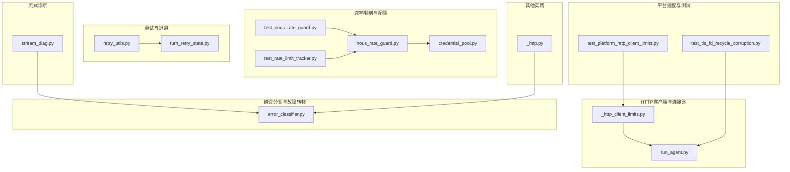
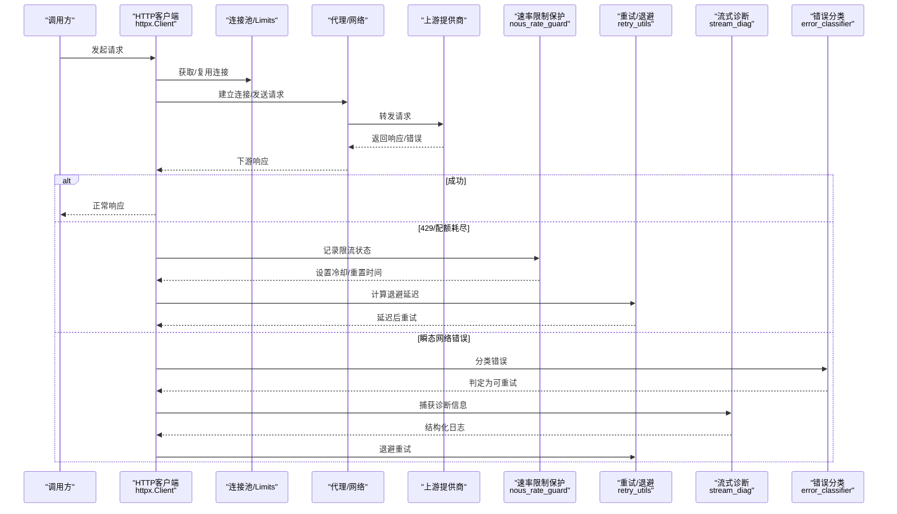
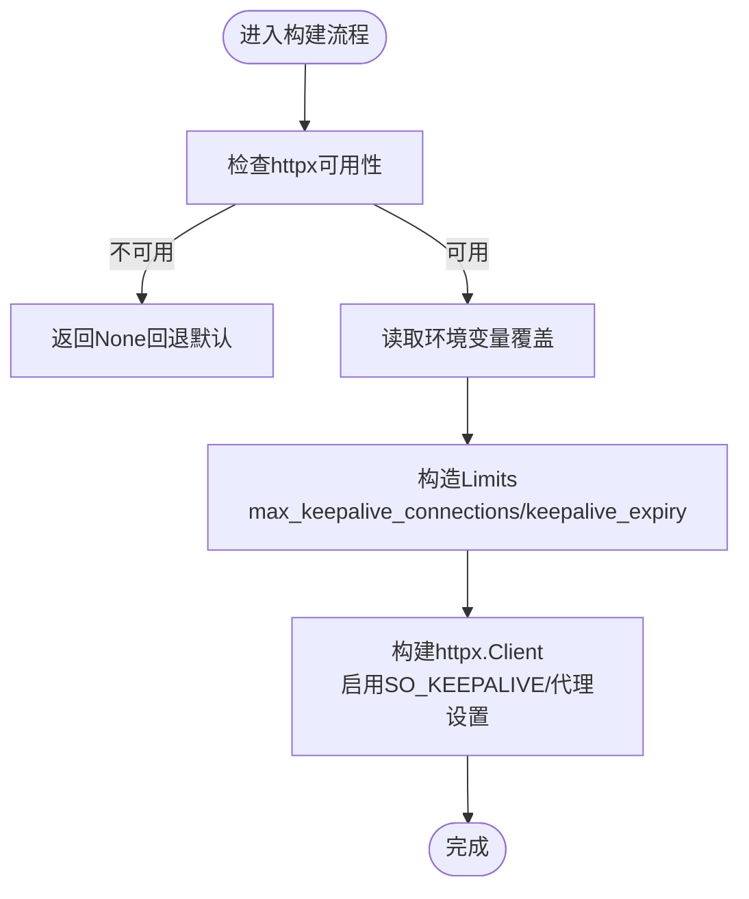
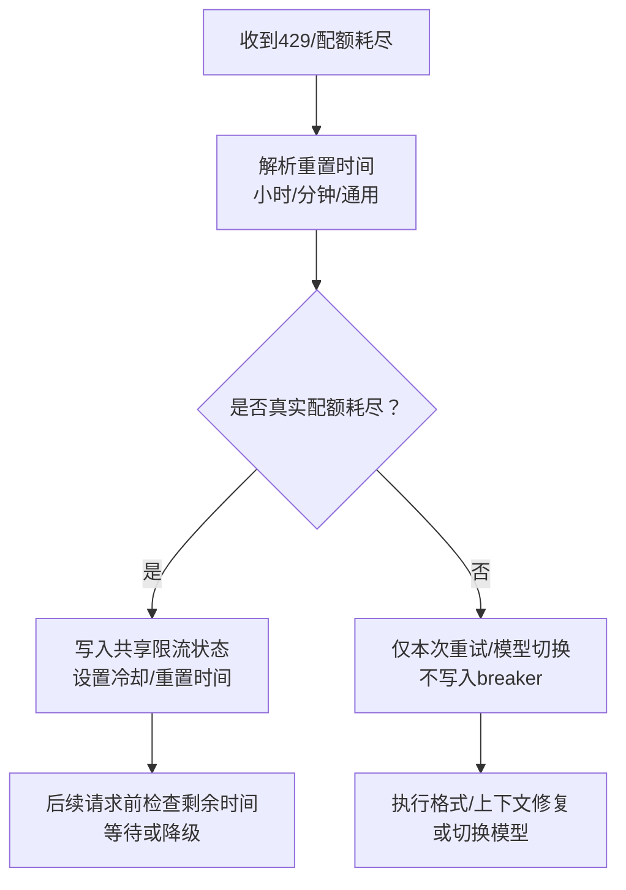
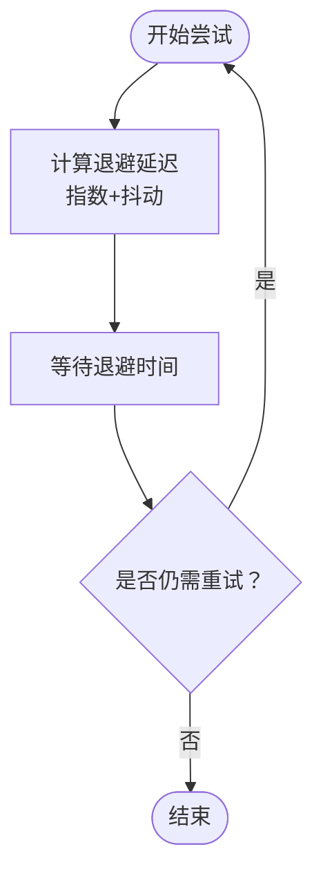
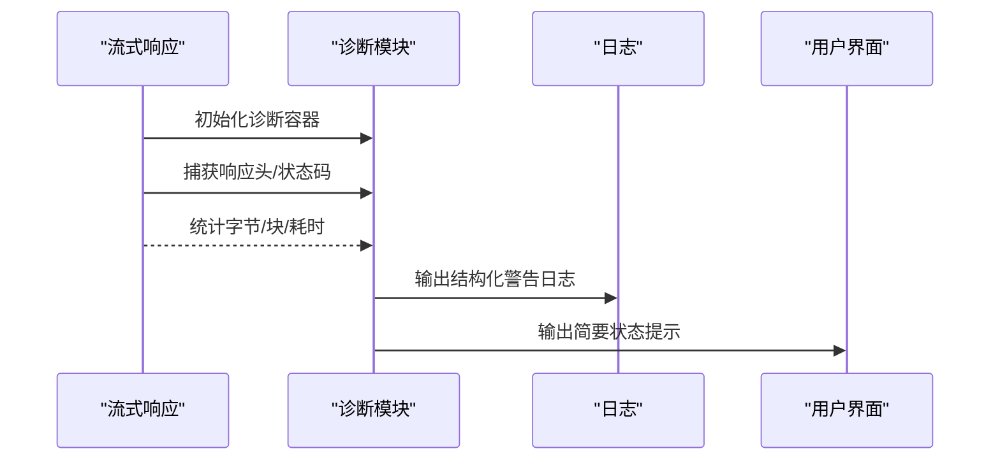
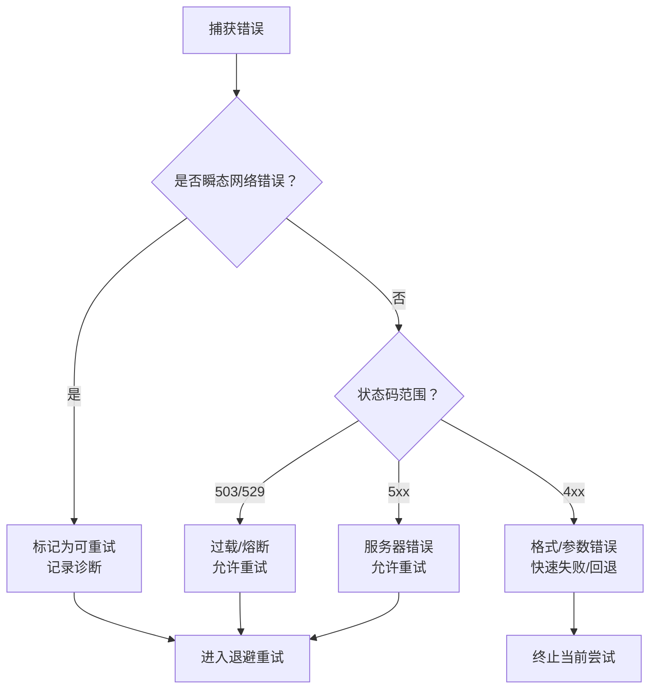
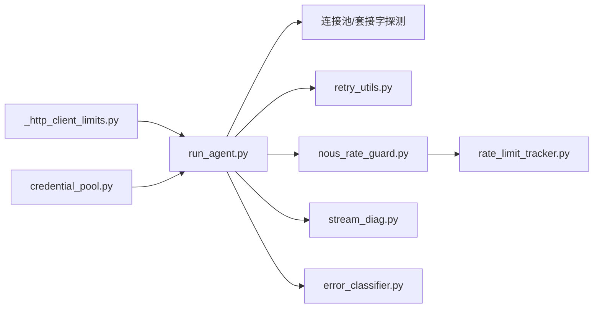

# 网络请求优化

<cite>
**本文引用的文件**
- [agent/runtime_helpers.py](file://agent/agent_runtime_helpers.py)
- [agent/retry_utils.py](file://agent/retry_utils.py)
- [agent/stream_diag.py](file://agent/stream_diag.py)
- [agent/error_classifier.py](file://agent/error_classifier.py)
- [agent/turn_retry_state.py](file://agent/turn_retry_state.py)
- [agent/nous_rate_guard.py](file://agent/nous_rate_guard.py)
- [agent/credential_pool.py](file://agent/credential_pool.py)
- [gateway/platforms/_http_client_limits.py](file://gateway/platforms/_http_client_limits.py)
- [run_agent.py](file://run_agent.py)
- [tests/gateway/test_platform_http_client_limits.py](file://tests/gateway/test_platform_http_client_limits.py)
- [tests/run_agent/test_tls_fd_recycle_corruption.py](file://tests/run_agent/test_tls_fd_recycle_corruption.py)
- [tests/agent/test_nous_rate_guard.py](file://tests/agent/test_nous_rate_guard.py)
- [tests/agent/test_rate_limit_tracker.py](file://tests/agent/test_rate_limit_tracker.py)
- [optional-skills/research/osint-investigation/scripts/_http.py](file://optional-skills/research/osint-investigation/scripts/_http.py)
</cite>

## 目录
1. [引言](#引言)
2. [项目结构](#项目结构)
3. [核心组件](#核心组件)
4. [架构总览](#架构总览)
5. [详细组件分析](#详细组件分析)
6. [依赖分析](#依赖分析)
7. [性能考量](#性能考量)
8. [故障排查指南](#故障排查指南)
9. [结论](#结论)
10. [附录](#附录)

## 引言
本指南聚焦于网络请求的全生命周期优化，覆盖连接建立、请求发送、响应接收、连接关闭等环节，并结合仓库中的实际实现，系统阐述HTTP客户端优化（连接池、超时、重试）、速率限制与配额管理（跨会话保护、动态调整、退避）、异常处理与故障转移（快速失败、优雅降级、自动切换）、以及在不同网络环境下的适配策略。文档同时提供可操作的调优建议与排障路径，帮助在复杂平台与多适配器场景下稳定提升吞吐与可靠性。

## 项目结构
围绕网络优化的关键模块主要分布在以下位置：
- HTTP客户端与连接池：gateway/platforms/_http_client_limits.py、run_agent.py
- 速率限制与配额：agent/nous_rate_guard.py、agent/credential_pool.py、tests/agent/test_nous_rate_guard.py、tests/agent/test_rate_limit_tracker.py
- 重试与退避：agent/retry_utils.py、agent/turn_retry_state.py
- 流式传输诊断：agent/stream_diag.py
- 错误分类与故障转移：agent/error_classifier.py
- 平台适配器示例与测试：tests/gateway/test_platform_http_client_limits.py、tests/run_agent/test_tls_fd_recycle_corruption.py
- 其他网络实践：optional-skills/research/osint-investigation/scripts/_http.py

**图表来源**
- [gateway/platforms/_http_client_limits.py:1-85](file://gateway/platforms/_http_client_limits.py#L1-L85)
- [run_agent.py:3501-3529](file://run_agent.py#L3501-L3529)
- [agent/nous_rate_guard.py:1-326](file://agent/nous_rate_guard.py#L1-L326)
- [agent/credential_pool.py:446-1504](file://agent/credential_pool.py#L446-L1504)
- [agent/retry_utils.py:1-58](file://agent/retry_utils.py#L1-L58)
- [agent/turn_retry_state.py:1-69](file://agent/turn_retry_state.py#L1-L69)
- [agent/stream_diag.py:1-281](file://agent/stream_diag.py#L1-L281)
- [agent/error_classifier.py:713-901](file://agent/error_classifier.py#L713-L901)
- [tests/gateway/test_platform_http_client_limits.py:34-63](file://tests/gateway/test_platform_http_client_limits.py#L34-L63)
- [tests/run_agent/test_tls_fd_recycle_corruption.py:32-69](file://tests/run_agent/test_tls_fd_recycle_corruption.py#L32-L69)
- [optional-skills/research/osint-investigation/scripts/_http.py:44-72](file://optional-skills/research/osint-investigation/scripts/_http.py#L44-L72)

**章节来源**
- [gateway/platforms/_http_client_limits.py:1-85](file://gateway/platforms/_http_client_limits.py#L1-L85)
- [run_agent.py:3501-3529](file://run_agent.py#L3501-L3529)
- [agent/nous_rate_guard.py:1-326](file://agent/nous_rate_guard.py#L1-L326)
- [agent/credential_pool.py:446-1504](file://agent/credential_pool.py#L446-L1504)
- [agent/retry_utils.py:1-58](file://agent/retry_utils.py#L1-L58)
- [agent/turn_retry_state.py:1-69](file://agent/turn_retry_state.py#L1-L69)
- [agent/stream_diag.py:1-281](file://agent/stream_diag.py#L1-L281)
- [agent/error_classifier.py:713-901](file://agent/error_classifier.py#L713-L901)
- [tests/gateway/test_platform_http_client_limits.py:34-63](file://tests/gateway/test_platform_http_client_limits.py#L34-L63)
- [tests/run_agent/test_tls_fd_recycle_corruption.py:32-69](file://tests/run_agent/test_tls_fd_recycle_corruption.py#L32-L69)
- [optional-skills/research/osint-investigation/scripts/_http.py:44-72](file://optional-skills/research/osint-investigation/scripts/_http.py#L44-L72)

## 核心组件
- HTTP客户端与连接池：通过集中化的Limits配置与可选的环境变量覆盖，控制keepalive回收与最大空闲连接数，避免代理环境下CLOSE_WAIT堆积导致FD耗尽。
- 速率限制与配额：跨会话记录Nous Portal限流状态，区分真实配额耗尽与上游瞬时容量不足；同时支持按令牌/请求维度的窗口统计与可视化展示。
- 重试与退避：采用去相关抖动退避，降低并发重试引发的“惊群效应”；配合一次性恢复开关，确保每轮尝试只触发一次特定恢复分支。
- 流式传输诊断：捕获关键上游头信息、状态码、首包时延、字节/块计数，形成结构化日志与用户提示，便于定位边缘节点或下游提供商问题。
- 错误分类与故障转移：基于错误类型链路与状态码进行瞬态/非瞬态判定，结合上下文长度与消息数量判断是否为上下文溢出导致的断连，指导压缩或降级。
- 凭据池与并发：对同一凭据的最大并发进行限制，结合轮询/最少使用策略分摊负载，避免单点过载。

**章节来源**
- [gateway/platforms/_http_client_limits.py:1-85](file://gateway/platforms/_http_client_limits.py#L1-L85)
- [agent/nous_rate_guard.py:1-326](file://agent/nous_rate_guard.py#L1-L326)
- [agent/credential_pool.py:446-1504](file://agent/credential_pool.py#L446-L1504)
- [agent/retry_utils.py:1-58](file://agent/retry_utils.py#L1-L58)
- [agent/turn_retry_state.py:1-69](file://agent/turn_retry_state.py#L1-L69)
- [agent/stream_diag.py:1-281](file://agent/stream_diag.py#L1-L281)
- [agent/error_classifier.py:713-901](file://agent/error_classifier.py#L713-L901)

## 架构总览
下图展示了从请求发起到响应结束的关键交互，以及速率限制、重试、诊断与故障转移的穿插点。

**图表来源**
- [run_agent.py:3501-3529](file://run_agent.py#L3501-L3529)
- [gateway/platforms/_http_client_limits.py:1-85](file://gateway/platforms/_http_client_limits.py#L1-L85)
- [agent/nous_rate_guard.py:71-137](file://agent/nous_rate_guard.py#L71-L137)
- [agent/retry_utils.py:19-58](file://agent/retry_utils.py#L19-L58)
- [agent/stream_diag.py:120-212](file://agent/stream_diag.py#L120-L212)
- [agent/error_classifier.py:713-901](file://agent/error_classifier.py#L713-L901)

## 详细组件分析

### HTTP客户端与连接池优化
- 连接池参数
  - 最大空闲连接数：默认10，可通过环境变量覆盖，避免单适配器过度并行。
  - Keep-Alive过期时间：默认2秒，短于httpx默认值，加速代理场景下CLOSE_WAIT清理，缓解FD压力。
  - 最大并发连接：沿用httpx默认上限，留足余量。
- 环境变量覆盖
  - HERMES_GATEWAY_HTTPX_KEEPALIVE_EXPIRY：自定义keepalive过期时间。
  - HERMES_GATEWAY_HTTPX_MAX_KEEPALIVE：自定义最大空闲连接数。
- 客户端构建
  - 启用SO_KEEPALIVE，按平台设置TCP保活参数，增强长连接健康探测。
  - 显式读取代理配置，尊重NO_PROXY规则，避免代理穿透问题。
- 死连接清理
  - 遍历连接池中的套接字，通过非阻塞peek检测CLOSE_WAIT或异常，必要时重建主客户端以恢复健康状态。

**图表来源**
- [gateway/platforms/_http_client_limits.py:43-84](file://gateway/platforms/_http_client_limits.py#L43-L84)
- [run_agent.py:3512-3529](file://run_agent.py#L3512-L3529)

**章节来源**
- [gateway/platforms/_http_client_limits.py:1-85](file://gateway/platforms/_http_client_limits.py#L1-L85)
- [run_agent.py:3501-3529](file://run_agent.py#L3501-L3529)
- [tests/gateway/test_platform_http_client_limits.py:34-63](file://tests/gateway/test_platform_http_client_limits.py#L34-L63)
- [tests/run_agent/test_tls_fd_recycle_corruption.py:32-69](file://tests/run_agent/test_tls_fd_recycle_corruption.py#L32-L69)

### 速率限制与配额管理
- 跨会话限流保护（Nous）
  - 解析响应头中的重置时间，优先使用小时级RPH窗口；若无则回退至分钟级RPM或通用retry-after。
  - 将限流状态写入共享文件，所有会话共享，避免RPH被多次重试放大。
  - 当429来自上游瞬时容量不足而非账户配额耗尽时，不触发跨会话breaker，防止误伤其他模型。
- 速率桶解析与展示
  - 支持请求/令牌维度的分钟/小时窗口，计算剩余秒数、使用百分比与可视化进度条。
  - 提供紧凑格式用于状态栏显示，便于实时观测。
- 凭据池并发控制
  - 对同一凭据的最大并发进行限制，结合轮询/最少使用策略，避免单凭据成为瓶颈。

**图表来源**
- [agent/nous_rate_guard.py:39-105](file://agent/nous_rate_guard.py#L39-L105)
- [agent/nous_rate_guard.py:192-244](file://agent/nous_rate_guard.py#L192-L244)
- [agent/credential_pool.py:446-1504](file://agent/credential_pool.py#L446-L1504)

**章节来源**
- [agent/nous_rate_guard.py:1-326](file://agent/nous_rate_guard.py#L1-L326)
- [agent/credential_pool.py:446-1504](file://agent/credential_pool.py#L446-L1504)
- [tests/agent/test_nous_rate_guard.py:335-363](file://tests/agent/test_nous_rate_guard.py#L335-L363)
- [tests/agent/test_rate_limit_tracker.py:109-148](file://tests/agent/test_rate_limit_tracker.py#L109-L148)

### 重试与退避策略
- 去相关抖动退避
  - 使用指数增长延迟与随机抖动，种子由时间+单调计数器生成，避免多个会话在同一时刻重试。
  - 支持最大延迟上限，防止雪崩。
- 一次性恢复开关
  - 在一轮尝试中，每个恢复分支（凭据刷新、格式修复、压缩重启等）仅触发一次，避免重复开销与竞态。

**图表来源**
- [agent/retry_utils.py:19-58](file://agent/retry_utils.py#L19-L58)
- [agent/turn_retry_state.py:32-69](file://agent/turn_retry_state.py#L32-L69)

**章节来源**
- [agent/retry_utils.py:1-58](file://agent/retry_utils.py#L1-L58)
- [agent/turn_retry_state.py:1-69](file://agent/turn_retry_state.py#L1-L69)

### 流式传输诊断与可观测性
- 采集指标
  - 首个数据到达时间、累计字节数、累计块数、HTTP状态码、上游响应头（如CF-RAY、OpenRouter标识等）。
- 日志与用户提示
  - 文件日志包含完整链路与诊断细节，用户界面输出简洁提示，便于快速定位是边缘节点问题还是下游提供商波动。
- 异常链路展平
  - 展平SDK包装的底层错误链，快速识别协议错误、连接错误或读取错误的根本原因。

**图表来源**
- [agent/stream_diag.py:41-87](file://agent/stream_diag.py#L41-L87)
- [agent/stream_diag.py:120-212](file://agent/stream_diag.py#L120-L212)
- [agent/stream_diag.py:214-271](file://agent/stream_diag.py#L214-L271)

**章节来源**
- [agent/stream_diag.py:1-281](file://agent/stream_diag.py#L1-L281)

### 错误分类与故障转移
- 分类逻辑
  - 基于错误类型链与状态码，区分瞬态网络错误、服务器错误、请求格式错误、过载/熔断等。
  - 对于可能由上下文过大导致的断连，优先考虑压缩或降级，而非盲目重试。
- 故障转移
  - 对于明确的429，交由速率限制保护模块处理；对于上游503/529，标记为过载并允许重试。
  - 对于4xx且为请求验证错误，快速失败并建议回退到兼容模型或参数。

**图表来源**
- [agent/error_classifier.py:713-901](file://agent/error_classifier.py#L713-L901)

**章节来源**
- [agent/error_classifier.py:713-901](file://agent/error_classifier.py#L713-L901)

### 不同网络环境下的优化策略
- 高延迟/不稳定连接
  - 缩短keepalive过期时间，降低代理层CLOSE_WAIT堆积风险。
  - 启用SO_KEEPALIVE并合理设置保活参数，提升长连接存活率。
  - 使用去相关抖动退避，避免并发重试引发的拥塞。
- 低带宽
  - 控制并发连接与空闲连接上限，避免不必要的连接竞争。
  - 通过流式诊断观察首包时延与吞吐，必要时降低请求体大小或合并请求。
- 上游限流/配额紧张
  - 使用跨会话限流保护，避免重试放大。
  - 结合速率桶展示，动态调整请求节奏与批量化策略。

**章节来源**
- [gateway/platforms/_http_client_limits.py:1-85](file://gateway/platforms/_http_client_limits.py#L1-L85)
- [run_agent.py:3512-3529](file://run_agent.py#L3512-L3529)
- [agent/nous_rate_guard.py:1-326](file://agent/nous_rate_guard.py#L1-L326)
- [agent/retry_utils.py:1-58](file://agent/retry_utils.py#L1-L58)

## 依赖分析
- 组件耦合
  - HTTP客户端与连接池：集中于limits工厂与客户端构建函数，耦合度低，易于替换与测试。
  - 速率限制保护：与错误分类/重试模块协作，形成闭环。
  - 凭据池：独立于HTTP客户端，通过策略选择与并发限制间接影响请求吞吐。
- 外部依赖
  - httpx为可选依赖，工厂函数在导入失败时返回None，保证回退路径可用。
  - 环境变量作为外部配置入口，便于在不修改代码的情况下调参。

**图表来源**
- [gateway/platforms/_http_client_limits.py:43-84](file://gateway/platforms/_http_client_limits.py#L43-L84)
- [run_agent.py:3501-3529](file://run_agent.py#L3501-L3529)
- [agent/retry_utils.py:1-58](file://agent/retry_utils.py#L1-L58)
- [agent/nous_rate_guard.py:1-326](file://agent/nous_rate_guard.py#L1-L326)
- [agent/stream_diag.py:1-281](file://agent/stream_diag.py#L1-L281)
- [agent/error_classifier.py:713-901](file://agent/error_classifier.py#L713-L901)
- [agent/credential_pool.py:446-1504](file://agent/credential_pool.py#L446-L1504)

**章节来源**
- [gateway/platforms/_http_client_limits.py:1-85](file://gateway/platforms/_http_client_limits.py#L1-L85)
- [run_agent.py:3501-3529](file://run_agent.py#L3501-L3529)
- [agent/retry_utils.py:1-58](file://agent/retry_utils.py#L1-L58)
- [agent/nous_rate_guard.py:1-326](file://agent/nous_rate_guard.py#L1-L326)
- [agent/stream_diag.py:1-281](file://agent/stream_diag.py#L1-L281)
- [agent/error_classifier.py:713-901](file://agent/error_classifier.py#L713-L901)
- [agent/credential_pool.py:446-1504](file://agent/credential_pool.py#L446-L1504)

## 性能考量
- 连接复用与FD压力
  - 通过缩短keepalive过期时间与限制最大空闲连接数，降低代理场景下的CLOSE_WAIT堆积，避免FD耗尽。
- 重试抖动与并发控制
  - 去相关抖动退避显著降低重试风暴概率；凭据池并发限制避免单点过载。
- 观测与反馈
  - 流式诊断提供端到端可见性，结合速率桶展示，便于动态调参与容量规划。

[本节为通用指导，无需具体文件引用]

## 故障排查指南
- 连接异常/CLOSE_WAIT堆积
  - 检查keepalive过期时间是否过长；适当缩短并启用SO_KEEPALIVE。
  - 使用死连接清理逻辑探测并重建客户端。
- 429/配额耗尽
  - 查看跨会话限流状态文件是否存在；确认是否为真实配额耗尽还是上游瞬时容量不足。
  - 结合速率桶展示，评估是否需要降低请求频率或切换模型。
- 瞬态网络错误/流中断
  - 查看流式诊断日志，关注CF-RAY、上游Provider标识与首包时延。
  - 使用错误分类结果判断是否应压缩上下文或切换网络出口。
- 重试放大/雪崩
  - 确认退避参数与抖动配置；检查一次性恢复开关是否正确使用，避免重复触发。

**章节来源**
- [agent/agent_runtime_helpers.py:2339-2360](file://agent/agent_runtime_helpers.py#L2339-L2360)
- [agent/nous_rate_guard.py:139-171](file://agent/nous_rate_guard.py#L139-L171)
- [agent/stream_diag.py:120-212](file://agent/stream_diag.py#L120-L212)
- [agent/error_classifier.py:713-901](file://agent/error_classifier.py#L713-L901)
- [agent/retry_utils.py:1-58](file://agent/retry_utils.py#L1-L58)

## 结论
通过集中化的连接池配置、跨会话限流保护、去相关抖动退避、流式诊断与错误分类，本项目在多平台、多适配器场景下实现了稳健的网络请求优化。建议在生产环境中结合实际网络条件与上游SLA，动态调整连接池与退避参数，并持续利用诊断与速率桶进行观测与迭代。

[本节为总结性内容，无需具体文件引用]

## 附录
- 实践参考
  - 低频请求场景：适度放宽keepalive过期时间，减少握手成本。
  - 高并发场景：严格限制最大空闲连接数，启用SO_KEEPALIVE并缩短过期时间。
  - 代理/防火墙密集区域：优先使用较短keepalive过期时间，避免CLOSE_WAIT积压。
  - 速率敏感型任务：启用跨会话限流保护，结合速率桶动态节流。

**章节来源**
- [gateway/platforms/_http_client_limits.py:1-85](file://gateway/platforms/_http_client_limits.py#L1-L85)
- [agent/nous_rate_guard.py:1-326](file://agent/nous_rate_guard.py#L1-L326)
- [agent/retry_utils.py:1-58](file://agent/retry_utils.py#L1-L58)
- [agent/stream_diag.py:1-281](file://agent/stream_diag.py#L1-L281)
- [optional-skills/research/osint-investigation/scripts/_http.py:44-72](file://optional-skills/research/osint-investigation/scripts/_http.py#L44-L72)