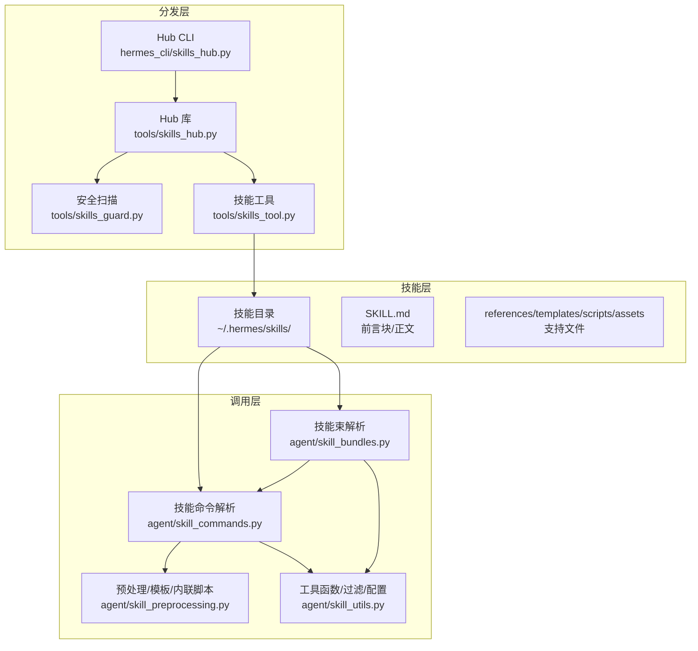
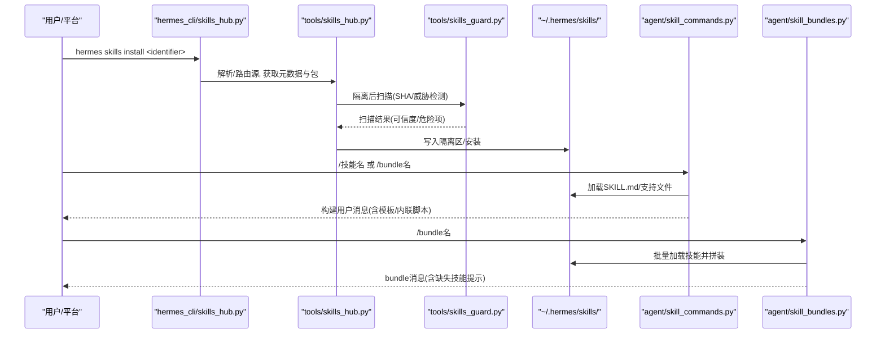
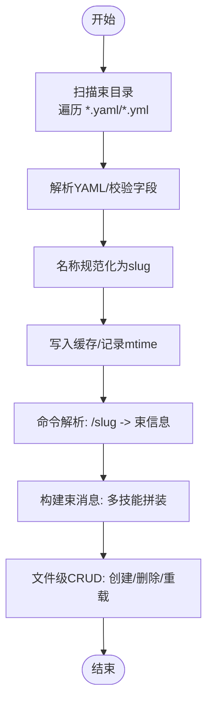
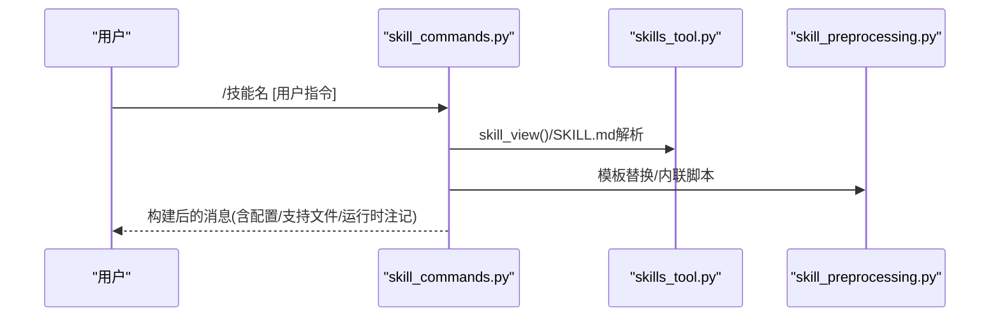
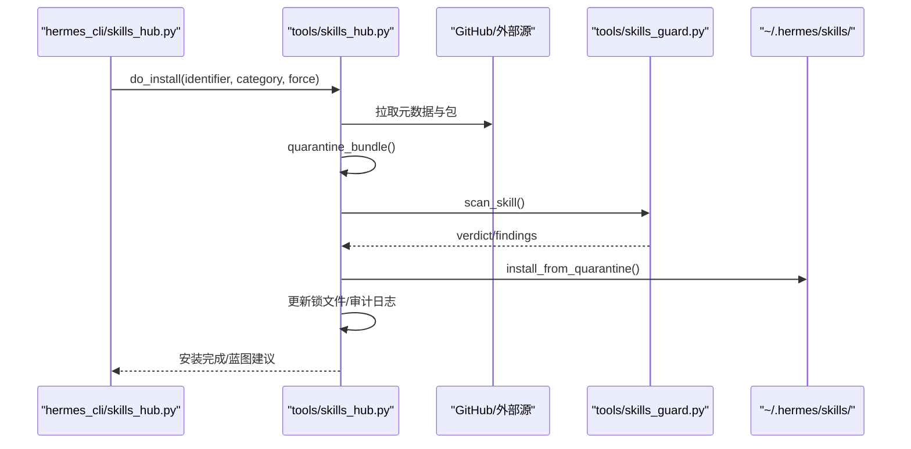
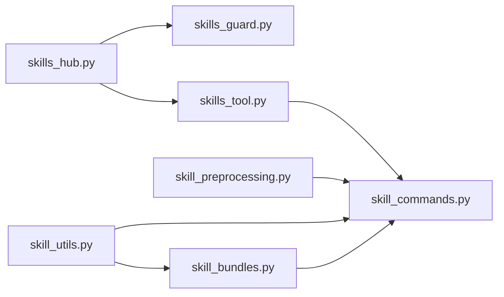

# 技能包与分发

<cite>
**本文引用的文件**
- [agent/skill_bundles.py](file://agent/skill_bundles.py)
- [agent/skill_commands.py](file://agent/skill_commands.py)
- [agent/skill_preprocessing.py](file://agent/skill_preprocessing.py)
- [agent/skill_utils.py](file://agent/skill_utils.py)
- [hermes_cli/bundles.py](file://hermes_cli/bundles.py)
- [tools/skills_tool.py](file://tools/skills_tool.py)
- [hermes_cli/skills_hub.py](file://hermes_cli/skills_hub.py)
- [tools/skills_hub.py](file://tools/skills_hub.py)
- [tools/skills_guard.py](file://tools/skills_guard.py)
- [optional-skills/autonomous-ai-agents/antigravity-cli/SKILL.md](file://optional-skills/autonomous-ai-agents/antigravity-cli/SKILL.md)
- [optional-skills/autonomous-ai-agents/blackbox/SKILL.md](file://optional-skills/autonomous-ai-agents/blackbox/SKILL.md)
</cite>

## 目录
1. [引言](#引言)
2. [项目结构](#项目结构)
3. [核心组件](#核心组件)
4. [架构总览](#架构总览)
5. [详细组件分析](#详细组件分析)
6. [依赖分析](#依赖分析)
7. [性能考虑](#性能考虑)
8. [故障排查指南](#故障排查指南)
9. [结论](#结论)
10. [附录](#附录)

## 引言
本文件系统化阐述“技能包与分发”子系统的设计与实现，覆盖以下主题：
- 技能包概念与实现：技能、技能束、外部分发、安全扫描与信任策略
- 技能束的创建、打包与部署流程
- 官方技能库、第三方市场与私有分发策略
- 版本管理与依赖解析（前置条件、环境变量、平台兼容）
- 安装、卸载与更新流程
- 安全验证与完整性校验
- 开发生命周期与发布指南
- 生态建设与维护策略
- 性能影响与优化建议

## 项目结构
该子系统由三层协作构成：
- 技能层：技能目录结构、元数据与内容组织（SKILL.md 前言块、支持文件）
- 调用层：命令解析、消息构建、模板与内联脚本预处理
- 分发层：Hub 源适配器、下载、隔离、扫描、安装与锁文件记录

图示来源
- [tools/skills_tool.py:1-120](file://tools/skills_tool.py#L1-L120)
- [agent/skill_commands.py:1-120](file://agent/skill_commands.py#L1-L120)
- [agent/skill_bundles.py:1-120](file://agent/skill_bundles.py#L1-L120)
- [agent/skill_preprocessing.py:1-120](file://agent/skill_preprocessing.py#L1-L120)
- [agent/skill_utils.py:1-120](file://agent/skill_utils.py#L1-L120)
- [hermes_cli/skills_hub.py:1-120](file://hermes_cli/skills_hub.py#L1-L120)
- [tools/skills_hub.py:1-120](file://tools/skills_hub.py#L1-L120)
- [tools/skills_guard.py:1-120](file://tools/skills_guard.py#L1-L120)

章节来源
- [tools/skills_tool.py:1-120](file://tools/skills_tool.py#L1-L120)
- [agent/skill_commands.py:1-120](file://agent/skill_commands.py#L1-L120)
- [agent/skill_bundles.py:1-120](file://agent/skill_bundles.py#L1-L120)
- [agent/skill_preprocessing.py:1-120](file://agent/skill_preprocessing.py#L1-L120)
- [agent/skill_utils.py:1-120](file://agent/skill_utils.py#L1-L120)
- [hermes_cli/skills_hub.py:1-120](file://hermes_cli/skills_hub.py#L1-L120)
- [tools/skills_hub.py:1-120](file://tools/skills_hub.py#L1-L120)
- [tools/skills_guard.py:1-120](file://tools/skills_guard.py#L1-L120)

## 核心组件
- 技能束模块：负责技能束的发现、加载、消息拼装与 CRUD
- 技能命令模块：负责单技能命令解析、消息构建、用户指令提取
- 预处理模块：负责模板变量替换、内联 Shell 执行与输出截断
- 工具函数模块：负责平台/环境匹配、禁用列表、外部目录、配置变量解析等
- 技能工具模块：负责技能目录扫描、分类、平台/环境过滤、安装路径安全校验
- Hub CLI/库：负责多源搜索、浏览、安装、隔离、扫描与审计日志
- 安全扫描模块：负责威胁模式匹配、信任策略与安装决策

章节来源
- [agent/skill_bundles.py:1-200](file://agent/skill_bundles.py#L1-L200)
- [agent/skill_commands.py:1-200](file://agent/skill_commands.py#L1-L200)
- [agent/skill_preprocessing.py:1-120](file://agent/skill_preprocessing.py#L1-L120)
- [agent/skill_utils.py:1-200](file://agent/skill_utils.py#L1-L200)
- [tools/skills_tool.py:1-200](file://tools/skills_tool.py#L1-L200)
- [hermes_cli/skills_hub.py:1-200](file://hermes_cli/skills_hub.py#L1-L200)
- [tools/skills_hub.py:1-200](file://tools/skills_hub.py#L1-L200)
- [tools/skills_guard.py:1-200](file://tools/skills_guard.py#L1-L200)

## 架构总览
技能从“被发现”到“被使用”的端到端流程如下：

图示来源
- [hermes_cli/skills_hub.py:478-745](file://hermes_cli/skills_hub.py#L478-L745)
- [tools/skills_hub.py:1-200](file://tools/skills_hub.py#L1-L200)
- [tools/skills_guard.py:1-200](file://tools/skills_guard.py#L1-L200)
- [tools/skills_tool.py:687-750](file://tools/skills_tool.py#L687-L750)
- [agent/skill_commands.py:517-562](file://agent/skill_commands.py#L517-L562)
- [agent/skill_bundles.py:253-341](file://agent/skill_bundles.py#L253-L341)

## 详细组件分析

### 技能束模块（agent/skill_bundles.py）
- 存储与发现：技能束位于用户主目录下的技能束目录，文件为 YAML，命名即斜杠命令名
- 命令解析：将用户输入标准化为斜杠命令键，冲突时技能束优先于技能
- 消息构建：按束中列出的技能逐一加载，构建带激活注释的消息体；缺失技能会标注
- 文件级操作：创建/删除/重载，返回变更摘要

图示来源
- [agent/skill_bundles.py:168-245](file://agent/skill_bundles.py#L168-L245)
- [agent/skill_bundles.py:208-341](file://agent/skill_bundles.py#L208-L341)

章节来源
- [agent/skill_bundles.py:1-200](file://agent/skill_bundles.py#L1-L200)
- [agent/skill_bundles.py:200-411](file://agent/skill_bundles.py#L200-L411)

### 技能命令模块（agent/skill_commands.py）
- 命令解析：将用户输入映射为规范斜杠命令键，兼容下划线/连字符差异
- 消息构建：加载技能内容，执行模板替换与内联脚本扩展，注入配置、支持文件清单、运行时注记
- 用户指令提取：从已展开消息中恢复用户原始指令，用于记忆/存储去噪
- 预加载：支持会话级预加载多个技能

图示来源
- [agent/skill_commands.py:418-562](file://agent/skill_commands.py#L418-L562)
- [agent/skill_preprocessing.py:124-141](file://agent/skill_preprocessing.py#L124-L141)
- [tools/skills_tool.py:687-750](file://tools/skills_tool.py#L687-L750)

章节来源
- [agent/skill_commands.py:1-200](file://agent/skill_commands.py#L1-L200)
- [agent/skill_commands.py:200-613](file://agent/skill_commands.py#L200-L613)

### 预处理模块（agent/skill_preprocessing.py）
- 模板变量：支持 HERMES_SKILL_DIR 与 HERMES_SESSION_ID 注入
- 内联脚本：在技能上下文中执行 Bash 命令，限制输出长度，超时保护
- 组合管线：按配置开关启用模板与内联脚本处理

章节来源
- [agent/skill_preprocessing.py:1-141](file://agent/skill_preprocessing.py#L1-L141)

### 工具函数模块（agent/skill_utils.py）
- 平台匹配：基于 frontmatter 的 platforms 字段与系统平台映射
- 环境匹配：kanban/docker/s6 等运行环境标签的探测与缓存
- 禁用列表：全局与平台维度的禁用技能集合
- 外部目录：解析 skills.external_dirs，去重与绝对路径校验
- 配置变量：从 frontmatter 提取 hermes.config 声明，合并默认值与用户配置

章节来源
- [agent/skill_utils.py:1-200](file://agent/skill_utils.py#L1-L200)
- [agent/skill_utils.py:200-500](file://agent/skill_utils.py#L200-L500)
- [agent/skill_utils.py:500-740](file://agent/skill_utils.py#L500-L740)

### 技能工具模块（tools/skills_tool.py）
- 目录扫描：递归扫描 SKILL.md，过滤排除目录与支持目录
- 分类与排序：按类别与名称排序，限制名称/描述长度
- 安全与合规：安装路径规范化与安全校验，防止路径穿越与根目录误删
- 平台/环境：复用 agent/skill_utils 的匹配逻辑

章节来源
- [tools/skills_tool.py:602-750](file://tools/skills_tool.py#L602-L750)
- [tools/skills_tool.py:114-139](file://tools/skills_tool.py#L114-L139)

### Hub 分发与安装（hermes_cli/skills_hub.py 与 tools/skills_hub.py）
- 源适配：统一路由到不同源（官方、GitHub、Marketplace、自定义）
- 浏览/搜索：并行拉取、去重、按信任度排序
- 安装流程：隔离区(quarantine) -> 安全扫描 -> 审核日志 -> 锁文件(lock.json) -> 实际安装
- 名称解析：短名称自动解析，URL 来源可交互或非交互提示

图示来源
- [hermes_cli/skills_hub.py:478-745](file://hermes_cli/skills_hub.py#L478-L745)
- [tools/skills_hub.py:1-200](file://tools/skills_hub.py#L1-L200)
- [tools/skills_guard.py:1-200](file://tools/skills_guard.py#L1-L200)

章节来源
- [hermes_cli/skills_hub.py:1-200](file://hermes_cli/skills_hub.py#L1-L200)
- [hermes_cli/skills_hub.py:200-800](file://hermes_cli/skills_hub.py#L200-L800)
- [tools/skills_hub.py:1-200](file://tools/skills_hub.py#L1-L200)

### 安全扫描（tools/skills_guard.py）
- 威胁模式：覆盖 exfiltration、injection、destructive、persistence、network、obfuscation 六大类
- 信任策略：builtin/trusted/community 三档，dangerous 必须允许或强制通过
- 结果结构：包含技能名、来源、信任级别、判定、发现列表与摘要

章节来源
- [tools/skills_guard.py:1-200](file://tools/skills_guard.py#L1-L200)
- [tools/skills_guard.py:200-400](file://tools/skills_guard.py#L200-L400)

### 技能束 CLI（hermes_cli/bundles.py）
- 列表/查看/创建/删除/重载技能束
- 与 agent/skill_bundles.py 的公共 API 对接

章节来源
- [hermes_cli/bundles.py:1-230](file://hermes_cli/bundles.py#L1-L230)

## 依赖分析
- 组件耦合
  - skill_commands 依赖 skills_tool 与 skill_utils 进行加载与过滤
  - skill_bundles 依赖 skill_commands 的消息构建与技能加载
  - skills_hub 依赖 skills_guard 进行扫描，依赖 skills_tool 进行安装
- 关键依赖链
  - SKILL.md -> skills_tool -> skill_commands -> 预处理/模板/内联脚本 -> 消息
  - Hub 源 -> skills_hub -> skills_guard -> 安装 -> 锁文件/审计日志
- 循环依赖
  - 未见循环导入；模块职责清晰，工具函数模块避免重型依赖链

图示来源
- [agent/skill_commands.py:1-120](file://agent/skill_commands.py#L1-L120)
- [agent/skill_bundles.py:1-120](file://agent/skill_bundles.py#L1-L120)
- [agent/skill_preprocessing.py:1-120](file://agent/skill_preprocessing.py#L1-L120)
- [agent/skill_utils.py:1-120](file://agent/skill_utils.py#L1-L120)
- [tools/skills_tool.py:1-120](file://tools/skills_tool.py#L1-L120)
- [hermes_cli/skills_hub.py:1-120](file://hermes_cli/skills_hub.py#L1-L120)
- [tools/skills_hub.py:1-120](file://tools/skills_hub.py#L1-L120)
- [tools/skills_guard.py:1-120](file://tools/skills_guard.py#L1-L120)

章节来源
- [agent/skill_commands.py:1-120](file://agent/skill_commands.py#L1-L120)
- [agent/skill_bundles.py:1-120](file://agent/skill_bundles.py#L1-L120)
- [agent/skill_preprocessing.py:1-120](file://agent/skill_preprocessing.py#L1-L120)
- [agent/skill_utils.py:1-120](file://agent/skill_utils.py#L1-L120)
- [tools/skills_tool.py:1-120](file://tools/skills_tool.py#L1-L120)
- [hermes_cli/skills_hub.py:1-120](file://hermes_cli/skills_hub.py#L1-L120)
- [tools/skills_hub.py:1-120](file://tools/skills_hub.py#L1-L120)
- [tools/skills_guard.py:1-120](file://tools/skills_guard.py#L1-L120)

## 性能考虑
- 目录扫描与缓存
  - 技能束与技能命令均以目录 mtime 作为新鲜度判断，避免重复扫描
  - 技能工具对配置与外部目录采用按 mtime 缓存，减少 YAML 解析开销
- 消息构建
  - 预处理阶段限制内联脚本输出长度，避免上下文膨胀
  - 支持延迟导入与按需加载，降低模块启动成本
- Hub 并行搜索
  - 多源并行抓取，设置总体超时与逐源进度反馈，提升响应性
- 记忆与去噪
  - 从技能消息中提取用户指令，避免将技能正文写入记忆

章节来源
- [agent/skill_bundles.py:195-245](file://agent/skill_bundles.py#L195-L245)
- [agent/skill_commands.py:418-496](file://agent/skill_commands.py#L418-L496)
- [agent/skill_preprocessing.py:63-122](file://agent/skill_preprocessing.py#L63-L122)
- [hermes_cli/skills_hub.py:330-476](file://hermes_cli/skills_hub.py#L330-L476)
- [agent/skill_commands.py:58-113](file://agent/skill_commands.py#L58-L113)

## 故障排查指南
- 技能束无法加载
  - 检查束文件是否为有效 YAML，skills 列表是否非空且不重复
  - 使用 hermes bundles reload 查看新增/移除项
- 技能束命令冲突
  - 当束与技能同名时，束优先；可通过重命名或使用完整标识符区分
- 安装失败
  - 查看隔离区扫描报告与锁文件记录；确认路径安全与信任级别
  - 若为 URL 来源且缺少 name，需显式指定或交互输入
- 安全扫描阻断
  - 查看扫描报告中的危险项与严重程度；必要时使用 --force 但仅限受控场景
- 平台/环境不匹配
  - 检查 frontmatter 中 platforms/environments 与当前运行环境；Termux 下 linux/ android 标签会被接受

章节来源
- [agent/skill_bundles.py:168-245](file://agent/skill_bundles.py#L168-L245)
- [hermes_cli/skills_hub.py:504-745](file://hermes_cli/skills_hub.py#L504-L745)
- [tools/skills_guard.py:1-200](file://tools/skills_guard.py#L1-L200)
- [agent/skill_utils.py:163-205](file://agent/skill_utils.py#L163-L205)

## 结论
该子系统通过“技能层-调用层-分发层”的清晰分层，实现了从技能发现、消息构建、安全扫描到安装部署的完整闭环。技能束进一步提升了多技能协同的可用性与一致性。通过严格的路径安全、信任策略与缓存机制，系统在功能与安全性之间取得平衡，并提供了可观测的审计与诊断能力。

## 附录

### 技能包与分发策略
- 官方技能库
  - 由内置源提供，免扫描、高信任；适合默认激活与基础能力
- 第三方市场
  - 支持 GitHub/Marketplace/自定义源；社区源严格限制危险项
- 私有分发
  - 通过 URL 安装与交互式名称解析；支持分类目录与蓝图自动化

章节来源
- [hermes_cli/skills_hub.py:317-476](file://hermes_cli/skills_hub.py#L317-L476)
- [tools/skills_hub.py:1-200](file://tools/skills_hub.py#L1-L200)
- [tools/skills_guard.py:40-62](file://tools/skills_guard.py#L40-L62)

### 版本管理与依赖解析
- 版本字段：SKILL.md frontmatter 支持 version 字段
- 依赖声明：通过 hermes.config 声明配置变量，运行时注入到消息中
- 前置条件：prerequisites 与 required_environment_variables 控制安装与运行准备

章节来源
- [optional-skills/autonomous-ai-agents/antigravity-cli/SKILL.md:1-20](file://optional-skills/autonomous-ai-agents/antigravity-cli/SKILL.md#L1-L20)
- [agent/skill_utils.py:533-589](file://agent/skill_utils.py#L533-L589)
- [agent/skill_utils.py:207-289](file://agent/skill_utils.py#L207-L289)

### 安装、卸载与更新
- 安装
  - hermes skills install <identifier>；自动解析短名称；隔离扫描；确认后安装
- 卸载
  - 依据锁文件记录的安装路径进行安全删除；拒绝路径穿越与根目录误删
- 更新
  - 重新安装同一名称覆盖旧版本；或针对特定源执行升级流程

章节来源
- [hermes_cli/skills_hub.py:478-745](file://hermes_cli/skills_hub.py#L478-L745)
- [tools/skills_hub.py:141-190](file://tools/skills_hub.py#L141-L190)

### 安全验证与完整性校验
- 隔离区：安装前进入 quarantine，避免直接写入 skills/
- 扫描：威胁模式匹配与信任策略结合，dangerous 必须阻断
- 完整性：内容哈希与审计日志，便于回溯与取证

章节来源
- [tools/skills_guard.py:1-200](file://tools/skills_guard.py#L1-L200)
- [tools/skills_hub.py:1-200](file://tools/skills_hub.py#L1-L200)

### 开发与发布指南
- 规范
  - SKILL.md 使用 YAML frontmatter，声明 name/description/platforms 等
  - 支持 references/templates/scripts/assets 等支持文件
- 发布
  - 将技能放入本地 skills/ 目录或通过 Hub 安装至个人仓库
  - 可在 SKILL.md 中声明 hermes.config 与 related_skills

章节来源
- [tools/skills_tool.py:28-67](file://tools/skills_tool.py#L28-L67)
- [optional-skills/autonomous-ai-agents/blackbox/SKILL.md:1-20](file://optional-skills/autonomous-ai-agents/blackbox/SKILL.md#L1-L20)

### 生态建设与维护策略
- 标签与分类：利用 metadata.hermes.tags 与目录结构提升可发现性
- 蓝图与自动化：安装时检测 metadata.hermes.blueprint，注册为建议任务
- 禁用与平台维度：通过 config.yaml 的 skills.disabled 与 platform_disabled 精细化控制

章节来源
- [agent/skill_utils.py:513-528](file://agent/skill_utils.py#L513-L528)
- [hermes_cli/skills_hub.py:694-734](file://hermes_cli/skills_hub.py#L694-L734)
- [agent/skill_utils.py:353-389](file://agent/skill_utils.py#L353-L389)