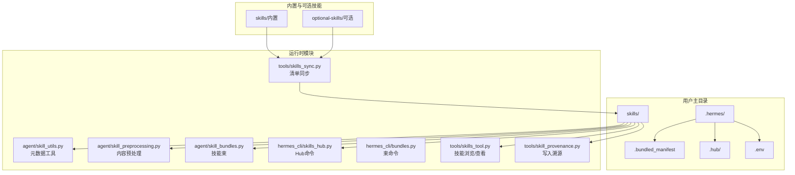
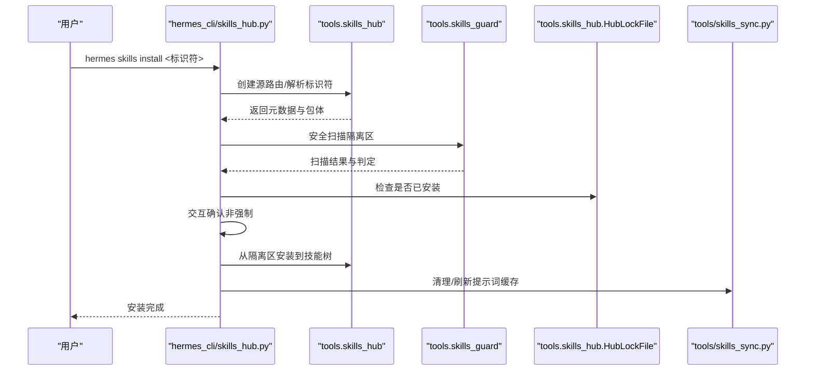
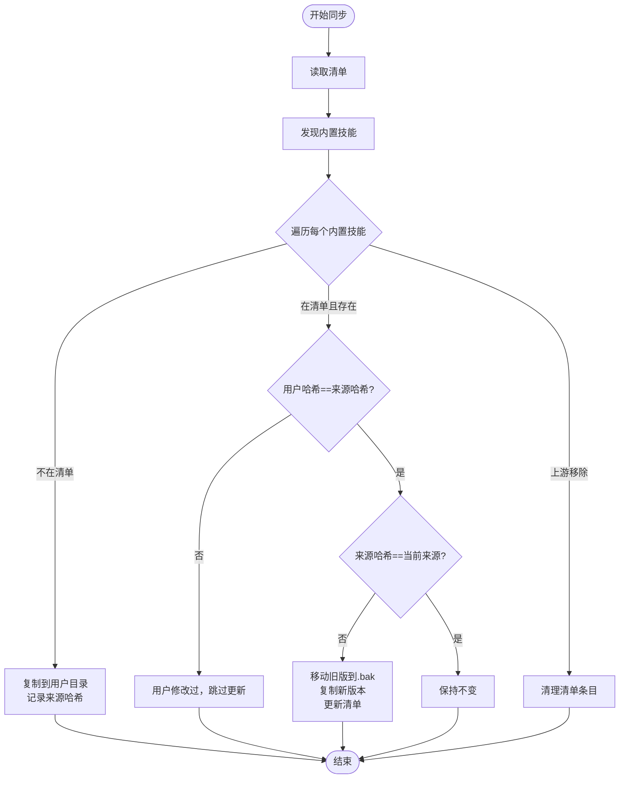
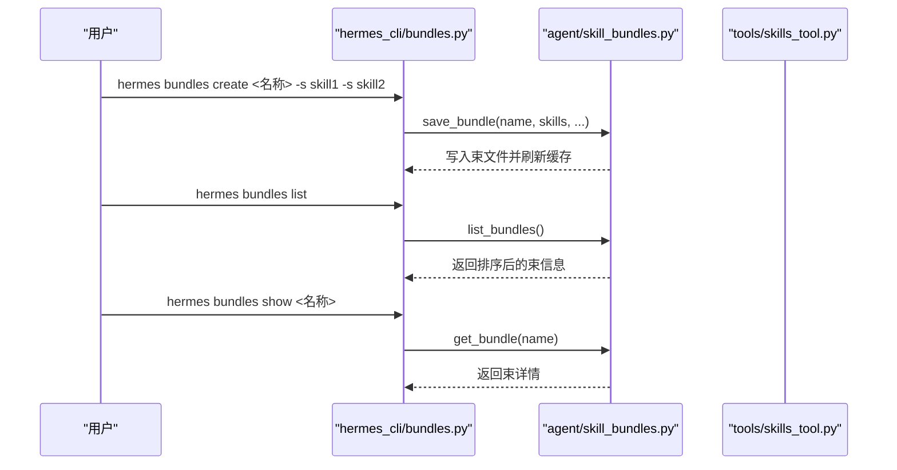
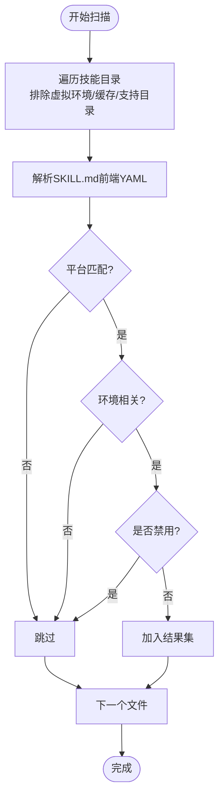
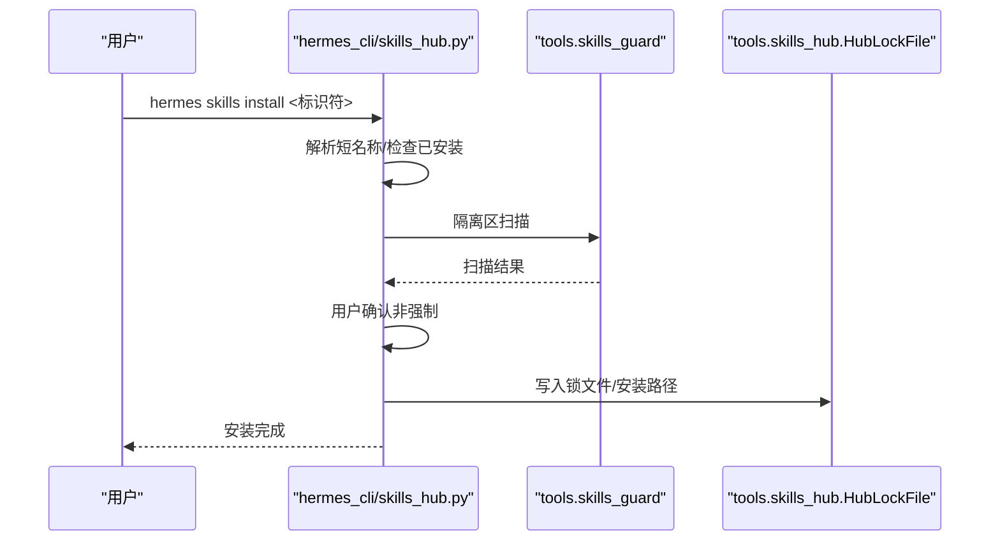
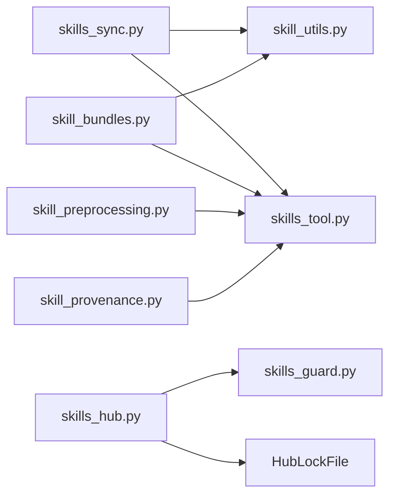

# 技能存储与版本控制

<cite>
**本文档引用的文件**
- [agent/skill_bundles.py](file://agent/skill_bundles.py)
- [agent/skill_utils.py](file://agent/skill_utils.py)
- [agent/skill_preprocessing.py](file://agent/skill_preprocessing.py)
- [hermes_cli/bundles.py](file://hermes_cli/bundles.py)
- [hermes_cli/skills_config.py](file://hermes_cli/skills_config.py)
- [tools/skills_tool.py](file://tools/skills_tool.py)
- [tools/skills_sync.py](file://tools/skills_sync.py)
- [tools/skill_provenance.py](file://tools/skill_provenance.py)
- [hermes_cli/skills_hub.py](file://hermes_cli/skills_hub.py)
- [skills/github/github-code-review/README.md](file://skills/github/github-code-review/README.md)
- [skills/index-cache/claude_marketplace_anthropics_skills.json](file://skills/index-cache/claude_marketplace_anthropics_skills.json)
</cite>

## 目录
1. [引言](#引言)
2. [项目结构](#项目结构)
3. [核心组件](#核心组件)
4. [架构总览](#架构总览)
5. [详细组件分析](#详细组件分析)
6. [依赖分析](#依赖分析)
7. [性能考虑](#性能考虑)
8. [故障排除指南](#故障排除指南)
9. [结论](#结论)
10. [附录](#附录)

## 引言
本文件系统化阐述 Hermes Agent 的技能存储与版本控制体系，覆盖以下主题：
- 技能存储架构与数据组织：本地存储、外部目录、索引缓存与清单管理
- 版本管理策略：清单驱动的同步、哈希校验、向后兼容与升级路径
- 技能打包与分发：技能束（bundle）概念与实现、Hub 安装流程
- 依赖解析与冲突处理：平台/环境过滤、禁用列表、命名冲突
- 增量更新与热重载：清单变更检测、缓存失效与即时生效
- 备份与恢复：官方可选技能修复、原子写入与回滚
- 性能优化与容量管理：扫描优化、缓存策略、并发搜索

## 项目结构
Hermes 技能系统围绕「用户主目录下的技能树」构建，支持内置技能、Hub 安装的第三方技能以及用户自定义技能，并通过清单与哈希实现版本追踪与安全安装。

图示来源
- [tools/skills_sync.py:454-662](file://tools/skills_sync.py#L454-L662)
- [agent/skill_utils.py:499-508](file://agent/skill_utils.py#L499-L508)
- [agent/skill_preprocessing.py:124-141](file://agent/skill_preprocessing.py#L124-L141)
- [agent/skill_bundles.py:168-206](file://agent/skill_bundles.py#L168-L206)
- [hermes_cli/skills_hub.py:478-744](file://hermes_cli/skills_hub.py#L478-L744)
- [hermes_cli/bundles.py:41-164](file://hermes_cli/bundles.py#L41-L164)
- [tools/skills_tool.py:602-750](file://tools/skills_tool.py#L602-L750)
- [tools/skill_provenance.py:1-79](file://tools/skill_provenance.py#L1-L79)

章节来源
- [tools/skills_sync.py:454-662](file://tools/skills_sync.py#L454-L662)
- [agent/skill_utils.py:499-508](file://agent/skill_utils.py#L499-L508)
- [agent/skill_preprocessing.py:124-141](file://agent/skill_preprocessing.py#L124-L141)
- [agent/skill_bundles.py:168-206](file://agent/skill_bundles.py#L168-L206)
- [hermes_cli/skills_hub.py:478-744](file://hermes_cli/skills_hub.py#L478-L744)
- [hermes_cli/bundles.py:41-164](file://hermes_cli/bundles.py#L41-L164)
- [tools/skills_tool.py:602-750](file://tools/skills_tool.py#L602-L750)
- [tools/skill_provenance.py:1-79](file://tools/skill_provenance.py#L1-L79)

## 核心组件
- 技能清单与同步（tools/skills_sync.py）
  - 基于清单的内置技能复制与更新，使用目录内容哈希进行变更检测
  - 支持可选技能溯源回填与官方来源修复
- 技能元数据与发现（agent/skill_utils.py, tools/skills_tool.py）
  - 平台/环境过滤、禁用列表、外部目录扫描、前端 YAML 解析
- 技能束（agent/skill_bundles.py, hermes_cli/bundles.py）
  - 束文件（YAML）聚合多个技能为单一斜杠命令，支持动态加载与消息拼装
- Hub 安装与安全扫描（hermes_cli/skills_hub.py）
  - 统一的搜索/浏览/安装入口，带隔离区、扫描与审计日志
- 预处理与模板（agent/skill_preprocessing.py）
  - 模板变量替换、内联 Shell 执行与输出截断
- 写入溯源（tools/skill_provenance.py）
  - 区分前台用户写入与后台自改进程写入，避免误判

章节来源
- [tools/skills_sync.py:68-152](file://tools/skills_sync.py#L68-L152)
- [agent/skill_utils.py:353-389](file://agent/skill_utils.py#L353-L389)
- [agent/skill_bundles.py:168-206](file://agent/skill_bundles.py#L168-L206)
- [hermes_cli/skills_hub.py:478-744](file://hermes_cli/skills_hub.py#L478-L744)
- [agent/skill_preprocessing.py:124-141](file://agent/skill_preprocessing.py#L124-L141)
- [tools/skill_provenance.py:1-79](file://tools/skill_provenance.py#L1-L79)

## 架构总览
技能系统采用「清单驱动 + 哈希校验 + 分层发现」的架构：
- 清单（.bundled_manifest）记录已同步技能及其来源哈希，用于判断是否需要更新或跳过
- 技能树（~/.hermes/skills/）存放所有技能，支持本地与外部目录叠加
- Hub 安装在隔离区完成扫描与确认后再落盘，确保安全与可回滚
- 运行时通过工具模块按需读取元数据、执行预处理与构建消息

图示来源
- [hermes_cli/skills_hub.py:478-744](file://hermes_cli/skills_hub.py#L478-L744)
- [tools/skills_sync.py:735-744](file://tools/skills_sync.py#L735-L744)

## 详细组件分析

### 组件A：技能清单与同步（tools/skills_sync.py）
- 清单格式与迁移
  - v2：每行“技能名:来源哈希”，自动迁移旧 v1（仅技能名）
  - 不在清单中的新技能直接复制；已在清单且用户修改过的跳过更新
- 同步策略
  - 新增：未在清单中且用户未同名覆盖则复制并记录哈希
  - 更新：用户副本与来源一致时，若来源哈希变化则原子替换并更新清单
  - 删除：用户删除后保留清单条目以尊重用户选择
  - 清理：移除来自上游已不存在的条目
- 可选技能溯源
  - 对齐已存在但未标记的官方可选技能，写入 Hub 锁文件
  - 提供修复函数，支持备份后恢复官方来源

图示来源
- [tools/skills_sync.py:454-662](file://tools/skills_sync.py#L454-L662)
- [tools/skills_sync.py:68-93](file://tools/skills_sync.py#L68-L93)

章节来源
- [tools/skills_sync.py:68-152](file://tools/skills_sync.py#L68-L152)
- [tools/skills_sync.py:454-662](file://tools/skills_sync.py#L454-L662)
- [tools/skills_sync.py:290-358](file://tools/skills_sync.py#L290-L358)
- [tools/skills_sync.py:689-785](file://tools/skills_sync.py#L689-L785)

### 组件B：技能束（agent/skill_bundles.py 与 hermes_cli/bundles.py）
- 束文件结构
  - name、description、skills 列表、可选 instruction
  - 文件名作为后备 slug，支持重复 slug 警告与首胜策略
- 动态加载与消息拼装
  - 解析束命令键、加载每个技能内容、构建统一用户消息头
  - 忽略缺失技能并报告，保持宽容加载
- CLI 管理
  - hermes bundles list/show/create/delete/reload
  - 自动缓存与差异报告，支持富展示

图示来源
- [hermes_cli/bundles.py:87-164](file://hermes_cli/bundles.py#L87-L164)
- [agent/skill_bundles.py:356-411](file://agent/skill_bundles.py#L356-L411)
- [agent/skill_bundles.py:247-251](file://agent/skill_bundles.py#L247-L251)
- [agent/skill_bundles.py:407-411](file://agent/skill_bundles.py#L407-L411)

章节来源
- [agent/skill_bundles.py:168-206](file://agent/skill_bundles.py#L168-L206)
- [agent/skill_bundles.py:253-341](file://agent/skill_bundles.py#L253-L341)
- [hermes_cli/bundles.py:41-164](file://hermes_cli/bundles.py#L41-L164)

### 组件C：技能元数据与发现（agent/skill_utils.py, tools/skills_tool.py）
- 元数据提取与过滤
  - 前端 YAML 解析、平台匹配（含 Termux 兼容）、环境相关性过滤
  - 禁用列表（全局/平台维度）、外部目录扫描、支持命名空间与限定名
- 发现与展示
  - 递归扫描 SKILL.md，去重与分类，限制名称/描述长度
  - 与 Hub 锁文件配合，支持“已安装”状态与信任级别

图示来源
- [agent/skill_utils.py:123-158](file://agent/skill_utils.py#L123-L158)
- [agent/skill_utils.py:163-204](file://agent/skill_utils.py#L163-L204)
- [agent/skill_utils.py:268-304](file://agent/skill_utils.py#L268-L304)
- [agent/skill_utils.py:353-389](file://agent/skill_utils.py#L353-L389)
- [agent/skill_utils.py:416-497](file://agent/skill_utils.py#L416-L497)
- [tools/skills_tool.py:602-679](file://tools/skills_tool.py#L602-L679)

章节来源
- [agent/skill_utils.py:123-158](file://agent/skill_utils.py#L123-L158)
- [agent/skill_utils.py:163-204](file://agent/skill_utils.py#L163-L204)
- [agent/skill_utils.py:268-304](file://agent/skill_utils.py#L268-L304)
- [agent/skill_utils.py:353-389](file://agent/skill_utils.py#L353-L389)
- [agent/skill_utils.py:416-497](file://agent/skill_utils.py#L416-L497)
- [tools/skills_tool.py:602-679](file://tools/skills_tool.py#L602-L679)

### 组件D：Hub 安装与安全扫描（hermes_cli/skills_hub.py）
- 名称解析与类别建议
  - 短名称解析、歧义提示、URL 安装时的交互式名称/类别输入
- 安装流程
  - 隔离区下载与扫描、可信度判定、用户确认、落盘安装
  - 安装后清理提示词缓存，使新技能立即可用
- 蓝图（自动化）检测
  - 若技能声明蓝图块，注册为建议任务而非自动调度

图示来源
- [hermes_cli/skills_hub.py:478-744](file://hermes_cli/skills_hub.py#L478-L744)

章节来源
- [hermes_cli/skills_hub.py:35-82](file://hermes_cli/skills_hub.py#L35-L82)
- [hermes_cli/skills_hub.py:478-744](file://hermes_cli/skills_hub.py#L478-L744)

### 组件E：预处理与模板（agent/skill_preprocessing.py）
- 模板变量替换
  - ${HERMES_SKILL_DIR}、${HERMES_SESSION_ID} 替换，未就绪时保留原样便于调试
- 内联 Shell 执行
  - !`cmd` 单行片段执行，带超时与最大输出截断，失败返回错误标记
- 配置开关
  - template_vars/inline_shell/inline_shell_timeout 在配置中控制

章节来源
- [agent/skill_preprocessing.py:23-35](file://agent/skill_preprocessing.py#L23-L35)
- [agent/skill_preprocessing.py:37-61](file://agent/skill_preprocessing.py#L37-L61)
- [agent/skill_preprocessing.py:63-99](file://agent/skill_preprocessing.py#L63-L99)
- [agent/skill_preprocessing.py:102-141](file://agent/skill_preprocessing.py#L102-L141)

### 组件F：写入溯源（tools/skill_provenance.py）
- 上下文变量区分前台用户写入与后台自改进程写入
- 用于 Curator 等后台操作识别，避免将用户请求生成的技能纳入自动整理

章节来源
- [tools/skill_provenance.py:1-79](file://tools/skill_provenance.py#L1-L79)

## 依赖分析
- 组件耦合
  - skills_sync 与 skills_tool：前者负责清单与复制，后者负责发现与展示
  - skills_hub 与 skills_guard：前者负责安装流程，后者负责安全扫描
  - skill_bundles 与 skills_tool：束加载依赖技能工具链
- 外部依赖
  - Hub 源适配器、GitHub API、JSON 索引缓存（claude_marketplace_anthropics_skills.json）
  - 环境变量与平台检测（Termux、容器、s6）

图示来源
- [tools/skills_sync.py:454-662](file://tools/skills_sync.py#L454-L662)
- [hermes_cli/skills_hub.py:478-744](file://hermes_cli/skills_hub.py#L478-L744)
- [agent/skill_bundles.py:253-341](file://agent/skill_bundles.py#L253-L341)
- [agent/skill_preprocessing.py:124-141](file://agent/skill_preprocessing.py#L124-L141)
- [tools/skill_provenance.py:1-79](file://tools/skill_provenance.py#L1-L79)

章节来源
- [tools/skills_sync.py:454-662](file://tools/skills_sync.py#L454-L662)
- [hermes_cli/skills_hub.py:478-744](file://hermes_cli/skills_hub.py#L478-L744)
- [agent/skill_bundles.py:253-341](file://agent/skill_bundles.py#L253-L341)
- [agent/skill_preprocessing.py:124-141](file://agent/skill_preprocessing.py#L124-L141)
- [tools/skill_provenance.py:1-79](file://tools/skill_provenance.py#L1-L79)

## 性能考虑
- 扫描优化
  - 使用目录 mtime 快速判断变更，避免全量扫描
  - 排除虚拟环境、缓存、VCS、支持目录等，减少 IO
- 缓存策略
  - 技能配置与外部目录列表按 mtime 缓存，降低 YAML 解析开销
  - Hub 锁文件与提示词缓存按需失效，避免冷启动抖动
- 并发与超时
  - Hub 浏览时对多源搜索并行，设置总体超时与进度反馈
- 输出截断
  - 内联 Shell 输出最大长度限制，防止上下文膨胀

章节来源
- [agent/skill_utils.py:416-497](file://agent/skill_utils.py#L416-L497)
- [agent/skill_utils.py:318-351](file://agent/skill_utils.py#L318-L351)
- [hermes_cli/skills_hub.py:336-378](file://hermes_cli/skills_hub.py#L336-L378)
- [agent/skill_preprocessing.py:19-21](file://agent/skill_preprocessing.py#L19-L21)

## 故障排除指南
- 安装被阻止
  - 检查扫描结果与信任级别，必要时使用 --force 或调整凭据提升限额
  - 隔离区清理后重试
- 束加载为空
  - 检查束文件语法与技能名是否存在，确认缺失技能会被记录
- 同步未更新
  - 若用户修改过技能，清单会将其标记为“用户修改”，跳过更新
  - 使用 reset_bundled_skill 清理清单条目后重新同步
- 环境不匹配
  - 平台/环境过滤导致技能不可见，可通过环境变量或配置调整
- Hub 访问受限
  - 未认证 GitHub API 速率限制，设置 GITHUB_TOKEN 或使用 gh 登录

章节来源
- [hermes_cli/skills_hub.py:514-533](file://hermes_cli/skills_hub.py#L514-L533)
- [hermes_cli/skills_hub.py:630-641](file://hermes_cli/skills_hub.py#L630-L641)
- [agent/skill_bundles.py:253-341](file://agent/skill_bundles.py#L253-L341)
- [tools/skills_sync.py:689-785](file://tools/skills_sync.py#L689-L785)
- [agent/skill_utils.py:163-204](file://agent/skill_utils.py#L163-L204)

## 结论
该技能系统通过「清单 + 哈希 + 隔离区扫描」实现了安全、可控、可追溯的技能版本管理；通过束机制与 Hub 分发提升了技能组合与共享能力；通过平台/环境过滤与禁用列表保障了运行时稳定性。结合缓存与并发优化，系统在大规模技能场景下仍具备良好性能表现。

## 附录
- 版本号规则
  - 技能可在前端 YAML 中声明 version 字段，用于语义化标识
- 向后兼容
  - 平台字段默认全平台兼容；环境字段为空时视为全部适用
- 升级路径
  - hermes update 触发同步，内置技能按清单哈希对比决定是否更新
- 备份与恢复
  - reset_bundled_skill 支持清理清单并触发重新同步
  - 官方可选技能修复提供备份与回滚路径

章节来源
- [skills/github/github-code-review/README.md:1-482](file://skills/github/github-code-review/README.md#L1-L482)
- [tools/skills_sync.py:689-785](file://tools/skills_sync.py#L689-L785)
- [skills/index-cache/claude_marketplace_anthropics_skills.json:1-1](file://skills/index-cache/claude_marketplace_anthropics_skills.json#L1-L1)