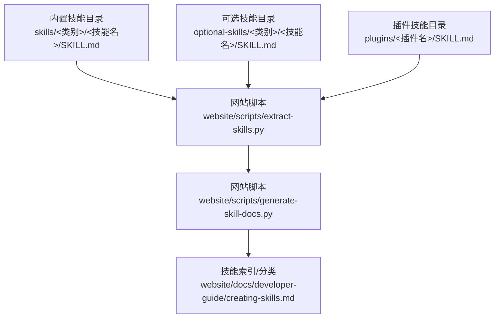
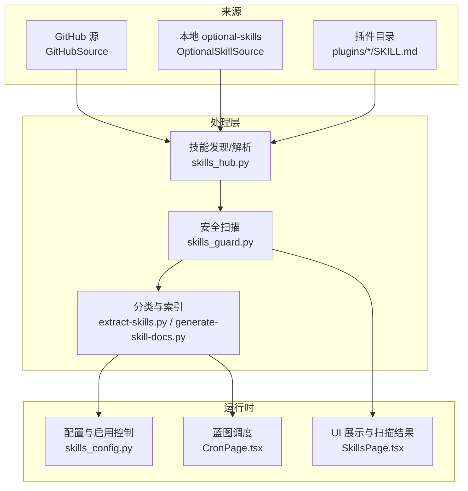
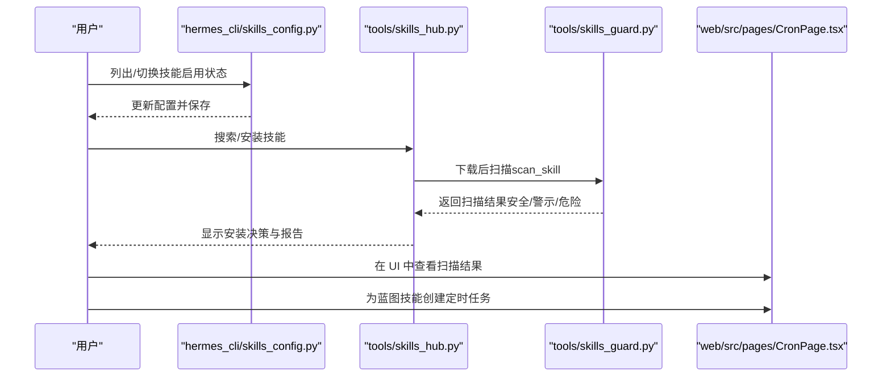
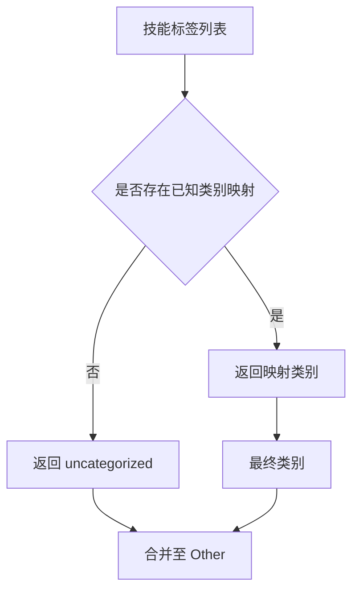
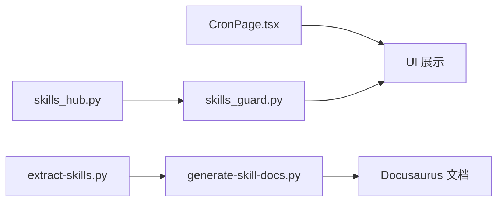

# 技能定义与结构

<cite>
**本文引用的文件**
- [skills/dogfood/SKILL.md](file://skills/dogfood/SKILL.md)
- [plugins/google_meet/SKILL.md](file://plugins/google_meet/SKILL.md)
- [tools/skills_hub.py](file://tools/skills_hub.py)
- [hermes_cli/skills_config.py](file://hermes_cli/skills_config.py)
- [website/docs/developer-guide/creating-skills.md](file://website/docs/developer-guide/creating-skills.md)
- [tools/skills_guard.py](file://tools/skills_guard.py)
- [tools/skill_manager_tool.py](file://tools/skill_manager_tool.py)
- [skills/dogfood/templates/dogfood-report-template.md](file://skills/dogfood/templates/dogfood-report-template.md)
- [skills/dogfood/references/issue-taxonomy.md](file://skills/dogfood/references/issue-taxonomy.md)
- [website/scripts/generate-skill-docs.py](file://website/scripts/generate-skill-docs.py)
- [website/scripts/extract-skills.py](file://website/scripts/extract-skills.py)
- [web/src/pages/CronPage.tsx](file://web/src/pages/CronPage.tsx)
- [web/src/pages/SkillsPage.tsx](file://web/src/pages/SkillsPage.tsx)
- [web/src/i18n/context.tsx](file://web/src/i18n/context.tsx)
- [apps/desktop/src/i18n/languages.test.ts](file://apps/desktop/src/i18n/languages.test.ts)
- [locales/zh.yaml](file://locales/zh.yaml)
- [locales/en.yaml](file://locales/en.yaml)
</cite>

## 目录
1. [引言](#引言)
2. [项目结构](#项目结构)
3. [核心组件](#核心组件)
4. [架构总览](#架构总览)
5. [详细组件分析](#详细组件分析)
6. [依赖分析](#依赖分析)
7. [性能考虑](#性能考虑)
8. [故障排查指南](#故障排查指南)
9. [结论](#结论)
10. [附录](#附录)

## 引言
本文件系统化阐述 Hermes Agent 中“技能”的定义、数据模型、配置规范与执行逻辑，覆盖 SKILL.md 标准格式、生命周期管理（创建、验证、安装、运行）、分类与标签体系、国际化与多语言文档机制，并提供模板与最佳实践指引。

## 项目结构
- 技能内容以 SKILL.md 为核心，位于两类目录：
  - 内置技能：skills/<类别>/<技能名>/SKILL.md
  - 可选技能：optional-skills/<类别>/<技能名>/SKILL.md
- 插件技能：plugins/<插件名>/SKILL.md
- 网站侧文档生成与索引脚本负责从 SKILL.md 提取元数据与正文，生成站点文档与技能索引。
- 安全扫描与安装策略由工具模块统一处理。

图表来源
- [website/scripts/extract-skills.py:487-603](file://website/scripts/extract-skills.py#L487-L603)
- [website/scripts/generate-skill-docs.py:405-442](file://website/scripts/generate-skill-docs.py#L405-L442)
- [website/docs/developer-guide/creating-skills.md:25-42](file://website/docs/developer-guide/creating-skills.md#L25-L42)

章节来源
- [website/scripts/extract-skills.py:487-603](file://website/scripts/extract-skills.py#L487-L603)
- [website/scripts/generate-skill-docs.py:405-442](file://website/scripts/generate-skill-docs.py#L405-L442)
- [website/docs/developer-guide/creating-skills.md:25-42](file://website/docs/developer-guide/creating-skills.md#L25-L42)

## 核心组件
- 技能元数据模型（SkillMeta）：用于搜索、展示与分类，包含名称、描述、来源、信任级别、标识符、标签与额外元数据。
- 技能源适配器（SkillSource）：抽象不同来源（如 GitHub、本地 optional-skills）的发现与拉取能力。
- 安全扫描（SkillsGuard）：对下载的技能进行静态规则扫描，判定危险、警示或安全，并结合信任级别决定是否允许安装。
- 配置与启用控制（skills_config）：全局与平台维度的技能禁用列表管理。
- 蓝图（Blueprint）：在 SKILL.md 前言中声明计划任务的技能，作为可建议的自动化作业。

章节来源
- [tools/skills_hub.py:69-92](file://tools/skills_hub.py#L69-L92)
- [tools/skills_hub.py:361-387](file://tools/skills_hub.py#L361-L387)
- [tools/skills_guard.py:40-64](file://tools/skills_guard.py#L40-L64)
- [hermes_cli/skills_config.py:27-54](file://hermes_cli/skills_config.py#L27-L54)
- [website/docs/developer-guide/creating-skills.md:342-377](file://website/docs/developer-guide/creating-skills.md#L342-L377)

## 架构总览
技能系统围绕“标准格式 + 元数据 + 扫描策略 + 分类索引 + 运行时加载”展开，形成从仓库到用户界面的完整链路。

图表来源
- [tools/skills_hub.py:393-542](file://tools/skills_hub.py#L393-L542)
- [tools/skills_guard.py:627-683](file://tools/skills_guard.py#L627-L683)
- [website/scripts/extract-skills.py:487-603](file://website/scripts/extract-skills.py#L487-L603)
- [website/scripts/generate-skill-docs.py:405-442](file://website/scripts/generate-skill-docs.py#L405-L442)
- [web/src/pages/CronPage.tsx:277-664](file://web/src/pages/CronPage.tsx#L277-L664)
- [web/src/pages/SkillsPage.tsx:1410-1464](file://web/src/pages/SkillsPage.tsx#L1410-L1464)

## 详细组件分析

### SKILL.md 标准格式与字段定义
- 必备字段（前言区）
  - name：技能唯一名称
  - description：简要描述（搜索结果展示）
  - version：版本号
  - platforms：平台限制（macos/linux/windows）
  - metadata.hermes.tags：标签数组，用于分类与检索
  - metadata.hermes.related_skills：相关技能名称列表
  - metadata.hermes.requires_toolsets / requires_tools：仅在特定工具集/工具可用时显示
  - metadata.hermes.fallback_for_toolsets / fallback_for_tools：当存在某工具/工具集时隐藏
  - metadata.hermes.config：技能所需的非敏感配置项（键路径、默认值、提示）
  - metadata.hermes.blueprint：声明计划任务（schedule、deliver、prompt、no_agent）
  - required_environment_variables：所需环境变量清单（prompt、help、required_for）
- 正文建议结构
  - 概述、何时使用、快速参考、流程步骤、常见陷阱、验证清单、一次性配方等

章节来源
- [website/docs/developer-guide/creating-skills.md:44-99](file://website/docs/developer-guide/creating-skills.md#L44-L99)
- [website/docs/developer-guide/creating-skills.md:113-136](file://website/docs/developer-guide/creating-skills.md#L113-L136)
- [website/docs/developer-guide/creating-skills.md:186-238](file://website/docs/developer-guide/creating-skills.md#L186-L238)
- [website/docs/developer-guide/creating-skills.md:342-377](file://website/docs/developer-guide/creating-skills.md#L342-L377)

### 数据模型与元数据
- SkillMeta：最小元数据集合，用于搜索与展示
- SkillBundle：已下载技能包，包含文件映射与元数据
- GitHubSource.inspect：从 SKILL.md 解析前言，提取 name/description/tags 等

章节来源
- [tools/skills_hub.py:69-92](file://tools/skills_hub.py#L69-L92)
- [tools/skills_hub.py:83-92](file://tools/skills_hub.py#L83-L92)
- [tools/skills_hub.py:505-542](file://tools/skills_hub.py#L505-L542)

### 生命周期管理（创建 → 验证 → 安装 → 运行）
- 创建与模板
  - 使用 SKILL.md 标准格式；可嵌入内联 shell 片段（需显式开启）
  - 可声明 blueprint，成为可建议的自动化作业
- 安全扫描与信任级别
  - 通过正则模式检测 exfiltration、prompt injection、destructive、persistence 等威胁
  - 信任级别：builtin/trusted/community/agent-created；结合策略决定允许/需要确认/阻止
- 安装与启用控制
  - 支持按平台禁用/启用技能；支持按类别批量切换
- 运行与调度
  - 蓝图技能安装后可在 UI 中建议为定时任务；cron 页面支持选择技能并创建作业

图表来源
- [hermes_cli/skills_config.py:131-184](file://hermes_cli/skills_config.py#L131-L184)
- [tools/skills_hub.py:448-477](file://tools/skills_hub.py#L448-L477)
- [tools/skills_guard.py:627-683](file://tools/skills_guard.py#L627-L683)
- [web/src/pages/CronPage.tsx:277-664](file://web/src/pages/CronPage.tsx#L277-L664)

章节来源
- [hermes_cli/skills_config.py:27-54](file://hermes_cli/skills_config.py#L27-L54)
- [hermes_cli/skills_config.py:131-184](file://hermes_cli/skills_config.py#L131-L184)
- [tools/skills_guard.py:686-728](file://tools/skills_guard.py#L686-L728)
- [web/src/pages/CronPage.tsx:277-664](file://web/src/pages/CronPage.tsx#L277-L664)

### 分类体系与标签系统
- 标签到类别的映射：根据标签集合推断技能类别，未匹配则归为 uncategorized，再折叠为 Other
- 类别标签覆盖范围广泛，包括软件开发、媒体、健康、翻译、安全、区块链、通信、领域等
- 站点侧会为每个技能生成信息表（名称、描述、来源、标签、平台等），并注入 Docusaurus 前言

图表来源
- [website/scripts/extract-skills.py:514-587](file://website/scripts/extract-skills.py#L514-L587)

章节来源
- [website/scripts/extract-skills.py:487-603](file://website/scripts/extract-skills.py#L487-L603)

### 国际化与多语言文档机制
- 前端 i18n 上下文：支持多种语言，持久化用户选择
- 桌面端语言测试：校验语言别名规范化与受支持性
- 站点侧文档生成：自动从 SKILL.md 生成页面，注入标题、副标题与描述
- 本地化资源：locales/*.yaml 提供多语言文案

章节来源
- [web/src/i18n/context.tsx:46-123](file://web/src/i18n/context.tsx#L46-L123)
- [apps/desktop/src/i18n/languages.test.ts:1-31](file://apps/desktop/src/i18n/languages.test.ts#L1-L31)
- [website/scripts/generate-skill-docs.py:412-442](file://website/scripts/generate-skill-docs.py#L412-L442)
- [locales/zh.yaml](file://locales/zh.yaml)
- [locales/en.yaml](file://locales/en.yaml)

### 示例与最佳实践
- 示例技能
  - 系统性 Web 应用 QA 技能（dogfood）：包含工作流、证据收集、分类与报告模板
  - Google Meet 技能：两模式（转录/实时）、远程节点、前置条件与限制
- 最佳实践
  - 优先使用现有工具与标准命令；避免外部依赖；提供帮助脚本
  - 渐进披露：将常用流程放在前面；边缘场景放底部
  - 使用 [[as_document]] 输出高质量媒体
  - 通过 blueprint 将技能转化为可建议的自动化作业

章节来源
- [skills/dogfood/SKILL.md:1-163](file://skills/dogfood/SKILL.md#L1-L163)
- [plugins/google_meet/SKILL.md:1-149](file://plugins/google_meet/SKILL.md#L1-L149)
- [website/docs/developer-guide/creating-skills.md:266-302](file://website/docs/developer-guide/creating-skills.md#L266-L302)
- [website/docs/developer-guide/creating-skills.md:342-377](file://website/docs/developer-guide/creating-skills.md#L342-L377)

## 依赖分析
- 组件耦合
  - skills_hub.py 依赖 tools.skills_guard 的扫描能力与信任配置
  - 网站脚本 extract-skills.py 与 generate-skill-docs.py 依赖 SKILL.md 结构与前言
  - UI CronPage 依赖技能列表与平台配置
- 外部集成
  - GitHub Contents API 与 Trees API 用于批量拉取技能树
  - 站点脚本依赖分类映射与标签到类别的映射

图表来源
- [tools/skills_hub.py:393-542](file://tools/skills_hub.py#L393-L542)
- [tools/skills_guard.py:627-683](file://tools/skills_guard.py#L627-L683)
- [website/scripts/extract-skills.py:487-603](file://website/scripts/extract-skills.py#L487-L603)
- [website/scripts/generate-skill-docs.py:405-442](file://website/scripts/generate-skill-docs.py#L405-L442)
- [web/src/pages/CronPage.tsx:277-664](file://web/src/pages/CronPage.tsx#L277-L664)

章节来源
- [tools/skills_hub.py:393-542](file://tools/skills_hub.py#L393-L542)
- [website/scripts/extract-skills.py:487-603](file://website/scripts/extract-skills.py#L487-L603)
- [web/src/pages/CronPage.tsx:277-664](file://web/src/pages/CronPage.tsx#L277-L664)

## 性能考虑
- 索引缓存：GitHubSource 对仓库树进行缓存，减少重复 API 调用
- 扫描优化：仅扫描可扫描扩展名文本文件，忽略二进制；结构检查限制文件数量与大小
- UI 加载：站点脚本对技能进行分类与标签映射，避免前端重复计算

章节来源
- [tools/skills_hub.py:588-637](file://tools/skills_hub.py#L588-L637)
- [tools/skills_guard.py:518-535](file://tools/skills_guard.py#L518-L535)
- [website/scripts/extract-skills.py:514-587](file://website/scripts/extract-skills.py#L514-L587)

## 故障排查指南
- 安全扫描阻断
  - 危险/警示发现：根据策略决定允许/需要确认/阻止；可通过 --force 覆盖非危险情况
  - agent-created 模式：对危险表面返回错误，便于重试
- 安装路径安全
  - 严格校验安装路径，防止符号链接逃逸与根目录误删
- 平台与工具集不匹配
  - 使用 requires_toolsets / requires_tools 与 fallback_for_* 控制可见性
- UI 与配置
  - 若技能未出现，检查 skills_config 的禁用列表与平台设置
  - 蓝图技能安装后在 UI 的“建议”面板中创建定时任务

章节来源
- [tools/skills_guard.py:686-728](file://tools/skills_guard.py#L686-L728)
- [tools/skill_manager_tool.py:70-104](file://tools/skill_manager_tool.py#L70-L104)
- [tools/skills_hub.py:164-190](file://tools/skills_hub.py#L164-L190)
- [hermes_cli/skills_config.py:27-54](file://hermes_cli/skills_config.py#L27-L54)
- [web/src/pages/SkillsPage.tsx:1410-1464](file://web/src/pages/SkillsPage.tsx#L1410-L1464)

## 结论
该技能系统以 SKILL.md 为统一入口，结合严格的元数据模型、可信源与安全扫描策略、完善的分类与索引机制，以及 UI 与 CLI 的一致体验，实现了从创建、验证到部署与运行的闭环。蓝图与定时任务进一步将技能转化为可复用的自动化能力。

## 附录

### SKILL.md 字段速查
- 前言必备：name、description、version、platforms
- hermes 元数据：tags、related_skills、requires_*、fallback_for_*、config、blueprint
- 环境变量：required_environment_variables
- 正文建议：概述、何时使用、快速参考、流程、陷阱、验证

章节来源
- [website/docs/developer-guide/creating-skills.md:44-99](file://website/docs/developer-guide/creating-skills.md#L44-L99)
- [website/docs/developer-guide/creating-skills.md:113-136](file://website/docs/developer-guide/creating-skills.md#L113-L136)
- [website/docs/developer-guide/creating-skills.md:186-238](file://website/docs/developer-guide/creating-skills.md#L186-L238)
- [website/docs/developer-guide/creating-skills.md:342-377](file://website/docs/developer-guide/creating-skills.md#L342-L377)

### 示例技能参考
- 系统性 Web 应用 QA 流程与报告模板
- Google Meet 会议接入与转录/实时语音

章节来源
- [skills/dogfood/SKILL.md:1-163](file://skills/dogfood/SKILL.md#L1-L163)
- [skills/dogfood/templates/dogfood-report-template.md:1-87](file://skills/dogfood/templates/dogfood-report-template.md#L1-L87)
- [skills/dogfood/references/issue-taxonomy.md:1-110](file://skills/dogfood/references/issue-taxonomy.md#L1-L110)
- [plugins/google_meet/SKILL.md:1-149](file://plugins/google_meet/SKILL.md#L1-L149)