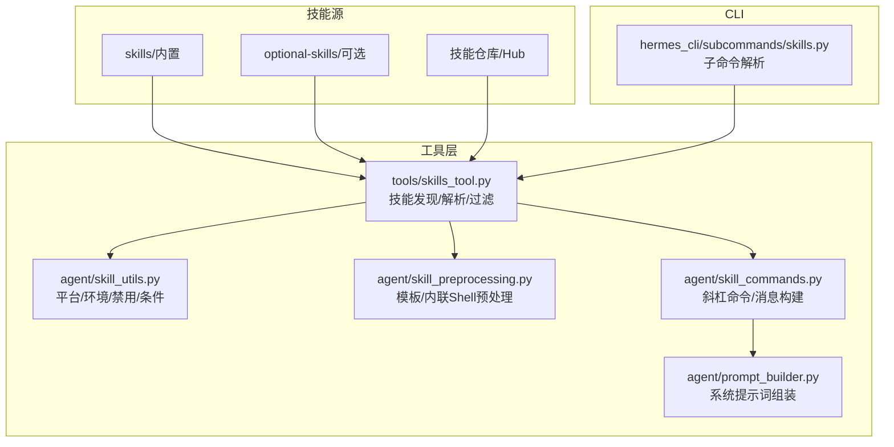
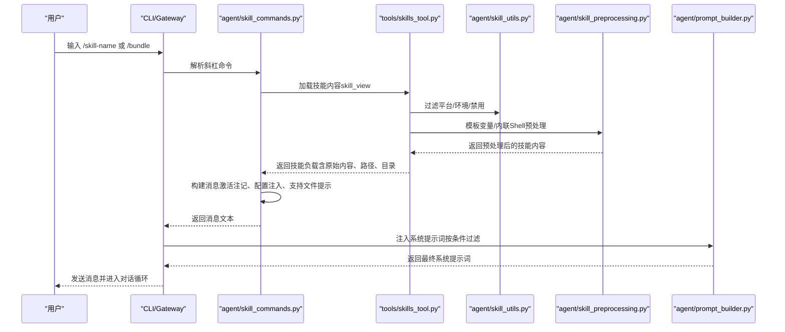
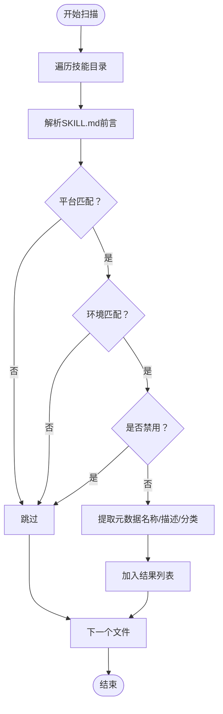
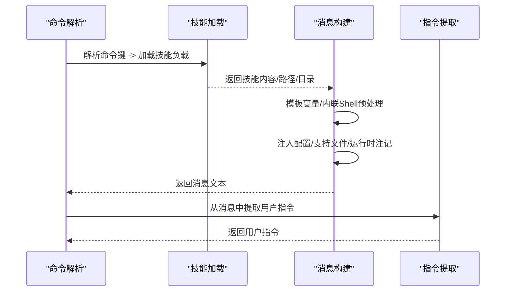
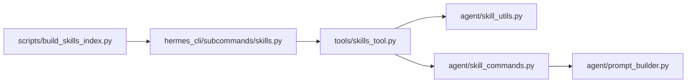

# 技能开发指南

<cite>
**本文档引用的文件**
- [README.md](file://README.md)
- [CONTRIBUTING.md](file://CONTRIBUTING.md)
- [skills/dogfood/SKILL.md](file://skills/dogfood/SKILL.md)
- [hermes_cli/subcommands/skills.py](file://hermes_cli/subcommands/skills.py)
- [agent/skill_utils.py](file://agent/skill_utils.py)
- [agent/skill_commands.py](file://agent/skill_commands.py)
- [agent/skill_preprocessing.py](file://agent/skill_preprocessing.py)
- [tools/skills_tool.py](file://tools/skills_tool.py)
- [agent/prompt_builder.py](file://agent/prompt_builder.py)
- [scripts/build_skills_index.py](file://scripts/build_skills_index.py)
</cite>

## 目录
1. [简介](#简介)
2. [项目结构](#项目结构)
3. [核心组件](#核心组件)
4. [架构总览](#架构总览)
5. [详细组件分析](#详细组件分析)
6. [依赖关系分析](#依赖关系分析)
7. [性能考虑](#性能考虑)
8. [故障排除指南](#故障排除指南)
9. [结论](#结论)
10. [附录](#附录)

## 简介
本指南面向希望在 Hermes Agent 平台上开发与发布「技能」（Skill）的开发者，覆盖从环境搭建、工具链配置、开发流程、测试策略、质量保障、文档规范、常见模式与反模式、性能优化与内存管理、国际化与本地化，到社区资源与学习路径的完整知识体系。Hermes 的技能系统以「渐进披露」为核心：仅在需要时加载技能全文，避免不必要的上下文膨胀；通过系统提示词动态注入可用技能，确保模型聚焦于当前会话相关的任务。

## 项目结构
Hermes 将技能组织为目录中的 SKILL.md 文件及可选的支持性子目录（references、templates、assets、scripts），并通过工具模块进行发现、解析与注入。核心目录与职责概览如下：
- skills/：官方内置技能目录（安装后同步至 ~/.hermes/skills/）
- optional-skills/：官方可选技能目录（默认不激活，可通过 hub 安装）
- tools/skills_tool.py：技能列表与查看工具，负责扫描、解析、过滤与安全校验
- agent/skill_utils.py：技能元数据与条件匹配（平台、环境、禁用列表等）
- agent/skill_commands.py：技能命令构建与消息格式化（斜杠命令、预加载、运行时注记）
- agent/skill_preprocessing.py：SKILL.md 预处理（模板变量替换、内联 Shell 扩展）
- agent/prompt_builder.py：系统提示词组装，按可用工具集与条件过滤注入技能索引
- hermes_cli/subcommands/skills.py：CLI 子命令解析器（搜索、安装、检查更新、审计等）

**图表来源**
- [tools/skills_tool.py:1-120](file://tools/skills_tool.py#L1-L120)
- [agent/skill_utils.py:1-120](file://agent/skill_utils.py#L1-L120)
- [agent/skill_preprocessing.py:1-60](file://agent/skill_preprocessing.py#L1-L60)
- [agent/skill_commands.py:1-120](file://agent/skill_commands.py#L1-L120)
- [agent/prompt_builder.py:1-120](file://agent/prompt_builder.py#L1-L120)
- [hermes_cli/subcommands/skills.py:1-60](file://hermes_cli/subcommands/skills.py#L1-L60)

**章节来源**
- [README.md:1-224](file://README.md#L1-L224)
- [CONTRIBUTING.md:172-240](file://CONTRIBUTING.md#L172-L240)

## 核心组件
- 技能发现与解析
  - 工具模块负责扫描技能目录、解析 YAML 前言、过滤平台/环境/禁用项，并生成最小元数据用于系统提示词注入。
- 条件与平台匹配
  - 支持 platforms、environments、fallback_for/requires 等条件字段，按当前运行环境动态决定技能可见性。
- 消息构建与注入
  - 斜杠命令触发时，将技能内容与运行时信息拼接为系统/用户消息，避免将完整技能体写入记忆。
- 预处理机制
  - 支持 ${HERMES_SKILL_DIR}、${HERMES_SESSION_ID} 等模板变量替换，以及 !`cmd` 内联 Shell 扩展，限制输出长度防止上下文膨胀。
- 系统提示词组装
  - 在构建系统提示词时，根据可用工具集与条件过滤，仅注入合适的技能索引，提升模型聚焦度与安全性。

**章节来源**
- [tools/skills_tool.py:600-750](file://tools/skills_tool.py#L600-L750)
- [agent/skill_utils.py:160-305](file://agent/skill_utils.py#L160-L305)
- [agent/skill_commands.py:517-562](file://agent/skill_commands.py#L517-L562)
- [agent/skill_preprocessing.py:23-61](file://agent/skill_preprocessing.py#L23-L61)
- [agent/prompt_builder.py:1-120](file://agent/prompt_builder.py#L1-L120)

## 架构总览
下图展示从用户输入斜杠命令到技能内容注入系统提示词的关键流程，以及与工具链的交互：

**图表来源**
- [agent/skill_commands.py:517-562](file://agent/skill_commands.py#L517-L562)
- [tools/skills_tool.py:687-750](file://tools/skills_tool.py#L687-L750)
- [agent/skill_utils.py:353-496](file://agent/skill_utils.py#L353-L496)
- [agent/skill_preprocessing.py:124-141](file://agent/skill_preprocessing.py#L124-L141)
- [agent/prompt_builder.py:1-120](file://agent/prompt_builder.py#L1-L120)

## 详细组件分析

### 组件A：技能发现与过滤（tools/skills_tool.py 与 agent/skill_utils.py）
- 发现策略
  - 递归扫描 ~/.hermes/skills/ 与外部目录（skills.external_dirs），过滤排除目录与支持目录，提取 SKILL.md 元数据。
- 平台与环境匹配
  - platforms 字段映射 sys.platform 前缀；environments 支持 kanban、docker、s6 等环境标签，采用“或”逻辑。
- 禁用列表
  - 支持全局与平台维度的禁用列表，兼容配置缓存与进程内缓存。
- 分类与排序
  - 自动推断分类（基于目录层级），统一排序规则，便于 UI 展示与检索。

**图表来源**
- [tools/skills_tool.py:602-680](file://tools/skills_tool.py#L602-L680)
- [agent/skill_utils.py:53-98](file://agent/skill_utils.py#L53-L98)
- [agent/skill_utils.py:353-397](file://agent/skill_utils.py#L353-L397)

**章节来源**
- [tools/skills_tool.py:602-680](file://tools/skills_tool.py#L602-L680)
- [agent/skill_utils.py:160-305](file://agent/skill_utils.py#L160-L305)
- [agent/skill_utils.py:353-397](file://agent/skill_utils.py#L353-L397)

### 组件B：斜杠命令与消息构建（agent/skill_commands.py）
- 命令解析
  - 将 /skill-name 规范化为命令键，支持下划线与连字符互换。
- 消息构建
  - 构造激活注记、注入绝对技能目录、注入已解析的技能配置、支持文件提示、用户指令与运行时注记。
- 提取用户指令
  - 从技能扩展消息中恢复用户原始指令，避免将完整技能体写入记忆。

**图表来源**
- [agent/skill_commands.py:498-562](file://agent/skill_commands.py#L498-L562)
- [agent/skill_commands.py:58-113](file://agent/skill_commands.py#L58-L113)

**章节来源**
- [agent/skill_commands.py:498-562](file://agent/skill_commands.py#L498-L562)
- [agent/skill_commands.py:58-113](file://agent/skill_commands.py#L58-L113)

### 组件C：预处理与安全（agent/skill_preprocessing.py）
- 模板变量替换
  - 支持 ${HERMES_SKILL_DIR} 与 ${HERMES_SESSION_ID}，未解析的令牌保留以便调试。
- 内联 Shell 扩展
  - 使用 !`cmd` 包裹单行命令，限制超时与输出长度，失败返回错误标记而非抛出异常。
- 最佳实践
  - 仅在需要时启用内联 Shell，严格控制超时与输出截断，避免上下文膨胀。

**章节来源**
- [agent/skill_preprocessing.py:23-61](file://agent/skill_preprocessing.py#L23-L61)
- [agent/skill_preprocessing.py:102-141](file://agent/skill_preprocessing.py#L102-L141)

### 组件D：系统提示词注入（agent/prompt_builder.py）
- 技能索引注入
  - 在构建系统提示词时，按可用工具集与条件过滤，仅注入合适的技能索引，减少上下文噪声。
- 上下文文件安全
  - 对上下文文件内容进行威胁检测，阻断潜在的注入与提示工程风险。

**章节来源**
- [agent/prompt_builder.py:1-120](file://agent/prompt_builder.py#L1-L120)

### 组件E：CLI 技能管理（hermes_cli/subcommands/skills.py）
- 子命令能力
  - 浏览、搜索、安装、检查更新、审计、卸载、重置、启用/禁用、发布、快照导入导出、添加/移除技能源等。
- 交互体验
  - 支持分页浏览、筛选来源、JSON 输出、强制安装与确认提示等。

**章节来源**
- [hermes_cli/subcommands/skills.py:12-270](file://hermes_cli/subcommands/skills.py#L12-L270)

### 组件F：技能索引构建（scripts/build_skills_index.py）
- 多源爬取
  - 并行爬取 skills.sh、GitHub、Well-Known、ClawHub、LobeHub、Browse.sh、Claude Marketplace 等源。
- 路径解析
  - 对 skills.sh 条目批量解析 GitHub 路径，减少 API 调用次数。
- 去重与排序
  - 基于标识符去重，按来源与名称排序，生成静态 JSON 索引供文档站点使用。

**章节来源**
- [scripts/build_skills_index.py:67-109](file://scripts/build_skills_index.py#L67-L109)
- [scripts/build_skills_index.py:138-241](file://scripts/build_skills_index.py#L138-L241)
- [scripts/build_skills_index.py:316-338](file://scripts/build_skills_index.py#L316-L338)

## 依赖关系分析
- 组件耦合
  - tools/skills_tool.py 是技能发现与解析的核心入口，被 agent/skill_utils.py（过滤）、agent/skill_commands.py（消息构建）、agent/prompt_builder.py（系统提示词）广泛依赖。
- 外部依赖
  - GitHub API（认证与速率限制）、HTTP 客户端、并发执行器（多源爬取）。
- 循环依赖
  - 当前模块间无明显循环依赖，职责边界清晰。

**图表来源**
- [tools/skills_tool.py:600-750](file://tools/skills_tool.py#L600-L750)
- [agent/skill_utils.py:353-496](file://agent/skill_utils.py#L353-L496)
- [agent/skill_commands.py:517-562](file://agent/skill_commands.py#L517-L562)
- [agent/prompt_builder.py:1-120](file://agent/prompt_builder.py#L1-L120)
- [hermes_cli/subcommands/skills.py:12-270](file://hermes_cli/subcommands/skills.py#L12-L270)
- [scripts/build_skills_index.py:243-426](file://scripts/build_skills_index.py#L243-L426)

**章节来源**
- [tools/skills_tool.py:600-750](file://tools/skills_tool.py#L600-L750)
- [agent/skill_utils.py:353-496](file://agent/skill_utils.py#L353-L496)
- [agent/skill_commands.py:517-562](file://agent/skill_commands.py#L517-L562)
- [agent/prompt_builder.py:1-120](file://agent/prompt_builder.py#L1-L120)
- [hermes_cli/subcommands/skills.py:12-270](file://hermes_cli/subcommands/skills.py#L12-L270)
- [scripts/build_skills_index.py:243-426](file://scripts/build_skills_index.py#L243-L426)

## 性能考虑
- 渐进披露与上下文控制
  - 仅在需要时加载技能全文，避免一次性注入大量内容；通过系统提示词过滤减少上下文噪声。
- 缓存与去重
  - 配置文件与外部目录列表采用进程内缓存，降低重复读取成本；技能索引构建阶段进行去重与排序。
- 并发与限流
  - 多源爬取使用线程池并发；对 GitHub API 设置合理超时与速率限制，必要时使用认证令牌。
- 预处理优化
  - 内联 Shell 输出截断与超时控制，防止长输出导致上下文膨胀；模板变量仅在可用时替换。

**章节来源**
- [agent/skill_utils.py:318-351](file://agent/skill_utils.py#L318-L351)
- [agent/skill_utils.py:416-496](file://agent/skill_utils.py#L416-L496)
- [agent/skill_preprocessing.py:63-100](file://agent/skill_preprocessing.py#L63-L100)
- [scripts/build_skills_index.py:287-297](file://scripts/build_skills_index.py#L287-L297)

## 故障排除指南
- 平台不兼容
  - 检查 SKILL.md 中 platforms 字段与当前 sys.platform 映射；Termux 下 linux 标签亦视为兼容。
- 环境无关性
  - environments 字段用于“相关性”过滤（offer-time），显式加载不受此限制；确认运行环境标签与实际环境一致。
- 禁用列表
  - 检查 config.yaml 中 skills.disabled 与 platform_disabled；平台维度禁用列表会与全局列表合并。
- 配置缺失
  - required_environment_variables 会在加载时触发安全提示或网关提示；确保在 ~/.hermes/.env 中正确设置。
- 预处理失败
  - 内联 Shell 超时或找不到 bash 时返回错误标记；检查脚本权限与超时设置。
- 系统提示词注入问题
  - 若技能未出现在系统提示词中，确认工具集可用性与条件字段（requires/fallback）；检查 prompt_builder 的过滤逻辑。

**章节来源**
- [agent/skill_utils.py:163-205](file://agent/skill_utils.py#L163-L205)
- [agent/skill_utils.py:268-305](file://agent/skill_utils.py#L268-L305)
- [agent/skill_utils.py:353-397](file://agent/skill_utils.py#L353-L397)
- [tools/skills_tool.py:269-336](file://tools/skills_tool.py#L269-L336)
- [agent/skill_preprocessing.py:63-100](file://agent/skill_preprocessing.py#L63-L100)
- [agent/prompt_builder.py:1-120](file://agent/prompt_builder.py#L1-L120)

## 结论
Hermes 的技能系统通过「渐进披露」与「条件注入」实现了高效、安全且可扩展的技能管理。开发者应遵循贡献指南中的作者标准与测试要求，确保技能描述简洁、工具引用准确、跨平台兼容与安全提示完善。借助 CLI 子命令与索引构建脚本，技能的发现、安装与维护流程得以标准化，配合系统提示词的安全过滤与预处理机制，可在复杂场景中保持稳定的性能与可靠性。

## 附录

### 开发环境搭建与工具链配置
- 安装与开发环境
  - 使用标准安装器创建受管开发布局，安装所有 extras 与可选依赖，运行测试脚本验证环境。
- 用户配置
  - ~/.hermes/config.yaml：设置模型、终端、工具集、压缩等；~/.hermes/.env：存放 API 密钥与机密。
- 跨平台注意事项
  - 避免使用在 Windows 上有副作用的信号与进程管理方式；使用 shutil.which 检测工具存在性；注意路径分隔符与换行符差异。

**章节来源**
- [CONTRIBUTING.md:70-169](file://CONTRIBUTING.md#L70-L169)
- [CONTRIBUTING.md:627-800](file://CONTRIBUTING.md#L627-L800)

### 技能开发标准流程
- 需求分析与设计
  - 明确触发条件、前置条件、工具依赖与平台限制；设计最小可行步骤与验证点。
- 编码实现
  - 遵循 SKILL.md 规范（名称、描述、版本、平台、前置条件、元数据等）；使用 references/templates/assets/scripts 提供辅助材料。
- 测试策略
  - 单元测试：针对预处理与条件匹配逻辑编写测试；集成测试：通过 hermes skills 检查安装与加载；用户验收测试：在真实会话中验证技能行为。
- 文档编写
  - 使用标准模板（When to Use、Procedure、Pitfalls、Verification 等）；控制描述长度与章节顺序。

**章节来源**
- [CONTRIBUTING.md:361-575](file://CONTRIBUTING.md#L361-L575)
- [skills/dogfood/SKILL.md:1-163](file://skills/dogfood/SKILL.md#L1-L163)

### 测试策略与质量保证
- 单元测试
  - 针对 agent/skill_utils.py 的条件匹配、agent/skill_preprocessing.py 的预处理逻辑、agent/skill_commands.py 的消息构建进行隔离测试。
- 集成测试
  - 使用 hermes_cli/subcommands/skills.py 的子命令进行端到端验证（安装、检查更新、审计）。
- 用户验收测试
  - 在真实会话中调用 /skill-name，验证系统提示词注入、用户指令提取与技能执行效果。

**章节来源**
- [hermes_cli/subcommands/skills.py:12-270](file://hermes_cli/subcommands/skills.py#L12-L270)

### 文档编写规范与示例模板
- SKILL.md 前言字段
  - name、description、version、license、platforms、required_environment_variables、metadata.hermes.tags/related_skills 等。
- 正文结构
  - When to Use、Prerequisites、Procedure、Pitfalls、Verification 等；控制总行数与描述长度。
- 示例参考
  - 参考 skills/dogfood/SKILL.md 的完整结构与工具引用方式。

**章节来源**
- [CONTRIBUTING.md:380-480](file://CONTRIBUTING.md#L380-L480)
- [CONTRIBUTING.md:516-565](file://CONTRIBUTING.md#L516-L565)
- [skills/dogfood/SKILL.md:1-163](file://skills/dogfood/SKILL.md#L1-L163)

### 常见开发模式与反模式
- 推荐模式
  - 使用渐进披露：仅在需要时加载技能全文；通过条件字段控制技能可见性；利用模板变量与内联 Shell 提升灵活性。
- 反模式
  - 在 SKILL.md 中直接引用非原生工具（如 grep、curl 等），应改用 `terminal`、`web_extract` 等原生工具；过度依赖外部依赖；忽略平台与环境限制。

**章节来源**
- [CONTRIBUTING.md:516-565](file://CONTRIBUTING.md#L516-L565)

### 性能优化与内存管理实践
- 控制上下文大小：仅注入必要的技能索引与配置；限制内联 Shell 输出长度。
- 缓存与复用：配置文件与外部目录列表缓存；进程内缓存减少重复解析。
- 并发与限流：多源爬取使用线程池；合理设置超时与速率限制。

**章节来源**
- [agent/skill_preprocessing.py:19-21](file://agent/skill_preprocessing.py#L19-L21)
- [agent/skill_utils.py:318-351](file://agent/skill_utils.py#L318-L351)
- [scripts/build_skills_index.py:287-297](file://scripts/build_skills_index.py#L287-L297)

### 国际化与本地化支持
- 多语言文档与界面
  - 仓库包含多语言 README 与网站文档；技能内容建议提供多语言说明与本地化提示。
- 平台适配
  - 不同消息平台（Telegram、Discord、WhatsApp 等）具有不同的渲染与媒体发送能力，需在技能中明确说明。

**章节来源**
- [README.md:1-16](file://README.md#L1-L16)
- [agent/prompt_builder.py:482-687](file://agent/prompt_builder.py#L482-L687)

### 社区资源与学习路径
- 官方文档与快速开始
  - 官方文档站点与快速开始指南。
- 技能仓库与 Hub
  - Skills Hub 与多源技能仓库，支持搜索、安装与更新。
- 社区与反馈
  - Discord 社区、GitHub Issues、相关 MCP 与桥接项目。

**章节来源**
- [README.md:126-147](file://README.md#L126-L147)
- [README.md:209-216](file://README.md#L209-L216)
- [scripts/build_skills_index.py:254-262](file://scripts/build_skills_index.py#L254-L262)