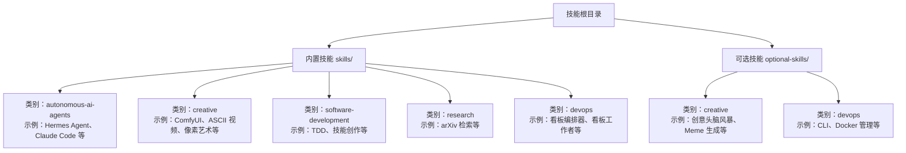
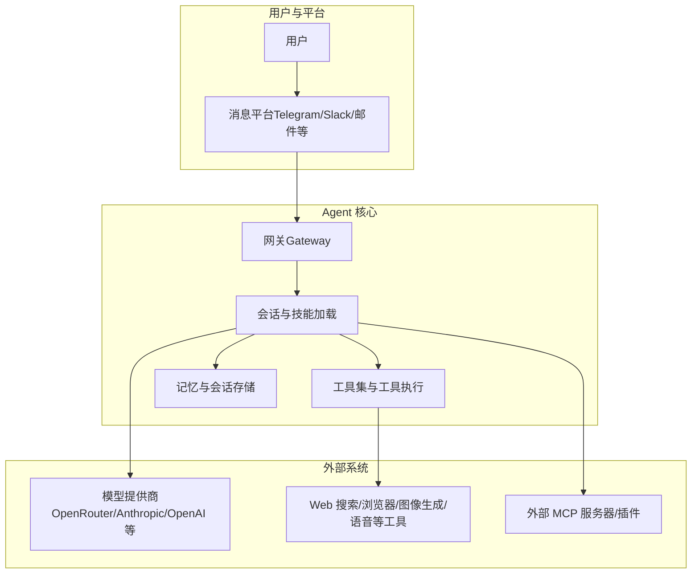
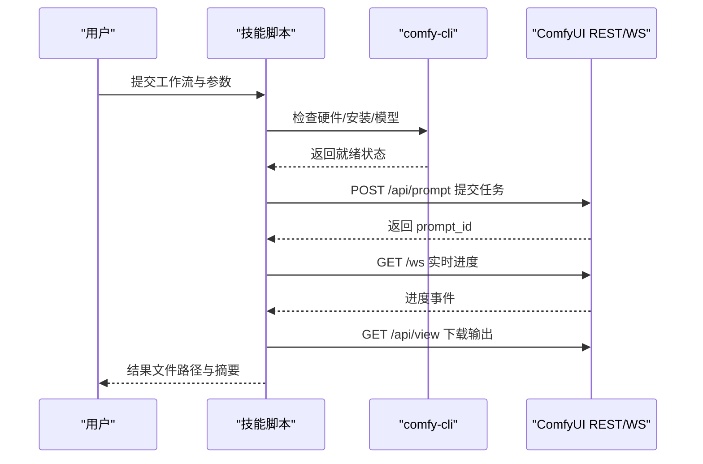
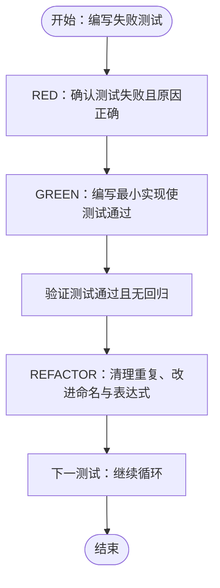
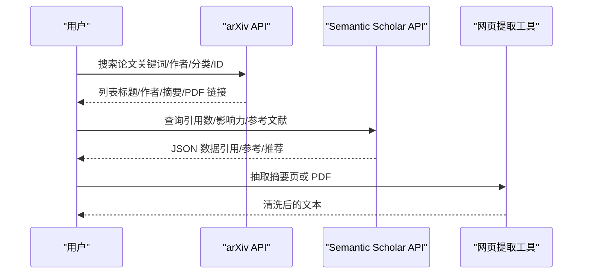
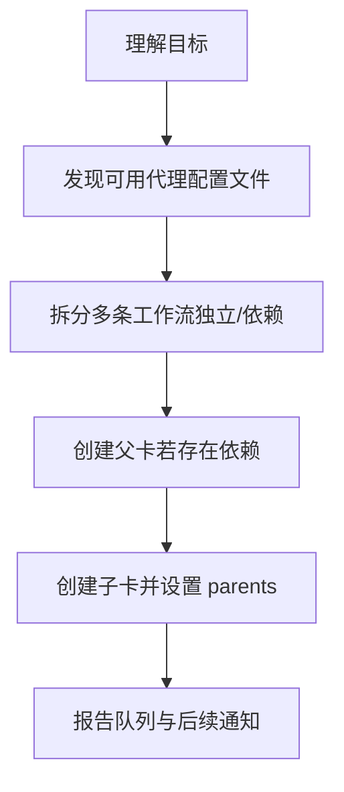
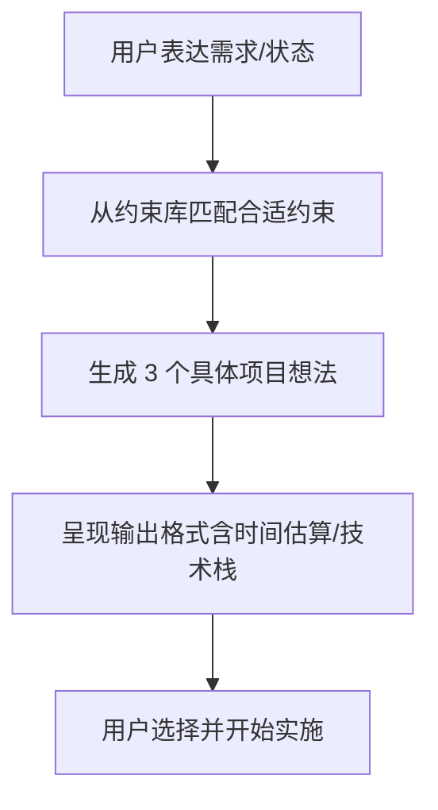
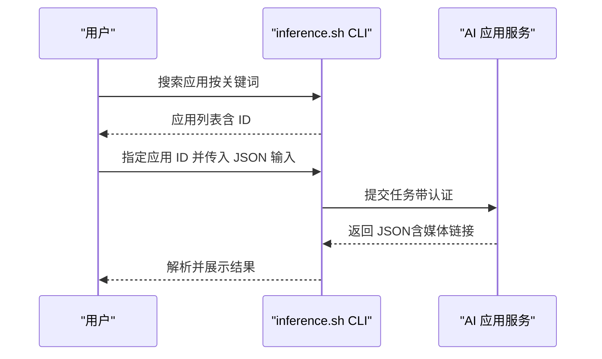
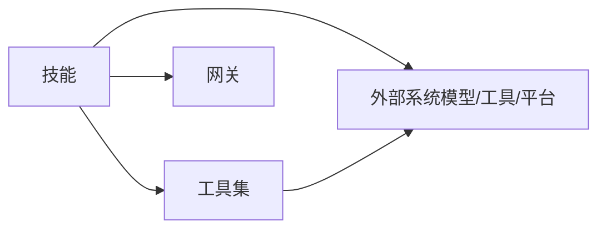

# 技能示例与模板

<cite>
**本文引用的文件**
- [README.md](file://README.md)
- [SKILL.md（Hermes Agent）](file://skills/autonomous-ai-agents/hermes-agent/SKILL.md)
- [SKILL.md（ComfyUI）](file://skills/creative/comfyui/SKILL.md)
- [SKILL.md（软件开发：TDD）](file://skills/software-development/test-driven-development/SKILL.md)
- [SKILL.md（研究：arXiv）](file://skills/research/arxiv/SKILL.md)
- [SKILL.md（DevOps：看板编排器）](file://skills/devops/kanban-orchestrator/SKILL.md)
- [SKILL.md（创意：头脑风暴）](file://optional-skills/creative/creative-ideation/SKILL.md)
- [SKILL.md（DevOps：CLI）](file://optional-skills/devops/cli/SKILL.md)
- [SKILL.md（软件开发：技能创作）](file://skills/software-development/hermes-agent-skill-authoring/SKILL.md)
</cite>

## 目录
1. [简介](#简介)
2. [项目结构](#项目结构)
3. [核心组件](#核心组件)
4. [架构总览](#架构总览)
5. [详细组件分析](#详细组件分析)
6. [依赖关系分析](#依赖关系分析)
7. [性能考虑](#性能考虑)
8. [故障排查指南](#故障排查指南)
9. [结论](#结论)
10. [附录](#附录)

## 简介
本参考文档聚焦“技能示例与模板”，系统梳理 Hermes Agent 的技能体系与实践范式，覆盖工具型、流程型与复合型技能的典型实现，并提供可复用的模板与最佳实践。内容基于仓库中已有的技能示例文件进行归纳总结，帮助读者快速理解如何在不同领域（如创意生成、研究检索、DevOps 协作、软件开发等）构建高质量技能。

## 项目结构
- 技能主要分为两类：
  - 内置技能（skills/.../SKILL.md）：随包分发、面向通用场景，强调可复用性与一致性。
  - 可选技能（optional-skills/.../SKILL.md）：面向特定细分领域或实验性能力，便于按需启用。
- 模板与规范：
  - 软件开发类技能提供“技能创作”模板，明确 frontmatter、结构、大小限制与校验要点。
  - 创意类技能提供“约束驱动”的项目生成模板，强调可操作的触发条件与输出格式。

**图表来源**
- [README.md:1-224](file://README.md#L1-L224)
- [SKILL.md（Hermes Agent）:1-1029](file://skills/autonomous-ai-agents/hermes-agent/SKILL.md#L1-L1029)
- [SKILL.md（ComfyUI）:1-613](file://skills/creative/comfyui/SKILL.md#L1-L613)
- [SKILL.md（软件开发：TDD）:1-344](file://skills/software-development/test-driven-development/SKILL.md#L1-L344)
- [SKILL.md（研究：arXiv）:1-283](file://skills/research/arxiv/SKILL.md#L1-L283)
- [SKILL.md（DevOps：看板编排器）:1-215](file://skills/devops/kanban-orchestrator/SKILL.md#L1-L215)
- [SKILL.md（创意：头脑风暴）:1-153](file://optional-skills/creative/creative-ideation/SKILL.md#L1-L153)
- [SKILL.md（DevOps：CLI）:1-157](file://optional-skills/devops/cli/SKILL.md#L1-L157)
- [SKILL.md（软件开发：技能创作）:1-166](file://skills/software-development/hermes-agent-skill-authoring/SKILL.md#L1-L166)

**章节来源**
- [README.md:1-224](file://README.md#L1-L224)

## 核心组件
- 技能元数据与规范
  - 前言块（frontmatter）：名称、描述、版本、作者、许可证、平台、标签与关联技能等。
  - 结构要求：标题、概述、使用时机、主题章节、常见陷阱、验证清单、一次性配方等。
  - 大小限制：描述长度上限、全文长度上限；建议保持在同类技能的字符范围之内。
- 工具集集成
  - 终端工具、文件工具、网络工具、浏览器工具、图像/视频/语音工具、记忆与会话搜索工具等。
  - 通过工具集开关控制技能可用能力，避免在会话中破坏提示缓存。
- 生命周期与维护
  - 技能的安装、检查更新、卸载、发布到注册表、浏览与选择等管理命令。
  - 技能使用统计与归档由 Curator 后台维护，支持预备份与回滚。

**章节来源**
- [SKILL.md（软件开发：技能创作）:29-94](file://skills/software-development/hermes-agent-skill-authoring/SKILL.md#L29-L94)
- [SKILL.md（Hermes Agent）:111-130](file://skills/autonomous-ai-agents/hermes-agent/SKILL.md#L111-L130)
- [SKILL.md（Hermes Agent）:667-686](file://skills/autonomous-ai-agents/hermes-agent/SKILL.md#L667-L686)

## 架构总览
下图展示了 Hermes Agent 中“技能”与“工具集/平台/网关”的交互关系，以及技能在不同运行形态下的职责边界。

**图表来源**
- [SKILL.md（Hermes Agent）:147-158](file://skills/autonomous-ai-agents/hermes-agent/SKILL.md#L147-L158)
- [SKILL.md（Hermes Agent）:407-444](file://skills/autonomous-ai-agents/hermes-agent/SKILL.md#L407-L444)
- [SKILL.md（Hermes Agent）:342-375](file://skills/autonomous-ai-agents/hermes-agent/SKILL.md#L342-L375)

## 详细组件分析

### 工具型技能：ComfyUI 图像/视频生成
- 设计思路
  - 分层架构：上层使用官方 CLI 进行安装与生命周期管理，下层通过 REST/WebSocket 执行工作流与监控进度。
  - 参数注入与依赖检查：提供脚本自动解析工作流参数、检测缺失节点/模型并一键修复。
  - 输出与日志：统一输出结构化结果，支持云端签名下载与错误追踪。
- 关键流程（执行工作流）

**图表来源**
- [SKILL.md（ComfyUI）:79-94](file://skills/creative/comfyui/SKILL.md#L79-L94)
- [SKILL.md（ComfyUI）:124-190](file://skills/creative/comfyui/SKILL.md#L124-L190)
- [SKILL.md（ComfyUI）:535-548](file://skills/creative/comfyui/SKILL.md#L535-L548)

**章节来源**
- [SKILL.md（ComfyUI）:1-613](file://skills/creative/comfyui/SKILL.md#L1-L613)

### 流程型技能：测试驱动开发（TDD）
- 设计思路
  - 强调“先失败再通过”的红-绿-重构循环，确保测试真正验证行为而非实现细节。
  - 在实现阶段严格最小化代码，重构阶段消除重复、改善命名与表达式。
  - 使用终端工具运行单测与全量回归，保证输出“无错误、无警告”。
- 关键流程（单个循环）

**图表来源**
- [SKILL.md（软件开发：TDD）:55-177](file://skills/software-development/test-driven-development/SKILL.md#L55-L177)
- [SKILL.md（软件开发：TDD）:283-321](file://skills/software-development/test-driven-development/SKILL.md#L283-L321)

**章节来源**
- [SKILL.md（软件开发：TDD）:1-344](file://skills/software-development/test-driven-development/SKILL.md#L1-L344)

### 复合型技能：arXiv 学术研究工作流
- 设计思路
  - 将“检索—评估—阅读—推荐—作者跟踪”串联为完整研究闭环。
  - arXiv API 返回 Atom XML，提供解析脚本或管道处理；语义学者 API 提供引用、参考与推荐。
  - 支持排序、分页与多 ID 获取，适配不同规模的研究需求。
- 关键流程（完整研究工作流）

**图表来源**
- [SKILL.md（研究：arXiv）:244-252](file://skills/research/arxiv/SKILL.md#L244-L252)
- [SKILL.md（研究：arXiv）:192-241](file://skills/research/arxiv/SKILL.md#L192-L241)

**章节来源**
- [SKILL.md（研究：arXiv）:1-283](file://skills/research/arxiv/SKILL.md#L1-L283)

### 复合型技能：DevOps 看板编排器（多代理协作）
- 设计思路
  - “路由，不执行”：编排者不直接实现任务，而是将工作分解为看板卡片并分配给合适的代理配置文件。
  - 任务图谱：独立并行分支、父子依赖链接、人类在环路、目标模式（持续执行直到满足验收标准）。
  - 容错与恢复：当工作者崩溃/幻觉/阻塞时，提供回收、重新指派与模型切换等恢复手段。
- 关键流程（任务分解与创建）

**图表来源**
- [SKILL.md（DevOps：看板编排器）:58-121](file://skills/devops/kanban-orchestrator/SKILL.md#L58-L121)
- [SKILL.md（DevOps：看板编排器）:182-205](file://skills/devops/kanban-orchestrator/SKILL.md#L182-L205)

**章节来源**
- [SKILL.md（DevOps：看板编排器）:1-215](file://skills/devops/kanban-orchestrator/SKILL.md#L1-L215)

### 创意启发：约束驱动的项目生成
- 设计思路
  - 以“约束 + 方向”驱动创造力，约束提供边界，方向提供引导。
  - 通过约束库匹配用户当前状态（学习语言、挑战、闲暇等），生成 3 个具体项目想法。
  - 输出采用统一格式，标注时间估算与技术栈，便于用户挑选与落地。
- 关键流程（生成项目想法）

**图表来源**
- [SKILL.md（创意：头脑风暴）:24-102](file://optional-skills/creative/creative-ideation/SKILL.md#L24-L102)
- [SKILL.md（创意：头脑风暴）:103-122](file://optional-skills/creative/creative-ideation/SKILL.md#L103-L122)

**章节来源**
- [SKILL.md（创意：头脑风暴）:1-153](file://optional-skills/creative/creative-ideation/SKILL.md#L1-L153)

### 工具型技能：inference.sh CLI（云 AI 应用编排）
- 设计思路
  - 通过统一 CLI 访问 150+ AI 应用，无需管理多个提供商密钥。
  - 先搜索应用 ID，再运行并解析 JSON 输出中的媒体链接。
  - 支持本地文件上传（图像/音频等）作为输入。
- 关键流程（运行 AI 应用）

**图表来源**
- [SKILL.md（DevOps：CLI）:46-69](file://optional-skills/devops/cli/SKILL.md#L46-L69)
- [SKILL.md（DevOps：CLI）:107-120](file://optional-skills/devops/cli/SKILL.md#L107-L120)

**章节来源**
- [SKILL.md（DevOps：CLI）:1-157](file://optional-skills/devops/cli/SKILL.md#L1-L157)

### 技能模板库与规范
- 基础模板（软件开发类）
  - 文件位置：skills/software-development/hermes-agent-skill-authoring/SKILL.md
  - 要点：前言块硬性要求（名称、描述、正文非空）、描述长度与全文大小限制、结构化章节、目录放置与校验清单。
- 高级模板（创意/工程）
  - 创意类：约束驱动的项目生成模板，强调触发词与输出格式。
  - 工程类：TDD 循环模板、看板编排模板、arXiv 研究模板等。
- 特定领域模板
  - 图像/视频生成：ComfyUI 模板（两层架构、参数注入、依赖检查、云端差异）。
  - 云应用编排：inference.sh CLI 模板（搜索-运行-解析-上传）。

**章节来源**
- [SKILL.md（软件开发：技能创作）:14-94](file://skills/software-development/hermes-agent-skill-authoring/SKILL.md#L14-L94)
- [SKILL.md（创意：头脑风暴）:16-122](file://optional-skills/creative/creative-ideation/SKILL.md#L16-L122)
- [SKILL.md（ComfyUI）:79-94](file://skills/creative/comfyui/SKILL.md#L79-L94)
- [SKILL.md（DevOps：CLI）:46-69](file://optional-skills/devops/cli/SKILL.md#L46-L69)

## 依赖关系分析
- 技能与工具集
  - 技能通过工具集启用能力（如终端、文件、网络、浏览器、图像/视频/语音、记忆与会话搜索等）。
  - 工具集变更需要重启会话以避免破坏提示缓存。
- 技能与平台/网关
  - 网关负责跨平台消息路由与交付，技能在会话内通过 slash 命令与工具集协同。
- 技能与外部系统
  - 模型提供商、Web 搜索、图像生成、语音合成、MCP 服务器等作为外部能力被技能调用。

**图表来源**
- [SKILL.md（Hermes Agent）:407-444](file://skills/autonomous-ai-agents/hermes-agent/SKILL.md#L407-L444)
- [SKILL.md（Hermes Agent）:147-158](file://skills/autonomous-ai-agents/hermes-agent/SKILL.md#L147-L158)

**章节来源**
- [SKILL.md（Hermes Agent）:407-444](file://skills/autonomous-ai-agents/hermes-agent/SKILL.md#L407-L444)

## 性能考虑
- 执行效率
  - 工具型技能（如 ComfyUI）通过参数注入与依赖检查减少无效重试；批量执行支持并发上限控制。
  - 流程型技能（如 TDD）通过最小实现与即时回归验证，降低调试成本与迭代周期。
- 资源占用
  - 外部工具（图像/视频生成、语音合成）可能受 GPU/内存/并发限制，应结合硬件检查与云端选项进行权衡。
- 稳定性
  - 复合型技能（如看板编排）通过任务图谱与依赖链接，避免重复执行与资源浪费；提供恢复机制应对工作者异常。

[本节为通用指导，不直接分析具体文件]

## 故障排查指南
- ComfyUI
  - 必须使用 API 格式工作流；服务器未启动或模型缺失会导致执行失败；云端免费版受限于部分端点。
  - 建议使用健康检查脚本与依赖检查脚本先行验证。
- TDD
  - 若测试立即通过或报错，需回退到测试失败的状态；确保每次只测试单一行为。
- 看板编排
  - 不要为不存在的代理配置名创建任务；避免过度链接导致任务无法推进；必要时使用回收/重新指派/模型切换。
- arXiv/语义学者
  - 注意速率限制与版本号；对摘要字段进行抽样检查以识别撤稿/更正情况。

**章节来源**
- [SKILL.md（ComfyUI）:550-613](file://skills/creative/comfyui/SKILL.md#L550-L613)
- [SKILL.md（软件开发：TDD）:240-273](file://skills/software-development/test-driven-development/SKILL.md#L240-L273)
- [SKILL.md（DevOps：看板编排器）:164-215](file://skills/devops/kanban-orchestrator/SKILL.md#L164-L215)
- [SKILL.md（研究：arXiv）:254-283](file://skills/research/arxiv/SKILL.md#L254-L283)

## 结论
本参考文档基于仓库内的技能示例，总结了工具型、流程型与复合型技能的典型模式与架构设计，并提供了可复用的模板与规范。通过遵循前言块、结构化章节与大小限制，结合工具集与外部系统的协同，开发者可以快速构建高质量、可维护、可扩展的技能，覆盖从创意生成到工程实践再到研究探索的广泛场景。

## 附录
- 常见问题与解决方案
  - 如何选择合适的技能类型：根据任务是否需要外部工具、是否遵循固定流程、是否涉及多代理协作进行判断。
  - 如何提升技能稳定性：在技能中加入健康检查、依赖验证与错误追踪；在流程型技能中坚持最小实现与即时回归。
- 性能基准与优化案例
  - 批量生成：利用 ComfyUI 的批处理脚本与并发上限，结合云端配额进行吞吐优化。
  - 回归测试：在 TDD 循环中使用终端工具快速定位失败原因，减少调试时间。
- 扩展与定制方法
  - 新增工具集：在工具集定义中添加新工具，并在技能中声明所需工具集。
  - 自定义前端：在技能中提供清晰的触发词与输出格式，便于用户交互与自动化接入。
- 创意灵感与最佳实践
  - 约束驱动的项目生成：从用户状态出发，匹配合适约束，产出可执行的项目清单。
  - 多代理协作：以“路由，不执行”为原则，将复杂任务分解为可并行的子任务，通过看板进行可视化治理。

[本节为概念性总结，不直接分析具体文件]