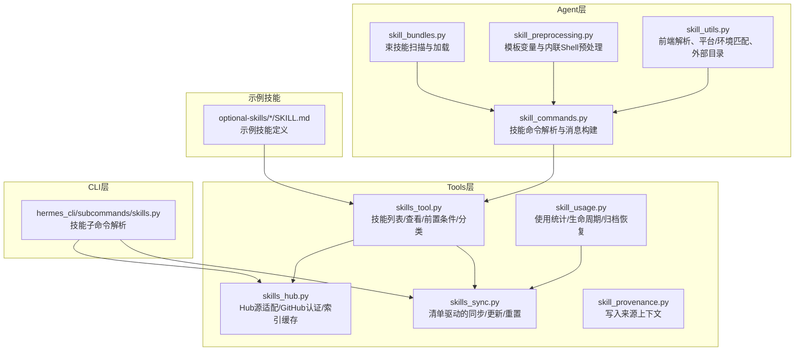
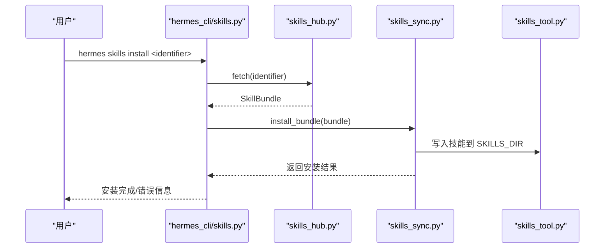
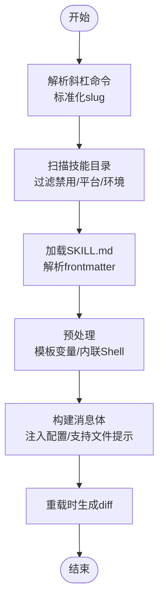
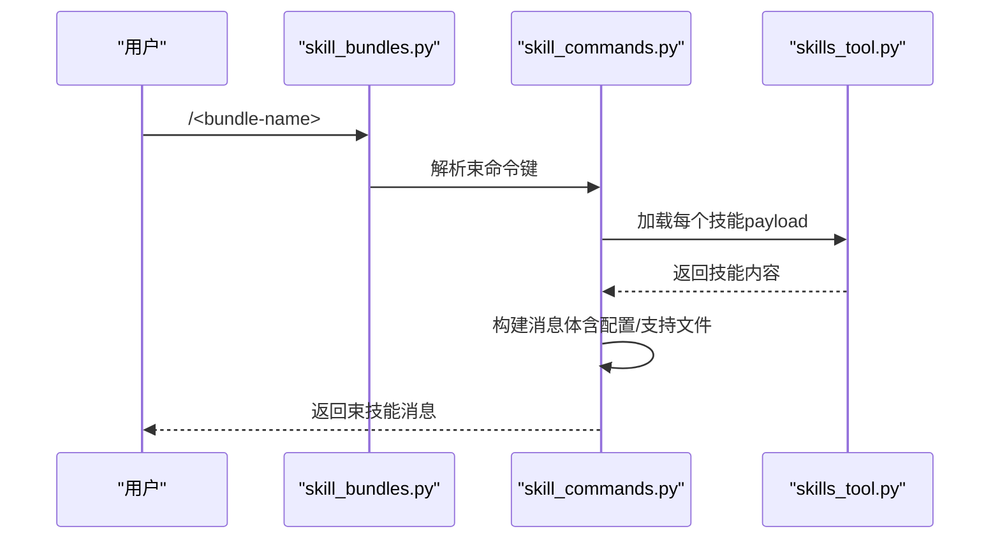
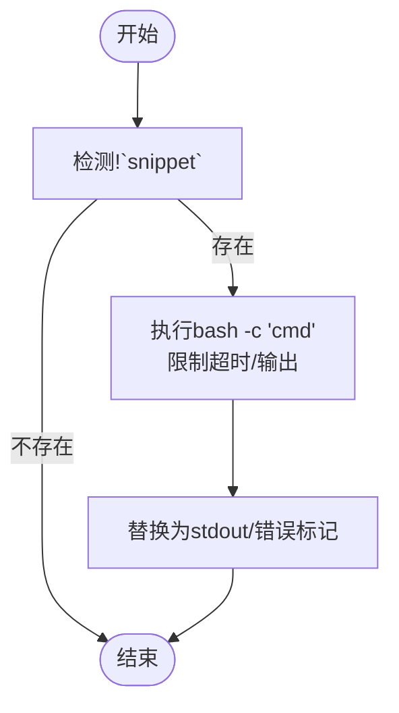
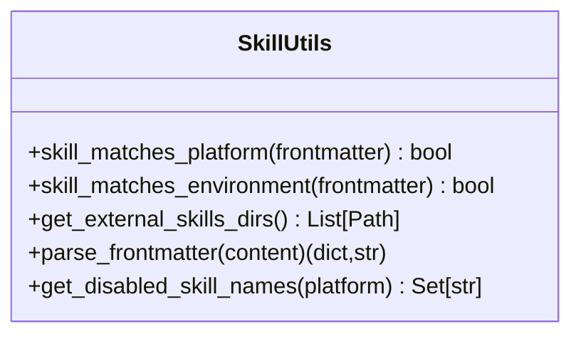
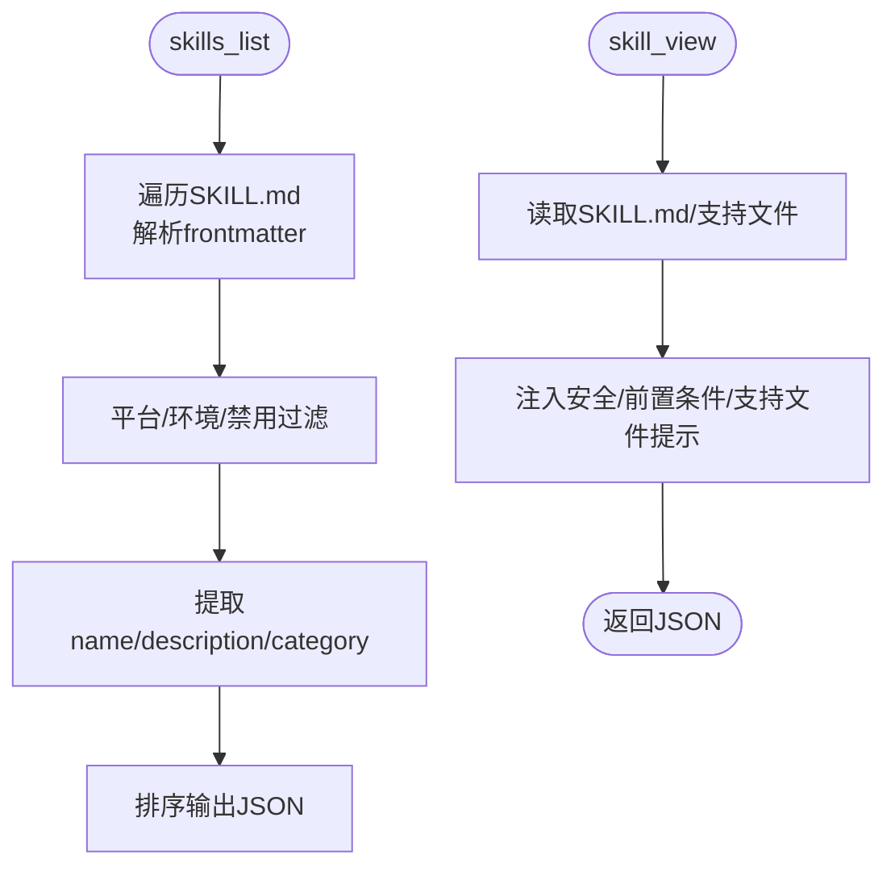
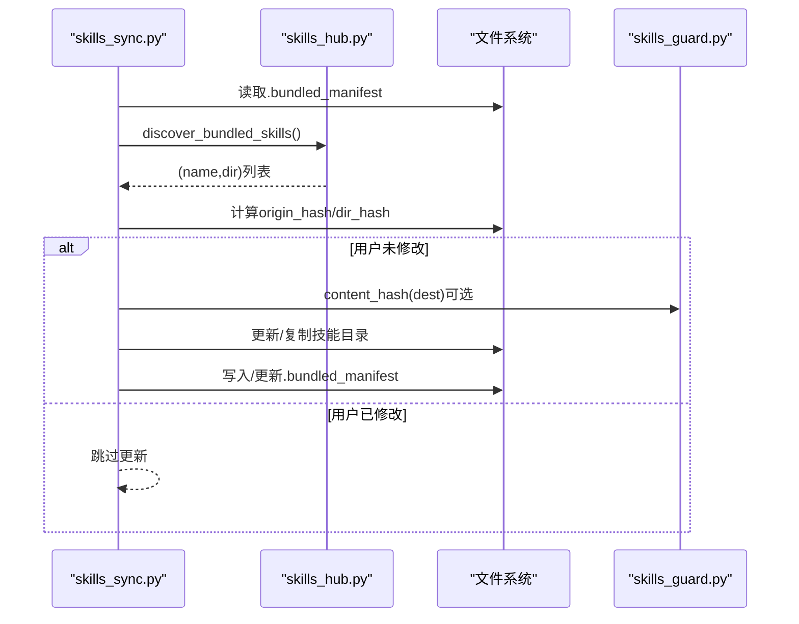
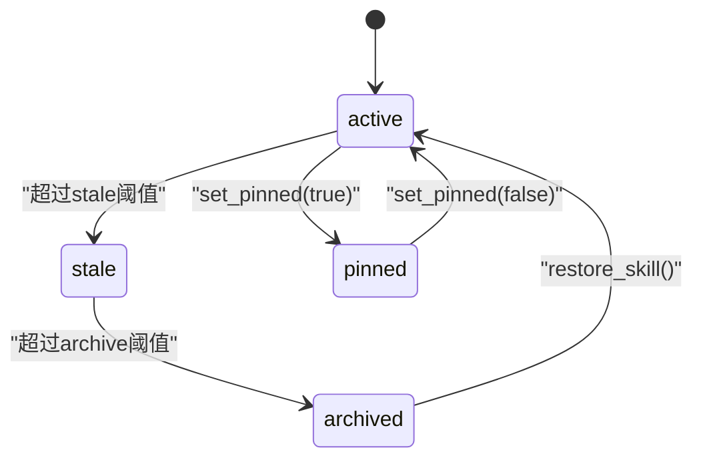
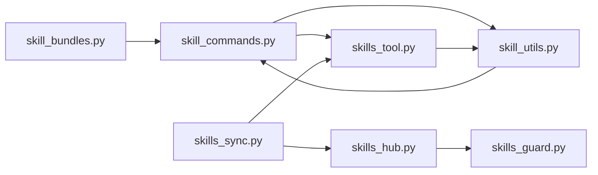

# 技能管理系统

<cite>
**本文档引用的文件**
- [agent/skill_bundles.py](file://agent/skill_bundles.py)
- [agent/skill_commands.py](file://agent/skill_commands.py)
- [agent/skill_preprocessing.py](file://agent/skill_preprocessing.py)
- [agent/skill_utils.py](file://agent/skill_utils.py)
- [hermes_cli/subcommands/skills.py](file://hermes_cli/subcommands/skills.py)
- [tools/skills_tool.py](file://tools/skills_tool.py)
- [tools/skill_usage.py](file://tools/skill_usage.py)
- [tools/skill_provenance.py](file://tools/skill_provenance.py)
- [tools/skills_hub.py](file://tools/skills_hub.py)
- [tools/skills_sync.py](file://tools/skills_sync.py)
- [optional-skills/autonomous-ai-agents/antigravity-cli/SKILL.md](file://optional-skills/autonomous-ai-agents/antigravity-cli/SKILL.md)
- [optional-skills/creative/creative-ideation/SKILL.md](file://optional-skills/creative/creative-ideation/SKILL.md)
</cite>

## 目录
1. [简介](#简介)
2. [项目结构](#项目结构)
3. [核心组件](#核心组件)
4. [架构总览](#架构总览)
5. [详细组件分析](#详细组件分析)
6. [依赖关系分析](#依赖关系分析)
7. [性能考虑](#性能考虑)
8. [故障排除指南](#故障排除指南)
9. [结论](#结论)
10. [附录](#附录)

## 简介
本文件为技能管理系统的全面技术文档，涵盖技能的概念模型、数据结构、创建与编辑、存储与版本控制、动态加载与热更新、依赖关系与调用链管理、打包与分发（技能商店与共享生态）、测试与质量保证、开发指南与最佳实践、性能优化建议，以及丰富的技能示例与实际应用场景。系统以 SKILL.md 为统一技能定义载体，结合束技能（bundle）聚合能力，支持本地与外部技能目录、Hub 安装、同步与更新、使用统计与生命周期管理，以及与工具系统的深度集成。

## 项目结构
技能管理相关的核心模块分布于以下子系统：
- agent 层：技能命令解析、束技能处理、预处理与模板替换、平台/环境过滤
- tools 层：技能工具集（列出、查看、前置条件检查）、Hub 源适配器、同步与清单管理、使用统计与生命周期
- hermes_cli 子命令：技能搜索、安装、配置、审计、发布、快照等 CLI 能力
- optional-skills：官方可选技能示例，展示标准 SKILL.md 格式与元数据组织

**图表来源**
- [agent/skill_commands.py:1-613](file://agent/skill_commands.py#L1-L613)
- [agent/skill_bundles.py:1-411](file://agent/skill_bundles.py#L1-L411)
- [agent/skill_preprocessing.py:1-141](file://agent/skill_preprocessing.py#L1-L141)
- [agent/skill_utils.py:1-740](file://agent/skill_utils.py#L1-L740)
- [tools/skills_tool.py:1-800](file://tools/skills_tool.py#L1-L800)
- [tools/skills_hub.py:1-800](file://tools/skills_hub.py#L1-L800)
- [tools/skills_sync.py:1-933](file://tools/skills_sync.py#L1-L933)
- [tools/skill_usage.py:1-901](file://tools/skill_usage.py#L1-L901)
- [tools/skill_provenance.py:1-79](file://tools/skill_provenance.py#L1-L79)
- [hermes_cli/subcommands/skills.py:1-270](file://hermes_cli/subcommands/skills.py#L1-L270)

**章节来源**
- [agent/skill_commands.py:1-613](file://agent/skill_commands.py#L1-L613)
- [agent/skill_bundles.py:1-411](file://agent/skill_bundles.py#L1-L411)
- [agent/skill_preprocessing.py:1-141](file://agent/skill_preprocessing.py#L1-L141)
- [agent/skill_utils.py:1-740](file://agent/skill_utils.py#L1-L740)
- [tools/skills_tool.py:1-800](file://tools/skills_tool.py#L1-L800)
- [tools/skills_hub.py:1-800](file://tools/skills_hub.py#L1-L800)
- [tools/skills_sync.py:1-933](file://tools/skills_sync.py#L1-L933)
- [tools/skill_usage.py:1-901](file://tools/skill_usage.py#L1-L901)
- [tools/skill_provenance.py:1-79](file://tools/skill_provenance.py#L1-L79)
- [hermes_cli/subcommands/skills.py:1-270](file://hermes_cli/subcommands/skills.py#L1-L270)

## 核心组件
- 技能命令系统：负责将用户输入的斜杠命令解析为具体技能或束技能，构建用于模型的消息体，并注入模板变量、内联Shell结果、配置注入、支持文件提示等信息。
- 束技能系统：将多个技能合并为一次调用，生成统一的激活注释与技能列表，支持缺失技能的宽容加载与记录。
- 预处理与模板：在加载前对 SKILL.md 内容进行模板变量替换与内联Shell执行，限制输出长度，确保安全与一致性。
- 平台与环境匹配：根据技能 frontmatter 的 platforms/environments 字段过滤不可用技能，支持 Termux/Android 特殊场景。
- 技能工具集：提供技能列表、查看、前置条件检查、分类与标签提取、插件技能服务等能力。
- Hub 适配与同步：支持多源技能注册表（GitHub、Claudify、LobeHub 等），提供索引缓存、信任级别、安装路径校验、清单跟踪与更新。
- 使用统计与生命周期：记录技能使用次数与时间戳，区分内置/Hub/手动创建技能，支持自动归档、恢复与保护内置关键技能。
- 写入来源上下文：通过 ContextVar 区分前台用户写入与后台自审写入，避免误判自动生成的技能归属。

**章节来源**
- [agent/skill_commands.py:1-613](file://agent/skill_commands.py#L1-L613)
- [agent/skill_bundles.py:1-411](file://agent/skill_bundles.py#L1-L411)
- [agent/skill_preprocessing.py:1-141](file://agent/skill_preprocessing.py#L1-L141)
- [agent/skill_utils.py:1-740](file://agent/skill_utils.py#L1-L740)
- [tools/skills_tool.py:1-800](file://tools/skills_tool.py#L1-L800)
- [tools/skills_hub.py:1-800](file://tools/skills_hub.py#L1-L800)
- [tools/skills_sync.py:1-933](file://tools/skills_sync.py#L1-L933)
- [tools/skill_usage.py:1-901](file://tools/skill_usage.py#L1-L901)
- [tools/skill_provenance.py:1-79](file://tools/skill_provenance.py#L1-L79)

## 架构总览
技能管理采用“声明式定义 + 动态加载 + 清单驱动”的架构模式：
- 声明式定义：每个技能以 SKILL.md 为根，frontmatter 描述元数据，正文为指导内容；支持 platforms、environments、metadata.herme.config 等字段。
- 动态加载：扫描本地与外部技能目录，解析 frontmatter，构建命令映射与消息体；束技能按需聚合多个技能内容。
- 清单驱动：内置技能通过清单跟踪变更，Hub 技能通过锁文件记录来源与哈希，确保可追溯与可回滚。
- 生命周期：基于使用统计与配置策略，自动归档不常用技能，保留内置关键技能，支持恢复与抑制。

**图表来源**
- [hermes_cli/subcommands/skills.py:1-270](file://hermes_cli/subcommands/skills.py#L1-L270)
- [tools/skills_hub.py:1-800](file://tools/skills_hub.py#L1-L800)
- [tools/skills_sync.py:1-933](file://tools/skills_sync.py#L1-L933)
- [tools/skills_tool.py:1-800](file://tools/skills_tool.py#L1-L800)

## 详细组件分析

### 组件A：技能命令系统（skill_commands）
职责与特性：
- 解析斜杠命令，标准化名称为连字符分隔的 slug，支持下划线与连字符互换。
- 扫描本地与外部技能目录，过滤禁用技能、平台不兼容与环境无关技能。
- 加载 SKILL.md 内容，应用预处理（模板变量、内联Shell），构建消息体，注入配置值与支持文件提示。
- 提供重载能力，保持系统提示缓存不被清空，减少重新扫描成本。

**图表来源**
- [agent/skill_commands.py:1-613](file://agent/skill_commands.py#L1-L613)
- [agent/skill_preprocessing.py:1-141](file://agent/skill_preprocessing.py#L1-L141)
- [agent/skill_utils.py:1-740](file://agent/skill_utils.py#L1-L740)

**章节来源**
- [agent/skill_commands.py:1-613](file://agent/skill_commands.py#L1-L613)
- [agent/skill_preprocessing.py:1-141](file://agent/skill_preprocessing.py#L1-L141)
- [agent/skill_utils.py:1-740](file://agent/skill_utils.py#L1-L740)

### 组件B：束技能系统（skill_bundles）
职责与特性：
- 束技能以 YAML 文件定义，包含 name、description、skills 列表与可选 instruction。
- 支持束技能目录的热扫描与缓存，冲突时优先选择束技能（覆盖同名技能）。
- 构建束技能调用消息，记录已加载与缺失技能，提供激活注释与用户指令注入。

**图表来源**
- [agent/skill_bundles.py:1-411](file://agent/skill_bundles.py#L1-L411)
- [agent/skill_commands.py:1-613](file://agent/skill_commands.py#L1-L613)
- [tools/skills_tool.py:1-800](file://tools/skills_tool.py#L1-L800)

**章节来源**
- [agent/skill_bundles.py:1-411](file://agent/skill_bundles.py#L1-L411)
- [agent/skill_commands.py:1-613](file://agent/skill_commands.py#L1-L613)
- [tools/skills_tool.py:1-800](file://tools/skills_tool.py#L1-L800)

### 组件C：预处理与模板（skill_preprocessing）
职责与特性：
- 模板变量替换：支持 ${HERMES_SKILL_DIR} 与 ${HERMES_SESSION_ID}，仅在可用时替换。
- 内联Shell执行：!`cmd` 形式在技能目录 CWD 下运行，限制超时与输出长度，失败返回简短错误标记。
- 可配置开关：由 skills.inline_shell 与 skills.inline_shell_timeout 控制行为。

**图表来源**
- [agent/skill_preprocessing.py:1-141](file://agent/skill_preprocessing.py#L1-L141)

**章节来源**
- [agent/skill_preprocessing.py:1-141](file://agent/skill_preprocessing.py#L1-L141)

### 组件D：平台与环境匹配（skill_utils）
职责与特性：
- 平台匹配：支持 macos/linux/windows/termux/android 映射，Termux 场景下将 linux/termux/android 视为兼容。
- 环境匹配：kanban/docker/s6 等环境标签，作为“相关性”过滤而非硬性兼容，显式加载不受影响。
- 外部目录：从配置中解析 skills.external_dirs，去重与绝对化，支持 ~ 与环境变量展开。
- 前端解析：YAML 前言解析，容错键值分割，支持嵌套结构与列表。

**图表来源**
- [agent/skill_utils.py:1-740](file://agent/skill_utils.py#L1-L740)

**章节来源**
- [agent/skill_utils.py:1-740](file://agent/skill_utils.py#L1-L740)

### 组件E：技能工具集（skills_tool）
职责与特性：
- 技能列表：最小化元数据（name/description/category），避免高 token 成本。
- 技能查看：加载完整内容、标签、相关文件，支持插件技能与本地技能。
- 前置条件：解析 prerequisites 与 setup.collect_secrets，生成环境变量需求列表。
- 分类与标签：从 frontmatter.metadata.hermes.tags 或 metadata.tags 提取，支持字符串/列表多种格式。
- 环境变量持久化：从 HERMES_HOME/.env 读取，支持交互式密钥捕获回调。

**图表来源**
- [tools/skills_tool.py:1-800](file://tools/skills_tool.py#L1-L800)
- [agent/skill_utils.py:1-740](file://agent/skill_utils.py#L1-L740)

**章节来源**
- [tools/skills_tool.py:1-800](file://tools/skills_tool.py#L1-L800)
- [agent/skill_utils.py:1-740](file://agent/skill_utils.py#L1-L740)

### 组件F：Hub 适配与同步（skills_hub/skills_sync）
职责与特性：
- Hub 适配：GitHubSource 支持多 tap，默认仓库与路径，信任级别判定，索引缓存与重试退避。
- 同步策略：清单驱动，区分新建、用户修改、上游更新、删除清理；内置技能通过 .bundled_manifest 追踪。
- 安全校验：安装路径规范化与逃逸检测、锁文件 install_path 校验、内容哈希对比。
- 官方可选技能：optional-skills 目录的后向兼容与证明回填。

**图表来源**
- [tools/skills_sync.py:1-933](file://tools/skills_sync.py#L1-L933)
- [tools/skills_hub.py:1-800](file://tools/skills_hub.py#L1-L800)

**章节来源**
- [tools/skills_sync.py:1-933](file://tools/skills_sync.py#L1-L933)
- [tools/skills_hub.py:1-800](file://tools/skills_hub.py#L1-L800)

### 组件G：使用统计与生命周期（skill_usage）
职责与特性：
- 使用侧车：.usage.json 记录 use_count/view_count/patch_count 与时间戳，原子写入。
- 生命周期：active/stale/archived/pinned 状态机，内置关键技能保护，Hub/内置技能区分管理。
- 归档与恢复：扁平化归档目录，冲突重命名，恢复时校验 Hub/内置状态，清除抑制条目。

**图表来源**
- [tools/skill_usage.py:1-901](file://tools/skill_usage.py#L1-L901)

**章节来源**
- [tools/skill_usage.py:1-901](file://tools/skill_usage.py#L1-L901)

### 组件H：写入来源上下文（skill_provenance）
职责与特性：
- ContextVar 维护当前写入来源（前台/后台自审），在后台自审分支中标记 agent 创建的技能，避免误判。
- 与 Curator 协作，确保自动生成的技能纳入生命周期管理。

**章节来源**
- [tools/skill_provenance.py:1-79](file://tools/skill_provenance.py#L1-L79)

### 组件I：CLI 子命令（skills）
职责与特性：
- 子命令：browse/search/install/inspect/list/check/update/audit/uninstall/reset/opt-in/opt-out/repair/publish/snapshot/tap/config
- 支持多源：all/official/skills-sh/well-known/github/clawhub/lobehub/browse-sh
- 输出：表格或 JSON，便于脚本友好输出。

**章节来源**
- [hermes_cli/subcommands/skills.py:1-270](file://hermes_cli/subcommands/skills.py#L1-L270)

## 依赖关系分析
- 模块耦合：
  - skill_commands 依赖 skills_tool 与 skill_utils 获取技能视图与元数据。
  - skill_bundles 依赖 skill_commands 的消息构建与技能加载逻辑。
  - skills_tool 依赖 skill_utils 的前端解析与外部目录解析。
  - skills_hub 依赖 skills_guard 的内容哈希与信任仓库列表。
  - skills_sync 依赖 skills_tool 的内容哈希与 skills_hub 的锁文件结构。
  - skill_usage 与 skill_provenance 为横切关注点，被多个模块间接使用。
- 外部依赖：
  - httpx、PyJWT（GitHub App）、yaml、subprocess（bash）、atomic_replace 工具函数。
- 循环依赖：
  - 通过延迟导入与模块间接口解耦，避免循环导入。

**图表来源**
- [agent/skill_commands.py:1-613](file://agent/skill_commands.py#L1-L613)
- [agent/skill_bundles.py:1-411](file://agent/skill_bundles.py#L1-L411)
- [agent/skill_utils.py:1-740](file://agent/skill_utils.py#L1-L740)
- [tools/skills_tool.py:1-800](file://tools/skills_tool.py#L1-L800)
- [tools/skills_hub.py:1-800](file://tools/skills_hub.py#L1-L800)
- [tools/skills_sync.py:1-933](file://tools/skills_sync.py#L1-L933)

**章节来源**
- [agent/skill_commands.py:1-613](file://agent/skill_commands.py#L1-L613)
- [agent/skill_bundles.py:1-411](file://agent/skill_bundles.py#L1-L411)
- [agent/skill_utils.py:1-740](file://agent/skill_utils.py#L1-L740)
- [tools/skills_tool.py:1-800](file://tools/skills_tool.py#L1-L800)
- [tools/skills_hub.py:1-800](file://tools/skills_hub.py#L1-L800)
- [tools/skills_sync.py:1-933](file://tools/skills_sync.py#L1-L933)

## 性能考虑
- 缓存与增量扫描：
  - 技能命令与束技能均维护内存缓存与目录 mtime 快照，仅在变更时重扫，降低磁盘与 YAML 解析开销。
- 预处理限制：
  - 内联Shell超时与输出截断，防止异常命令导致上下文膨胀。
- 索引缓存：
  - Hub 源使用 TTL 缓存远程索引，减少重复网络请求。
- 原子写入：
  - 清单与使用侧车采用临时文件 + 替换写入，避免部分写入损坏。
- 建议：
  - 合理设置 skills.inline_shell_timeout，避免长耗时命令阻塞。
  - 对大型技能包启用支持文件按需加载（skill_view(file_path=...)）。
  - 在 CI/批量场景中复用缓存，避免频繁重扫。

[本节为通用指导，无需特定文件引用]

## 故障排除指南
- 技能无法加载：
  - 检查平台/环境匹配（platforms/environments）与禁用列表（skills.disabled/platform_disabled）。
  - 确认 SKILL.md frontmatter 正确，name/description 存在且未被禁用。
- 束技能缺失技能：
  - 束技能会宽容加载，记录缺失技能；可在消息头看到“Skills missing (skipped)”提示。
- Hub 安装失败：
  - 检查 GitHub 认证（GITHUB_TOKEN/GH_TOKEN/gh CLI/App），确认 URL 安全与网站策略允许访问。
  - 查看 .hub/quarantine 与 .hub/audit.log 获取详细日志。
- 同步冲突：
  - 用户修改过的内置技能会被跳过更新；使用 hermes skills reset <name> 清理清单后重试。
- 使用统计异常：
  - .usage.json 采用原子写入；若损坏可删除后由系统重建基础记录。
- 写入来源混淆：
  - 确保后台自审分支正确设置 ContextVar，避免将前台用户写入误判为自动生成。

**章节来源**
- [agent/skill_utils.py:1-740](file://agent/skill_utils.py#L1-L740)
- [agent/skill_bundles.py:1-411](file://agent/skill_bundles.py#L1-L411)
- [tools/skills_hub.py:1-800](file://tools/skills_hub.py#L1-L800)
- [tools/skills_sync.py:1-933](file://tools/skills_sync.py#L1-L933)
- [tools/skill_usage.py:1-901](file://tools/skill_usage.py#L1-L901)
- [tools/skill_provenance.py:1-79](file://tools/skill_provenance.py#L1-L79)

## 结论
技能管理系统以 SKILL.md 为核心，结合束技能聚合、Hub 分发、清单驱动同步与使用统计生命周期管理，形成完整的技能生态闭环。通过严格的平台/环境过滤、安全的安装路径校验与原子写入策略，系统在易用性与安全性之间取得平衡。开发者可通过标准模板快速创建高质量技能，借助 CLI 与 Hub 实现便捷的分发与维护。

[本节为总结性内容，无需特定文件引用]

## 附录

### 技能示例与实际应用场景
- 示例一：Antigravity CLI 技能（antigravity-cli）
  - 适用场景：在终端中操作 agy 二进制，调试权限与插件状态。
  - 关键字段：platforms: [linux, macos, windows]，metadata.herme.tags 包含 CLI/插件/沙箱。
  - 支持文件：references/cli-docs.md。
- 示例二：创意头脑风暴（creative-ideation）
  - 适用场景：通过约束生成项目想法，适合学习、创作与原型设计。
  - 关键字段：metadata.herme.tags 包含 Creative/Ideation/Projects。
  - 输出格式：Markdown 表格与项目描述模板。

**章节来源**
- [optional-skills/autonomous-ai-agents/antigravity-cli/SKILL.md:1-178](file://optional-skills/autonomous-ai-agents/antigravity-cli/SKILL.md#L1-L178)
- [optional-skills/creative/creative-ideation/SKILL.md:1-153](file://optional-skills/creative/creative-ideation/SKILL.md#L1-L153)

### 开发指南与最佳实践
- SKILL.md 规范：
  - 必填：name（≤64）、description（≤1024）。
  - 可选：version/license/platforms/environments/prerequisites/setup/required_environment_variables/metadata。
- 模板与内联命令：
  - 使用 ${HERMES_SKILL_DIR}/${HERMES_SESSION_ID} 注入路径与会话信息。
  - 内联 Shell 仅在需要时开启，设置合理超时。
- 束技能：
  - 将相关技能组合为束，提供 bundle instruction 与用户指令注入。
- 分发与版本控制：
  - Hub 安装后通过 .hub/lock.json 追踪来源与哈希；内置技能通过 .bundled_manifest 管理。
- 测试与验证：
  - 使用 hermes skills audit --deep 进行 AST 级分析；定期 hermes skills check/update 保持最新。
- 性能优化：
  - 大型技能拆分为 references/templates/scripts/assets，按需加载。
  - 合理使用外部目录与索引缓存，减少重复扫描。

[本节为通用指导，无需特定文件引用]