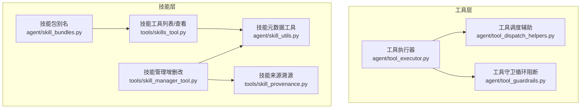
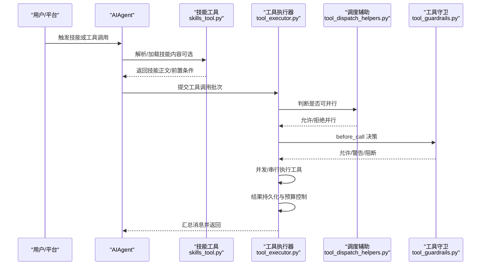
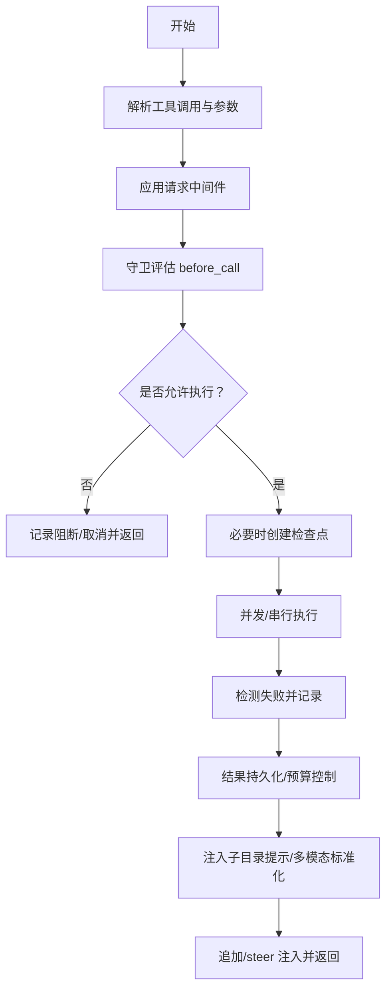
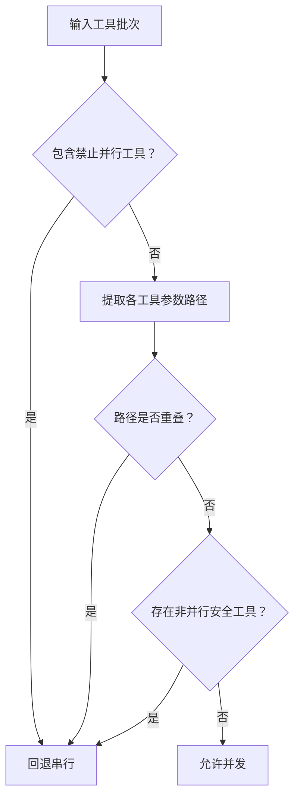
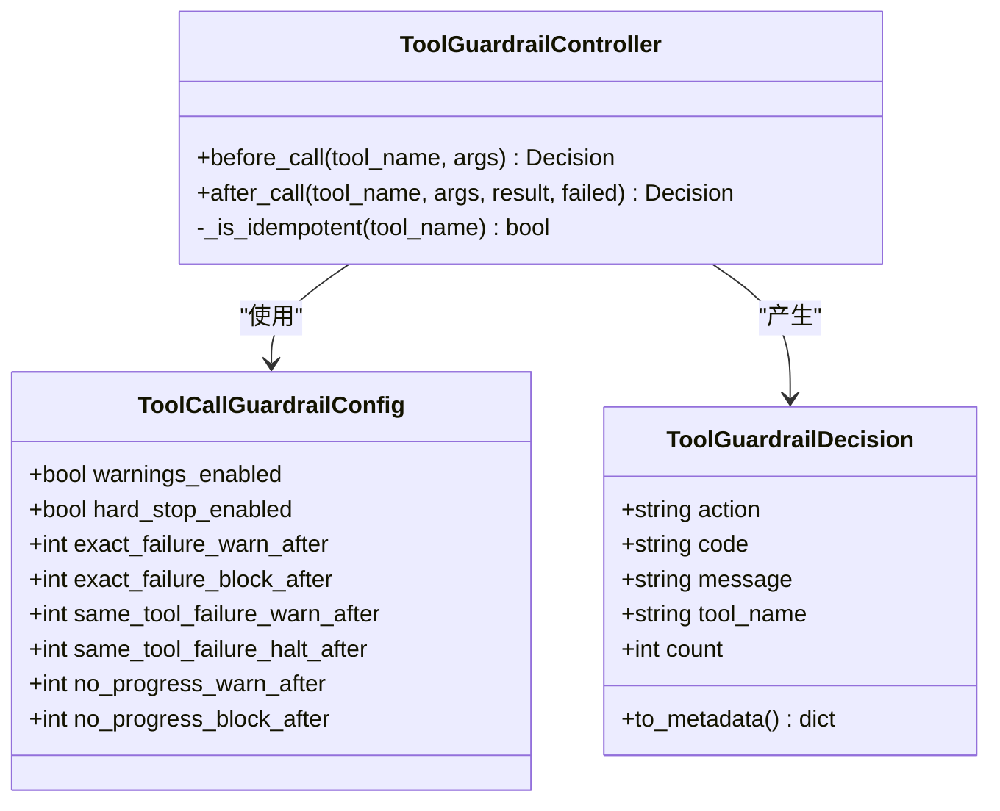
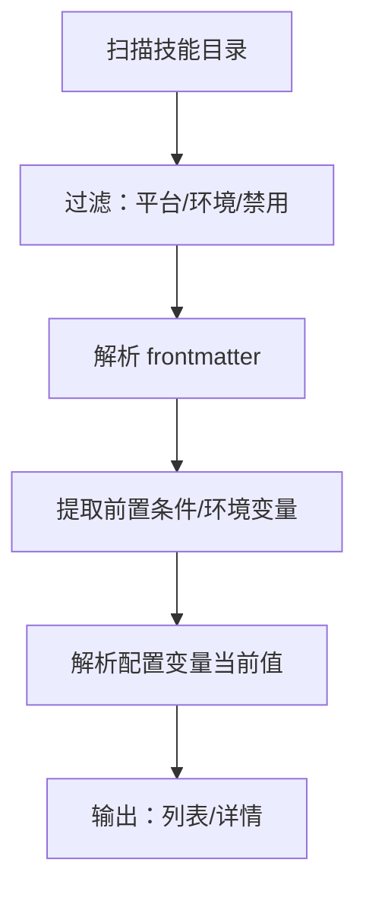
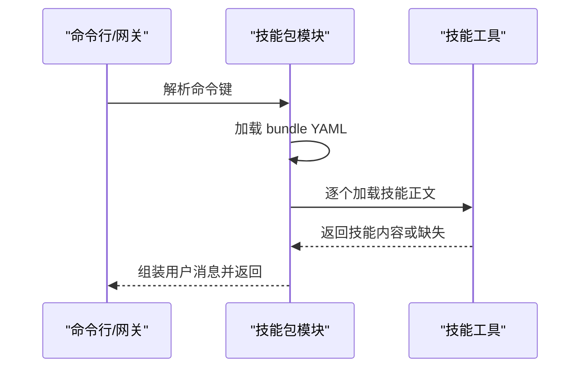
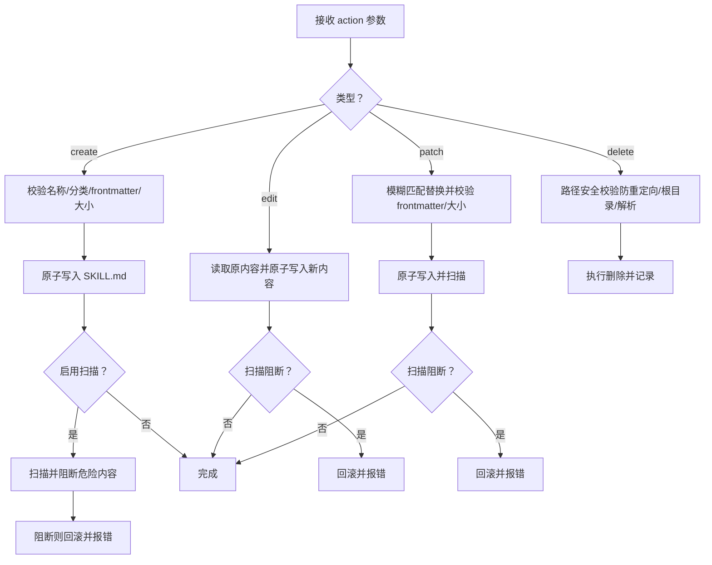
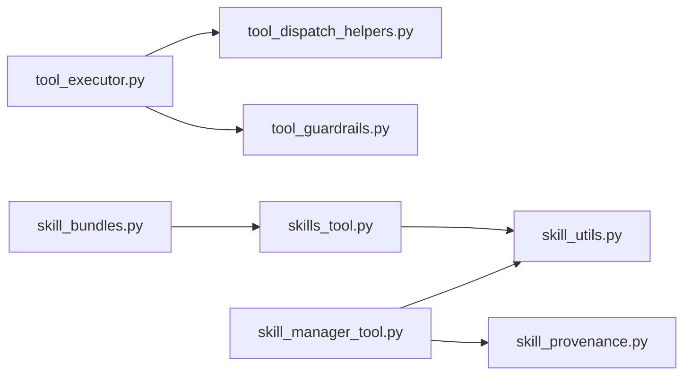

# 技能调用与执行

<cite>
**本文引用的文件**
- [agent/tool_executor.py](file://agent/tool_executor.py)
- [agent/tool_dispatch_helpers.py](file://agent/tool_dispatch_helpers.py)
- [agent/tool_guardrails.py](file://agent/tool_guardrails.py)
- [agent/skill_utils.py](file://agent/skill_utils.py)
- [agent/skill_bundles.py](file://agent/skill_bundles.py)
- [tools/skill_manager_tool.py](file://tools/skill_manager_tool.py)
- [tools/skills_tool.py](file://tools/skills_tool.py)
- [tools/skill_provenance.py](file://tools/skill_provenance.py)
</cite>

## 目录
1. [引言](#引言)
2. [项目结构](#项目结构)
3. [核心组件](#核心组件)
4. [架构总览](#架构总览)
5. [详细组件分析](#详细组件分析)
6. [依赖分析](#依赖分析)
7. [性能考虑](#性能考虑)
8. [故障排查指南](#故障排查指南)
9. [结论](#结论)
10. [附录](#附录)

## 引言
本文件面向“技能调用与执行”的技术实现，系统性阐述以下主题：
- 技能选择与加载：从目录扫描、平台/环境匹配到前置条件解析与安全校验
- 调用机制与执行流程：串行与并行调度、中间件与守卫（guardrails）介入点、结果归档与预算控制
- 动态加载与初始化：外部技能目录、插件技能、配置变量声明与解析
- 安全隔离与权限控制：路径安全、符号链接防护、代理创建内容的安全扫描
- 并发执行与资源管理：线程池大小、路径作用域并行规则、破坏性命令检测
- 执行结果处理与错误恢复：后置钩子、失败分类、循环阻断与恢复建议
- 性能监控与调试：进度回调、超时心跳、日志与可视化提示
- 优化策略与最佳实践：批量并行规则、参数规范化、结果预处理与预算约束

## 项目结构
技能系统围绕“工具层”与“技能层”两条主线协同工作：
- 工具层负责具体动作的执行与编排（如终端命令、文件读写、网络请求等），并提供并发执行、守卫控制、结果持久化与预算控制等能力
- 技能层负责技能的发现、加载、前置条件检查、安全扫描与运行时配置解析，并支持技能打包与别名

图示来源
- [agent/tool_executor.py:243-767](file://agent/tool_executor.py#L243-L767)
- [agent/tool_dispatch_helpers.py:103-146](file://agent/tool_dispatch_helpers.py#L103-L146)
- [agent/tool_guardrails.py:224-375](file://agent/tool_guardrails.py#L224-L375)
- [agent/skill_utils.py:163-304](file://agent/skill_utils.py#L163-L304)
- [agent/skill_bundles.py:168-340](file://agent/skill_bundles.py#L168-L340)
- [tools/skills_tool.py:687-750](file://tools/skills_tool.py#L687-L750)
- [tools/skill_manager_tool.py:59-102](file://tools/skill_manager_tool.py#L59-L102)
- [tools/skill_provenance.py:48-78](file://tools/skill_provenance.py#L48-L78)

章节来源
- [agent/tool_executor.py:243-767](file://agent/tool_executor.py#L243-L767)
- [agent/tool_dispatch_helpers.py:103-146](file://agent/tool_dispatch_helpers.py#L103-L146)
- [agent/tool_guardrails.py:224-375](file://agent/tool_guardrails.py#L224-L375)
- [agent/skill_utils.py:163-304](file://agent/skill_utils.py#L163-L304)
- [agent/skill_bundles.py:168-340](file://agent/skill_bundles.py#L168-L340)
- [tools/skills_tool.py:687-750](file://tools/skills_tool.py#L687-L750)
- [tools/skill_manager_tool.py:59-102](file://tools/skill_manager_tool.py#L59-L102)
- [tools/skill_provenance.py:48-78](file://tools/skill_provenance.py#L48-L78)

## 核心组件
- 工具执行器：负责解析模型函数调用、应用中间件、执行守卫决策、并发调度、结果持久化与预算控制
- 工具调度辅助：定义并行批处理规则（路径作用域、破坏性命令、交互式工具禁并行等）
- 工具守卫：基于“精确失败次数、同工具失败次数、无进展重复”三类阈值进行警告/阻断/停机决策
- 技能工具：提供技能列表与查看能力，解析前置条件、平台/环境匹配、配置变量声明与解析
- 技能包：将多个技能合并为一个“别名”，便于一次性加载
- 技能管理：提供技能的创建、编辑、补丁、删除与支持文件管理，并内置安全扫描与路径安全校验
- 技能来源溯源：区分前台用户直接操作与后台自审分支产生的技能写入，避免误判

章节来源
- [agent/tool_executor.py:243-767](file://agent/tool_executor.py#L243-L767)
- [agent/tool_dispatch_helpers.py:103-146](file://agent/tool_dispatch_helpers.py#L103-L146)
- [agent/tool_guardrails.py:224-375](file://agent/tool_guardrails.py#L224-L375)
- [tools/skills_tool.py:687-750](file://tools/skills_tool.py#L687-L750)
- [agent/skill_bundles.py:168-340](file://agent/skill_bundles.py#L168-L340)
- [tools/skill_manager_tool.py:59-102](file://tools/skill_manager_tool.py#L59-L102)
- [tools/skill_provenance.py:48-78](file://tools/skill_provenance.py#L48-L78)

## 架构总览
下图展示一次“技能触发的工具调用”的端到端流程，涵盖技能加载、参数传递、中间件、守卫、并发执行与结果归档。

图示来源
- [tools/skills_tool.py:687-750](file://tools/skills_tool.py#L687-L750)
- [agent/tool_executor.py:243-767](file://agent/tool_executor.py#L243-L767)
- [agent/tool_dispatch_helpers.py:103-146](file://agent/tool_dispatch_helpers.py#L103-L146)
- [agent/tool_guardrails.py:241-283](file://agent/tool_guardrails.py#L241-L283)

## 详细组件分析

### 工具执行器：并发与串行调度
- 并发执行入口：解析工具调用、应用请求中间件、守卫评估、必要时进行快照（文件变更前）与活动心跳；通过线程池并发执行，最大工作者数受控
- 串行执行入口：逐个工具检查中断信号，遇中断则跳过剩余调用并记录取消消息
- 结果处理：多模态结果标准化、子目录提示注入、结果持久化、预算限制与“/steer”注入
- 中间件与后置钩子：在执行前后注入中间件链路与后置回调，用于审计与可观测性

图示来源
- [agent/tool_executor.py:243-767](file://agent/tool_executor.py#L243-L767)

章节来源
- [agent/tool_executor.py:243-767](file://agent/tool_executor.py#L243-L767)

### 工具调度辅助：并行规则与路径作用域
- 禁止并行的工具集合（如澄清工具）
- 只读且无共享状态的工具集合
- 路径作用域工具（读写/补丁文件）需确保目标路径不重叠
- 终端破坏性命令启发式识别（覆盖写入、危险命令模式）
- MCP 工具并行性由其服务器声明决定

图示来源
- [agent/tool_dispatch_helpers.py:103-146](file://agent/tool_dispatch_helpers.py#L103-L146)

章节来源
- [agent/tool_dispatch_helpers.py:103-146](file://agent/tool_dispatch_helpers.py#L103-L146)

### 工具守卫：循环阻断与恢复建议
- 配置项：警告与硬停启用、各类阈值
- 策略维度：
  - 精确失败（相同签名）达到阈值即阻断
  - 同一工具连续失败达到阈值即停机
  - 无进展重复（只读工具）达到阈值即阻断
- 输出：允许/警告/阻断/停机决策，附带计数与签名信息；可生成合成结果与恢复建议

图示来源
- [agent/tool_guardrails.py:63-174](file://agent/tool_guardrails.py#L63-L174)
- [agent/tool_guardrails.py:224-375](file://agent/tool_guardrails.py#L224-L375)

章节来源
- [agent/tool_guardrails.py:63-174](file://agent/tool_guardrails.py#L63-L174)
- [agent/tool_guardrails.py:224-375](file://agent/tool_guardrails.py#L224-L375)

### 技能工具：发现、前置条件与配置解析
- 发现与过滤：遍历本地与外部技能目录，排除 VCS/缓存/支持目录；按平台与环境标签过滤
- 前置条件：解析 YAML frontmatter，提取平台/环境/前置变量/收集密钥等
- 配置变量：声明逻辑键、默认值、提示语；从配置中解析当前值并展开路径
- 列表与查看：最小化令牌消耗的元数据列表，按需加载完整内容

图示来源
- [tools/skills_tool.py:602-750](file://tools/skills_tool.py#L602-L750)
- [agent/skill_utils.py:163-304](file://agent/skill_utils.py#L163-L304)

章节来源
- [tools/skills_tool.py:602-750](file://tools/skills_tool.py#L602-L750)
- [agent/skill_utils.py:163-304](file://agent/skill_utils.py#L163-L304)

### 技能包（别名）：批量加载与冲突处理
- 存储于用户目录下的 YAML 文件，声明技能名称列表与可选说明
- 命令键解析：大小写不敏感、连字符与下划线互通
- 加载策略：若引用技能缺失，仍加载其余技能并标注缺失项
- 冲突优先级：bundle 名称优先于同名技能

图示来源
- [agent/skill_bundles.py:168-340](file://agent/skill_bundles.py#L168-L340)

章节来源
- [agent/skill_bundles.py:168-340](file://agent/skill_bundles.py#L168-L340)

### 技能管理：创建、编辑、补丁与删除
- 创建：校验名称/分类、frontmatter、内容长度；原子写入 SKILL.md；可选安全扫描
- 编辑：全量替换 SKILL.md；回滚与扫描
- 补丁：模糊匹配查找替换；支持多处替换；保持 frontmatter 结构
- 删除：严格路径安全校验（防 symlink/junction、根目录保护、路径解析）
- 安全扫描：对代理创建的技能可启用扫描，危险内容阻断
- 来源溯源：区分前台与后台自审分支，避免误判为可自动整理的“代理创建”

图示来源
- [tools/skill_manager_tool.py:559-800](file://tools/skill_manager_tool.py#L559-L800)
- [tools/skill_provenance.py:48-78](file://tools/skill_provenance.py#L48-L78)

章节来源
- [tools/skill_manager_tool.py:559-800](file://tools/skill_manager_tool.py#L559-L800)
- [tools/skill_provenance.py:48-78](file://tools/skill_provenance.py#L48-L78)

## 依赖分析
- 工具执行器依赖调度辅助（并行规则）、守卫（循环阻断）、结果存储（持久化与预算）、显示与中间件（进度/后置钩子）
- 技能工具依赖技能元数据工具（平台/环境/禁用列表/外部目录）、配置解析与环境变量加载
- 技能包依赖技能工具的加载能力与消息构建
- 技能管理依赖路径安全、模糊匹配、原子写入与安全扫描

图示来源
- [agent/tool_executor.py:243-767](file://agent/tool_executor.py#L243-L767)
- [agent/tool_dispatch_helpers.py:103-146](file://agent/tool_dispatch_helpers.py#L103-L146)
- [agent/tool_guardrails.py:224-375](file://agent/tool_guardrails.py#L224-L375)
- [tools/skills_tool.py:602-750](file://tools/skills_tool.py#L602-L750)
- [agent/skill_utils.py:416-496](file://agent/skill_utils.py#L416-L496)
- [agent/skill_bundles.py:168-340](file://agent/skill_bundles.py#L168-L340)
- [tools/skill_manager_tool.py:559-800](file://tools/skill_manager_tool.py#L559-L800)
- [tools/skill_provenance.py:48-78](file://tools/skill_provenance.py#L48-L78)

章节来源
- [agent/tool_executor.py:243-767](file://agent/tool_executor.py#L243-L767)
- [agent/tool_dispatch_helpers.py:103-146](file://agent/tool_dispatch_helpers.py#L103-L146)
- [agent/tool_guardrails.py:224-375](file://agent/tool_guardrails.py#L224-L375)
- [tools/skills_tool.py:602-750](file://tools/skills_tool.py#L602-L750)
- [agent/skill_utils.py:416-496](file://agent/skill_utils.py#L416-L496)
- [agent/skill_bundles.py:168-340](file://agent/skill_bundles.py#L168-L340)
- [tools/skill_manager_tool.py:559-800](file://tools/skill_manager_tool.py#L559-L800)
- [tools/skill_provenance.py:48-78](file://tools/skill_provenance.py#L48-L78)

## 性能考虑
- 并发度控制：固定最大工作者数量，避免线程风暴；对长批处理周期性心跳防止网关误判空闲
- 并行规则：仅在路径互不重叠且工具集满足安全前提时才并行，减少锁争用与竞态
- 结果预处理：多模态结果标准化与文本摘要，降低后续适配成本
- 预算与持久化：回合预算强制裁剪，避免历史消息无限膨胀
- 日志与可视化：进度回调与可爱提示，提升可观测性与交互体验

## 故障排查指南
- 并发被拒：检查是否存在交互式工具、路径重叠或非并行安全工具
- 循环阻断：关注守卫警告/停机提示，调整参数或切换策略
- 失败分类：终端退出码、内存容量告警、通用错误关键字等会被识别为失败
- 安全扫描阻断：代理创建的技能若含危险内容会被阻断，需清理后重试
- 路径安全：删除时出现 symlink/junction 或根目录保护错误，需手动修正路径

章节来源
- [agent/tool_dispatch_helpers.py:103-146](file://agent/tool_dispatch_helpers.py#L103-L146)
- [agent/tool_guardrails.py:285-375](file://agent/tool_guardrails.py#L285-L375)
- [agent/tool_executor.py:526-531](file://agent/tool_executor.py#L526-L531)
- [tools/skill_manager_tool.py:77-102](file://tools/skill_manager_tool.py#L77-L102)
- [tools/skill_manager_tool.py:150-208](file://tools/skill_manager_tool.py#L150-L208)

## 结论
该技能调用与执行体系以“工具执行器”为核心，结合“调度辅助”“守卫”“技能工具”“技能包”“技能管理”“来源溯源”六大模块，形成从“发现—加载—前置—执行—结果—回收”的闭环。通过严格的并行规则、失败分类与循环阻断、安全扫描与路径校验，以及预算与持久化策略，系统在保证安全性的同时兼顾了性能与可用性。建议在实际部署中：
- 明确并行边界，优先使用路径作用域工具并确保目标不重叠
- 启用合适的守卫阈值，平衡自动化与人工干预
- 对代理创建的技能开启安全扫描，建立回滚与审计机制
- 使用技能包统一加载常用技能组合，减少重复加载开销

## 附录
- 术语
  - 技能：封装特定任务步骤的可复用知识单元，包含主文档与可选支持文件
  - 技能包：将多个技能合并为一个“别名”，便于一次性加载
  - 并行安全：工具或路径作用域不互相影响，可并发执行而不引发竞态
  - 守卫：对重复失败/无进展等异常行为进行警告/阻断/停机的控制机制
- 最佳实践
  - 将文件变更类工具置于检查点保护之下
  - 对可能破坏性的终端命令进行启发式识别与拦截
  - 使用模糊匹配进行补丁操作，保留 frontmatter 结构
  - 在网关空闲检测期间定期发送心跳，避免误判
  - 对代理创建的技能启用安全扫描，建立阻断与回滚流程