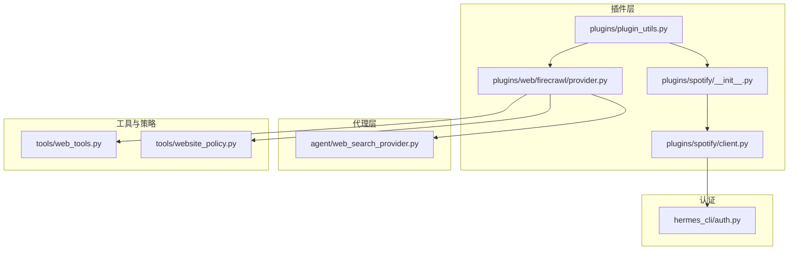
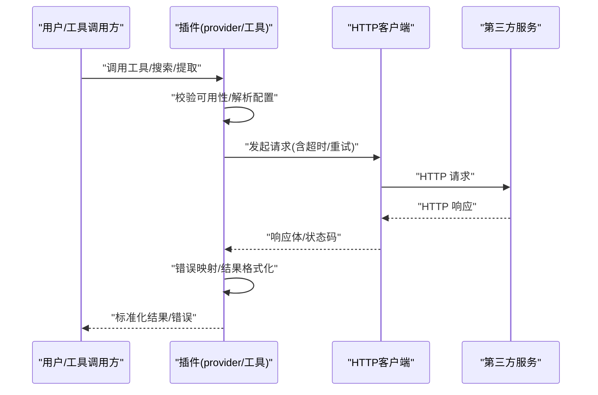
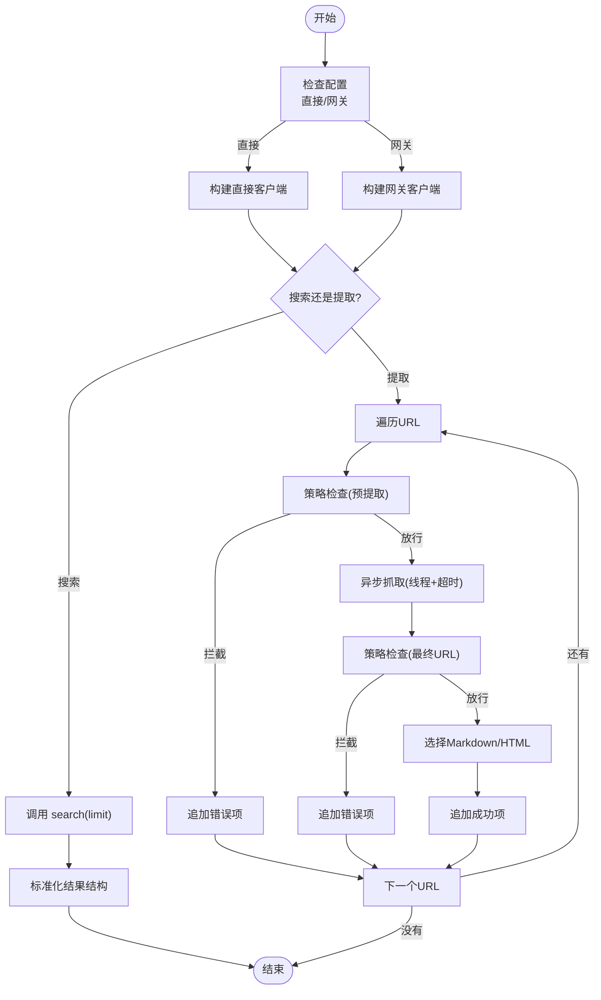
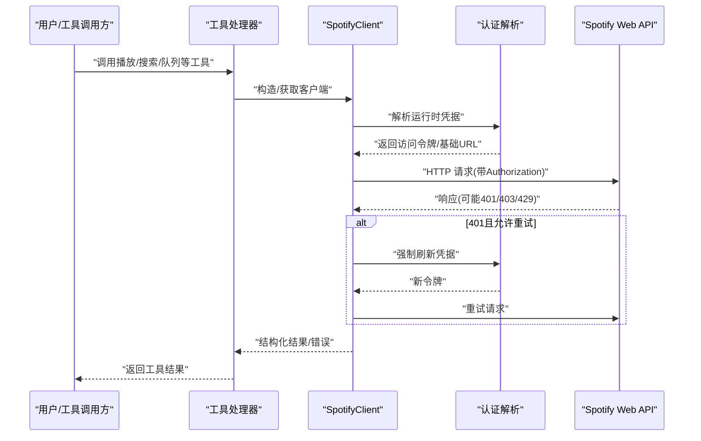
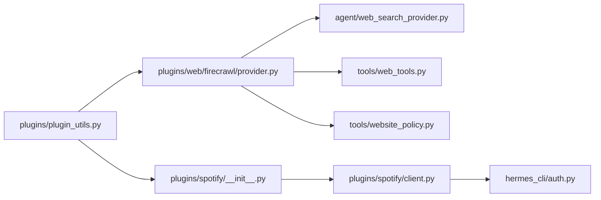

# 专用插件

<cite>
**本文引用的文件**
- [plugins/__init__.py](file://plugins/__init__.py)
- [plugins/plugin_utils.py](file://plugins/plugin_utils.py)
- [plugins/spotify/__init__.py](file://plugins/spotify/__init__.py)
- [plugins/spotify/client.py](file://plugins/spotify/client.py)
- [plugins/web/firecrawl/provider.py](file://plugins/web/firecrawl/provider.py)
- [agent/web_search_provider.py](file://agent/web_search_provider.py)
- [tools/web_tools.py](file://tools/web_tools.py)
- [tools/website_policy.py](file://tools/website_policy.py)
- [hermes_cli/auth.py](file://hermes_cli/auth.py)
</cite>

## 目录
1. [引言](#引言)
2. [项目结构](#项目结构)
3. [核心组件](#核心组件)
4. [架构总览](#架构总览)
5. [详细组件分析](#详细组件分析)
6. [依赖分析](#依赖分析)
7. [性能考虑](#性能考虑)
8. [故障排查指南](#故障排查指南)
9. [结论](#结论)
10. [附录](#附录)

## 引言
本文件面向希望在系统中开发“专用插件”的工程师与技术作者，聚焦以下六类专用能力：Web 搜索插件、图像生成插件、视频生成插件、转录插件、语音合成插件、Spotify 音乐插件。文档从架构设计、组件关系、数据流与处理逻辑、API 集成方式、认证与配置、错误处理与重试、超时管理、性能优化与资源管理、测试与集成等方面进行系统化说明，并提供可复用的开发范式与最佳实践。

## 项目结构
- 插件包组织遵循“分类目录 + 后端实现”的模式：
  - Web 搜索类插件位于 plugins/web/<backend>/，以 firecrawl 为例，采用 provider.py 实现具体后端能力，并通过 agent.web_search_provider 注册为 Web 搜索提供者。
  - 专用服务集成（如 Spotify）位于 plugins/<service>/，以插件形式自动加载，注册工具集并在运行时进行可用性检查。
  - 工具层与网站策略由 tools/web_tools.py、tools/website_policy.py 等模块提供支撑。
  - 插件通用并发与单例工具由 plugins/plugin_utils.py 提供，避免多线程下的竞态与资源泄漏。

**图示来源**
- [plugins/web/firecrawl/provider.py:1-595](file://plugins/web/firecrawl/provider.py#L1-L595)
- [plugins/spotify/__init__.py:1-67](file://plugins/spotify/__init__.py#L1-L67)
- [plugins/spotify/client.py:1-436](file://plugins/spotify/client.py#L1-L436)
- [plugins/plugin_utils.py:1-136](file://plugins/plugin_utils.py#L1-L136)
- [agent/web_search_provider.py](file://agent/web_search_provider.py)
- [tools/web_tools.py](file://tools/web_tools.py)
- [tools/website_policy.py](file://tools/website_policy.py)
- [hermes_cli/auth.py](file://hermes_cli/auth.py)

**章节来源**
- [plugins/__init__.py:1-2](file://plugins/__init__.py#L1-L2)
- [plugins/plugin_utils.py:1-136](file://plugins/plugin_utils.py#L1-L136)

## 核心组件
- 并发与单例工具
  - lazy_singleton：零参工厂的线程安全懒加载单例装饰器，支持 reset 以便测试清理。
  - SingletonSlot：带键参数的线程安全单例槽，缓存首次成功构建实例，后续调用忽略参数。
- Web 搜索提供者基类
  - agent.web_search_provider.WebSearchProvider 定义了统一的搜索与提取接口，各后端插件通过继承实现具体能力。
- Spotify 客户端
  - SpotifyClient 封装 Spotify Web API 调用，内置认证解析、请求头构造、错误映射、重试与空响应处理。
- Firecrawl 提供者
  - FirecrawlWebSearchProvider 继承 WebSearchProvider，实现搜索与提取，支持直接 API 与托管网关双路径，延迟导入 SDK，按 URL 进行提取并应用网站访问策略。

**章节来源**
- [plugins/plugin_utils.py:43-136](file://plugins/plugin_utils.py#L43-L136)
- [agent/web_search_provider.py](file://agent/web_search_provider.py)
- [plugins/spotify/client.py:41-112](file://plugins/spotify/client.py#L41-L112)
- [plugins/web/firecrawl/provider.py:367-420](file://plugins/web/firecrawl/provider.py#L367-L420)

## 架构总览
专用插件的总体交互链路如下：
- 插件注册：插件入口调用上下文注册工具或提供者，完成工具集注册与可用性检查。
- 认证与配置：插件通过 hermes_cli.auth 解析运行时凭据；Web 搜索插件同时支持直接 API 与托管网关两种路径。
- 请求执行：插件封装 HTTP 客户端（如 httpx），统一设置请求头、超时与重试策略。
- 结果处理：对响应进行结构化解析与格式化输出，必要时进行内容选择（如 Markdown/HTML）。
- 错误处理：区分认证失败、权限不足、速率限制、网络超时等场景，返回统一的错误语义。

**图示来源**
- [plugins/spotify/client.py:64-98](file://plugins/spotify/client.py#L64-L98)
- [plugins/web/firecrawl/provider.py:420-577](file://plugins/web/firecrawl/provider.py#L420-L577)

## 详细组件分析

### Web 搜索插件（以 Firecrawl 为例）
- 设计要点
  - 继承 WebSearchProvider，实现 search 与 extract 两个核心能力。
  - 支持直接 API 与托管网关双路径，优先级由配置决定；当两者都存在时可通过开关选择。
  - 延迟导入 Firecrawl SDK，减少冷启动开销；对 SDK 返回对象进行扁平化处理，统一输出结构。
  - 对每个 URL 的提取在后台线程执行，设置 60 秒超时；提取完成后再次检查最终 URL 的网站访问策略。
- 数据流与处理
  - 搜索：调用 client.search，标准化返回结构，返回包含 web 列表的结果。
  - 提取：逐 URL 执行 scrape，选择 Markdown 或 HTML 内容，补充元数据与最终 URL；对策略拦截、超时、异常分别返回错误字段。
- 配置与认证
  - 直接 API：通过环境变量 FIRECRAWL_API_KEY 与 FIRECRAWL_API_URL 配置。
  - 托管网关：通过环境变量 FIRECRAWL_GATEWAY_URL 或 TOOL_GATEWAY_* 配置，结合订阅令牌。
- 错误处理与超时
  - 捕获超时、策略拦截、SDK 异常，返回统一错误结构；不抛出顶层异常，保持与历史行为一致。
  - 提供清晰的配置错误提示，引导用户选择直接 API 或托管网关。

**图示来源**
- [plugins/web/firecrawl/provider.py:388-577](file://plugins/web/firecrawl/provider.py#L388-L577)
- [tools/website_policy.py](file://tools/website_policy.py)

**章节来源**
- [plugins/web/firecrawl/provider.py:1-595](file://plugins/web/firecrawl/provider.py#L1-L595)
- [agent/web_search_provider.py](file://agent/web_search_provider.py)

### 图像生成插件（开发规范）
- 目标与范围
  - 作为“类别插件”，在 plugins/image_gen/<backend>/ 下实现具体后端（如 fal、krea、openai、xai 等）。
  - 插件需提供 plugin.yaml 与 __init__.py，并通过 kind: backend 自动加载。
- 开发要点
  - 接口封装：统一请求参数与响应结构，支持图片尺寸、风格、数量等常见参数。
  - 认证机制：优先使用 hermes_cli.auth 解析运行时凭据；若后端支持多租户或密钥切换，需提供参数化单例缓存。
  - 结果格式化：输出统一的媒体链接或内嵌数据结构，便于上层工具消费。
  - 错误处理：区分鉴权失败、配额不足、输入非法、网络异常等场景，返回结构化错误。
  - 性能优化：对昂贵客户端进行懒加载与单例缓存；对批量请求进行并发控制与限速。
- 参考实现位置
  - 各后端插件目录结构与命名约定可参考现有 image_gen 子目录布局。

**章节来源**
- [plugins/__init__.py:1-2](file://plugins/__init__.py#L1-L2)

### 视频生成插件（开发规范）
- 目标与范围
  - 在 plugins/video_gen/<backend>/ 下实现，遵循与图像生成插件相同的目录与注册模式。
- 开发要点
  - 参数与模型：支持文本到视频的提示词、时长、分辨率、帧率等参数。
  - 流式与轮询：根据后端能力选择流式回调或轮询查询任务状态。
  - 结果格式化：输出视频链接、下载地址或二进制数据摘要。
  - 错误与重试：对网络超时、任务失败、配额限制进行分级处理与重试。
  - 资源管理：对临时文件与下载资源进行清理，避免磁盘占用。

**章节来源**
- [plugins/__init__.py:1-2](file://plugins/__init__.py#L1-L2)

### 转录插件（开发规范）
- 目标与范围
  - 在 plugins/<service>/ 下实现，提供音频/视频转录能力。
- 开发要点
  - 输入处理：支持本地文件、远程 URL、内嵌音频数据。
  - 输出格式：统一返回时间戳分段文本、字幕文件、JSON 结构等。
  - 多语言与字幕：支持语言检测、字幕格式（SRT/VTT/ASS）导出。
  - 错误与重试：对大文件、网络抖动、模型过载进行降级与重试。
  - 性能：对长音频进行分片处理与并发转录，结合进度回调优化体验。

**章节来源**
- [plugins/__init__.py:1-2](file://plugins/__init__.py#L1-L2)

### 语音合成插件（开发规范）
- 目标与范围
  - 在 plugins/<service>/ 下实现，提供 TTS 能力。
- 开发要点
  - 文本预处理：清洗特殊字符、处理多语言混合、音素标注。
  - 声学模型：支持音色、语速、音量、情感等参数。
  - 输出格式：WAV/MP3/FLAC 等，支持流式输出与断点续传。
  - 错误与重试：对网络异常、模型不可用进行回退与重试。
  - 资源管理：清理中间文件，限制并发，避免内存泄漏。

**章节来源**
- [plugins/__init__.py:1-2](file://plugins/__init__.py#L1-L2)

### Spotify 音乐插件
- 功能概览
  - 注册七个工具集：播放控制、设备管理、队列操作、搜索、歌单、专辑、音乐库。
  - 工具注册时绑定可用性检查函数，未完成认证时仍注册但禁止调度。
- 认证与配置
  - 运行时凭据解析：通过 hermes_cli.auth.resolve_spotify_runtime_credentials 获取访问令牌与基础 URL。
  - 请求头：统一设置 Authorization 与 Content-Type。
- API 集成与数据处理
  - 请求封装：统一 request 方法，支持自动刷新 401、空响应处理、JSON/文本响应识别。
  - 错误映射：将 HTTP 状态码与 Spotify 错误详情映射为友好消息，区分播放控制、权限、速率限制等场景。
  - ID/URI 规范化：提供 normalize_spotify_id/normalize_spotify_uri，支持短 ID、URI、URL 三种输入。
- 结果格式化
  - 统一返回结构：成功时返回 JSON；空响应返回包含 success 与 empty 标记的对象；非 JSON 响应返回包含 text 字段的对象。
- 错误处理、重试与超时
  - 401 自动刷新：允许一次重试机会，刷新后重发请求。
  - 超时：默认 30 秒；提取场景设置 60 秒超时并捕获超时异常。
  - 速率限制：读取 Retry-After 头并拼接到错误信息。
- 使用限制
  - 播放控制通常需要 Spotify Premium 与活跃设备；权限不足时提示重新授权。

**图示来源**
- [plugins/spotify/client.py:41-112](file://plugins/spotify/client.py#L41-L112)
- [plugins/spotify/client.py:100-111](file://plugins/spotify/client.py#L100-L111)
- [hermes_cli/auth.py](file://hermes_cli/auth.py)

**章节来源**
- [plugins/spotify/__init__.py:1-67](file://plugins/spotify/__init__.py#L1-L67)
- [plugins/spotify/client.py:1-436](file://plugins/spotify/client.py#L1-L436)

## 依赖分析
- 插件层内部依赖
  - plugins/plugin_utils.py 为所有插件提供线程安全的单例缓存工具，降低全局竞态风险。
  - Web 搜索插件依赖 agent.web_search_provider 作为统一接口，依赖 tools/web_tools.py 与 tools/website_policy.py 提供客户端与策略检查。
  - Spotify 插件依赖 hermes_cli.auth 进行运行时认证解析。
- 外部依赖
  - HTTP 客户端：httpx；序列化：json；并发：asyncio、threading。
  - 第三方 SDK：Firecrawl（延迟导入）、Spotify Web API（通过 httpx 调用）。

**图示来源**
- [plugins/plugin_utils.py:1-136](file://plugins/plugin_utils.py#L1-L136)
- [plugins/spotify/__init__.py:1-67](file://plugins/spotify/__init__.py#L1-L67)
- [plugins/spotify/client.py:1-436](file://plugins/spotify/client.py#L1-L436)
- [plugins/web/firecrawl/provider.py:1-595](file://plugins/web/firecrawl/provider.py#L1-L595)
- [agent/web_search_provider.py](file://agent/web_search_provider.py)
- [tools/web_tools.py](file://tools/web_tools.py)
- [tools/website_policy.py](file://tools/website_policy.py)
- [hermes_cli/auth.py](file://hermes_cli/auth.py)

**章节来源**
- [plugins/plugin_utils.py:1-136](file://plugins/plugin_utils.py#L1-L136)
- [plugins/web/firecrawl/provider.py:1-595](file://plugins/web/firecrawl/provider.py#L1-L595)
- [plugins/spotify/client.py:1-436](file://plugins/spotify/client.py#L1-L436)

## 性能考虑
- 懒加载与单例
  - 使用 lazy_singleton 与 SingletonSlot 缓存昂贵客户端，避免重复初始化与资源泄漏。
- 并发与超时
  - Web 提取使用 asyncio.to_thread + wait_for 控制单 URL 超时；整体并发度由上层调度控制。
  - 默认请求超时 30 秒，提取场景 60 秒；对 429 响应读取 Retry-After 并提示重试等待。
- 导入优化
  - Firecrawl SDK 仅在首次使用时导入，显著降低冷启动时间。
- 资源管理
  - 对临时文件、下载资源进行清理；对连接池与后台线程进行显式关闭或复用。

**章节来源**
- [plugins/plugin_utils.py:43-136](file://plugins/plugin_utils.py#L43-L136)
- [plugins/web/firecrawl/provider.py:486-493](file://plugins/web/firecrawl/provider.py#L486-L493)

## 故障排查指南
- 认证问题
  - Spotify：401 表示令牌失效或过期，需重新运行认证命令；403 通常表示权限不足或需要 Premium。
- 权限与配额
  - 403/429：检查 scopes 与账户类型；关注 Retry-After 并等待后重试。
- 网络与超时
  - 超时：提取场景建议改用浏览器导航或缩小页面范围；检查网络连通性与代理设置。
- 配置错误
  - Firecrawl：未配置直接 API 或网关时会抛出明确错误，检查环境变量与订阅状态。
- 日志与诊断
  - 关注插件日志输出，定位具体失败阶段（配置检查、SDK 导入、请求发送、响应解析）。

**章节来源**
- [plugins/spotify/client.py:339-376](file://plugins/spotify/client.py#L339-L376)
- [plugins/web/firecrawl/provider.py:188-206](file://plugins/web/firecrawl/provider.py#L188-L206)

## 结论
专用插件的开发应遵循“统一接口 + 可插拔后端 + 明确认证与错误处理”的原则。通过延迟导入、单例缓存与超时控制，既能保证性能又能提升稳定性。Web 搜索与 Spotify 插件提供了可复用的工程化范式，其他专用插件（图像/视频生成、转录、语音合成）可在此基础上扩展参数、模型与输出格式，确保与平台生态一致。

## 附录
- 开发清单
  - 定义插件目录与 plugin.yaml，声明 kind 与元信息。
  - 实现工具注册或提供者类，遵循统一接口。
  - 封装认证与请求，定义错误映射与重试策略。
  - 设计参数校验与结果格式化，提供最小可用示例。
  - 编写单元测试与集成测试，覆盖正常与异常路径。
- 参考路径
  - [plugins/web/firecrawl/provider.py:1-595](file://plugins/web/firecrawl/provider.py#L1-L595)
  - [plugins/spotify/client.py:1-436](file://plugins/spotify/client.py#L1-L436)
  - [plugins/plugin_utils.py:1-136](file://plugins/plugin_utils.py#L1-L136)