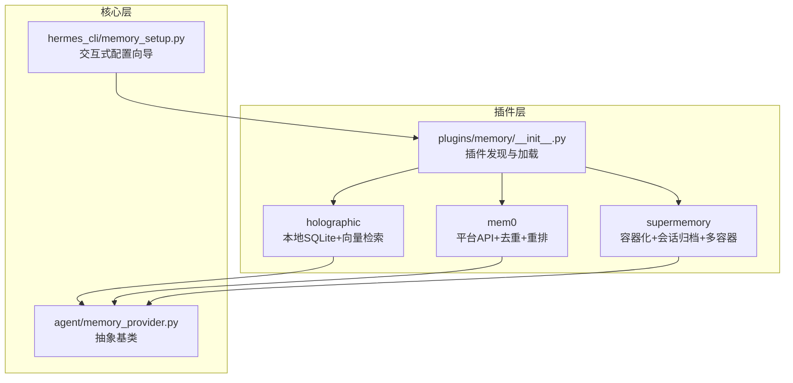
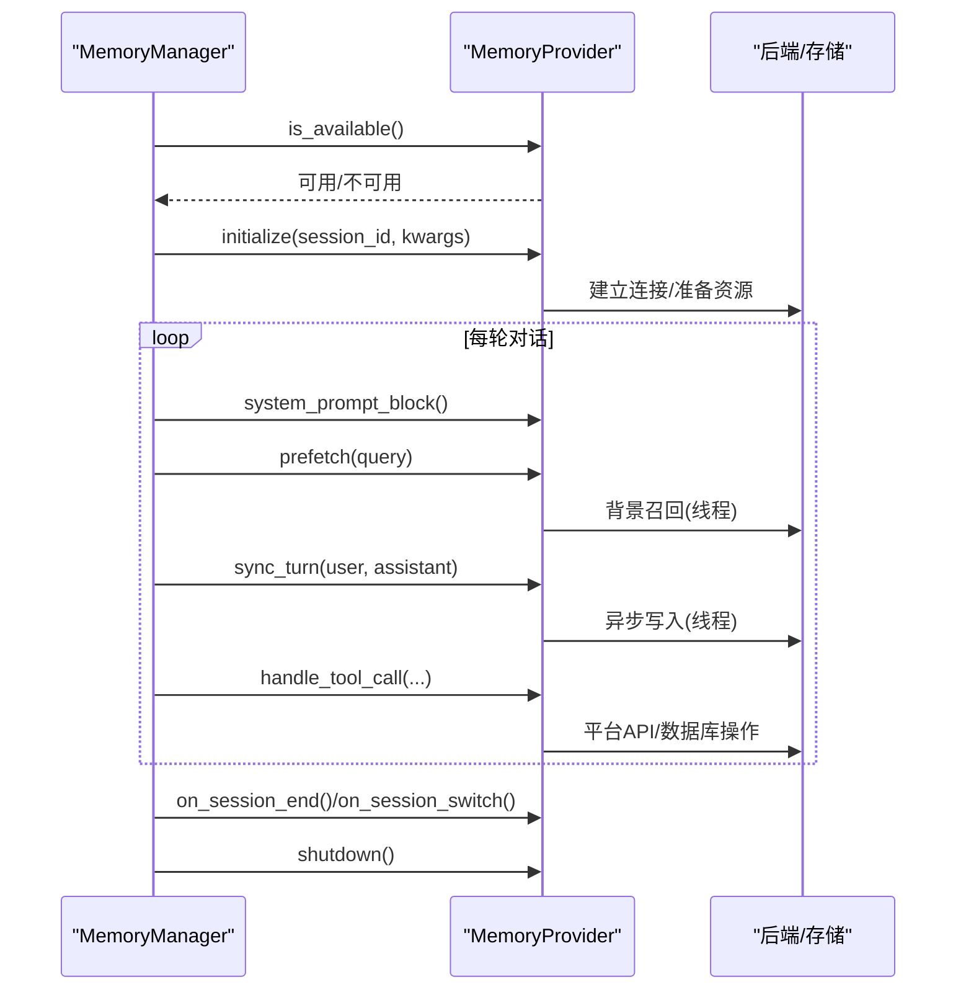
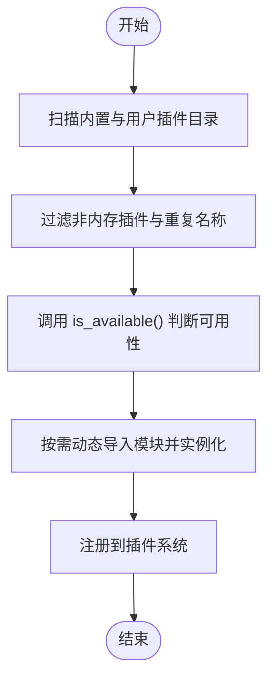
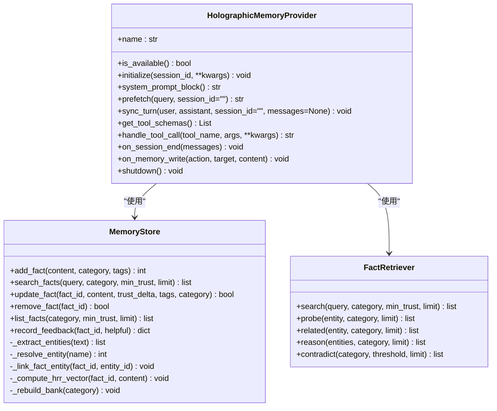
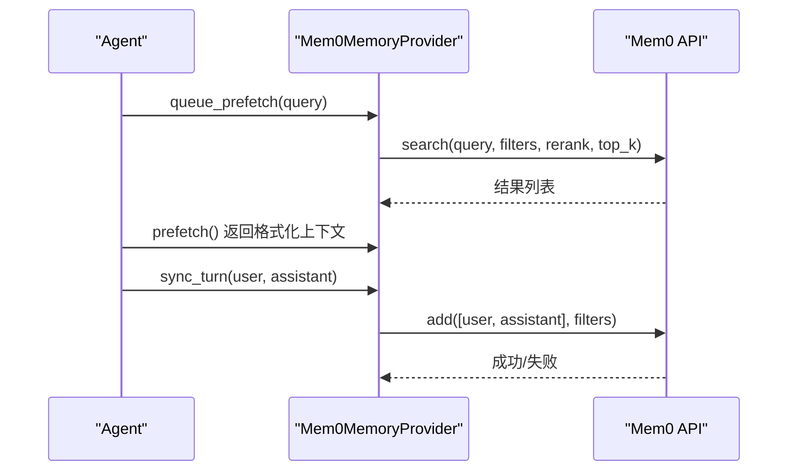
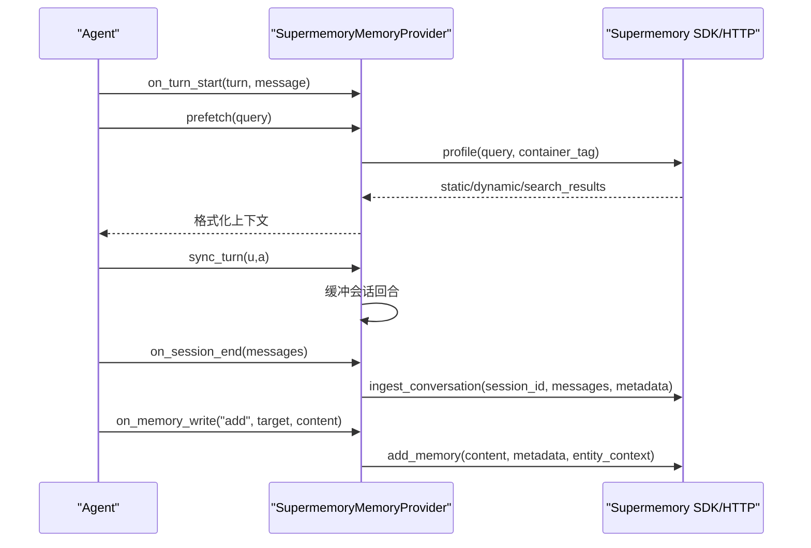
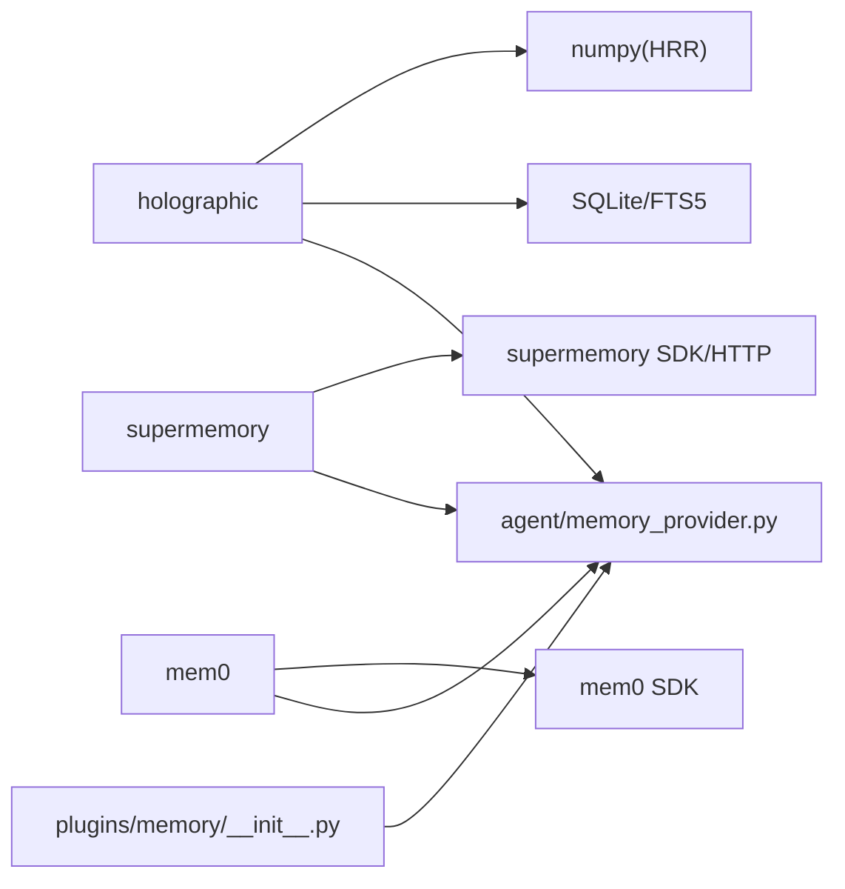

# 内存插件

<cite>
**本文引用的文件**
- [plugins/memory/__init__.py](file://plugins/memory/__init__.py)
- [agent/memory_provider.py](file://agent/memory_provider.py)
- [plugins/memory/holographic/__init__.py](file://plugins/memory/holographic/__init__.py)
- [plugins/memory/holographic/store.py](file://plugins/memory/holographic/store.py)
- [plugins/memory/holographic/retrieval.py](file://plugins/memory/holographic/retrieval.py)
- [plugins/memory/mem0/__init__.py](file://plugins/memory/mem0/__init__.py)
- [plugins/memory/supermemory/__init__.py](file://plugins/memory/supermemory/__init__.py)
- [hermes_cli/memory_setup.py](file://hermes_cli/memory_setup.py)
- [tests/plugins/memory/test_supermemory_provider.py](file://tests/plugins/memory/test_supermemory_provider.py)
- [tests/agent/test_memory_provider.py](file://tests/agent/test_memory_provider.py)
</cite>

## 目录
1. [简介](#简介)
2. [项目结构](#项目结构)
3. [核心组件](#核心组件)
4. [架构总览](#架构总览)
5. [详细组件分析](#详细组件分析)
6. [依赖关系分析](#依赖关系分析)
7. [性能考量](#性能考量)
8. [故障排查指南](#故障排查指南)
9. [结论](#结论)
10. [附录](#附录)

## 简介
本文件面向开发者与高级用户，系统性阐述内存插件体系的设计与实现，重点覆盖以下内容：
- 内存插件开发规范与生命周期钩子
- 数据存储接口、检索算法与持久化机制
- 上下文管理、压缩策略与缓存优化
- Holographic、Mem0、SuperMemory 等内存系统的特性与适用场景
- 完整开发示例（数据结构设计、查询接口、性能优化）
- 配置参数与调优方法
- 测试用例与性能基准建议

## 项目结构
内存插件采用“插件即包”的组织方式，统一通过插件发现与加载器接入主框架；各提供商实现 MemoryProvider 抽象基类，并可选实现一系列生命周期钩子。

图示来源
- [plugins/memory/__init__.py:1-451](file://plugins/memory/__init__.py#L1-L451)
- [agent/memory_provider.py:1-297](file://agent/memory_provider.py#L1-L297)
- [plugins/memory/holographic/__init__.py:1-409](file://plugins/memory/holographic/__init__.py#L1-L409)
- [plugins/memory/mem0/__init__.py:1-375](file://plugins/memory/mem0/__init__.py#L1-L375)
- [plugins/memory/supermemory/__init__.py:1-898](file://plugins/memory/supermemory/__init__.py#L1-L898)
- [hermes_cli/memory_setup.py:222-263](file://hermes_cli/memory_setup.py#L222-L263)

章节来源
- [plugins/memory/__init__.py:1-451](file://plugins/memory/__init__.py#L1-L451)
- [agent/memory_provider.py:1-297](file://agent/memory_provider.py#L1-L297)

## 核心组件
- 插件发现与加载器：扫描内置与用户安装目录，优先级与可用性检测，动态导入与注册。
- 抽象基类 MemoryProvider：定义统一生命周期与可选钩子，约束配置与工具接口。
- 具体提供商：Holographic（本地结构化+向量检索）、Mem0（平台API+重排+去重）、SuperMemory（容器+会话归档+多容器）。

章节来源
- [plugins/memory/__init__.py:146-216](file://plugins/memory/__init__.py#L146-L216)
- [agent/memory_provider.py:42-297](file://agent/memory_provider.py#L42-L297)

## 架构总览
内存插件在运行期由 MemoryManager 统一调度，遵循“单外部提供商”原则，避免工具冲突与状态混乱。典型流程：
- 初始化：is_available → initialize
- 每轮：system_prompt_block + prefetch → 同步写入 sync_turn → 工具调用 handle_tool_call
- 结束：on_session_end/on_session_switch → shutdown

图示来源
- [agent/memory_provider.py:50-297](file://agent/memory_provider.py#L50-L297)

## 详细组件分析

### 抽象基类 MemoryProvider
- 必须实现：name、is_available、initialize、get_tool_schemas、handle_tool_call（如有工具）
- 可选钩子：system_prompt_block、prefetch、queue_prefetch、sync_turn、on_session_end、on_session_switch、on_pre_compress、on_memory_write、on_delegation、get_config_schema、save_config、shutdown
- 设计要点：区分“静态提示块”与“动态召回上下文”，明确异步写入与后台线程职责，提供配置声明与持久化能力

章节来源
- [agent/memory_provider.py:42-297](file://agent/memory_provider.py#L42-L297)

### 插件发现与加载（plugins/memory/__init__.py）
- 扫描路径：内置 plugins/memory/<name>/ 与 $HERMES_HOME/plugins/<name>，内置优先
- 可用性检测：读取 plugin.yaml 描述，调用 provider.is_available()
- 动态导入：支持 register(ctx) 与直接类实例两种注册方式；处理相对导入与合成命名空间
- CLI 命令：仅对当前激活的提供商暴露命令

图示来源
- [plugins/memory/__init__.py:90-181](file://plugins/memory/__init__.py#L90-L181)
- [plugins/memory/__init__.py:208-317](file://plugins/memory/__init__.py#L208-L317)

章节来源
- [plugins/memory/__init__.py:90-181](file://plugins/memory/__init__.py#L90-L181)
- [plugins/memory/__init__.py:208-317](file://plugins/memory/__init__.py#L208-L317)

### Holographic（本地结构化+向量检索）
- 存储：SQLite + FTS5 全文索引 + 实体表/关联表 + 可选 HRR 向量（numpy 可用时）
- 检索：FTS5 候选 → Jaccard 重排 → 信任分加权 → 可选时间衰减
- 工具：fact_store（增删改查/反馈）、fact_feedback（训练信任分）
- 生命周期：auto_extract 在会话结束自动抽取偏好/决策；on_memory_write 镜像内置记忆写入

图示来源
- [plugins/memory/holographic/__init__.py:115-409](file://plugins/memory/holographic/__init__.py#L115-L409)
- [plugins/memory/holographic/store.py:98-579](file://plugins/memory/holographic/store.py#L98-L579)
- [plugins/memory/holographic/retrieval.py:22-594](file://plugins/memory/holographic/retrieval.py#L22-L594)

章节来源
- [plugins/memory/holographic/__init__.py:115-409](file://plugins/memory/holographic/__init__.py#L115-L409)
- [plugins/memory/holographic/store.py:98-579](file://plugins/memory/holographic/store.py#L98-L579)
- [plugins/memory/holographic/retrieval.py:22-594](file://plugins/memory/holographic/retrieval.py#L22-L594)

### Mem0（平台API+重排+去重）
- 配置：环境变量 MEM0_API_KEY/MEM0_USER_ID/MEM0_AGENT_ID，或 $HERMES_HOME/mem0.json
- 特性：服务端抽取、语义搜索、可选 rerank、自动去重、电路断路器防抖
- 工具：mem0_profile、mem0_search、mem0_conclude
- 生命周期：queue_prefetch 预热召回；sync_turn 异步写入；breaker 避免雪崩

图示来源
- [plugins/memory/mem0/__init__.py:119-375](file://plugins/memory/mem0/__init__.py#L119-L375)

章节来源
- [plugins/memory/mem0/__init__.py:119-375](file://plugins/memory/mem0/__init__.py#L119-L375)

### SuperMemory（容器+会话归档+多容器）
- 配置：环境变量 SUPERMEMORY_API_KEY/SUPERMEMORY_CONTAINER_TAG，或 $HERMES_HOME/supermemory.json
- 特性：容器标签隔离、自动召回/捕获、会话级全文归档、多容器白名单、实体上下文清洗
- 工具：supermemory_store/search/forget/profile（含 kebab 风格别名）
- 生命周期：on_turn_start 计数；prefetch 获取 profile+搜索结果；on_session_end 归档；on_session_switch 清理缓冲；on_memory_write 异步写入

图示来源
- [plugins/memory/supermemory/__init__.py:440-898](file://plugins/memory/supermemory/__init__.py#L440-L898)

章节来源
- [plugins/memory/supermemory/__init__.py:440-898](file://plugins/memory/supermemory/__init__.py#L440-L898)

## 依赖关系分析
- 插件发现依赖：yaml 解析、sys.modules 注册、相对导入支持
- 提供商依赖：第三方 SDK（如 mem0、supermemory）、SQLite/FTS5、可选 numpy（Holographic）
- 配置来源：环境变量、本地 JSON 文件、CLI 交互向导

图示来源
- [plugins/memory/__init__.py:1-451](file://plugins/memory/__init__.py#L1-L451)
- [plugins/memory/holographic/__init__.py:1-409](file://plugins/memory/holographic/__init__.py#L1-L409)
- [plugins/memory/mem0/__init__.py:1-375](file://plugins/memory/mem0/__init__.py#L1-L375)
- [plugins/memory/supermemory/__init__.py:1-898](file://plugins/memory/supermemory/__init__.py#L1-L898)

章节来源
- [plugins/memory/__init__.py:1-451](file://plugins/memory/__init__.py#L1-L451)

## 性能考量
- 异步与并发
  - Mem0/SuperMemory 使用线程池执行网络请求，避免阻塞主线程；注意 join 超时与守护线程设置
  - Holographic 的检索在候选阶段进行重排，建议限制候选数量与权重分配
- 缓存与预取
  - Mem0 支持 prefetch 结果缓存与队列预取；SuperMemory 将每轮对话缓冲至会话末尾批量归档
- I/O 与索引
  - Holographic 使用 SQLite WAL 模式与 FTS5 触发器，配合 RLock 保证并发安全
  - HRR 向量重建按类别银行聚合，避免全表扫描
- 网络与限流
  - Mem0 内置电路断路器，连续失败后冷却，降低下游压力
- 上下文压缩
  - on_pre_compress 可提取关键洞察，减少压缩损失

章节来源
- [plugins/memory/mem0/__init__.py:181-203](file://plugins/memory/mem0/__init__.py#L181-L203)
- [plugins/memory/supermemory/__init__.py:567-627](file://plugins/memory/supermemory/__init__.py#L567-L627)
- [plugins/memory/holographic/store.py:128-141](file://plugins/memory/holographic/store.py#L128-L141)
- [plugins/memory/holographic/retrieval.py:48-113](file://plugins/memory/holographic/retrieval.py#L48-L113)

## 故障排查指南
- 插件未被发现
  - 检查目录结构与 __init__.py 是否存在；确认名称未被内置版本遮蔽
  - 使用 discover_memory_providers 排查可用性
- 提供商不可用
  - is_available 通常不发起网络请求，检查密钥/SDK 是否就绪
- 工具调用异常
  - 确认 get_tool_schemas 返回的工具名与 handle_tool_call 分派一致
  - Mem0 在断路器触发时返回临时不可用提示
- SuperMemory 多容器校验失败
  - 容器标签必须在允许列表内，否则抛出参数错误
- 单测参考
  - SuperMemory 提供伪造客户端的单元测试样例
  - 插件发现与加载的基础行为有对应测试

章节来源
- [tests/plugins/memory/test_supermemory_provider.py:17-78](file://tests/plugins/memory/test_supermemory_provider.py#L17-L78)
- [tests/agent/test_memory_provider.py:419-449](file://tests/agent/test_memory_provider.py#L419-L449)

## 结论
内存插件体系以 MemoryProvider 为核心抽象，结合插件发现与加载机制，实现了统一的生命周期与可扩展的工具接口。不同提供商在存储介质、检索算法与持久化策略上各有侧重：Holographic 适合本地结构化与向量推理；Mem0 适合需要服务端抽取与去重的场景；SuperMemory 适合需要容器隔离与会话归档的企业级需求。通过合理的异步、缓存与并发控制，可在保证稳定性的同时提升吞吐与延迟表现。

## 附录

### 开发规范与最佳实践
- 必须实现
  - name、is_available、initialize、get_tool_schemas、handle_tool_call（如有工具）
- 配置声明
  - get_config_schema 返回字段清单（含是否密钥、默认值、可选项、环境变量映射）
  - save_config 将非密钥配置写入提供商原生位置（如 JSON/YAML）
- 生命周期钩子
  - prefetch/queue_prefetch：快速返回可注入上下文，后台线程完成实际召回
  - sync_turn：非阻塞写入，必要时合并/去重
  - on_session_end/on_session_switch：最终落盘/归档，清理缓冲
  - on_pre_compress：提取关键洞察，减少压缩损失
  - on_memory_write：镜像内置记忆写入，保持一致性
- 错误处理
  - 对外返回 JSON 字符串；内部记录调试日志但不泄露敏感信息
  - 网络异常与断路器策略需明确降级路径

章节来源
- [agent/memory_provider.py:244-297](file://agent/memory_provider.py#L244-L297)

### 配置参数与调优建议
- Holographic
  - db_path：SQLite 路径（支持 $HERMES_HOME 占位）
  - auto_extract：会话结束自动抽取偏好/决策
  - default_trust/hrr_dim/hrr_weight/temporal_decay_half_life：影响检索与推理效果
- Mem0
  - api_key/user_id/agent_id/rerank：控制身份与召回精度
  - 断路器阈值与冷却时间：避免下游不稳定导致的级联失败
- SuperMemory
  - container_tag/auto_recall/auto_capture/max_recall_results/profile_frequency/capture_mode/search_mode/entity_context/api_timeout
  - 多容器开关与白名单：按身份/租户隔离
  - 容器标签清洗与长度限制：确保稳定传输

章节来源
- [plugins/memory/holographic/__init__.py:97-157](file://plugins/memory/holographic/__init__.py#L97-L157)
- [plugins/memory/mem0/__init__.py:40-67](file://plugins/memory/mem0/__init__.py#L40-L67)
- [plugins/memory/supermemory/__init__.py:56-141](file://plugins/memory/supermemory/__init__.py#L56-L141)

### CLI 与交互式配置
- hermes memory setup：列出可用提供商，安装依赖，调用提供商的 get_config_schema/save_config 完成配置
- 仅激活一个外部提供商，避免工具冲突

章节来源
- [hermes_cli/memory_setup.py:222-263](file://hermes_cli/memory_setup.py#L222-L263)
- [plugins/memory/__init__.py:354-451](file://plugins/memory/__init__.py#L354-L451)