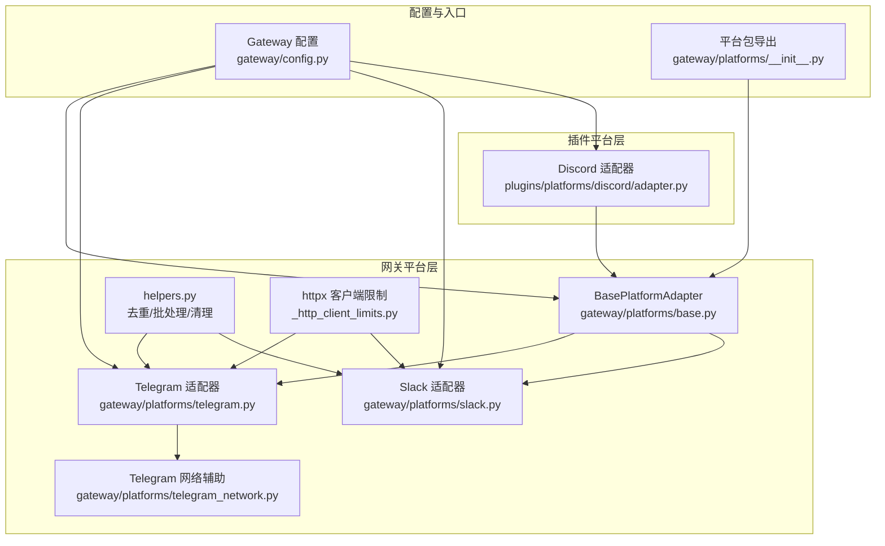
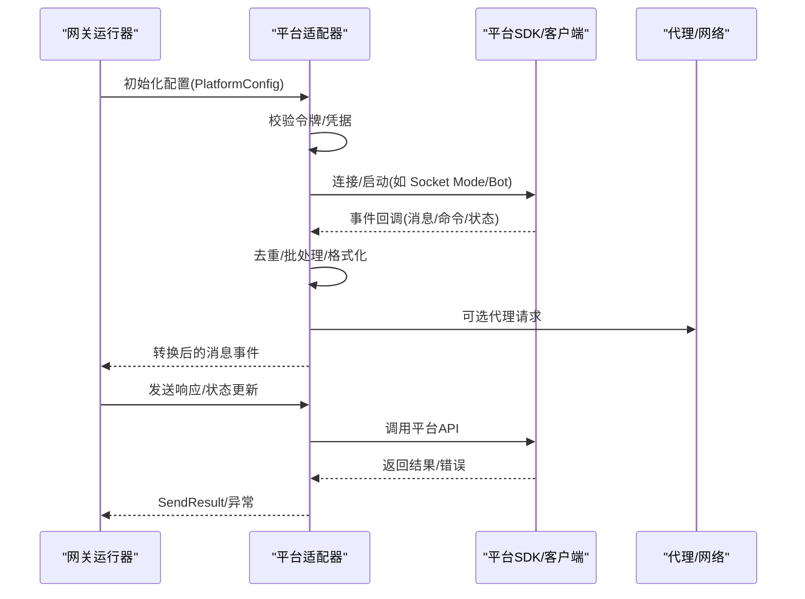
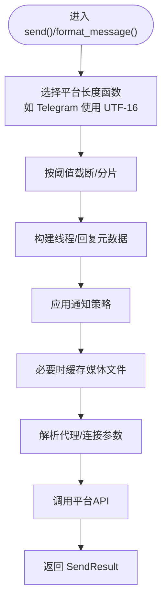
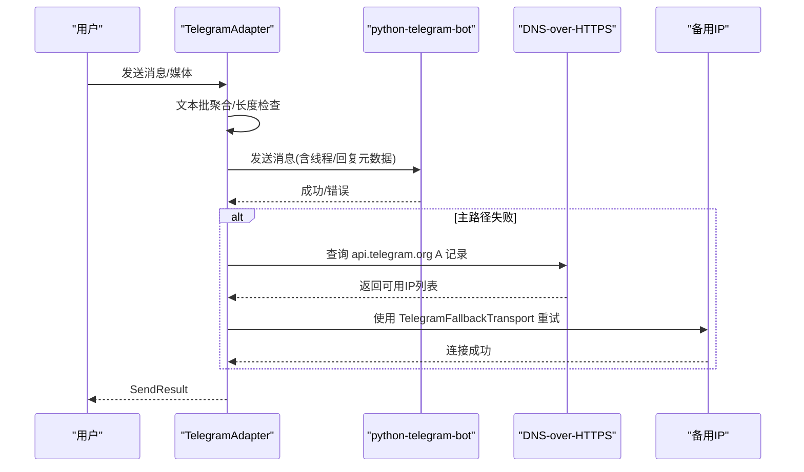
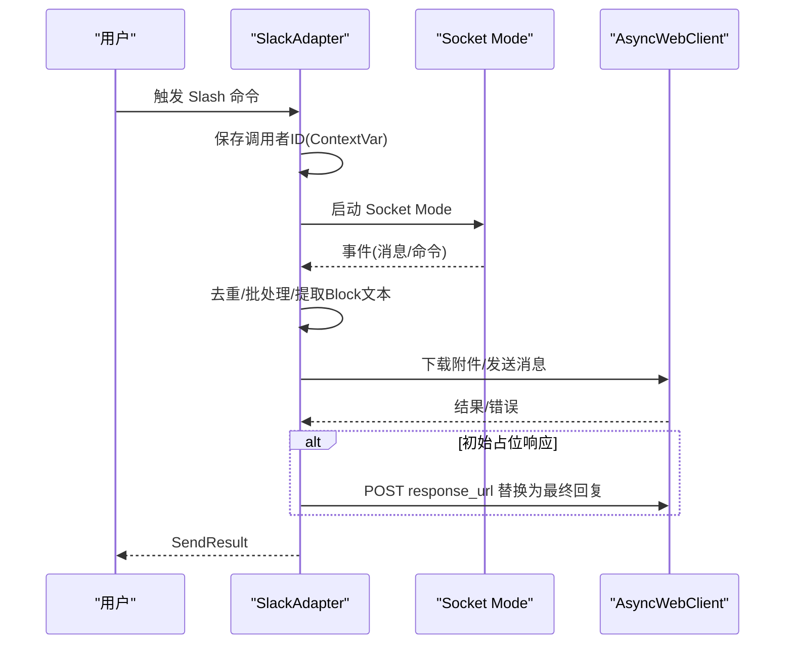
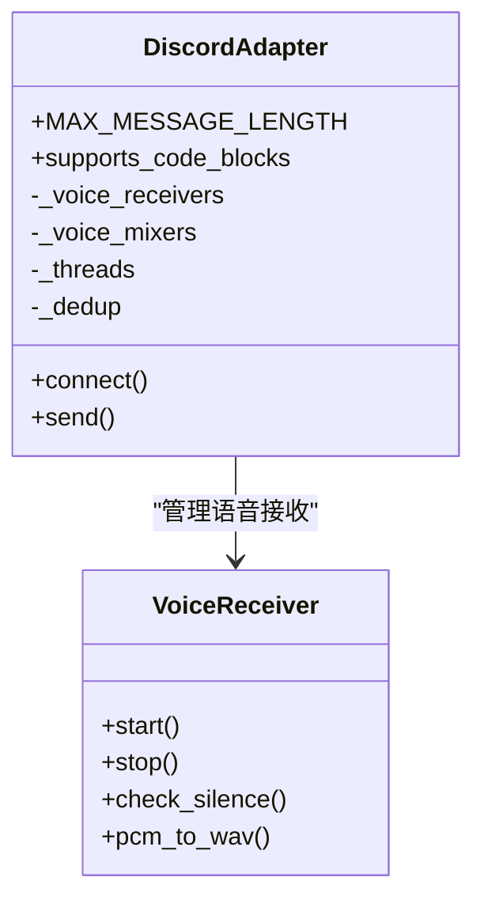
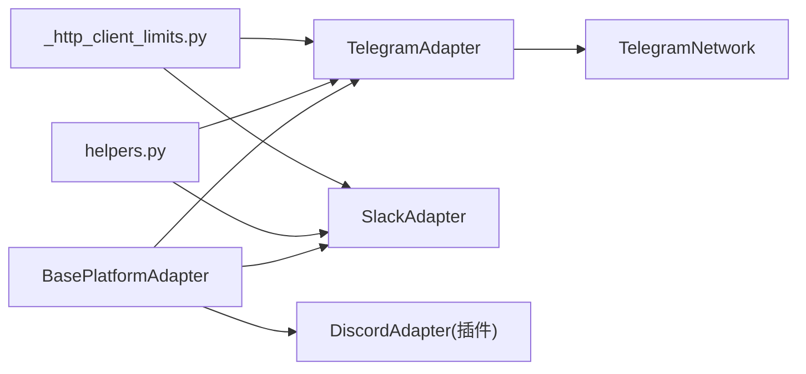

# 平台插件

<cite>
**本文档引用的文件**
- [gateway/platforms/base.py](file://gateway/platforms/base.py)
- [gateway/platforms/__init__.py](file://gateway/platforms/__init__.py)
- [gateway/platforms/telegram.py](file://gateway/platforms/telegram.py)
- [gateway/platforms/telegram_network.py](file://gateway/platforms/telegram_network.py)
- [gateway/platforms/slack.py](file://gateway/platforms/slack.py)
- [gateway/platforms/helpers.py](file://gateway/platforms/helpers.py)
- [gateway/platforms/_http_client_limits.py](file://gateway/platforms/_http_client_limits.py)
- [plugins/platforms/discord/adapter.py](file://plugins/platforms/discord/adapter.py)
- [gateway/config.py](file://gateway/config.py)
</cite>

## 目录
1. [引言](#引言)
2. [项目结构](#项目结构)
3. [核心组件](#核心组件)
4. [架构总览](#架构总览)
5. [详细组件分析](#详细组件分析)
6. [依赖分析](#依赖分析)
7. [性能考量](#性能考量)
8. [故障排查指南](#故障排查指南)
9. [结论](#结论)
10. [附录](#附录)

## 引言
本文件面向平台插件开发者，系统化阐述如何在该代码库中开发与集成各类消息平台插件（以 Discord、Telegram、Slack 为代表）。内容覆盖平台适配器的通用接口、认证与连接、消息路由与事件监听、状态同步、富文本与多媒体处理、交互式组件、配置管理与环境适配、以及测试与兼容性策略。文档同时给出可直接定位到源码路径的“章节来源”与“图示来源”，便于读者对照实现细节。

## 项目结构
平台插件由“网关平台层”与“插件平台层”两部分组成：
- 网关平台层：位于 gateway/platforms，提供统一的基类与通用能力（代理、缓存、网络、去重、批处理等），并内置若干平台适配器（Telegram、Slack 等）。
- 插件平台层：位于 plugins/platforms，提供可扩展的平台适配器（如 Discord），通过注册机制接入网关运行时。

**图示来源**
- [gateway/platforms/base.py:1-200](file://gateway/platforms/base.py#L1-L200)
- [gateway/platforms/telegram.py:1-200](file://gateway/platforms/telegram.py#L1-L200)
- [gateway/platforms/slack.py:1-200](file://gateway/platforms/slack.py#L1-L200)
- [gateway/platforms/telegram_network.py:1-120](file://gateway/platforms/telegram_network.py#L1-L120)
- [plugins/platforms/discord/adapter.py:1-200](file://plugins/platforms/discord/adapter.py#L1-L200)
- [gateway/platforms/helpers.py:1-120](file://gateway/platforms/helpers.py#L1-L120)
- [gateway/platforms/_http_client_limits.py:1-85](file://gateway/platforms/_http_client_limits.py#L1-L85)
- [gateway/config.py:136-240](file://gateway/config.py#L136-L240)
- [gateway/platforms/__init__.py:1-46](file://gateway/platforms/__init__.py#L1-L46)

**章节来源**
- [gateway/platforms/__init__.py:1-46](file://gateway/platforms/__init__.py#L1-L46)
- [gateway/platforms/base.py:1-200](file://gateway/platforms/base.py#L1-L200)
- [gateway/config.py:136-240](file://gateway/config.py#L136-L240)

## 核心组件
- 基类与通用工具
  - BasePlatformAdapter：定义平台适配器的统一接口与通用行为（消息长度计算、媒体缓存、代理解析、线程元数据、通知控制等）。
  - helpers：提供消息去重、文本批聚合、Markdown 清理、线程参与跟踪等跨平台复用能力。
  - httpx 客户端限制：为长连接适配器提供合理的 keepalive 与连接池参数，缓解文件描述符压力。
- 平台适配器
  - Telegram：基于 python-telegram-bot，支持话题线程、富文本、媒体、链接预览、代理与网络回退。
  - Slack：基于 slack-bolt 的 Socket Mode，支持多工作区、线程、块级消息、附件下载、响应 URL 替换等。
  - Discord：基于 discord.py，支持 slash 命令、按钮授权、语音接收与转写、线程与自动归档等。
- 配置与枚举
  - Platform 枚举与 PlatformConfig 数据类：统一平台类型、令牌、家频道、回复模式、额外配置等。

**章节来源**
- [gateway/platforms/base.py:1-200](file://gateway/platforms/base.py#L1-L200)
- [gateway/platforms/helpers.py:1-120](file://gateway/platforms/helpers.py#L1-L120)
- [gateway/platforms/_http_client_limits.py:1-85](file://gateway/platforms/_http_client_limits.py#L1-L85)
- [gateway/platforms/telegram.py:1-200](file://gateway/platforms/telegram.py#L1-L200)
- [gateway/platforms/slack.py:1-200](file://gateway/platforms/slack.py#L1-L200)
- [plugins/platforms/discord/adapter.py:1-200](file://plugins/platforms/discord/adapter.py#L1-L200)
- [gateway/config.py:136-240](file://gateway/config.py#L136-L240)

## 架构总览
平台插件遵循“统一基类 + 平台特化”的分层设计。所有适配器继承自 BasePlatformAdapter，并通过配置驱动启用/禁用、设置令牌与额外参数。网关负责会话管理、流式输出、状态同步与生命周期通知；平台适配器负责具体协议对接与消息格式转换。

**图示来源**
- [gateway/platforms/base.py:1-200](file://gateway/platforms/base.py#L1-L200)
- [gateway/platforms/slack.py:305-380](file://gateway/platforms/slack.py#L305-L380)
- [gateway/platforms/telegram.py:337-420](file://gateway/platforms/telegram.py#L337-L420)
- [plugins/platforms/discord/adapter.py:604-700](file://plugins/platforms/discord/adapter.py#L604-L700)

## 详细组件分析

### 基类与通用能力（BasePlatformAdapter）
- 统一接口与职责
  - 消息长度与截断：按平台字符单位（如 Telegram 使用 UTF-16 单元）进行长度度量与截断。
  - 线程与回复：构建平台感知的 thread_id、reply_to 等元数据，确保在 DM 话题、论坛主题等场景正确路由。
  - 通知控制：根据“重要通知/静默模式”决定是否发送推送。
  - 媒体缓存：图片/音频/视频本地缓存，避免平台过期 URL 导致的失败。
  - 代理与网络：解析系统/环境代理，支持 SOCKS/HTTP，绕过 NO_PROXY 白名单。
- 关键函数与数据结构
  - 线程元数据构建、回复锚点推断、媒体类型判定、UTF-16 计数与前缀截断、代理解析与连接参数生成、图像/音频/视频缓存与清理。

**图示来源**
- [gateway/platforms/base.py:55-146](file://gateway/platforms/base.py#L55-L146)
- [gateway/platforms/base.py:348-448](file://gateway/platforms/base.py#L348-L448)
- [gateway/platforms/base.py:541-680](file://gateway/platforms/base.py#L541-L680)

**章节来源**
- [gateway/platforms/base.py:55-146](file://gateway/platforms/base.py#L55-L146)
- [gateway/platforms/base.py:348-448](file://gateway/platforms/base.py#L348-L448)
- [gateway/platforms/base.py:541-680](file://gateway/platforms/base.py#L541-L680)

### Telegram 适配器
- 特性与能力
  - 基于 python-telegram-bot，支持 MarkdownV2、富文本、表格重写、链接预览开关、媒体组延迟、DM 话题路由、代理与网络回退。
  - 文本批处理：对快速连续消息进行合并，降低编辑频率与速率限制风险。
  - DM 话题与回复锚点：严格区分“话题回复锚点”与“直接话题 ID”，在话题不存在或锚点失效时自动降级。
  - 网络回退：通过 DNS-over-HTTPS 发现可用 IP，使用主机名保留的 HTTPX 传输在主路径不可达时切换备用 IP。
- 关键实现要点
  - 代理：支持 HTTP/HTTPS/SOCKS，优先平台环境变量，其次通用环境变量，最后 macOS 系统代理。
  - 限长：消息长度以 UTF-16 单位计，富文本上限更高但需分片。
  - 话题路由：message_thread_id、direct_messages_topic_id、telegram_reply_to_message_id 的组合使用。
  - 网络回退：TelegramFallbackTransport 在主 DNS 失败时重试备用 IPv4，保持 TLS SNI 与 Host 头一致。

**图示来源**
- [gateway/platforms/telegram.py:337-420](file://gateway/platforms/telegram.py#L337-L420)
- [gateway/platforms/telegram_network.py:52-130](file://gateway/platforms/telegram_network.py#L52-L130)
- [gateway/platforms/telegram_network.py:195-240](file://gateway/platforms/telegram_network.py#L195-L240)

**章节来源**
- [gateway/platforms/telegram.py:1-200](file://gateway/platforms/telegram.py#L1-L200)
- [gateway/platforms/telegram.py:337-420](file://gateway/platforms/telegram.py#L337-L420)
- [gateway/platforms/telegram_network.py:1-120](file://gateway/platforms/telegram_network.py#L1-L120)
- [gateway/platforms/telegram_network.py:195-240](file://gateway/platforms/telegram_network.py#L195-L240)

### Slack 适配器
- 特性与能力
  - Socket Mode 接入，支持多工作区、线程上下文缓存、Block Kit 文本提取、附件下载与权限诊断、响应 URL 替换实现“仅您可见”的初始响应。
  - 去重与稳定性：MessageDeduplicator 防止 Socket Mode 重连导致的重复事件；Socket Watchdog 自愈网络波动。
  - 代理：解析 HTTP/HTTPS 代理，排除 NO_PROXY 白名单主机。
- 关键实现要点
  - 文本批聚合：与 Telegram 类似的文本批处理，减少编辑风暴。
  - 附件下载：带 SSRF 保护的下载流程，失败时提供可操作的错误提示。
  - Slash 命令：使用 ContextVar 保存调用者 ID，确保并发场景下响应 URL 路由正确。

**图示来源**
- [gateway/platforms/slack.py:305-380](file://gateway/platforms/slack.py#L305-L380)
- [gateway/platforms/slack.py:463-521](file://gateway/platforms/slack.py#L463-L521)
- [gateway/platforms/slack.py:644-684](file://gateway/platforms/slack.py#L644-L684)

**章节来源**
- [gateway/platforms/slack.py:1-200](file://gateway/platforms/slack.py#L1-L200)
- [gateway/platforms/slack.py:305-380](file://gateway/platforms/slack.py#L305-L380)
- [gateway/platforms/slack.py:463-521](file://gateway/platforms/slack.py#L463-L521)
- [gateway/platforms/slack.py:644-684](file://gateway/platforms/slack.py#L644-L684)

### Discord 适配器（插件）
- 特性与能力
  - 基于 discord.py，支持 slash 命令、按钮授权、语音接收与转写、线程与自动归档、文本批处理、去重与 typing 指示。
  - 语音：RTP/Opus 解密、DAVE E2EE 支持、静音检测、PCM 转 WAV、与 TTS/混音器协同。
  - 安全：AllowedMentions 默认关闭 @everyone/@role，允许用户/回复作者 ping，可通过环境变量覆盖。
- 关键实现要点
  - 连接：等待 ready 或 bot 任务退出，快速暴露启动失败原因。
  - 语音：Windows/macOS 下 OPUS 加载策略、静音阈值与最小语音时长、SSRC 映射与用户推断。
  - 线程：持久化线程参与记录，重启后仍可识别已参与线程。

**图示来源**
- [plugins/platforms/discord/adapter.py:604-700](file://plugins/platforms/discord/adapter.py#L604-L700)
- [plugins/platforms/discord/adapter.py:217-293](file://plugins/platforms/discord/adapter.py#L217-L293)
- [plugins/platforms/discord/adapter.py:546-574](file://plugins/platforms/discord/adapter.py#L546-L574)

**章节来源**
- [plugins/platforms/discord/adapter.py:1-200](file://plugins/platforms/discord/adapter.py#L1-L200)
- [plugins/platforms/discord/adapter.py:604-700](file://plugins/platforms/discord/adapter.py#L604-L700)
- [plugins/platforms/discord/adapter.py:217-293](file://plugins/platforms/discord/adapter.py#L217-L293)
- [plugins/platforms/discord/adapter.py:546-574](file://plugins/platforms/discord/adapter.py#L546-L574)

### 通用工具与共享能力
- 去重与批处理
  - MessageDeduplicator：基于 TTL 的消息 ID 去重，防止重连/重放导致的重复处理。
  - TextBatchAggregator：将短时间内到达的文本事件合并为单次处理，降低编辑频率。
- Markdown 清理与线程跟踪
  - strip_markdown：移除 Markdown 格式，用于不支持富文本的平台。
  - ThreadParticipationTracker：持久化线程参与记录，支持跨重启识别。
- HTTPX 客户端限制
  - 降低 keepalive_expiry 与最大 keepalive 连接数，缓解代理/防火墙下的 CLOSE_WAIT 积压问题。

**章节来源**
- [gateway/platforms/helpers.py:27-120](file://gateway/platforms/helpers.py#L27-L120)
- [gateway/platforms/helpers.py:180-196](file://gateway/platforms/helpers.py#L180-L196)
- [gateway/platforms/helpers.py:201-260](file://gateway/platforms/helpers.py#L201-L260)
- [gateway/platforms/_http_client_limits.py:43-85](file://gateway/platforms/_http_client_limits.py#L43-L85)

## 依赖分析
- 组件耦合
  - 所有平台适配器强依赖 BasePlatformAdapter，共享通用工具（helpers、缓存、代理）。
  - Telegram 与 Slack 共享 httpx 客户端限制策略，降低文件描述符压力。
  - Discord 作为插件平台，通过注册机制接入网关，复用基类与通用工具。
- 外部依赖
  - Telegram：python-telegram-bot（含 HTTPXRequest）、LinkPreviewOptions（可选）。
  - Slack：slack-bolt、slack_sdk、aiohttp。
  - Discord：discord.py、nacl、davey（可选）、ffmpeg（语音转写）。
- 循环依赖
  - 通过模块导入顺序与延迟绑定（如 check_*_requirements）避免循环导入。

**图示来源**
- [gateway/platforms/base.py:1-200](file://gateway/platforms/base.py#L1-L200)
- [gateway/platforms/telegram.py:1-120](file://gateway/platforms/telegram.py#L1-L120)
- [gateway/platforms/slack.py:1-120](file://gateway/platforms/slack.py#L1-L120)
- [plugins/platforms/discord/adapter.py:1-120](file://plugins/platforms/discord/adapter.py#L1-L120)
- [gateway/platforms/helpers.py:1-120](file://gateway/platforms/helpers.py#L1-L120)
- [gateway/platforms/_http_client_limits.py:1-85](file://gateway/platforms/_http_client_limits.py#L1-L85)
- [gateway/platforms/telegram_network.py:1-120](file://gateway/platforms/telegram_network.py#L1-L120)

**章节来源**
- [gateway/platforms/base.py:1-200](file://gateway/platforms/base.py#L1-L200)
- [gateway/platforms/telegram.py:1-120](file://gateway/platforms/telegram.py#L1-L120)
- [gateway/platforms/slack.py:1-120](file://gateway/platforms/slack.py#L1-L120)
- [plugins/platforms/discord/adapter.py:1-120](file://plugins/platforms/discord/adapter.py#L1-L120)

## 性能考量
- 编辑与流式节奏
  - Telegram 默认编辑间隔与缓冲阈值经调优以贴合平台编辑速率限制；可按平台特性调整。
- 连接池与 keepalive
  - httpx 客户端限制默认收紧 keepalive，避免代理/防火墙导致的连接积压；可通过环境变量微调。
- 文本批处理
  - Telegram/Slack/Discord 均提供文本批聚合，降低编辑风暴与 API 调用次数。
- 语音处理
  - Discord 语音接收采用静音检测与最小语音时长策略，结合 PCM 转 WAV 与外部工具链，平衡实时性与资源占用。

**章节来源**
- [gateway/platforms/base.py:381-448](file://gateway/platforms/base.py#L381-L448)
- [gateway/platforms/_http_client_limits.py:43-85](file://gateway/platforms/_http_client_limits.py#L43-L85)
- [gateway/platforms/helpers.py:81-164](file://gateway/platforms/helpers.py#L81-L164)
- [plugins/platforms/discord/adapter.py:217-293](file://plugins/platforms/discord/adapter.py#L217-L293)

## 故障排查指南
- 代理与网络
  - Telegram：若 api.telegram.org 无法访问，启用 TelegramFallbackTransport 并使用 DoH 发现可用 IP；确认代理方案与 NO_PROXY 白名单。
  - Slack：仅支持 HTTP/HTTPS 代理，且需排除 NO_PROXY；Socket Mode 断开时通过 watchdog 自愈。
  - Discord：SOCKS 代理失败会暴露底层异常；建议优先使用 HTTP 代理。
- 附件与权限
  - Slack：下载失败时根据 API 错误码与 HTTP 状态码提供明确提示（如权限不足、文件不存在、HTML 登录页等）。
- 速率限制与重试
  - 基类提供媒体缓存重试（指数退避）与代理重定向防护（SSRF），平台适配器在发送失败时可结合元数据进行降级（如移除话题锚点）。
- 连接健康
  - Slack/Telegram：Watchdog/Ready 等机制快速暴露连接失败；Discord：_wait_for_ready_or_bot_exit 将早期失败快速传播。

**章节来源**
- [gateway/platforms/telegram_network.py:52-130](file://gateway/platforms/telegram_network.py#L52-L130)
- [gateway/platforms/slack.py:554-595](file://gateway/platforms/slack.py#L554-L595)
- [gateway/platforms/slack.py:596-635](file://gateway/platforms/slack.py#L596-L635)
- [gateway/platforms/base.py:622-680](file://gateway/platforms/base.py#L622-L680)
- [plugins/platforms/discord/adapter.py:78-113](file://plugins/platforms/discord/adapter.py#L78-L113)

## 结论
该平台插件体系以 BasePlatformAdapter 为核心，通过统一的接口、通用工具与平台特化适配器，实现了对 Telegram、Slack、Discord 等主流消息平台的一致接入体验。开发者在新增平台时，应遵循以下原则：
- 从 BasePlatformAdapter 继承，实现 connect/send/format_message 等核心方法；
- 正确处理平台特定的认证、代理与网络回退；
- 利用 helpers 提升一致性与可维护性；
- 通过 GatewayConfig 与 Platform 枚举完成配置与注册；
- 在测试中覆盖认证、网络、速率限制、附件与交互式组件等关键路径。

## 附录
- 开发清单
  - 实现 connect()/send()/format_message()；
  - 处理平台令牌/密钥与环境变量；
  - 支持代理与网络回退（如适用）；
  - 实现线程/回复元数据构建；
  - 媒体缓存与格式转换；
  - 交互式组件（按钮/菜单/语音）；
  - 注册与配置（Platform 枚举、PlatformConfig、GatewayConfig）。
- 测试建议
  - 单元测试：消息格式转换、线程元数据、代理解析、媒体缓存；
  - 集成测试：Socket Mode/机器人连接、速率限制、附件下载、Slash 命令；
  - 兼容性测试：不同平台字符长度、富文本渲染差异、网络受限环境（内网/代理/GFW）。