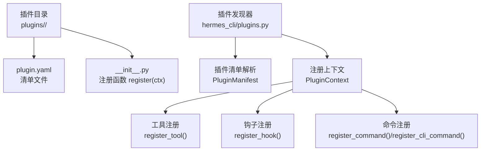
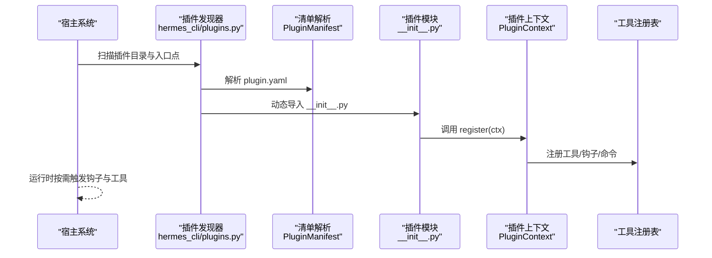
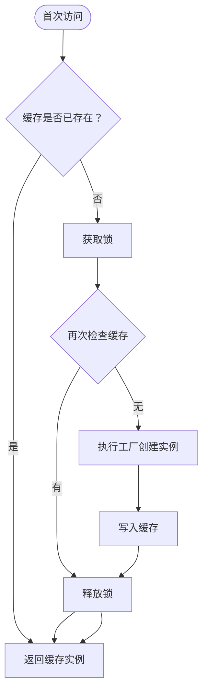
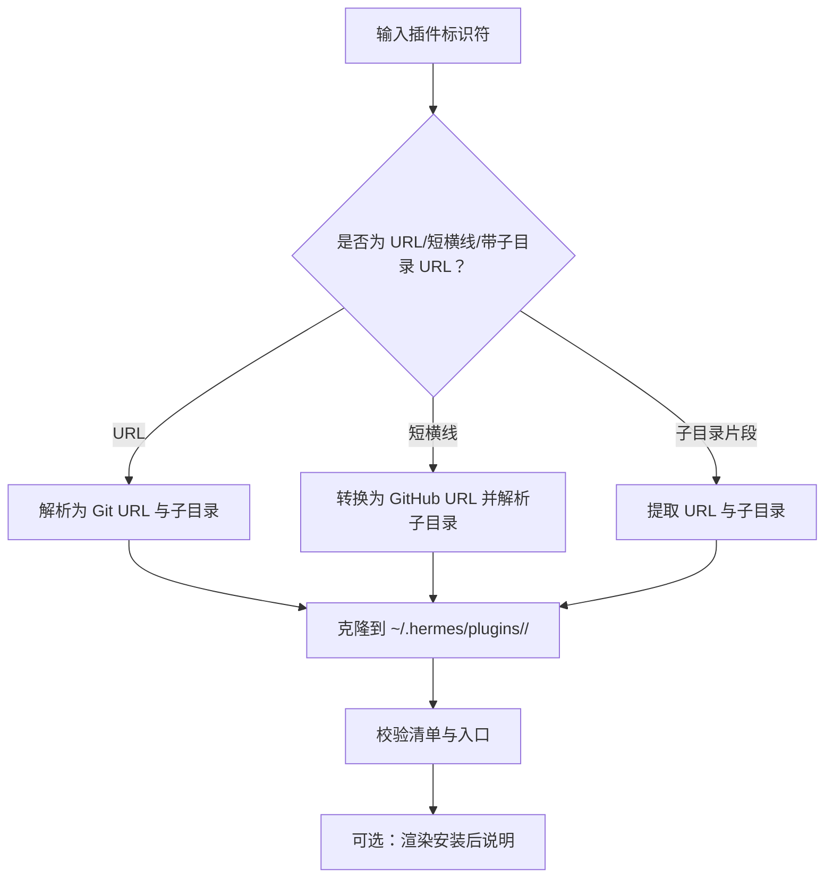
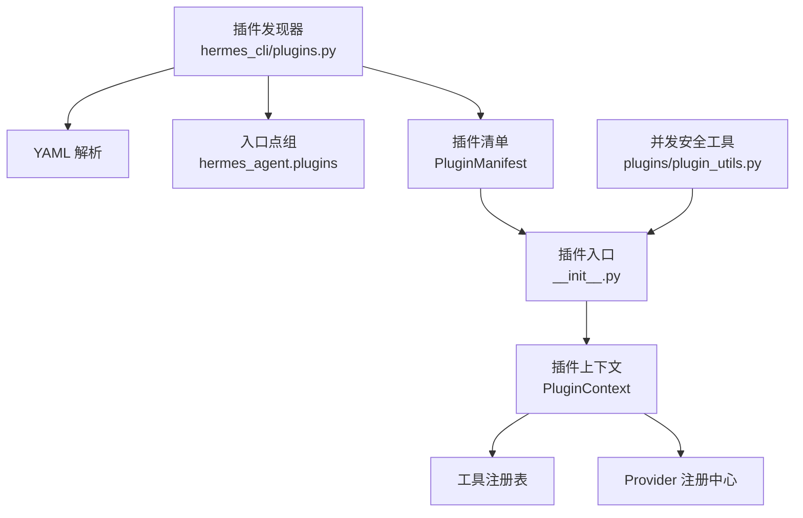

# 插件开发指南

<cite>
**本文档引用的文件**
- [plugins/__init__.py](file://plugins/__init__.py)
- [plugins/plugin_utils.py](file://plugins/plugin_utils.py)
- [hermes_cli/plugins.py](file://hermes_cli/plugins.py)
- [hermes_cli/plugins_cmd.py](file://hermes_cli/plugins_cmd.py)
- [plugins/disk-cleanup/plugin.yaml](file://plugins/disk-cleanup/plugin.yaml)
- [plugins/disk-cleanup/__init__.py](file://plugins/disk-cleanup/__init__.py)
- [plugins/google_meet/plugin.yaml](file://plugins/google_meet/plugin.yaml)
- [plugins/security-guidance/plugin.yaml](file://plugins/security-guidance/plugin.yaml)
- [optional-mcps/linear/manifest.yaml](file://optional-mcps/linear/manifest.yaml)
- [tests/test_plugin_utils.py](file://tests/test_plugin_utils.py)
- [CONTRIBUTING.md](file://CONTRIBUTING.md)
</cite>

## 目录
1. [简介](#简介)
2. [项目结构](#项目结构)
3. [核心组件](#核心组件)
4. [架构总览](#架构总览)
5. [详细组件分析](#详细组件分析)
6. [依赖关系分析](#依赖关系分析)
7. [性能考虑](#性能考虑)
8. [故障排除指南](#故障排除指南)
9. [结论](#结论)
10. [附录](#附录)

## 简介
本指南面向希望在 Hermes 生态中开发插件的开发者，覆盖从项目初始化、目录结构与元数据规范、接口实现与参数校验、最佳实践、测试策略、打包分发与版本管理，到常见问题与调试技巧的全流程。文中所有技术细节均基于仓库中的实际实现与示例进行提炼总结。

## 项目结构
Hermes 插件系统采用“目录即插件”的模式，每个插件是一个独立目录，包含清单文件与入口模块，并通过统一的发现与加载机制接入宿主系统。插件来源包括：
- 内置插件：位于仓库根目录 plugins/ 下
- 用户插件：位于用户家目录 ~/.hermes/plugins/ 下
- 项目级插件：位于项目根目录 .hermes/plugins/ 下（需显式启用）
- Pip 插件：通过 Python 入口点 hermes_agent.plugins 发现

插件目录必须包含：
- plugin.yaml 清单文件（定义元数据与能力声明）
- __init__.py 入口模块（提供 register(ctx) 函数）

**图表来源**
- [hermes_cli/plugins.py:19-32](file://hermes_cli/plugins.py#L19-L32)
- [plugins/disk-cleanup/plugin.yaml:1-8](file://plugins/disk-cleanup/plugin.yaml#L1-L8)
- [plugins/disk-cleanup/__init__.py:309-317](file://plugins/disk-cleanup/__init__.py#L309-L317)

**章节来源**
- [hermes_cli/plugins.py:5-32](file://hermes_cli/plugins.py#L5-L32)
- [plugins/disk-cleanup/plugin.yaml:1-8](file://plugins/disk-cleanup/plugin.yaml#L1-L8)

## 核心组件
- 插件清单（PluginManifest）：解析 plugin.yaml，包含名称、版本、作者、描述、所需环境变量、提供的工具与钩子、插件类型等字段。
- 插件上下文（PluginContext）：向插件暴露注册接口，包括工具注册、钩子注册、命令注册、消息注入、LLM 访问等。
- 插件工具集（tools.registry）：全局工具注册表，插件通过 PluginContext 将自定义工具注册到该表。
- 并发安全工具（plugins/plugin_utils.py）：提供懒加载单例装饰器与线程安全的单例槽，避免多线程下的竞态条件。

**章节来源**
- [hermes_cli/plugins.py:235-284](file://hermes_cli/plugins.py#L235-L284)
- [hermes_cli/plugins.py:290-500](file://hermes_cli/plugins.py#L290-L500)
- [plugins/plugin_utils.py:43-136](file://plugins/plugin_utils.py#L43-L136)

## 架构总览
下图展示了插件从发现、加载到运行时注册的全链路：

**图表来源**
- [hermes_cli/plugins.py:55-66](file://hermes_cli/plugins.py#L55-L66)
- [hermes_cli/plugins.py:235-284](file://hermes_cli/plugins.py#L235-L284)
- [hermes_cli/plugins.py:290-500](file://hermes_cli/plugins.py#L290-L500)

## 详细组件分析

### 插件清单与元数据规范
- 必填字段：name、version（建议语义化版本）、description、author
- 可选字段：hooks、provides_tools、provides_hooks、kind、platforms、requires_env 等
- 插件类型（kind）支持 standalone、backend、exclusive、platform、model-provider；不同类型的加载与选择策略不同
- 插件键（key）用于在启用列表与列表展示中唯一标识插件，未设置时回退为 name

示例参考：
- [plugins/disk-cleanup/plugin.yaml:1-8](file://plugins/disk-cleanup/plugin.yaml#L1-L8)
- [plugins/google_meet/plugin.yaml:1-17](file://plugins/google_meet/plugin.yaml#L1-L17)
- [plugins/security-guidance/plugin.yaml:1-8](file://plugins/security-guidance/plugin.yaml#L1-L8)

**章节来源**
- [hermes_cli/plugins.py:235-270](file://hermes_cli/plugins.py#L235-L270)
- [plugins/disk-cleanup/plugin.yaml:1-8](file://plugins/disk-cleanup/plugin.yaml#L1-L8)
- [plugins/google_meet/plugin.yaml:1-17](file://plugins/google_meet/plugin.yaml#L1-L17)
- [plugins/security-guidance/plugin.yaml:1-8](file://plugins/security-guidance/plugin.yaml#L1-L8)

### 插件入口与注册流程
- 插件目录必须提供 __init__.py，并在其中定义 register(ctx) 函数
- register(ctx) 中可通过 PluginContext 完成工具、钩子、命令的注册
- 支持的消息注入、CLI 命令、Slash 命令、各类 Provider 注册（图像生成、视频生成、网页搜索、浏览器、TTS、转写等）

示例参考：
- [plugins/disk-cleanup/__init__.py:309-317](file://plugins/disk-cleanup/__init__.py#L309-L317)

**章节来源**
- [hermes_cli/plugins.py:290-790](file://hermes_cli/plugins.py#L290-L790)
- [plugins/disk-cleanup/__init__.py:309-317](file://plugins/disk-cleanup/__init__.py#L309-L317)

### 工具注册与参数校验
- register_tool 接口支持 schema、check_fn、requires_env、is_async、description、emoji、override 等参数
- schema 用于描述工具输入输出结构；check_fn 用于预检查；requires_env 用于声明运行所需的环境变量
- override 可替换内置同名工具；冲突时拒绝注册

示例参考：
- [hermes_cli/plugins.py:320-359](file://hermes_cli/plugins.py#L320-L359)

**章节来源**
- [hermes_cli/plugins.py:320-359](file://hermes_cli/plugins.py#L320-L359)

### 生命周期钩子与事件处理
- 支持的钩子集合：pre_tool_call、post_tool_call、transform_terminal_output、transform_tool_result、transform_llm_output、pre_llm_call、post_llm_call、pre_api_request、post_api_request、api_request_error、on_session_start、on_session_end、on_session_finalize、on_session_reset、subagent_start、subagent_stop、pre_gateway_dispatch、pre_approval_request、post_approval_response
- 钩子回调签名通常包含工具名、参数、结果、任务/会话 ID 等上下文信息

示例参考：
- [hermes_cli/plugins.py:128-170](file://hermes_cli/plugins.py#L128-L170)
- [plugins/disk-cleanup/__init__.py:128-190](file://plugins/disk-cleanup/__init__.py#L128-L190)

**章节来源**
- [hermes_cli/plugins.py:128-170](file://hermes_cli/plugins.py#L128-L170)
- [plugins/disk-cleanup/__init__.py:128-190](file://plugins/disk-cleanup/__init__.py#L128-L190)

### 并发安全与懒加载单例
- 提供 lazy_singleton 装饰器与 SingletonSlot 类，确保多线程环境下工厂仅执行一次，实例被缓存复用
- 测试覆盖了并发首调、异常不缓存、重置重建等场景

**图表来源**
- [plugins/plugin_utils.py:43-82](file://plugins/plugin_utils.py#L43-L82)
- [plugins/plugin_utils.py:84-136](file://plugins/plugin_utils.py#L84-L136)

**章节来源**
- [plugins/plugin_utils.py:43-136](file://plugins/plugin_utils.py#L43-L136)
- [tests/test_plugin_utils.py:18-95](file://tests/test_plugin_utils.py#L18-L95)
- [tests/test_plugin_utils.py:100-160](file://tests/test_plugin_utils.py#L100-L160)

### 插件命令与消息注入
- register_command：注册会话内 Slash 命令，处理器签名 fn(raw_args: str) -> str | None
- register_cli_command：注册 CLI 子命令，setup_fn 负责参数解析，handler_fn 为默认分发函数
- inject_message：向当前会话注入消息，支持中断当前轮次或作为待输入排队

示例参考：
- [hermes_cli/plugins.py:390-468](file://hermes_cli/plugins.py#L390-L468)
- [hermes_cli/plugins.py:471-499](file://hermes_cli/plugins.py#L471-L499)
- [hermes_cli/plugins.py:362-387](file://hermes_cli/plugins.py#L362-L387)

**章节来源**
- [hermes_cli/plugins.py:390-499](file://hermes_cli/plugins.py#L390-L499)

### Provider 注册（图像生成、视频生成、网页搜索、浏览器、TTS、转写等）
- register_image_gen_provider、register_video_gen_provider、register_web_search_provider、register_browser_provider、register_tts_provider、register_transcription_provider
- 各 Provider 需继承对应抽象基类并通过名称匹配路由

示例参考：
- [hermes_cli/plugins.py:534-766](file://hermes_cli/plugins.py#L534-L766)

**章节来源**
- [hermes_cli/plugins.py:534-766](file://hermes_cli/plugins.py#L534-L766)

### 插件安装与管理（CLI）
- hermes plugins 子命令支持安装、更新、删除、列出插件
- 支持 Git URL、短横线形式（owner/repo 或 owner/repo/path/to/plugin）与带子目录片段的 URL
- 安装路径受安全规则约束，防止路径穿越

**图表来源**
- [hermes_cli/plugins_cmd.py:152-200](file://hermes_cli/plugins_cmd.py#L152-L200)
- [hermes_cli/plugins_cmd.py:74-136](file://hermes_cli/plugins_cmd.py#L74-L136)

**章节来源**
- [hermes_cli/plugins_cmd.py:152-200](file://hermes_cli/plugins_cmd.py#L152-L200)
- [hermes_cli/plugins_cmd.py:74-136](file://hermes_cli/plugins_cmd.py#L74-L136)

### MCP 适配器清单（可选 MCP）
- optional-mcps 下的 manifest.yaml 定义远程 MCP 服务器的传输、认证与工具选择策略
- 适用于无需本地安装即可使用的第三方 MCP 服务

示例参考：
- [optional-mcps/linear/manifest.yaml:1-39](file://optional-mcps/linear/manifest.yaml#L1-L39)

**章节来源**
- [optional-mcps/linear/manifest.yaml:1-39](file://optional-mcps/linear/manifest.yaml#L1-L39)

## 依赖关系分析
- 插件发现器依赖 YAML 解析（可选），并根据环境变量与入口点组定位插件
- 插件上下文依赖工具注册表与各类 Provider 注册中心
- 插件工具集与并发安全工具相互独立，便于插件侧按需导入

**图表来源**
- [hermes_cli/plugins.py:67-72](file://hermes_cli/plugins.py#L67-L72)
- [hermes_cli/plugins.py:172-173](file://hermes_cli/plugins.py#L172-L173)
- [plugins/plugin_utils.py:32-38](file://plugins/plugin_utils.py#L32-L38)

**章节来源**
- [hermes_cli/plugins.py:67-72](file://hermes_cli/plugins.py#L67-L72)
- [plugins/plugin_utils.py:32-38](file://plugins/plugin_utils.py#L32-L38)

## 性能考虑
- 使用并发安全的懒加载单例避免昂贵对象重复初始化，减少资源泄漏与竞争风险
- 钩子与工具回调应尽量轻量，避免阻塞主线程
- 对于大文本扫描与正则匹配，注意长度限制与超时控制（如终端输出扫描的大小阈值）

**章节来源**
- [plugins/plugin_utils.py:43-82](file://plugins/plugin_utils.py#L43-L82)
- [plugins/disk-cleanup/__init__.py:103-122](file://plugins/disk-cleanup/__init__.py#L103-L122)

## 故障排除指南
- 插件未出现：设置 HERMES_PLUGINS_DEBUG=1 开启详细插件发现日志，查看扫描目录、清单解析、跳过原因与加载失败堆栈
- 命名冲突：register_tool 时若名称已被占用且不属于同一工具集，注册会被拒绝；register_command 会拒绝与内置命令冲突的名称
- Provider 注册失败：确保 Provider 实例继承自正确的抽象基类，名称不与内置或命令型 Provider 冲突
- 安装失败：确认 Git 可用、URL 正确、目标路径安全；必要时使用强制重装选项

**章节来源**
- [hermes_cli/plugins.py:75-122](file://hermes_cli/plugins.py#L75-L122)
- [hermes_cli/plugins.py:448-460](file://hermes_cli/plugins.py#L448-L460)
- [hermes_cli/plugins_cmd.py:152-200](file://hermes_cli/plugins_cmd.py#L152-L200)

## 结论
Hermes 插件体系以清晰的目录结构、标准化的清单与严格的注册接口为核心，辅以并发安全工具与完善的 CLI 管理能力，使开发者能够快速构建、测试、分发与维护高质量插件。遵循本文档的规范与最佳实践，可显著提升插件的稳定性、可维护性与用户体验。

## 附录

### 插件开发最佳实践
- 目录与清单：严格遵守 plugin.yaml 字段与目录布局，提供清晰的描述与版本号
- 注册接口：优先使用 PluginContext 的注册方法，避免直接操作内部状态
- 参数校验：在 register_tool 中提供 schema 与 check_fn，明确 requires_env
- 错误处理：钩子与工具回调中捕获并记录异常，避免传播至宿主
- 日志记录：使用标准日志模块，区分 DEBUG/INFO/WARNING/ERROR 级别
- 并发安全：对共享资源使用懒加载单例或线程锁
- 测试策略：单元测试覆盖并发首调、异常路径与重置逻辑；集成测试覆盖钩子与工具调用链

**章节来源**
- [plugins/plugin_utils.py:43-136](file://plugins/plugin_utils.py#L43-L136)
- [tests/test_plugin_utils.py:18-95](file://tests/test_plugin_utils.py#L18-L95)
- [tests/test_plugin_utils.py:100-160](file://tests/test_plugin_utils.py#L100-L160)

### 测试策略
- 单元测试：针对并发安全工具与插件工具注册进行并发与异常测试
- 集成测试：模拟插件加载、钩子触发与工具调用，验证返回值格式与副作用
- 端到端测试：通过 CLI 安装与启用插件，验证功能在真实会话中的表现

**章节来源**
- [tests/test_plugin_utils.py:1-160](file://tests/test_plugin_utils.py#L1-L160)

### 打包、分发与版本管理
- 版本管理：遵循语义化版本；发布脚本支持变更日志生成与 CalVer 标签
- 分发渠道：用户插件放置于 ~/.hermes/plugins/；也可通过 pip 入口点分发
- 安装流程：CLI 自动解析 URL/短横线/子目录片段，安全克隆到用户目录

**章节来源**
- [CONTRIBUTING.md:1-200](file://CONTRIBUTING.md#L1-L200)
- [hermes_cli/plugins_cmd.py:152-200](file://hermes_cli/plugins_cmd.py#L152-L200)