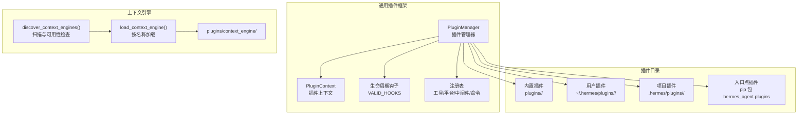
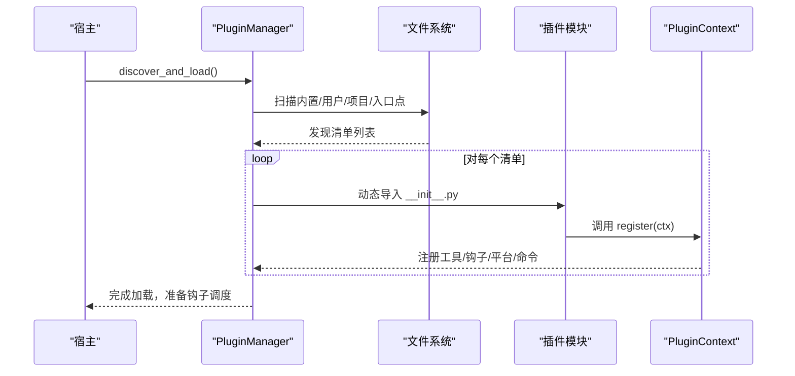
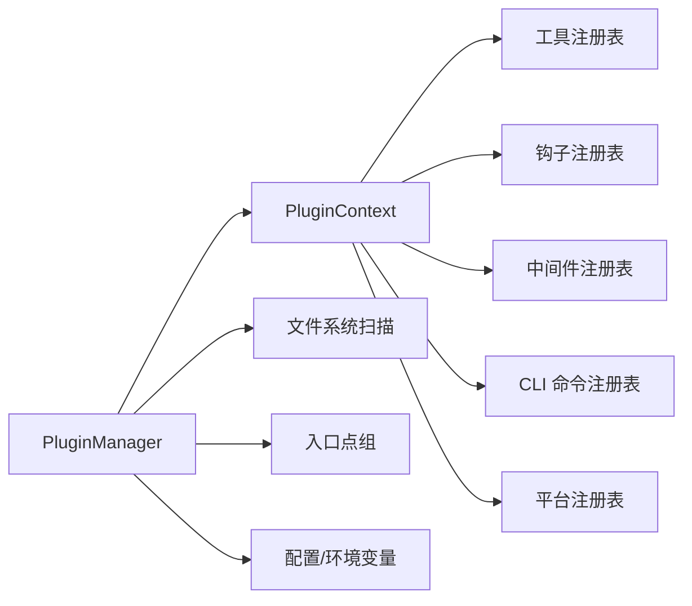

# 插件架构设计

<cite>
**本文档引用的文件**
- [plugins/__init__.py](file://plugins/__init__.py)
- [plugins/plugin_utils.py](file://plugins/plugin_utils.py)
- [hermes_cli/plugins.py](file://hermes_cli/plugins.py)
- [hermes_cli/plugins_cmd.py](file://hermes_cli/plugins_cmd.py)
- [plugins/context_engine/__init__.py](file://plugins/context_engine/__init__.py)
- [plugins/disk-cleanup/plugin.yaml](file://plugins/disk-cleanup/plugin.yaml)
- [plugins/google_meet/plugin.yaml](file://plugins/google_meet/plugin.yaml)
- [plugins/security-guidance/plugin.yaml](file://plugins/security-guidance/plugin.yaml)
</cite>

## 目录
1. [引言](#引言)
2. [项目结构](#项目结构)
3. [核心组件](#核心组件)
4. [架构总览](#架构总览)
5. [详细组件分析](#详细组件分析)
6. [依赖分析](#依赖分析)
7. [性能考虑](#性能考虑)
8. [故障排查指南](#故障排查指南)
9. [结论](#结论)
10. [附录](#附录)

## 引言
本文件系统性阐述 Hermes 插件架构的设计与实现，覆盖插件发现机制、加载流程、注册表管理、接口规范与抽象基类、生命周期钩子、工具与平台适配器注册、配置与环境变量管理、安全沙箱与权限控制策略，以及面向插件开发者的扩展点与最佳实践。目标是帮助开发者在不破坏宿主稳定性的前提下，安全、可维护地扩展 Hermes 的能力边界。

## 项目结构
插件系统由“通用插件框架”和“特定领域插件”两部分组成：
- 通用插件框架位于 hermes_cli/plugins.py，负责插件发现、加载、注册与生命周期调度。
- 特定领域插件位于 plugins/ 目录，如 disk-cleanup、google_meet、security-guidance 等，每个插件通过 plugin.yaml 提供元数据并通过 __init__.py 暴露 register(ctx) 入口。
- 上下文引擎（context_engine）采用独立扫描与加载机制，位于 plugins/context_engine/，与通用插件系统并行但互斥选择。

图表来源
- [hermes_cli/plugins.py:1118-1200](file://hermes_cli/plugins.py#L1118-L1200)
- [plugins/context_engine/__init__.py:33-98](file://plugins/context_engine/__init__.py#L33-L98)

章节来源
- [hermes_cli/plugins.py:1-120](file://hermes_cli/plugins.py#L1-L120)
- [plugins/context_engine/__init__.py:1-30](file://plugins/context_engine/__init__.py#L1-L30)

## 核心组件
- 插件清单（PluginManifest）：解析 plugin.yaml，包含 name、version、description、author、requires_env、provides_tools、provides_hooks、kind、key 等字段。
- 已加载插件（LoadedPlugin）：运行时状态，记录模块、已注册工具/钩子/中间件/命令、启用状态与错误信息。
- 插件上下文（PluginContext）：向插件暴露注册 API，包括工具注册、钩子注册、CLI 命令注册、Slash 命令注册、平台适配器注册、LLM 访问门面等。
- 插件管理器（PluginManager）：统一发现与加载入口，支持强制刷新、安全模式跳过、多源合并覆盖策略。

章节来源
- [hermes_cli/plugins.py:235-284](file://hermes_cli/plugins.py#L235-L284)
- [hermes_cli/plugins.py:290-520](file://hermes_cli/plugins.py#L290-L520)
- [hermes_cli/plugins.py:1087-1160](file://hermes_cli/plugins.py#L1087-L1160)

## 架构总览
插件系统遵循“多源发现、清单驱动、按需加载、生命周期钩子”的设计原则。插件来源优先级为：内置 → 用户 → 项目 → 入口点；后到者覆盖同名项。插件通过 register(ctx) 注册工具、钩子、平台适配器等；宿主在合适时机调用钩子回调，实现非侵入式扩展。

图表来源
- [hermes_cli/plugins.py:1118-1160](file://hermes_cli/plugins.py#L1118-L1160)
- [hermes_cli/plugins.py:1160-1200](file://hermes_cli/plugins.py#L1160-L1200)

## 详细组件分析

### 插件发现与加载机制
- 多源扫描：内置插件目录、用户插件目录、项目插件目录（受开关控制）、pip 入口点组。
- 清单解析：支持 plugin.yaml 与 plugin.yml；缺失时仅作为目录存在但不视为有效插件。
- 加载顺序：内置优先，随后用户；用户安装的插件可覆盖内置同名插件。
- 安全模式：HERMES_SAFE_MODE=1 时跳过插件发现，确保最小化风险。
- 强制刷新：支持清理缓存状态，使配置变更或新增插件在长会话中可见。

章节来源
- [hermes_cli/plugins.py:1118-1200](file://hermes_cli/plugins.py#L1118-L1200)
- [hermes_cli/plugins_cmd.py:872-926](file://hermes_cli/plugins_cmd.py#L872-L926)

### 插件清单与元数据
- 必备字段：name、version（可选）、description（可选）、author（可选）。
- 可选字段：requires_env（环境变量声明）、provides_tools（工具名列表）、provides_hooks（钩子名列表）、kind（插件类型）、key（注册键）。
- 示例：disk-cleanup、google_meet、security-guidance 均通过 hooks、provides_tools 等字段声明其行为。

章节来源
- [plugins/disk-cleanup/plugin.yaml:1-8](file://plugins/disk-cleanup/plugin.yaml#L1-L8)
- [plugins/google_meet/plugin.yaml:1-17](file://plugins/google_meet/plugin.yaml#L1-L17)
- [plugins/security-guidance/plugin.yaml:1-8](file://plugins/security-guidance/plugin.yaml#L1-L8)

### 插件上下文与注册 API
- 工具注册：register_tool(name, toolset, schema, handler, ...)，支持覆盖与异步工具。
- 钩子注册：register_hook(hook_name, callback)，未知钩子记录警告但保留以兼容未来版本。
- 中间件注册：register_middleware(kind, callback)，与钩子区分，支持请求/执行期改写。
- CLI 命令注册：register_cli_command(name, help, setup_fn, handler_fn, ...)。
- Slash 命令注册：register_command(name, handler, ...)，支持参数提示与冲突检测。
- 平台适配器注册：register_platform(name, label, adapter_factory, check_fn, ...)。
- LLM 访问门面：ctx.llm 提供受控的主机模型访问能力，受配置门控。
- 注入消息：inject_message(content, role)，用于桥接外部输入。
- 分发工具：dispatch_tool(tool_name, args, ...)，带父代理上下文。
- 专用提供者注册：图像生成、视频生成、网页搜索、浏览器、TTS、转录、仪表盘认证等。

章节来源
- [hermes_cli/plugins.py:290-780](file://hermes_cli/plugins.py#L290-L780)
- [hermes_cli/plugins.py:780-1034](file://hermes_cli/plugins.py#L780-L1034)

### 生命周期钩子与中间件
- 钩子集合（VALID_HOOKS）：pre_tool_call、post_tool_call、transform_terminal_output、transform_tool_result、transform_llm_output、pre_llm_call、post_llm_call、pre_api_request、post_api_request、api_request_error、on_session_start、on_session_end、on_session_finalize、on_session_reset、subagent_start、subagent_stop、pre_gateway_dispatch、pre_approval_request、post_approval_response。
- 中间件（VALID_MIDDLEWARE）：与钩子分离，允许在请求/执行阶段改写行为。
- 钩子调用：宿主在合适时机调用 invoke_hook(name, **kwargs)。

章节来源
- [hermes_cli/plugins.py:128-170](file://hermes_cli/plugins.py#L128-L170)
- [hermes_cli/plugins.py:1016-1034](file://hermes_cli/plugins.py#L1016-L1034)

### 上下文引擎插件（独立体系）
- 独立扫描：plugins/context_engine/ 下的每个子目录视为一个引擎插件。
- 可用性检查：读取 plugin.yaml 描述，并尝试加载模块，调用 is_available()。
- 加载方式：优先使用 register(ctx) 模式（模拟上下文收集），否则查找直接继承自 ContextEngine 的类实例化。
- 互斥选择：同一时间仅一个上下文引擎生效，通过配置选择。

章节来源
- [plugins/context_engine/__init__.py:33-98](file://plugins/context_engine/__init__.py#L33-L98)
- [plugins/context_engine/__init__.py:100-196](file://plugins/context_engine/__init__.py#L100-L196)

### 插件 CLI 与配置管理
- 插件安装/更新/删除/启用/禁用：hermes plugins 子命令，支持 Git URL、短格式 owner/repo、子目录定位。
- 安全校验：路径穿越防护、子目录逃逸校验、HTTP/本地 URL 安全提示。
- 环境变量：根据 requires_env 在安装时提示并保存至用户 .env，支持密钥掩码输入。
- 启用/禁用列表：从配置读取，插件默认“未启用”，仅允许列表内的插件加载。
- 列表展示：支持 JSON/plain 输出与过滤。

章节来源
- [hermes_cli/plugins_cmd.py:1-120](file://hermes_cli/plugins_cmd.py#L1-L120)
- [hermes_cli/plugins_cmd.py:262-314](file://hermes_cli/plugins_cmd.py#L262-L314)
- [hermes_cli/plugins_cmd.py:448-633](file://hermes_cli/plugins_cmd.py#L448-L633)
- [hermes_cli/plugins_cmd.py:772-835](file://hermes_cli/plugins_cmd.py#L772-L835)
- [hermes_cli/plugins_cmd.py:950-1014](file://hermes_cli/plugins_cmd.py#L950-L1014)

### 并发与线程安全辅助
- lazy_singleton：零参工厂的线程安全惰性单例装饰器，内部使用双检锁，支持 reset。
- SingletonSlot：带参数的惰性槽位，首参决定实例，后续调用忽略参数，保证“首次配置即最终配置”。

章节来源
- [plugins/plugin_utils.py:43-82](file://plugins/plugin_utils.py#L43-L82)
- [plugins/plugin_utils.py:84-136](file://plugins/plugin_utils.py#L84-L136)

## 依赖分析
- 组件耦合
  - PluginManager 与 PluginContext：前者持有后者实例，贯穿注册与调度。
  - PluginContext 与各注册子系统：工具注册、平台注册、提供者注册等均委托到对应注册表或全局对象。
  - 插件清单与注册表：清单中的 provides_tools、provides_hooks 决定注册行为与钩子可用性。
- 外部依赖
  - YAML 解析：清单解析依赖 yaml.safe_load。
  - Git：插件安装依赖 git 可执行文件，支持多种 URL 形态与子目录定位。
  - 环境变量：requires_env 与 HERMES_SAFE_MODE 等环境变量影响加载与安全策略。
- 循环依赖
  - 插件上下文对具体提供者注册采用延迟导入，避免模块级循环。

图表来源
- [hermes_cli/plugins.py:1087-1160](file://hermes_cli/plugins.py#L1087-L1160)
- [hermes_cli/plugins.py:290-780](file://hermes_cli/plugins.py#L290-L780)

章节来源
- [hermes_cli/plugins.py:1087-1160](file://hermes_cli/plugins.py#L1087-L1160)

## 性能考虑
- 惰性初始化：通过 lazy_singleton/SingletonSlot 避免重复昂贵初始化，减少并发竞争下的资源泄漏。
- 插件发现缓存：首次扫描结果缓存于 _discovered 标志，强制刷新时清空以避免陈旧状态。
- 安全模式短路：在安全模式下跳过插件发现，降低启动与诊断成本。
- 清单解析轻量：仅在必要时解析 YAML，失败时降级为空清单，不影响其他插件。

## 故障排查指南
- 插件未出现
  - 检查是否满足启用条件：plugins.enabled 是否包含该插件键；是否被 plugins.disabled 明确拒绝。
  - 使用 HERMES_PLUGINS_DEBUG=1 开启详细日志，查看扫描路径、清单解析与加载失败原因。
- 安装失败
  - Git 不可用或超时：确认 git 可执行文件与网络可达；子目录定位需确保路径合法且存在。
  - requires_env 未满足：根据提示补齐 .env 中的变量值。
- 运行时异常
  - 钩子/中间件回调抛错：宿主记录警告并继续执行，避免单点故障扩散。
  - 平台/提供者冲突：同名提供者注册会被拒绝并记录警告，优先内置或已有提供者。

章节来源
- [hermes_cli/plugins.py:95-122](file://hermes_cli/plugins.py#L95-L122)
- [hermes_cli/plugins_cmd.py:262-314](file://hermes_cli/plugins_cmd.py#L262-L314)
- [hermes_cli/plugins.py:500-530](file://hermes_cli/plugins.py#L500-L530)

## 结论
Hermes 插件架构以“清单驱动 + 多源发现 + 生命周期钩子 + 注册表管理”为核心，既保证了扩展性，又通过安全模式、环境变量门控与严格的覆盖策略保障了稳定性。开发者可通过 PluginContext 提供的丰富注册 API，安全地扩展工具、平台、提供者与中间件，同时借助并发辅助工具避免常见陷阱。

## 附录

### 插件接口规范与抽象基类
- 插件入口：每个插件目录必须包含 plugin.yaml 与 __init__.py，__init__.py 中定义 register(ctx) 函数。
- 插件上下文：插件通过 ctx.register_* 系列方法注册能力；ctx.llm 提供受控的 LLM 访问。
- 提供者注册：图像生成、视频生成、网页搜索、浏览器、TTS、转录、仪表盘认证等提供者需继承相应抽象基类并通过 ctx.register_* 注册。

章节来源
- [hermes_cli/plugins.py:19-32](file://hermes_cli/plugins.py#L19-L32)
- [hermes_cli/plugins.py:290-780](file://hermes_cli/plugins.py#L290-L780)

### 插件生命周期管理
- 发现阶段：扫描多源目录，解析清单，构建 LoadedPlugin 列表。
- 加载阶段：动态导入模块，调用 register(ctx)，记录注册项。
- 运行阶段：按需触发钩子与中间件，执行工具与平台适配器。
- 终止阶段：释放资源，支持 reset 与重新加载。

章节来源
- [hermes_cli/plugins.py:1118-1160](file://hermes_cli/plugins.py#L1118-L1160)
- [hermes_cli/plugins.py:1087-1116](file://hermes_cli/plugins.py#L1087-L1116)

### 插件间依赖与通信
- 依赖声明：通过 plugin.yaml 的 requires_env 声明运行所需环境变量。
- 通信协议：工具调用通过全局注册表分发；平台适配器通过平台注册表路由；钩子与中间件提供横切扩展点。
- 互斥与优先级：上下文引擎互斥；后到插件覆盖同名内置；提供者注册遵循内置优先与命令提供者优先规则。

章节来源
- [hermes_cli/plugins.py:243-248](file://hermes_cli/plugins.py#L243-L248)
- [hermes_cli/plugins.py:686-766](file://hermes_cli/plugins.py#L686-L766)

### 插件配置系统与环境变量管理
- 配置来源：plugins.enabled 与 plugins.disabled 控制加载；HERMES_SAFE_MODE 控制安全模式。
- 环境变量：requires_env 在安装时提示并写入用户 .env；运行时通过配置读取。
- 辅助任务：register_auxiliary_task 声明的辅助任务通过配置桥接至环境变量。

章节来源
- [hermes_cli/plugins.py:182-226](file://hermes_cli/plugins.py#L182-L226)
- [hermes_cli/plugins.py:936-995](file://hermes_cli/plugins.py#L936-L995)
- [hermes_cli/plugins_cmd.py:298-388](file://hermes_cli/plugins_cmd.py#L298-L388)

### 安全沙箱与权限控制
- 安全模式：HERMES_SAFE_MODE=1 时跳过插件发现，避免第三方代码加载。
- 权限门控：ctx.llm 的能力覆盖范围由配置门控，默认 fail-closed。
- 输入校验：插件安装路径穿越与子目录逃逸校验，URL 安全提示。
- 错误隔离：插件异常记录警告并继续执行，避免崩溃传播。

章节来源
- [hermes_cli/plugins.py:1127-1134](file://hermes_cli/plugins.py#L1127-L1134)
- [hermes_cli/plugins.py:301-316](file://hermes_cli/plugins.py#L301-L316)
- [hermes_cli/plugins_cmd.py:101-136](file://hermes_cli/plugins_cmd.py#L101-L136)

### 插件开发基础指南
- 接口继承：提供者类需继承对应抽象基类（如 ImageGenProvider、VideoGenProvider 等）。
- 方法重写：register(ctx) 中调用 ctx.register_* 完成注册；钩子回调签名需与宿主约定一致。
- 错误处理：避免在钩子/中间件中抛出未捕获异常；使用 ctx.inject_message 与 ctx.dispatch_tool 时注意上下文可用性。
- 并发安全：使用 lazy_singleton/SingletonSlot 管理昂贵资源的惰性初始化。

章节来源
- [hermes_cli/plugins.py:534-557](file://hermes_cli/plugins.py#L534-L557)
- [plugins/plugin_utils.py:43-82](file://plugins/plugin_utils.py#L43-L82)

### 扩展点与钩子机制
- 钩子扩展：通过 register_hook 注册生命周期钩子；transform_* 类钩子可用于输出改写。
- 中间件扩展：通过 register_middleware 注册请求/执行期中间件，实现改写与包装。
- 提供者扩展：通过 register_* 提供者注册 API 扩展图像生成、视频生成、网页搜索、浏览器、TTS、转录、仪表盘认证等。

章节来源
- [hermes_cli/plugins.py:997-1034](file://hermes_cli/plugins.py#L997-L1034)
- [hermes_cli/plugins.py:532-766](file://hermes_cli/plugins.py#L532-L766)