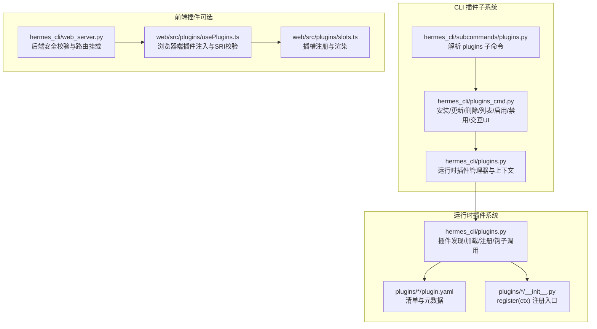
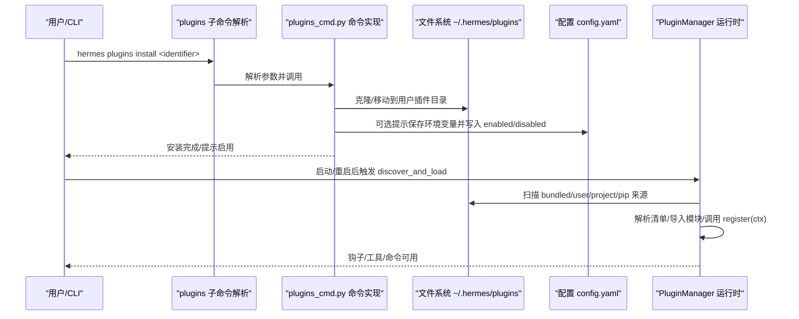
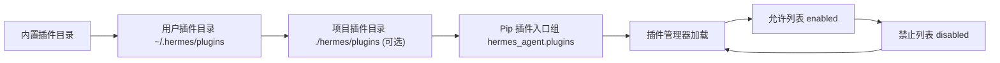

# 插件管理

<cite>
**本文引用的文件**
- [plugins.py](file://hermes_cli/plugins.py)
- [plugins_cmd.py](file://hermes_cli/plugins_cmd.py)
- [subcommands/plugins.py](file://hermes_cli/subcommands/plugins.py)
- [plugin_utils.py](file://plugins/plugin_utils.py)
- [plugins/disk-cleanup/plugin.yaml](file://plugins/disk-cleanup/plugin.yaml)
- [plugins/security-guidance/plugin.yaml](file://plugins/security-guidance/plugin.yaml)
- [plugins/disk-cleanup/__init__.py](file://plugins/disk-cleanup/__init__.py)
- [plugins/security-guidance/__init__.py](file://plugins/security-guidance/__init__.py)
- [web/src/plugins/usePlugins.ts](file://web/src/plugins/usePlugins.ts)
- [web/src/plugins/slots.ts](file://web/src/plugins/slots.ts)
- [hermes_cli/web_server.py](file://hermes_cli/web_server.py)
- [hermes_cli/config.py](file://hermes_cli/config.py)
- [tests/plugins/test_security_guidance_plugin.py](file://tests/plugins/test_security_guidance_plugin.py)
</cite>

## 目录
1. [简介](#简介)
2. [项目结构](#项目结构)
3. [核心组件](#核心组件)
4. [架构总览](#架构总览)
5. [详细组件分析](#详细组件分析)
6. [依赖分析](#依赖分析)
7. [性能考虑](#性能考虑)
8. [故障排除指南](#故障排除指南)
9. [结论](#结论)
10. [附录：CLI 命令参考](#附录cli-命令参考)

## 简介
本文件系统性阐述 Hermes 的插件管理能力，覆盖安装、卸载、启用与禁用等生命周期管理；配置与发现机制；依赖解析与冲突处理；状态监控与健康检查；更新与版本兼容、回滚策略；CLI 命令参考；批量与自动化管理；权限与安全策略；以及故障排除与性能优化建议。内容基于仓库中的插件系统实现与示例插件进行归纳总结。

## 项目结构
插件管理由两部分组成：
- CLI 插件子系统：负责插件的安装、更新、删除、列表、启用/禁用、交互式批量管理等。
- 运行时插件系统：负责插件发现、加载、注册钩子与工具、中间件、命令等，并在运行期调用。

图表来源
- [subcommands/plugins.py:12-95](file://hermes_cli/subcommands/plugins.py#L12-L95)
- [plugins_cmd.py:1-1836](file://hermes_cli/plugins_cmd.py#L1-L1836)
- [plugins.py:1-2047](file://hermes_cli/plugins.py#L1-L2047)
- [usePlugins.ts:71-133](file://web/src/plugins/usePlugins.ts#L71-L133)
- [slots.ts:96-199](file://web/src/plugins/slots.ts#L96-L199)
- [web_server.py:11506-11529](file://hermes_cli/web_server.py#L11506-L11529)

章节来源
- [plugins.py:1-2047](file://hermes_cli/plugins.py#L1-L2047)
- [plugins_cmd.py:1-1836](file://hermes_cli/plugins_cmd.py#L1-L1836)
- [subcommands/plugins.py:12-95](file://hermes_cli/subcommands/plugins.py#L12-L95)
- [usePlugins.ts:71-133](file://web/src/plugins/usePlugins.ts#L71-L133)
- [slots.ts:96-199](file://web/src/plugins/slots.ts#L96-L199)
- [web_server.py:11506-11529](file://hermes_cli/web_server.py#L11506-L11529)

## 核心组件
- 插件清单与元数据：每个目录型插件需包含清单文件与模块入口函数，清单用于声明名称、版本、作者、所需环境变量、提供的工具与钩子等。
- 插件上下文（PluginContext）：向插件暴露注册接口，如注册工具、钩子、中间件、命令、平台适配器等。
- 插件管理器（PluginManager）：负责扫描、加载、实例化插件模块，调用其注册函数，维护已加载插件状态与错误信息。
- CLI 插件命令：提供 install、update、remove、list、enable、disable、toggle 等子命令及交互式批量管理界面。
- 并发与线程安全：提供懒加载单例与线程安全的缓存槽，避免多线程竞争导致的资源泄漏或重复初始化。

章节来源
- [plugins.py:235-284](file://hermes_cli/plugins.py#L235-L284)
- [plugins.py:290-799](file://hermes_cli/plugins.py#L290-L799)
- [plugins.py:1218-1599](file://hermes_cli/plugins.py#L1218-L1599)
- [plugins_cmd.py:549-835](file://hermes_cli/plugins_cmd.py#L549-L835)
- [plugin_utils.py:43-136](file://plugins/plugin_utils.py#L43-L136)

## 架构总览
插件系统采用“清单驱动 + 模块入口 + 运行时注册”的模式。CLI 负责安装与配置，运行时负责发现与加载。支持多种来源与覆盖规则，确保用户与项目插件优先于内置插件生效。

图表来源
- [subcommands/plugins.py:12-95](file://hermes_cli/subcommands/plugins.py#L12-L95)
- [plugins_cmd.py:549-633](file://hermes_cli/plugins_cmd.py#L549-L633)
- [plugins.py:1218-1599](file://hermes_cli/plugins.py#L1218-L1599)

## 详细组件分析

### 插件清单与元数据
- 清单字段：名称、版本、描述、作者、所需环境变量、提供的工具与钩子、插件类别（kind）、注册键（key）等。
- 示例清单：磁盘清理与安全指导插件均提供清单文件，声明钩子与用途。
- 注册键（key）：扁平插件为名称，嵌套类目插件为“目录名/子名”，用于去重与允许列表匹配。

章节来源
- [plugins.py:235-270](file://hermes_cli/plugins.py#L235-L270)
- [plugins/disk-cleanup/plugin.yaml:1-8](file://plugins/disk-cleanup/plugin.yaml#L1-L8)
- [plugins/security-guidance/plugin.yaml:1-8](file://plugins/security-guidance/plugin.yaml#L1-L8)

### 插件上下文（PluginContext）
- 工具注册：支持覆盖内置工具，提供异步与同步工具注册。
- 钩子与中间件：注册生命周期钩子与中间件回调。
- 命令注册：注册 CLI 子命令与会话内斜杠命令。
- 提供者注册：图像生成、视频生成、网页搜索、浏览器、TTS、转写等提供者注册。
- LLM 访问：以受控方式访问宿主模型能力，通过配置门控。

章节来源
- [plugins.py:290-799](file://hermes_cli/plugins.py#L290-L799)

### 插件管理器（PluginManager）
- 发现与加载：按来源顺序扫描，支持 bundled、user、project、pip 四类来源，后到者覆盖前者同名项。
- 允许/禁止列表：根据配置决定是否加载；显式禁止优先级最高。
- 注册阶段：记录注册前后指标，统计工具、钩子、中间件、命令数量。
- 错误处理：捕获加载异常并记录，不影响其他插件。
- 钩子与中间件调用：隔离回调异常，保证核心循环稳定。

章节来源
- [plugins.py:1218-1599](file://hermes_cli/plugins.py#L1218-L1599)
- [plugins.py:1658-1724](file://hermes_cli/plugins.py#L1658-L1724)

### CLI 插件命令
- 安装：支持 Git URL 或简写，自动克隆至用户插件目录，解析清单版本，必要时复制 .example 配置文件，提示设置环境变量，可选择安装即启用。
- 更新：对已安装 Git 插件执行拉取更新，复制新增 .example 文件。
- 删除：移除插件目录。
- 列表：支持过滤显示已启用/仅用户/隐藏内置/纯文本/JSON 输出。
- 启用/禁用：写入配置的允许/禁止集合，区分规范键与裸名。
- 交互式批量：Curses/文本界面，支持勾选启用/禁用与提供者类别切换。

章节来源
- [plugins_cmd.py:549-835](file://hermes_cli/plugins_cmd.py#L549-L835)
- [plugins_cmd.py:950-1014](file://hermes_cli/plugins_cmd.py#L950-L1014)
- [plugins_cmd.py:1183-1498](file://hermes_cli/plugins_cmd.py#L1183-L1498)
- [subcommands/plugins.py:12-95](file://hermes_cli/subcommands/plugins.py#L12-L95)

### 并发与线程安全
- 提供懒加载单例装饰器与带参单例槽，避免多线程竞争导致的重复初始化与资源泄漏。
- 在多线程代理会话共享同一进程的场景下，保障插件单例的安全性。

章节来源
- [plugin_utils.py:43-136](file://plugins/plugin_utils.py#L43-L136)

### 浏览器端插件（可选）
- 插件注入：通过脚本动态注入，支持 SRI 完整性校验，防止中间人替换。
- 插槽系统：插件注册组件到命名插槽，前端按序渲染，支持热重载行为一致。
- 后端安全：校验插件清单中的相对路径，拒绝绝对路径与越界路径，避免 RCE。

章节来源
- [usePlugins.ts:71-133](file://web/src/plugins/usePlugins.ts#L71-L133)
- [slots.ts:96-199](file://web/src/plugins/slots.ts#L96-L199)
- [web_server.py:11506-11529](file://hermes_cli/web_server.py#L11506-L11529)

### 示例插件：磁盘清理与安全指导
- 磁盘清理：通过钩子自动跟踪临时文件并在会话结束时快速清理；提供斜杠命令手动查看状态与清理。
- 安全指导：在写文件前或结果中扫描危险模式，非阻断模式下追加安全提醒；阻断模式下直接拒绝写入。

章节来源
- [plugins/disk-cleanup/__init__.py:128-190](file://plugins/disk-cleanup/__init__.py#L128-L190)
- [plugins/disk-cleanup/__init__.py:195-303](file://plugins/disk-cleanup/__init__.py#L195-L303)
- [plugins/security-guidance/__init__.py:202-255](file://plugins/security-guidance/__init__.py#L202-L255)

## 依赖分析
- 插件来源与覆盖顺序：内置 < 用户Git < 项目插件 < Pip 插件；同名后者覆盖前者。
- 允许/禁止列表：允许列表为空表示默认不加载任何插件；禁止列表优先级最高。
- 提供者插件：内存提供者、上下文引擎等类别插件有独立发现路径，不参与通用加载流程。
- 前端插件：仅在启用相应功能时加载，且受后端安全校验保护。

图表来源
- [plugins.py:1218-1240](file://hermes_cli/plugins.py#L1218-L1240)
- [plugins_cmd.py:692-743](file://hermes_cli/plugins_cmd.py#L692-L743)

章节来源
- [plugins.py:1218-1240](file://hermes_cli/plugins.py#L1218-L1240)
- [plugins_cmd.py:692-743](file://hermes_cli/plugins_cmd.py#L692-L743)

## 性能考虑
- 插件加载隔离：每个插件回调独立 try/except，避免单个插件异常拖慢主循环。
- 钩子与中间件调用：按需调用，返回值收集后统一处理，减少额外开销。
- 并发安全：懒加载单例避免重复初始化成本，降低锁竞争。
- 前端插件：SRI 校验与路径校验在加载阶段完成，避免运行期额外验证成本。

## 故障排除指南
- 插件未加载
  - 检查是否在允许列表中；确认键名与清单 key 匹配。
  - 查看日志中错误信息，定位 register 函数或模块导入问题。
- 安装失败
  - Git 不可用或超时；检查网络与 Git 可用性。
  - 清单版本过高，需要升级 Hermes。
- 环境变量缺失
  - 安装时会提示缺失的环境变量，按提示补齐并重试。
- 前端插件无法加载
  - 检查 SRI 完整性与脚本加载错误；确认后端未拒绝不安全路径。
- 单元测试验证
  - 安全指导插件可在启用后被正确发现与加载，可作为回归测试参考。

章节来源
- [plugins.py:1598-1634](file://hermes_cli/plugins.py#L1598-L1634)
- [plugins_cmd.py:448-547](file://hermes_cli/plugins_cmd.py#L448-L547)
- [tests/plugins/test_security_guidance_plugin.py:318-332](file://tests/plugins/test_security_guidance_plugin.py#L318-L332)

## 结论
Hermes 插件系统以清单与模块入口为核心，结合 CLI 与运行时双层管理，实现了灵活、可控、可扩展的插件生态。通过允许/禁止列表、覆盖规则、并发安全与前端安全校验，既保证了易用性，也兼顾了安全性与稳定性。建议在生产环境中配合严格的清单版本与环境变量管理，定期更新插件并监控其健康状态。

## 附录：CLI 命令参考

- hermes plugins install
  - 语法：hermes plugins install IDENTIFIER [--force] [--enable | --no-enable]
  - 参数：
    - IDENTIFIER：Git URL 或 owner/repo 简写，可带子目录
    - --force：强制重新安装
    - --enable：安装后自动启用
    - --no-enable：安装后保持禁用
  - 行为：克隆到 ~/.hermes/plugins，解析清单版本，复制 .example 文件，提示设置环境变量，可选择立即启用。
  - 示例：hermes plugins install anpicasso/hermes-plugin-chrome-profiles

- hermes plugins update
  - 语法：hermes plugins update NAME
  - 行为：对已安装的 Git 插件执行拉取更新，复制新增 .example 文件

- hermes plugins remove / rm / uninstall
  - 语法：hermes plugins remove NAME
  - 行为：删除指定插件目录

- hermes plugins list / ls
  - 语法：hermes plugins list [--enabled] [--user] [--no-bundled] [--plain] [--json]
  - 行为：列出所有插件，支持过滤与输出格式

- hermes plugins enable
  - 语法：hermes plugins enable NAME
  - 行为：将插件加入允许列表，移出禁止列表

- hermes plugins disable
  - 语法：hermes plugins disable NAME
  - 行为：从允许列表移除，加入禁止列表

- hermes plugins（交互式批量）
  - 语法：hermes plugins
  - 行为：Curses/文本界面勾选启用/禁用，支持提供者类别切换

章节来源
- [subcommands/plugins.py:12-95](file://hermes_cli/subcommands/plugins.py#L12-L95)
- [plugins_cmd.py:549-835](file://hermes_cli/plugins_cmd.py#L549-L835)
- [plugins_cmd.py:950-1014](file://hermes_cli/plugins_cmd.py#L950-L1014)
- [plugins_cmd.py:1183-1498](file://hermes_cli/plugins_cmd.py#L1183-L1498)