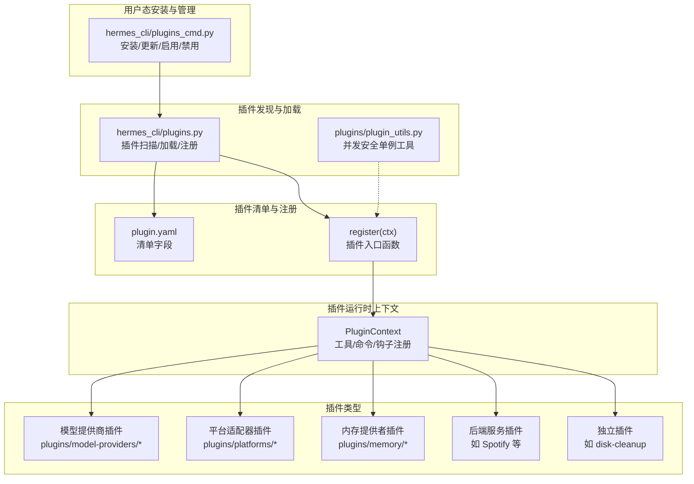
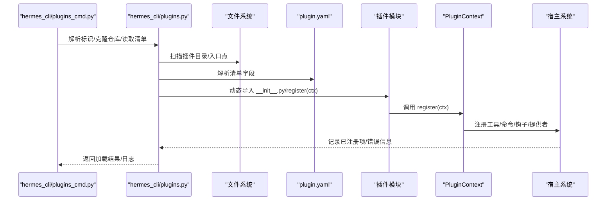
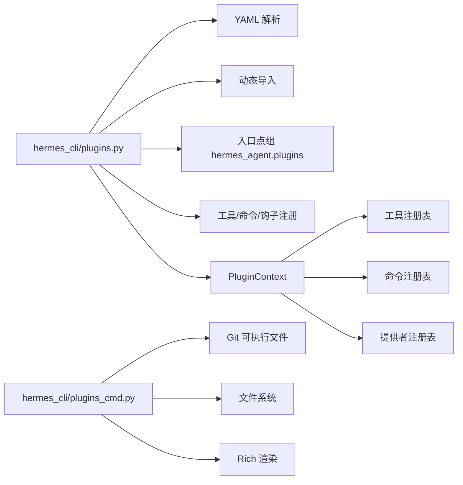

# 插件系统

<cite>
**本文引用的文件**
- [plugins/__init__.py](file://plugins/__init__.py)
- [plugins/plugin_utils.py](file://plugins/plugin_utils.py)
- [hermes_cli/plugins.py](file://hermes_cli/plugins.py)
- [hermes_cli/plugins_cmd.py](file://hermes_cli/plugins_cmd.py)
- [plugins/memory/__init__.py](file://plugins/memory/__init__.py)
- [plugins/model-providers/README.md](file://plugins/model-providers/README.md)
- [plugins/platforms/discord/__init__.py](file://plugins/platforms/discord/__init__.py)
- [optional-mcps/linear/manifest.yaml](file://optional-mcps/linear/manifest.yaml)
- [plugins/disk-cleanup/plugin.yaml](file://plugins/disk-cleanup/plugin.yaml)
- [plugins/disk-cleanup/__init__.py](file://plugins/disk-cleanup/__init__.py)
- [plugins/spotify/plugin.yaml](file://plugins/spotify/plugin.yaml)
- [plugins/spotify/__init__.py](file://plugins/spotify/__init__.py)
- [plugins/teams_pipeline/plugin.yaml](file://plugins/teams_pipeline/plugin.yaml)
</cite>

## 目录
1. [简介](#简介)
2. [项目结构](#项目结构)
3. [核心组件](#核心组件)
4. [架构总览](#架构总览)
5. [详细组件分析](#详细组件分析)
6. [依赖分析](#依赖分析)
7. [性能考虑](#性能考虑)
8. [故障排查指南](#故障排查指南)
9. [结论](#结论)
10. [附录](#附录)

## 简介
本文件系统性阐述 Hermes 插件体系的设计与实现，覆盖插件发现、加载、注册、生命周期与钩子、工具与命令注册、上下文与权限、并发安全、配置与环境变量、以及发布与质量保障流程。文档同时给出不同插件类型的开发规范（模型提供商、平台适配器、内存提供者、后端服务等），并通过多个真实示例展示插件的强大扩展能力。

## 项目结构
插件系统由“插件发现与加载”“插件清单与注册”“插件运行时上下文”“插件命令与工具注册”“插件生命周期钩子”“并发与线程安全”“用户态安装与管理”等模块组成。核心入口位于 CLI 的插件子系统，并通过统一的插件清单与注册接口对接到工具、平台、记忆体、媒体生成等子系统。

图示来源
- [hermes_cli/plugins.py:1-200](file://hermes_cli/plugins.py#L1-L200)
- [plugins/plugin_utils.py:1-136](file://plugins/plugin_utils.py#L1-L136)
- [hermes_cli/plugins_cmd.py:1-200](file://hermes_cli/plugins_cmd.py#L1-L200)

章节来源
- [hermes_cli/plugins.py:1-200](file://hermes_cli/plugins.py#L1-L200)
- [hermes_cli/plugins_cmd.py:1-200](file://hermes_cli/plugins_cmd.py#L1-L200)

## 核心组件
- 插件发现与加载：支持四类来源（内置、用户、项目、pip 入口点），按优先级合并，名称冲突后者覆盖前者；每个目录需包含清单与注册入口。
- 插件清单（plugin.yaml）：声明名称、版本、描述、作者、所需环境变量、提供的工具/钩子、种类（standalone/backend/exclusive/platform/model-provider）、注册键等。
- 插件运行时上下文（PluginContext）：向插件暴露工具注册、命令注册、消息注入、LLM 调用门面、各类提供者注册（图像生成、视频生成、网页搜索、浏览器、TTS、转录、平台适配器等）。
- 生命周期钩子（VALID_HOOKS）：覆盖工具调用前后、LLM 调用前后、API 请求前后/错误、会话开始/结束/最终化/重置、子代理启动/停止、预网关分发、审批请求/响应等。
- 并发与线程安全：提供懒加载单例装饰器与线程安全槽位，避免多线程竞争导致的资源泄漏与重复初始化。
- 用户态安装与管理：支持 Git 源安装、更新、移除、启用/禁用、环境变量提示与保存、安装后说明渲染。

章节来源
- [hermes_cli/plugins.py:128-170](file://hermes_cli/plugins.py#L128-L170)
- [hermes_cli/plugins.py:232-284](file://hermes_cli/plugins.py#L232-L284)
- [hermes_cli/plugins.py:290-790](file://hermes_cli/plugins.py#L290-L790)
- [plugins/plugin_utils.py:43-136](file://plugins/plugin_utils.py#L43-L136)
- [hermes_cli/plugins_cmd.py:29-136](file://hermes_cli/plugins_cmd.py#L29-L136)

## 架构总览
下图展示了从 CLI 到插件加载、注册与运行的整体流程，以及插件与各子系统的交互。

图示来源
- [hermes_cli/plugins_cmd.py:448-547](file://hermes_cli/plugins_cmd.py#L448-L547)
- [hermes_cli/plugins.py:55-120](file://hermes_cli/plugins.py#L55-L120)
- [hermes_cli/plugins.py:290-790](file://hermes_cli/plugins.py#L290-L790)

## 详细组件分析

### 组件A：插件发现与加载（插件扫描、清单解析、动态导入）
- 发现路径与优先级：内置 plugins/、用户 $HERMES_HOME/plugins/、项目 .hermes/plugins/（可选）、pip 入口点组 hermes_agent.plugins。
- 清单字段：name/version/description/author/requires_env/provides_tools/provides_hooks/source/path/kind/key 等。
- 加载策略：要求目录包含 plugin.yaml 与 __init__.py，并提供 register(ctx) 函数；支持后缀名兼容（plugin.yml）。
- 冲突处理：名称冲突时后者覆盖前者；禁用列表与启用列表共同决定最终加载集合。
- 安全与校验：对 Git URL 进行解析与校验，防止路径穿越；对清单版本进行兼容性检查；对缺失环境变量进行提示与保存。

章节来源
- [hermes_cli/plugins.py:55-120](file://hermes_cli/plugins.py#L55-L120)
- [hermes_cli/plugins.py:232-284](file://hermes_cli/plugins.py#L232-L284)
- [hermes_cli/plugins_cmd.py:152-217](file://hermes_cli/plugins_cmd.py#L152-L217)
- [hermes_cli/plugins_cmd.py:262-275](file://hermes_cli/plugins_cmd.py#L262-L275)
- [hermes_cli/plugins_cmd.py:548-547](file://hermes_cli/plugins_cmd.py#L548-L547)

### 组件B：插件上下文与注册（PluginContext）
- 工具注册：register_tool(name, toolset, schema, handler, check_fn, requires_env, is_async, description, emoji, override)。
- 命令注册：register_cli_command(name, help, setup_fn, handler_fn, description)；register_command(name, handler, description, args_hint)。
- 钩子注册：register_hook(name, callback)；支持 VALID_HOOKS 中的全部钩子。
- 提供者注册：图像生成、视频生成、网页搜索、浏览器、TTS、转录、平台适配器等专用注册方法。
- LLM 访问门面：ctx.llm 提供受控的主机模型访问能力，基于配置进行能力收敛。
- 消息注入：inject_message(content, role) 支持从外部注入消息到会话。
- 工具调度：dispatch_tool(tool_name, args, **kwargs) 以父代理上下文执行工具。

章节来源
- [hermes_cli/plugins.py:290-790](file://hermes_cli/plugins.py#L290-L790)

### 组件C：生命周期钩子与事件流
- 钩子集合：pre_tool_call/post_tool_call、transform_terminal_output/transform_tool_result/transform_llm_output、pre_llm_call/post_llm_call、pre_api_request/post_api_request/api_request_error、on_session_start/on_session_end/on_session_finalize/on_session_reset、subagent_start/subagent_stop、pre_gateway_dispatch、pre_approval_request/post_approval_response。
- 触发时机：在工具调用前后、LLM 推理前后、API 请求前后、会话阶段、网关分发前、审批流程中触发。
- 数据交换：钩子回调接收关键字参数（如 event/gateway/session_store、command/description/pattern_key 等），返回值用于影响流程或转换输出。

章节来源
- [hermes_cli/plugins.py:128-170](file://hermes_cli/plugins.py#L128-L170)

### 组件D：并发与线程安全（懒加载单例）
- lazy_singleton：零参工厂的线程安全懒加载单例，采用双检锁模式，首次调用构建实例，后续复用；提供 reset() 便于测试清理。
- SingletonSlot：带参工厂的线程安全单例槽位，缓存首个成功构建的实例，忽略后续参数，遵循“首次配置即胜”的语义；提供 peek()/reset()。

章节来源
- [plugins/plugin_utils.py:43-136](file://plugins/plugin_utils.py#L43-L136)

### 组件E：用户态安装与管理（hermes plugins 子命令）
- 安装：支持 Git URL/短横线 owner/repo[/subdir]；自动克隆、子目录解析、清单版本检查、环境变量提示与保存、复制 .example 文件、显示安装后说明。
- 更新：拉取最新远程分支，复制新增 .example 文件。
- 移除：删除插件目录。
- 启用/禁用：写入配置中的 plugins.enabled/plugins.disabled；支持规范化插件键（含嵌套分类键）。

章节来源
- [hermes_cli/plugins_cmd.py:29-136](file://hermes_cli/plugins_cmd.py#L29-L136)
- [hermes_cli/plugins_cmd.py:448-800](file://hermes_cli/plugins_cmd.py#L448-L800)

### 组件F：插件类型与开发规范

#### 模型提供商插件（model-providers）
- 目录布局：plugins/model-providers/<provider>/__init__.py（注册 ProviderProfile）、plugin.yaml（清单）。
- 注册方式：在 __init__.py 中调用 providers.register_provider(profile)。
- 覆盖规则：用户插件覆盖内置同名插件；最后写入生效。
- 示例参考：README 提供了添加新提供商的步骤与字段说明。

章节来源
- [plugins/model-providers/README.md:17-71](file://plugins/model-providers/README.md#L17-L71)

#### 平台适配器插件（platforms）
- 目录布局：plugins/platforms/<name>/adapter.py（导出 register 或具体适配器类）、__init__.py（导出 register）。
- 注册方式：ctx.register_platform(name, label, adapter_factory, check_fn, ...)。
- 示例参考：plugins/platforms/discord/__init__.py 导出 register。

章节来源
- [hermes_cli/plugins.py:770-800](file://hermes_cli/plugins.py#L770-L800)
- [plugins/platforms/discord/__init__.py:1-4](file://plugins/platforms/discord/__init__.py#L1-L4)

#### 内存提供者插件（memory）
- 发现与加载：扫描 plugins/memory 与用户 $HERMES_HOME/plugins 下的提供者目录，仅允许一个激活提供者（由 config.yaml 的 memory.provider 指定）。
- 加载策略：支持 register(ctx) 模式或直接实例化 MemoryProvider 子类；为用户插件注册合成包以支持相对导入。
- CLI 命令：仅对当前激活的内存插件加载 CLI 注册（轻量扫描，仅导入 cli.py）。

章节来源
- [plugins/memory/__init__.py:1-200](file://plugins/memory/__init__.py#L1-L200)
- [plugins/memory/__init__.py:200-451](file://plugins/memory/__init__.py#L200-L451)

#### 后端服务插件（backend）
- 特征：kind: backend 的插件在启动时自动加载，无需用户显式启用。
- 示例：Spotify 插件（kind: backend）注册一组工具到 spotify 工具集，运行时通过 check_fn 进行可用性检查。

章节来源
- [plugins/spotify/plugin.yaml:1-14](file://plugins/spotify/plugin.yaml#L1-L14)
- [plugins/spotify/__init__.py:1-67](file://plugins/spotify/__init__.py#L1-L67)

#### 独立插件（standalone）
- 特征：默认类型，需通过 plugins.enabled 显式启用。
- 示例：disk-cleanup 插件（kind: standalone）通过钩子与命令实现会话期间的临时文件清理与手动管理。

章节来源
- [plugins/disk-cleanup/plugin.yaml:1-8](file://plugins/disk-cleanup/plugin.yaml#L1-L8)
- [plugins/disk-cleanup/__init__.py:1-317](file://plugins/disk-cleanup/__init__.py#L1-L317)

#### 平台插件（platform）
- 特征：网关消息平台适配器（如 IRC），内置平台插件默认自动加载，用户安装仍受 plugins.enabled 控制。
- 注册方式：ctx.register_platform(...)。

章节来源
- [hermes_cli/plugins.py:770-800](file://hermes_cli/plugins.py#L770-L800)

#### MCP（可选 MCPs）
- 特征：optional-mcps 目录下的 manifest.yaml 描述远程 MCP 服务器（如 Linear），通过 HTTP 传输与原生 OAuth 流程接入。
- 使用：安装后首次连接触发浏览器认证，重启会话后工具加载。

章节来源
- [optional-mcps/linear/manifest.yaml:1-39](file://optional-mcps/linear/manifest.yaml#L1-L39)

### 组件G：插件间通信与数据交换
- 钩子回调：通过关键字参数传递事件对象与上下文，返回值用于影响流程或转换输出。
- 工具注册：插件注册的工具与内置工具共享同一注册表，插件可通过 ctx.dispatch_tool 在运行时调用其他工具。
- 提供者注册：图像生成、视频生成、网页搜索、浏览器、TTS、转录等提供者通过专用注册接口接入对应路由。

章节来源
- [hermes_cli/plugins.py:470-500](file://hermes_cli/plugins.py#L470-L500)
- [hermes_cli/plugins.py:532-767](file://hermes_cli/plugins.py#L532-L767)

### 组件H：安全机制与权限控制
- 环境变量约束：requires_env 字段声明必需变量，安装时提示输入并保存至用户 .env；运行时通过 check_fn 对工具可用性进行门控。
- 权限收敛：ctx.llm 提供受控的主机模型访问，能力由配置收敛（fail-closed）。
- 路径与URL校验：安装时对 Git URL 与子目录进行解析与校验，防止路径穿越；不安全协议（http://、file://）安装时发出警告。
- 提供者命名冲突：内置提供者名称优先于插件注册，命令型提供者优先于插件注册（配置更本地）。

章节来源
- [hermes_cli/plugins_cmd.py:298-388](file://hermes_cli/plugins_cmd.py#L298-L388)
- [hermes_cli/plugins.py:300-317](file://hermes_cli/plugins.py#L300-L317)
- [hermes_cli/plugins.py:686-767](file://hermes_cli/plugins.py#L686-L767)

### 组件I：生命周期管理与依赖注入
- 生命周期：插件在加载后通过 register(ctx) 完成一次性注册；运行期通过钩子参与工具/会话/API/审批等事件。
- 依赖注入：PluginContext 将宿主能力（工具注册、命令注册、消息注入、LLM 访问、提供者注册）注入插件；插件通过 ctx.dispatch_tool 获取父代理上下文。
- 会话与中断：inject_message 可在空闲时作为下一条输入，在运行中作为中断注入。

章节来源
- [hermes_cli/plugins.py:290-500](file://hermes_cli/plugins.py#L290-L500)

### 组件J：配置机制与清单字段
- 清单字段：name/version/description/author/requires_env/provides_tools/provides_hooks/source/path/kind/key。
- 启用/禁用：plugins.enabled 与 plugins.disabled 共同决定加载集合；禁用列表优先于启用列表。
- 提供者键：kind 为 exclusive 的类别（如 memory）由其自身发现系统加载，通用扫描跳过。

章节来源
- [hermes_cli/plugins.py:232-284](file://hermes_cli/plugins.py#L232-L284)
- [hermes_cli/plugins.py:182-226](file://hermes_cli/plugins.py#L182-L226)

## 依赖分析
- 插件发现与加载依赖：文件系统扫描、YAML 解析、动态导入、入口点组。
- 插件上下文依赖：工具注册表、命令注册表、提供者注册表、会话上下文。
- 并发安全依赖：threading.Lock、functools.wraps、类型变量与泛型。
- 用户态安装依赖：Git 可执行文件解析、子进程调用、路径解析与校验、Rich 渲染。

图示来源
- [hermes_cli/plugins.py:67-71](file://hermes_cli/plugins.py#L67-L71)
- [hermes_cli/plugins.py:172-173](file://hermes_cli/plugins.py#L172-L173)
- [hermes_cli/plugins_cmd.py:29-62](file://hermes_cli/plugins_cmd.py#L29-L62)

章节来源
- [hermes_cli/plugins.py:67-71](file://hermes_cli/plugins.py#L67-L71)
- [hermes_cli/plugins_cmd.py:29-62](file://hermes_cli/plugins_cmd.py#L29-L62)

## 性能考虑
- 动态导入与延迟加载：插件模块仅在需要时导入，减少启动开销；提供者注册与 CLI 扫描采用轻量策略（仅导入 cli.py）。
- 并发安全：懒加载单例避免重复初始化与资源泄漏；锁粒度最小化，快速路径无锁。
- 钩子与中间件：钩子数量与复杂度直接影响调用链耗时；建议在钩子中避免阻塞操作，必要时异步化。
- 清单版本与兼容：安装器对清单版本进行上限检查，避免新特性破坏旧环境。

## 故障排查指南
- 插件未出现：检查是否满足“目录包含 plugin.yaml 与 __init__.py 且提供 register(ctx)”；确认名称未被禁用；查看调试日志（HERMES_PLUGINS_DEBUG=1）。
- 安装失败：确认 Git 可用与网络可达；检查 URL 是否为受支持方案；留意路径穿越与子目录解析错误。
- 环境变量缺失：安装时会提示缺失变量并保存至 .env；运行时 check_fn 应确保工具不可用。
- 并发问题：使用 lazy_singleton/SingletonSlot 避免竞态；测试中使用 reset() 清理状态。
- 提供者冲突：内置提供者名称优先；命令型提供者优先于插件注册。

章节来源
- [hermes_cli/plugins.py:89-122](file://hermes_cli/plugins.py#L89-L122)
- [hermes_cli/plugins_cmd.py:448-547](file://hermes_cli/plugins_cmd.py#L448-L547)
- [plugins/plugin_utils.py:43-136](file://plugins/plugin_utils.py#L43-L136)

## 结论
Hermes 插件系统通过清晰的发现与加载机制、完善的清单与注册接口、严格的并发与安全策略，以及灵活的生命周期钩子与提供者注册，实现了强大的可扩展能力。开发者可依据本文档的规范与示例，快速开发并发布高质量插件，覆盖模型提供商、平台适配器、内存提供者、后端服务与独立工具等场景。

## 附录

### 插件开发指南（摘要）
- 清单字段：name、version、description、author、requires_env、provides_tools、provides_hooks、kind、key。
- 注册入口：目录内提供 __init__.py 与 register(ctx)。
- 上下文能力：工具/命令/钩子/提供者/消息注入/LLM 访问。
- 并发安全：使用 lazy_singleton/SingletonSlot。
- 安装与发布：通过 hermes plugins 子命令安装/更新/启用/禁用；遵循清单版本兼容。

章节来源
- [hermes_cli/plugins.py:232-284](file://hermes_cli/plugins.py#L232-L284)
- [hermes_cli/plugins.py:290-790](file://hermes_cli/plugins.py#L290-L790)
- [plugins/plugin_utils.py:43-136](file://plugins/plugin_utils.py#L43-L136)
- [hermes_cli/plugins_cmd.py:448-800](file://hermes_cli/plugins_cmd.py#L448-L800)