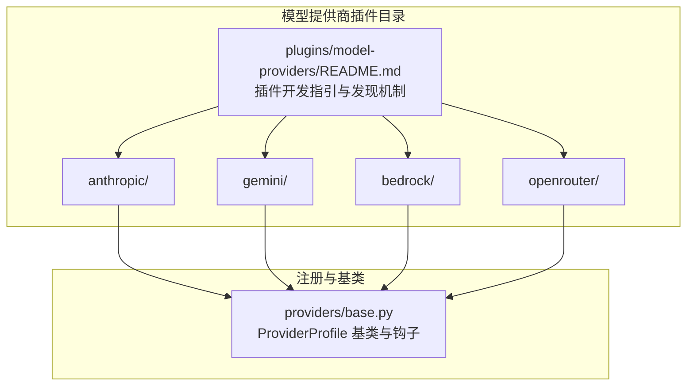
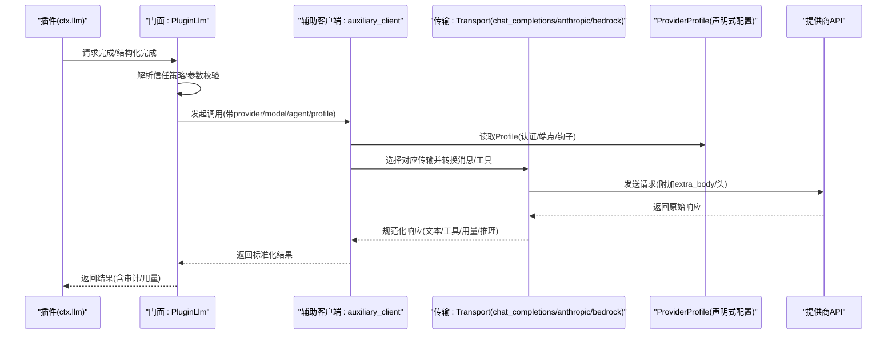
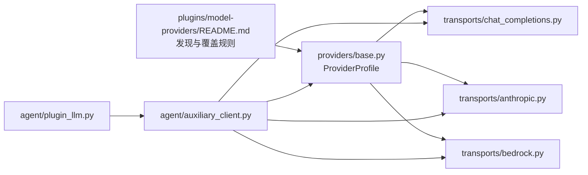

# 模型提供商插件

<cite>
**本文引用的文件**
- [plugins/model-providers/README.md](file://plugins/model-providers/README.md)
- [plugins/model-providers/anthropic/__init__.py](file://plugins/model-providers/anthropic/__init__.py)
- [plugins/model-providers/anthropic/plugin.yaml](file://plugins/model-providers/anthropic/plugin.yaml)
- [plugins/model-providers/gemini/__init__.py](file://plugins/model-providers/gemini/__init__.py)
- [plugins/model-providers/gemini/plugin.yaml](file://plugins/model-providers/gemini/plugin.yaml)
- [plugins/model-providers/bedrock/__init__.py](file://plugins/model-providers/bedrock/__init__.py)
- [plugins/model-providers/bedrock/plugin.yaml](file://plugins/model-providers/bedrock/plugin.yaml)
- [plugins/model-providers/openrouter/__init__.py](file://plugins/model-providers/openrouter/__init__.py)
- [plugins/model-providers/openrouter/plugin.yaml](file://plugins/model-providers/openrouter/plugin.yaml)
- [providers/base.py](file://providers/base.py)
- [agent/plugin_llm.py](file://agent/plugin_llm.py)
- [agent/auxiliary_client.py](file://agent/auxiliary_client.py)
- [agent/transports/chat_completions.py](file://agent/transports/chat_completions.py)
- [agent/transports/anthropic.py](file://agent/transports/anthropic.py)
- [agent/transports/bedrock.py](file://agent/transports/bedrock.py)
</cite>

## 目录
1. [简介](#简介)
2. [项目结构](#项目结构)
3. [核心组件](#核心组件)
4. [架构总览](#架构总览)
5. [详细组件分析](#详细组件分析)
6. [依赖分析](#依赖分析)
7. [性能考虑](#性能考虑)
8. [故障排查指南](#故障排查指南)
9. [结论](#结论)
10. [附录](#附录)

## 简介
本文件面向希望为 Hermes Agent 开发“模型提供商插件”的开发者，系统性说明如何基于统一的 ProviderProfile 声明式配置与传输层（Transports）对接多家主流 AI 提供商：Anthropic、OpenAI 兼容生态、Google Gemini、AWS Bedrock 等。文档覆盖以下主题：
- 插件目录结构与发现机制
- ProviderProfile 的声明式配置与钩子扩展点
- 认证类型与环境变量约定
- API 调用封装与消息格式转换
- 各提供商的特性差异与限制
- 错误处理、重试与超时控制
- 结构化输出与 JSON Schema 校验
- 性能优化与最佳实践
- 测试与调试方法

## 项目结构
模型提供商插件采用“自包含子目录 + 注册清单”的组织方式，每个子目录代表一个 ProviderProfile，并通过 __init__.py 中的注册函数向全局注册表注入。

图表来源
- [plugins/model-providers/README.md:1-71](file://plugins/model-providers/README.md#L1-L71)
- [providers/base.py:38-218](file://providers/base.py#L38-L218)

章节来源
- [plugins/model-providers/README.md:1-71](file://plugins/model-providers/README.md#L1-L71)

## 核心组件
- ProviderProfile（声明式配置）
  - 定义提供商名称、别名、显示名、描述、注册链接、环境变量、基础 URL、模型列表端点、认证类型、视觉支持、默认辅助模型等。
  - 提供钩子：prepare_messages、build_extra_body、build_api_kwargs_extras、get_max_tokens、fetch_models。
- 传输层（Transports）
  - 将 OpenAI 风格的消息与工具定义转换为各提供商原生格式；构建请求参数；规范化响应。
  - 包含通用 chat_completions 传输与特定提供商的专用传输（如 Anthropic、Bedrock）。
- 插件侧 LLM 访问门面（PluginLlm）
  - 为受信任插件提供安全可控的 LLM 调用入口，支持同步/异步、结构化输出、JSON Schema 校验、使用量统计与审计信息。
- 辅助客户端（Auxiliary Client）
  - 维护自动检测与回退链路（主提供商 → OpenRouter → 其他），在余额耗尽等场景触发自动切换。

章节来源
- [providers/base.py:38-218](file://providers/base.py#L38-L218)
- [agent/transports/chat_completions.py:118-200](file://agent/transports/chat_completions.py#L118-L200)
- [agent/transports/anthropic.py:13-200](file://agent/transports/anthropic.py#L13-L200)
- [agent/transports/bedrock.py:15-155](file://agent/transports/bedrock.py#L15-L155)
- [agent/plugin_llm.py:598-800](file://agent/plugin_llm.py#L598-L800)
- [agent/auxiliary_client.py:1-200](file://agent/auxiliary_client.py#L1-L200)

## 架构总览
下图展示从插件发起调用到最终返回标准化结果的整体流程，以及各提供商适配的关键节点。

图表来源
- [agent/plugin_llm.py:598-800](file://agent/plugin_llm.py#L598-L800)
- [agent/auxiliary_client.py:1-200](file://agent/auxiliary_client.py#L1-L200)
- [agent/transports/chat_completions.py:118-200](file://agent/transports/chat_completions.py#L118-L200)
- [agent/transports/anthropic.py:13-200](file://agent/transports/anthropic.py#L13-L200)
- [agent/transports/bedrock.py:15-155](file://agent/transports/bedrock.py#L15-L155)
- [providers/base.py:38-218](file://providers/base.py#L38-L218)

## 详细组件分析

### ProviderProfile 基类与钩子
- 关键字段
  - 名称与别名：用于在配置与路由中识别提供商。
  - 显示元数据：展示名、描述、注册链接。
  - 认证与端点：环境变量、基础 URL、模型端点、默认头、健康检查开关。
  - 视觉支持：是否支持多模态输入（用户消息与工具消息）。
  - 模型目录：回退模型列表、主机名派生逻辑。
  - 客户端级与请求级特性：默认头、固定温度、默认最大输出长度、辅助模型。
- 钩子方法
  - prepare_messages：消息预处理（如角色交换、字段清理）。
  - build_extra_body：组装额外请求体字段（如推理配置、会话标识）。
  - build_api_kwargs_extras：将推理配置拆分到 extra_body 与顶层参数（适配不同提供商差异）。
  - get_max_tokens：按模型设置默认最大输出长度。
  - fetch_models：拉取可用模型列表（可覆盖以适配特殊认证或路径）。

章节来源
- [providers/base.py:38-218](file://providers/base.py#L38-L218)

### 传输层（Transports）
- chat_completions 传输
  - 默认 api_mode，适用于大多数 OpenAI 兼容提供商。
  - 负责消息与工具的 OpenAI 风格转换；对严格网关进行字段剥离；构建推理配置（如 Gemini thinking_config）。
- anthropic 传输
  - 将 OpenAI 风格消息转换为 Anthropic Messages API 的 (system, messages) 形式；工具 schema 转换为 input_schema；构建 kwargs 并规范化响应（含思考块与工具调用）。
- bedrock 传输
  - 将消息与工具转换为 Bedrock Converse 格式；构建 boto3 调用参数；规范化响应（支持原始 dict 与已归一化对象）。

章节来源
- [agent/transports/chat_completions.py:118-200](file://agent/transports/chat_completions.py#L118-L200)
- [agent/transports/anthropic.py:13-200](file://agent/transports/anthropic.py#L13-L200)
- [agent/transports/bedrock.py:15-155](file://agent/transports/bedrock.py#L15-L155)

### 插件侧 LLM 访问门面（PluginLlm）
- 功能
  - 同步/异步 completion 与结构化输出（支持 JSON Mode 与 JSON Schema 校验）。
  - 参数校验与信任策略：允许的提供商/模型白名单、代理身份与配置覆盖。
  - 输入归一化：文本与图像输入的统一表示；结构化消息构建。
  - 输出解析：提取文本、用量、解析 JSON；审计信息记录。
- 使用建议
  - 对于需要结构化输出的插件，优先使用 complete_structured 并提供 schema。
  - 在插件配置中明确允许的覆盖项，避免越权访问。

章节来源
- [agent/plugin_llm.py:598-800](file://agent/plugin_llm.py#L598-L800)

### 辅助客户端（自动检测与回退）
- 自动检测链（文本任务）：主提供商 → OpenRouter → Nous Portal → 自定义端点 → 原生 Anthropic → 直连 API Key 提供商。
- 视觉任务链：主提供商（若支持）→ OpenRouter → Nous Portal → 原生 Anthropic → 本地视觉模型。
- 回退策略：当返回 HTTP 402 或信用相关错误时，自动切换到下一个可用提供商。
- 用途：为上下文压缩、会话检索、视觉分析、浏览器视觉等辅助任务提供统一后端。

章节来源
- [agent/auxiliary_client.py:1-200](file://agent/auxiliary_client.py#L1-L200)

### 各提供商插件实现要点

#### Anthropic（原生）
- 特性
  - 使用 x-api-key 头而非 Bearer 认证。
  - api_mode 为 anthropic_messages。
  - 支持多模态与思考块签名，传输层负责保留与重放顺序。
- 实现注意
  - fetch_models 需要显式 API Key 与版本头。
  - 若使用 OAuth（如 claude-code），需在 Profile 中正确标注。

章节来源
- [plugins/model-providers/anthropic/__init__.py:13-54](file://plugins/model-providers/anthropic/__init__.py#L13-L54)
- [plugins/model-providers/anthropic/plugin.yaml:1-6](file://plugins/model-providers/anthropic/plugin.yaml#L1-L6)
- [agent/transports/anthropic.py:13-200](file://agent/transports/anthropic.py#L13-L200)

#### Google Gemini（API Key 与 OAuth）
- 特性
  - 两个 Profile：gemini（API Key）、google-gemini-cli（OAuth）。
  - 通过 build_extra_body 将 reasoning_config 翻译为 thinking_config，兼容 OpenAI 兼容路径与原生路径。
- 实现注意
  - OpenAI 兼容 base_url 需要将 thinking_config 字段转为 snake_case 子树。
  - 非 Gemini 模型应避免发送 thinking_config，以免被严格网关拒绝。

章节来源
- [plugins/model-providers/gemini/__init__.py:19-73](file://plugins/model-providers/gemini/__init__.py#L19-L73)
- [plugins/model-providers/gemini/plugin.yaml:1-6](file://plugins/model-providers/gemini/plugin.yaml#L1-L6)
- [agent/transports/chat_completions.py:22-100](file://agent/transports/chat_completions.py#L22-L100)

#### AWS Bedrock
- 特性
  - 无 REST /v1/models 端点，需通过 AWS SDK 获取模型列表。
  - api_mode 为 bedrock_converse，使用 boto3 客户端。
- 实现注意
  - fetch_models 返回 None，交由 AWS SDK 处理。
  - 传输层构建 converse 参数并携带区域与 guardrail 配置。

章节来源
- [plugins/model-providers/bedrock/__init__.py:7-31](file://plugins/model-providers/bedrock/__init__.py#L7-L31)
- [plugins/model-providers/bedrock/plugin.yaml:1-6](file://plugins/model-providers/bedrock/plugin.yaml#L1-L6)
- [agent/transports/bedrock.py:15-155](file://agent/transports/bedrock.py#L15-L155)

#### OpenRouter（聚合器）
- 特性
  - 提供公共模型目录，无需认证即可拉取。
  - 支持 provider preferences 与会话级路由（如 Pareto Code）。
  - 对推理配置进行差异化处理：对 Claude 4.6+ 及未来命名模型，避免发送 reasoning 字段，改用 verbosity 映射。
- 实现注意
  - 对 xAI Grok 会话需附加 x-grok-conv-id 头以保持提示缓存一致。
  - 缓存公共模型目录结果，减少重复请求。

章节来源
- [plugins/model-providers/openrouter/__init__.py:47-189](file://plugins/model-providers/openrouter/__init__.py#L47-L189)
- [plugins/model-providers/openrouter/plugin.yaml:1-6](file://plugins/model-providers/openrouter/plugin.yaml#L1-L6)

## 依赖分析
- 插件发现与注册
  - 插件目录扫描与注册由 providers 模块负责，首次调用 get_provider_profile()/list_providers() 时执行。
  - 用户自定义插件可覆盖内置同名插件（后写入者胜）。
- 传输层与 ProviderProfile 的耦合
  - 传输层通过 ProviderProfile 的钩子与元数据决定消息转换与请求构造策略。
- 插件 LLM 与辅助客户端
  - PluginLlm 仅暴露受控 API，内部委托 auxiliary_client 完成实际调用与回退。
  - auxiliary_client 决定主/备提供商链路与错误回退。

图表来源
- [plugins/model-providers/README.md:17-27](file://plugins/model-providers/README.md#L17-L27)
- [providers/base.py:38-218](file://providers/base.py#L38-L218)
- [agent/plugin_llm.py:598-800](file://agent/plugin_llm.py#L598-L800)
- [agent/auxiliary_client.py:1-200](file://agent/auxiliary_client.py#L1-L200)
- [agent/transports/chat_completions.py:118-200](file://agent/transports/chat_completions.py#L118-L200)
- [agent/transports/anthropic.py:13-200](file://agent/transports/anthropic.py#L13-L200)
- [agent/transports/bedrock.py:15-155](file://agent/transports/bedrock.py#L15-L155)

章节来源
- [plugins/model-providers/README.md:17-27](file://plugins/model-providers/README.md#L17-L27)

## 性能考虑
- 模型目录缓存
  - OpenRouter 的公共目录应缓存，避免频繁请求。
- 请求体最小化
  - 严格网关会拒绝未知字段，传输层会剥离多余字段；确保只传递必要参数。
- 温度与输出长度
  - 使用 ProviderProfile 的默认最大输出长度与固定温度策略，减少无效往返。
- 异步与并发
  - 插件可使用异步版本的 LLM 调用，避免阻塞事件循环。
- 用量统计
  - 通过标准化响应收集 token 使用情况，便于成本控制与预算告警。

## 故障排查指南
- 认证失败
  - 检查环境变量是否正确设置；确认 ProviderProfile.env_vars 与认证类型匹配。
- 400/422 错误
  - 严格网关可能拒绝未知字段；确认传输层已剥离多余字段（如 extra_content、tool_name、内部前缀键）。
- 402 余额不足
  - auxiliary_client 会在该情况下自动回退到下一个可用提供商；可在配置中调整辅助任务的提供商选择。
- 推理配置不生效
  - 对于 Claude 4.6+ 等模型，避免发送 reasoning 字段；改用 verbosity 映射。
- Gemini thinking_config 不生效
  - 非 Gemini 模型不应携带 thinking_config；OpenAI 兼容路径需将键名转为 snake_case。

章节来源
- [agent/transports/chat_completions.py:128-200](file://agent/transports/chat_completions.py#L128-L200)
- [agent/transports/anthropic.py:80-193](file://agent/transports/anthropic.py#L80-L193)
- [agent/transports/bedrock.py:67-133](file://agent/transports/bedrock.py#L67-L133)
- [agent/auxiliary_client.py:36-41](file://agent/auxiliary_client.py#L36-L41)

## 结论
通过 ProviderProfile 的声明式配置与传输层的解耦设计，Hermes Agent 能够以最小改动接入多家提供商，并在插件侧提供统一、安全且可控的 LLM 调用体验。遵循本文档的开发规范与最佳实践，可快速实现稳定、高性能的模型提供商插件。

## 附录

### 开发步骤（新增提供商）
- 创建目录与清单
  - 在 plugins/model-providers/<your_provider>/ 下创建 __init__.py 与 plugin.yaml。
  - 在 __init__.py 中实例化 ProviderProfile 并调用 register_provider。
- 配置认证与端点
  - 设置 env_vars、base_url、auth_type、models_url（如有）。
- 扩展钩子（如需）
  - 如有特殊认证头、推理配置映射或模型目录拉取逻辑，重写相应钩子。
- 测试与验证
  - 使用插件 LLM 门面进行结构化输出与 JSON Schema 校验测试。
  - 在严格网关环境下验证字段剥离与兼容性。

章节来源
- [plugins/model-providers/README.md:28-71](file://plugins/model-providers/README.md#L28-L71)