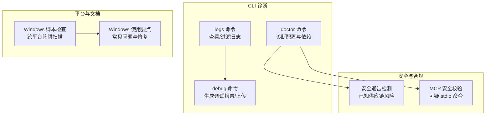
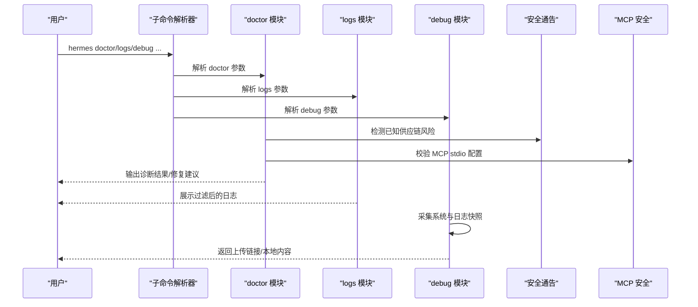
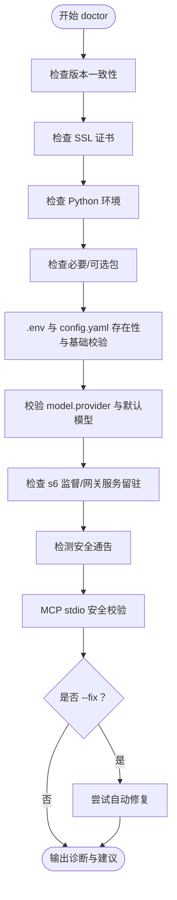
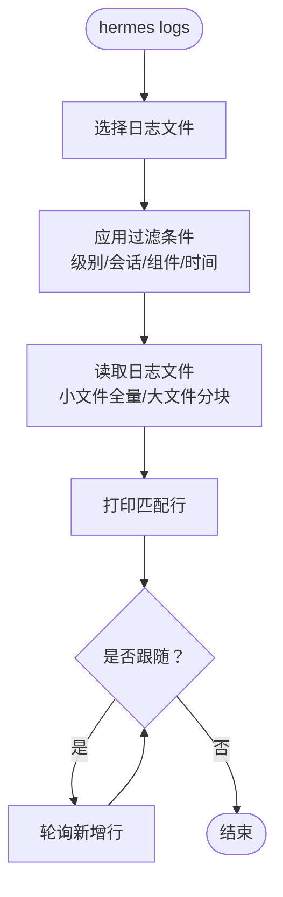
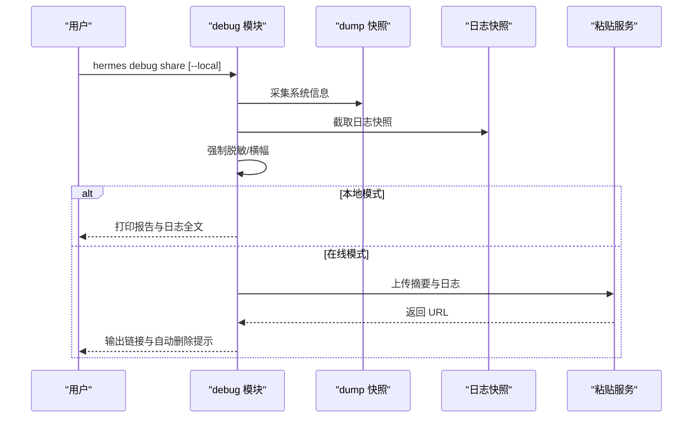
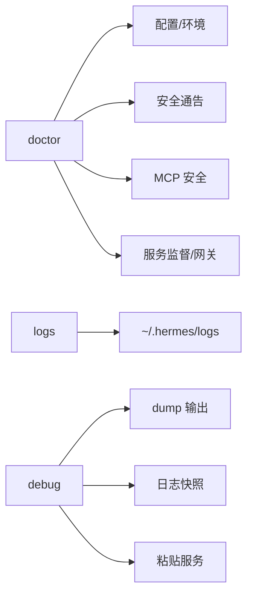

# 故障排除与常见问题

<cite>
**本文档引用的文件**
- [hermes_cli/doctor.py](file://hermes_cli/doctor.py)
- [hermes_cli/logs.py](file://hermes_cli/logs.py)
- [hermes_cli/debug.py](file://hermes_cli/debug.py)
- [hermes_cli/subcommands/doctor.py](file://hermes_cli/subcommands/doctor.py)
- [hermes_cli/subcommands/logs.py](file://hermes_cli/subcommands/logs.py)
- [hermes_cli/security_advisories.py](file://hermes_cli/security_advisories.py)
- [hermes_cli/mcp_security.py](file://hermes_cli/mcp_security.py)
- [agent/errors.py](file://agent/errors.py)
- [SECURITY.md](file://SECURITY.md)
- [scripts/check-windows-footguns.py](file://scripts/check-windows-footguns.py)
- [website/docs/user-guide/windows-native.md](file://website/docs/user-guide/windows-native.md)
- [hermes_cli/kanban_diagnostics.py](file://hermes_cli/kanban_diagnostics.py)
</cite>

## 目录
1. [简介](#简介)
2. [项目结构](#项目结构)
3. [核心组件](#核心组件)
4. [架构总览](#架构总览)
5. [详细组件分析](#详细组件分析)
6. [依赖分析](#依赖分析)
7. [性能考虑](#性能考虑)
8. [故障排除指南](#故障排除指南)
9. [结论](#结论)
10. [附录](#附录)

## 简介
本文件面向使用 Hermes Agent 的用户与运维人员，系统化整理安装、配置、功能异常等常见问题及解决方案；提供 doctor、日志分析、调试分享等诊断工具的使用方法；给出错误与安全通告的解读与处置步骤；覆盖 Windows、Linux、macOS、WSL2 等平台的特殊注意事项；并提供社区支持渠道、预防性维护建议与问题反馈流程，帮助快速定位与解决问题。

## 项目结构
围绕“诊断与排错”的关键模块分布如下：
- 诊断命令与子命令解析：doctor、logs、debug 子命令及其参数解析器
- 日志查看与过滤：按级别、会话、组件、时间段筛选
- 安全通告与 MCP 安全校验：自动检测已知供应链风险与可疑 MCP 配置
- 平台特定脚本与文档：Windows 跨平台陷阱扫描与平台使用要点
- 安全策略与披露：官方安全政策与披露流程

**图表来源**
- [hermes_cli/doctor.py:465-830](file://hermes_cli/doctor.py#L465-L830)
- [hermes_cli/logs.py:1-395](file://hermes_cli/logs.py#L1-L395)
- [hermes_cli/debug.py:587-830](file://hermes_cli/debug.py#L587-L830)
- [hermes_cli/security_advisories.py:1-454](file://hermes_cli/security_advisories.py#L1-L454)
- [hermes_cli/mcp_security.py:1-97](file://hermes_cli/mcp_security.py#L1-L97)
- [scripts/check-windows-footguns.py:1-633](file://scripts/check-windows-footguns.py#L1-L633)
- [website/docs/user-guide/windows-native.md:305-315](file://website/docs/user-guide/windows-native.md#L305-L315)

**章节来源**
- [hermes_cli/doctor.py:465-830](file://hermes_cli/doctor.py#L465-L830)
- [hermes_cli/logs.py:1-395](file://hermes_cli/logs.py#L1-L395)
- [hermes_cli/debug.py:587-830](file://hermes_cli/debug.py#L587-L830)
- [hermes_cli/security_advisories.py:1-454](file://hermes_cli/security_advisories.py#L1-L454)
- [hermes_cli/mcp_security.py:1-97](file://hermes_cli/mcp_security.py#L1-L97)
- [scripts/check-windows-footguns.py:1-633](file://scripts/check-windows-footguns.py#L1-L633)
- [website/docs/user-guide/windows-native.md:305-315](file://website/docs/user-guide/windows-native.md#L305-L315)

## 核心组件
- doctor 命令：检查版本一致性、证书、Python 环境、必要包、配置文件、模型提供方、服务监督、网关服务留驻等，并可自动修复部分问题
- logs 命令：查看 agent、errors、gateway、gui、desktop 等日志，支持尾随输出、按级别/会话/组件/时间段过滤
- debug 命令：生成系统信息与日志快照，上传至公共粘贴服务，支持隐私横幅与自动删除
- 安全通告：检测已知供应链风险包，支持 ack 消除启动横幅
- MCP 安全：检测可疑 MCP stdio 命令（含网络外发与导出特征）

**章节来源**
- [hermes_cli/doctor.py:465-830](file://hermes_cli/doctor.py#L465-L830)
- [hermes_cli/logs.py:1-395](file://hermes_cli/logs.py#L1-L395)
- [hermes_cli/debug.py:587-830](file://hermes_cli/debug.py#L587-L830)
- [hermes_cli/security_advisories.py:1-454](file://hermes_cli/security_advisories.py#L1-L454)
- [hermes_cli/mcp_security.py:1-97](file://hermes_cli/mcp_security.py#L1-L97)

## 架构总览
下图展示诊断与排错链路：CLI 子命令解析器将请求路由到对应模块；doctor 综合多项检查；logs 提供日志视图；debug 收集系统与日志并上传；安全模块在 doctor 与启动路径中协同工作。

**图表来源**
- [hermes_cli/subcommands/doctor.py:12-36](file://hermes_cli/subcommands/doctor.py#L12-L36)
- [hermes_cli/subcommands/logs.py:13-79](file://hermes_cli/subcommands/logs.py#L13-L79)
- [hermes_cli/doctor.py:465-830](file://hermes_cli/doctor.py#L465-L830)
- [hermes_cli/logs.py:142-395](file://hermes_cli/logs.py#L142-L395)
- [hermes_cli/debug.py:587-830](file://hermes_cli/debug.py#L587-L830)
- [hermes_cli/security_advisories.py:167-189](file://hermes_cli/security_advisories.py#L167-L189)
- [hermes_cli/mcp_security.py:64-97](file://hermes_cli/mcp_security.py#L64-L97)

## 详细组件分析

### doctor 诊断命令
- 功能要点
  - 版本一致性检查：pyproject.toml 与模块版本是否一致
  - SSL 证书：CA bundle 可加载性
  - Python 环境：版本要求、虚拟环境状态
  - 必要/可选包：SDK、UI、配置、调度、消息平台等
  - 配置文件：~/.hermes/.env 与 config.yaml 存在性与基本校验
  - 模型提供方：provider 与默认模型配置合法性
  - 服务监督：容器内 s6 监督状态
  - 网关服务：systemd 用户留驻状态
  - 安全通告：显示未 ack 的已知风险
  - MCP 安全：可疑 stdio 命令检测
  - 可选自动修复：创建缺失 .env、收紧权限等

- 典型修复建议
  - Python 版本过低：升级至 3.10+
  - 缺少 .env：创建并设置权限为仅所有者可读
  - provider 配置错误：修正 model.provider 或使用 hermes config set
  - linger 未启用：sudo loginctl enable-linger $USER
  - 证书损坏：修复或替换 CA bundle

**图表来源**
- [hermes_cli/doctor.py:233-830](file://hermes_cli/doctor.py#L233-L830)

**章节来源**
- [hermes_cli/doctor.py:233-830](file://hermes_cli/doctor.py#L233-L830)
- [hermes_cli/security_advisories.py:167-189](file://hermes_cli/security_advisories.py#L167-L189)
- [hermes_cli/mcp_security.py:64-97](file://hermes_cli/mcp_security.py#L64-L97)

### logs 日志查看与过滤
- 支持的日志文件：agent、errors、gateway、gui、desktop
- 过滤能力：级别（DEBUG/INFO/WARNING/ERROR/CRITICAL）、会话 ID、组件前缀、相对时间范围
- 行为：默认显示最近若干行，支持实时跟随；大文件采用分块读取策略

- 使用建议
  - 定位错误：hermes logs errors --level ERROR
  - 定位会话：hermes logs --session <ID>
  - 定位组件：hermes logs --component tools
  - 时间窗口：hermes logs --since 1h

**图表来源**
- [hermes_cli/logs.py:142-395](file://hermes_cli/logs.py#L142-L395)

**章节来源**
- [hermes_cli/logs.py:1-395](file://hermes_cli/logs.py#L1-L395)

### debug 调试报告与上传
- 功能要点
  - 采集系统信息（hermes dump）
  - 截取日志快照（agent、errors、gateway、desktop）
  - 强制脱敏（强制红化敏感信息与邮箱）
  - 上传到 paste.rs 或 dpaste.com，支持自动删除
  - 本地模式：仅输出报告，不联网

- 隐私与安全
  - 默认强制脱敏，横幅提示
  - paste.rs 支持无认证删除
  - 自动记录到期时间并清理

**图表来源**
- [hermes_cli/debug.py:587-830](file://hermes_cli/debug.py#L587-L830)

**章节来源**
- [hermes_cli/debug.py:587-830](file://hermes_cli/debug.py#L587-L830)

### 安全通告与 MCP 安全
- 安全通告
  - 检测已知供应链风险包（如特定版本的 mistralai）
  - 支持 ack 消除启动横幅
  - 启动横幅缓存，避免频繁打扰

- MCP 安全
  - 检测 shell 解释器直接执行且包含网络外发与导出特征的命令
  - 对可疑条目给出警告与修复建议

**章节来源**
- [hermes_cli/security_advisories.py:1-454](file://hermes_cli/security_advisories.py#L1-L454)
- [hermes_cli/mcp_security.py:1-97](file://hermes_cli/mcp_security.py#L1-L97)

### 平台特定问题与修复
- Windows
  - 浏览器工具启动超时：Chromium 未安装，使用 doctor 指引安装命令
  - Node 版本冲突：PATH 中旧版 Node 优先，调整 PATH 或移除系统安装
  - UTF-8 显示问号：检查环境变量与控制台主机，推荐使用 Windows Terminal
  - Telegram 发送图片报错：路径转义问题，确保传递经 Hermes 规范化的路径

- 跨平台陷阱（通用）
  - 文本文件 open() 未指定 encoding=，默认编码差异导致乱码
  - os.kill(pid, 0) 在 Windows 上行为异常，应使用进程库替代
  - 信号常量与系统调用在 Windows 上不存在，需平台分支或降级

**章节来源**
- [website/docs/user-guide/windows-native.md:305-315](file://website/docs/user-guide/windows-native.md#L305-L315)
- [scripts/check-windows-footguns.py:138-327](file://scripts/check-windows-footguns.py#L138-L327)

## 依赖分析
- doctor 依赖
  - 配置与环境：读取 hermes_home、.env、config.yaml
  - 安全模块：安全通告检测、MCP 安全校验
  - 服务管理：容器 s6 监督、systemd 留驻状态
  - SSL：证书有效性检查

- logs 依赖
  - hermes_home 下的日志目录结构
  - 组件前缀映射（来自日志模块内部常量）

- debug 依赖
  - dump 模块输出
  - 日志快照采集与脱敏
  - 粘贴服务 API（paste.rs、dpaste.com）

**图表来源**
- [hermes_cli/doctor.py:1-830](file://hermes_cli/doctor.py#L1-L830)
- [hermes_cli/logs.py:1-395](file://hermes_cli/logs.py#L1-L395)
- [hermes_cli/debug.py:587-830](file://hermes_cli/debug.py#L587-L830)

**章节来源**
- [hermes_cli/doctor.py:1-830](file://hermes_cli/doctor.py#L1-L830)
- [hermes_cli/logs.py:1-395](file://hermes_cli/logs.py#L1-L395)
- [hermes_cli/debug.py:587-830](file://hermes_cli/debug.py#L587-L830)

## 性能考虑
- 日志读取优化：大文件采用分块读取与二进制拼接，减少内存占用
- 过滤效率：在读取阶段即进行多维过滤，避免后续处理开销
- 诊断幂等：doctor 多次运行成本低，适合自动化巡检
- 上传策略：限制单文件最大字节数，避免超时与带宽压力

[本节为通用指导，无需特定文件分析]

## 故障排除指南

### 一、安装与环境问题
- 症状：Python 版本过低
  - 排查：doctor 检查 Python 版本
  - 修复：升级至 3.10+，推荐 3.11+

- 症状：缺少 .env 或配置文件
  - 排查：doctor 检查 ~/.hermes/.env 与 config.yaml
  - 修复：使用 hermes setup 初始化；doctor --fix 可创建空文件并设置权限

- 症状：必要包缺失
  - 排查：doctor 检查 openai、rich、dotenv、yaml、httpx 等
  - 修复：根据提示安装相应包

- 症状：证书无效
  - 排查：doctor 检查 SSL CA bundle
  - 修复：修复或替换 CA bundle；避免使用不受信任的代理

**章节来源**
- [hermes_cli/doctor.py:584-683](file://hermes_cli/doctor.py#L584-L683)
- [agent/errors.py:1-4](file://agent/errors.py#L1-L4)

### 二、配置错误
- 症状：model.provider 配置错误
  - 排查：doctor 校验 provider 与默认模型
  - 修复：hermes config set model.provider <有效提供方>

- 症状：未配置 API 密钥
  - 排查：doctor 检查 .env 是否包含 provider 相关环境变量
  - 修复：hermes setup 或手动补充密钥

- 症状：MCP 配置可疑
  - 排查：doctor 检测 MCP stdio 命令
  - 修复：移除或修改可疑命令，避免内联脚本触发网络外发

**章节来源**
- [hermes_cli/doctor.py:684-830](file://hermes_cli/doctor.py#L684-L830)
- [hermes_cli/mcp_security.py:64-97](file://hermes_cli/mcp_security.py#L64-L97)

### 三、功能异常与日志分析
- 症状：功能无响应或报错
  - 步骤：使用 hermes logs errors 定位错误级别日志
  - 进一步：按会话 ID 或组件过滤缩小范围

- 症状：性能抖动或卡顿
  - 步骤：使用 hermes logs --since 1h --level WARNING 查看近期告警
  - 建议：结合 debug share 上传报告，定位瓶颈

**章节来源**
- [hermes_cli/logs.py:142-395](file://hermes_cli/logs.py#L142-L395)
- [hermes_cli/debug.py:587-830](file://hermes_cli/debug.py#L587-L830)

### 四、平台与环境特殊问题
- Windows
  - 浏览器工具超时：按 doctor 提示安装 Chromium
  - Node 冲突：调整 PATH 或移除系统 Node
  - UTF-8 显示异常：检查环境变量与控制台，改用 Windows Terminal
  - Telegram 图片发送失败：确保传入经规范化路径

- 跨平台陷阱
  - 文本文件读写未指定 encoding=，导致乱码
  - 使用 os.kill(pid, 0) 或 os.setsid 等 POSIX 特性，需平台分支

**章节来源**
- [website/docs/user-guide/windows-native.md:305-315](file://website/docs/user-guide/windows-native.md#L305-L315)
- [scripts/check-windows-footguns.py:138-327](file://scripts/check-windows-footguns.py#L138-L327)

### 五、安全与合规
- 已知供应链风险
  - 现象：启动横幅或 doctor 报告提示
  - 处理：按 remediation 步骤卸载风险包并轮换凭证；hermes doctor --ack <ID> 消除横幅

- MCP 安全
  - 现象：doctor 警告可疑 stdio 命令
  - 处理：移除或重写命令，避免内联脚本触发网络外发

**章节来源**
- [hermes_cli/security_advisories.py:95-129](file://hermes_cli/security_advisories.py#L95-L129)
- [hermes_cli/mcp_security.py:64-97](file://hermes_cli/mcp_security.py#L64-L97)

### 六、错误代码与含义
- SSLConfigurationError
  - 含义：SSL/TLS 证书配置失败
  - 处理：修复 CA bundle 或更换受信路径

- 建议优先检查
  - doctor 的 SSL 证书检查项
  - 网络代理与证书链完整性

**章节来源**
- [agent/errors.py:1-4](file://agent/errors.py#L1-L4)
- [hermes_cli/doctor.py:309-324](file://hermes_cli/doctor.py#L309-L324)

### 七、系统化问题排查流程
- 快速自检
  - 运行 hermes doctor，按建议修复
  - 使用 hermes logs 初筛错误级别日志

- 深入分析
  - 使用 hermes logs --session/--component/--since 精确过滤
  - 生成并上传 debug 报告，便于远程协助

- 预防措施
  - 定期运行 doctor
  - 关注安全通告并及时 ack
  - 避免在 MCP 配置中使用可疑命令

**章节来源**
- [hermes_cli/doctor.py:465-830](file://hermes_cli/doctor.py#L465-L830)
- [hermes_cli/logs.py:142-395](file://hermes_cli/logs.py#L142-L395)
- [hermes_cli/debug.py:587-830](file://hermes_cli/debug.py#L587-L830)
- [hermes_cli/security_advisories.py:406-454](file://hermes_cli/security_advisories.py#L406-L454)

### 八、社区支持与问题反馈
- 官方安全披露
  - 私有渠道：GitHub Security Advisories 或邮件
  - 不公开漏洞细节，遵循协调披露窗口

- 获取帮助
  - 官方文档与用户指南
  - 社区论坛与技术支持（按项目指引）

- 问题反馈
  - 提供环境信息（版本、OS、Python 版本）
  - 复现步骤与 doctor/logs/debug 输出
  - 安全相关问题请勿公开

**章节来源**
- [SECURITY.md:7-332](file://SECURITY.md#L7-L332)

## 结论
通过 doctor、logs、debug 三大工具与安全通告/MCP 安全机制，Hermes Agent 提供了从“快速自检—深入分析—协作定位—预防维护”的闭环排错体系。配合平台特定检查与安全策略，用户可在多平台上稳定运行并高效定位问题。

## 附录

### A. 常用命令速查
- hermes doctor [--fix] [--ack <ID>]
- hermes logs [agent|errors|gateway|gui|desktop] [-n/--lines] [-f/--follow] [--level] [--session] [--since] [--component]
- hermes debug share [--lines N] [--expire D] [--no-redact] [--local]

**章节来源**
- [hermes_cli/subcommands/doctor.py:12-36](file://hermes_cli/subcommands/doctor.py#L12-L36)
- [hermes_cli/subcommands/logs.py:13-79](file://hermes_cli/subcommands/logs.py#L13-L79)
- [hermes_cli/debug.py:694-795](file://hermes_cli/debug.py#L694-L795)

### B. 平台与环境注意事项
- Windows：浏览器工具、Node 版本、UTF-8 控制台、Telegram 路径
- 跨平台：文本文件编码、POSIX 特性与信号处理

**章节来源**
- [website/docs/user-guide/windows-native.md:305-315](file://website/docs/user-guide/windows-native.md#L305-L315)
- [scripts/check-windows-footguns.py:138-327](file://scripts/check-windows-footguns.py#L138-L327)