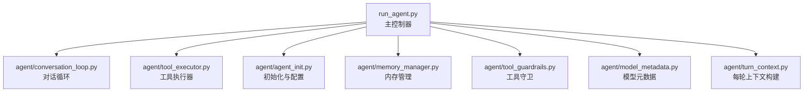
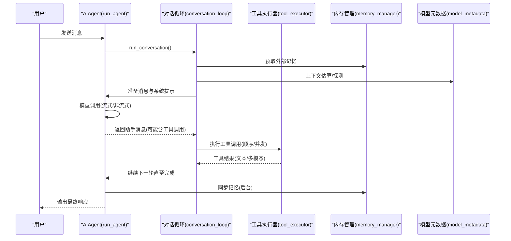
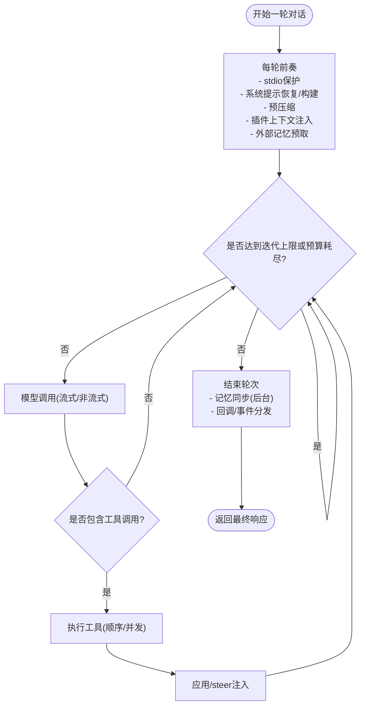
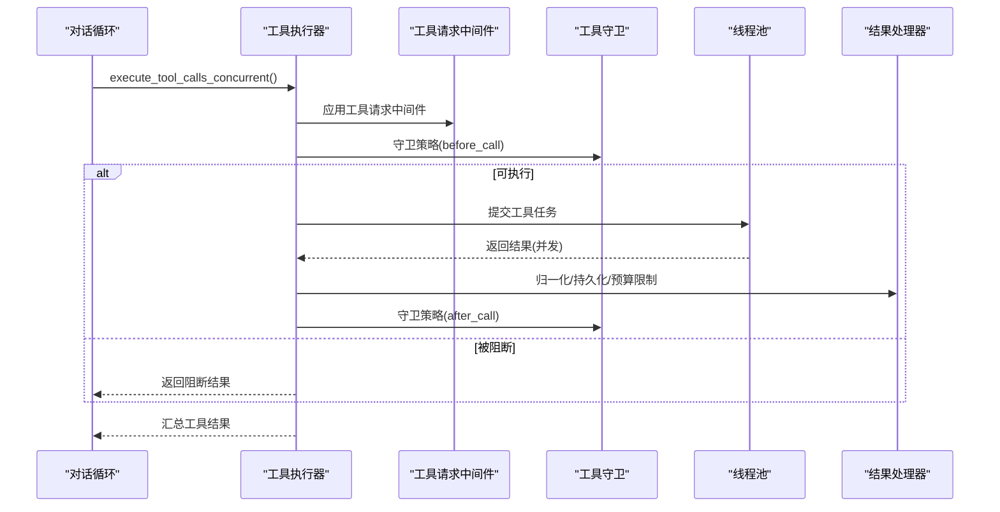
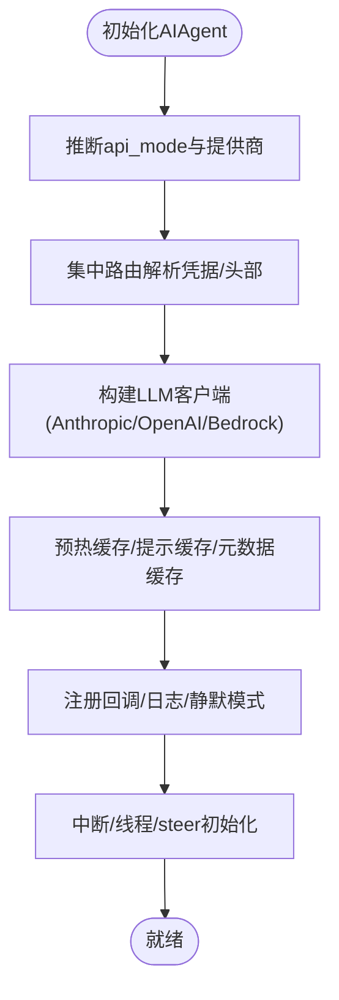
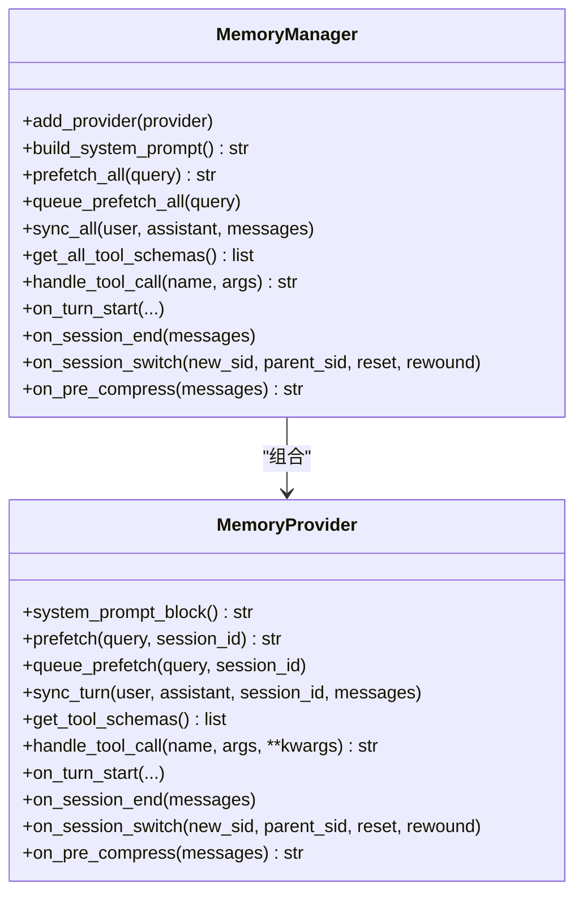
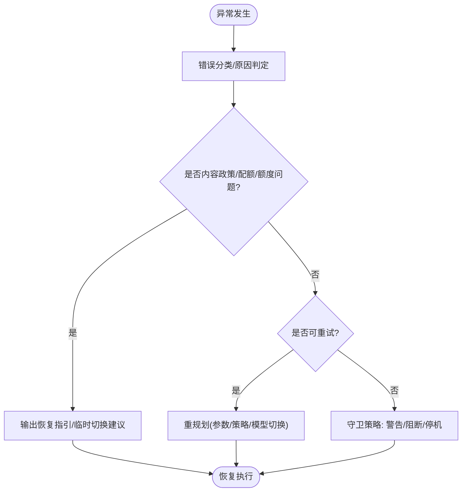
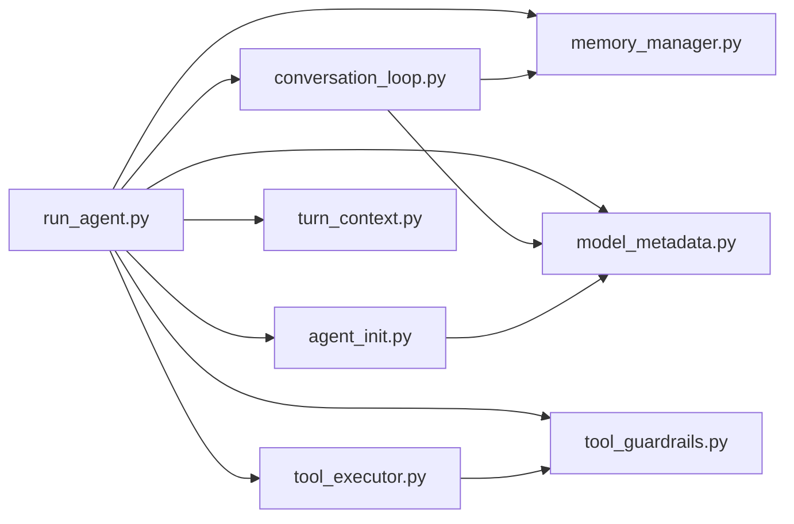

# AI代理架构

<cite>
**本文档引用的文件**
- [run_agent.py](file://run_agent.py)
- [agent/conversation_loop.py](file://agent/conversation_loop.py)
- [agent/tool_executor.py](file://agent/tool_executor.py)
- [agent/agent_init.py](file://agent/agent_init.py)
- [agent/memory_manager.py](file://agent/memory_manager.py)
- [agent/tool_guardrails.py](file://agent/tool_guardrails.py)
- [agent/model_metadata.py](file://agent/model_metadata.py)
- [agent/turn_context.py](file://agent/turn_context.py)
</cite>

## 目录
1. [引言](#引言)
2. [项目结构](#项目结构)
3. [核心组件](#核心组件)
4. [架构总览](#架构总览)
5. [详细组件分析](#详细组件分析)
6. [依赖分析](#依赖分析)
7. [性能考虑](#性能考虑)
8. [故障排除指南](#故障排除指南)
9. [结论](#结论)

## 引言
本文件系统性解析Hermes Agent的AI代理架构设计，重点阐释AIAgent类的核心理念与实现：对话循环机制、工具调用循环、错误处理与恢复策略、初始化流程、配置管理、会话状态维护，以及与多模型提供商的交互方式（含多模型切换与负载均衡）。文档同时给出生命周期管理、回调机制与事件处理的实现细节，并通过多种Mermaid图示帮助读者快速把握系统内部工作机制。

## 项目结构
Hermes Agent将原本超过3600行的run_agent主控制器拆分为多个职责单一的模块：
- 运行时控制与对话循环：agent/conversation_loop.py
- 工具执行器：agent/tool_executor.py
- 初始化与配置：agent/agent_init.py
- 内存管理：agent/memory_manager.py
- 工具守卫（防环/限流）：agent/tool_guardrails.py
- 模型元数据与上下文估算：agent/model_metadata.py
- 每轮上下文构建：agent/turn_context.py

图表来源
- [run_agent.py](file://run_agent.py)
- [agent/conversation_loop.py](file://agent/conversation_loop.py)
- [agent/tool_executor.py](file://agent/tool_executor.py)
- [agent/agent_init.py](file://agent/agent_init.py)
- [agent/memory_manager.py](file://agent/memory_manager.py)
- [agent/tool_guardrails.py](file://agent/tool_guardrails.py)
- [agent/model_metadata.py](file://agent/model_metadata.py)
- [agent/turn_context.py](file://agent/turn_context.py)

章节来源
- [run_agent.py](file://run_agent.py)
- [agent/conversation_loop.py](file://agent/conversation_loop.py)
- [agent/tool_executor.py](file://agent/tool_executor.py)
- [agent/agent_init.py](file://agent/agent_init.py)
- [agent/memory_manager.py](file://agent/memory_manager.py)
- [agent/tool_guardrails.py](file://agent/tool_guardrails.py)
- [agent/model_metadata.py](file://agent/model_metadata.py)
- [agent/turn_context.py](file://agent/turn_context.py)

## 核心组件
- AIAgent主控制器：负责调度对话循环、工具执行、错误恢复、回调与事件分发。
- 对话循环run_conversation：单轮对话的完整生命周期，包含消息准备、模型调用、工具执行、重试与压缩、后处理钩子。
- 工具执行器：顺序或并发执行工具调用，支持中间件、守卫策略、结果持久化与目录提示注入。
- 初始化器init_agent：集中处理提供商路由、认证解析、超时设置、缓存策略、回调注册、线程与中断机制初始化。
- 内存管理器MemoryManager：统一接入内置与外部记忆提供者，支持预取、同步、后台写入与工具Schema注入。
- 工具守卫：检测重复失败、无进展调用，提供警告/阻断/停机决策，避免工具环路。
- 模型元数据：提供上下文长度探测、定价信息、默认上下文回退、本地端点识别与超时调整。
- 每轮上下文构建：标准化每轮开始前的准备工作，包括系统提示重建/复用、预压缩、插件上下文注入、外部记忆预取。

章节来源
- [run_agent.py](file://run_agent.py)
- [agent/conversation_loop.py](file://agent/conversation_loop.py)
- [agent/tool_executor.py](file://agent/tool_executor.py)
- [agent/agent_init.py](file://agent/agent_init.py)
- [agent/memory_manager.py](file://agent/memory_manager.py)
- [agent/tool_guardrails.py](file://agent/tool_guardrails.py)
- [agent/model_metadata.py](file://agent/model_metadata.py)
- [agent/turn_context.py](file://agent/turn_context.py)

## 架构总览
下图展示了AIAgent在一次完整对话中的关键交互路径：从初始化到每轮上下文构建、模型调用、工具执行、守卫策略、内存同步与回调通知。

图表来源
- [run_agent.py](file://run_agent.py)
- [agent/conversation_loop.py](file://agent/conversation_loop.py)
- [agent/tool_executor.py](file://agent/tool_executor.py)
- [agent/memory_manager.py](file://agent/memory_manager.py)
- [agent/model_metadata.py](file://agent/model_metadata.py)

## 详细组件分析

### AIAgent类与对话循环机制
- 单轮入口run_conversation：负责每轮开始的“前奏”（stdio保护、重试计数重置、系统提示恢复/构建、预压缩、插件钩子、外部记忆预取），然后进入迭代循环。
- 循环控制：基于最大迭代次数与全局迭代预算；在预算耗尽时允许一次“宽限期”请求以完成当前模型调用。
- 中断机制：支持用户中断（/stop）、/steer注入（在工具结果中追加说明）、线程级中断传播至工作线程。
- 流式回调：支持TTS等场景的增量文本回调，确保音频生成不滞后于响应完成。
- 压缩与恢复：当历史过长时进行预压缩，必要时在后续轮次中重建系统提示以保持前缀缓存命中。

图表来源
- [agent/conversation_loop.py](file://agent/conversation_loop.py)

章节来源
- [agent/conversation_loop.py](file://agent/conversation_loop.py)

### 工具调用循环与并发执行
- 并发策略：使用线程池并发执行多个工具调用，最多8个工作者；每个工作者独立跟踪中断信号，保证及时取消未开始的任务。
- 中间件与前置检查：在执行前应用工具请求中间件、预工具调用拦截、守卫策略评估；对破坏性命令与文件变更进行快照保护。
- 结果处理：支持多模态结果归一化、目录提示注入、结果持久化、转储预算限制、后处理回调与进度反馈。
- 错误与恢复：检测工具失败、记录文件变更结果、发出警告/阻断/停机决策；对用户中断进行优雅取消并上报终端后处理钩子。

图表来源
- [agent/tool_executor.py](file://agent/tool_executor.py)
- [agent/tool_guardrails.py](file://agent/tool_guardrails.py)

章节来源
- [agent/tool_executor.py](file://agent/tool_executor.py)
- [agent/tool_guardrails.py](file://agent/tool_guardrails.py)

### 初始化流程与配置管理
- 提供商自动检测与路由：根据base_url/provider推断api_mode（chat_completions/anthropic_messages/bedrock_converse/codex_responses），并在需要时升级到Responses API。
- 认证与客户端构建：集中路由解析凭据与头部，按提供商注入特定头（如OpenRouter、NVIDIA NIM、Copilot等），支持Azure/Entra ID令牌提供器。
- 缓存与性能：预热OpenRouter元数据缓存、启用Anthropic提示缓存（5m/1h TTL可配）、预热传输层缓存。
- 回调与日志：注册各类回调（工具进度/开始/完成、思考/推理、澄清、状态、事件等），配置文件日志与静默模式。
- 中断与线程：初始化中断位、工作线程集合、执行线程ID、/steer注入锁与队列。

图表来源
- [agent/agent_init.py](file://agent/agent_init.py)

章节来源
- [agent/agent_init.py](file://agent/agent_init.py)

### 会话状态维护与内存管理
- 系统提示缓存：每会话仅构建一次系统提示并复用，确保前缀缓存命中；若运行时模型/提供商变化则重建。
- 外部记忆预取与同步：每轮开始前预取上下文，完成后异步同步到各提供者；支持后台执行器串行化写入，避免竞态。
- 工具Schema注入：将外部记忆提供者的工具Schema注入到代理工具面，保留核心工具优先权。
- 生命周期钩子：on_turn_start/on_session_end/on_session_switch/on_pre_compress等，便于提供者适配不同阶段需求。

图表来源
- [agent/memory_manager.py](file://agent/memory_manager.py)

章节来源
- [agent/memory_manager.py](file://agent/memory_manager.py)

### 错误处理与恢复策略
- 工具守卫：检测重复失败、同一工具多次失败、无进展只读调用，提供警告/阻断/停机三态决策；支持硬停止阈值可配置。
- 模型错误分类：对内容政策拒绝、空响应、JSON解析失败、流中断等进行分类与恢复建议。
- 上下文与流式健壮性：Surrogate字符清理、角色交替修复、流式上下文/思考标记清洗、图像尺寸上限检测与降维建议。
- 信用/配额提示：针对账单/额度耗尽场景提供明确指引与临时切换方案。

图表来源
- [agent/conversation_loop.py](file://agent/conversation_loop.py)
- [agent/tool_guardrails.py](file://agent/tool_guardrails.py)

章节来源
- [agent/conversation_loop.py](file://agent/conversation_loop.py)
- [agent/tool_guardrails.py](file://agent/tool_guardrails.py)

### 与模型提供商交互与多模型切换
- 提供商识别：通过URL主机名映射与本地端点探测识别提供商，支持自定义端点与本地Ollama/LM Studio/vLLM/llama.cpp识别。
- 上下文长度与默认回退：内置默认上下文表、分层探测回退、最小上下文阈值校验；对低上下文模型给出明确提示。
- 推理与缓存：根据api_mode与提供商能力启用Anthropic提示缓存；对支持reasoning.effort的模型注入推理努力度。
- 负载均衡与排序：支持OpenRouter提供商白名单/黑名单/排序/参数要求，结合最小编码分数策略选择最优路由。

章节来源
- [agent/model_metadata.py](file://agent/model_metadata.py)
- [agent/agent_init.py](file://agent/agent_init.py)

### 生命周期管理、回调机制与事件处理
- 生命周期：初始化→每轮turn→结束/分支/重置→会话切换；每阶段触发相应钩子。
- 回调体系：工具进度/开始/完成、思考/推理、澄清、状态、事件、流增量、步骤回调等；均支持线程安全与错误隔离。
- 事件与状态：通过status_callback/status_callback/status_callback/status_callback/status_callback/status_callback/status_callback/status_callback/status_callback/status_callback/status_callback/status_callback/status_callback/status_callback/status_callback/status_callback/status_callback/status_callback/status_callback/status_callback/status_callback/status_callback/status_callback/status_callback/status_callback/status_callback/status_callback/status_callback/status_callback/status_callback/status_callback/status_callback/status_callback/status_callback/status_callback/status_callback/status_callback/status_callback/status_callback/status_callback/status_callback/status_callback/status_callback/status_callback/status_callback/status_callback/status_callback/status_callback/status_callback/status_callback/status_callback/status_callback/status_callback/status_callback/status_callback/status_callback/status_callback/status_callback/status_callback/status_callback/status_callback/status_callback/status_callback/status_callback/status_callback/status_callback/status_callback/status_callback/status_callback/status_callback/status_callback/status_callback/status_callback/status_callback/status_callback/status_callback/status_callback/status_callback/status_callback/status_callback/status_callback/status_callback/status_callback/status_callback/status_callback/status_callback/status_callback/status_callback/status_callback/status_callback/status_callback/status_callback/status_callback/status_callback/status_callback/status_callback/status_callback/status_callback/status_callback/status_callback/status_callback/status_callback/status_callback/status_callback/status_callback/status_callback/status_callback/status_callback/status_callback/status_callback/status_callback/status_callback/status_callback/status_callback/status_callback/status_callback/status_callback/status_callback/status_callback/status_callback/status_callback/status_callback/status_callback/status_callback/status_callback/status_callback/status_callback/status_callback/status_callback/status_callback/status_callback/status_callback/status_callback/status_callback/status_callback/status_callback/status_callback/status_callback/status_callback/status_callback/status_callback/status_callback/status_callback/status_callback/status_callback/status_callback/status_callback/status_callback/status_callback/status_callback/status_callback/status_callback/status_callback/status_callback/status_callback/status_callback/status_callback/status_callback/status_callback/status_callback/status_callback/status_callback/status_callback/status_callback/status_callback/status_callback/status_callback/status_callback/status_callback/status_callback/status_callback/status_callback/status_callback/status_callback/status_callback/status_callback/status_callback/status_callback/status_callback/status_callback/status_callback/status_callback/status_callback/status_callback/status_callback/status_callback/status_callback/status_callback/status_callback/status_callback/status_callback/status_callback/status_callback/status_callback/status_callback/status_callback/status_callback/status_callback/status_callback/status_callback/status_callback/status_callback/status_callback/status_callback/status_callback/status_callback/status_callback/status_callback/status_callback/status_callback/status_callback/status_callback/status_callback/status_callback/status_callback/status_callback/status_callback/status_callback/status_callback/status_callback/status_callback/status_callback/status_callback/status_callback/status_callback/status_callback/status_callback/status_callback/status_callback/status_callback/status_callback/status_callback/status_callback/status_callback/status_callback/status_callback/status_callback/status_callback/status_callback/status_callback/status_callback/status_callback/status_callback/status_callback/status_callback/status_callback/status_callback/status_callback/status_callback/status_callback/status......
- [run_agent.py](file://run_agent.py)

## 依赖分析
- 模块内聚与耦合：对话循环、工具执行、守卫策略、内存管理、元数据工具均为纯函数/轻量类，通过run_agent主控制器编排，内聚高、耦合低。
- 外部依赖：HTTP客户端（Anthropic/OpenAI/Bedrock）、插件系统、配置系统、日志系统、线程池与锁；通过集中路由与延迟导入降低启动成本。
- 循环依赖规避：通过“懒引用”（_ra()）与“每轮上下文”数据类避免直接循环导入。

图表来源
- [run_agent.py](file://run_agent.py)
- [agent/conversation_loop.py](file://agent/conversation_loop.py)
- [agent/tool_executor.py](file://agent/tool_executor.py)
- [agent/agent_init.py](file://agent/agent_init.py)
- [agent/memory_manager.py](file://agent/memory_manager.py)
- [agent/tool_guardrails.py](file://agent/tool_guardrails.py)
- [agent/model_metadata.py](file://agent/model_metadata.py)
- [agent/turn_context.py](file://agent/turn_context.py)

章节来源
- [run_agent.py](file://run_agent.py)
- [agent/conversation_loop.py](file://agent/conversation_loop.py)
- [agent/tool_executor.py](file://agent/tool_executor.py)
- [agent/agent_init.py](file://agent/agent_init.py)
- [agent/memory_manager.py](file://agent/memory_manager.py)
- [agent/tool_guardrails.py](file://agent/tool_guardrails.py)
- [agent/model_metadata.py](file://agent/model_metadata.py)
- [agent/turn_context.py](file://agent/turn_context.py)

## 性能考虑
- 并发工具执行：线程池上限与任务粒度平衡，避免过度并发导致资源争用；对阻断/失败调用尽早取消未开始任务。
- 提示缓存：Anthropic提示缓存显著降低输入token成本；缓存TTL可选5m/1h，长会话建议1h以摊薄成本。
- 预压缩与估算：在进入工具循环前进行粗略token估算与预压缩，减少后续失败重试与上下文溢出风险。
- 元数据缓存：OpenRouter模型元数据缓存1小时，首次请求后显著降低延迟。
- 流式处理：流式回调与增量文本处理减少端到端等待时间，提升用户体验。

## 故障排除指南
- 工具环路与无进展：启用工具守卫，观察警告/阻断/停机提示，调整参数或策略。
- 内容政策拒绝：遵循恢复指引，尝试改述、缩小范围或添加备用提供商。
- 额度/账单耗尽：查看账单/信用提示，补充额度或临时切换提供商。
- 流中断/截断：检查网络稳定性与流式回调配置，必要时降低单次工具调用规模。
- 低上下文模型：根据提示提高上下文或切换更高容量模型；关注Ollama上下文提示与配置。

章节来源
- [agent/conversation_loop.py](file://agent/conversation_loop.py)
- [agent/tool_guardrails.py](file://agent/tool_guardrails.py)

## 结论
Hermes Agent通过模块化与集中编排实现了高内聚、低耦合的AI代理架构：对话循环与工具执行解耦、守卫策略与中间件可插拔、内存与模型元数据抽象清晰、初始化与路由集中可控。该设计既满足复杂任务的工具驱动需求，又兼顾了多提供商环境下的可移植性与可观测性，为开发者提供了可扩展、可维护且高性能的代理系统基础。