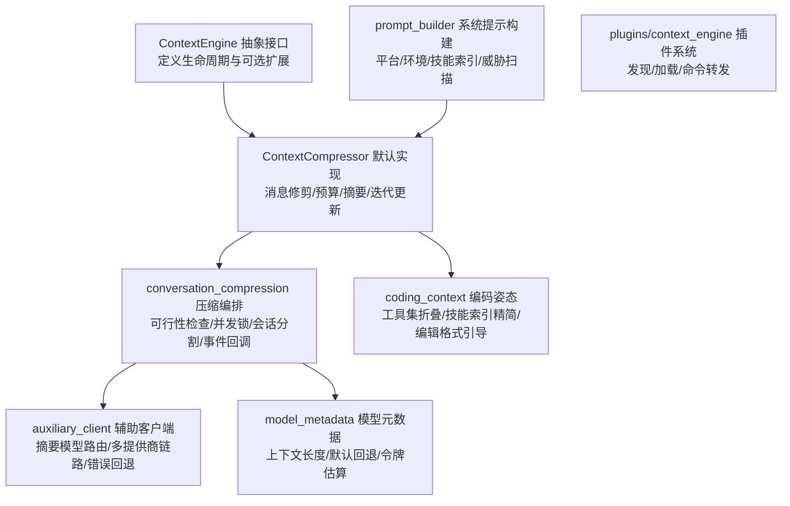
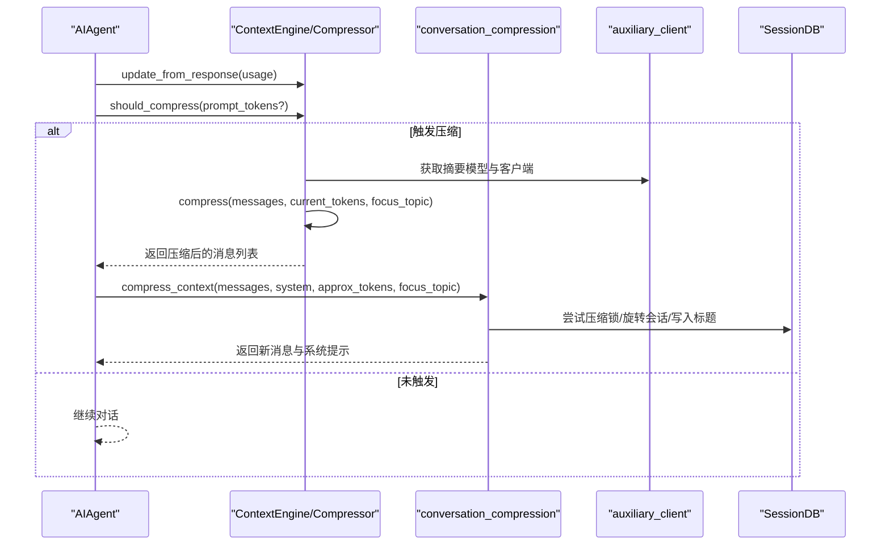
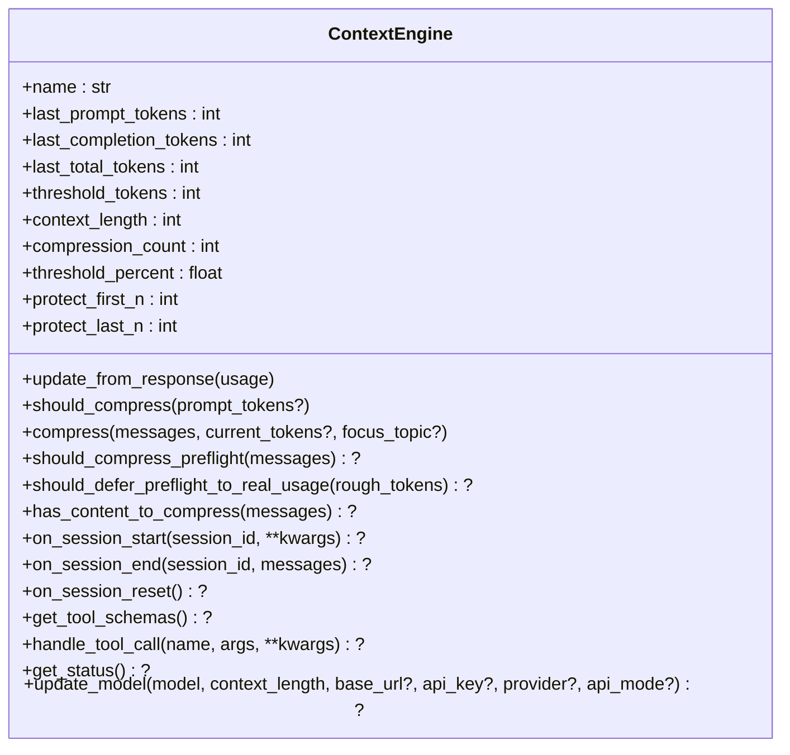
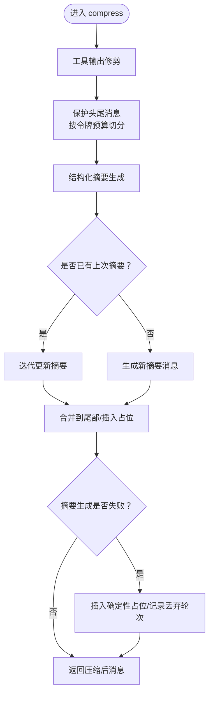
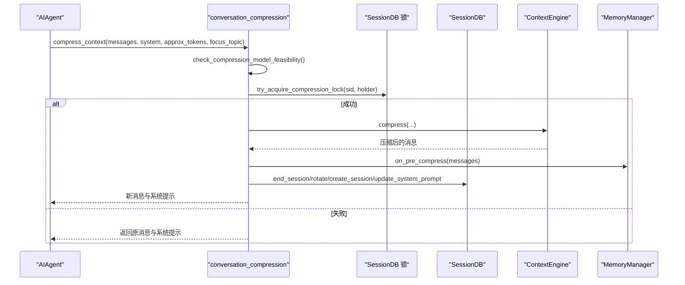
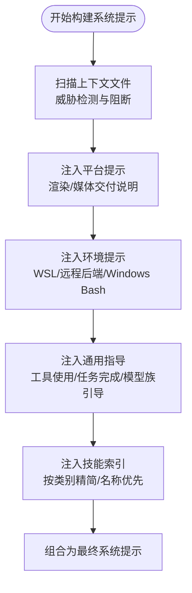
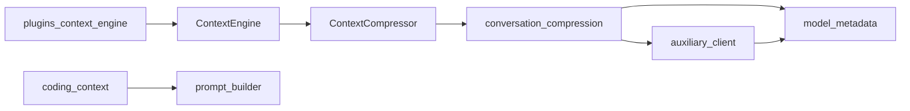

# 上下文引擎

<cite>
**本文引用的文件**
- [agent/context_engine.py](file://agent/context_engine.py)
- [agent/context_compressor.py](file://agent/context_compressor.py)
- [agent/conversation_compression.py](file://agent/conversation_compression.py)
- [agent/prompt_builder.py](file://agent/prompt_builder.py)
- [agent/coding_context.py](file://agent/coding_context.py)
- [agent/model_metadata.py](file://agent/model_metadata.py)
- [agent/auxiliary_client.py](file://agent/auxiliary_client.py)
- [plugins/context_engine/__init__.py](file://plugins/context_engine/__init__.py)
</cite>

## 目录
1. [引言](#引言)
2. [项目结构](#项目结构)
3. [核心组件](#核心组件)
4. [架构总览](#架构总览)
5. [详细组件分析](#详细组件分析)
6. [依赖关系分析](#依赖关系分析)
7. [性能考量](#性能考量)
8. [故障排查指南](#故障排查指南)
9. [结论](#结论)
10. [附录](#附录)

## 引言
本文件系统性解析 Hermes Agent 的上下文引擎设计与实现，重点覆盖以下主题：
- 上下文压缩算法：保护头尾、预算分配、迭代更新、失败回退与图像裁剪等策略
- 提示词构建：系统提示组装、平台与环境提示注入、模型族引导与安全扫描
- 令牌计数与优化：粗估与真实使用、阈值与预算重算、预检与延迟策略
- 上下文窗口管理：阈值触发、会话分割、并发压缩锁、状态迁移
- 动态调整与性能监控：阈值随模型切换重算、失败冷却、统计上报
- 不同类型上下文处理器：内置压缩器、插件式引擎（如 LCM）及其适用场景
- 最佳实践、调试技巧与性能调优方法
- 具体上下文处理示例与自定义上下文引擎开发指南

## 项目结构
围绕上下文引擎的关键模块如下：
- 抽象接口层：上下文引擎抽象类，定义生命周期与可选扩展点
- 内置实现：默认压缩引擎，负责消息修剪、预算保护、结构化摘要与迭代更新
- 压缩编排：压缩可行性检查、并发锁、会话分割、事件回调与统计
- 提示词构建：系统提示拼装、平台提示、环境探测、威胁扫描与阻断
- 模型元数据：上下文长度探测、默认回退、最小阈值校验、令牌估算
- 辅助客户端：压缩摘要模型选择、多提供商链路、错误回退与响应缓存
- 插件系统：上下文引擎插件发现与加载

图示来源
- [agent/context_engine.py:32-227](file://agent/context_engine.py#L32-L227)
- [agent/context_compressor.py:593-770](file://agent/context_compressor.py#L593-L770)
- [agent/conversation_compression.py:74-289](file://agent/conversation_compression.py#L74-L289)
- [agent/auxiliary_client.py:1-120](file://agent/auxiliary_client.py#L1-L120)
- [agent/model_metadata.py:170-190](file://agent/model_metadata.py#L170-L190)
- [agent/prompt_builder.py:1-120](file://agent/prompt_builder.py#L1-L120)
- [agent/coding_context.py:1-120](file://agent/coding_context.py#L1-L120)
- [plugins/context_engine/__init__.py:33-98](file://plugins/context_engine/__init__.py#L33-L98)

章节来源
- [agent/context_engine.py:1-227](file://agent/context_engine.py#L1-L227)
- [agent/context_compressor.py:1-200](file://agent/context_compressor.py#L1-L200)
- [agent/conversation_compression.py:1-120](file://agent/conversation_compression.py#L1-L120)
- [agent/prompt_builder.py:1-120](file://agent/prompt_builder.py#L1-L120)
- [agent/coding_context.py:1-120](file://agent/coding_context.py#L1-L120)
- [agent/model_metadata.py:170-200](file://agent/model_metadata.py#L170-L200)
- [agent/auxiliary_client.py:1-120](file://agent/auxiliary_client.py#L1-L120)
- [plugins/context_engine/__init__.py:1-120](file://plugins/context_engine/__init__.py#L1-L120)

## 核心组件
- 上下文引擎抽象接口：定义名称、令牌状态字段、压缩参数、生命周期钩子、可选工具与状态展示
- 默认压缩引擎：内置 ContextCompressor，实现消息修剪、头尾保护、摘要生成、迭代更新与失败回退
- 压缩编排：在压缩前进行可行性检查、加锁避免并发冲突、执行压缩并旋转会话、通知外部组件
- 提示词构建：系统提示拼装、平台与环境提示、技能索引、威胁扫描与阻断
- 模型元数据：上下文长度探测、默认回退、最小阈值校验、令牌估算
- 辅助客户端：摘要模型自动选择、多提供商链路、错误回退与响应缓存
- 插件系统：上下文引擎插件发现与加载，支持注册命令与全局命令表转发

章节来源
- [agent/context_engine.py:32-227](file://agent/context_engine.py#L32-L227)
- [agent/context_compressor.py:593-770](file://agent/context_compressor.py#L593-L770)
- [agent/conversation_compression.py:281-653](file://agent/conversation_compression.py#L281-L653)
- [agent/prompt_builder.py:46-120](file://agent/prompt_builder.py#L46-L120)
- [agent/model_metadata.py:170-200](file://agent/model_metadata.py#L170-L200)
- [agent/auxiliary_client.py:284-331](file://agent/auxiliary_client.py#L284-L331)
- [plugins/context_engine/__init__.py:33-98](file://plugins/context_engine/__init__.py#L33-L98)

## 架构总览
上下文引擎以“抽象接口 + 默认实现 + 编排层 + 外部支撑”的分层方式组织，确保：
- 可插拔：通过配置选择内置或第三方引擎
- 安全：压缩前可行性检查、并发锁、失败冷却与回退
- 可观测：令牌状态、压缩次数、阈值与使用百分比
- 高效：预算保护、工具输出修剪、图像裁剪、迭代摘要

图示来源
- [agent/context_engine.py:70-106](file://agent/context_engine.py#L70-L106)
- [agent/conversation_compression.py:281-653](file://agent/conversation_compression.py#L281-L653)
- [agent/auxiliary_client.py:284-331](file://agent/auxiliary_client.py#L284-L331)

章节来源
- [agent/context_engine.py:18-26](file://agent/context_engine.py#L18-L26)
- [agent/conversation_compression.py:314-427](file://agent/conversation_compression.py#L314-L427)

## 详细组件分析

### 抽象接口：ContextEngine
- 身份与状态：name、last_prompt_tokens、last_total_tokens、threshold_tokens、context_length、compression_count
- 压缩参数：threshold_percent、protect_first_n、protect_last_n
- 必选接口：update_from_response、should_compress、compress
- 可选接口：should_compress_preflight、should_defer_preflight_to_real_usage、has_content_to_compress、on_session_start、on_session_end、on_session_reset、get_tool_schemas、handle_tool_call、get_status、update_model

图示来源
- [agent/context_engine.py:32-227](file://agent/context_engine.py#L32-L227)

章节来源
- [agent/context_engine.py:32-227](file://agent/context_engine.py#L32-L227)

### 默认实现：ContextCompressor
- 算法要点：工具输出修剪 → 保护头尾 → 结构化摘要 → 迭代更新
- 预算策略：摘要比例、尾部预算上限、最小摘要令牌、摘要上限天花板
- 图像处理：剥离旧图像、按字符等价估算、媒体指令过滤
- 工具结果摘要：对终端、文件、搜索、浏览器、网络等工具输出生成一行摘要
- 失败回退：摘要失败时插入确定性占位，记录丢弃轮次，支持静默恢复与冷却
- 模型切换：随主模型上下文长度重算阈值与预算，保持校准

图示来源
- [agent/context_compressor.py:593-770](file://agent/context_compressor.py#L593-L770)
- [agent/context_compressor.py:142-173](file://agent/context_compressor.py#L142-L173)
- [agent/context_compressor.py:414-469](file://agent/context_compressor.py#L414-L469)
- [agent/context_compressor.py:471-591](file://agent/context_compressor.py#L471-L591)

章节来源
- [agent/context_compressor.py:593-770](file://agent/context_compressor.py#L593-L770)
- [agent/context_compressor.py:142-173](file://agent/context_compressor.py#L142-L173)
- [agent/context_compressor.py:414-469](file://agent/context_compressor.py#L414-L469)
- [agent/context_compressor.py:471-591](file://agent/context_compressor.py#L471-L591)

### 压缩编排：conversation_compression
- 可行性检查：在首次压缩尝试时探测辅助模型上下文长度，必要时自动降低会话阈值
- 并发控制：基于会话数据库的压缩锁，避免父子会话分叉
- 会话分割：压缩后结束旧会话、创建新会话、传播标题、更新系统提示
- 外部通知：内存提供者、上下文引擎、事件回调
- 统计与诊断：记录压缩前后粗估令牌、清理文件去重缓存

图示来源
- [agent/conversation_compression.py:281-653](file://agent/conversation_compression.py#L281-L653)
- [agent/conversation_compression.py:74-289](file://agent/conversation_compression.py#L74-L289)

章节来源
- [agent/conversation_compression.py:281-653](file://agent/conversation_compression.py#L281-L653)
- [agent/conversation_compression.py:74-289](file://agent/conversation_compression.py#L74-L289)

### 提示词构建：prompt_builder
- 系统提示组成：身份、平台提示、环境提示、工具使用约束、任务完成指引、模型族引导
- 上下文文件扫描：威胁模式检测与阻断，防止注入内容进入系统提示
- 平台提示：针对不同平台（Telegram、Discord、Slack、Signal、Email、CLI、短信、iMessage、Mattermost、飞书、微信、企业微信、QQ、Yuanbao、API Server、WebUI）注入渲染与媒体交付说明
- 环境提示：WSL、远程后端探测、Windows Bash 提示
- 模型族引导：针对不同模型家族注入执行纪律与验证要求

图示来源
- [agent/prompt_builder.py:46-120](file://agent/prompt_builder.py#L46-L120)
- [agent/prompt_builder.py:482-687](file://agent/prompt_builder.py#L482-L687)
- [agent/prompt_builder.py:751-800](file://agent/prompt_builder.py#L751-L800)

章节来源
- [agent/prompt_builder.py:1-120](file://agent/prompt_builder.py#L1-L120)
- [agent/prompt_builder.py:482-687](file://agent/prompt_builder.py#L482-L687)
- [agent/prompt_builder.py:751-800](file://agent/prompt_builder.py#L751-L800)

### 编码上下文：coding_context
- 姿态识别：根据配置与交互平台判断是否处于编码姿态，支持 auto/focus/on/off
- 工具集折叠：在 focus 模式下折叠为 coding 工具集，并保留启用的 MCP 服务器
- 技能索引精简：在 focus 模式下将非编码类别降级为仅显示名称
- 模型族编辑格式引导：针对不同模型族建议 patch/replace 编辑格式

章节来源
- [agent/coding_context.py:1-120](file://agent/coding_context.py#L1-L120)
- [agent/coding_context.py:213-270](file://agent/coding_context.py#L213-L270)
- [agent/coding_context.py:472-564](file://agent/coding_context.py#L472-L564)

### 模型元数据：model_metadata
- 上下文长度探测：多路径探测（OpenRouter、models.dev、ProviderProfile、默认回退）
- 默认回退：按层级从高到低探测，提供默认上下文长度字典
- 最小阈值：最小上下文长度校验，拒绝过小窗口
- 令牌估算：用于预检与压缩后粗估

章节来源
- [agent/model_metadata.py:170-200](file://agent/model_metadata.py#L170-L200)
- [agent/model_metadata.py:182-186](file://agent/model_metadata.py#L182-L186)
- [agent/model_metadata.py:320-321](file://agent/model_metadata.py#L320-L321)

### 辅助客户端：auxiliary_client
- 自动选择摘要模型：主模型 + OpenRouter + Nous Portal + 自定义端点 + Anthropic + 直连提供商
- 错误回退：支付/余额耗尽时自动切换下一个可用提供商
- 响应缓存：OpenRouter 响应缓存头与 TTL 控制
- 特殊模型处理：Codex OAuth、Arcee Thinking、Kimi/Moonshot 温度策略

章节来源
- [agent/auxiliary_client.py:1-120](file://agent/auxiliary_client.py#L1-L120)
- [agent/auxiliary_client.py:284-331](file://agent/auxiliary_client.py#L284-L331)
- [agent/auxiliary_client.py:389-438](file://agent/auxiliary_client.py#L389-L438)

### 插件系统：plugins/context_engine
- 发现与加载：扫描 plugins/context_engine/<name>/ 目录，读取 plugin.yaml 描述，执行可用性检查
- 注册命令：转发上下文引擎插件注册的命令到全局命令表，避免与内置命令冲突
- 实例化：优先调用 register(ctx) 获取引擎实例，否则查找 ContextEngine 子类并实例化

章节来源
- [plugins/context_engine/__init__.py:33-98](file://plugins/context_engine/__init__.py#L33-L98)
- [plugins/context_engine/__init__.py:199-286](file://plugins/context_engine/__init__.py#L199-L286)

## 依赖关系分析
- ContextEngine ← ContextCompressor：继承抽象接口，实现压缩逻辑
- conversation_compression ← ContextCompressor：调用 compress 并进行会话分割
- conversation_compression ← auxiliary_client：获取摘要模型与客户端
- conversation_compression ← model_metadata：压缩前可行性检查
- prompt_builder ← coding_context：系统提示中注入编码姿态与技能索引
- auxiliary_client ← model_metadata：摘要模型上下文长度探测与默认回退
- plugins/context_engine ← ContextEngine：插件式引擎替换默认实现

图示来源
- [agent/context_engine.py:32-227](file://agent/context_engine.py#L32-L227)
- [agent/context_compressor.py:593-770](file://agent/context_compressor.py#L593-L770)
- [agent/conversation_compression.py:281-653](file://agent/conversation_compression.py#L281-L653)
- [agent/auxiliary_client.py:284-331](file://agent/auxiliary_client.py#L284-L331)
- [agent/model_metadata.py:170-200](file://agent/model_metadata.py#L170-L200)
- [agent/coding_context.py:472-564](file://agent/coding_context.py#L472-L564)
- [plugins/context_engine/__init__.py:33-98](file://plugins/context_engine/__init__.py#L33-L98)

章节来源
- [agent/context_engine.py:32-227](file://agent/context_engine.py#L32-L227)
- [agent/context_compressor.py:593-770](file://agent/context_compressor.py#L593-L770)
- [agent/conversation_compression.py:281-653](file://agent/conversation_compression.py#L281-L653)
- [agent/auxiliary_client.py:284-331](file://agent/auxiliary_client.py#L284-L331)
- [agent/model_metadata.py:170-200](file://agent/model_metadata.py#L170-L200)
- [agent/coding_context.py:472-564](file://agent/coding_context.py#L472-L564)
- [plugins/context_engine/__init__.py:33-98](file://plugins/context_engine/__init__.py#L33-L98)

## 性能考量
- 预检与延迟：预检可能引入噪声，内置策略在真实使用信号出现后延迟预检，避免重复压缩
- 预算保护：尾部预算按摘要目标比例分配，避免固定消息数导致大尾部无法压缩
- 工具输出修剪：在摘要前对工具输出进行信息量更高的摘要，减少无意义占位
- 图像裁剪：剥离旧图像、按字符等价估算、Pillow 重采样，缓解大图像传输成本
- 摘要上限：摘要令牌上限与最小摘要令牌，保证摘要质量与稳定性
- 并发控制：压缩锁避免父子会话分叉，提升一致性与可维护性
- 缓存与回退：OpenRouter 响应缓存、摘要失败冷却、静默恢复与警告

## 故障排查指南
- 摘要失败：查看 last_summary_error，确认是否插入了确定性占位；关注 dropped_count 了解丢弃轮次
- 辅助模型不可用：检查 auxiliary.compression 配置与认证；观察自动回退到主模型的警告
- 并发压缩冲突：若出现“另一个路径正在压缩此会话”，等待其完成后重试
- 图像过大：使用 try_shrink_image_parts_in_messages 进行重采样，避免 5MB 上限
- 阈值过高：当辅助模型上下文小于阈值时，会自动降低阈值；可通过配置永久调整
- 令牌计数异常：检查 update_from_response 是否正确更新 last_prompt_tokens；关注 preflight 与真实使用差异

章节来源
- [agent/conversation_compression.py:455-500](file://agent/conversation_compression.py#L455-L500)
- [agent/conversation_compression.py:414-426](file://agent/conversation_compression.py#L414-L426)
- [agent/conversation_compression.py:656-770](file://agent/conversation_compression.py#L656-L770)
- [agent/conversation_compression.py:176-252](file://agent/conversation_compression.py#L176-L252)

## 结论
Hermes Agent 的上下文引擎通过抽象接口与默认实现解耦，结合压缩编排、模型元数据与辅助客户端，实现了稳健、可观测且可扩展的长对话上下文管理。内置压缩器在保护关键信息的同时最大化摘要收益，并通过失败回退、并发控制与性能监控保障生产可用性。插件系统进一步开放了上下文引擎的替换能力，满足多样化场景需求。

## 附录

### 上下文优化最佳实践
- 合理设置 threshold_percent 与摘要目标比例，平衡压缩频率与上下文保真
- 在 focus 模式下启用编码姿态，减少无关技能与工具干扰
- 使用工具输出修剪与图像裁剪，显著降低令牌占用
- 关注摘要失败冷却，避免频繁失败导致的连续压缩
- 定期检查辅助模型上下文长度，确保摘要生成空间充足

### 调试技巧
- 查看 get_status 输出中的 usage_percent、threshold_tokens、compression_count
- 使用 should_compress_preflight 与 has_content_to_compress 快速判断是否需要压缩
- 在失败场景下检查 last_summary_error 与 _last_aux_model_failure_* 字段
- 利用 replay_compression_warning 在网关端复现警告

### 性能调优方法
- 随模型切换自动重算阈值与预算，保持压缩校准
- 预检阶段延迟至真实使用信号稳定后再执行
- 使用 OpenRouter 响应缓存减少重复请求
- 对于大图像场景，启用图像裁剪与媒体指令过滤

### 具体上下文处理示例
- 自动压缩流程：AIAgent 在每轮结束后调用 should_compress，超过阈值则由 ContextCompressor 执行 compress，随后 conversation_compression 完成可行性检查、加锁与会话分割
- 手动压缩：通过 /compress 触发 has_content_to_compress 与 compress，强制进行压缩
- 摘要失败回退：当摘要生成失败时，插入确定性占位并记录 dropped_count，必要时可选择 /compress 重试

### 自定义上下文引擎开发指南
- 实现 ContextEngine 抽象类，至少覆盖 name、update_from_response、should_compress、compress
- 如需预检与延迟策略，实现 should_compress_preflight 与 should_defer_preflight_to_real_usage
- 如需会话边界感知，实现 on_session_start、on_session_end、on_session_reset
- 如需暴露工具，实现 get_tool_schemas 与 handle_tool_call
- 如需与插件系统集成，提供 register(ctx) 或直接导出 ContextEngine 子类实例
- 在 config.yaml 中设置 context.engine 为你的引擎名称，确保加载顺序与可用性检查通过

章节来源
- [agent/context_engine.py:32-227](file://agent/context_engine.py#L32-L227)
- [plugins/context_engine/__init__.py:79-98](file://plugins/context_engine/__init__.py#L79-L98)
- [agent/conversation_compression.py:281-653](file://agent/conversation_compression.py#L281-L653)