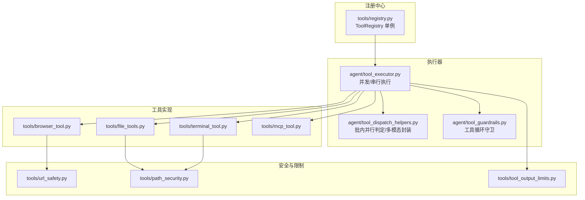
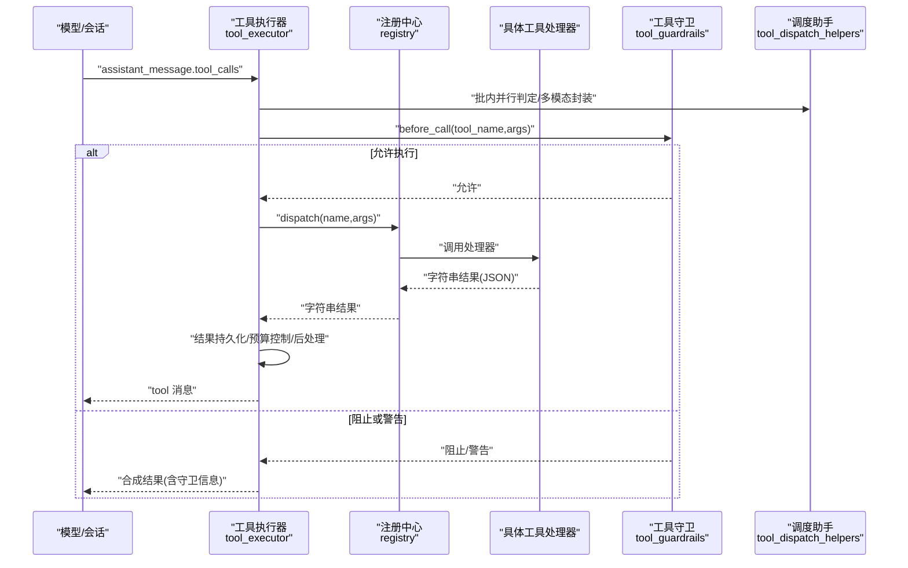
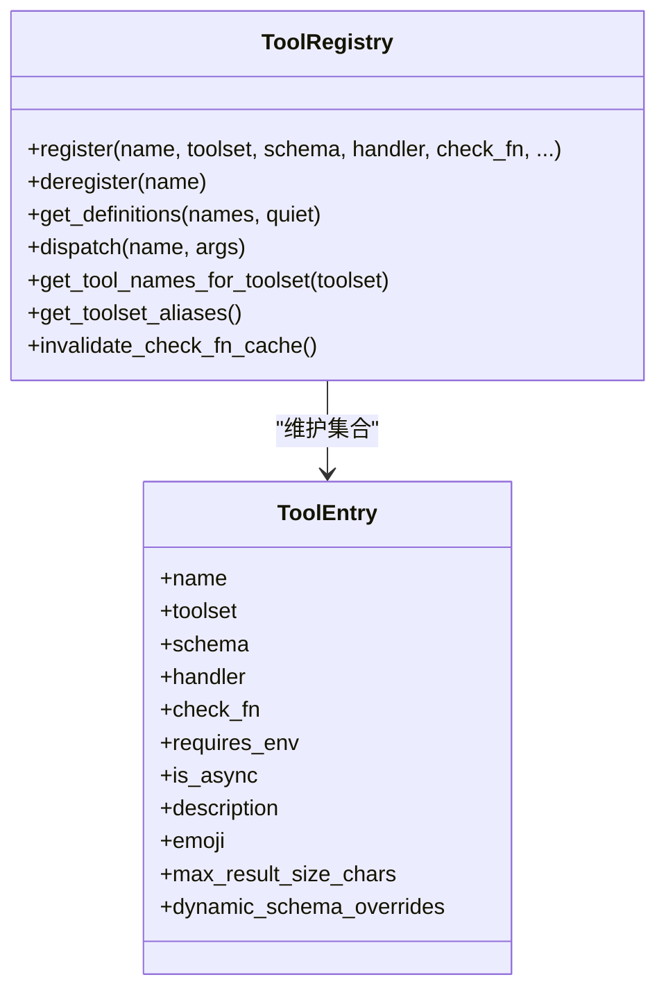
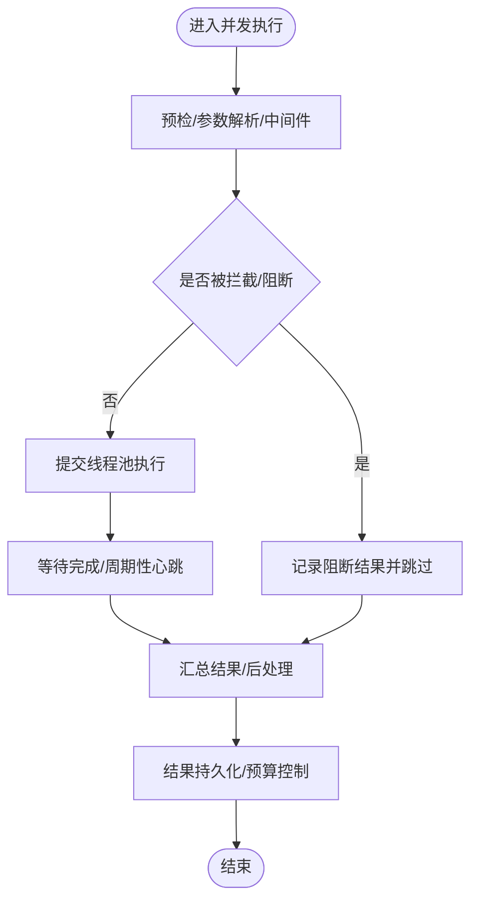
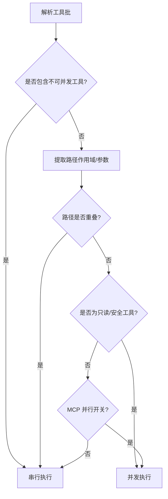
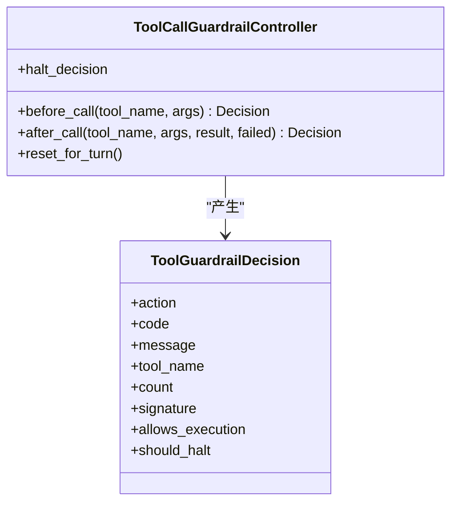
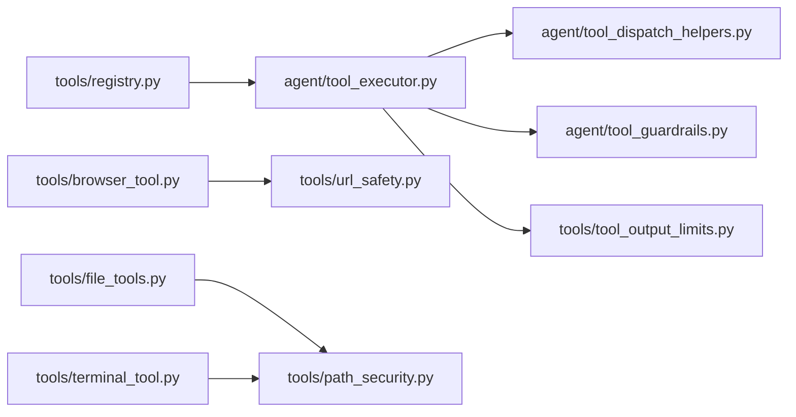

# 工具系统

<cite>
**本文引用的文件**
- [agent/tool_dispatch_helpers.py](file://agent/tool_dispatch_helpers.py)
- [agent/tool_executor.py](file://agent/tool_executor.py)
- [agent/tool_guardrails.py](file://agent/tool_guardrails.py)
- [agent/tool_result_classification.py](file://agent/tool_result_classification.py)
- [tools/registry.py](file://tools/registry.py)
- [tools/__init__.py](file://tools/__init__.py)
- [tools/browser_tool.py](file://tools/browser_tool.py)
- [tools/file_tools.py](file://tools/file_tools.py)
- [tools/terminal_tool.py](file://tools/terminal_tool.py)
- [tools/mcp_tool.py](file://tools/mcp_tool.py)
- [tools/url_safety.py](file://tools/url_safety.py)
- [tools/path_security.py](file://tools/path_security.py)
- [tools/tool_output_limits.py](file://tools/tool_output_limits.py)
</cite>

## 目录
1. [引言](#引言)
2. [项目结构](#项目结构)
3. [核心组件](#核心组件)
4. [架构总览](#架构总览)
5. [详细组件分析](#详细组件分析)
6. [依赖分析](#依赖分析)
7. [性能考虑](#性能考虑)
8. [故障排查指南](#故障排查指南)
9. [结论](#结论)
10. [附录：开发与测试指南](#附录开发与测试指南)

## 引言
本文件系统性解析 Hermes Agent 的工具系统架构与实现原理，覆盖工具注册机制、发现过程、并发/串行执行调度、结果处理与持久化、以及安全沙箱与权限控制。文档同时给出工具分类体系（网络工具、文件工具、终端工具、浏览器工具等）及各自实现要点，并提供开发自定义工具的实践指南、测试策略与性能优化建议。

## 项目结构
工具系统由“注册中心 + 执行器 + 安全与守卫”三层构成：
- 注册中心：集中管理工具元数据、可用性检查与动态刷新，屏蔽外部工具（如 MCP）变更对上层的影响。
- 执行器：负责工具调用的并发/串行调度、中间件钩子、错误与取消处理、结果归档与预算控制。
- 安全与守卫：包括路径/URL 安全校验、输出长度限制、工具循环守卫、不可信内容包装等。

图示来源
- [tools/registry.py:151-544](file://tools/registry.py#L151-L544)
- [agent/tool_executor.py:243-768](file://agent/tool_executor.py#L243-L768)
- [agent/tool_dispatch_helpers.py:103-146](file://agent/tool_dispatch_helpers.py#L103-L146)
- [agent/tool_guardrails.py:224-375](file://agent/tool_guardrails.py#L224-L375)
- [tools/browser_tool.py:1-200](file://tools/browser_tool.py#L1-L200)
- [tools/file_tools.py:1-200](file://tools/file_tools.py#L1-L200)
- [tools/terminal_tool.py:1-200](file://tools/terminal_tool.py#L1-L200)
- [tools/mcp_tool.py:1-200](file://tools/mcp_tool.py#L1-L200)
- [tools/url_safety.py:1-200](file://tools/url_safety.py#L1-L200)
- [tools/path_security.py:1-44](file://tools/path_security.py#L1-L44)
- [tools/tool_output_limits.py:1-111](file://tools/tool_output_limits.py#L1-L111)

章节来源
- [tools/registry.py:1-590](file://tools/registry.py#L1-L590)
- [agent/tool_executor.py:1-800](file://agent/tool_executor.py#L1-L800)
- [agent/tool_dispatch_helpers.py:1-418](file://agent/tool_dispatch_helpers.py#L1-L418)
- [agent/tool_guardrails.py:1-476](file://agent/tool_guardrails.py#L1-L476)
- [tools/browser_tool.py:1-200](file://tools/browser_tool.py#L1-L200)
- [tools/file_tools.py:1-200](file://tools/file_tools.py#L1-L200)
- [tools/terminal_tool.py:1-200](file://tools/terminal_tool.py#L1-L200)
- [tools/mcp_tool.py:1-200](file://tools/mcp_tool.py#L1-L200)
- [tools/url_safety.py:1-200](file://tools/url_safety.py#L1-L200)
- [tools/path_security.py:1-44](file://tools/path_security.py#L1-L44)
- [tools/tool_output_limits.py:1-111](file://tools/tool_output_limits.py#L1-L111)

## 核心组件
- 工具注册中心（ToolRegistry）
  - 负责收集各工具模块在导入时的注册调用，维护工具名到处理器的映射、可用性检查缓存、动态刷新与生成号。
  - 提供按名称查询、按工具集过滤、动态 schema 覆盖、最大结果尺寸查询等能力。
- 工具执行器（并发/串行）
  - 并发执行：线程池调度、中断传播、中间件钩子、结果持久化与预算控制、后处理（多模态内容转换、子目录提示注入、不可信内容包装）。
  - 串行执行：单次工具调用的完整生命周期，含预检、拦截、检查点、回调、结果记录与显示。
- 工具调度助手（批内并行判定、多模态封装、错误摘要）
  - 判定工具批是否可并行（读写隔离、路径不重叠、MCP 并行开关），多模态结果标准化，错误摘要与轨迹清洗。
- 工具守卫（循环检测与硬停）
  - 基于“精确失败次数、同工具失败次数、只读无进展重复”三类阈值的软警告/硬停止策略，支持可配置阈值。
- 安全与限制
  - URL 安全（私有地址/元数据站点阻断、可选放行）、路径安全（相对路径穿越校验）、输出长度限制（终端/文件读取/行宽）。

章节来源
- [tools/registry.py:151-544](file://tools/registry.py#L151-L544)
- [agent/tool_executor.py:243-768](file://agent/tool_executor.py#L243-L768)
- [agent/tool_dispatch_helpers.py:103-317](file://agent/tool_dispatch_helpers.py#L103-L317)
- [agent/tool_guardrails.py:224-375](file://agent/tool_guardrails.py#L224-L375)
- [tools/url_safety.py:1-200](file://tools/url_safety.py#L1-L200)
- [tools/path_security.py:1-44](file://tools/path_security.py#L1-L44)
- [tools/tool_output_limits.py:1-111](file://tools/tool_output_limits.py#L1-L111)

## 架构总览
下图展示了从模型发出工具调用到结果返回的关键交互链路，包括并发批调度、守卫决策、中间件钩子、结果持久化与预算控制。

图示来源
- [agent/tool_executor.py:243-768](file://agent/tool_executor.py#L243-L768)
- [agent/tool_guardrails.py:241-375](file://agent/tool_guardrails.py#L241-L375)
- [agent/tool_dispatch_helpers.py:103-146](file://agent/tool_dispatch_helpers.py#L103-L146)
- [tools/registry.py:390-417](file://tools/registry.py#L390-L417)

## 详细组件分析

### 组件A：工具注册中心（ToolRegistry）
- 注册与覆盖策略
  - 同名工具若来自不同工具集，默认拒绝覆盖，避免插件/MCP 无意替换内置工具；MCP 到 MCP 的覆盖被允许以支持服务器刷新。
  - 支持显式 override=True 进行插件级覆盖。
- 可用性检查与缓存
  - 每个工具集可挂接 check_fn，结果 TTL 缓存约 30 秒，兼顾实时性与性能。
  - 提供工具集别名注册与查询，支持动态刷新（如 MCP 服务器列表变化）。
- 动态 schema 覆盖
  - 部分工具（如委托任务）的描述依赖运行时配置，通过动态覆盖在获取定义时合并。
- 最大结果尺寸
  - 提供 per-tool 查询接口，缺失时回退至全局默认。

图示来源
- [tools/registry.py:151-544](file://tools/registry.py#L151-L544)

章节来源
- [tools/registry.py:234-431](file://tools/registry.py#L234-L431)

### 组件B：工具执行器（并发/串行）
- 并发执行
  - 线程池大小上限固定，按批内并行判定决定是否并发；每个工作线程注册中断位，支持用户中断传播。
  - 中间件钩子：请求前中间件与执行中间件贯穿整个调用链，便于审计与扩展。
  - 结果后处理：多模态内容标准化、子目录提示注入、不可信内容包装、结果持久化与每轮预算控制。
- 串行执行
  - 单次调用的完整生命周期，含预检、拦截、检查点（文件写入/破坏性命令）、回调、结果记录与显示。
- 取消与心跳
  - 在长批并发中定期等待与心跳，避免网关误判空闲而终止；用户中断时取消未开始的任务并等待已启动任务优雅退出。

图示来源
- [agent/tool_executor.py:243-768](file://agent/tool_executor.py#L243-L768)

章节来源
- [agent/tool_executor.py:243-768](file://agent/tool_executor.py#L243-L768)

### 组件C：调度助手（批内并行判定、多模态封装、错误摘要）
- 批内并行判定
  - 不可并发工具集（如澄清工具）直接串行；只读安全工具可并发；文件类工具需路径不重叠；MCP 工具需服务器声明支持并行。
- 多模态封装
  - 将工具返回的多模态结果标准化为 OpenAI 风格内容列表，保障视觉适配；同时提供文本摘要以便日志与轨迹保存。
- 错误摘要与轨迹清洗
  - 从任意结果中提取可读错误摘要，用于底部栏与日志；轨迹清洗将图片块替换为占位符，保留文本摘要。

图示来源
- [agent/tool_dispatch_helpers.py:103-146](file://agent/tool_dispatch_helpers.py#L103-L146)

章节来源
- [agent/tool_dispatch_helpers.py:103-317](file://agent/tool_dispatch_helpers.py#L103-L317)

### 组件D：工具守卫（循环检测与硬停）
- 阈值配置
  - 支持精确失败、同工具失败、只读无进展三类阈值，可分别配置软警告与硬停止。
- 决策与合成结果
  - before_call 返回决策，after_call 记录状态并可能触发硬停；可生成带守卫元信息的合成结果。
- 恢复提示
  - 针对不同工具失败场景提供可操作的恢复建议。

图示来源
- [agent/tool_guardrails.py:127-375](file://agent/tool_guardrails.py#L127-L375)

章节来源
- [agent/tool_guardrails.py:224-476](file://agent/tool_guardrails.py#L224-L476)

### 组件E：安全与限制
- URL 安全
  - 始终阻断云元数据站点与链路本地网段；支持可选放行；对 HTTPS 主机白名单进行细粒度控制。
- 路径安全
  - 使用 Path.resolve() 与 relative_to() 校验路径逃逸；快速检查 .. 组件防止遍历。
- 输出长度限制
  - 终端输出、文件读取行数与行宽统一由配置驱动，缺省值与历史行为保持一致。

章节来源
- [tools/url_safety.py:1-200](file://tools/url_safety.py#L1-L200)
- [tools/path_security.py:1-44](file://tools/path_security.py#L1-L44)
- [tools/tool_output_limits.py:1-111](file://tools/tool_output_limits.py#L1-L111)

### 组件F：工具分类与实现要点
- 浏览器工具（browser_tool）
  - 支持本地 Chromium、Browserbase、Browser Use 等后端，统一代理层；提供快照、点击、输入等交互；具备会话隔离与清理。
- 文件工具（file_tools）
  - 读写/补丁工具，带读取字符上限、设备路径阻断、相对路径锚定与工作区根推断；支持分页与敏感信息脱敏。
- 终端工具（terminal_tool）
  - 支持本地、Docker、Modal、SSH、Singularity 等后端；提供前台/后台任务、磁盘用量告警、sudo 密码缓存与审批回调。
- MCP 工具（mcp_tool）
  - 通过 stdio、HTTP/StreamableHTTP、SSE 等传输连接外部 MCP 服务器；自动重连、环境变量过滤、采样支持与并行开关。

章节来源
- [tools/browser_tool.py:1-200](file://tools/browser_tool.py#L1-L200)
- [tools/file_tools.py:1-200](file://tools/file_tools.py#L1-L200)
- [tools/terminal_tool.py:1-200](file://tools/terminal_tool.py#L1-L200)
- [tools/mcp_tool.py:1-200](file://tools/mcp_tool.py#L1-L200)

## 依赖分析
- 注册中心与工具实现解耦：工具模块在导入时注册自身，注册中心仅暴露统一的 schema 与 dispatch 接口。
- 执行器对注册中心的依赖：通过 get_definitions 获取可用工具 schema，通过 dispatch 调用处理器。
- 守卫与调度助手：执行器在调用前后分别与守卫与调度助手交互，确保安全性与一致性。
- 安全模块：浏览器、文件、终端工具均依赖安全模块进行 URL/路径/输出长度的前置校验与限制。

图示来源
- [tools/registry.py:337-431](file://tools/registry.py#L337-L431)
- [agent/tool_executor.py:243-768](file://agent/tool_executor.py#L243-L768)
- [agent/tool_dispatch_helpers.py:103-146](file://agent/tool_dispatch_helpers.py#L103-L146)
- [agent/tool_guardrails.py:224-375](file://agent/tool_guardrails.py#L224-L375)
- [tools/browser_tool.py:1-200](file://tools/browser_tool.py#L1-L200)
- [tools/file_tools.py:1-200](file://tools/file_tools.py#L1-L200)
- [tools/terminal_tool.py:1-200](file://tools/terminal_tool.py#L1-L200)
- [tools/url_safety.py:1-200](file://tools/url_safety.py#L1-L200)
- [tools/path_security.py:1-44](file://tools/path_security.py#L1-L44)
- [tools/tool_output_limits.py:1-111](file://tools/tool_output_limits.py#L1-L111)

章节来源
- [tools/registry.py:337-431](file://tools/registry.py#L337-L431)
- [agent/tool_executor.py:243-768](file://agent/tool_executor.py#L243-L768)
- [agent/tool_dispatch_helpers.py:103-146](file://agent/tool_dispatch_helpers.py#L103-L146)
- [agent/tool_guardrails.py:224-375](file://agent/tool_guardrails.py#L224-L375)
- [tools/browser_tool.py:1-200](file://tools/browser_tool.py#L1-L200)
- [tools/file_tools.py:1-200](file://tools/file_tools.py#L1-L200)
- [tools/terminal_tool.py:1-200](file://tools/terminal_tool.py#L1-L200)
- [tools/url_safety.py:1-200](file://tools/url_safety.py#L1-L200)
- [tools/path_security.py:1-44](file://tools/path_security.py#L1-L44)
- [tools/tool_output_limits.py:1-111](file://tools/tool_output_limits.py#L1-L111)

## 性能考虑
- 并发批调度
  - 通过批内并行判定减少不必要的线程开销；线程池上限固定，避免过度并发导致上下文切换与资源争用。
- TTL 缓存
  - 注册中心对 check_fn 的结果做 TTL 缓存，降低频繁探测外部环境（如 Docker/Playwright）带来的开销。
- 输出截断与预算
  - 工具输出长度限制与每轮预算控制，避免超大响应拖垮上下文窗口与内存占用。
- I/O 与网络
  - 文件读取字符上限、路径阻断与 URL 安全检查减少无效 I/O 与潜在 SSRF 风险，间接提升稳定性与吞吐。

## 故障排查指南
- 工具未出现在可用工具集中
  - 检查工具模块是否在导入时完成注册；确认 check_fn 是否返回 True；必要时调用失效缓存接口。
- 并发批被强制串行
  - 检查是否存在不可并发工具、路径重叠、或 MCP 并行开关未启用。
- 结果过大导致截断
  - 调整工具输出限制配置；对文件读取使用分页参数；对终端输出使用更短命令或管道切片。
- URL 请求被阻断
  - 检查是否命中私有/元数据地址；根据需要使用可选放行开关（谨慎评估风险）。
- 路径访问异常
  - 确认路径未穿越；使用绝对路径或受控相对路径；检查工作区根与任务 CWD 设置。

章节来源
- [tools/registry.py:144-149](file://tools/registry.py#L144-L149)
- [agent/tool_dispatch_helpers.py:103-146](file://agent/tool_dispatch_helpers.py#L103-L146)
- [tools/tool_output_limits.py:59-89](file://tools/tool_output_limits.py#L59-L89)
- [tools/url_safety.py:133-182](file://tools/url_safety.py#L133-L182)
- [tools/path_security.py:15-34](file://tools/path_security.py#L15-L34)

## 结论
Hermes Agent 的工具系统通过“注册中心 + 执行器 + 安全守卫”的清晰分层，实现了高扩展性、强安全与良好性能的平衡。其批内并行判定、多模态标准化、不可信内容包装与工具循环守卫等机制，既满足复杂任务编排需求，又有效降低了安全与资源风险。对于开发者而言，遵循注册规范、正确设置 check_fn 与动态 schema、严格使用安全与限制模块，即可快速构建稳定可靠的自定义工具。

## 附录：开发与测试指南

### 开发自定义工具步骤
- 工具注册
  - 在工具模块导入阶段调用注册中心的 register 方法，传入 schema、处理器、check_fn、工具集等元信息。
  - 若需动态描述（如委托任务），提供 dynamic_schema_overrides 回调。
- 处理器实现
  - 处理器必须返回 JSON 字符串；可使用注册中心提供的工具错误/结果辅助函数简化返回格式。
- 可用性检查
  - 提供 check_fn，探测外部依赖（如二进制、服务、环境变量）；避免在 get_definitions 时重复探测。
- 安全与限制
  - 对 URL 输入进行规范化与阻断检查；对文件/路径进行穿越校验；对输出长度进行限制。
- 并行与批处理
  - 明确工具是否只读/可并发；涉及文件写入时确保路径不重叠；MCP 工具需服务器开启并行支持。

章节来源
- [tools/registry.py:234-431](file://tools/registry.py#L234-L431)
- [tools/__init__.py:18-22](file://tools/__init__.py#L18-L22)
- [tools/url_safety.py:38-76](file://tools/url_safety.py#L38-L76)
- [tools/path_security.py:15-34](file://tools/path_security.py#L15-L34)
- [tools/tool_output_limits.py:59-89](file://tools/tool_output_limits.py#L59-L89)

### 测试策略
- 单元测试
  - 针对工具处理器的边界条件（空参数、非法路径、超长输出）编写用例。
  - 验证守卫在不同失败次数下的行为（警告/阻断/硬停）。
- 集成测试
  - 验证注册中心对工具可用性的正确识别与缓存失效。
  - 验证并发批调度在路径重叠、MCP 并行开关等场景的行为。
- 安全测试
  - 验证 URL 安全检查对私有地址与元数据站点的阻断效果。
  - 验证路径穿越与工作区锚定逻辑。
- 性能测试
  - 在不同批规模与线程池上限下测量吞吐与延迟；验证输出截断与预算控制对内存占用的影响。

### 性能优化建议
- 合理使用并发
  - 将只读工具与文件类工具（路径不重叠）尽量并行；避免对交互型工具进行并发。
- 减少外部探测
  - 将 check_fn 的探测成本降至最低；利用 TTL 缓存避免重复探测。
- 控制输出体积
  - 对大文件读取使用分页参数；对终端输出进行裁剪；调整工具输出限制配置。
- 线程池与心跳
  - 在长批并发中合理设置等待间隔与心跳频率，避免网关误判空闲。