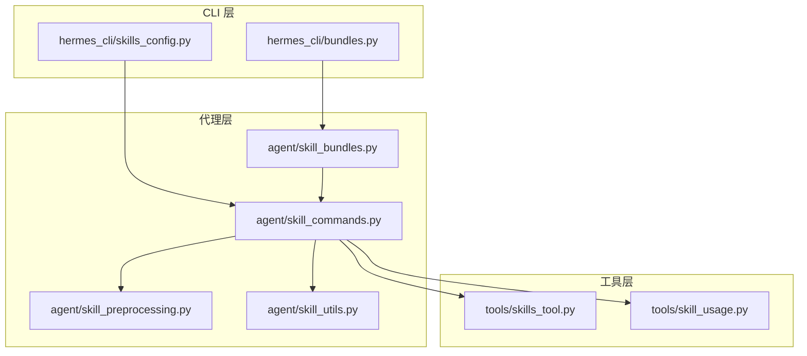
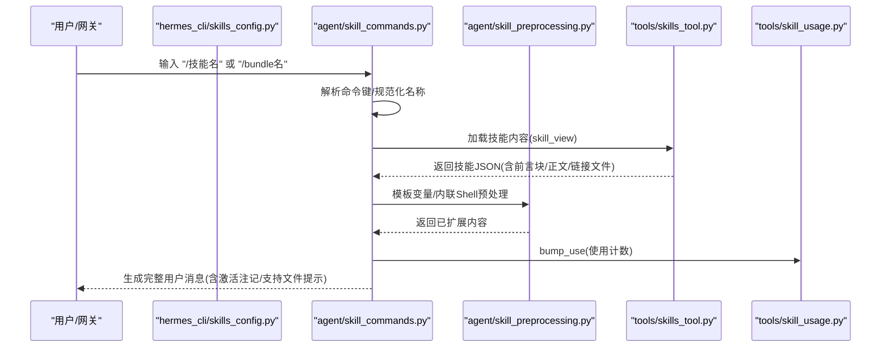
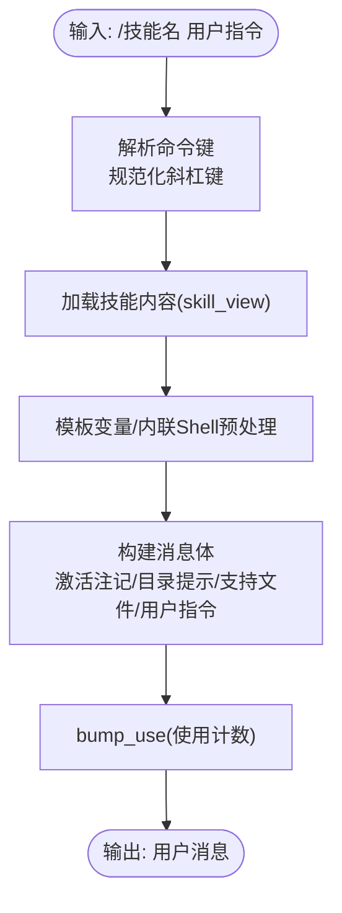
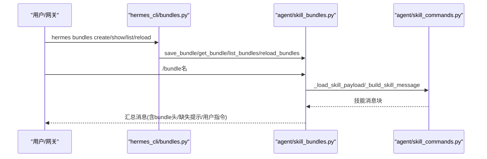
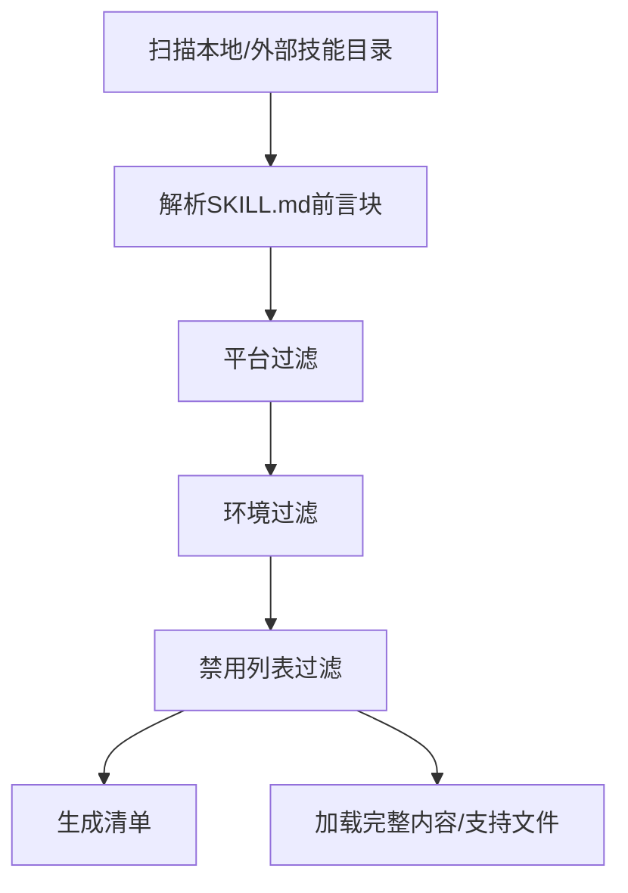
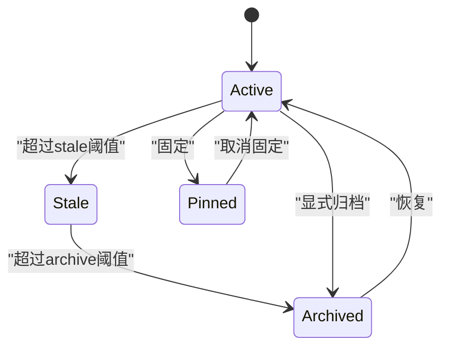
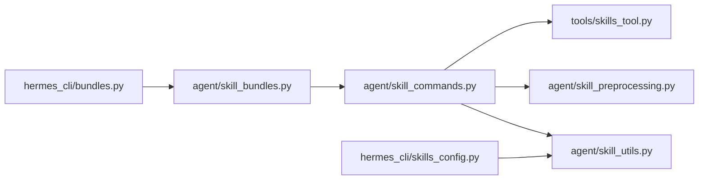

# 技能系统

<cite>
**本文引用的文件**
- [agent/skill_bundles.py](file://agent/skill_bundles.py)
- [agent/skill_commands.py](file://agent/skill_commands.py)
- [agent/skill_preprocessing.py](file://agent/skill_preprocessing.py)
- [agent/skill_utils.py](file://agent/skill_utils.py)
- [tools/skills_tool.py](file://tools/skills_tool.py)
- [tools/skill_usage.py](file://tools/skill_usage.py)
- [hermes_cli/bundles.py](file://hermes_cli/bundles.py)
- [hermes_cli/skills_config.py](file://hermes_cli/skills_config.py)
- [skills/github/codebase-inspection/SKILL.md](file://skills/github/codebase-inspection/SKILL.md)
- [website/i18n/zh-Hans/docusaurus-plugin-content-docs/current/user-guide/features/skills.md](file://website/i18n/zh-Hans/docusaurus-plugin-content-docs/current/user-guide/features/skills.md)
</cite>

## 目录
1. [简介](#简介)
2. [项目结构](#项目结构)
3. [核心组件](#核心组件)
4. [架构总览](#架构总览)
5. [详细组件分析](#详细组件分析)
6. [依赖分析](#依赖分析)
7. [性能考虑](#性能考虑)
8. [故障排查指南](#故障排查指南)
9. [结论](#结论)
10. [附录](#附录)

## 简介
本文件系统化阐述 Hermes Agent 的“技能系统”设计与实现，覆盖以下主题：
- 程序性知识的表示：以 SKILL.md 为载体，采用 YAML 前言块承载元数据与条件声明，正文承载可执行的步骤与提示。
- 技能的创建、存储、版本控制与调用：本地目录组织、外部目录扩展、Hub 安装与清单管理；通过斜杠命令触发加载与注入。
- 元数据结构与依赖关系管理：平台/环境过滤、前置条件与密钥收集、配置变量注入、条件字段（工具集/工具）。
- 技能束（bundle）概念：将多技能聚合为单一斜杠命令，支持额外指令与缺失技能的宽容处理。
- 动态加载、热更新与卸载：基于文件系统时间戳的缓存失效、增量扫描与差异报告、使用计数与生命周期管理。
- 最佳实践、调试技巧与性能优化：模板变量与内联 Shell 扩展、安全路径校验、并发锁与原子写入、缓存键设计。

## 项目结构
技能系统由“工具层 + 代理层 + CLI 层”协同构成：
- 工具层（tools/）：提供技能清单、查看、前置条件检测、Hub 同步等能力。
- 代理层（agent/）：负责技能命令解析、构建消息体、预处理（模板变量、内联 Shell）、平台/环境匹配、bundle 解析与构建。
- CLI 层（hermes_cli/）：提供 hermes skills 与 hermes bundles 子命令，支持禁用列表配置与 bundle 的增删改查。

图示来源
- [agent/skill_bundles.py:1-411](file://agent/skill_bundles.py#L1-L411)
- [agent/skill_commands.py:1-613](file://agent/skill_commands.py#L1-L613)
- [agent/skill_preprocessing.py:1-141](file://agent/skill_preprocessing.py#L1-L141)
- [agent/skill_utils.py:1-740](file://agent/skill_utils.py#L1-L740)
- [tools/skills_tool.py:1-800](file://tools/skills_tool.py#L1-L800)
- [tools/skill_usage.py:1-901](file://tools/skill_usage.py#L1-L901)
- [hermes_cli/bundles.py:1-230](file://hermes_cli/bundles.py#L1-L230)
- [hermes_cli/skills_config.py:1-184](file://hermes_cli/skills_config.py#L1-L184)

章节来源
- [agent/skill_bundles.py:1-411](file://agent/skill_bundles.py#L1-L411)
- [agent/skill_commands.py:1-613](file://agent/skill_commands.py#L1-L613)
- [agent/skill_preprocessing.py:1-141](file://agent/skill_preprocessing.py#L1-L141)
- [agent/skill_utils.py:1-740](file://agent/skill_utils.py#L1-L740)
- [tools/skills_tool.py:1-800](file://tools/skills_tool.py#L1-L800)
- [tools/skill_usage.py:1-901](file://tools/skill_usage.py#L1-L901)
- [hermes_cli/bundles.py:1-230](file://hermes_cli/bundles.py#L1-L230)
- [hermes_cli/skills_config.py:1-184](file://hermes_cli/skills_config.py#L1-L184)

## 核心组件
- 技能命令与消息构建
  - 负责将斜杠命令解析为具体技能，并生成面向模型的消息体，包含激活注记、模板变量替换、内联 Shell 扩展、支持文件提示、运行时注记等。
- 技能束（Bundle）
  - 将多个技能聚合为单一斜杠命令，按顺序加载并拼接消息体，保留缺失技能的宽容行为与使用计数追踪。
- 技能预处理
  - 提供模板变量（HERMES_SKILL_DIR、HERMES_SESSION_ID）与内联 Shell 扩展能力，限制输出长度，避免阻塞或过长上下文。
- 技能工具
  - 提供技能清单、查看、分类、平台/环境过滤、前置条件与密钥收集、外部目录扫描等。
- 使用统计与生命周期
  - 维护 .usage.json 计数器与状态机，支持归档/恢复、保护内置技能、抑制重建等。
- CLI 配置
  - hermes skills：全局/平台维度的禁用列表配置；hermes bundles：bundle 的增删改查与重载。

章节来源
- [agent/skill_commands.py:245-346](file://agent/skill_commands.py#L245-L346)
- [agent/skill_bundles.py:253-341](file://agent/skill_bundles.py#L253-L341)
- [agent/skill_preprocessing.py:23-141](file://agent/skill_preprocessing.py#L23-L141)
- [tools/skills_tool.py:687-750](file://tools/skills_tool.py#L687-L750)
- [tools/skill_usage.py:476-620](file://tools/skill_usage.py#L476-L620)
- [hermes_cli/skills_config.py:27-54](file://hermes_cli/skills_config.py#L27-L54)
- [hermes_cli/bundles.py:87-137](file://hermes_cli/bundles.py#L87-L137)

## 架构总览
技能系统的调用链路从 CLI/Gateway 触发斜杠命令，经由代理层解析与构建消息，最终进入模型循环。bundle 调用会串联多个技能的消息体。

图示来源
- [agent/skill_commands.py:517-562](file://agent/skill_commands.py#L517-L562)
- [agent/skill_preprocessing.py:124-141](file://agent/skill_preprocessing.py#L124-L141)
- [tools/skills_tool.py:687-750](file://tools/skills_tool.py#L687-L750)
- [tools/skill_usage.py:599-609](file://tools/skill_usage.py#L599-L609)

章节来源
- [agent/skill_commands.py:418-496](file://agent/skill_commands.py#L418-L496)
- [agent/skill_preprocessing.py:23-141](file://agent/skill_preprocessing.py#L23-L141)
- [tools/skills_tool.py:687-750](file://tools/skills_tool.py#L687-L750)
- [tools/skill_usage.py:599-609](file://tools/skill_usage.py#L599-L609)

## 详细组件分析

### 技能命令与消息构建
- 命令解析与规范化
  - 支持下划线与连字符互换，统一为斜杠键；平台变化时自动重新扫描。
- 消息体构建
  - 包含激活注记、模板变量替换、内联 Shell 扩展、绝对技能目录提示、支持文件清单、用户指令与运行时注记。
- 预处理
  - 模板变量：HERMES_SKILL_DIR、HERMES_SESSION_ID；内联 Shell：限制超时与输出长度，失败返回简短错误标记。
- 使用统计
  - 调用时 bump_use，用于 Curator 生命周期管理。

图示来源
- [agent/skill_commands.py:498-562](file://agent/skill_commands.py#L498-L562)
- [agent/skill_preprocessing.py:124-141](file://agent/skill_preprocessing.py#L124-L141)
- [tools/skill_usage.py:599-609](file://tools/skill_usage.py#L599-L609)

章节来源
- [agent/skill_commands.py:418-496](file://agent/skill_commands.py#L418-L496)
- [agent/skill_commands.py:517-562](file://agent/skill_commands.py#L517-L562)
- [agent/skill_preprocessing.py:23-141](file://agent/skill_preprocessing.py#L23-L141)
- [tools/skill_usage.py:599-609](file://tools/skill_usage.py#L599-L609)

### 技能束（Bundle）
- 存储与发现
  - YAML 文件位于 ~/.hermes/skill-bundles/<slug>.yaml；扫描目录并缓存，按文件与目录 mtime 判断变更。
- 解析与构建
  - 读取 name/slug/description/skills/instruction；对每个技能调用 _load_skill_payload/_build_skill_message；记录缺失技能；追加 bundle 头部说明与用户指令。
- CLI 管理
  - hermes bundles list/show/create/delete/reload；reload 返回新增/移除/未变数量与描述。

图示来源
- [hermes_cli/bundles.py:87-137](file://hermes_cli/bundles.py#L87-L137)
- [agent/skill_bundles.py:253-341](file://agent/skill_bundles.py#L253-L341)
- [agent/skill_bundles.py:221-244](file://agent/skill_bundles.py#L221-L244)

章节来源
- [agent/skill_bundles.py:66-114](file://agent/skill_bundles.py#L66-L114)
- [agent/skill_bundles.py:168-206](file://agent/skill_bundles.py#L168-L206)
- [agent/skill_bundles.py:253-341](file://agent/skill_bundles.py#L253-L341)
- [hermes_cli/bundles.py:41-86](file://hermes_cli/bundles.py#L41-L86)
- [hermes_cli/bundles.py:149-164](file://hermes_cli/bundles.py#L149-L164)

### 技能工具与清单
- 清单与查看
  - skills_list 返回最小元信息（名称/描述/分类），skill_view 返回完整内容与标签、相关文件。
- 过滤与匹配
  - 平台匹配（macos/linux/windows/termux/android 兼容）、环境匹配（kanban/docker/s6）、禁用列表（全局/平台维度）。
- 外部目录与命名空间
  - 支持 skills.external_dirs；插件技能以 namespace:skill 形式提供。

图示来源
- [tools/skills_tool.py:602-680](file://tools/skills_tool.py#L602-L680)
- [agent/skill_utils.py:163-205](file://agent/skill_utils.py#L163-L205)
- [agent/skill_utils.py:268-305](file://agent/skill_utils.py#L268-L305)

章节来源
- [tools/skills_tool.py:687-750](file://tools/skills_tool.py#L687-L750)
- [tools/skills_tool.py:602-680](file://tools/skills_tool.py#L602-L680)
- [agent/skill_utils.py:163-205](file://agent/skill_utils.py#L163-L205)
- [agent/skill_utils.py:268-305](file://agent/skill_utils.py#L268-L305)

### 使用统计与生命周期
- 计数与状态
  - .usage.json 记录 use_count/view_count/patch_count 及对应时间戳；状态机支持 active/stale/archived/pinned。
- 归档/恢复
  - archive_skill/restore_skill；内置受保护技能不被归档；Hub 安装技能不被覆盖。
- 配置开关
  - curator.prune_builtins 控制内置技能修剪；.curator_suppressed 记录修剪抑制。

图示来源
- [tools/skill_usage.py:53-69](file://tools/skill_usage.py#L53-L69)
- [tools/skill_usage.py:633-652](file://tools/skill_usage.py#L633-L652)
- [tools/skill_usage.py:672-725](file://tools/skill_usage.py#L672-L725)
- [tools/skill_usage.py:727-800](file://tools/skill_usage.py#L727-L800)

章节来源
- [tools/skill_usage.py:476-620](file://tools/skill_usage.py#L476-L620)
- [tools/skill_usage.py:633-652](file://tools/skill_usage.py#L633-L652)
- [tools/skill_usage.py:672-800](file://tools/skill_usage.py#L672-L800)

### 元数据结构与依赖关系管理
- 元数据字段
  - name/description/version/license/platforms/environments/prerequisites/compatibility/metadata.hermes.tags/related_skills 等。
- 条件字段
  - requires_toolsets/fallback_for_toolsets/requires_tools/fallback_for_tools，用于工具集/工具的条件激活。
- 配置变量
  - metadata.hermes.config 声明逻辑键，存储于 config.yaml.skills.config.<key>，运行时注入到消息体。
- 前置条件与密钥收集
  - required_environment_variables/setup.collect_secrets 支持交互式密钥捕获与网关提示。

章节来源
- [agent/skill_utils.py:513-528](file://agent/skill_utils.py#L513-L528)
- [agent/skill_utils.py:533-589](file://agent/skill_utils.py#L533-L589)
- [agent/skill_utils.py:649-677](file://agent/skill_utils.py#L649-L677)
- [tools/skills_tool.py:269-336](file://tools/skills_tool.py#L269-L336)

### 版本控制与 Hub 集成
- 内置清单与 Hub 锁
  - .bundled_manifest 记录内置技能；.hub/lock.json 记录 Hub 安装；两者共同决定是否允许归档/覆盖。
- 内容哈希与一致性
  - Hub 抓取 SKILL.md 与相关文件，计算内容哈希，确保一致性与可验证性。

章节来源
- [tools/skill_usage.py:181-240](file://tools/skill_usage.py#L181-L240)
- [tools/skills_hub.py:2851-2886](file://tools/skills_hub.py#L2851-L2886)

## 依赖分析
- 组件耦合
  - agent/skill_commands.py 依赖 tools/skills_tool 与 agent/skill_preprocessing、agent/skill_utils；bundle 子系统依赖 skill_commands 实现技能加载与消息拼接。
- 外部依赖
  - hermes_cli/skills_config.py 与 hermes_cli/bundles.py 通过 agent 层间接访问配置与技能目录。
- 循环依赖
  - 代码中通过延迟导入（如 _load_skill_payload 内部导入）避免循环依赖。

图示来源
- [agent/skill_commands.py:138-204](file://agent/skill_commands.py#L138-L204)
- [agent/skill_bundles.py:273-316](file://agent/skill_bundles.py#L273-L316)
- [hermes_cli/bundles.py:23-31](file://hermes_cli/bundles.py#L23-L31)

章节来源
- [agent/skill_commands.py:138-204](file://agent/skill_commands.py#L138-L204)
- [agent/skill_bundles.py:273-316](file://agent/skill_bundles.py#L273-L316)
- [hermes_cli/bundles.py:23-31](file://hermes_cli/bundles.py#L23-L31)

## 性能考虑
- 缓存与增量扫描
  - 技能与 bundle 均以 mtime 为缓存键，仅在目录或文件变更时重新扫描，避免重复 IO。
- 模板与内联 Shell
  - 限制内联 Shell 输出长度与超时，防止阻塞与上下文膨胀。
- 并发与原子写
  - .usage.json 读写使用临时文件 + 原子替换，跨进程锁保证一致性。
- 前言块解析
  - 使用 CSafeLoader 优先，回退简单解析，兼顾性能与健壮性。

章节来源
- [agent/skill_bundles.py:95-114](file://agent/skill_bundles.py#L95-L114)
- [agent/skill_bundles.py:195-206](file://agent/skill_bundles.py#L195-L206)
- [agent/skill_preprocessing.py:63-100](file://agent/skill_preprocessing.py#L63-L100)
- [tools/skill_usage.py:496-518](file://tools/skill_usage.py#L496-L518)

## 故障排查指南
- 斜杠命令未显示或不可用
  - 检查平台/环境过滤与禁用列表；确认 bundle 与技能同名时 bundle 优先。
- 技能内容为空或报错
  - 查看模板变量/内联 Shell 是否正确；检查 HERMES_SESSION_ID/HERMES_SKILL_DIR 是否可用。
- bundle 加载部分技能失败
  - 系统会记录缺失技能并在消息中标注，不影响其余技能加载。
- 使用统计未更新
  - 确认 bump_use 调用路径；检查 .usage.json 是否被写入或被其他进程锁定。
- hermes skills 配置无效
  - 确认 config.yaml skills.disabled/platform_disabled 结构与平台键一致。

章节来源
- [agent/skill_bundles.py:263-267](file://agent/skill_bundles.py#L263-L267)
- [agent/skill_preprocessing.py:63-100](file://agent/skill_preprocessing.py#L63-L100)
- [tools/skill_usage.py:599-609](file://tools/skill_usage.py#L599-L609)
- [hermes_cli/skills_config.py:27-54](file://hermes_cli/skills_config.py#L27-L54)

## 结论
Hermes Agent 的技能系统以“文件即规范”的方式，结合代理层的消息构建与 CLI 的配置管理，实现了高可扩展、可维护且具备生命周期治理的程序性知识体系。bundle 机制进一步提升了复杂任务的组合与复用效率；预处理与安全校验保障了稳定性与安全性；使用统计与归档策略为长期演进提供了可观测与可治理基础。

## 附录

### 技能元数据与示例
- 示例技能文件展示了标准字段：name/description/version/license/platforms/metadata.hermes.tags/related_skills/prerequisites 等。
- 建议在 SKILL.md 中明确“何时使用”“前置条件”“常见用法片段”，并提供可直接复制粘贴的命令块。

章节来源
- [skills/github/codebase-inspection/SKILL.md:1-117](file://skills/github/codebase-inspection/SKILL.md#L1-L117)

### 技能束 YAML 模式与示例
- bundle 存放位置与字段：name/description/skills/instruction。
- 示例命令：hermes bundles create 与 /bundle-name 调用。

章节来源
- [website/i18n/zh-Hans/docusaurus-plugin-content-docs/current/user-guide/features/skills.md:263-300](file://website/i18n/zh-Hans/docusaurus-plugin-content-docs/current/user-guide/features/skills.md#L263-L300)
- [hermes_cli/bundles.py:182-207](file://hermes_cli/bundles.py#L182-L207)

### 开发最佳实践
- 元数据清晰：platforms/environments/related_skills/tags/config 声明完整。
- 前置条件明确：required_environment_variables/setup.collect_secrets 提供交互式引导。
- 模板与脚本：合理使用 ${HERMES_SKILL_DIR}/${HERMES_SESSION_ID} 与内联 Shell，注意超时与输出截断。
- bundle 设计：将高频组合封装为 bundle，提供 instruction 以约束执行范式。
- 测试与验证：利用 hermes bundles list/reload 与 hermes skills 配置进行快速验证。

章节来源
- [agent/skill_preprocessing.py:37-141](file://agent/skill_preprocessing.py#L37-L141)
- [agent/skill_utils.py:533-589](file://agent/skill_utils.py#L533-L589)
- [hermes_cli/bundles.py:41-86](file://hermes_cli/bundles.py#L41-L86)
- [hermes_cli/skills_config.py:131-184](file://hermes_cli/skills_config.py#L131-L184)