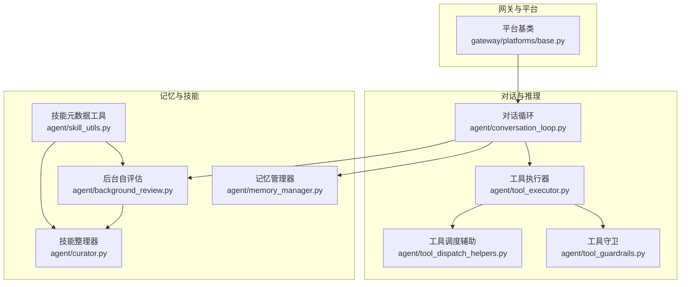
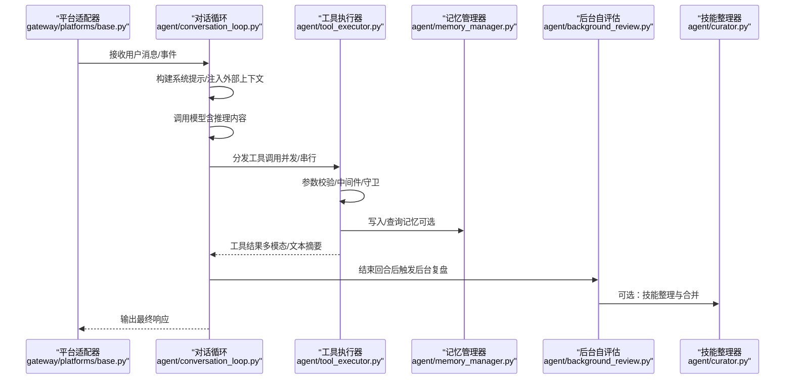
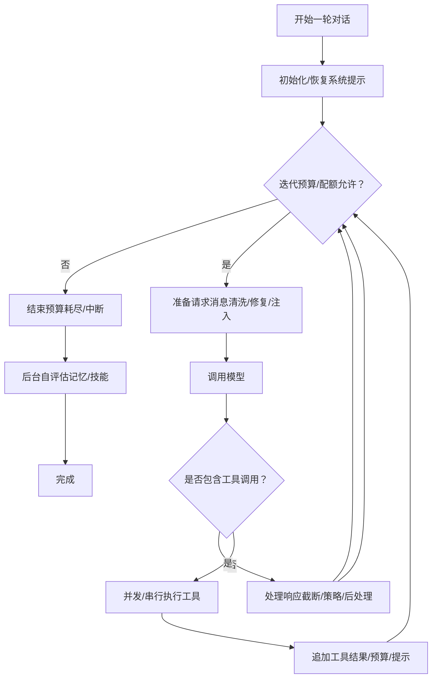
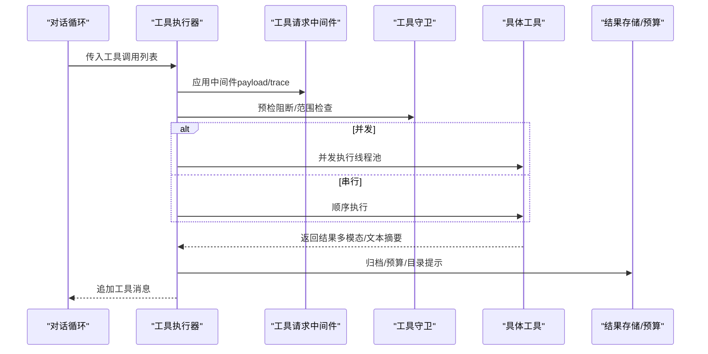
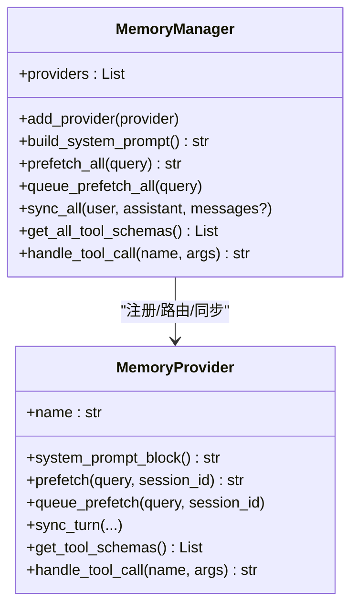
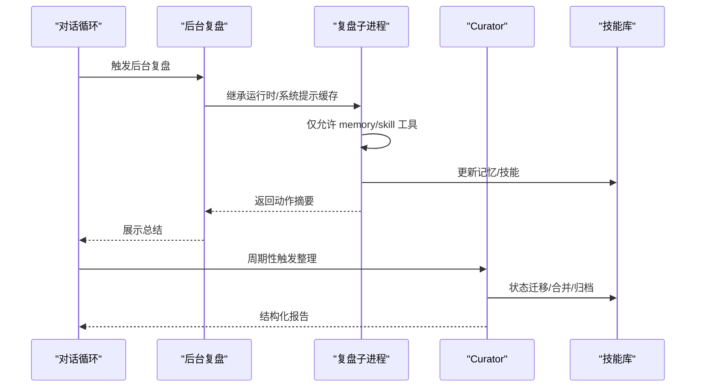
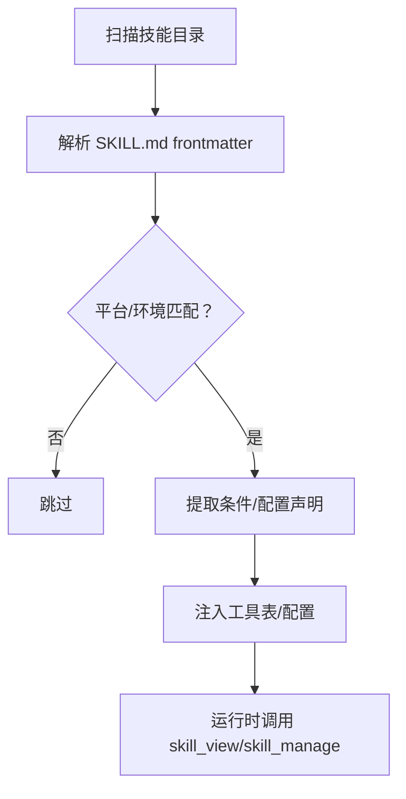
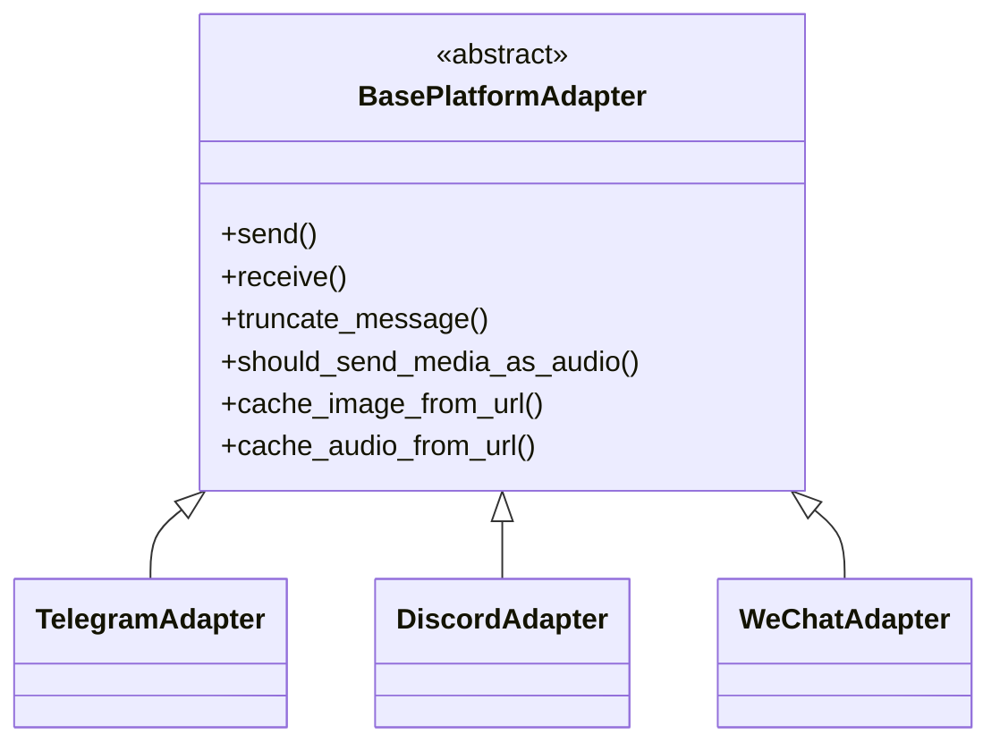
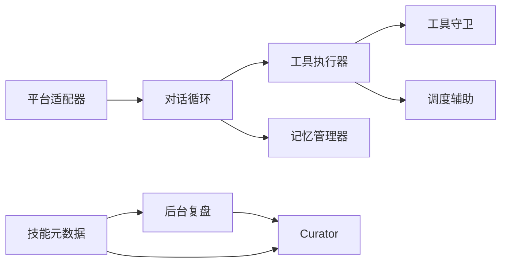

# 核心概念

<cite>
**本文引用的文件**
- [agent/conversation_loop.py](file://agent/conversation_loop.py)
- [agent/memory_manager.py](file://agent/memory_manager.py)
- [agent/tool_executor.py](file://agent/tool_executor.py)
- [agent/tool_guardrails.py](file://agent/tool_guardrails.py)
- [agent/tool_dispatch_helpers.py](file://agent/tool_dispatch_helpers.py)
- [agent/background_review.py](file://agent/background_review.py)
- [agent/curator.py](file://agent/curator.py)
- [agent/skill_utils.py](file://agent/skill_utils.py)
- [gateway/platforms/base.py](file://gateway/platforms/base.py)
</cite>

## 目录
1. [引言](#引言)
2. [项目结构](#项目结构)
3. [核心组件](#核心组件)
4. [架构总览](#架构总览)
5. [详细组件分析](#详细组件分析)
6. [依赖分析](#依赖分析)
7. [性能考量](#性能考量)
8. [故障排查指南](#故障排查指南)
9. [结论](#结论)
10. [附录](#附录)

## 引言
本文件面向开发者与高级用户，系统阐释 Hermes Agent 的核心概念与设计理念：对话循环、工具调用机制、记忆管理、自改进学习循环、程序性知识（技能）的表示与调用、消息网关与多平台集成、以及工具系统的模块化与扩展机制。文档通过分层讲解与图示，帮助不同背景读者快速理解系统内部工作机制。

## 项目结构
Hermes Agent 将“对话编排”“工具执行”“记忆与技能”“平台网关”等能力解耦为多个子域：
- 对话与推理：在对话循环中驱动模型调用、工具调度、重试与压缩、后处理钩子。
- 工具系统：统一的工具注册、并发/串行调度、安全守卫、结果归档与多模态封装。
- 记忆与技能：统一的记忆提供者管理、技能元数据解析与配置注入、后台自评估与整理。
- 网关与平台：抽象的消息平台适配器、代理转发、缓存与媒体处理、代理与网络策略。

**图示来源**
- [agent/conversation_loop.py:469-800](file://agent/conversation_loop.py#L469-L800)
- [agent/tool_executor.py:243-768](file://agent/tool_executor.py#L243-L768)
- [agent/tool_guardrails.py:224-376](file://agent/tool_guardrails.py#L224-L376)
- [agent/tool_dispatch_helpers.py:103-147](file://agent/tool_dispatch_helpers.py#L103-L147)
- [agent/memory_manager.py:313-701](file://agent/memory_manager.py#L313-L701)
- [agent/background_review.py:428-701](file://agent/background_review.py#L428-L701)
- [agent/curator.py:276-332](file://agent/curator.py#L276-L332)
- [agent/skill_utils.py:1-120](file://agent/skill_utils.py#L1-L120)
- [gateway/platforms/base.py:1-120](file://gateway/platforms/base.py#L1-L120)

**章节来源**
- [agent/conversation_loop.py:1-120](file://agent/conversation_loop.py#L1-L120)
- [agent/tool_executor.py:1-120](file://agent/tool_executor.py#L1-L120)
- [agent/memory_manager.py:1-120](file://agent/memory_manager.py#L1-L120)
- [agent/background_review.py:1-60](file://agent/background_review.py#L1-L60)
- [agent/curator.py:1-60](file://agent/curator.py#L1-L60)
- [agent/skill_utils.py:1-60](file://agent/skill_utils.py#L1-L60)
- [gateway/platforms/base.py:1-60](file://gateway/platforms/base.py#L1-L60)

## 核心组件
- 对话循环：负责单轮对话的构建、模型调用、工具批处理、重试与回退、上下文压缩、前后钩子与状态持久化。
- 工具执行器：支持并发/串行工具批处理，参数预处理、中间件、结果归档、多模态封装与目录提示。
- 记忆管理器：统一接入内置与外部记忆提供者，按会话维度进行预取、同步与后台写入，屏蔽多后端差异。
- 自改进学习循环：后台派生子进程对当前回合进行复盘，自动更新记忆与技能，形成持续优化闭环。
- 技能系统：以 SKILL.md 元数据为中心，支持平台/环境过滤、配置变量声明与解析、外部目录扩展。
- 消息网关与平台适配：抽象平台接口，统一线程/代理/媒体缓存/长度限制等跨平台差异。

**章节来源**
- [agent/conversation_loop.py:469-800](file://agent/conversation_loop.py#L469-L800)
- [agent/tool_executor.py:243-768](file://agent/tool_executor.py#L243-L768)
- [agent/memory_manager.py:313-701](file://agent/memory_manager.py#L313-L701)
- [agent/background_review.py:428-701](file://agent/background_review.py#L428-L701)
- [agent/curator.py:276-332](file://agent/curator.py#L276-L332)
- [agent/skill_utils.py:120-220](file://agent/skill_utils.py#L120-L220)
- [gateway/platforms/base.py:1-120](file://gateway/platforms/base.py#L1-L120)

## 架构总览
下图展示从平台事件到对话循环、工具执行、记忆/技能更新与网关回传的关键路径。

**图示来源**
- [gateway/platforms/base.py:1-120](file://gateway/platforms/base.py#L1-L120)
- [agent/conversation_loop.py:469-800](file://agent/conversation_loop.py#L469-L800)
- [agent/tool_executor.py:243-768](file://agent/tool_executor.py#L243-L768)
- [agent/memory_manager.py:313-701](file://agent/memory_manager.py#L313-L701)
- [agent/background_review.py:428-701](file://agent/background_review.py#L428-L701)
- [agent/curator.py:276-332](file://agent/curator.py#L276-L332)

## 详细组件分析

### 对话循环（Conversation Loop）
- 关键职责
  - 单轮初始化：清理/重置计数、注入插件上下文、恢复/构建系统提示、前转压缩、预检回调。
  - 迭代控制：预算/配额检查、中断检测、步回调、/steer 注入、消息序列修复。
  - 请求准备：参数清洗、角色交替修复、推理内容复制、严格 API 清洗、提示缓存注入。
  - 响应后处理：流截断/续传提示、内容策略拒绝回收、工具结果归档、预算与目录提示、/steer 注入。
- 并发与安全
  - 在工具批处理前进行路径冲突检测与破坏性命令识别，避免并发冲突与误删风险。
- 上下文与缓存
  - 支持外部记忆预取注入、插件 pre_llm 钩子、Anthropic 提示缓存布局。

**图示来源**
- [agent/conversation_loop.py:469-800](file://agent/conversation_loop.py#L469-L800)
- [agent/tool_dispatch_helpers.py:103-147](file://agent/tool_dispatch_helpers.py#L103-L147)

**章节来源**
- [agent/conversation_loop.py:469-800](file://agent/conversation_loop.py#L469-L800)
- [agent/tool_dispatch_helpers.py:1-120](file://agent/tool_dispatch_helpers.py#L1-L120)

### 工具执行器（Tool Executor）
- 执行模式
  - 并发批处理：基于路径隔离与工具白名单判定是否可并行；失败时取消未启动任务并优雅退出。
  - 串行执行：逐个工具执行，适合交互式或有状态工具。
- 安全与中间件
  - 工具请求中间件、执行前阻断（插件/守卫）、结果归档与预算约束、错误摘要与多模态文本摘要。
- 多模态与目录提示
  - 统一封装多模态结果，向文本摘要附加子目录提示，确保模型可见。

**图示来源**
- [agent/tool_executor.py:243-768](file://agent/tool_executor.py#L243-L768)
- [agent/tool_guardrails.py:224-376](file://agent/tool_guardrails.py#L224-L376)
- [agent/tool_dispatch_helpers.py:177-235](file://agent/tool_dispatch_helpers.py#L177-L235)

**章节来源**
- [agent/tool_executor.py:243-768](file://agent/tool_executor.py#L243-L768)
- [agent/tool_guardrails.py:1-120](file://agent/tool_guardrails.py#L1-L120)
- [agent/tool_dispatch_helpers.py:177-235](file://agent/tool_dispatch_helpers.py#L177-L235)

### 记忆管理器（Memory Manager）
- 统一入口
  - 注册内置与最多一个外部记忆提供者；提供系统提示拼接、预取、同步与后台写入。
- 工具路由
  - 将外部提供者的工具 schema 注入到工具表，按名称路由至对应提供者。
- 后台一致性
  - 使用单线程后台执行器保证写入顺序，避免竞态；支持刷新等待与异常降级。

**图示来源**
- [agent/memory_manager.py:313-701](file://agent/memory_manager.py#L313-L701)

**章节来源**
- [agent/memory_manager.py:313-701](file://agent/memory_manager.py#L313-L701)

### 自改进学习循环（Background Review + Curator）
- 后台复盘
  - 结束回合后派生子进程，继承父进程运行时与系统提示缓存，仅允许 memory/skill 工具，复盘记忆与技能更新点，汇总动作摘要。
- 技能整理器（Curator）
  - 周期性地对 agent 创建的技能进行生命周期状态迁移（活跃/陈旧/归档），可选进行“伞形技能”合并与去重，输出结构化报告供下游决策。

**图示来源**
- [agent/background_review.py:428-701](file://agent/background_review.py#L428-L701)
- [agent/curator.py:276-332](file://agent/curator.py#L276-L332)

**章节来源**
- [agent/background_review.py:1-200](file://agent/background_review.py#L1-L200)
- [agent/curator.py:1-120](file://agent/curator.py#L1-L120)

### 程序性知识（技能）的表示与调用
- 表示与发现
  - 以 SKILL.md 为根，支持 YAML frontmatter 声明平台/环境/条件/配置变量；扫描本地与外部目录，排除支持目录与隐藏项。
- 条件与配置
  - 解析 hermes.metadata 中的 fallback/requires 与 config 声明，统一注入到配置与显示层。
- 调用与管理
  - 通过 skill_view/skills_list 读取，skill_manage 写入/修补/删除/归档；与 Curator 协作进行合并与去重。

**图示来源**
- [agent/skill_utils.py:120-220](file://agent/skill_utils.py#L120-L220)
- [agent/skill_utils.py:592-629](file://agent/skill_utils.py#L592-L629)

**章节来源**
- [agent/skill_utils.py:120-220](file://agent/skill_utils.py#L120-L220)
- [agent/skill_utils.py:592-629](file://agent/skill_utils.py#L592-L629)

### 消息网关与多平台集成
- 平台适配器
  - 统一抽象平台接口，处理线程/话题/回复锚点、长度限制（UTF-16）、代理/SSRF/图片/音频缓存等跨平台差异。
- 网关转发
  - 将平台事件转换为内部消息，注入会话上下文，再交由对话循环处理。

**图示来源**
- [gateway/platforms/base.py:1-120](file://gateway/platforms/base.py#L1-L120)

**章节来源**
- [gateway/platforms/base.py:1-120](file://gateway/platforms/base.py#L1-L120)

## 依赖分析
- 组件内聚与耦合
  - 对话循环与工具执行器通过消息与工具表强耦合；工具执行器依赖守卫与调度辅助；记忆管理器作为单一入口与外部提供者解耦。
- 外部依赖
  - 平台适配器依赖 httpx/proxy/url_safety 等；工具执行器依赖线程池与中间件链；记忆管理器依赖提供者协议。
- 循环与风险
  - 后台复盘与 Curator 通过子进程避免与前台主循环共享状态；工具执行器对并发工具批的路径隔离降低竞态风险。

**图示来源**
- [agent/conversation_loop.py:469-800](file://agent/conversation_loop.py#L469-L800)
- [agent/tool_executor.py:243-768](file://agent/tool_executor.py#L243-L768)
- [agent/tool_guardrails.py:224-376](file://agent/tool_guardrails.py#L224-L376)
- [agent/tool_dispatch_helpers.py:103-147](file://agent/tool_dispatch_helpers.py#L103-L147)
- [agent/memory_manager.py:313-701](file://agent/memory_manager.py#L313-L701)
- [agent/background_review.py:428-701](file://agent/background_review.py#L428-L701)
- [agent/curator.py:276-332](file://agent/curator.py#L276-L332)
- [agent/skill_utils.py:120-220](file://agent/skill_utils.py#L120-L220)
- [gateway/platforms/base.py:1-120](file://gateway/platforms/base.py#L1-L120)

**章节来源**
- [agent/conversation_loop.py:469-800](file://agent/conversation_loop.py#L469-L800)
- [agent/tool_executor.py:243-768](file://agent/tool_executor.py#L243-L768)
- [agent/memory_manager.py:313-701](file://agent/memory_manager.py#L313-L701)
- [agent/background_review.py:428-701](file://agent/background_review.py#L428-L701)
- [agent/curator.py:276-332](file://agent/curator.py#L276-L332)
- [agent/skill_utils.py:120-220](file://agent/skill_utils.py#L120-L220)
- [gateway/platforms/base.py:1-120](file://gateway/platforms/base.py#L1-L120)

## 性能考量
- 提示缓存与上下文
  - Anthropic 缓存布局减少输入 token 成本；系统提示缓存与前缀一致避免缓存失效。
- 并发与限流
  - 工具批并发受路径隔离与工具白名单约束；线程池上限与心跳保活避免长时间阻塞。
- 压缩与预算
  - 会话压缩与工具结果预算限制降低内存与带宽压力；后台刷新与超时保护避免阻塞。
- 媒体缓存
  - 图片/音频本地缓存减少上游不稳定链接带来的重试成本与延迟。

[本节为通用指导，不直接分析具体文件]

## 故障排查指南
- 工具循环阻断
  - 守卫根据重复失败/无进展阈值发出警告或硬停；查看工具名、计数与签名元数据定位问题。
- 并发批失败
  - 检查路径重叠、破坏性命令模式、非并行工具混入；必要时降级为串行执行。
- 记忆写入异常
  - 查看提供者同步异常日志与后台执行器状态；确认会话 ID 与写入元数据。
- 平台媒体问题
  - 检查图片/音频缓存目录权限与 SSRF 保护；确认代理设置与 NO_PROXY 规则。

**章节来源**
- [agent/tool_guardrails.py:224-376](file://agent/tool_guardrails.py#L224-L376)
- [agent/tool_dispatch_helpers.py:79-147](file://agent/tool_dispatch_helpers.py#L79-L147)
- [agent/memory_manager.py:515-572](file://agent/memory_manager.py#L515-L572)
- [gateway/platforms/base.py:541-556](file://gateway/platforms/base.py#L541-L556)

## 结论
Hermes Agent 通过“对话循环 + 工具执行 + 记忆/技能 + 网关平台”的清晰分层，实现了可扩展、可观测、可自改进的智能体架构。其核心在于：
- 以对话循环为中心的稳健控制流；
- 以工具守卫与调度辅助为核心的并发与安全；
- 以记忆管理器与后台复盘/Curator 为核心的持续学习；
- 以平台适配器与媒体缓存为核心的多平台一致性。

[本节为总结性内容，不直接分析具体文件]

## 附录
- 代码片段路径示例（用于定位实现）
  - 对话循环主流程：[run_conversation:469-800](file://agent/conversation_loop.py#L469-L800)
  - 并发工具批处理：[execute_tool_calls_concurrent:243-768](file://agent/tool_executor.py#L243-L768)
  - 工具守卫决策：[ToolCallGuardrailController:224-376](file://agent/tool_guardrails.py#L224-L376)
  - 记忆提供者注册与路由：[MemoryManager:334-398](file://agent/memory_manager.py#L334-L398)
  - 后台复盘与动作汇总：[spawn_background_review_thread:675-701](file://agent/background_review.py#L675-L701)
  - Curator 状态迁移与报告：[apply_automatic_transitions:276-332](file://agent/curator.py#L276-L332)
  - 技能元数据解析与配置注入：[skill_utils:120-220](file://agent/skill_utils.py#L120-L220)
  - 平台适配器基础能力：[BasePlatformAdapter:1-120](file://gateway/platforms/base.py#L1-L120)

[本节为索引性内容，不直接分析具体文件]