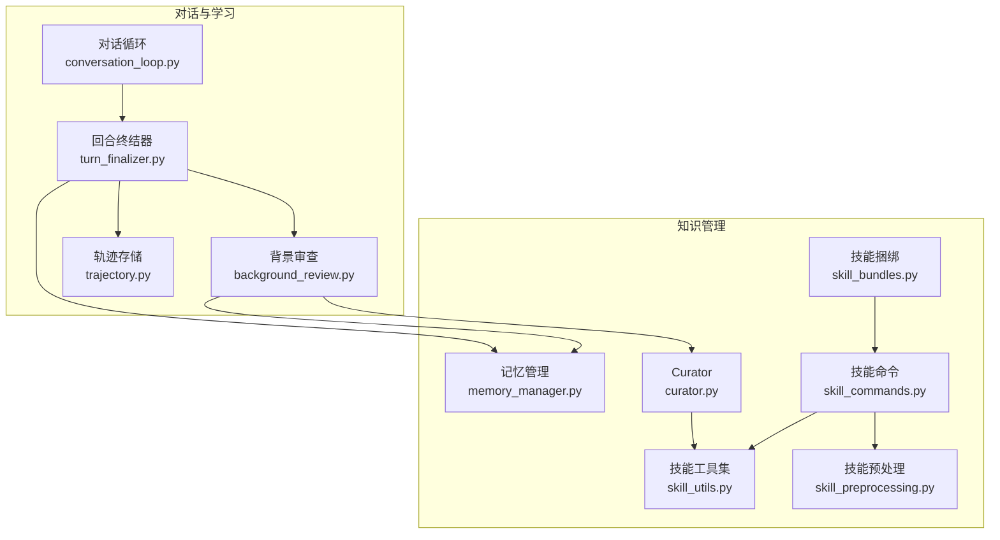
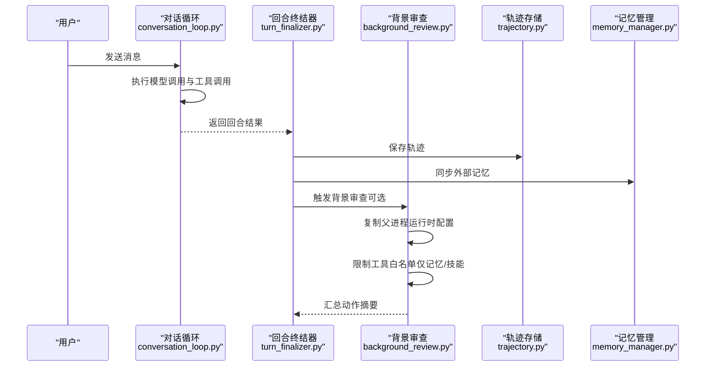
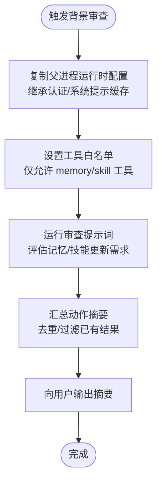
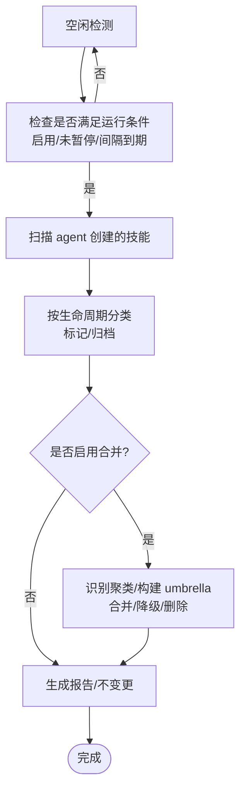
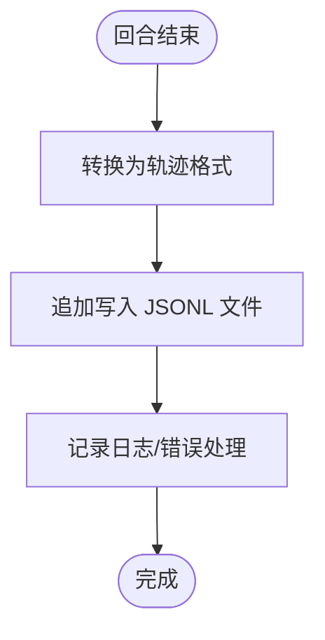
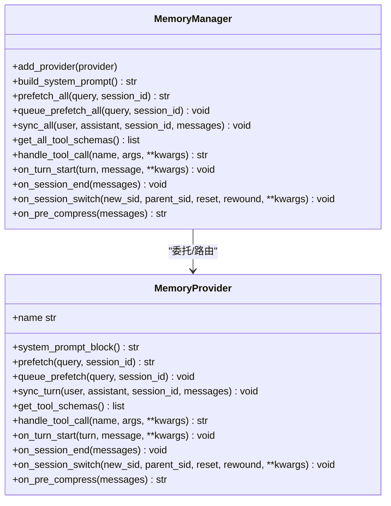
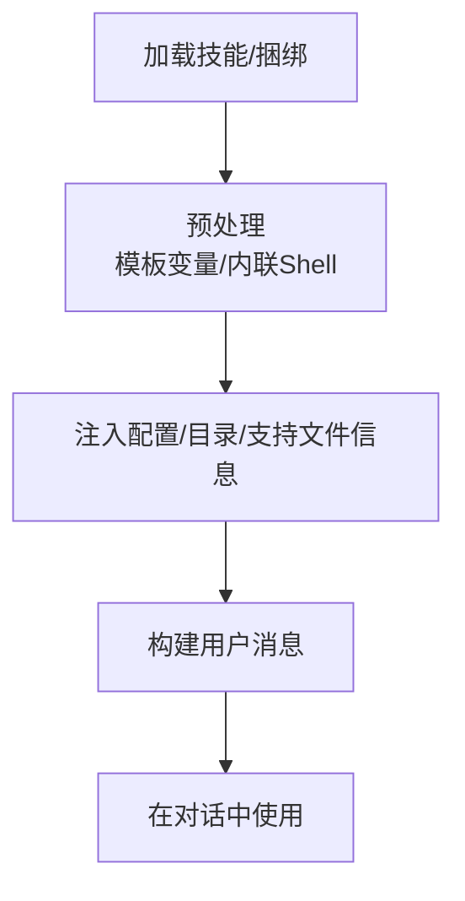
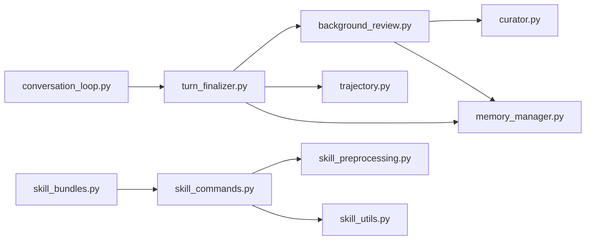

# 自改进学习循环

<cite>
**本文档引用的文件**
- [background_review.py](file://agent/background_review.py)
- [curator.py](file://agent/curator.py)
- [trajectory.py](file://agent/trajectory.py)
- [conversation_loop.py](file://agent/conversation_loop.py)
- [turn_finalizer.py](file://agent/turn_finalizer.py)
- [memory_manager.py](file://agent/memory_manager.py)
- [skill_utils.py](file://agent/skill_utils.py)
- [skill_preprocessing.py](file://agent/skill_preprocessing.py)
- [skill_commands.py](file://agent/skill_commands.py)
- [skill_bundles.py](file://agent/skill_bundles.py)
</cite>

## 目录
1. [引言](#引言)
2. [项目结构](#项目结构)
3. [核心组件](#核心组件)
4. [架构总览](#架构总览)
5. [详细组件分析](#详细组件分析)
6. [依赖分析](#依赖分析)
7. [性能考虑](#性能考虑)
8. [故障排除指南](#故障排除指南)
9. [结论](#结论)
10. [附录](#附录)

## 引言
本文件系统化阐述 Hermes Agent 的自改进学习循环机制，重点覆盖以下方面：
- 代理如何从每次对话经验中学习并迭代优化
- 背景审查与轨迹分析在学习中的作用
- 学习循环的数据采集、分析评估与技能优化流程
- 元学习能力、自我反思机制与持续改进策略
- 学习效果的量化评估、质量控制与风险管理
- 自改进示例与扩展学习能力的开发指南

## 项目结构
Hermes Agent 将“自改进学习循环”拆解为多个协同模块：
- 对话循环与后处理：负责单轮对话的执行、资源清理、轨迹保存与触发背景审查
- 背景审查：在后台线程中复盘对话，更新记忆与技能库
- Curator（技能维护者）：周期性地对技能库进行自动归档、合并与优化
- 轨迹存储：将对话历史持久化为可分析的轨迹数据
- 记忆管理：统一接入外部记忆提供方，确保学习内容被正确沉淀
- 技能工具链：技能加载、预处理、命令解析与捆绑加载

**图表来源**
- [conversation_loop.py:469-800](file://agent/conversation_loop.py#L469-L800)
- [turn_finalizer.py:30-429](file://agent/turn_finalizer.py#L30-L429)
- [background_review.py:675-711](file://agent/background_review.py#L675-L711)
- [trajectory.py:30-57](file://agent/trajectory.py#L30-L57)
- [memory_manager.py:313-949](file://agent/memory_manager.py#L313-L949)
- [curator.py:1-200](file://agent/curator.py#L1-L200)
- [skill_utils.py:1-200](file://agent/skill_utils.py#L1-L200)
- [skill_preprocessing.py:1-141](file://agent/skill_preprocessing.py#L1-L141)
- [skill_commands.py:1-200](file://agent/skill_commands.py#L1-L200)
- [skill_bundles.py:1-120](file://agent/skill_bundles.py#L1-L120)

**章节来源**
- [conversation_loop.py:469-800](file://agent/conversation_loop.py#L469-L800)
- [turn_finalizer.py:30-429](file://agent/turn_finalizer.py#L30-L429)
- [background_review.py:675-711](file://agent/background_review.py#L675-L711)
- [trajectory.py:30-57](file://agent/trajectory.py#L30-L57)
- [memory_manager.py:313-949](file://agent/memory_manager.py#L313-L949)
- [curator.py:1-200](file://agent/curator.py#L1-L200)
- [skill_utils.py:1-200](file://agent/skill_utils.py#L1-L200)
- [skill_preprocessing.py:1-141](file://agent/skill_preprocessing.py#L1-L141)
- [skill_commands.py:1-200](file://agent/skill_commands.py#L1-L200)
- [skill_bundles.py:1-120](file://agent/skill_bundles.py#L1-L120)

## 核心组件
- 对话循环与回合终结器：驱动一次完整的对话，负责资源清理、轨迹保存、触发背景审查与外部记忆同步
- 背景审查：在后台线程中复盘对话，基于预设提示词评估是否需要更新记忆或技能，并生成简洁的动作摘要
- Curator：周期性扫描技能库，按生命周期状态自动归档/合并/优化技能，支持干跑模式与结构化报告
- 轨迹存储：将对话转换为标准格式并写入 JSONL 文件，便于后续离线分析与再训练
- 记忆管理：统一接入外部记忆提供方，确保学习内容被正确沉淀与同步
- 技能工具链：提供技能加载、预处理、命令解析与捆绑加载，支撑“类级技能”的知识组织

**章节来源**
- [conversation_loop.py:469-800](file://agent/conversation_loop.py#L469-L800)
- [turn_finalizer.py:30-429](file://agent/turn_finalizer.py#L30-L429)
- [background_review.py:1-200](file://agent/background_review.py#L1-L200)
- [curator.py:1-200](file://agent/curator.py#L1-L200)
- [trajectory.py:30-57](file://agent/trajectory.py#L30-L57)
- [memory_manager.py:313-949](file://agent/memory_manager.py#L313-L949)
- [skill_utils.py:1-200](file://agent/skill_utils.py#L1-L200)
- [skill_preprocessing.py:1-141](file://agent/skill_preprocessing.py#L1-L141)
- [skill_commands.py:1-200](file://agent/skill_commands.py#L1-L200)
- [skill_bundles.py:1-120](file://agent/skill_bundles.py#L1-L120)

## 架构总览
下图展示自改进学习循环的关键交互路径：对话结束后由回合终结器触发背景审查；背景审查在独立线程中运行，使用与主线程一致的认证与运行时配置，避免泄漏外部状态；同时，轨迹被持久化以便后续分析。

**图表来源**
- [conversation_loop.py:469-800](file://agent/conversation_loop.py#L469-L800)
- [turn_finalizer.py:370-429](file://agent/turn_finalizer.py#L370-L429)
- [background_review.py:428-711](file://agent/background_review.py#L428-L711)
- [trajectory.py:30-57](file://agent/trajectory.py#L30-L57)
- [memory_manager.py:515-572](file://agent/memory_manager.py#L515-L572)

**章节来源**
- [conversation_loop.py:469-800](file://agent/conversation_loop.py#L469-L800)
- [turn_finalizer.py:370-429](file://agent/turn_finalizer.py#L370-L429)
- [background_review.py:428-711](file://agent/background_review.py#L428-L711)
- [trajectory.py:30-57](file://agent/trajectory.py#L30-L57)
- [memory_manager.py:515-572](file://agent/memory_manager.py#L515-L572)

## 详细组件分析

### 组件A：背景审查与自改进触发
背景审查在对话完成后以守护线程方式运行，继承父进程的运行时配置（模型、凭据、系统提示缓存等），确保与主线程一致的上下文与成本开销。它通过专用提示词评估是否需要更新记忆或技能，并将成功动作汇总为简洁摘要反馈给用户。

**图表来源**
- [background_review.py:428-711](file://agent/background_review.py#L428-L711)
- [turn_finalizer.py:390-429](file://agent/turn_finalizer.py#L390-L429)

**章节来源**
- [background_review.py:1-200](file://agent/background_review.py#L1-L200)
- [background_review.py:428-711](file://agent/background_review.py#L428-L711)
- [turn_finalizer.py:390-429](file://agent/turn_finalizer.py#L390-L429)

### 组件B：Curator 技能维护与合并
Curator 在空闲期按配置周期运行，扫描 agent 创建的技能，按生命周期状态自动标记“陈旧/归档”，并可选地执行“类级技能”合并（umbrella-building），将相似技能吸收进更通用的类级技能中，减少碎片化。

**图表来源**
- [curator.py:219-332](file://agent/curator.py#L219-L332)
- [curator.py:365-504](file://agent/curator.py#L365-L504)

**章节来源**
- [curator.py:1-200](file://agent/curator.py#L1-L200)
- [curator.py:219-332](file://agent/curator.py#L219-L332)
- [curator.py:365-504](file://agent/curator.py#L365-L504)

### 组件C：轨迹存储与分析
轨迹存储将对话转换为标准格式并写入 JSONL 文件，包含对话、模型名、完成状态与时间戳。这为后续离线分析、再训练与效果评估提供了基础数据。

**图表来源**
- [trajectory.py:30-57](file://agent/trajectory.py#L30-L57)
- [turn_finalizer.py:130-140](file://agent/turn_finalizer.py#L130-L140)

**章节来源**
- [trajectory.py:30-57](file://agent/trajectory.py#L30-L57)
- [turn_finalizer.py:130-140](file://agent/turn_finalizer.py#L130-L140)

### 组件D：记忆管理与外部提供方集成
记忆管理器统一接入外部记忆提供方，确保学习内容被正确沉淀与同步。它在回合结束后异步同步，并在必要时注入系统提示块，保证上下文一致性。

**图表来源**
- [memory_manager.py:313-949](file://agent/memory_manager.py#L313-L949)

**章节来源**
- [memory_manager.py:313-949](file://agent/memory_manager.py#L313-L949)

### 组件E：技能工具链与类级知识组织
技能工具链负责技能加载、预处理（模板变量替换、内联 Shell 扩展）、命令解析与捆绑加载，支撑“类级技能”的知识组织与复用。

**图表来源**
- [skill_commands.py:138-204](file://agent/skill_commands.py#L138-L204)
- [skill_preprocessing.py:124-141](file://agent/skill_preprocessing.py#L124-L141)
- [skill_bundles.py:253-341](file://agent/skill_bundles.py#L253-L341)

**章节来源**
- [skill_commands.py:138-204](file://agent/skill_commands.py#L138-L204)
- [skill_preprocessing.py:124-141](file://agent/skill_preprocessing.py#L124-L141)
- [skill_bundles.py:253-341](file://agent/skill_bundles.py#L253-L341)

## 依赖分析
- 对话循环与回合终结器：依赖轨迹存储与记忆管理，触发背景审查
- 背景审查：依赖工具白名单与运行时配置，避免外部副作用
- Curator：依赖技能使用统计与生命周期状态，执行合并/归档
- 技能工具链：依赖配置与文件系统，支撑技能加载与预处理

**图表来源**
- [conversation_loop.py:469-800](file://agent/conversation_loop.py#L469-L800)
- [turn_finalizer.py:370-429](file://agent/turn_finalizer.py#L370-L429)
- [background_review.py:675-711](file://agent/background_review.py#L675-L711)
- [curator.py:1-200](file://agent/curator.py#L1-L200)
- [trajectory.py:30-57](file://agent/trajectory.py#L30-L57)
- [memory_manager.py:313-949](file://agent/memory_manager.py#L313-L949)
- [skill_commands.py:1-200](file://agent/skill_commands.py#L1-L200)
- [skill_preprocessing.py:1-141](file://agent/skill_preprocessing.py#L1-L141)
- [skill_bundles.py:1-120](file://agent/skill_bundles.py#L1-L120)

**章节来源**
- [conversation_loop.py:469-800](file://agent/conversation_loop.py#L469-L800)
- [turn_finalizer.py:370-429](file://agent/turn_finalizer.py#L370-L429)
- [background_review.py:675-711](file://agent/background_review.py#L675-L711)
- [curator.py:1-200](file://agent/curator.py#L1-L200)
- [trajectory.py:30-57](file://agent/trajectory.py#L30-L57)
- [memory_manager.py:313-949](file://agent/memory_manager.py#L313-L949)
- [skill_commands.py:1-200](file://agent/skill_commands.py#L1-L200)
- [skill_preprocessing.py:1-141](file://agent/skill_preprocessing.py#L1-L141)
- [skill_bundles.py:1-120](file://agent/skill_bundles.py#L1-L120)

## 性能考虑
- 背景审查线程隔离：通过继承父进程运行时配置与工具白名单，避免额外网络请求与外部副作用，降低对主线程的影响
- 前缀缓存复用：背景审查线程复用系统提示缓存键，显著降低重复请求成本
- 异步记忆同步：记忆管理器使用单工作线程串行化写入，避免竞争与阻塞
- 轨迹写入：JSONL 追加写入，避免大文件重写，降低 IO 压力

[本节为通用指导，无需特定文件引用]

## 故障排除指南
- 背景审查失败：记录警告日志并回退，不影响主对话流程
- 记忆提供方异常：单提供方失败不影响其他提供方，日志记录后继续运行
- 轨迹保存失败：记录警告并跳过，不影响对话完成
- Curator 合并冲突：优先采用模型声明的吸收目标，其次使用启发式规则与结构化 YAML 块

**章节来源**
- [background_review.py:643-673](file://agent/background_review.py#L643-L673)
- [memory_manager.py:565-570](file://agent/memory_manager.py#L565-L570)
- [trajectory.py:51-57](file://agent/trajectory.py#L51-L57)
- [curator.py:754-800](file://agent/curator.py#L754-L800)

## 结论
Hermes Agent 的自改进学习循环通过“对话-审查-沉淀-维护”的闭环实现持续优化：对话循环提供丰富的经验数据，背景审查与 Curator 分别承担即时学习与长期治理，轨迹存储与记忆管理保障数据与知识的可靠沉淀。该机制在保证主线程性能的同时，实现了稳健的质量控制与风险管理。

[本节为总结性内容，无需特定文件引用]

## 附录

### 自改进示例
- 示例1：用户纠正风格偏好
  - 触发点：用户明确表达对风格/格式/语气的偏好
  - 背景审查动作：更新相关技能的“偏好嵌入”部分，避免未来重复出现同样问题
  - Curator 合并：若多个技能覆盖同一偏好，将其吸收进类级 umbrella 并在 references 中保留具体案例
- 示例2：修复工具使用路径
  - 触发点：某技能在使用过程中暴露了调试路径或临时 workaround
  - 背景审查动作：将有效路径写入 references 或 templates，形成可复用的知识片段
  - Curator 合并：将临时 workaround 降级为 references 下的支持文件，保持 umbrella 的简洁性

[本节为概念性说明，无需特定文件引用]

### 扩展学习能力的开发指南
- 新增背景审查信号
  - 在背景审查提示词中新增信号类别与优先级，确保“先修补现有技能，再创建新 umbrella”
  - 使用受保护技能列表避免破坏内置/Hub 安装的技能
- 优化 Curator 合并策略
  - 基于内容相似度而非使用计数判断合并，提升合并质量
  - 引入结构化 YAML 块，确保合并/归档决策可审计
- 提升轨迹分析能力
  - 在轨迹中增加更多上下文元数据（如工具调用序列、错误类型），便于离线分析
  - 支持增量压缩与版本迁移，降低长期存储成本
- 加强质量控制
  - 引入“干跑”模式（dry-run）在 Curator 合并前生成可审阅的报告
  - 增加“文件变异验证器”在回合结束时自动标注未成功的文件修改操作

[本节为通用指导，无需特定文件引用]