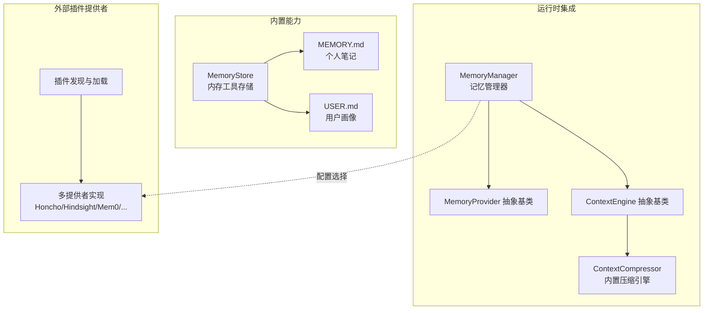
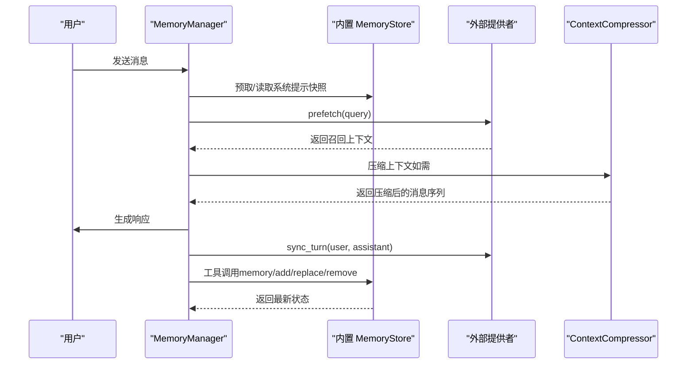
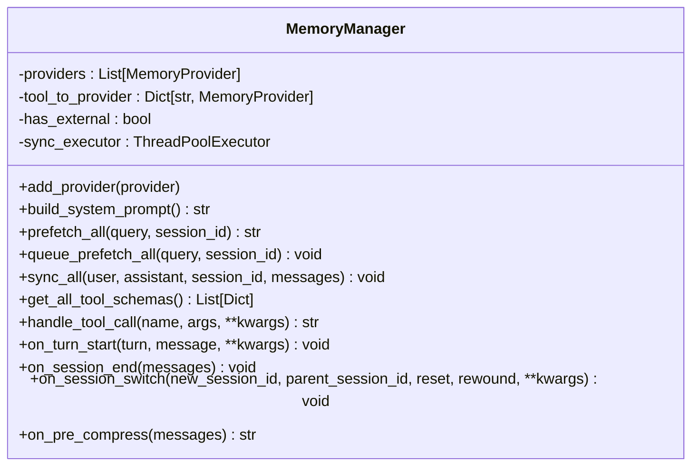
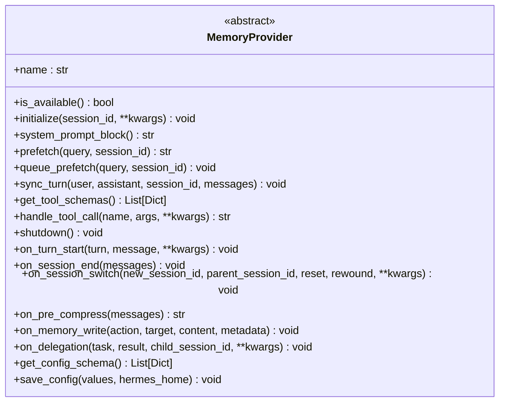
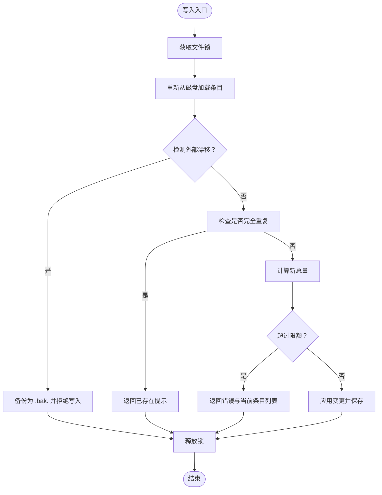
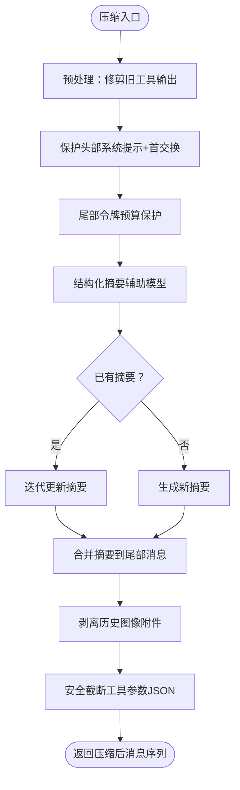
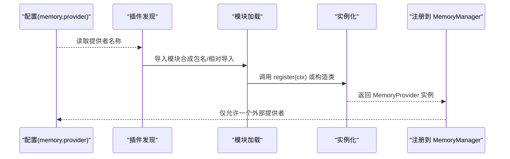
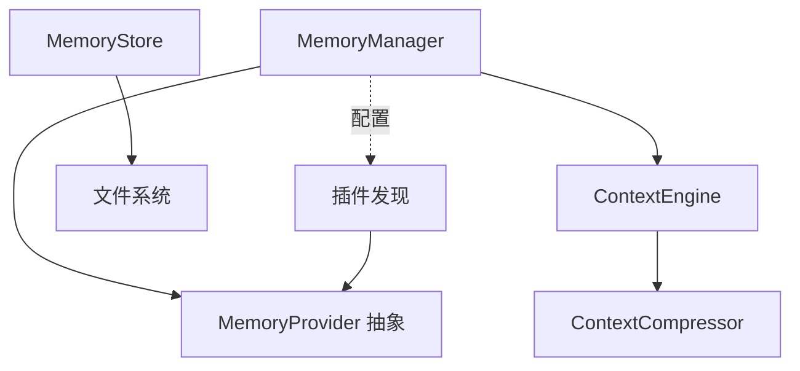

# 记忆管理系统

<cite>
**本文档引用的文件**
- [memory_manager.py](file://agent/memory_manager.py)
- [memory_provider.py](file://agent/memory_provider.py)
- [memory_tool.py](file://tools/memory_tool.py)
- [context_engine.py](file://agent/context_engine.py)
- [context_compressor.py](file://agent/context_compressor.py)
- [plugins_memory_init.py](file://plugins/memory/__init__.py)
</cite>

## 目录
1. [引言](#引言)
2. [项目结构](#项目结构)
3. [核心组件](#核心组件)
4. [架构总览](#架构总览)
5. [详细组件分析](#详细组件分析)
6. [依赖关系分析](#依赖关系分析)
7. [性能考虑](#性能考虑)
8. [故障排除指南](#故障排除指南)
9. [结论](#结论)
10. [附录](#附录)

## 引言
本文件全面解析 Hermes Agent 的记忆管理系统设计与实现，涵盖短期记忆、长期记忆、上下文记忆的类型划分与职责边界；存储机制与检索策略；压缩算法、去重机制与持久化方案；增量更新、版本控制与备份恢复；以及优化策略、性能调优与容量管理。文档同时提供可操作的记忆使用示例与最佳实践，帮助开发者合理利用并扩展记忆功能。

## 项目结构
记忆系统由“内置工具”和“外部插件提供者”两部分组成：
- 内置工具：提供本地文件型短期/用户画像记忆，注入系统提示词快照，支持原子写入与威胁扫描。
- 外部插件提供者：通过统一抽象接口注册，按配置启用单一外部提供者，负责跨会话的长期记忆与检索。

图示来源
- [memory_manager.py:313-800](file://agent/memory_manager.py#L313-L800)
- [memory_provider.py:42-297](file://agent/memory_provider.py#L42-L297)
- [context_engine.py:32-227](file://agent/context_engine.py#L32-L227)
- [context_compressor.py:593-800](file://agent/context_compressor.py#L593-L800)
- [memory_tool.py:113-607](file://tools/memory_tool.py#L113-L607)
- [plugins_memory_init.py:146-317](file://plugins/memory/__init__.py#L146-L317)

章节来源
- [memory_manager.py:1-100](file://agent/memory_manager.py#L1-L100)
- [memory_provider.py:1-100](file://agent/memory_provider.py#L1-L100)
- [memory_tool.py:1-120](file://tools/memory_tool.py#L1-L120)
- [context_engine.py:1-100](file://agent/context_engine.py#L1-L100)
- [context_compressor.py:1-120](file://agent/context_compressor.py#L1-L120)
- [plugins_memory_init.py:1-120](file://plugins/memory/__init__.py#L1-L120)

## 核心组件
- MemoryManager：统一编排内置与外部记忆提供者，负责系统提示拼装、预取召回、回合同步、工具路由与生命周期钩子。
- MemoryProvider：抽象外部插件提供者的统一接口，定义可用性检查、初始化、系统提示块、预取、回合同步、工具模式等。
- MemoryStore：内置工具的文件型存储，提供去重、容量限制、威胁扫描、原子写入与系统提示快照冻结。
- ContextEngine/ContextCompressor：上下文压缩引擎，内置默认压缩器，负责令牌预算、保护头尾、结构化摘要与迭代更新。
- 插件发现与加载：扫描内置与用户安装目录，按配置选择单一外部提供者。

章节来源
- [memory_manager.py:313-800](file://agent/memory_manager.py#L313-L800)
- [memory_provider.py:42-297](file://agent/memory_provider.py#L42-L297)
- [memory_tool.py:113-607](file://tools/memory_tool.py#L113-L607)
- [context_engine.py:32-227](file://agent/context_engine.py#L32-L227)
- [context_compressor.py:593-800](file://agent/context_compressor.py#L593-L800)
- [plugins_memory_init.py:146-317](file://plugins/memory/__init__.py#L146-L317)

## 架构总览
记忆系统采用“内置工具 + 外部插件提供者”的双层架构：
- 内置层：MemoryStore 提供稳定、可审计、可冻结的系统提示快照，保证前缀缓存命中率；工具调用即时落盘，不改变系统提示。
- 外部层：MemoryProvider 抽象统一外部提供者，MemoryManager 负责注册、并发调度与错误隔离；仅允许单一外部提供者激活，避免冲突。
- 上下文层：ContextEngine/ContextCompressor 在接近上下文阈值时进行压缩，保护头部与尾部消息，对中间内容进行结构化摘要。

图示来源
- [memory_manager.py:452-571](file://agent/memory_manager.py#L452-L571)
- [memory_tool.py:666-712](file://tools/memory_tool.py#L666-L712)
- [context_compressor.py:771-800](file://agent/context_compressor.py#L771-L800)

## 详细组件分析

### 组件一：MemoryManager（记忆管理器）
- 注册与约束：只允许一个非内置提供者；拒绝同名工具覆盖；保留核心工具优先级。
- 系统提示构建：收集各提供者的静态提示块，用于冻结快照。
- 预取与队列：在回合开始前预取召回，支持后台排队以避免阻塞。
- 回合同步：在后台线程异步写入，单工作线程串行化，Turn N 先于 Turn N+1 完成。
- 生命周期钩子：通知新回合开始、会话结束、会话切换（含回绕标记）。
- 工具路由：聚合各提供者工具模式，按名称分发到对应提供者。

图示来源
- [memory_manager.py:313-800](file://agent/memory_manager.py#L313-L800)

章节来源
- [memory_manager.py:313-800](file://agent/memory_manager.py#L313-L800)

### 组件二：MemoryProvider（抽象提供者接口）
- 必选方法：is_available、initialize、get_tool_schemas、sync_turn（可选参数 messages）。
- 可选钩子：system_prompt_block、prefetch、queue_prefetch、on_turn_start、on_session_end、on_session_switch、on_pre_compress、on_memory_write、on_delegation、get_config_schema/save_config。
- 设计要点：提供者应避免网络调用于 is_available；支持会话级参数（agent_context、agent_identity、agent_workspace、parent_session_id、user_id 等）。

图示来源
- [memory_provider.py:42-297](file://agent/memory_provider.py#L42-L297)

章节来源
- [memory_provider.py:42-297](file://agent/memory_provider.py#L42-L297)

### 组件三：MemoryStore（内置内存工具存储）
- 存储介质：MEMORY.md（个人笔记）、USER.md（用户画像），分隔符为“§”，字符计数而非令牌计数。
- 文件安全：原子替换写入，文件锁保障并发一致性；检测外部漂移（非工具格式或超限条目）并备份至 .bak.<ts>。
- 威胁扫描：严格范围扫描，禁止注入/外泄模式进入系统提示快照；运行时仍保留原始条目以便用户删除。
- 去重与限额：加载时去重；添加/替换前计算新总量，超过限额返回错误信息与建议。
- 系统提示冻结：加载时捕获快照，后续变更不影响系统提示，保持前缀缓存稳定。
- 工具接口：add/replace/remove/read，返回 JSON 结果；支持写入审批门禁（可选）。

图示来源
- [memory_tool.py:297-448](file://tools/memory_tool.py#L297-L448)

章节来源
- [memory_tool.py:113-607](file://tools/memory_tool.py#L113-L607)

### 组件四：ContextEngine/ContextCompressor（上下文压缩引擎）
- ContextEngine：定义令牌跟踪、阈值、保护窗口（protect_first_n/protect_last_n）、预检压缩、手动压缩预检、工具模式与状态展示。
- ContextCompressor：内置默认压缩器，执行以下流程：
  - 工具结果修剪（预处理，节省摘要成本）
  - 保护头部与尾部（令牌预算保护）
  - 中间段结构化摘要（辅助模型，比例预算）
  - 迭代更新摘要（多次压缩时保留信息）
  - 媒体附件剥离（历史用户消息中的图片）
  - 工具调用参数安全截断（避免 JSON 不合法）
  - 摘要失败的确定性回退与冷却时间

图示来源
- [context_engine.py:32-227](file://agent/context_engine.py#L32-L227)
- [context_compressor.py:593-800](file://agent/context_compressor.py#L593-L800)

章节来源
- [context_engine.py:32-227](file://agent/context_engine.py#L32-L227)
- [context_compressor.py:593-800](file://agent/context_compressor.py#L593-L800)

### 组件五：插件发现与加载（外部提供者）
- 扫描路径：内置 plugins/memory/<name>/ 与用户 $HERMES_HOME/plugins/<name>/，内置优先。
- 加载方式：支持 register(ctx) 或直接实例化 MemoryProvider 子类；相对导入通过合成包名解决。
- CLI 命令：仅对当前激活的提供者暴露 CLI 子命令。
- 配置选择：通过 config.yaml 的 memory.provider 指定单一外部提供者。

图示来源
- [plugins_memory_init.py:146-317](file://plugins/memory/__init__.py#L146-L317)
- [memory_manager.py:334-398](file://agent/memory_manager.py#L334-L398)

章节来源
- [plugins_memory_init.py:146-317](file://plugins/memory/__init__.py#L146-L317)
- [memory_manager.py:334-398](file://agent/memory_manager.py#L334-L398)

## 依赖关系分析
- MemoryManager 依赖 MemoryProvider 抽象，组合多个提供者并进行工具路由与生命周期协调。
- MemoryStore 独立于外部提供者，直接与文件系统交互，提供内置的短期记忆与系统提示冻结。
- ContextCompressor 依赖 ContextEngine 接口，独立于具体提供者，负责上下文压缩。
- 插件发现模块负责外部提供者的动态加载与注册，受配置驱动。

图示来源
- [memory_manager.py:313-800](file://agent/memory_manager.py#L313-L800)
- [memory_provider.py:42-297](file://agent/memory_provider.py#L42-L297)
- [memory_tool.py:113-607](file://tools/memory_tool.py#L113-L607)
- [context_engine.py:32-227](file://agent/context_engine.py#L32-L227)
- [context_compressor.py:593-800](file://agent/context_compressor.py#L593-L800)
- [plugins_memory_init.py:146-317](file://plugins/memory/__init__.py#L146-L317)

章节来源
- [memory_manager.py:313-800](file://agent/memory_manager.py#L313-L800)
- [memory_provider.py:42-297](file://agent/memory_provider.py#L42-L297)
- [memory_tool.py:113-607](file://tools/memory_tool.py#L113-L607)
- [context_engine.py:32-227](file://agent/context_engine.py#L32-L227)
- [context_compressor.py:593-800](file://agent/context_compressor.py#L593-L800)
- [plugins_memory_init.py:146-317](file://plugins/memory/__init__.py#L146-L317)

## 性能考虑
- 后台同步与串行化：MemoryManager 使用单工作线程后台执行同步，避免慢提供者阻塞主流程；Turn N 先于 Turn N+1 完成。
- 预取与队列：prefetch_all 支持后台队列，减少每回合等待时间。
- 压缩预算与迭代更新：ContextCompressor 采用比例摘要预算与迭代更新，降低重复摘要成本；媒体剥离减少传输体积。
- 文件写入原子性：MemoryStore 使用临时文件 + 原子替换，避免并发读取空文件风险。
- 威胁扫描与参数截断：防止无效 JSON 与大参数导致摘要失败或下游报错。

章节来源
- [memory_manager.py:515-642](file://agent/memory_manager.py#L515-L642)
- [context_compressor.py:771-800](file://agent/context_compressor.py#L771-L800)
- [memory_tool.py:577-607](file://tools/memory_tool.py#L577-L607)

## 故障排除指南
- 外部漂移与备份：当检测到非工具格式或条目超限，自动备份为 .bak.<ts>，拒绝写入以避免静默数据丢失。
- 写入审批门禁：启用时写入会被暂存，需经批准后回放；未启用时直接写入。
- 提供者冲突：仅允许一个外部提供者；重复注册会记录警告并忽略。
- 摘要失败回退：摘要生成失败时采用确定性回退与冷却时间，避免无限重试影响体验。
- 流式上下文清洗：StreamingContextScrubber 保证流式输出中不泄露被截断的上下文标签与内部注释。

章节来源
- [memory_tool.py:83-110](file://tools/memory_tool.py#L83-L110)
- [memory_manager.py:334-398](file://agent/memory_manager.py#L334-L398)
- [context_compressor.py:164-170](file://agent/context_compressor.py#L164-L170)
- [memory_manager.py:131-294](file://agent/memory_manager.py#L131-L294)

## 结论
Hermes 的记忆系统通过“内置工具 + 外部提供者 + 上下文压缩”的分层设计，在保证稳定性与安全性的同时，提供了灵活的扩展能力。内置 MemoryStore 以文件持久化与系统提示冻结确保前缀缓存效率；外部提供者通过统一接口接入，受配置与工具名唯一性约束；ContextCompressor 则在接近上下文阈值时进行结构化压缩，兼顾信息完整性与性能。整体设计强调并发安全、错误隔离与可观测性，适合在生产环境中长期演进。

## 附录

### 记忆类型与职责
- 短期记忆（内置）：MEMORY.md/USER.md，注入系统提示快照，工具调用即时落盘，不改变系统提示。
- 长期记忆（外部提供者）：由 MemoryProvider 实现，跨会话持久化，支持检索与工具调用。
- 上下文记忆（压缩）：ContextCompressor 对历史消息进行结构化摘要与保护性裁剪，维持活跃消息可见性。

章节来源
- [memory_tool.py:1-120](file://tools/memory_tool.py#L1-L120)
- [memory_provider.py:1-100](file://agent/memory_provider.py#L1-L100)
- [context_engine.py:1-100](file://agent/context_engine.py#L1-L100)

### 存储机制与检索策略
- 存储机制：MemoryStore 使用原子替换写入，文件锁保障并发；外部提供者由 MemoryProvider 自行实现（如 Hindsight/Honcho/Mem0 等）。
- 检索策略：MemoryManager 在回合前调用 prefetch，聚合各提供者返回的上下文；系统提示块由 system_prompt_block 组合。

章节来源
- [memory_tool.py:577-607](file://tools/memory_tool.py#L577-L607)
- [memory_manager.py:452-472](file://agent/memory_manager.py#L452-L472)

### 压缩算法与去重机制
- 压缩算法：ContextCompressor 采用工具结果修剪、保护头尾、结构化摘要、迭代更新与媒体剥离；摘要失败有确定性回退。
- 去重机制：MemoryStore 加载时去重；写入前检查完全重复；外部提供者通常具备各自去重策略（由具体实现决定）。

章节来源
- [context_compressor.py:593-800](file://agent/context_compressor.py#L593-L800)
- [memory_tool.py:156-158](file://tools/memory_tool.py#L156-L158)

### 持久化方案与备份恢复
- 内置持久化：MEMORY.md/USER.md，原子写入，异常时抛出明确错误；外部提供者持久化由提供者自行实现。
- 备份恢复：检测到外部漂移时自动备份 .bak.<ts>，拒绝写入并提示修复步骤；摘要失败冷却时间避免频繁重试。

章节来源
- [memory_tool.py:522-575](file://tools/memory_tool.py#L522-L575)
- [context_compressor.py:164-170](file://agent/context_compressor.py#L164-L170)

### 增量更新、版本控制与备份恢复
- 增量更新：MemoryStore 支持 add/replace/remove；外部提供者通过 sync_turn 增量写入。
- 版本控制：MemoryStore 无显式版本号，但通过系统提示冻结与原子写入保证一致性。
- 备份恢复：.bak.<ts> 备份文件可用于人工整合后再写入。

章节来源
- [memory_tool.py:297-448](file://tools/memory_tool.py#L297-L448)

### 使用示例与最佳实践
- 使用内置 memory 工具
  - 添加条目：memory(action=add, target=memory|user, content=...)
  - 替换条目：memory(action=replace, target=..., old_text=..., content=...)
  - 删除条目：memory(action=remove, target=..., old_text=...)
  - 读取条目：memory(action=read, target=memory|user)
- 最佳实践
  - 优先保存用户偏好与环境事实，避免保存临时任务状态（使用会话检索替代）。
  - 当容量接近上限时，先 consolidate/reduce 再新增。
  - 启用写入审批门禁以增强安全性。
  - 仅启用单一外部提供者，避免工具名冲突与写入竞争。
  - 遇到摘要失败，等待冷却时间或手动触发压缩。

章节来源
- [memory_tool.py:666-712](file://tools/memory_tool.py#L666-L712)
- [memory_manager.py:334-398](file://agent/memory_manager.py#L334-L398)
- [context_compressor.py:771-800](file://agent/context_compressor.py#L771-L800)