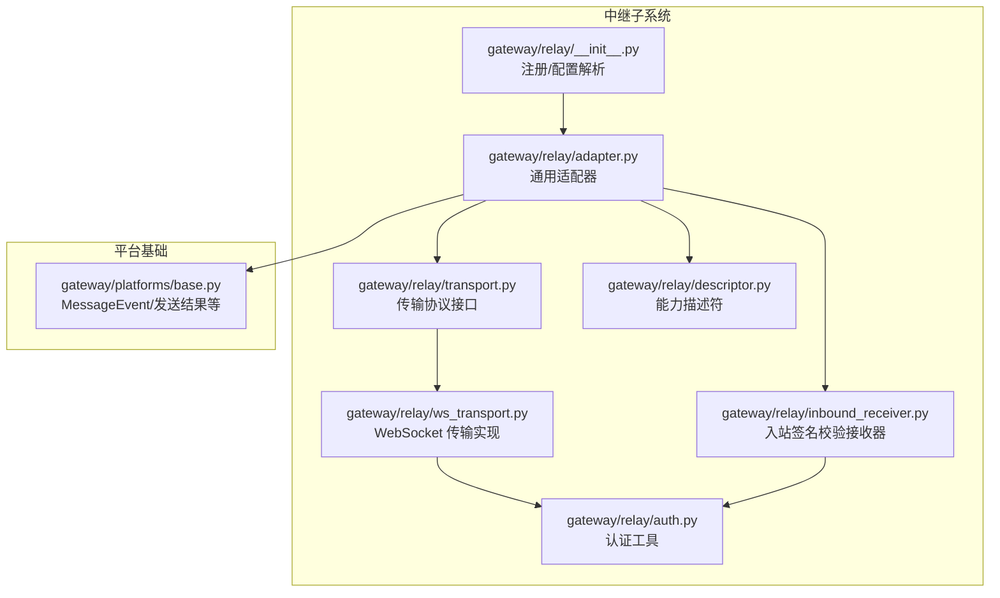
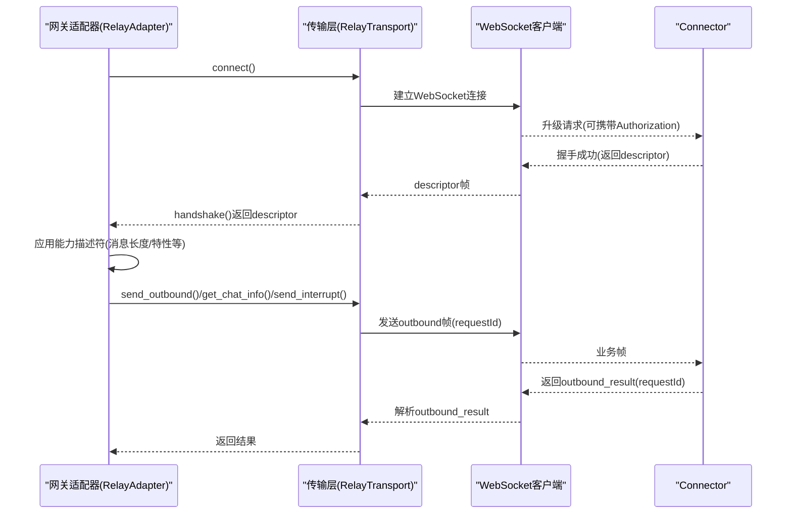
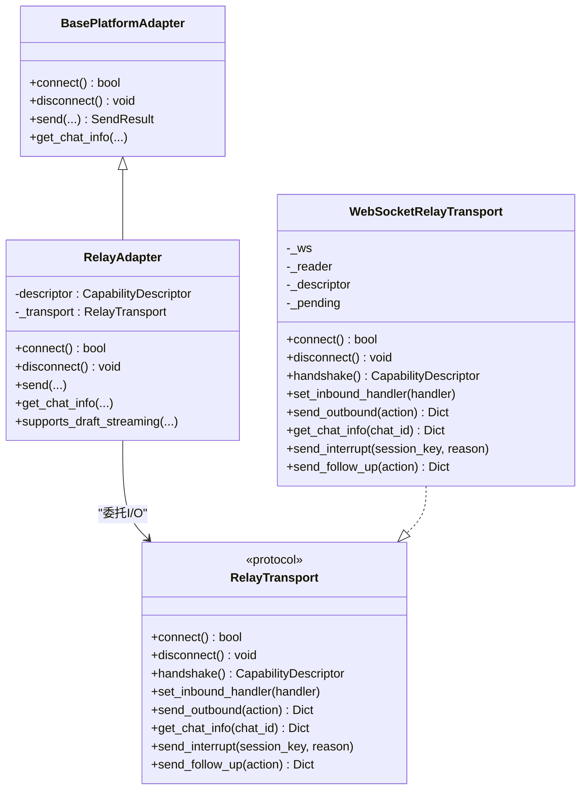
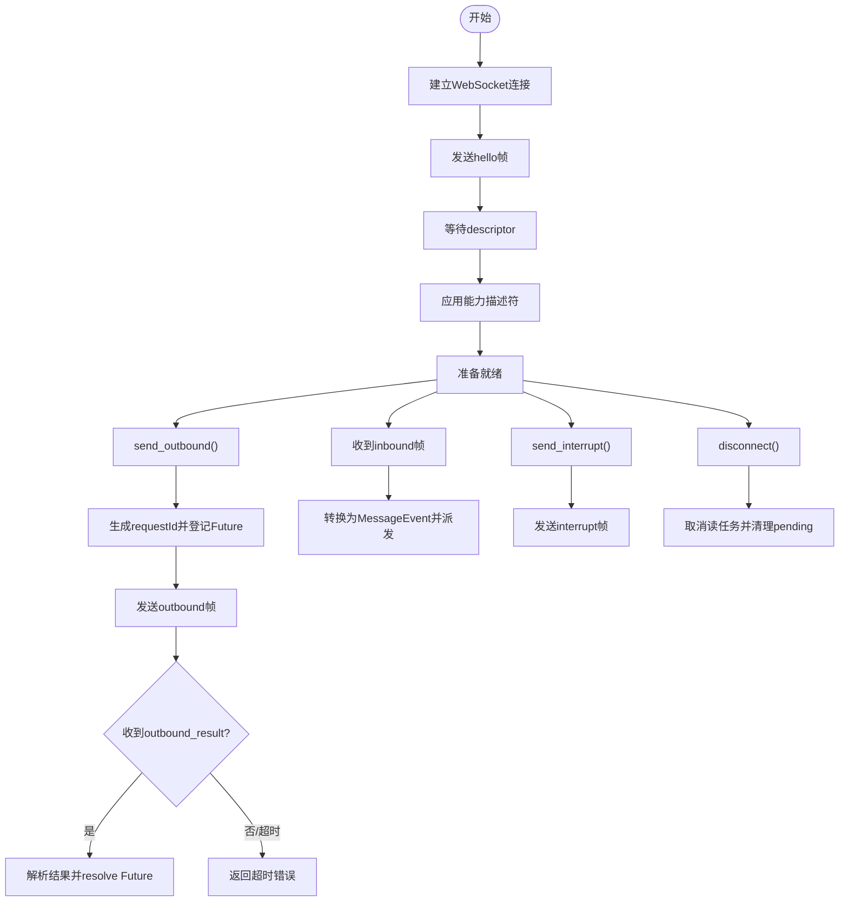
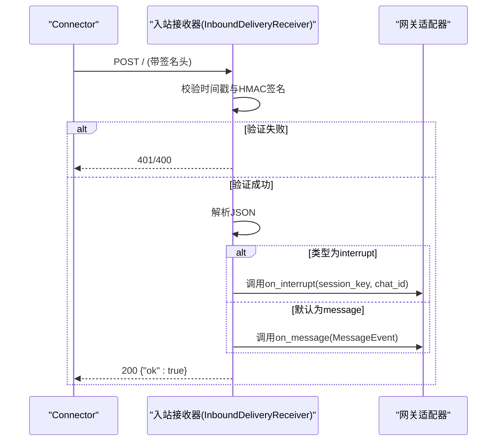
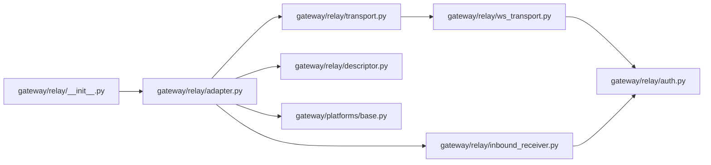

# 中继传输协议

<cite>
**本文档引用的文件**
- [gateway/relay/__init__.py](file://gateway/relay/__init__.py)
- [gateway/relay/adapter.py](file://gateway/relay/adapter.py)
- [gateway/relay/transport.py](file://gateway/relay/transport.py)
- [gateway/relay/ws_transport.py](file://gateway/relay/ws_transport.py)
- [gateway/relay/inbound_receiver.py](file://gateway/relay/inbound_receiver.py)
- [gateway/relay/descriptor.py](file://gateway/relay/descriptor.py)
- [gateway/relay/auth.py](file://gateway/relay/auth.py)
- [gateway/platforms/base.py](file://gateway/platforms/base.py)
- [gateway/run.py](file://gateway/run.py)
</cite>

## 目录
1. [引言](#引言)
2. [项目结构](#项目结构)
3. [核心组件](#核心组件)
4. [架构总览](#架构总览)
5. [详细组件分析](#详细组件分析)
6. [依赖关系分析](#依赖关系分析)
7. [性能考虑](#性能考虑)
8. [故障排查指南](#故障排查指南)
9. [结论](#结论)

## 引言
本文件系统性阐述中继传输协议在网关侧的实现与设计，重点覆盖以下方面：
- 适配器模式的应用：通过通用的 RelayAdapter 将“平台无关”的消息能力暴露给上层消费者，并由 Connector 在握手阶段动态下发能力描述。
- 传输层抽象：以 RelayTransport 协议定义统一的生命周期、握手、入站回调、出站动作等契约，具体实现为 WebSocketRelayTransport。
- WebSocket 传输实现：连接建立、帧协议、请求-响应模型、超时与错误处理、中断路由。
- 入站接收器：基于签名的 HTTP 入站投递、时间戳校验、消息与中断分发。
- 配置与管理：中继 URL、平台标识、认证令牌、入站接收端口与绑定地址。
- 安全机制：WS 升级认证（HMAC 承载令牌）、入站交付签名（HMAC 签名）、多密钥轮换与重放窗口。
- 性能优化与监控：并发请求管理、读循环健壮性、日志与可观测性建议。

## 项目结构
中继传输相关代码位于 gateway/relay 目录，围绕“适配器 + 传输 + 描述符 + 认证 + 入站接收器”构建，配合平台基类 MessageEvent 等数据结构完成端到端的消息桥接。

图示来源
- [gateway/relay/__init__.py:116-178](file://gateway/relay/__init__.py#L116-L178)
- [gateway/relay/adapter.py:44-221](file://gateway/relay/adapter.py#L44-L221)
- [gateway/relay/transport.py:34-102](file://gateway/relay/transport.py#L34-L102)
- [gateway/relay/ws_transport.py:102-299](file://gateway/relay/ws_transport.py#L102-L299)
- [gateway/relay/inbound_receiver.py:105-205](file://gateway/relay/inbound_receiver.py#L105-L205)
- [gateway/relay/descriptor.py:41-119](file://gateway/relay/descriptor.py#L41-L119)
- [gateway/relay/auth.py:1-169](file://gateway/relay/auth.py#L1-L169)
- [gateway/platforms/base.py:1422-1573](file://gateway/platforms/base.py#L1422-L1573)

章节来源
- [gateway/relay/__init__.py:25-178](file://gateway/relay/__init__.py#L25-L178)
- [gateway/relay/adapter.py:44-221](file://gateway/relay/adapter.py#L44-L221)
- [gateway/relay/transport.py:34-102](file://gateway/relay/transport.py#L34-L102)
- [gateway/relay/ws_transport.py:102-299](file://gateway/relay/ws_transport.py#L102-L299)
- [gateway/relay/inbound_receiver.py:105-205](file://gateway/relay/inbound_receiver.py#L105-L205)
- [gateway/relay/descriptor.py:41-119](file://gateway/relay/descriptor.py#L41-L119)
- [gateway/relay/auth.py:1-169](file://gateway/relay/auth.py#L1-L169)
- [gateway/platforms/base.py:1422-1573](file://gateway/platforms/base.py#L1422-L1573)

## 核心组件
- 通用适配器 RelayAdapter：负责将 Connector 下发的能力描述符映射为平台能力表面（最大消息长度、是否支持草稿流式、编辑、主题等），并将出站动作委托给传输层；同时桥接入站事件到标准 MessageEvent 流程。
- 传输协议 RelayTransport：定义连接、握手、入站回调、出站动作、聊天信息查询、中断路由等契约。
- WebSocket 传输实现 WebSocketRelayTransport：基于 WebSocket 的生产实现，采用“请求-响应”模型（按 requestId 关联），内置读循环解析换行分隔的 JSON 帧，处理 descriptor、inbound、outbound_result、interrupt_inbound 等帧类型。
- 能力描述符 CapabilityDescriptor：在握手阶段由 Connector 下发，包含平台标签、消息长度上限、是否支持草稿流式/编辑/主题、Markdown 方言、长度单位等。
- 入站签名校验接收器 InboundDeliveryReceiver：接收 Connector 通过 HTTP POST 发送的标准化入站事件，使用 HMAC 签名进行验证，确保仅接受可信来源的消息与中断。
- 认证工具：提供 WS 升级承载令牌生成与校验、入站交付签名生成与校验、多密钥轮换支持与重放窗口检查。

章节来源
- [gateway/relay/adapter.py:44-221](file://gateway/relay/adapter.py#L44-L221)
- [gateway/relay/transport.py:34-102](file://gateway/relay/transport.py#L34-L102)
- [gateway/relay/ws_transport.py:102-299](file://gateway/relay/ws_transport.py#L102-L299)
- [gateway/relay/descriptor.py:41-119](file://gateway/relay/descriptor.py#L41-L119)
- [gateway/relay/inbound_receiver.py:105-205](file://gateway/relay/inbound_receiver.py#L105-L205)
- [gateway/relay/auth.py:1-169](file://gateway/relay/auth.py#L1-L169)

## 架构总览
中继通道由“网关侧适配器 + 传输层 + Connector”三部分协作构成。网关侧通过注册入口激活中继平台，随后在连接阶段与 Connector 进行握手，获得能力描述符；出站消息经由传输层封装为帧发送，入站事件由传输层或 HTTP 接收器解码后统一进入适配器的入站处理流程。

图示来源
- [gateway/relay/adapter.py:79-100](file://gateway/relay/adapter.py#L79-L100)
- [gateway/relay/ws_transport.py:145-201](file://gateway/relay/ws_transport.py#L145-L201)
- [gateway/relay/ws_transport.py:207-243](file://gateway/relay/ws_transport.py#L207-L243)

## 详细组件分析

### 适配器模式与传输层抽象
- 适配器模式：RelayAdapter 继承自平台适配器基类，通过注入的传输实例完成所有网络 I/O；其能力表面完全由握手阶段的 CapabilityDescriptor 决定，从而实现“平台无关”的统一出口。
- 传输层抽象：RelayTransport 以 Protocol 形式定义了连接、握手、入站回调、出站动作、聊天信息查询、中断路由等契约，便于替换为测试桩或其它传输实现。

图示来源
- [gateway/relay/adapter.py:44-221](file://gateway/relay/adapter.py#L44-L221)
- [gateway/relay/transport.py:34-102](file://gateway/relay/transport.py#L34-L102)
- [gateway/relay/ws_transport.py:102-299](file://gateway/relay/ws_transport.py#L102-L299)
- [gateway/platforms/base.py:1803-2332](file://gateway/platforms/base.py#L1803-L2332)

章节来源
- [gateway/relay/adapter.py:44-100](file://gateway/relay/adapter.py#L44-L100)
- [gateway/relay/transport.py:34-102](file://gateway/relay/transport.py#L34-L102)
- [gateway/relay/ws_transport.py:102-143](file://gateway/relay/ws_transport.py#L102-L143)

### WebSocket 传输实现
- 连接建立：构造升级头（可选承载令牌），连接至指定 URL 并启动后台读循环任务；随后发送 hello 帧。
- 帧协议：采用换行分隔的 JSON 帧，类型包括 hello、descriptor、inbound、outbound、outbound_result、interrupt、interrupt_inbound。
- 请求-响应模型：每个出站动作生成唯一 requestId，等待对应 outbound_result 响应；超时则返回失败。
- 错误处理：读循环异常记录日志但不中断整体运行；断开时取消读任务并清理未完成请求。
- 中断路由：支持向 Connector 发送 /stop（send_interrupt），以及接收来自 Connector 的中断回执（interrupt_inbound）。

图示来源
- [gateway/relay/ws_transport.py:145-201](file://gateway/relay/ws_transport.py#L145-L201)
- [gateway/relay/ws_transport.py:207-243](file://gateway/relay/ws_transport.py#L207-L243)
- [gateway/relay/ws_transport.py:250-299](file://gateway/relay/ws_transport.py#L250-L299)

章节来源
- [gateway/relay/ws_transport.py:102-299](file://gateway/relay/ws_transport.py#L102-L299)

### 入站接收器工作原理
- 接收方式：通过 HTTP POST 接收 Connector 的标准化入站事件；提供两条路由：/ 和 /interrupt。
- 签名验证：严格使用原始字节流进行 HMAC 签名验证，要求时间戳在允许的偏移窗口内；支持主/备密钥列表以实现轮换。
- 消息分发：验证通过后解析 JSON，分别派发到入站消息处理器或中断处理器；未验证或格式错误返回 401/400。

图示来源
- [gateway/relay/inbound_receiver.py:129-172](file://gateway/relay/inbound_receiver.py#L129-L172)
- [gateway/relay/inbound_receiver.py:194-205](file://gateway/relay/inbound_receiver.py#L194-L205)

章节来源
- [gateway/relay/inbound_receiver.py:105-205](file://gateway/relay/inbound_receiver.py#L105-L205)

### 中继适配器的配置与管理
- 中继 URL：优先从环境变量 GATEWAY_RELAY_URL，其次从配置文件 gateway.relay_url。
- 平台标识：GATEWAY_RELAY_PLATFORM 与 GATEWAY_RELAY_BOT_ID 控制握手时上报的 platform/botId。
- 连接认证：GATEWAY_RELAY_ID 与 GATEWAY_RELAY_SECRET 用于 WS 升级承载令牌；未配置则为非认证模式。
- 入站接收：当配置了 GATEWAY_RELAY_DELIVERY_KEY、GATEWAY_RELAY_INBOUND_HOST、GATEWAY_RELAY_INBOUND_PORT 且端口非 0 时，启动 HTTP 接收器监听入站事件。
- 注册流程：register_relay_adapter 在存在 URL 或强制模式下注册“relay”平台，工厂函数根据配置创建适配器并注入传输实例。

章节来源
- [gateway/relay/__init__.py:25-114](file://gateway/relay/__init__.py#L25-L114)
- [gateway/relay/__init__.py:116-178](file://gateway/relay/__init__.py#L116-L178)

### 传输层安全机制
- WS 升级认证：生成基于 gateway_id 的承载令牌，随 Upgrade 请求头发送；Connector 使用相同算法与密钥列表进行校验。
- 入站交付签名：Connector 对每条入站 POST 使用 delivery_key 生成 HMAC 签名，网关侧严格比对时间戳与签名，拒绝过期或伪造请求。
- 多密钥轮换：支持主密钥与备用密钥并行验证，保证轮换期间的连续性。
- 重放防护：基于时间戳偏移窗口限制，防止旧请求被重放。

章节来源
- [gateway/relay/auth.py:1-169](file://gateway/relay/auth.py#L1-L169)
- [gateway/relay/ws_transport.py:158-174](file://gateway/relay/ws_transport.py#L158-L174)
- [gateway/relay/inbound_receiver.py:137-151](file://gateway/relay/inbound_receiver.py#L137-L151)

## 依赖关系分析
- 组件耦合：RelayAdapter 与传输层松耦合，通过协议接口交互；与能力描述符强关联，能力表面完全由握手结果决定。
- 外部依赖：WebSocket 传输依赖 websockets 包；入站接收器依赖 aiohttp；认证模块为纯 Python 实现，依赖标准库。
- 可能的循环依赖：注册入口延迟导入配置模块，避免循环依赖。

图示来源
- [gateway/relay/__init__.py:132-165](file://gateway/relay/__init__.py#L132-L165)
- [gateway/relay/adapter.py:24-27](file://gateway/relay/adapter.py#L24-L27)
- [gateway/relay/ws_transport.py:40-48](file://gateway/relay/ws_transport.py#L40-L48)
- [gateway/relay/inbound_receiver.py:37-41](file://gateway/relay/inbound_receiver.py#L37-L41)
- [gateway/relay/descriptor.py:34-35](file://gateway/relay/descriptor.py#L34-L35)
- [gateway/relay/auth.py:34-38](file://gateway/relay/auth.py#L34-L38)
- [gateway/platforms/base.py:1422-1434](file://gateway/platforms/base.py#L1422-L1434)

章节来源
- [gateway/relay/__init__.py:116-178](file://gateway/relay/__init__.py#L116-L178)
- [gateway/relay/adapter.py:44-100](file://gateway/relay/adapter.py#L44-L100)
- [gateway/relay/ws_transport.py:102-143](file://gateway/relay/ws_transport.py#L102-L143)
- [gateway/relay/inbound_receiver.py:105-128](file://gateway/relay/inbound_receiver.py#L105-L128)
- [gateway/relay/descriptor.py:41-78](file://gateway/relay/descriptor.py#L41-L78)
- [gateway/relay/auth.py:1-50](file://gateway/relay/auth.py#L1-L50)
- [gateway/platforms/base.py:1422-1434](file://gateway/platforms/base.py#L1422-L1434)

## 性能考虑
- 请求并发与超时：每个出站请求独立超时，避免阻塞其他请求；合理设置握手与出站超时参数，平衡可靠性与响应速度。
- 读循环健壮性：WebSocket 读循环捕获异常并记录日志，避免因单次错误导致整个连接中断；断开时主动取消读任务并清理未完成请求。
- 消息长度与分片：依据 CapabilityDescriptor 的长度单位与上限进行消息截断与分片，减少平台 API 限制带来的失败率。
- 日志与可观测性：对握手失败、入站签名失败、帧解析错误等关键路径进行日志记录，便于定位问题；建议结合外部监控系统采集连接状态、请求耗时、错误计数等指标。

## 故障排查指南
- 连接失败
  - 检查 GATEWAY_RELAY_URL 是否正确，确认网络可达。
  - 若启用 WS 升级认证，确认 GATEWAY_RELAY_ID 与 GATEWAY_RELAY_SECRET 配置一致。
  - 查看读循环日志，关注连接中断与异常堆栈。
- 握手失败
  - 确认 Connector 已正确返回 descriptor；检查日志中的握手超时与异常。
- 出站超时
  - 检查网络状况与 Connector 负载；适当增大超时阈值。
  - 确认 requestId 与响应匹配，避免请求积压。
- 入站未达
  - 确认已配置入站接收端口与绑定地址，且端口非 0。
  - 检查 delivery_key 是否正确，时间戳偏移是否在允许范围内。
  - 观察 HTTP 接收器日志，确认签名验证通过。
- 中断无效
  - 确认 send_interrupt 已发送，且 Connector 正确转发至目标会话实例。
  - 检查中断回执（interrupt_inbound）是否到达适配器。

章节来源
- [gateway/relay/ws_transport.py:175-195](file://gateway/relay/ws_transport.py#L175-L195)
- [gateway/relay/ws_transport.py:230-243](file://gateway/relay/ws_transport.py#L230-L243)
- [gateway/relay/inbound_receiver.py:137-151](file://gateway/relay/inbound_receiver.py#L137-L151)
- [gateway/relay/adapter.py:139-148](file://gateway/relay/adapter.py#L139-L148)

## 结论
中继传输协议通过“适配器 + 传输 + 描述符 + 认证 + 入站接收器”的组合，实现了跨平台、可扩展、安全可靠的网关-Connector 通信框架。其核心价值在于：
- 以协议与描述符抽象屏蔽平台差异，简化上层接入；
- 以传输层协议与 WebSocket 实现确保实时性与可靠性；
- 以双层安全机制（WS 升级令牌与入站签名）保障信道安全；
- 以严格的配置与错误处理提升运维稳定性。