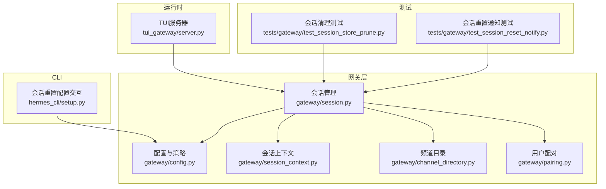
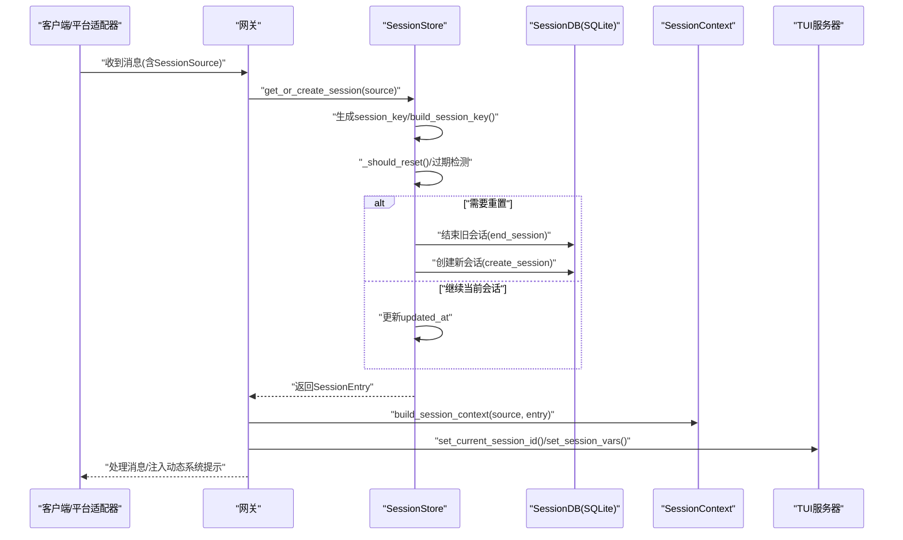
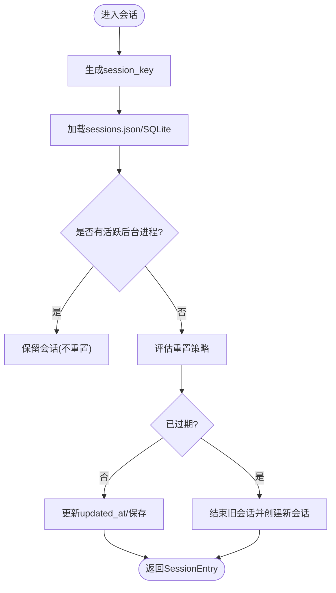
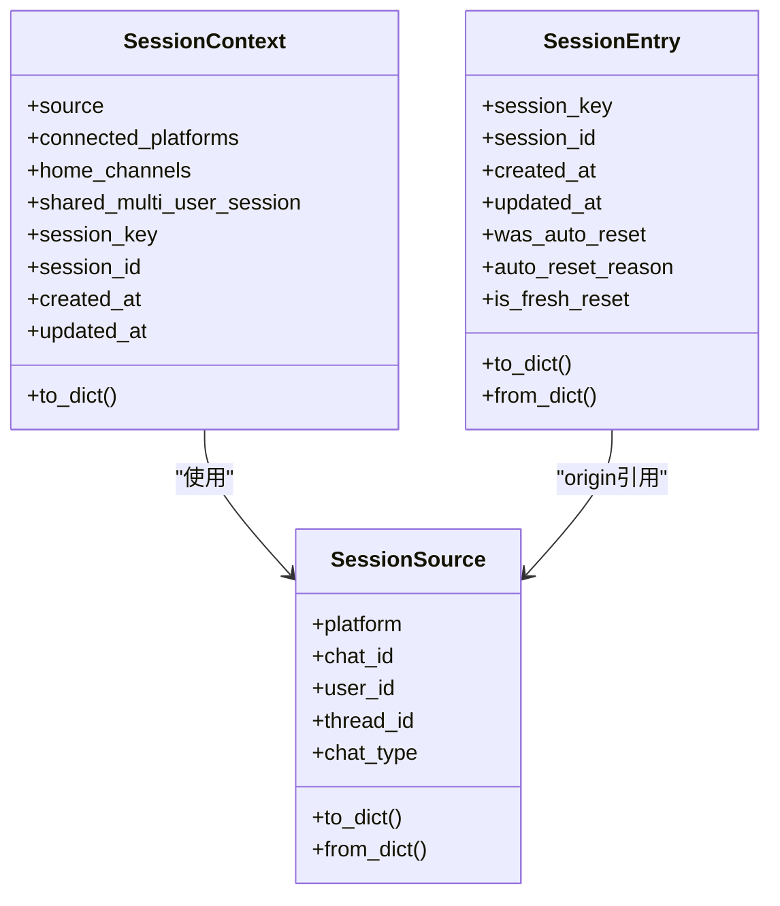
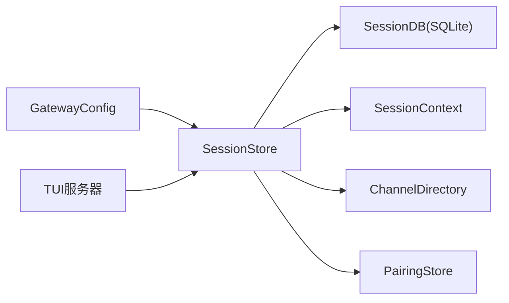

# 会话管理机制

<cite>
**本文档引用的文件**
- [gateway/session.py](file://gateway/session.py)
- [gateway/session_context.py](file://gateway/session_context.py)
- [gateway/config.py](file://gateway/config.py)
- [gateway/channel_directory.py](file://gateway/channel_directory.py)
- [gateway/pairing.py](file://gateway/pairing.py)
- [tui_gateway/server.py](file://tui_gateway/server.py)
- [tests/gateway/test_session_store_prune.py](file://tests/gateway/test_session_store_prune.py)
- [tests/gateway/test_session_reset_notify.py](file://tests/gateway/test_session_reset_notify.py)
- [hermes_cli/setup.py](file://hermes_cli/setup.py)
</cite>

## 目录
1. [简介](#简介)
2. [项目结构](#项目结构)
3. [核心组件](#核心组件)
4. [架构总览](#架构总览)
5. [详细组件分析](#详细组件分析)
6. [依赖关系分析](#依赖关系分析)
7. [性能考虑](#性能考虑)
8. [故障排除指南](#故障排除指南)
9. [结论](#结论)

## 简介
本文件系统性阐述会话管理机制，覆盖会话生命周期（创建、状态维护、超时处理、销毁）、会话上下文构建与注入、跨平台一致性保障、存储策略（内存/持久化/分布式）、重置与清理策略（自动/手动/异常恢复）、会话边界控制与跨平台同步、频道目录与用户配对机制，以及配置选项与性能优化建议。

## 项目结构
围绕会话管理的关键模块分布如下：
- 会话核心：gateway/session.py 提供会话键生成、会话存储、重置策略评估、过期检测、清理与恢复等能力
- 会话上下文：gateway/session_context.py 使用 contextvars 替代进程级环境变量，确保并发安全
- 配置与策略：gateway/config.py 定义会话重置策略、平台配置、默认行为
- 频道目录：gateway/channel_directory.py 维护各平台可触达频道/联系人的缓存与解析
- 用户配对：gateway/pairing.py 实现基于一次性验证码的用户授权流程与安全策略
- 运行时注入：tui_gateway/server.py 在会话建立时绑定会话上下文与数据库

**图表来源**
- [gateway/session.py](file://gateway/session.py)
- [gateway/session_context.py](file://gateway/session_context.py)
- [gateway/config.py](file://gateway/config.py)
- [gateway/channel_directory.py](file://gateway/channel_directory.py)
- [gateway/pairing.py](file://gateway/pairing.py)
- [tui_gateway/server.py](file://tui_gateway/server.py)
- [tests/gateway/test_session_store_prune.py](file://tests/gateway/test_session_store_prune.py)
- [tests/gateway/test_session_reset_notify.py](file://tests/gateway/test_session_reset_notify.py)
- [hermes_cli/setup.py](file://hermes_cli/setup.py)

**章节来源**
- [gateway/session.py](file://gateway/session.py)
- [gateway/session_context.py](file://gateway/session_context.py)
- [gateway/config.py](file://gateway/config.py)
- [gateway/channel_directory.py](file://gateway/channel_directory.py)
- [gateway/pairing.py](file://gateway/pairing.py)
- [tui_gateway/server.py](file://tui_gateway/server.py)
- [tests/gateway/test_session_store_prune.py](file://tests/gateway/test_session_store_prune.py)
- [tests/gateway/test_session_reset_notify.py](file://tests/gateway/test_session_reset_notify.py)
- [hermes_cli/setup.py](file://hermes_cli/setup.py)

## 核心组件
- 会话源 SessionSource：描述消息来源（平台、聊天类型、用户标识、线程等），用于构建会话键与动态系统提示
- 会话条目 SessionEntry：记录会话键到会话ID映射及元数据（创建/更新时间、令牌统计、成本状态、是否自动重置等）
- 会话存储 SessionStore：负责加载/保存 sessions.json、SQLite 元数据写入、重置策略评估、过期检测、清理与恢复标记
- 会话上下文 SessionContext：动态系统提示注入载体，包含来源、连接平台、主通道等
- 上下文变量会话上下文：使用 contextvars 替代 os.environ，避免并发冲突
- 会话重置策略 SessionResetPolicy：支持按空闲时长、每日边界或两者组合，或禁用自动重置
- 频道目录 ChannelDirectory：缓存平台频道/联系人列表，支持名称解析与显示格式化
- 用户配对 PairingStore：一次性验证码授权、速率限制、锁定保护与批准/撤销

**章节来源**
- [gateway/session.py](file://gateway/session.py)
- [gateway/session_context.py](file://gateway/session_context.py)
- [gateway/config.py](file://gateway/config.py)
- [gateway/channel_directory.py](file://gateway/channel_directory.py)
- [gateway/pairing.py](file://gateway/pairing.py)

## 架构总览
会话管理贯穿“来源识别—键生成—存储—策略评估—上下文注入—运行时绑定”的完整链路，并通过 SQLite 持久化会话元数据与消息转录，同时提供 JSONL 回退与磁盘 sessions.json 索引。

**图表来源**
- [gateway/session.py](file://gateway/session.py)
- [gateway/session_context.py](file://gateway/session_context.py)
- [tui_gateway/server.py](file://tui_gateway/server.py)

## 详细组件分析

### 会话生命周期管理
- 创建与键生成
  - 基于 SessionSource 的确定性键生成规则，区分 DM、群组/频道、线程场景；支持 WhatsApp 标识规范化
  - 默认按平台/聊天类型/父级标识/线程/参与者隔离策略，可通过配置开关调整
- 状态维护
  - 更新 updated_at 记录最后活动时间；记录令牌用量、成本状态、上一次提示词令牌数
  - 支持 is_fresh_reset（手动 /reset 后首条消息注入主题/技能上下文）、was_auto_reset/auto_reset_reason/reset_had_activity
- 超时处理与销毁
  - 自动重置：根据 SessionResetPolicy（空闲分钟数、每日边界）判定；活跃后台进程的会话不被重置
  - 手动重置：/reset 强制创建新会话ID；/stop 标记 suspended，下次访问强制重置
  - 销毁与清理：prune_old_entries 基于 updated_at 清理陈旧会话索引；保留 suspended 与活跃进程会话
- 恢复与异常处理
  - resume_pending：意外退出后保留会话ID与转录，下次访问自动恢复
  - 恢复成功后清除标志；若持续失败则升级为 suspended

**图表来源**
- [gateway/session.py](file://gateway/session.py)

**章节来源**
- [gateway/session.py](file://gateway/session.py)
- [tests/gateway/test_session_store_prune.py](file://tests/gateway/test_session_store_prune.py)
- [tests/gateway/test_session_reset_notify.py](file://tests/gateway/test_session_reset_notify.py)

### 会话上下文构建与注入
- 动态系统提示注入
  - build_session_context 将 SessionSource、连接平台、主通道等注入 SessionContext
  - build_session_context_prompt 根据平台差异生成上下文段落，支持 PII 脱敏（特定平台）
- 并发安全的上下文变量
  - 使用 contextvars.ContextVar 替代 os.environ，避免并发消息互相覆盖
  - 提供 get_session_env 兼容层，优先读取上下文变量，否则回退到 os.environ
- 运行时绑定
  - tui_gateway/server.py 在建立会话时设置 HERMES_HOME、SessionDB，并传递会话参数

**图表来源**
- [gateway/session.py](file://gateway/session.py)
- [gateway/session_context.py](file://gateway/session_context.py)

**章节来源**
- [gateway/session.py](file://gateway/session.py)
- [gateway/session_context.py](file://gateway/session_context.py)
- [tui_gateway/server.py](file://tui_gateway/server.py)

### 会话存储策略
- 内存存储
  - sessions.json 字典映射 session_key → SessionEntry；首次访问加载，后续变更保存
- 持久化存储
  - 优先使用 SQLite（SessionDB）存储会话元数据与消息转录；失败时回退至 JSONL
  - _save 使用临时文件+原子替换，保证写入一致性
- 分布式存储
  - 当前未发现内置分布式存储实现；跨实例同步依赖外部机制（如远程会话列表合并）

**章节来源**
- [gateway/session.py](file://gateway/session.py)

### 会话重置策略与清理机制
- 自动清理
  - prune_old_entries：基于 updated_at 清理陈旧会话索引；保留 suspended 与活跃进程会话
  - 并发安全：清理过程与 update_session 互斥，避免竞态
- 手动清理
  - /reset：强制创建新会话ID，保留历史转录但开始全新上下文
  - /stop：标记 suspended，下次访问强制重置
- 异常恢复
  - suspend_recently_active：意外退出后对近期活跃会话标记 resume_pending，下次访问自动恢复
  - 恢复成功后清除标志；若多次失败则升级为 suspended

**章节来源**
- [gateway/session.py](file://gateway/session.py)
- [tests/gateway/test_session_store_prune.py](file://tests/gateway/test_session_store_prune.py)
- [tests/gateway/test_session_reset_notify.py](file://tests/gateway/test_session_reset_notify.py)

### 会话边界控制与跨平台会话同步
- 边界控制
  - build_session_key 明确隔离规则：DM 始终隔离；线程默认共享，除非启用 per-user 线程隔离
  - is_shared_multi_user_session 判断多用户共享场景，避免固定用户名导致提示缓存失效
- 跨平台同步
  - 频道目录 channel_directory：周期性构建并缓存各平台频道/联系人，支持名称解析与显示格式化
  - 用户配对 pairing：一次性验证码授权，支持速率限制与锁定保护，防止滥用

**章节来源**
- [gateway/session.py](file://gateway/session.py)
- [gateway/channel_directory.py](file://gateway/channel_directory.py)
- [gateway/pairing.py](file://gateway/pairing.py)

### 频道目录管理与用户配对机制
- 频道目录
  - 从平台适配器与会话数据构建目录，支持 Discord/Slack 特定枚举与通用会话发现
  - 提供名称解析、类型查询、友好名覆盖与人类可读展示
- 用户配对
  - 一次性验证码（8字符，32字符字母集，无歧义字符），1小时过期
  - 速率限制：每用户每10分钟1次；失败累计5次锁定1小时
  - 数据文件权限严格（chmod 0600），所有写入采用临时文件+原子替换

**章节来源**
- [gateway/channel_directory.py](file://gateway/channel_directory.py)
- [gateway/pairing.py](file://gateway/pairing.py)

### 配置选项与性能优化建议
- 会话重置策略
  - 模式：daily/idle/both/none；空闲分钟数、每日边界小时、是否通知
  - CLI 交互式配置入口，支持修改空闲超时与每日重置时间
- 性能优化
  - SQLite 优先：会话元数据与消息转录持久化于 SQLite，减少磁盘碎片与并发竞争
  - 原子写入：sessions.json 采用临时文件+原子替换，避免部分写入
  - 并发安全：contextvars 替代 os.environ，避免全局变量竞态
  - 清理策略：定期 prune 陈旧索引，避免内存膨胀；活跃进程会话不被清理

**章节来源**
- [gateway/config.py](file://gateway/config.py)
- [hermes_cli/setup.py](file://hermes_cli/setup.py)
- [gateway/session.py](file://gateway/session.py)

## 依赖关系分析
- 组件耦合
  - SessionStore 依赖 GatewayConfig 获取重置策略，依赖 SessionDB 进行 SQLite 操作
  - SessionContext 由 build_session_context 构建，注入动态系统提示
  - ChannelDirectory 与 PairingStore 独立于会话存储，分别提供目录解析与用户授权
- 外部依赖
  - hermes_state.SessionDB：会话数据库接口
  - utils.atomic_replace：原子文件替换
  - 平台适配器：提供频道枚举与会话来源

**图表来源**
- [gateway/session.py](file://gateway/session.py)
- [gateway/config.py](file://gateway/config.py)
- [gateway/channel_directory.py](file://gateway/channel_directory.py)
- [gateway/pairing.py](file://gateway/pairing.py)
- [tui_gateway/server.py](file://tui_gateway/server.py)

**章节来源**
- [gateway/session.py](file://gateway/session.py)
- [gateway/config.py](file://gateway/config.py)
- [gateway/channel_directory.py](file://gateway/channel_directory.py)
- [gateway/pairing.py](file://gateway/pairing.py)
- [tui_gateway/server.py](file://tui_gateway/server.py)

## 性能考虑
- I/O 与锁
  - SQLite 操作在持有锁外执行，避免阻塞会话键表的读写
  - prune_old_entries 仅在必要时写入磁盘，减少频繁落盘
- 并发模型
  - contextvars 保证任务局部状态，避免全局变量带来的串扰
  - 会话存储内部使用线程锁保护内存字典与文件写入
- 存储选择
  - SQLite 适合高吞吐的会话元数据与转录；JSONL 作为回退方案
  - 会话键到ID映射仅在 sessions.json 中维护，体积可控

[本节为通用指导，无需具体文件分析]

## 故障排除指南
- 会话未按预期重置
  - 检查 SessionResetPolicy 模式与阈值；确认是否存在活跃后台进程阻止重置
  - 查看 was_auto_reset/auto_reset_reason 是否正确设置
- 会话清理无效
  - 确认 prune_old_entries 的 max_age_days 参数；检查 suspended 与活跃进程会话是否被跳过
  - 观察并发场景下的清理与 update_session 是否存在竞态
- 上下文变量冲突
  - 确保使用 set_session_vars 设置并在 finally 中调用 clear_session_vars
  - 避免直接操作 os.environ，改用 get_session_env 兼容层
- 频道解析失败
  - 检查 channel_directory 缓存文件是否最新；确认名称解析规则与大小写
- 用户配对失败
  - 检查速率限制与锁定状态；确认验证码哈希验证流程与过期时间

**章节来源**
- [tests/gateway/test_session_store_prune.py](file://tests/gateway/test_session_store_prune.py)
- [tests/gateway/test_session_reset_notify.py](file://tests/gateway/test_session_reset_notify.py)
- [gateway/session_context.py](file://gateway/session_context.py)
- [gateway/channel_directory.py](file://gateway/channel_directory.py)
- [gateway/pairing.py](file://gateway/pairing.py)

## 结论
该会话管理机制以确定性键生成为核心，结合 SQLite 持久化与 JSONL 回退、严格的并发安全与原子写入、灵活的重置策略与清理机制，实现了跨平台一致的对话体验。通过会话上下文注入与频道目录、用户配对等配套能力，进一步增强了安全性与可用性。建议在生产环境中合理配置重置策略与清理周期，并关注活跃进程对会话生命周期的影响。