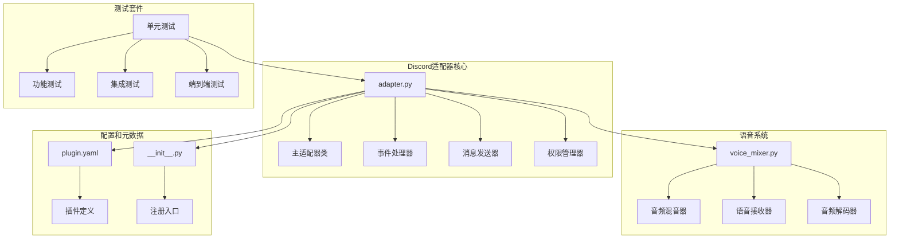
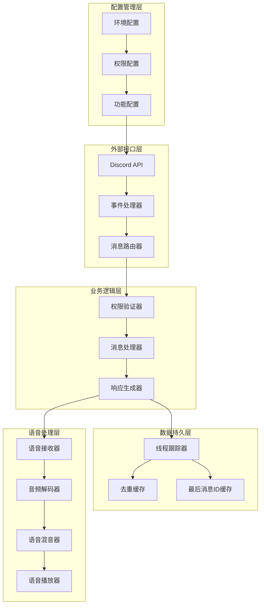
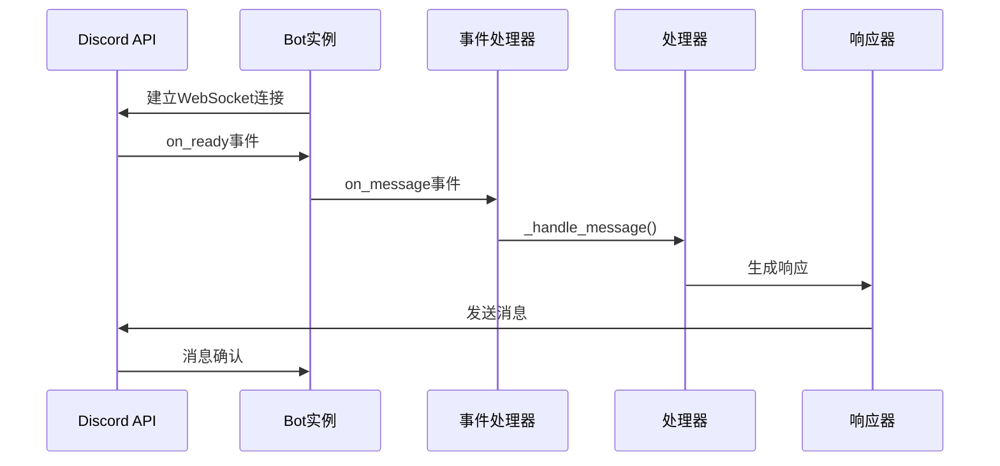
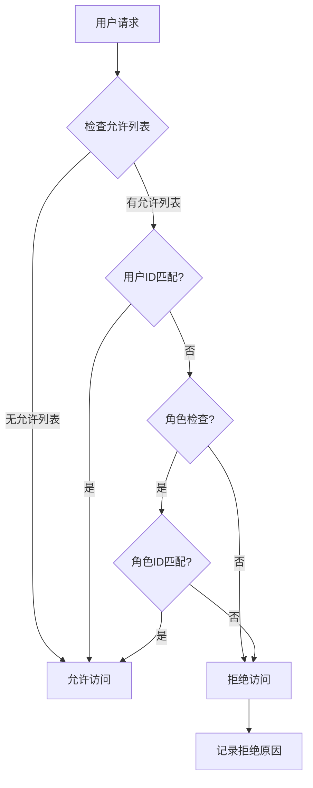
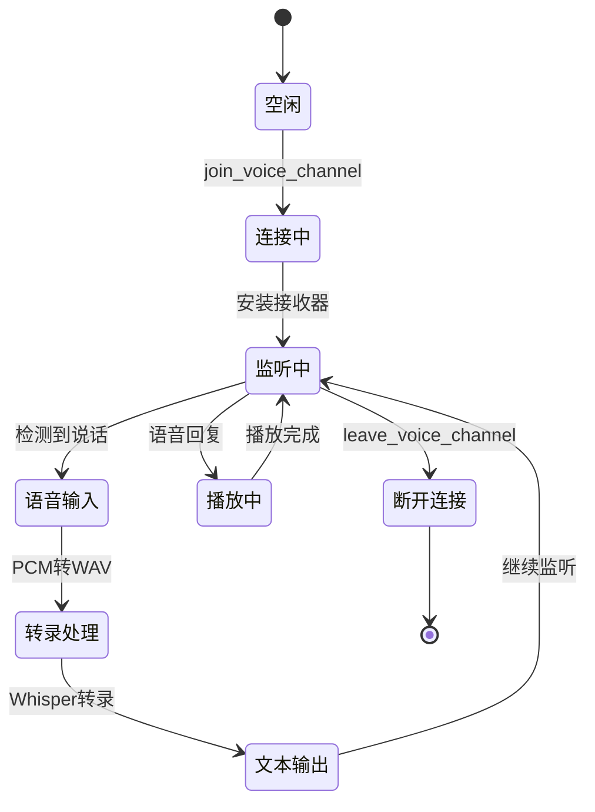
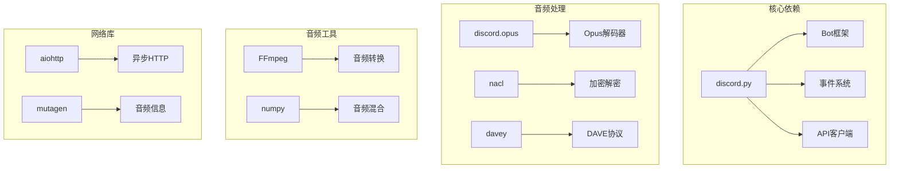
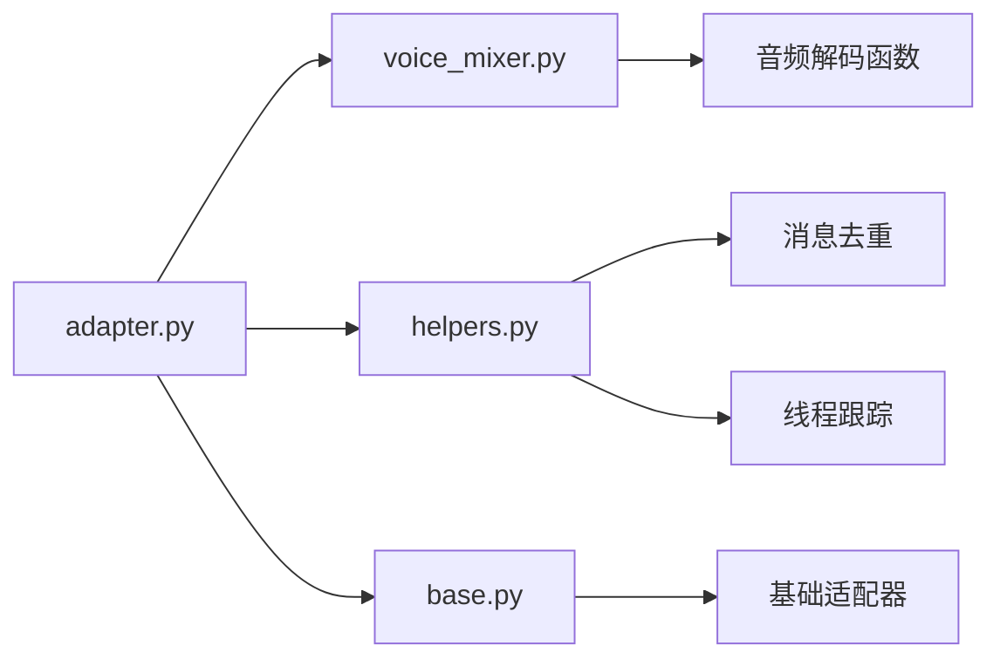
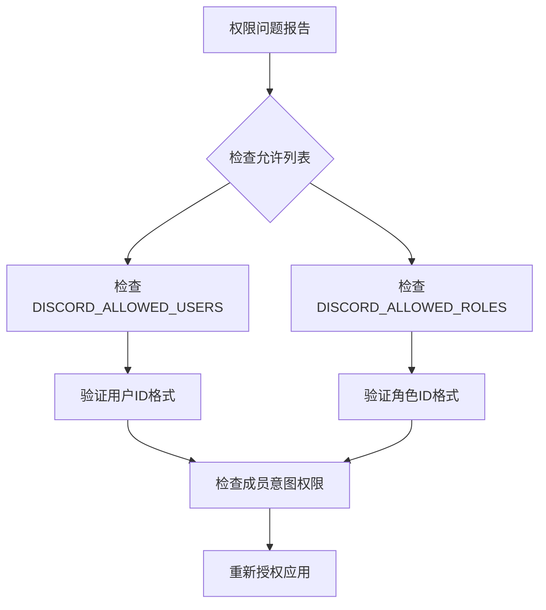

# Discord平台适配器

<cite>
**本文档引用的文件**
- [adapter.py](file://plugins/platforms/discord/adapter.py)
- [plugin.yaml](file://plugins/platforms/discord/plugin.yaml)
- [voice_mixer.py](file://plugins/platforms/discord/voice_mixer.py)
- [__init__.py](file://plugins/platforms/discord/__init__.py)
- [test_discord_adapter.py](file://tests/e2e/test_discord_adapter.py)
- [test_discord_connect.py](file://tests/gateway/test_discord_connect.py)
- [test_discord_channel_controls.py](file://tests/gateway/test_discord_channel_controls.py)
- [test_discord_component_auth.py](file://tests/gateway/test_discord_component_auth.py)
- [test_discord_clarify_buttons.py](file://tests/gateway/test_discord_clarify_buttons.py)
- [test_discord_attachment_download.py](file://tests/gateway/test_discord_attachment_download.py)
- [test_discord_document_handling.py](file://tests/gateway/test_discord_document_handling.py)
- [test_discord_free_response.py](file://tests/gateway/test_discord_free_response.py)
- [test_discord_bot_auth_bypass.py](file://tests/gateway/test_discord_bot_auth_bypass.py)
- [test_discord_allowed_channels.py](file://tests/gateway/test_discord_allowed_channels.py)
- [test_discord_allowed_mentions.py](file://tests/gateway/test_discord_allowed_mentions.py)
- [test_discord_bot_filter.py](file://tests/gateway/test_discord_bot_filter.py)
- [test_discord_channel_prompts.py](file://tests/gateway/test_discord_channel_prompts.py)
- [test_discord_channel_skills.py](file://tests/gateway/test_discord_channel_skills.py)
- [test_discord_imports.py](file://tests/gateway/test_discord_imports.py)
- [test_discord_voice_doctor.py](file://scripts/discord-voice-doctor.py)
</cite>

## 目录
1. [简介](#简介)
2. [项目结构](#项目结构)
3. [核心组件](#核心组件)
4. [架构概览](#架构概览)
5. [详细组件分析](#详细组件分析)
6. [依赖关系分析](#依赖关系分析)
7. [性能考虑](#性能考虑)
8. [故障排除指南](#故障排除指南)
9. [结论](#结论)
10. [附录](#附录)

## 简介

Discord平台适配器是Hermes Agent框架中的一个关键组件，负责在Discord平台上提供完整的AI代理服务。该适配器基于discord.py库构建，实现了从基础的消息收发到高级功能的完整支持，包括语音交互、组件交互、权限管理、消息格式化等。

该适配器的核心目标是在Discord生态系统中提供无缝的AI代理体验，支持多种交互模式和丰富的功能集，同时确保安全性和可靠性。

## 项目结构

Discord平台适配器位于`plugins/platforms/discord/`目录下，包含以下关键文件：



**图表来源**
- [adapter.py:1-100](file://plugins/platforms/discord/adapter.py#L1-100)
- [voice_mixer.py:1-50](file://plugins/platforms/discord/voice_mixer.py#L1-50)
- [plugin.yaml:1-35](file://plugins/platforms/discord/plugin.yaml#L1-35)
- [__init__.py:1-4](file://plugins/platforms/discord/__init__.py#L1-4)

**章节来源**
- [adapter.py:1-100](file://plugins/platforms/discord/adapter.py#L1-100)
- [plugin.yaml:1-35](file://plugins/platforms/discord/plugin.yaml#L1-35)
- [voice_mixer.py:1-100](file://plugins/platforms/discord/voice_mixer.py#L1-100)

## 核心组件

### 主适配器类 (DiscordAdapter)

DiscordAdapter是整个适配器的核心，继承自BasePlatformAdapter，提供了Discord平台的所有功能：

- **WebSocket连接管理**：使用discord.py的Bot框架建立和维护与Discord的连接
- **消息处理**：处理文本消息、语音消息、文件附件等多种消息类型
- **权限控制**：实现用户ID和角色级别的访问控制
- **线程支持**：支持Discord的线程功能，实现长对话管理
- **语音交互**：完整的语音聊天支持，包括语音识别和合成

### 语音系统

语音系统由三个主要组件构成：

- **VoiceMixer**：音频混音器，支持连续音频播放和语音叠加
- **VoiceReceiver**：语音接收器，处理来自Discord语音通道的音频数据
- **音频处理**：支持Opus解码、DAVE加密协议处理和PCM格式转换

### 配置管理

插件通过plugin.yaml文件定义，包含以下关键配置项：

- **环境变量要求**：DISCORD_BOT_TOKEN（必需）
- **可选环境变量**：允许的用户列表、角色过滤、主页频道等
- **功能开关**：语音模式、反应支持、Slash命令等

**章节来源**
- [adapter.py:604-700](file://plugins/platforms/discord/adapter.py#L604-700)
- [voice_mixer.py:148-200](file://plugins/platforms/discord/voice_mixer.py#L148-200)
- [plugin.yaml:12-35](file://plugins/platforms/discord/plugin.yaml#L12-35)

## 架构概览

Discord适配器采用模块化设计，各组件职责清晰：



**图表来源**
- [adapter.py:858-970](file://plugins/platforms/discord/adapter.py#L858-970)
- [adapter.py:1557-1667](file://plugins/platforms/discord/adapter.py#L1557-1667)
- [voice_mixer.py:244-290](file://plugins/platforms/discord/voice_mixer.py#L244-290)

## 详细组件分析

### WebSocket连接和事件处理

适配器使用discord.py的Bot框架建立稳定的WebSocket连接：



**图表来源**
- [adapter.py:858-970](file://plugins/platforms/discord/adapter.py#L858-970)
- [adapter.py:1557-1667](file://plugins/platforms/discord/adapter.py#L1557-1667)

### 权限管理系统

权限系统支持多层安全控制：



**图表来源**
- [adapter.py:2602-2685](file://plugins/platforms/discord/adapter.py#L2602-2685)

### 消息路由机制

消息路由支持多种Discord特性：

| 功能 | 实现方式 | 限制 |
|------|----------|------|
| 文本消息 | 直接发送 | 最大2000字符 |
| 语音消息 | 使用flags=8192 | 自动播放波形图 |
| 文件附件 | discord.File | 支持图片、视频、文档 |
| 嵌入消息 | Discord Embed | 丰富的内容展示 |
| 组件交互 | Button、Select、Modal | 交互式UI |

**章节来源**
- [adapter.py:1557-1723](file://plugins/platforms/discord/adapter.py#L1557-1723)
- [adapter.py:1810-1841](file://plugins/platforms/discord/adapter.py#L1810-1841)
- [adapter.py:2915-3010](file://plugins/platforms/discord/adapter.py#L2915-3010)

### 语音交互系统

语音系统提供完整的端到端语音处理能力：



**图表来源**
- [adapter.py:2234-2275](file://plugins/platforms/discord/adapter.py#L2234-2275)
- [adapter.py:2522-2566](file://plugins/platforms/discord/adapter.py#L2522-2566)
- [voice_mixer.py:244-290](file://plugins/platforms/discord/voice_mixer.py#L244-290)

**章节来源**
- [adapter.py:217-574](file://plugins/platforms/discord/adapter.py#L217-574)
- [voice_mixer.py:148-380](file://plugins/platforms/discord/voice_mixer.py#L148-380)

### Slash命令系统

Slash命令系统提供丰富的命令接口：

| 命令类别 | 示例命令 | 功能描述 |
|----------|----------|----------|
| 基础控制 | `/reset`, `/status`, `/stop` | 会话管理 |
| 模型配置 | `/model`, `/reasoning`, `/personality` | AI模型设置 |
| 任务管理 | `/retry`, `/undo`, `/queue` | 工作流控制 |
| 语音控制 | `/voice join`, `/voice off`, `/voice tts` | 语音模式切换 |
| 技能调用 | `/skill`, `/reload-skills` | 插件技能执行 |

**章节来源**
- [adapter.py:3338-3453](file://plugins/platforms/discord/adapter.py#L3338-3453)
- [adapter.py:3464-3488](file://plugins/platforms/discord/adapter.py#L3464-3488)

## 依赖关系分析

### 外部依赖

Discord适配器的主要依赖包括：



**图表来源**
- [adapter.py:41-51](file://plugins/platforms/discord/adapter.py#L41-51)
- [voice_mixer.py:45-65](file://plugins/platforms/discord/voice_mixer.py#L45-65)

### 内部依赖

适配器内部模块间的依赖关系：



**图表来源**
- [adapter.py:60-75](file://plugins/platforms/discord/adapter.py#L60-75)
- [voice_mixer.py:1-50](file://plugins/platforms/discord/voice_mixer.py#L1-50)

**章节来源**
- [adapter.py:41-51](file://plugins/platforms/discord/adapter.py#L41-51)
- [voice_mixer.py:45-65](file://plugins/platforms/discord/voice_mixer.py#L45-65)

## 性能考虑

### 连接优化

- **Opus编解码器预加载**：自动检测和加载系统中的Opus库
- **连接池管理**：复用HTTP连接减少延迟
- **事件去重**：防止重复事件处理导致的资源浪费

### 消息处理优化

- **批量发送**：支持多图片批量上传（最多10个文件/消息）
- **智能分片**：超过2000字符的消息自动分片发送
- **缓存机制**：缓存最后消息ID避免全量扫描

### 语音处理优化

- **连续混音**：安装一次混音器，持续运行避免频繁创建销毁
- **音频解码缓存**：缓存解码后的音频数据
- **并发控制**：语音操作使用锁机制确保线程安全

## 故障排除指南

### 常见连接问题

| 问题症状 | 可能原因 | 解决方案 |
|----------|----------|----------|
| 无法连接Discord | 缺少bot令牌或网络问题 | 检查DISCORD_BOT_TOKEN环境变量 |
| 连接后立即断开 | 代理配置错误 | 检查DISCORD_PROXY环境变量 |
| 语音功能不可用 | Opus库缺失 | 安装系统Opus库或使用内置版本 |

### 权限相关问题



**图表来源**
- [adapter.py:790-805](file://plugins/platforms/discord/adapter.py#L790-805)

### 语音问题诊断

| 问题类型 | 诊断步骤 | 解决方法 |
|----------|----------|----------|
| 无法加入语音频道 | 检查机器人权限和频道可见性 | 授权机器人加入语音频道 |
| 音频质量差 | 检查Opus编解码器和网络状况 | 更新Opus库，改善网络连接 |
| 回声问题 | 检查音频混音器配置 | 调整混音器增益设置 |

**章节来源**
- [adapter.py:744-1037](file://plugins/platforms/discord/adapter.py#L744-1037)
- [test_discord_voice_doctor.py](file://scripts/discord-voice-doctor.py)

## 结论

Discord平台适配器是一个功能完整、设计良好的AI代理平台集成组件。它成功地将复杂的Discord API抽象为简单易用的接口，同时保持了高度的可扩展性和安全性。

主要优势包括：
- **全面的功能支持**：从基础消息到高级语音交互
- **强大的权限控制**：多层安全防护机制
- **优秀的性能表现**：优化的连接管理和资源利用
- **完善的错误处理**：健壮的异常处理和恢复机制

该适配器为Hermes Agent在Discord平台上的部署提供了坚实的技术基础，能够满足各种复杂应用场景的需求。

## 附录

### 部署配置示例

```yaml
# 基本配置
DISCORD_BOT_TOKEN: "your-bot-token-here"

# 访问控制
DISCORD_ALLOWED_USERS: "123456789,987654321"
DISCORD_ALLOWED_ROLES: "111111111,222222222"

# 功能配置
DISCORD_HOME_CHANNEL: "123456789012345678"
DISCORD_VOICE_FX_ENABLED: "true"
```

### 开发者指南

1. **环境准备**：安装discord.py和必要的音频库
2. **权限配置**：在Discord开发者门户配置适当的权限
3. **测试验证**：运行测试套件验证功能完整性
4. **监控部署**：设置日志监控和健康检查

### API参考

| 方法 | 参数 | 返回值 | 描述 |
|------|------|--------|------|
| connect() | 无 | bool | 建立Discord连接 |
| send() | chat_id, content, reply_to | SendResult | 发送消息 |
| play_voice() | chat_id, audio_path | SendResult | 播放语音文件 |
| join_voice_channel() | channel | bool | 加入语音频道 |
| leave_voice_channel() | guild_id | None | 离开语音频道 |