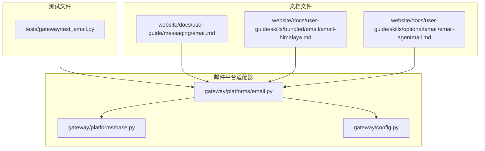
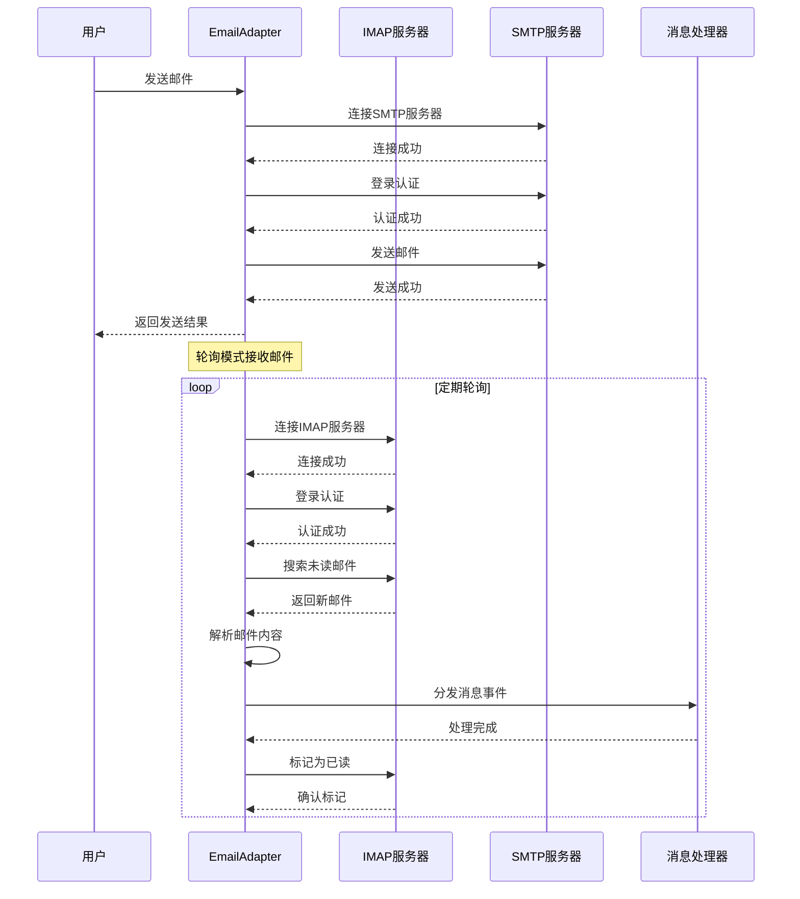
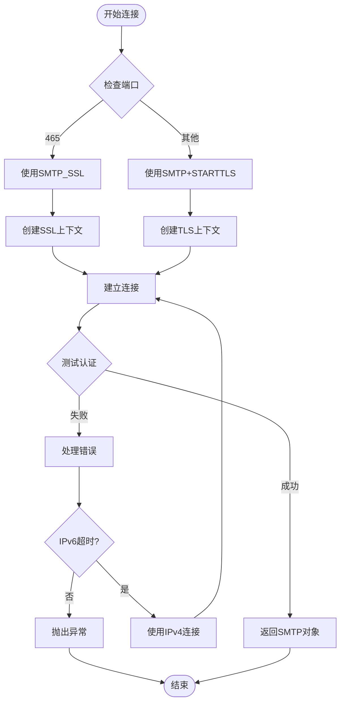
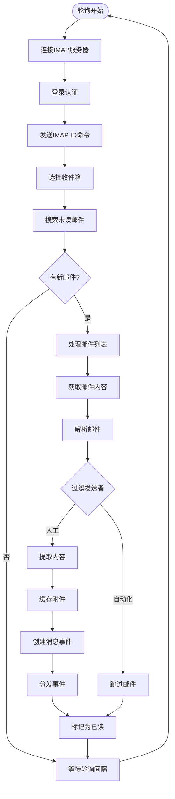
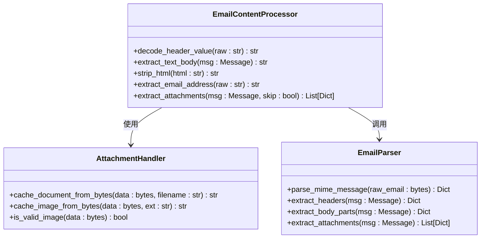
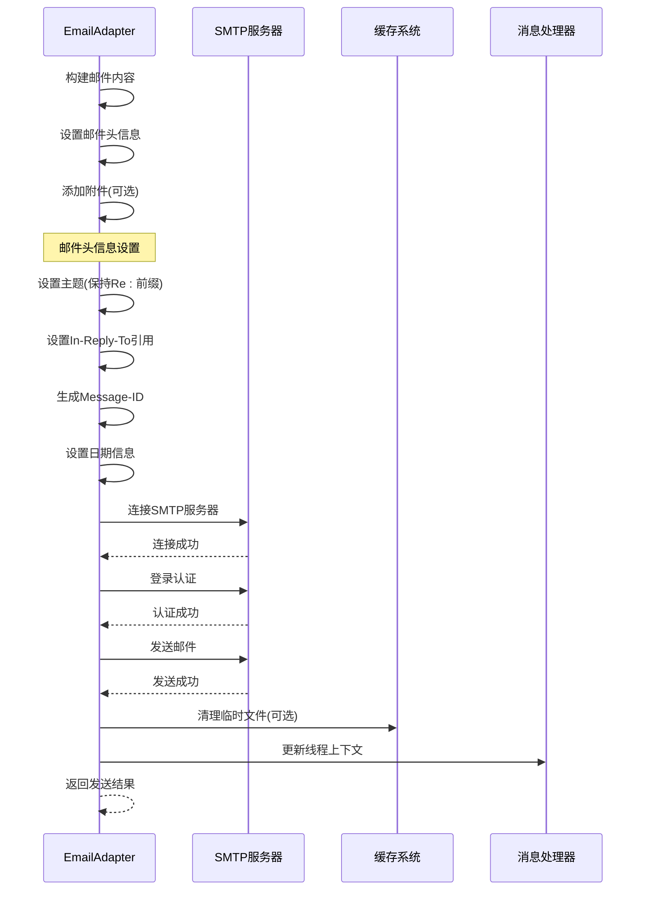
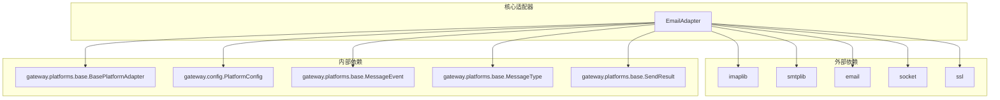

# 邮件平台适配器

<cite>
**本文档引用的文件**
- [gateway/platforms/email.py](file://gateway/platforms/email.py)
- [tests/gateway/test_email.py](file://tests/gateway/test_email.py)
- [website/docs/user-guide/messaging/email.md](file://website/docs/user-guide/messaging/email.md)
- [website/docs/user-guide/skills/bundled/email/email-himalaya.md](file://website/docs/user-guide/skills/bundled/email/email-himalaya.md)
- [website/docs/user-guide/skills/optional/email/email-agentmail.md](file://website/docs/user-guide/skills/optional/email/email-agentmail.md)
- [gateway/platforms/base.py](file://gateway/platforms/base.py)
- [gateway/config.py](file://gateway/config.py)
</cite>

## 目录
1. [简介](#简介)
2. [项目结构](#项目结构)
3. [核心组件](#核心组件)
4. [架构概览](#架构概览)
5. [详细组件分析](#详细组件分析)
6. [依赖关系分析](#依赖关系分析)
7. [性能考虑](#性能考虑)
8. [故障排除指南](#故障排除指南)
9. [结论](#结论)
10. [附录](#附录)

## 简介

邮件平台适配器是 Hermes Agent 框架中的一个关键组件，它允许用户通过电子邮件与 Hermes 进行交互。该适配器使用标准的 IMAP 和 SMTP 协议来实现邮件的接收和发送功能，无需特殊的客户端或机器人 API。

该适配器的主要特点包括：
- 使用 Python 内置的 `imaplib`、`smtplib` 和 `email` 模块
- 支持自动化的邮件接收和回复
- 提供附件处理和邮件格式支持
- 实现邮件分类和过滤机制
- 支持多种邮件服务商（Gmail、Outlook、Yahoo、Fastmail 等）

## 项目结构

邮件平台适配器位于 Hermes Agent 项目的 `gateway/platforms/` 目录下，主要包含以下文件：

**图表来源**
- [gateway/platforms/email.py:1-884](file://gateway/platforms/email.py#L1-L884)
- [gateway/platforms/base.py:1-200](file://gateway/platforms/base.py#L1-L200)
- [gateway/config.py:1-200](file://gateway/config.py#L1-L200)

**章节来源**
- [gateway/platforms/email.py:1-884](file://gateway/platforms/email.py#L1-L884)
- [tests/gateway/test_email.py:1-1388](file://tests/gateway/test_email.py#L1-L1388)

## 核心组件

邮件平台适配器的核心组件包括：

### EmailAdapter 类
这是适配器的主要类，继承自 `BasePlatformAdapter`，实现了完整的邮件收发功能。

### 辅助函数
- `_create_ipv4_connection`: 创建 IPv4 连接，避免 IPv6 延迟问题
- `_send_imap_id`: 发送 IMAP ID 命令，支持特定邮件服务商
- `_is_automated_sender`: 识别自动化/垃圾邮件发送者
- `_extract_text_body`: 提取邮件正文内容
- `_extract_attachments`: 处理邮件附件

### 配置管理
- 环境变量支持：`EMAIL_ADDRESS`、`EMAIL_PASSWORD`、`EMAIL_IMAP_HOST`、`EMAIL_SMTP_HOST` 等
- 平台配置：支持在 `config.yaml` 中进行额外配置

**章节来源**
- [gateway/platforms/email.py:303-884](file://gateway/platforms/email.py#L303-L884)
- [gateway/platforms/email.py:160-168](file://gateway/platforms/email.py#L160-L168)

## 架构概览

邮件平台适配器采用异步架构设计，实现了高效的邮件处理流程：

**图表来源**
- [gateway/platforms/email.py:396-432](file://gateway/platforms/email.py#L396-L432)
- [gateway/platforms/email.py:446-455](file://gateway/platforms/email.py#L446-L455)
- [gateway/platforms/email.py:457-530](file://gateway/platforms/email.py#L457-L530)

## 详细组件分析

### SMTP 连接管理

SMTP 连接管理是适配器的重要组成部分，支持多种连接方式：

**图表来源**
- [gateway/platforms/email.py:354-395](file://gateway/platforms/email.py#L354-L395)

SMTP 连接的关键特性：
- 自动选择合适的连接方式（隐式 TLS vs 显式 STARTTLS）
- IPv6 到 IPv4 的优雅降级
- SSL/TLS 上下文的安全配置
- 连接超时和错误处理

**章节来源**
- [gateway/platforms/email.py:354-395](file://gateway/platforms/email.py#L354-L395)

### IMAP 邮件接收

IMAP 邮件接收机制实现了高效的消息获取和处理：

**图表来源**
- [gateway/platforms/email.py:457-530](file://gateway/platforms/email.py#L457-L530)

IMAP 接收的关键功能：
- 异步轮询机制，支持可配置的轮询间隔
- 已读邮件跟踪，防止重复处理
- 自动化发送者过滤
- 附件缓存和本地存储

**章节来源**
- [gateway/platforms/email.py:457-530](file://gateway/platforms/email.py#L457-L530)

### 邮件内容处理

邮件内容处理模块负责解析和转换各种格式的邮件内容：

**图表来源**
- [gateway/platforms/email.py:171-301](file://gateway/platforms/email.py#L171-L301)
- [gateway/platforms/base.py:594-619](file://gateway/platforms/base.py#L594-L619)
- [gateway/platforms/base.py:1247-1276](file://gateway/platforms/base.py#L1247-L1276)

邮件内容处理的关键特性：
- 支持多种字符编码的头部解码
- HTML 到纯文本的智能转换
- MIME 多部分消息的递归解析
- 附件类型检测和缓存管理

**章节来源**
- [gateway/platforms/email.py:171-301](file://gateway/platforms/email.py#L171-L301)

### 邮件发送机制

邮件发送机制提供了灵活的回复和通知功能：

**图表来源**
- [gateway/platforms/email.py:611-670](file://gateway/platforms/email.py#L611-L670)
- [gateway/platforms/email.py:744-796](file://gateway/platforms/email.py#L744-L796)

邮件发送的关键功能：
- 自动线程维护和引用链管理
- 多种发送方式支持（单个附件、多个附件、图片链接）
- 错误处理和连接清理
- 发送结果跟踪和日志记录

**章节来源**
- [gateway/platforms/email.py:611-670](file://gateway/platforms/email.py#L611-L670)
- [gateway/platforms/email.py:744-796](file://gateway/platforms/email.py#L744-L796)

### 安全和认证配置

邮件适配器实现了多层次的安全保护机制：

| 安全特性 | 实现方式 | 配置参数 |
|---------|---------|---------|
| 认证保护 | 应用密码和两步验证 | `EMAIL_PASSWORD` |
| 发送者白名单 | 允许列表过滤 | `EMAIL_ALLOWED_USERS` |
| 自动化过滤 | 识别垃圾邮件发送者 | 内置模式匹配 |
| 连接加密 | SSL/TLS 加密传输 | 默认端口配置 |
| 文件安全 | 附件类型验证和缓存 | 图片魔数检查 |

**章节来源**
- [gateway/platforms/email.py:48-61](file://gateway/platforms/email.py#L48-L61)
- [gateway/platforms/email.py:545-556](file://gateway/platforms/email.py#L545-L556)

## 依赖关系分析

邮件平台适配器的依赖关系图：

**图表来源**
- [gateway/platforms/email.py:18-47](file://gateway/platforms/email.py#L18-L47)
- [gateway/platforms/base.py:1401-1505](file://gateway/platforms/base.py#L1401-L1505)

**章节来源**
- [gateway/platforms/email.py:18-47](file://gateway/platforms/email.py#L18-L47)
- [gateway/platforms/base.py:1401-1505](file://gateway/platforms/base.py#L1401-L1505)

## 性能考虑

邮件平台适配器在设计时充分考虑了性能优化：

### 连接池和资源管理
- 使用连接复用减少网络开销
- 及时关闭和清理连接资源
- 实现连接超时和重试机制

### 内存管理
- 限制已处理邮件 UID 的内存占用
- 定期清理过期的线程上下文
- 附件缓存的生命周期管理

### 异步处理
- 使用 asyncio 实现非阻塞 I/O
- 并行处理多个邮件操作
- 合理的轮询间隔配置

### 网络优化
- IPv6 到 IPv4 的优雅降级
- 连接状态监控和健康检查
- 错误恢复和故障转移

## 故障排除指南

### 常见问题和解决方案

| 问题类型 | 症状描述 | 可能原因 | 解决方案 |
|---------|---------|---------|---------|
| IMAP 连接失败 | 启动时报 "IMAP connection failed" | 主机名错误、端口不可达、认证失败 | 验证 `EMAIL_IMAP_HOST` 和 `EMAIL_IMAP_PORT`，确保 IMAP 已启用 |
| SMTP 连接失败 | 启动时报 "SMTP connection failed" | 主机名错误、端口不可达、证书验证失败 | 验证 `EMAIL_SMTP_HOST` 和 `EMAIL_SMTP_PORT`，检查防火墙设置 |
| 认证失败 | "Authentication failed" | 密码错误、应用密码无效 | 对于 Gmail 使用应用密码，确保两步验证已启用 |
| 消息未接收 | 邮件没有被处理 | 发送者不在允许列表、自动化过滤 | 检查 `EMAIL_ALLOWED_USERS` 配置，确认发送者地址正确 |
| 重复回复 | 出现重复邮件回复 | 多个网关实例运行、UID 跟踪问题 | 确保只有一个网关实例运行，检查进程状态 |

### 调试技巧

1. **启用详细日志**：检查 `gateway.log` 文件中的详细错误信息
2. **网络连通性测试**：使用 `telnet` 或 `openssl s_client` 测试端口连通性
3. **认证测试**：使用 `openssl s_client` 测试 SSL/TLS 连接
4. **邮件头分析**：检查邮件头信息是否符合预期格式

**章节来源**
- [website/docs/user-guide/messaging/email.md:157-168](file://website/docs/user-guide/messaging/email.md#L157-L168)

## 结论

邮件平台适配器是一个功能完整、设计合理的邮件集成解决方案。它成功地将标准的 IMAP 和 SMTP 协议与 Hermes Agent 的框架相结合，提供了：

- **可靠性**：基于标准协议的稳定实现
- **安全性**：多层安全保护机制
- **可扩展性**：模块化设计支持功能扩展
- **易用性**：简单的环境变量配置
- **性能**：异步处理和优化的资源管理

该适配器为用户提供了无缝的邮件通信体验，支持多种邮件服务商，并且具有良好的故障恢复能力。

## 附录

### 配置选项参考

| 配置项 | 必需 | 默认值 | 描述 |
|-------|------|--------|------|
| `EMAIL_ADDRESS` | 是 | - | 代理的邮箱地址 |
| `EMAIL_PASSWORD` | 是 | - | 邮箱密码或应用密码 |
| `EMAIL_IMAP_HOST` | 是 | - | IMAP 服务器主机名 |
| `EMAIL_SMTP_HOST` | 是 | - | SMTP 服务器主机名 |
| `EMAIL_IMAP_PORT` | 否 | `993` | IMAP 服务器端口 |
| `EMAIL_SMTP_PORT` | 否 | `587` | SMTP 服务器端口 |
| `EMAIL_POLL_INTERVAL` | 否 | `15` | 收件箱检查间隔（秒） |
| `EMAIL_ALLOWED_USERS` | 否 | - | 允许的发送者邮箱列表 |
| `EMAIL_HOME_ADDRESS` | 否 | - | Cron 作业的默认投递目标 |

### 支持的邮件服务商

| 服务商 | IMAP 主机 | SMTP 主机 | 端口配置 |
|-------|-----------|-----------|----------|
| Gmail | `imap.gmail.com` | `smtp.gmail.com` | IMAP: 993, SMTP: 587/465 |
| Outlook | `outlook.office365.com` | `smtp.office365.com` | IMAP: 993, SMTP: 587/465 |
| Yahoo | `imap.mail.yahoo.com` | `smtp.mail.yahoo.com` | IMAP: 993, SMTP: 587/465 |
| Fastmail | `mail.messagingengine.com` | `mail.messagingengine.com` | IMAP: 993, SMTP: 587/465 |
| QQ邮箱 | `imap.qq.com` | `smtp.qq.com` | IMAP: 993, SMTP: 587/465 |
| 163/126 | `imap.163.com`/`imap.126.com` | `smtp.163.com`/`smtp.126.com` | IMAP: 993, SMTP: 587/465 |

### 高级功能

1. **附件处理**：支持图片和文档附件的自动缓存和处理
2. **邮件分类**：内置自动化发送者识别和过滤
3. **线程管理**：维护邮件回复的引用链
4. **错误恢复**：自动重试和故障转移机制
5. **性能监控**：连接状态和性能指标跟踪