# Telegram平台适配器

<cite>
**本文档引用的文件**
- [telegram.py](file://gateway/platforms/telegram.py)
- [telegram_network.py](file://gateway/platforms/telegram_network.py)
- [telegram_managed_bot.py](file://hermes_cli/telegram_managed_bot.py)
</cite>

## 目录
1. [简介](#简介)
2. [项目结构](#项目结构)
3. [核心组件](#核心组件)
4. [架构概览](#架构概览)
5. [详细组件分析](#详细组件分析)
6. [依赖关系分析](#依赖关系分析)
7. [性能考虑](#性能考虑)
8. [故障排除指南](#故障排除指南)
9. [结论](#结论)

## 简介
Telegram平台适配器是Hermes Agent系统中的关键组件，负责与Telegram Bot API进行集成，支持长轮询和Webhook两种消息接收方式。该适配器实现了丰富的Telegram特性，包括Inline模式、按钮交互、话题线程、DM主题等，并提供了完善的权限控制和管理员功能。

## 项目结构
Telegram适配器主要由三个核心文件组成：

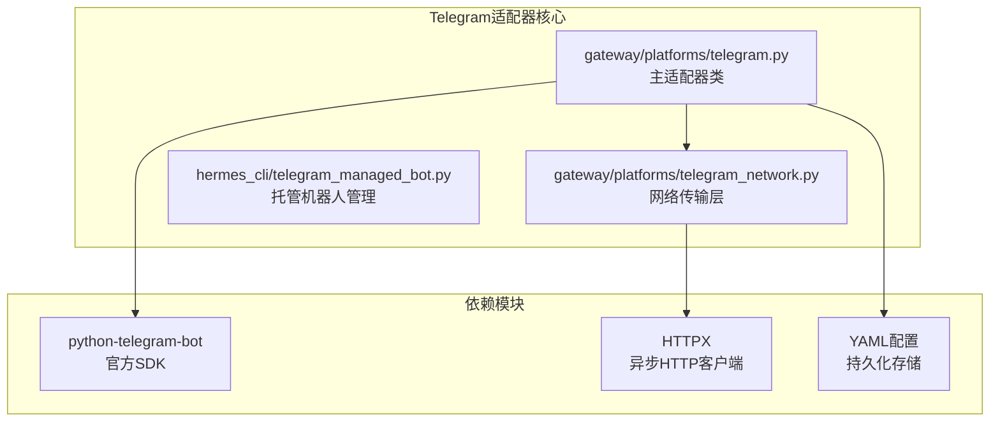

**图表来源**
- [telegram.py:1-800](file://gateway/platforms/telegram.py#L1-L800)
- [telegram_network.py:1-260](file://gateway/platforms/telegram_network.py#L1-L260)

**章节来源**
- [telegram.py:1-100](file://gateway/platforms/telegram.py#L1-L100)
- [telegram_network.py:1-50](file://gateway/platforms/telegram_network.py#L1-L50)

## 核心组件
Telegram适配器包含以下核心组件：

### 主要类结构
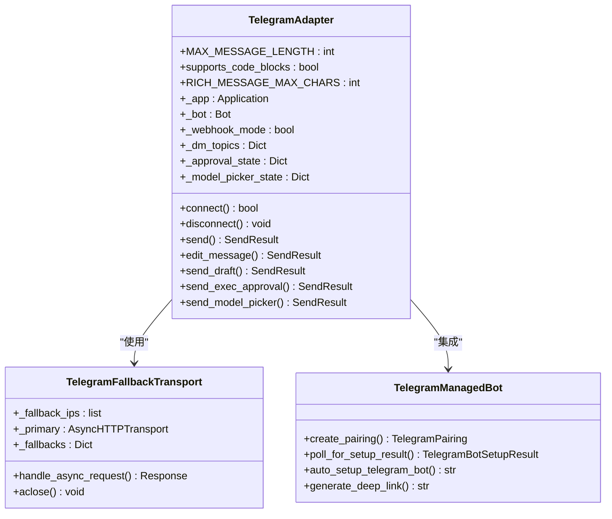

**图表来源**
- [telegram.py:337-500](file://gateway/platforms/telegram.py#L337-L500)
- [telegram_network.py:52-130](file://gateway/platforms/telegram_network.py#L52-L130)

### 关键配置参数
适配器支持丰富的配置选项：

| 配置项 | 类型 | 默认值 | 描述 |
|--------|------|--------|------|
| HERMES_TELEGRAM_HTTP_POOL_SIZE | int | 512 | HTTP连接池大小 |
| HERMES_TELEGRAM_HTTP_POOL_TIMEOUT | float | 8.0 | 连接池超时时间 |
| HERMES_TELEGRAM_HTTP_CONNECT_TIMEOUT | float | 10.0 | 连接超时时间 |
| HERMES_TELEGRAM_HTTP_READ_TIMEOUT | float | 20.0 | 读取超时时间 |
| HERMES_TELEGRAM_HTTP_WRITE_TIMEOUT | float | 20.0 | 写入超时时间 |
| TELEGRAM_WEBHOOK_URL | str | 无 | Webhook服务器URL |
| TELEGRAM_WEBHOOK_PORT | int | 8443 | Webhook监听端口 |
| TELEGRAM_WEBHOOK_SECRET | str | 必需 | Webhook安全密钥 |

**章节来源**
- [telegram.py:2020-2080](file://gateway/platforms/telegram.py#L2020-L2080)
- [telegram.py:2125-2170](file://gateway/platforms/telegram.py#L2125-L2170)

## 架构概览
Telegram适配器采用分层架构设计，确保高可用性和可扩展性：

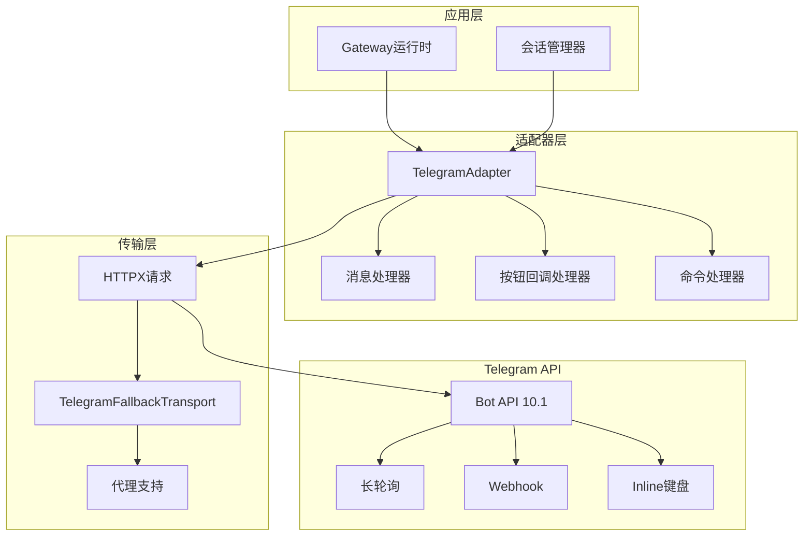

**图表来源**
- [telegram.py:1967-2260](file://gateway/platforms/telegram.py#L1967-L2260)
- [telegram_network.py:52-130](file://gateway/platforms/telegram_network.py#L52-L130)

## 详细组件分析

### 消息处理系统
Telegram适配器实现了完整的消息处理流程：

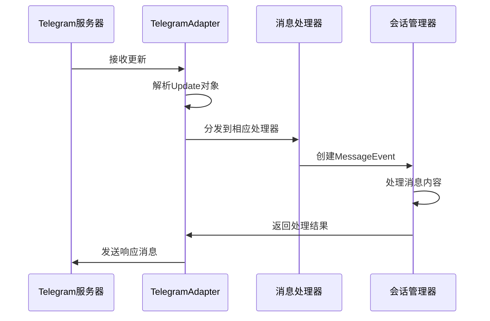

**图表来源**
- [telegram.py:2083-2100](file://gateway/platforms/telegram.py#L2083-L2100)

#### 文本消息处理
文本消息通过专用过滤器处理，支持MarkdownV2格式化：

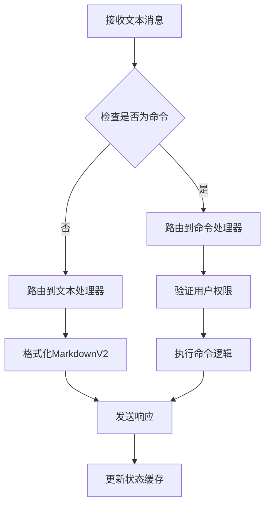

**图表来源**
- [telegram.py:2083-2098](file://gateway/platforms/telegram.py#L2083-L2098)

#### 媒体文件处理
支持多种媒体类型的自动处理：

| 媒体类型 | 支持格式 | 处理方式 |
|----------|----------|----------|
| 图片 | PNG, JPG, JPEG, WEBP, GIF | 缓存并转换为Telegram支持格式 |
| 视频 | MP4, AVI, MOV等 | 转码和压缩处理 |
| 音频 | MP3, AAC, FLAC等 | 元数据提取和格式转换 |
| 文档 | PDF, DOC, TXT等 | 预览生成和下载链接 |

**章节来源**
- [telegram.py:92-106](file://gateway/platforms/telegram.py#L92-L106)
- [telegram.py:2095-2098](file://gateway/platforms/telegram.py#L2095-L2098)

### 按钮交互系统
Telegram适配器提供了完整的Inline键盘交互功能：

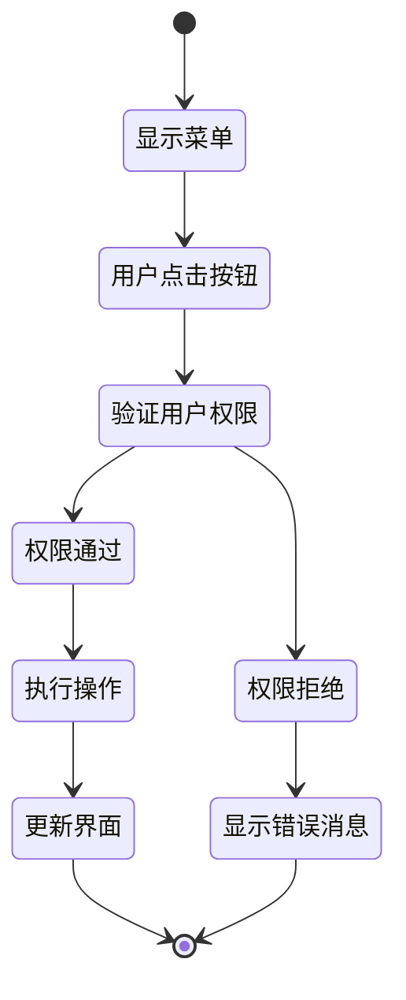

**图表来源**
- [telegram.py:3876-3999](file://gateway/platforms/telegram.py#L3876-L3999)

#### 模型选择器
提供两级模型选择界面：

1. **提供商选择阶段**：显示所有可用的AI模型提供商
2. **模型选择阶段**：按页显示具体模型列表（每页8个）
3. **确认阶段**：显示昂贵模型警告并要求二次确认

**章节来源**
- [telegram.py:3412-3574](file://gateway/platforms/telegram.py#L3412-L3574)
- [telegram.py:3576-3874](file://gateway/platforms/telegram.py#L3576-L3874)

### 权限控制系统
实现了多层级的权限验证机制：

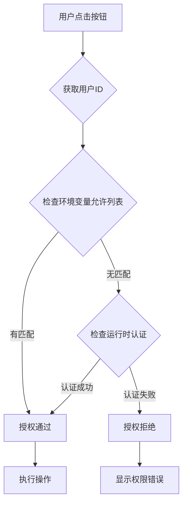

**图表来源**
- [telegram.py:532-582](file://gateway/platforms/telegram.py#L532-L582)

**章节来源**
- [telegram.py:532-582](file://gateway/platforms/telegram.py#L532-L582)

### 网络连接管理
提供了智能的网络连接管理：

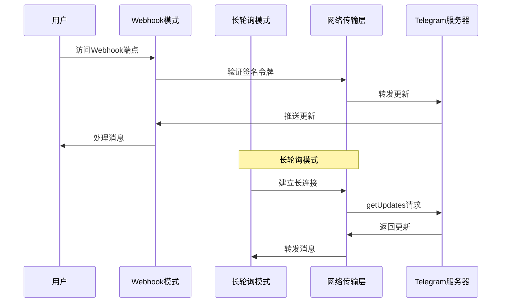

**图表来源**
- [telegram.py:2124-2200](file://gateway/platforms/telegram.py#L2124-L2200)
- [telegram_network.py:73-124](file://gateway/platforms/telegram_network.py#L73-L124)

**章节来源**
- [telegram_network.py:52-130](file://gateway/platforms/telegram_network.py#L52-L130)

### DM主题和话题线程
支持Telegram的私聊主题功能：

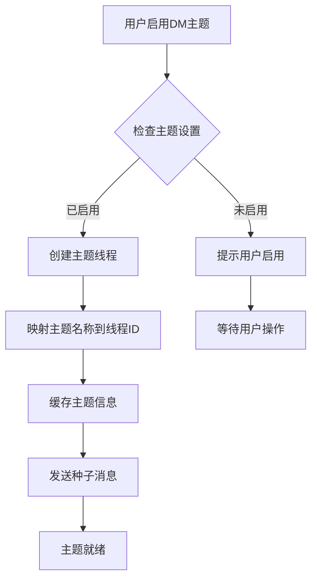

**图表来源**
- [telegram.py:1655-1704](file://gateway/platforms/telegram.py#L1655-L1704)

**章节来源**
- [telegram.py:1655-1775](file://gateway/platforms/telegram.py#L1655-L1775)

## 依赖关系分析

### 外部依赖
Telegram适配器依赖以下关键组件：

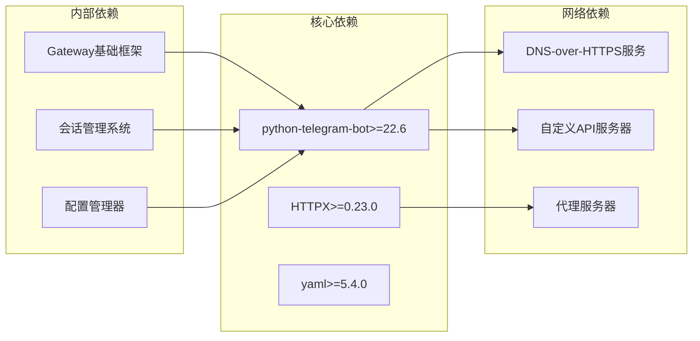

**图表来源**
- [telegram.py:24-62](file://gateway/platforms/telegram.py#L24-L62)
- [telegram_network.py:18-39](file://gateway/platforms/telegram_network.py#L18-L39)

### 内部耦合关系
适配器内部各组件之间的依赖关系：

| 组件 | 依赖组件 | 用途 |
|------|----------|------|
| TelegramAdapter | BasePlatformAdapter | 基础平台适配器功能 |
| TelegramAdapter | TelegramFallbackTransport | 网络传输层 |
| TelegramAdapter | rich_sent_store | 富文本消息存储 |
| TelegramAdapter | session | 会话管理 |
| TelegramFallbackTransport | HTTPXRequest | 异步HTTP请求 |
| telegram_managed_bot | httpx | HTTP客户端 |

**章节来源**
- [telegram.py:68-90](file://gateway/platforms/telegram.py#L68-L90)
- [telegram_network.py:18-20](file://gateway/platforms/telegram_network.py#L18-L20)

## 性能考虑

### 消息长度优化
Telegram适配器针对Telegram的消息长度限制进行了专门优化：

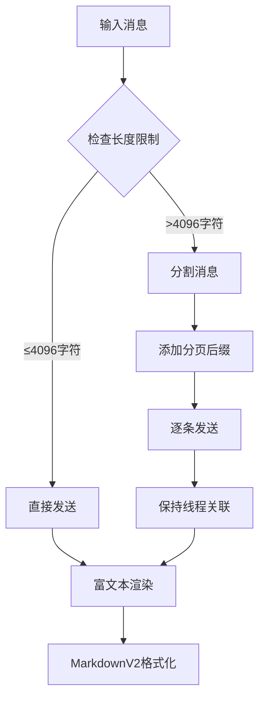

**图表来源**
- [telegram.py:2357-2370](file://gateway/platforms/telegram.py#L2357-L2370)

### 连接池管理
实现了智能的连接池管理策略：

| 参数 | 默认值 | 优化目标 |
|------|--------|----------|
| connection_pool_size | 512 | 最大并发连接数 |
| pool_timeout | 8.0秒 | 连接池等待超时 |
| connect_timeout | 10.0秒 | TCP连接超时 |
| read_timeout | 20.0秒 | 读取超时 |
| write_timeout | 20.0秒 | 写入超时 |

**章节来源**
- [telegram.py:2032-2038](file://gateway/platforms/telegram.py#L2032-L2038)

### 缓存策略
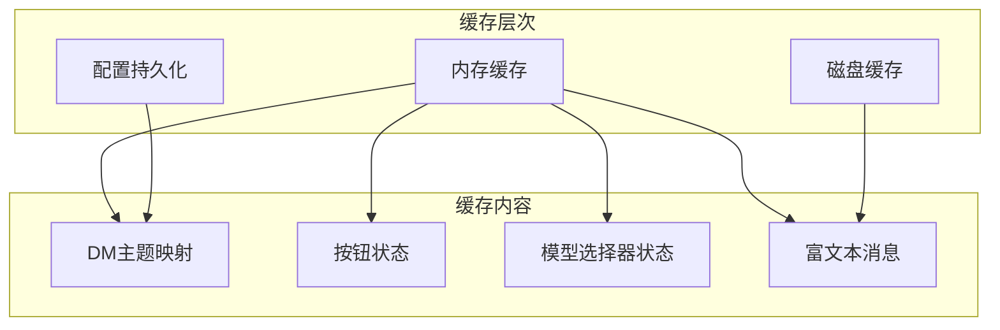

**图表来源**
- [telegram.py:493-502](file://gateway/platforms/telegram.py#L493-L502)
- [telegram.py:1800-1881](file://gateway/platforms/telegram.py#L1800-L1881)

## 故障排除指南

### 常见问题及解决方案

#### 网络连接问题
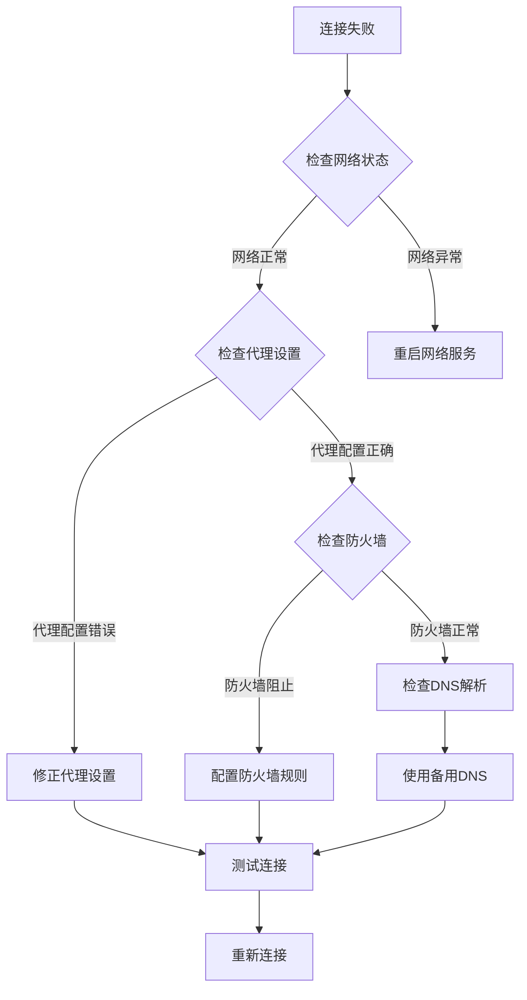

**图表来源**
- [telegram_network.py:195-239](file://gateway/platforms/telegram_network.py#L195-L239)

#### 消息发送失败
常见原因及处理方案：

| 错误类型 | 可能原因 | 解决方案 |
|----------|----------|----------|
| Message too long | 超过4096字符限制 | 自动分割消息 |
| Thread not found | 话题线程不存在 | 回退到普通消息 |
| Flood control | 频繁发送被限制 | 实施指数退避 |
| Bad request | 参数错误 | 验证API参数 |
| Network error | 网络不稳定 | 重试机制 |

**章节来源**
- [telegram.py:2434-2570](file://gateway/platforms/telegram.py#L2434-L2570)

#### Webhook配置问题
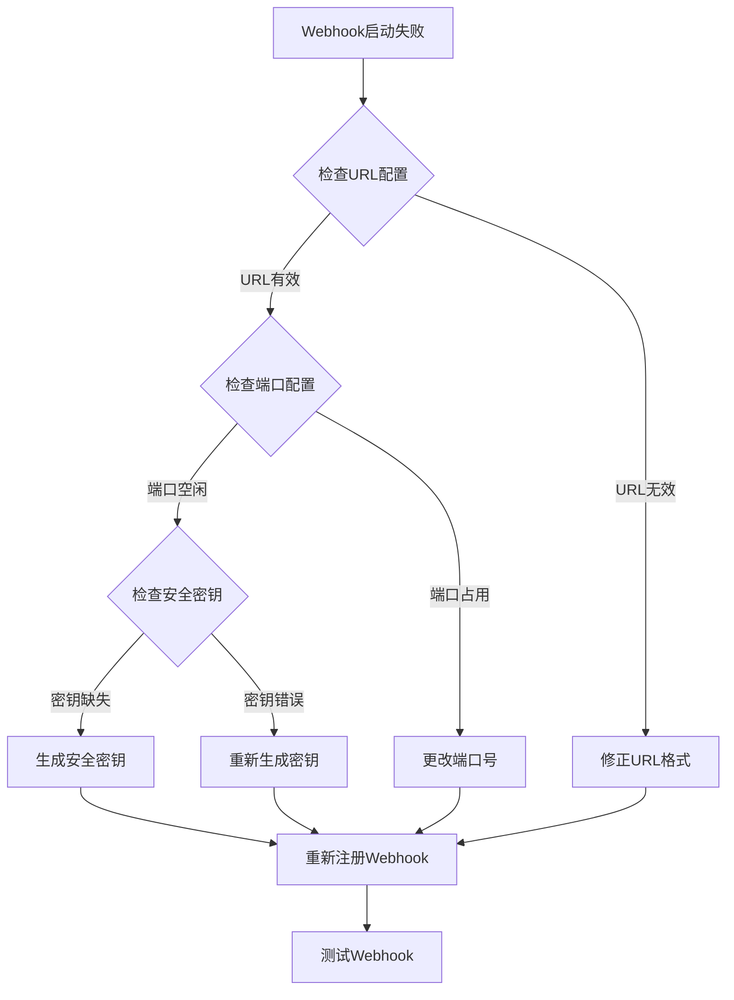

**图表来源**
- [telegram.py:2140-2153](file://gateway/platforms/telegram.py#L2140-L2153)

### 日志和监控
适配器提供了详细的日志记录机制：

| 日志级别 | 用途 | 示例 |
|----------|------|------|
| DEBUG | 详细调试信息 | API调用详情 |
| INFO | 正常操作日志 | 连接建立、消息发送 |
| WARNING | 警告信息 | 网络重连、权限拒绝 |
| ERROR | 错误信息 | API调用失败、配置错误 |

**章节来源**
- [telegram.py:1417-1497](file://gateway/platforms/telegram.py#L1417-L1497)
- [telegram.py:1543-1653](file://gateway/platforms/telegram.py#L1543-L1653)

## 结论
Telegram平台适配器是一个功能完整、架构清晰的集成组件。它不仅支持基本的消息收发功能，还提供了丰富的Telegram特色功能，包括Inline键盘交互、DM主题管理、权限控制等。通过智能的网络连接管理和性能优化策略，该适配器能够在各种网络环境下稳定运行。

主要优势包括：
1. **完整的Telegram特性支持**：从基础消息到高级功能全面覆盖
2. **高可用性设计**：智能重连、故障转移、连接池管理
3. **灵活的部署模式**：支持长轮询和Webhook两种模式
4. **强大的权限控制**：多层级权限验证机制
5. **优秀的性能表现**：针对Telegram限制的优化处理

该适配器为Hermes Agent系统提供了可靠的Telegram平台集成能力，是构建Telegram机器人的理想选择。