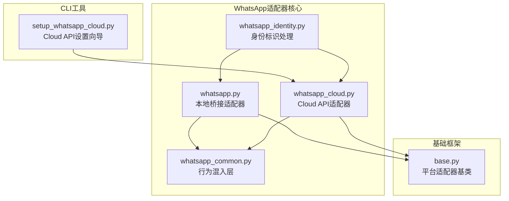
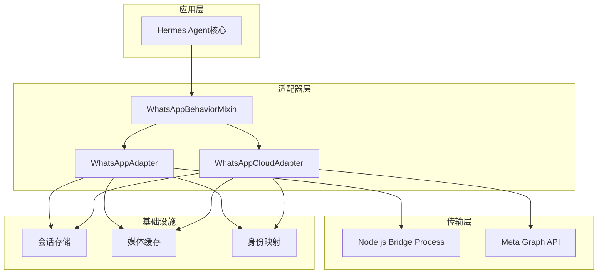
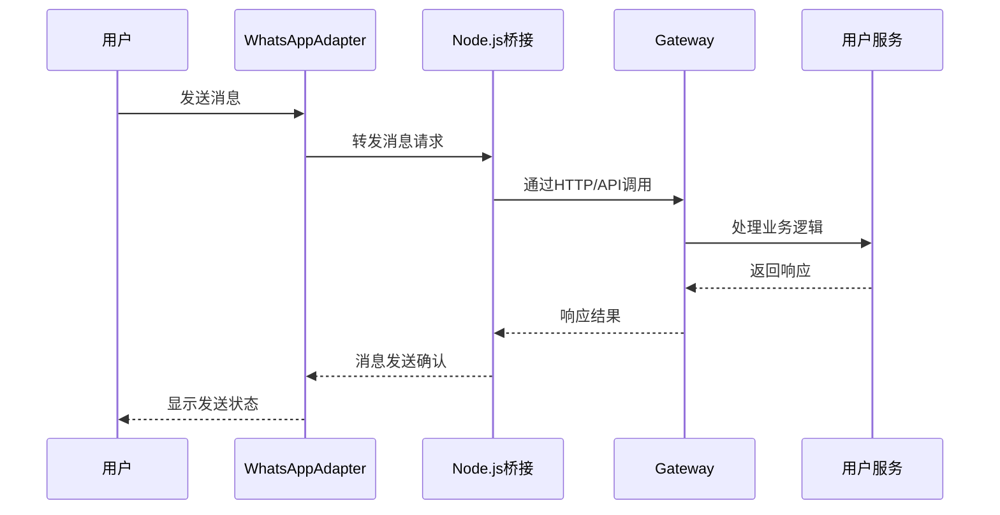
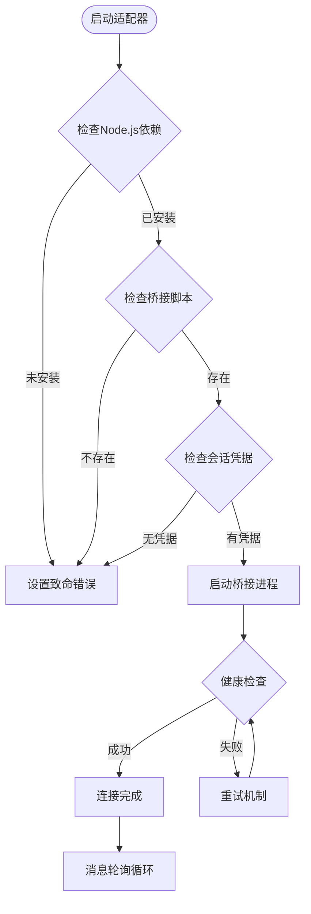
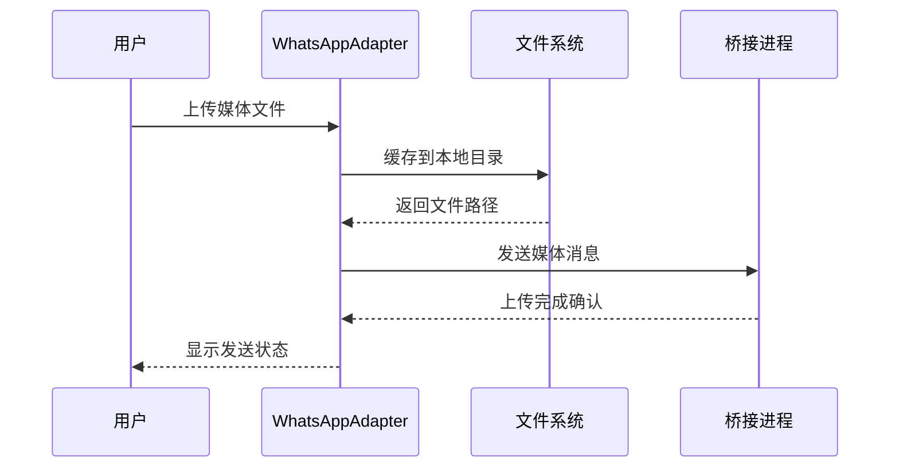
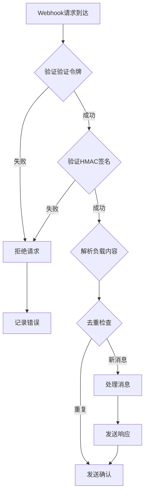
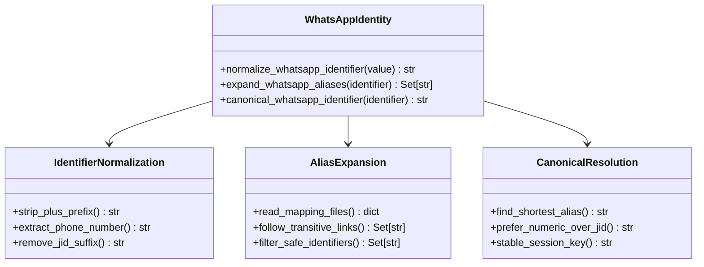
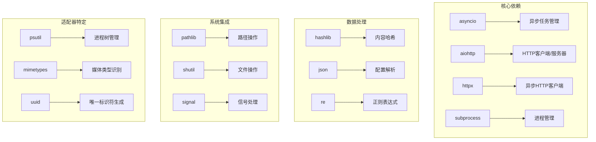
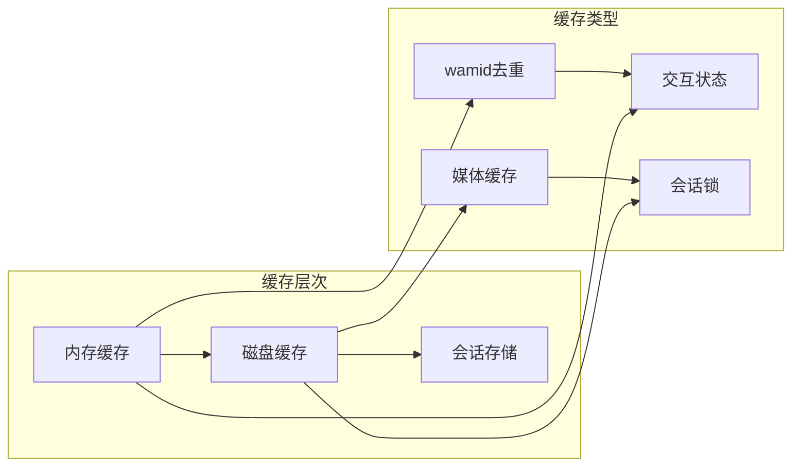
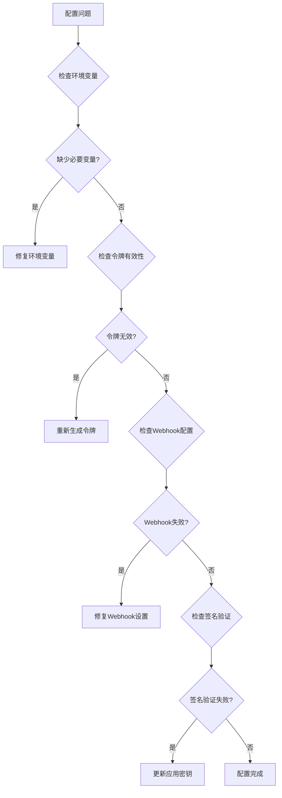

# WhatsApp平台适配器

<cite>
**本文档引用的文件**
- [whatsapp.py](file://gateway/platforms/whatsapp.py)
- [whatsapp_cloud.py](file://gateway/platforms/whatsapp_cloud.py)
- [whatsapp_common.py](file://gateway/platforms/whatsapp_common.py)
- [whatsapp_identity.py](file://gateway/whatsapp_identity.py)
- [setup_whatsapp_cloud.py](file://hermes_cli/setup_whatsapp_cloud.py)
- [base.py](file://gateway/platforms/base.py)
</cite>

## 目录
1. [简介](#简介)
2. [项目结构](#项目结构)
3. [核心组件](#核心组件)
4. [架构概览](#架构概览)
5. [详细组件分析](#详细组件分析)
6. [依赖关系分析](#依赖关系分析)
7. [性能考虑](#性能考虑)
8. [故障排除指南](#故障排除指南)
9. [结论](#结论)
10. [附录](#附录)

## 简介

WhatsApp平台适配器是Hermes Agent框架中用于连接和管理WhatsApp通信的核心模块。该适配器提供了两种不同的实现方式：WhatsApp Business API（Cloud API）和本地桥接模式（Personal Account），以满足不同使用场景的需求。

WhatsApp Business API是官方的Meta WhatsApp Business平台，适用于生产环境，需要业务账户和公共Webhook URL。本地桥接模式则通过Node.js子进程运行WhatsApp Web客户端，适用于个人账户使用。

该适配器实现了完整的WhatsApp功能集，包括文本消息、媒体文件传输、位置共享、联系人列表管理、消息状态回调和交互动画支持。同时提供了群组功能、成员管理和速率限制处理机制。

## 项目结构

WhatsApp平台适配器位于Hermes Agent项目的gateway/platforms目录下，主要包含以下核心文件：

**图表来源**
- [whatsapp.py:1-1194](file://gateway/platforms/whatsapp.py#L1-L1194)
- [whatsapp_cloud.py:1-1957](file://gateway/platforms/whatsapp_cloud.py#L1-L1957)
- [whatsapp_common.py:1-368](file://gateway/platforms/whatsapp_common.py#L1-L368)
- [whatsapp_identity.py:1-156](file://gateway/whatsapp_identity.py#L1-L156)

**章节来源**
- [whatsapp.py:1-1194](file://gateway/platforms/whatsapp.py#L1-L1194)
- [whatsapp_cloud.py:1-1957](file://gateway/platforms/whatsapp_cloud.py#L1-L1957)
- [whatsapp_common.py:1-368](file://gateway/platforms/whatsapp_common.py#L1-L368)
- [whatsapp_identity.py:1-156](file://gateway/whatsapp_identity.py#L1-L156)

## 核心组件

### WhatsAppBehaviorMixin（行为混入层）

WhatsAppBehaviorMixin是所有WhatsApp适配器的共享行为层，提供了跨平台的一致性功能：

- **访问控制策略**：支持开放、白名单和禁用三种DM/群组访问模式
- **提及检测系统**：支持显式@提及和自定义正则表达式模式
- **消息格式化**：将标准markdown转换为WhatsApp兼容格式
- **消息分块处理**：根据WhatsApp消息长度限制进行智能分块
- **广播过滤**：自动过滤状态更新和频道广播消息

### WhatsAppAdapter（本地桥接适配器）

本地桥接适配器通过Node.js子进程运行WhatsApp Web客户端，适用于个人账户使用：

- **多后端支持**：支持whatsapp-web.js和Baileys两种JavaScript桥接库
- **会话管理**：自动处理QR码配对、凭据存储和会话恢复
- **媒体缓存**：支持图片、音频和文档的本地缓存
- **进程监控**：提供桥接进程的生命周期管理和健康检查
- **消息去重**：处理快速连续发送的消息批处理

### WhatsAppCloudAdapter（Cloud API适配器）

Cloud API适配器直接与Meta的官方API交互，适用于生产环境：

- **Webhook服务器**：内置aiohttp服务器处理Meta的Webhook回调
- **HMAC签名验证**：支持X-Hub-Signature-256签名验证确保消息真实性
- **媒体上传**：支持图片、视频、音频和文档的上传和下载
- **交互式消息**：支持按钮和列表形式的交互动画
- **速率限制**：遵循Meta的API速率限制和合规要求

**章节来源**
- [whatsapp_common.py:44-368](file://gateway/platforms/whatsapp_common.py#L44-L368)
- [whatsapp.py:233-760](file://gateway/platforms/whatsapp.py#L233-L760)
- [whatsapp_cloud.py:178-421](file://gateway/platforms/whatsapp_cloud.py#L178-L421)

## 架构概览

WhatsApp平台适配器采用分层架构设计，确保了代码的可维护性和扩展性：

**图表来源**
- [whatsapp_common.py:44-80](file://gateway/platforms/whatsapp_common.py#L44-L80)
- [whatsapp.py:233-294](file://gateway/platforms/whatsapp.py#L233-L294)
- [whatsapp_cloud.py:178-222](file://gateway/platforms/whatsapp_cloud.py#L178-L222)

### 消息处理流程

**图表来源**
- [whatsapp.py:700-760](file://gateway/platforms/whatsapp.py#L700-L760)
- [whatsapp_cloud.py:423-491](file://gateway/platforms/whatsapp_cloud.py#L423-L491)

## 详细组件分析

### 本地桥接适配器（WhatsAppAdapter）

本地桥接适配器通过Node.js子进程运行WhatsApp Web客户端，提供了最接近原生WhatsApp体验的功能：

#### 进程管理机制

**图表来源**
- [whatsapp.py:332-597](file://gateway/platforms/whatsapp.py#L332-L597)

#### 文本消息处理

本地桥接适配器实现了智能的消息批处理机制，有效避免了WhatsApp的速率限制：

- **消息去重**：合并快速连续发送的消息
- **分块发送**：根据WhatsApp限制自动分割长消息
- **回复处理**：支持消息回复和引用功能
- **Markdown转换**：将标准markdown转换为WhatsApp兼容格式

#### 媒体文件传输

**图表来源**
- [whatsapp.py:794-860](file://gateway/platforms/whatsapp.py#L794-L860)

**章节来源**
- [whatsapp.py:233-760](file://gateway/platforms/whatsapp.py#L233-L760)

### Cloud API适配器（WhatsAppCloudAdapter）

Cloud API适配器直接与Meta的官方API交互，提供了企业级的稳定性和安全性：

#### Webhook处理机制

**图表来源**
- [whatsapp_cloud.py:348-405](file://gateway/platforms/whatsapp_cloud.py#L348-L405)

#### 交互动画支持

Cloud API适配器提供了丰富的交互动画功能：

- **快速回复按钮**：最多3个内联按钮，支持澄清和决策
- **列表选择**：支持最多10行的下拉列表，适合复杂选项
- **命令审批**：危险命令执行前的用户确认界面
- **状态指示**：显示正在输入的状态指示器

#### 媒体处理能力

Cloud API适配器支持多种媒体类型的上传和处理：

- **图片**：最大5MB，支持JPEG和PNG格式
- **视频**：最大16MB，支持MP4格式
- **音频**：最大16MB，支持MP3、AAC、AMR和OGG格式
- **文档**：最大100MB，支持各种文档格式
- **贴纸**：最大100KB静态贴纸，100KB动画贴纸

**章节来源**
- [whatsapp_cloud.py:178-800](file://gateway/platforms/whatsapp_cloud.py#L178-L800)

### 身份标识管理系统

WhatsApp平台适配器提供了统一的身份标识管理机制，确保在不同JID格式间的一致性：

**图表来源**
- [whatsapp_identity.py:48-156](file://gateway/whatsapp_identity.py#L48-L156)

**章节来源**
- [whatsapp_identity.py:1-156](file://gateway/whatsapp_identity.py#L1-L156)

## 依赖关系分析

WhatsApp平台适配器的依赖关系相对简洁，主要依赖于Python标准库和第三方库：

**图表来源**
- [whatsapp.py:18-33](file://gateway/platforms/whatsapp.py#L18-L33)
- [whatsapp_cloud.py:44-84](file://gateway/platforms/whatsapp_cloud.py#L44-L84)

### 第三方库依赖

| 库名称 | 版本要求 | 用途 |
|--------|----------|------|
| aiohttp | >=3.0 | Webhook服务器和HTTP客户端 |
| httpx | >=0.18 | 异步HTTP客户端（Cloud API） |
| psutil | >=5.0 | 进程树管理和监控 |
| python-magic | 可选 | 文件类型检测 |

**章节来源**
- [whatsapp.py:177-231](file://gateway/platforms/whatsapp.py#L177-L231)
- [whatsapp_cloud.py:57-83](file://gateway/platforms/whatsapp_cloud.py#L57-L83)

## 性能考虑

### 速率限制和配额管理

WhatsApp平台适配器实现了多层次的速率限制保护机制：

- **Cloud API速率限制**：遵循Meta的官方API限制，包括每秒请求次数和每日配额
- **本地桥接限制**：通过消息批处理和延迟机制避免触发WhatsApp的反滥用机制
- **内存使用优化**：使用有序字典实现有限大小的缓存，避免内存泄漏
- **网络连接池**：复用HTTP连接减少建立连接的开销

### 缓存策略

**图表来源**
- [whatsapp_cloud.py:251-271](file://gateway/platforms/whatsapp_cloud.py#L251-L271)

### 并发处理

适配器采用了异步编程模型来处理高并发场景：

- **消息轮询**：使用异步任务定期检查新消息
- **非阻塞I/O**：所有网络操作都是异步的
- **连接复用**：HTTP客户端复用连接减少延迟
- **背压处理**：通过队列机制防止消息积压

## 故障排除指南

### 常见问题诊断

#### Cloud API配置问题

**图表来源**
- [whatsapp_cloud.py:348-405](file://gateway/platforms/whatsapp_cloud.py#L348-L405)

#### 本地桥接问题

- **Node.js依赖缺失**：确保已安装Node.js 16+
- **QR码配对失败**：检查会话目录权限和网络连接
- **媒体文件传输问题**：验证缓存目录可用空间
- **进程崩溃**：查看bridge.log文件获取详细错误信息

### 错误处理机制

适配器实现了完善的错误处理和恢复机制：

- **致命错误标记**：使用`_set_fatal_error`方法标记不可恢复的错误
- **自动重连**：在网络中断或API限制时自动重试
- **降级模式**：在部分功能失效时保持基本通信能力
- **日志记录**：详细的错误日志便于问题诊断

**章节来源**
- [whatsapp.py:617-648](file://gateway/platforms/whatsapp.py#L617-L648)
- [whatsapp_cloud.py:407-421](file://gateway/platforms/whatsapp_cloud.py#L407-L421)

## 结论

WhatsApp平台适配器提供了完整的企业级WhatsApp集成解决方案，具有以下优势：

### 技术优势

- **双模式支持**：既支持生产级的Cloud API，也支持灵活的本地桥接模式
- **企业级特性**：完整的Webhook处理、HMAC签名验证和速率限制管理
- **用户体验**：支持交互动画、状态指示和多媒体消息
- **可扩展性**：模块化的架构设计便于功能扩展和定制

### 使用建议

对于大多数企业应用场景，推荐使用Cloud API模式，因为它提供了更好的稳定性、安全性和合规性。对于个人使用或开发测试，本地桥接模式更加便捷易用。

无论选择哪种模式，都建议仔细配置访问控制策略和监控机制，确保系统的稳定运行。

## 附录

### 配置参数参考

#### 通用配置参数

| 参数名 | 类型 | 默认值 | 描述 |
|--------|------|--------|------|
| dm_policy | string | "open" | DM访问策略：open/allowlist/disabled |
| group_policy | string | "open" | 群组访问策略：open/allowlist/disabled |
| reply_prefix | string | "⚕ *Hermes Agent*\n────────────\n" | 回复前缀文本 |
| require_mention | boolean | false | 是否需要@提及才响应 |
| mention_patterns | array | null | 自定义提及正则表达式 |

#### Cloud API专用参数

| 参数名 | 类型 | 默认值 | 描述 |
|--------|------|--------|------|
| phone_number_id | string | 必填 | WhatsApp电话号码ID |
| access_token | string | 必填 | Meta访问令牌 |
| webhook_host | string | "0.0.0.0" | Webhook监听地址 |
| webhook_port | integer | 8090 | Webhook监听端口 |
| verify_token | string | 自动生成 | Webhook验证令牌 |
| app_secret | string | 可选 | HMAC签名验证密钥 |

#### 本地桥接专用参数

| 参数名 | 类型 | 默认值 | 描述 |
|--------|------|--------|------|
| bridge_script | string | 自动定位 | 桥接脚本路径 |
| bridge_port | integer | 3000 | 桥接HTTP端口 |
| session_path | string | 自动创建 | 会话数据存储路径 |
| allow_from | array | [] | 允许的发送者列表 |
| group_allow_from | array | [] | 允许的群组列表 |

### 安全配置最佳实践

1. **令牌管理**：使用环境变量存储敏感令牌，不要硬编码在代码中
2. **网络隔离**：Cloud API模式需要公共可达的Webhook URL
3. **HMAC验证**：始终启用应用密钥验证以防止伪造请求
4. **访问控制**：实施严格的白名单策略限制消息来源
5. **日志审计**：启用详细的日志记录便于安全审计

### 监控和维护

- **健康检查**：定期检查适配器状态和连接健康度
- **性能监控**：监控消息延迟、成功率和资源使用情况
- **错误统计**：跟踪常见错误类型和发生频率
- **容量规划**：根据消息量预测硬件和带宽需求