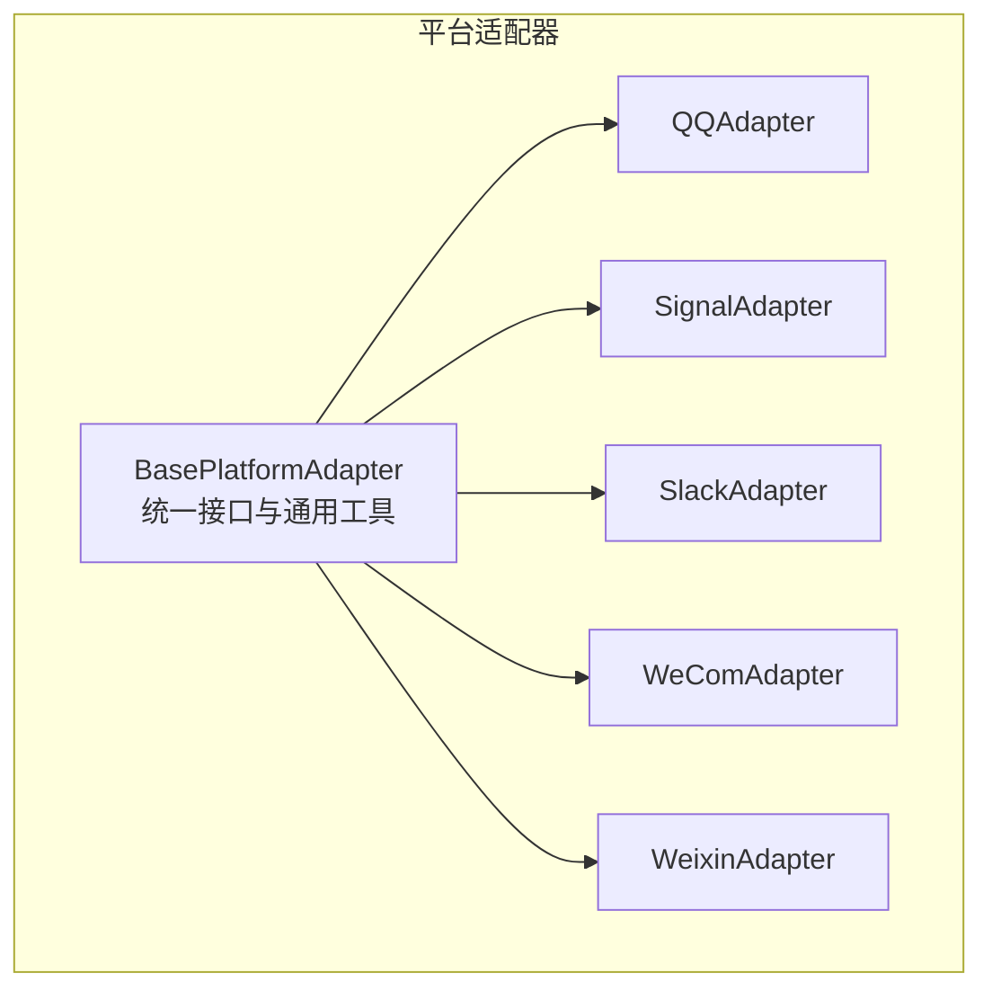
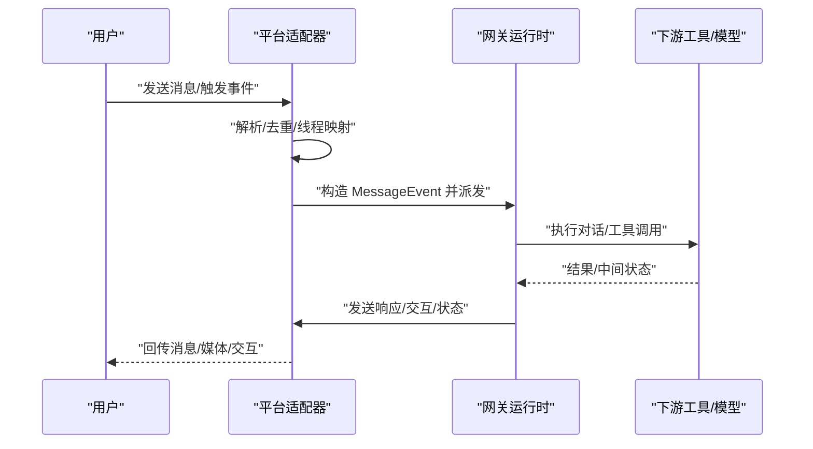
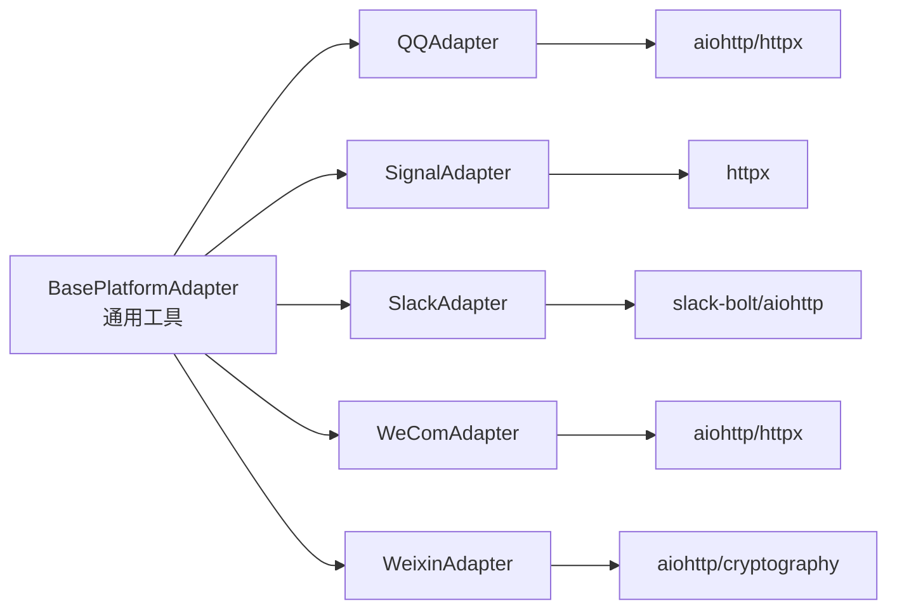

# 其他平台适配器

<cite>
**本文引用的文件**
- [gateway/platforms/base.py](file://gateway/platforms/base.py)
- [gateway/platforms/__init__.py](file://gateway/platforms/__init__.py)
- [gateway/platforms/qqbot/adapter.py](file://gateway/platforms/qqbot/adapter.py)
- [gateway/platforms/signal.py](file://gateway/platforms/signal.py)
- [gateway/platforms/slack.py](file://gateway/platforms/slack.py)
- [gateway/platforms/wecom.py](file://gateway/platforms/wecom.py)
- [gateway/platforms/weixin.py](file://gateway/platforms/weixin.py)
</cite>

## 目录
1. [简介](#简介)
2. [项目结构](#项目结构)
3. [核心组件](#核心组件)
4. [架构总览](#架构总览)
5. [详细组件分析](#详细组件分析)
6. [依赖关系分析](#依赖关系分析)
7. [性能考量](#性能考量)
8. [故障排查指南](#故障排查指南)
9. [结论](#结论)
10. [附录](#附录)

## 简介
本文件面向“其他平台适配器”的综合技术文档，覆盖以下次要平台：QQ机器人（官方机器人）、Signal、Slack、企业微信（WeCom）、微信（Weixin）。内容包括：
- 各平台基础能力与限制
- 认证机制与接入方式
- 平台特定消息格式与功能差异
- 配置要求与部署注意事项
- 快速集成指南与常见问题处理
- 平台选择建议与迁移策略
- 兼容性矩阵与功能对比表

## 项目结构
平台适配器位于 gateway/platforms 下，采用统一的基类接口与约定，确保不同平台在消息收发、线程与媒体处理、速率限制与重连等方面保持一致的行为模型。

图示来源
- [gateway/platforms/base.py](file://gateway/platforms/base.py)
- [gateway/platforms/qqbot/adapter.py](file://gateway/platforms/qqbot/adapter.py)
- [gateway/platforms/signal.py](file://gateway/platforms/signal.py)
- [gateway/platforms/slack.py](file://gateway/platforms/slack.py)
- [gateway/platforms/wecom.py](file://gateway/platforms/wecom.py)
- [gateway/platforms/weixin.py](file://gateway/platforms/weixin.py)

章节来源
- [gateway/platforms/__init__.py](file://gateway/platforms/__init__.py)
- [gateway/platforms/base.py](file://gateway/platforms/base.py)

## 核心组件
- 统一基类与通用工具
  - 提供消息类型、长度截断、代理解析、图片/音频/文档缓存、SSRF防护、去重与线程元数据等通用能力。
  - 支持平台间共享的媒体下载与本地缓存策略，保障视觉/语音/文档类内容可被下游工具使用。
- 平台适配器职责
  - 接入方式：WebSocket、HTTP/JSON-RPC、长轮询、Socket Mode 等
  - 认证：令牌/密钥/签名/会话管理
  - 消息处理：解析入站事件、构建 MessageEvent、派发到会话处理
  - 发送与编辑：按平台能力发送文本/富媒体/交互按钮；部分平台不支持编辑
  - 速率限制与重连：指数退避、心跳、会话恢复、错误码语义化

章节来源
- [gateway/platforms/base.py](file://gateway/platforms/base.py)

## 架构总览
下图展示平台适配器如何与网关运行时协作，以及典型的数据流与控制流。

图示来源
- [gateway/platforms/base.py](file://gateway/platforms/base.py)
- [gateway/platforms/slack.py](file://gateway/platforms/slack.py)
- [gateway/platforms/signal.py](file://gateway/platforms/signal.py)
- [gateway/platforms/wecom.py](file://gateway/platforms/wecom.py)
- [gateway/platforms/weixin.py](file://gateway/platforms/weixin.py)

## 详细组件分析

### QQ 机器人（官方机器人）
- 基础能力
  - 入站：WebSocket 事件流（含 Hello/Heartbeat/Identify/Resume）
  - 出站：REST API 发送消息与媒体上传
  - 支持富文本/Markdown（可选），支持内联键盘与交互回调
  - 语音转写：优先使用平台内置 ASR，其次可配置外部 STT
- 认证与接入
  - 使用 App ID + Client Secret 获取访问令牌
  - 通过 REST API 获取 WebSocket 网关地址后建立连接
- 限制与差异
  - 不支持编辑已发送消息
  - 有明确的关闭码语义，需按错误码进行重连或致命错误处理
  - 支持 DM 与群组策略（开放/白名单/禁用），并可对群组细粒度授权
- 配置要点
  - 必填：应用 ID 与密钥
  - 可选：Markdown 支持、DM/群组策略与允许列表、STT 提供商
- 部署注意
  - 确保网络可达 WebSocket 地址，必要时配置代理
  - 注意快速断开阈值与重连退避，避免误判为权限问题
- 快速集成步骤
  - 安装依赖（aiohttp/httpx）
  - 在配置中填写 app_id/client_secret
  - 设置 dm_policy/group_policy 与 allowlist
  - 启动后观察连接状态与日志中的重连提示

章节来源
- [gateway/platforms/qqbot/adapter.py](file://gateway/platforms/qqbot/adapter.py)

### Signal
- 基础能力
  - 入站：signal-cli HTTP 守护进程的 SSE 流式推送
  - 出站：JSON-RPC 2.0 调用 HTTP 接口发送消息与动作
  - 支持提及渲染、附件类型识别、自定义 MIME 映射
  - Typing 指示与健康监控，具备网络失败冷却
- 认证与接入
  - 通过 HTTP URL 与账户标识连接守护进程
  - 依赖环境变量 SIGNAL_HTTP_URL 与 SIGNAL_ACCOUNT
- 限制与差异
  - 不支持编辑已发送消息
  - 单次消息最大附件大小限制
  - 支持提及过滤（群组仅当被 @ 时才响应）
- 配置要点
  - 必填：SIGNAL_HTTP_URL 与 SIGNAL_ACCOUNT
  - 可选：忽略故事、提及过滤、DM 白名单、群组白名单
- 部署注意
  - 确保 signal-cli 已以 HTTP 模式启动
  - SSE 连接空闲时会进行健康检查，异常时强制重连
- 快速集成步骤
  - 安装并启动 signal-cli 守护进程
  - 设置环境变量
  - 配置允许列表与提及过滤
  - 观察 SSE 日志与健康监控输出

章节来源
- [gateway/platforms/signal.py](file://gateway/platforms/signal.py)

### Slack
- 基础能力
  - 入站：Socket Mode 接收事件（DM、频道、线程）
  - 出站：Web API 发送消息、上传文件、交互按钮、快捷命令
  - 支持 Block Kit 文本抽取与序列化、多工作区、上下文缓存
  - Typing 指示（非原生）、去重、线程上下文缓存
- 认证与接入
  - 两套令牌：SLACK_BOT_TOKEN（API 调用）与 SLACK_APP_TOKEN（Socket Mode）
  - 支持从本地文件加载多工作区令牌
- 限制与差异
  - 消息长度上限较高，支持代码块渲染
  - 支持 “!” 前缀的 typed 命令（便于线程场景）
  - 对文件下载失败提供详细的权限/作用域诊断
- 配置要点
  - 必填：SLACK_BOT_TOKEN 与 SLACK_APP_TOKEN
  - 可选：代理配置、多工作区令牌、上下文缓存与去重参数
- 部署注意
  - Socket Mode 需要稳定的网络与代理支持
  - Watchdog 自愈：任务退出或传输断开时自动重启
- 快速集成步骤
  - 安装 slack-bolt 与相关依赖
  - 配置两套令牌与代理（如需要）
  - 启动 Socket Mode 并观察日志
  - 如需多工作区，准备 slack_tokens.json

章节来源
- [gateway/platforms/slack.py](file://gateway/platforms/slack.py)

### 企业微信（WeCom）
- 基础能力
  - 入站：AI Bot WebSocket 回调事件
  - 出站：发送消息、上传媒体、响应回调 req_id
  - 支持文本批处理（应对客户端侧分片）、去重、回复上下文
  - 支持图片/文件/语音等媒体缓存
- 认证与接入
  - 使用 bot_id + secret 订阅 WebSocket
  - 通过回调 req_id 进行响应（群聊需使用响应命令）
- 限制与差异
  - 不支持编辑已发送消息
  - 客户端侧文本可能在 4000 字处分片，适配批处理逻辑
  - 支持 DM 与群组策略与白名单
- 配置要点
  - 必填：bot_id 与 secret
  - 可选：WebSocket 地址、DM/群组策略与白名单、分片批处理延迟
- 部署注意
  - 心跳与重连：定期 ping 与指数退避
  - 媒体下载：支持 AES 解密与 CDN 下载
- 快速集成步骤
  - 安装依赖（aiohttp/httpx）
  - 配置 bot_id/secret 与策略
  - 启动后等待回调事件并观察批处理行为

章节来源
- [gateway/platforms/wecom.py](file://gateway/platforms/wecom.py)

### 微信（Weixin）
- 基础能力
  - 入站：长轮询 getupdates 拉取更新
  - 出站：echo 最新 context_token，支持文本/媒体发送
  - 媒体加密传输：AES-128-ECB 加密 CDN 协议
  - QR 登录辅助：提供二维码生成与状态查询
- 认证与接入
  - 通过持久化 token 与 base_url 与服务端通信
  - 支持账号信息持久化与恢复
- 限制与差异
  - 需要 echo 上下文 token 才能回复
  - 媒体下载需满足 CDN 主机白名单
  - 会话过期与频率限制有明确错误码区分
- 配置要点
  - 必填：账号 token 与 base_url
  - 可选：CDN SSL 连接器（使用 certifi CA bundle）
- 部署注意
  - 确保 CDN 白名单主机可访问
  - 处理会话过期与频率限制，必要时退避重试
- 快速集成步骤
  - 初始化账号并保存 token
  - 启动长轮询拉取
  - 发送时携带 context_token 并处理媒体加密/解密

章节来源
- [gateway/platforms/weixin.py](file://gateway/platforms/weixin.py)

## 依赖关系分析
- 统一基类依赖
  - 通用工具：代理解析、URL 安全校验、SSRF 防护、媒体缓存、消息长度与编码处理
  - 会话与线程：线程元数据、回复锚点、通知标记
- 平台特化依赖
  - QQ：aiohttp/httpx
  - Signal：httpx、速率限制调度器
  - Slack：slack-bolt、aiohttp、代理配置
  - WeCom：aiohttp/httpx
  - Weixin：aiohttp、cryptography（AES）

图示来源
- [gateway/platforms/base.py](file://gateway/platforms/base.py)
- [gateway/platforms/qqbot/adapter.py](file://gateway/platforms/qqbot/adapter.py)
- [gateway/platforms/signal.py](file://gateway/platforms/signal.py)
- [gateway/platforms/slack.py](file://gateway/platforms/slack.py)
- [gateway/platforms/wecom.py](file://gateway/platforms/wecom.py)
- [gateway/platforms/weixin.py](file://gateway/platforms/weixin.py)

## 性能考量
- 连接与重连
  - 指数退避与心跳维持，避免频繁抖动
  - SSE/Socket Mode Watchdog 自愈，降低人工干预
- 媒体处理
  - 本地缓存减少上游 URL 泄露与过期风险
  - 速率限制与批量发送（Signal/Slack）提升吞吐
- 代理与网络
  - 统一代理解析与 NO_PROXY 支持，避免 DNS 污染影响
  - Slack 专用代理解析与主机白名单，确保合规访问

## 故障排查指南
- 常见错误与定位
  - QQ：关闭码语义化（4004/4006/4007/4008/4914/4915），快速断开计数与致命错误
  - Signal：RPC 错误、速率限制、附件过大、SSE 空闲健康检查
  - Slack：Socket Mode 任务/传输异常、文件下载权限/作用域、response_url 替换失败
  - WeCom：订阅鉴权失败、客户端分片文本批处理、媒体下载解密
  - Weixin：CDN 白名单拒绝、会话过期与频率限制、AES 密钥格式
- 建议排查步骤
  - 检查令牌/密钥/URL 是否正确
  - 查看平台日志中的错误码与重连记录
  - 验证网络与代理设置，确认 NO_PROXY 与主机白名单
  - 对媒体路径进行本地缓存验证，排除上游失效

章节来源
- [gateway/platforms/qqbot/adapter.py](file://gateway/platforms/qqbot/adapter.py)
- [gateway/platforms/signal.py](file://gateway/platforms/signal.py)
- [gateway/platforms/slack.py](file://gateway/platforms/slack.py)
- [gateway/platforms/wecom.py](file://gateway/platforms/wecom.py)
- [gateway/platforms/weixin.py](file://gateway/platforms/weixin.py)

## 结论
上述平台适配器在统一基类之上实现了跨平台一致性，同时保留了各平台特有的认证、消息格式与接入模式。通过标准化的媒体缓存、代理与安全策略，系统可在复杂网络环境下稳定运行。选择平台时应结合组织合规、网络可达性与功能需求，并在部署前完成充分的集成测试与限流压测。

## 附录

### 平台选择建议与迁移策略
- 选择建议
  - 国内生态：企业微信（内部协同）、QQ（泛娱乐/社区）
  - 个人与开源：Signal（隐私优先）、Slack（团队协作）
  - 个人号：微信（Weixin）适合私域运营，但需关注媒体加密与 CDN 白名单
- 迁移策略
  - 以统一的 MessageEvent/Source 抽象为边界，逐步替换适配器
  - 保留媒体缓存与线程元数据，避免迁移过程中的上下文丢失
  - 分阶段切换令牌/密钥与网络配置，配合 Watchdog 与日志观测

### 兼容性矩阵与功能对比表
- 能力概览（示意）
  - 认证方式：令牌/密钥/会话/签名
  - 入站通道：WebSocket/SSE/Socket Mode/长轮询
  - 出站能力：文本/富文本/媒体/交互按钮
  - 编辑支持：部分平台不支持
  - 速率限制：平台特定，需退避与调度
  - 代理与安全：统一代理解析、SSRF 防护、主机白名单

章节来源
- [gateway/platforms/base.py](file://gateway/platforms/base.py)
- [gateway/platforms/qqbot/adapter.py](file://gateway/platforms/qqbot/adapter.py)
- [gateway/platforms/signal.py](file://gateway/platforms/signal.py)
- [gateway/platforms/slack.py](file://gateway/platforms/slack.py)
- [gateway/platforms/wecom.py](file://gateway/platforms/wecom.py)
- [gateway/platforms/weixin.py](file://gateway/platforms/weixin.py)