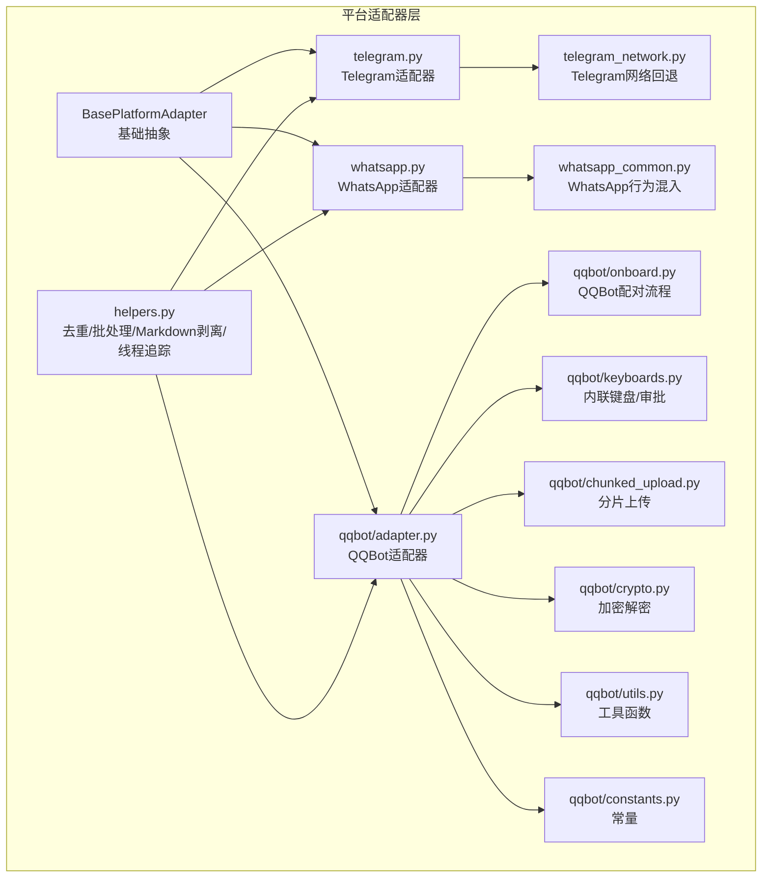
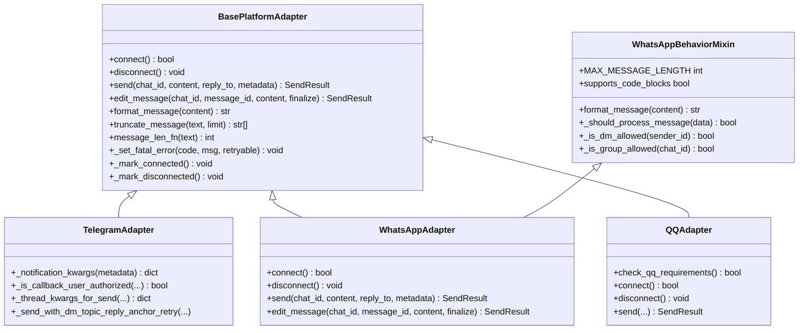
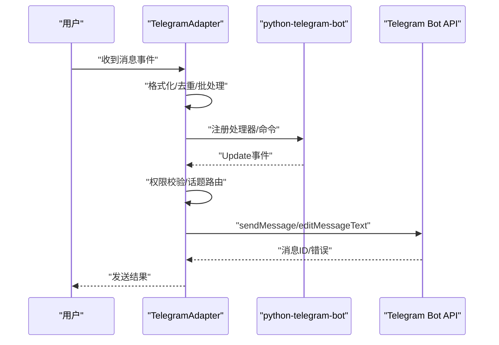
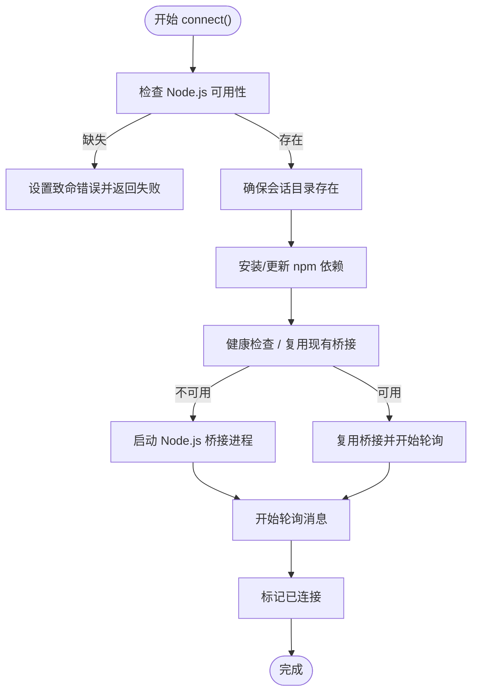
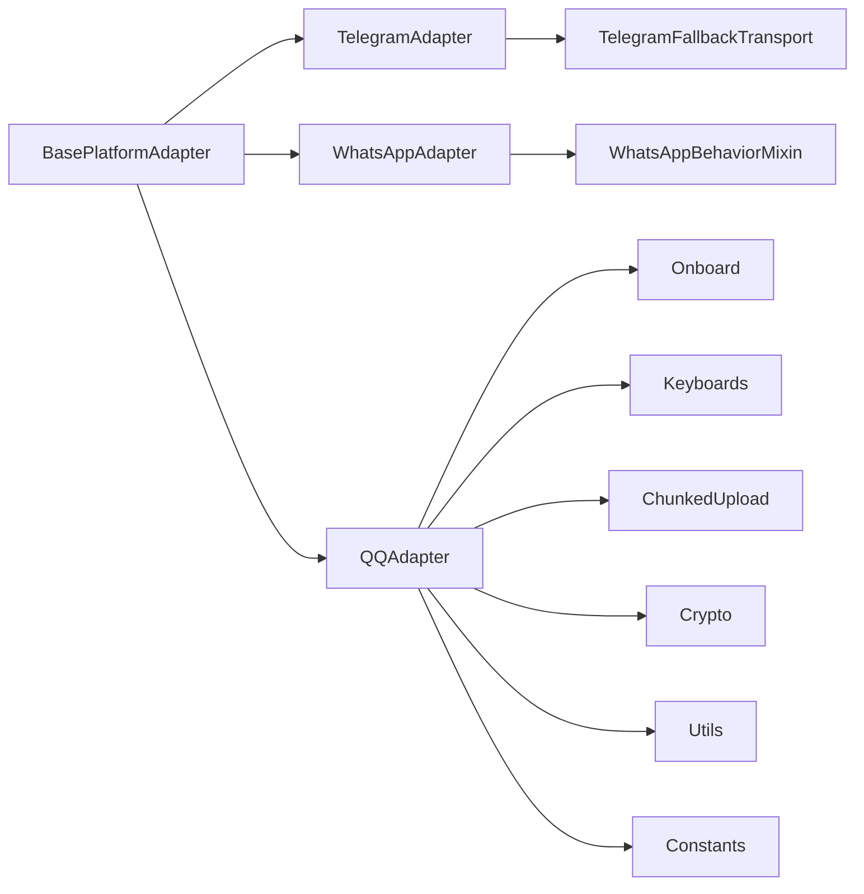

# 平台适配器开发

<cite>
**本文档引用的文件**
- [gateway/platforms/base.py](file://gateway/platforms/base.py)
- [gateway/platforms/__init__.py](file://gateway/platforms/__init__.py)
- [gateway/platforms/telegram.py](file://gateway/platforms/telegram.py)
- [gateway/platforms/telegram_network.py](file://gateway/platforms/telegram_network.py)
- [gateway/platforms/whatsapp.py](file://gateway/platforms/whatsapp.py)
- [gateway/platforms/whatsapp_common.py](file://gateway/platforms/whatsapp_common.py)
- [gateway/platforms/helpers.py](file://gateway/platforms/helpers.py)
- [gateway/platforms/qqbot/adapter.py](file://gateway/platforms/qqbot/adapter.py)
- [gateway/platforms/qqbot/onboard.py](file://gateway/platforms/qqbot/onboard.py)
- [gateway/platforms/qqbot/keyboards.py](file://gateway/platforms/qqbot/keyboards.py)
- [gateway/platforms/qqbot/chunked_upload.py](file://gateway/platforms/qqbot/chunked_upload.py)
- [gateway/platforms/qqbot/crypto.py](file://gateway/platforms/qqbot/crypto.py)
- [gateway/platforms/qqbot/utils.py](file://gateway/platforms/qqbot/utils.py)
- [gateway/platforms/qqbot/constants.py](file://gateway/platforms/qqbot/constants.py)
- [gateway/platforms/qqbot/__init__.py](file://gateway/platforms/qqbot/__init__.py)
- [gateway/platforms/ADDING_A_PLATFORM.md](file://gateway/platforms/ADDING_A_PLATFORM.md)
</cite>

## 目录
1. [简介](#简介)
2. [项目结构](#项目结构)
3. [核心组件](#核心组件)
4. [架构总览](#架构总览)
5. [详细组件分析](#详细组件分析)
6. [依赖分析](#依赖分析)
7. [性能考虑](#性能考虑)
8. [故障排除指南](#故障排除指南)
9. [结论](#结论)
10. [附录](#附录)

## 简介
本文件面向平台适配器开发者，系统性阐述平台适配器的设计模式与实现框架，覆盖适配器基类接口定义、抽象方法、消息接收处理、发送响应、用户认证与权限验证、平台特定功能（如Telegram的Inline模式、Discord组件交互、WhatsApp媒体处理）、消息格式转换与元数据提取、平台差异处理、生命周期管理、错误处理与重连机制，并提供完整开发示例与最佳实践及测试策略。

## 项目结构
平台适配器位于 `gateway/platforms/` 目录下，采用“按平台分包”的组织方式，每个平台一个子包或模块，公共能力集中在 `base.py` 中，通用辅助工具在 `helpers.py` 中，平台注册与导出在 `__init__.py` 中统一管理。

**图表来源**
- [gateway/platforms/base.py](file://gateway/platforms/base.py)
- [gateway/platforms/helpers.py](file://gateway/platforms/helpers.py)
- [gateway/platforms/telegram.py](file://gateway/platforms/telegram.py)
- [gateway/platforms/telegram_network.py](file://gateway/platforms/telegram_network.py)
- [gateway/platforms/whatsapp.py](file://gateway/platforms/whatsapp.py)
- [gateway/platforms/whatsapp_common.py](file://gateway/platforms/whatsapp_common.py)
- [gateway/platforms/qqbot/adapter.py](file://gateway/platforms/qqbot/adapter.py)
- [gateway/platforms/qqbot/onboard.py](file://gateway/platforms/qqbot/onboard.py)
- [gateway/platforms/qqbot/keyboards.py](file://gateway/platforms/qqbot/keyboards.py)
- [gateway/platforms/qqbot/chunked_upload.py](file://gateway/platforms/qqbot/chunked_upload.py)
- [gateway/platforms/qqbot/crypto.py](file://gateway/platforms/qqbot/crypto.py)
- [gateway/platforms/qqbot/utils.py](file://gateway/platforms/qqbot/utils.py)
- [gateway/platforms/qqbot/constants.py](file://gateway/platforms/qqbot/constants.py)

**章节来源**
- [gateway/platforms/__init__.py](file://gateway/platforms/__init__.py)
- [gateway/platforms/base.py](file://gateway/platforms/base.py)

## 核心组件
- 基类与接口：`BasePlatformAdapter` 定义了平台适配器的统一接口，包括连接/断开、消息接收、发送、编辑、格式化、长度截断、代理与网络工具等。所有平台适配器均继承该基类。
- 通用辅助：`helpers.py` 提供消息去重、文本批处理聚合、Markdown剥离、线程参与追踪等跨平台通用能力。
- 平台特定实现：
  - Telegram：支持MarkdownV2、富消息、主题/私聊话题路由、媒体组、客户端分割合并、网络回退传输。
  - WhatsApp：通过Node.js桥接（whatsapp-web.js/Baileys/Cloud API），支持自聊天前缀、允许列表/群组策略、提及检测、广播过滤、Markdown转换、分块发送。
  - QQBot：提供配对流程、内联键盘/审批、分片上传、加解密、工具函数与常量。

**章节来源**
- [gateway/platforms/base.py](file://gateway/platforms/base.py)
- [gateway/platforms/helpers.py](file://gateway/platforms/helpers.py)
- [gateway/platforms/telegram.py](file://gateway/platforms/telegram.py)
- [gateway/platforms/whatsapp.py](file://gateway/platforms/whatsapp.py)
- [gateway/platforms/whatsapp_common.py](file://gateway/platforms/whatsapp_common.py)
- [gateway/platforms/qqbot/adapter.py](file://gateway/platforms/qqbot/adapter.py)

## 架构总览
平台适配器遵循“基类抽象 + 行为混入 + 传输适配 + 通用辅助”的分层设计：

**图表来源**
- [gateway/platforms/base.py](file://gateway/platforms/base.py)
- [gateway/platforms/telegram.py](file://gateway/platforms/telegram.py)
- [gateway/platforms/whatsapp.py](file://gateway/platforms/whatsapp.py)
- [gateway/platforms/whatsapp_common.py](file://gateway/platforms/whatsapp_common.py)
- [gateway/platforms/qqbot/adapter.py](file://gateway/platforms/qqbot/adapter.py)

## 详细组件分析

### 基类与接口设计（BasePlatformAdapter）
- 抽象职责：统一平台接入协议，屏蔽具体SDK差异；提供消息格式化、长度截断、代理与网络工具、缓存与SSRF防护、图片/音频/视频缓存等。
- 关键抽象方法：
  - `connect()` / `disconnect()`：生命周期管理
  - `send()` / `edit_message()`：发送与编辑
  - `format_message()`：消息格式转换
  - `truncate_message()`：按平台限制进行分块
  - `message_len_fn`：长度计算函数（如UTF-16）
- 公共工具：
  - 图片/音频/视频缓存：`cache_image_from_bytes/url`、`cache_audio_from_bytes/url`、`cache_video_from_bytes/url`
  - 代理解析：`resolve_proxy_url`、`proxy_kwargs_for_bot/aiohttp`
  - SSRF防护：`_ssrf_redirect_guard`、`is_safe_url`
  - 文本批处理/去重/线程追踪：来自 `helpers.py`

**章节来源**
- [gateway/platforms/base.py](file://gateway/platforms/base.py)
- [gateway/platforms/helpers.py](file://gateway/platforms/helpers.py)

### Telegram 适配器
- 特性：
  - 支持MarkdownV2、富消息（sendRichMessage）与回退路径
  - 主题/私聊话题路由：`message_thread_id`、`direct_messages_topic_id`、回复锚点
  - 文本批处理与媒体组批处理，降低洪水限制影响
  - 网络回退：通过 `TelegramFallbackTransport` 在不可达时使用备用IP
- 认证与权限：
  - 回调按钮授权：`_is_callback_user_authorized`，支持环境变量白名单与运行时授权回调
  - 通知模式：静默/重要通知控制
- 错误处理与重试：
  - DM话题回复锚点失效时自动降级重试
  - 轮询网络异常后的健康检查与降级保护

**图表来源**
- [gateway/platforms/telegram.py](file://gateway/platforms/telegram.py)
- [gateway/platforms/telegram_network.py](file://gateway/platforms/telegram_network.py)

**章节来源**
- [gateway/platforms/telegram.py](file://gateway/platforms/telegram.py)
- [gateway/platforms/telegram_network.py](file://gateway/platforms/telegram_network.py)

### WhatsApp 适配器
- 传输模式：
  - Node.js桥接（whatsapp-web.js/Baileys/Cloud API），通过HTTP与Python侧通信
  - 桥接进程管理、健康检查、日志记录、依赖安装与版本一致性校验
- 行为混入：
  - `WhatsAppBehaviorMixin` 提供允许列表/群组策略、提及检测、广播过滤、Markdown转换、分块预算
- 生命周期：
  - 连接：检查Node.js、准备会话目录、安装依赖、启动/复用桥接、轮询消息
  - 断开：优雅终止子进程、清理PID文件、取消任务、关闭会话
- 发送与编辑：
  - 格式化Markdown、按平台限制分块、首块设置回复锚点、顺序发送、小延迟防限流

**图表来源**
- [gateway/platforms/whatsapp.py](file://gateway/platforms/whatsapp.py)
- [gateway/platforms/whatsapp_common.py](file://gateway/platforms/whatsapp_common.py)

**章节来源**
- [gateway/platforms/whatsapp.py](file://gateway/platforms/whatsapp.py)
- [gateway/platforms/whatsapp_common.py](file://gateway/platforms/whatsapp_common.py)

### QQBot 适配器
- 功能模块：
  - 配对流程：二维码扫描绑定、连接URL构建
  - 内联键盘与审批：内联按钮交互、审批请求/发送者模型
  - 分片上传：大文件上传与每日限额处理
  - 加解密：AES-256-GCM密钥生成与解密
  - 工具与常量：User-Agent构建、API头、配置助手
- 开发要点：
  - 保持与旧导入路径兼容（PEP 562 `__getattr__`）
  - 使用 `check_qq_requirements()` 进行依赖检查

**章节来源**
- [gateway/platforms/qqbot/adapter.py](file://gateway/platforms/qqbot/adapter.py)
- [gateway/platforms/qqbot/onboard.py](file://gateway/platforms/qqbot/onboard.py)
- [gateway/platforms/qqbot/keyboards.py](file://gateway/platforms/qqbot/keyboards.py)
- [gateway/platforms/qqbot/chunked_upload.py](file://gateway/platforms/qqbot/chunked_upload.py)
- [gateway/platforms/qqbot/crypto.py](file://gateway/platforms/qqbot/crypto.py)
- [gateway/platforms/qqbot/utils.py](file://gateway/platforms/qqbot/utils.py)
- [gateway/platforms/qqbot/constants.py](file://gateway/platforms/qqbot/constants.py)
- [gateway/platforms/qqbot/__init__.py](file://gateway/platforms/qqbot/__init__.py)

### 通用辅助工具
- 消息去重：基于TTL的消息ID缓存，避免重复处理
- 文本批处理：将快速连续的文本事件合并为单次处理，支持拆分阈值与延迟
- Markdown剥离：为不支持富文本的平台（如短信）提供纯文本输出
- 线程参与追踪：持久化记录机器人参与过的线程，避免重复打扰

**章节来源**
- [gateway/platforms/helpers.py](file://gateway/platforms/helpers.py)

## 依赖分析
- 组件耦合：
  - 平台适配器强依赖 `BasePlatformAdapter` 的统一接口与工具集
  - Telegram 依赖 `telegram_network.py` 的网络回退能力
  - WhatsApp 依赖 `whatsapp_common.py` 的行为混入
  - QQBot 各模块内聚，通过 `__init__.py` 统一导出
- 外部依赖：
  - Telegram：python-telegram-bot（可懒安装）
  - WhatsApp：Node.js、npm、桥接脚本
  - QQBot：平台API、分片上传服务、加密库

**图表来源**
- [gateway/platforms/base.py](file://gateway/platforms/base.py)
- [gateway/platforms/telegram.py](file://gateway/platforms/telegram.py)
- [gateway/platforms/telegram_network.py](file://gateway/platforms/telegram_network.py)
- [gateway/platforms/whatsapp.py](file://gateway/platforms/whatsapp.py)
- [gateway/platforms/whatsapp_common.py](file://gateway/platforms/whatsapp_common.py)
- [gateway/platforms/qqbot/adapter.py](file://gateway/platforms/qqbot/adapter.py)
- [gateway/platforms/qqbot/onboard.py](file://gateway/platforms/qqbot/onboard.py)
- [gateway/platforms/qqbot/keyboards.py](file://gateway/platforms/qqbot/keyboards.py)
- [gateway/platforms/qqbot/chunked_upload.py](file://gateway/platforms/qqbot/chunked_upload.py)
- [gateway/platforms/qqbot/crypto.py](file://gateway/platforms/qqbot/crypto.py)
- [gateway/platforms/qqbot/utils.py](file://gateway/platforms/qqbot/utils.py)
- [gateway/platforms/qqbot/constants.py](file://gateway/platforms/qqbot/constants.py)

## 性能考虑
- 文本批处理：通过 `TextBatchAggregator` 将高频短消息合并，减少API调用与令牌消耗
- 缓存策略：图片/音频/文档本地缓存，避免平台URL过期与重复下载
- 代理与网络：统一代理解析与SSRF防护，Telegram使用回退IP以提升可达性
- 分块发送：按平台最大长度预算进行分块，保留代码块边界与分页提示
- 资源释放：连接断开时及时取消任务、关闭会话、清理进程与锁

[本节为通用指导，无需列出具体文件来源]

## 故障排除指南
- Telegram
  - 网络不可达：启用 `TelegramFallbackTransport`，自动切换备用IP并粘滞优化
  - DM话题锚点失效：捕获BadRequest并自动降级重试
  - 轮询异常：健康检查后降级发送路径，防止假死
- WhatsApp
  - 桥接进程崩溃：检测退出码，区分预期关闭与异常崩溃，触发重试或致命错误
  - 依赖缺失：Node.js/包管理器不可用时给出明确提示
  - 会话过期：引导用户重新配对
- QQBot
  - 配对失败：检查二维码扫描状态与连接URL
  - 分片上传失败：检查限额与文件大小，必要时回退普通上传

**章节来源**
- [gateway/platforms/telegram.py](file://gateway/platforms/telegram.py)
- [gateway/platforms/telegram_network.py](file://gateway/platforms/telegram_network.py)
- [gateway/platforms/whatsapp.py](file://gateway/platforms/whatsapp.py)
- [gateway/platforms/qqbot/onboard.py](file://gateway/platforms/qqbot/onboard.py)

## 结论
平台适配器体系通过“基类抽象 + 行为混入 + 传输适配 + 通用辅助”实现了高内聚、低耦合的扩展架构。开发者只需关注平台差异与业务规则，即可快速实现新平台适配，并复用统一的格式化、批处理、缓存与网络工具，确保一致的用户体验与工程质量。

[本节为总结性内容，无需列出具体文件来源]

## 附录

### 开发新平台适配器步骤
- 参考模板：阅读 `gateway/platforms/ADDING_A_PLATFORM.md` 获取平台添加指南
- 继承基类：从 `BasePlatformAdapter` 继承，实现 `connect`/`disconnect`/`send`/`edit_message` 等方法
- 处理消息：实现消息接收、去重、批处理、格式化与权限校验
- 平台特性：根据平台能力实现Inline/组件交互、媒体处理、话题路由等
- 生命周期：实现连接/断开、健康检查、错误处理与重连
- 测试策略：编写单元测试与集成测试，覆盖正常路径、异常路径与边界条件

**章节来源**
- [gateway/platforms/ADDING_A_PLATFORM.md](file://gateway/platforms/ADDING_A_PLATFORM.md)
- [gateway/platforms/base.py](file://gateway/platforms/base.py)

### 最佳实践
- 明确平台差异：在构造函数中初始化平台特有参数与资源
- 统一错误处理：使用 `_set_fatal_error` 标记致命错误，配合重试策略
- 代理与安全：优先使用共享代理解析与SSRF防护工具
- 缓存与幂等：利用本地缓存减少外部依赖，确保发送幂等
- 日志与可观测性：为关键路径添加日志，便于排障

[本节为通用指导，无需列出具体文件来源]