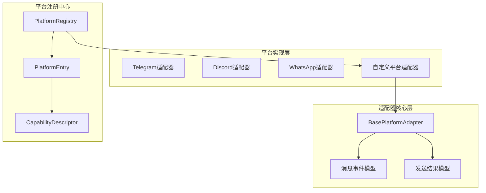
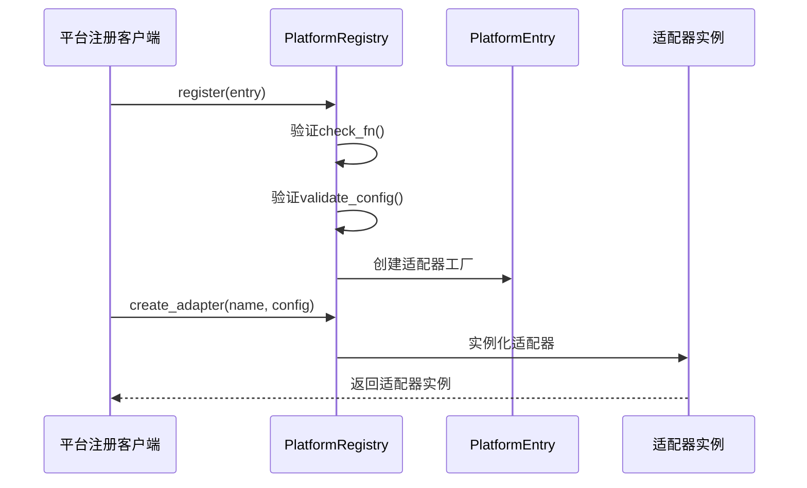
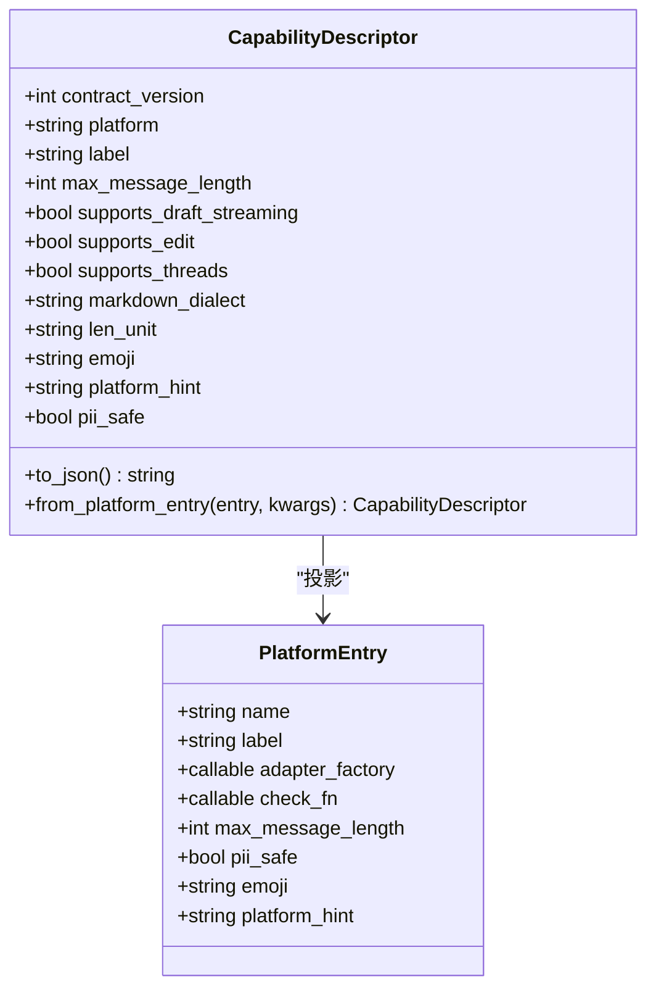
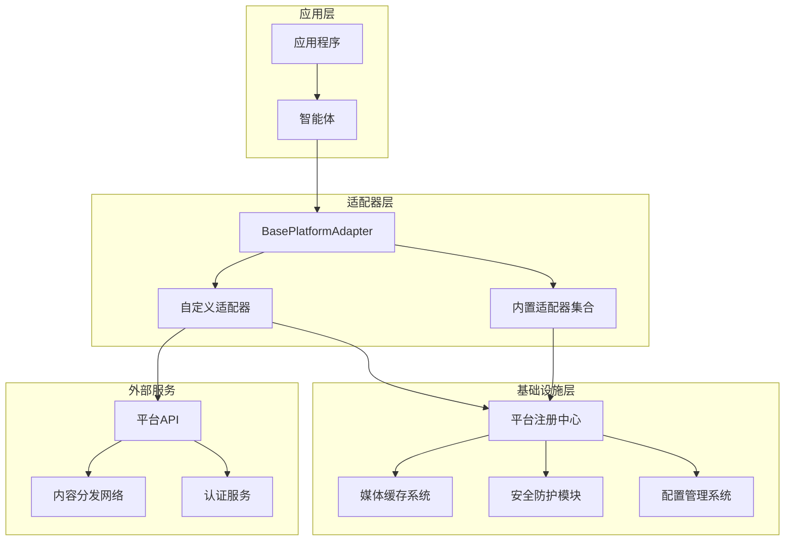
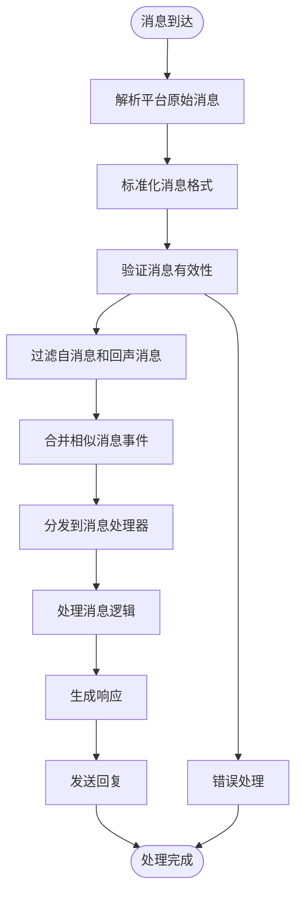
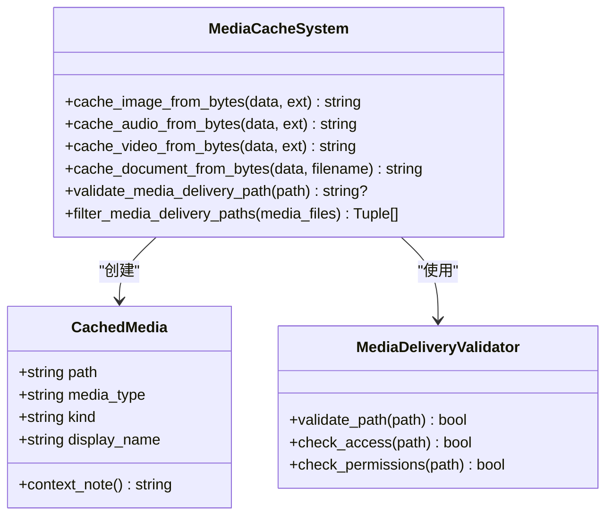
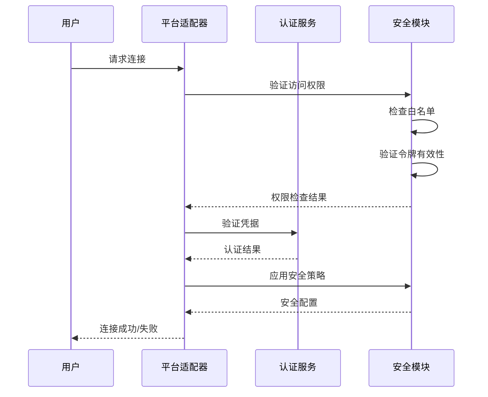
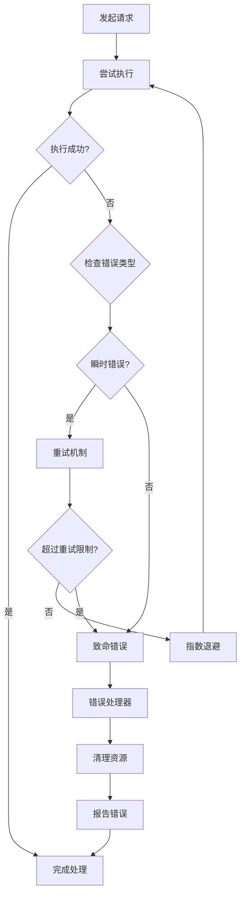
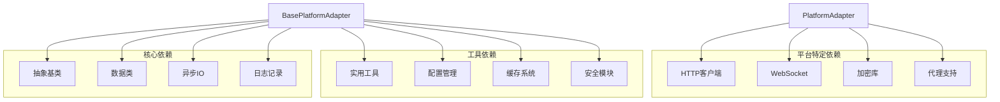
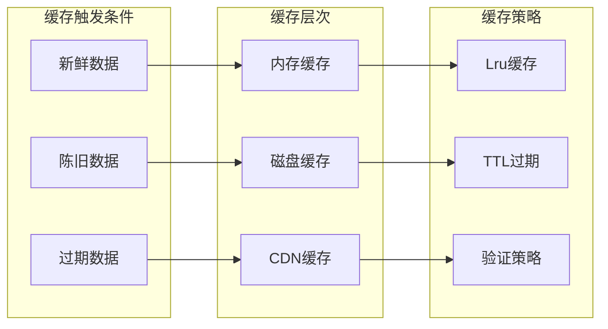

# 自定义平台开发指南

<cite>
**本文档引用的文件**
- [gateway/platforms/base.py](file://gateway/platforms/base.py)
- [gateway/platforms/ADDING_A_PLATFORM.md](file://gateway/platforms/ADDING_A_PLATFORM.md)
- [gateway/platform_registry.py](file://gateway/platform_registry.py)
- [gateway/relay/descriptor.py](file://gateway/relay/descriptor.py)
- [website/docs/developer-guide/adding-platform-adapters.md](file://website/docs/developer-guide/adding-platform-adapters.md)
- [tests/gateway/test_platform_registry.py](file://tests/gateway/test_platform_registry.py)
- [tests/gateway/test_relay_capability_surface.py](file://tests/gateway/test_relay_capability_surface.py)
- [tests/plugins/platforms/photon/test_inbound.py](file://tests/plugins/platforms/photon/test_inbound.py)
</cite>

## 目录
1. [简介](#简介)
2. [项目结构](#项目结构)
3. [核心组件](#核心组件)
4. [架构概览](#架构概览)
5. [详细组件分析](#详细组件分析)
6. [依赖关系分析](#依赖关系分析)
7. [性能考虑](#性能考虑)
8. [故障排除指南](#故障排除指南)
9. [结论](#结论)
10. [附录](#附录)

## 简介

本指南面向希望基于BasePlatformAdapter开发全新平台适配器的开发者。文档深入解释了从需求分析到部署上线的完整开发流程，涵盖平台API研究、接口设计原则、消息格式标准化、平台差异处理策略、认证机制实现与安全考虑、测试框架与调试技巧、性能优化与错误处理最佳实践，以及完整的开发模板和代码示例。

## 项目结构

Hermes平台适配器系统采用模块化架构，主要由以下核心部分组成：



**图表来源**
- [gateway/platforms/base.py:1803-2399](file://gateway/platforms/base.py#L1803-L2399)
- [gateway/platform_registry.py:183-260](file://gateway/platform_registry.py#L183-L260)
- [gateway/relay/descriptor.py:41-118](file://gateway/relay/descriptor.py#L41-L118)

**章节来源**
- [gateway/platforms/base.py:1-800](file://gateway/platforms/base.py#L1-L800)
- [gateway/platforms/ADDING_A_PLATFORM.md:1-404](file://gateway/platforms/ADDING_A_PLATFORM.md#L1-L404)

## 核心组件

### BasePlatformAdapter抽象基类

BasePlatformAdapter是所有平台适配器的抽象基类，定义了统一的接口规范和通用功能：

#### 核心接口方法
- `connect() -> bool`: 连接平台并启动监听器
- `disconnect() -> None`: 停止监听器，关闭连接
- `send(chat_id, content, ...) -> SendResult`: 发送文本消息
- `send_typing(chat_id)`: 发送正在输入指示器
- `send_image(chat_id, image_url, caption) -> SendResult`: 发送图片
- `get_chat_info(chat_id) -> dict`: 获取聊天信息

#### 消息处理能力
- 支持多种消息类型：文本、位置、照片、视频、音频、语音、文档、贴纸、命令
- 内置媒体缓存系统：图像、音频、视频、文档的本地缓存管理
- 智能消息合并：处理快速连续的消息事件
- 附件处理：支持本地文件路径和URL的自动识别与处理

#### 安全与合规
- SSRF防护：防止服务器端请求伪造攻击
- 路径验证：严格控制媒体文件的访问权限
- 敏感信息脱敏：自动过滤日志中的敏感标识符
- 访问控制：支持平台特定的访问策略

**章节来源**
- [gateway/platforms/base.py:1803-2399](file://gateway/platforms/base.py#L1803-L2399)
- [gateway/platforms/base.py:1401-1599](file://gateway/platforms/base.py#L1401-L1599)

### 平台注册系统

平台注册中心负责管理所有可用的平台适配器：



**图表来源**
- [gateway/platform_registry.py:208-257](file://gateway/platform_registry.py#L208-L257)

**章节来源**
- [gateway/platform_registry.py:183-260](file://gateway/platform_registry.py#L183-L260)

### 能力描述符系统

能力描述符用于在连接握手时协商平台能力：



**图表来源**
- [gateway/relay/descriptor.py:41-118](file://gateway/relay/descriptor.py#L41-L118)

**章节来源**
- [gateway/relay/descriptor.py:1-118](file://gateway/relay/descriptor.py#L1-L118)

## 架构概览

Hermes平台适配器系统采用分层架构设计，确保了高度的模块化和可扩展性：



**图表来源**
- [gateway/platforms/base.py:1803-2399](file://gateway/platforms/base.py#L1803-L2399)
- [gateway/platform_registry.py:183-260](file://gateway/platform_registry.py#L183-L260)

## 详细组件分析

### 消息事件处理系统

消息事件处理系统提供了统一的消息抽象和处理机制：



**图表来源**
- [gateway/platforms/base.py:1614-1674](file://gateway/platforms/base.py#L1614-L1674)

#### 消息类型定义
系统支持多种消息类型，每种类型都有相应的处理逻辑：

| 消息类型 | 描述 | 处理方式 |
|---------|------|----------|
| TEXT | 文本消息 | 直接处理，支持Markdown渲染 |
| LOCATION | 位置消息 | 提取地理位置信息 |
| PHOTO | 图片消息 | 下载到本地缓存，支持多图合并 |
| VIDEO | 视频消息 | 缓存到本地，支持流式播放 |
| AUDIO | 音频消息 | 转换为语音消息或文件附件 |
| VOICE | 语音消息 | 使用平台原生语音功能 |
| DOCUMENT | 文档消息 | 作为文件附件发送 |
| STICKER | 贴纸消息 | 转换为平台支持的表情符号 |
| COMMAND | 命令消息 | 解析命令参数并执行 |

**章节来源**
- [gateway/platforms/base.py:1401-1506](file://gateway/platforms/base.py#L1401-L1506)

### 媒体处理系统

媒体处理系统提供了完整的本地文件管理和平台上传能力：



**图表来源**
- [gateway/platforms/base.py:567-800](file://gateway/platforms/base.py#L567-L800)
- [gateway/platforms/base.py:1311-1399](file://gateway/platforms/base.py#L1311-L1399)

#### 媒体类型支持
系统支持广泛的媒体格式，包括：

**图像格式**: PNG、JPG、JPEG、GIF、WEBP、BMP、TIFF、SVG
**视频格式**: MP4、MOV、AVI、MKV、WEBM
**音频格式**: MP3、WAV、OGG、OPUS、M4A、FLAC
**文档格式**: PDF、DOC、DOCX、ODT、RTF、TXT、MD、EPUB
**电子表格**: XLS、XLSX、ODS、CSV、TSV
**演示文稿**: PPT、PPTX、ODP、KEY
**压缩包**: ZIP、TAR、GZ、TGZ、BZ2、XZ、7Z、RAR、APK、IPA

**章节来源**
- [gateway/platforms/base.py:800-1214](file://gateway/platforms/base.py#L800-L1214)

### 认证与安全系统

认证与安全系统确保了平台适配器的安全性和可靠性：



**图表来源**
- [gateway/platforms/base.py:2142-2230](file://gateway/platforms/base.py#L2142-L2230)

#### 安全特性
- **SSRF防护**: 防止服务器端请求伪造攻击
- **路径验证**: 严格控制文件访问权限
- **敏感信息脱敏**: 自动过滤日志中的敏感数据
- **访问控制**: 支持平台特定的访问策略
- **代理支持**: 完整的代理配置和绕过机制

**章节来源**
- [gateway/platforms/base.py:541-556](file://gateway/platforms/base.py#L541-L556)
- [gateway/platforms/base.py:348-448](file://gateway/platforms/base.py#L348-L448)

### 错误处理与重试机制

系统实现了完善的错误处理和重试机制：



**图表来源**
- [gateway/platforms/base.py:1676-1693](file://gateway/platforms/base.py#L1676-L1693)

**章节来源**
- [gateway/platforms/base.py:1676-1693](file://gateway/platforms/base.py#L1676-L1693)

## 依赖关系分析

平台适配器系统的依赖关系体现了清晰的分层架构：



**图表来源**
- [gateway/platforms/base.py:1-40](file://gateway/platforms/base.py#L1-L40)
- [gateway/platform_registry.py:1-50](file://gateway/platform_registry.py#L1-L50)

**章节来源**
- [gateway/platform_registry.py:1-100](file://gateway/platform_registry.py#L1-L100)

## 性能考虑

### 连接管理优化

系统采用了多种连接管理优化策略：

1. **连接池管理**: 复用HTTP连接，减少连接建立开销
2. **异步处理**: 使用async/await模式提高并发性能
3. **背压控制**: 实现消息队列和背压机制
4. **资源清理**: 及时释放连接和内存资源

### 缓存策略



**图表来源**
- [gateway/platforms/base.py:567-700](file://gateway/platforms/base.py#L567-L700)

### 性能监控

系统提供了全面的性能监控能力：

- **指标收集**: 连接数、消息吞吐量、错误率
- **延迟监控**: 请求延迟、处理时间
- **资源使用**: CPU、内存、网络带宽
- **告警机制**: 异常情况自动告警

## 故障排除指南

### 常见问题诊断

#### 连接问题
1. **检查网络连通性**: 确认防火墙和代理设置
2. **验证API密钥**: 确保凭据正确且未过期
3. **查看连接日志**: 分析连接失败的具体原因
4. **测试API端点**: 验证平台API的可用性

#### 消息处理问题
1. **检查消息格式**: 确认消息格式符合平台要求
2. **验证媒体文件**: 确保媒体文件可访问且格式正确
3. **检查速率限制**: 避免触发平台的速率限制
4. **调试消息路由**: 确认消息正确路由到目标通道

#### 性能问题
1. **监控资源使用**: 检查CPU和内存使用情况
2. **分析延迟**: 识别性能瓶颈
3. **优化缓存**: 调整缓存策略和大小
4. **调整并发**: 优化并发连接数

**章节来源**
- [tests/gateway/test_platform_registry.py:70-175](file://tests/gateway/test_platform_registry.py#L70-L175)
- [tests/plugins/platforms/photon/test_inbound.py:352-364](file://tests/plugins/platforms/photon/test_inbound.py#L352-L364)

### 调试技巧

1. **启用详细日志**: 设置DEBUG级别日志获取详细信息
2. **使用测试环境**: 在隔离环境中测试新功能
3. **单元测试**: 编写全面的单元测试覆盖各种场景
4. **集成测试**: 验证与其他组件的集成效果
5. **性能测试**: 评估在高负载下的表现

## 结论

基于BasePlatformAdapter开发自定义平台适配器是一个系统性的工程任务，需要综合考虑架构设计、安全性、性能和可维护性等多个方面。通过遵循本文档提供的开发指南，开发者可以高效地创建高质量的平台适配器，为Hermes系统增加新的平台支持。

关键成功因素包括：
- 深入理解BasePlatformAdapter的设计理念和接口规范
- 严格遵循安全最佳实践和合规要求
- 实施全面的测试策略和质量保证
- 优化性能和资源使用效率
- 提供清晰的文档和维护指南

## 附录

### 开发模板

#### 基础适配器模板
```python
from gateway.platforms.base import BasePlatformAdapter
from gateway.config import PlatformConfig, Platform

class CustomPlatformAdapter(BasePlatformAdapter):
    """自定义平台适配器实现"""
    
    def __init__(self, config: PlatformConfig):
        super().__init__(config, Platform.CUSTOM_PLATFORM)
        # 初始化平台特定配置
        self.api_key = config.token
        self.base_url = config.extra.get('base_url', '')
        
    async def connect(self) -> bool:
        """建立平台连接"""
        try:
            # 实现连接逻辑
            return True
        except Exception as e:
            logger.error(f"连接失败: {e}")
            return False
            
    async def disconnect(self) -> None:
        """断开平台连接"""
        # 实现断开逻辑
        
    async def send(self, chat_id: str, content: str, **kwargs) -> SendResult:
        """发送消息到指定聊天"""
        try:
            # 实现发送逻辑
            return SendResult(success=True, message_id="123")
        except Exception as e:
            return SendResult(success=False, error=str(e))
```

#### 配置文件模板
```yaml
# platform_config.yaml
platforms:
  custom_platform:
    enabled: true
    token: "${CUSTOM_PLATFORM_TOKEN}"
    extra:
      base_url: "https://api.custom-platform.com"
      home_channel: "${CUSTOM_PLATFORM_HOME_CHANNEL}"
```

#### 测试模板
```python
import pytest
from unittest.mock import Mock, patch

def test_custom_adapter_connect():
    """测试适配器连接功能"""
    # 准备测试数据
    config = Mock()
    config.token = "test_token"
    config.extra = {}
    
    # 创建适配器实例
    adapter = CustomPlatformAdapter(config)
    
    # 执行测试
    with patch.object(adapter, 'api_client'):
        result = adapter.connect()
        
    # 断言结果
    assert result is True

def test_custom_adapter_send():
    """测试消息发送功能"""
    # 准备测试数据
    config = Mock()
    config.token = "test_token"
    
    # 创建适配器实例
    adapter = CustomPlatformAdapter(config)
    
    # 执行测试
    with patch.object(adapter, 'api_client') as mock_api:
        mock_api.send.return_value = {"message_id": "123"}
        result = adapter.send("chat123", "Hello World")
        
    # 断言结果
    assert result.success is True
    assert result.message_id == "123"
```

### 最佳实践清单

#### 开发阶段
- ✅ 完成平台API研究和接口设计
- ✅ 实现基础适配器功能
- ✅ 编写单元测试覆盖核心功能
- ✅ 进行集成测试验证整体流程
- ✅ 性能基准测试和优化

#### 部署阶段
- ✅ 配置生产环境参数
- ✅ 设置监控和告警
- ✅ 准备备份和恢复方案
- ✅ 文档更新和知识转移
- ✅ 上线后的持续监控

#### 维护阶段
- ✅ 定期安全审计和漏洞扫描
- ✅ 性能监控和容量规划
- ✅ 用户反馈收集和问题修复
- ✅ 平台API变更适配
- ✅ 技术债务清理和重构

**章节来源**
- [website/docs/developer-guide/adding-platform-adapters.md:593-693](file://website/docs/developer-guide/adding-platform-adapters.md#L593-L693)