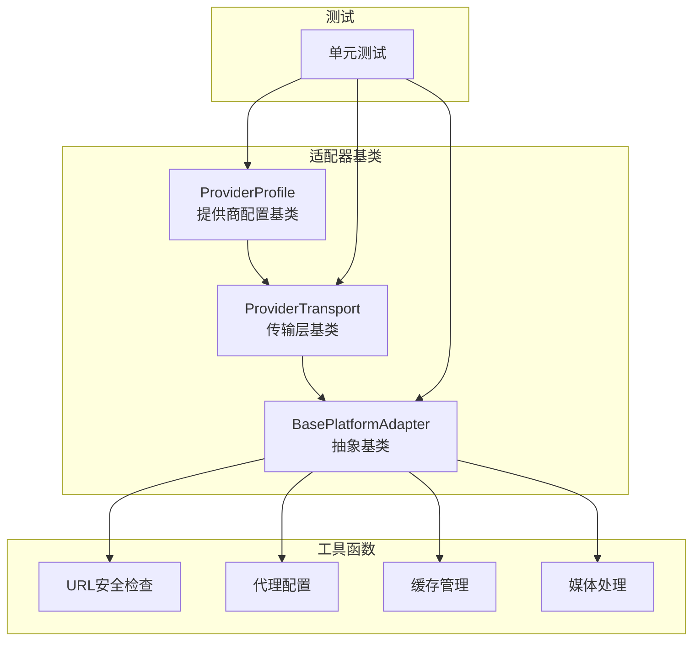
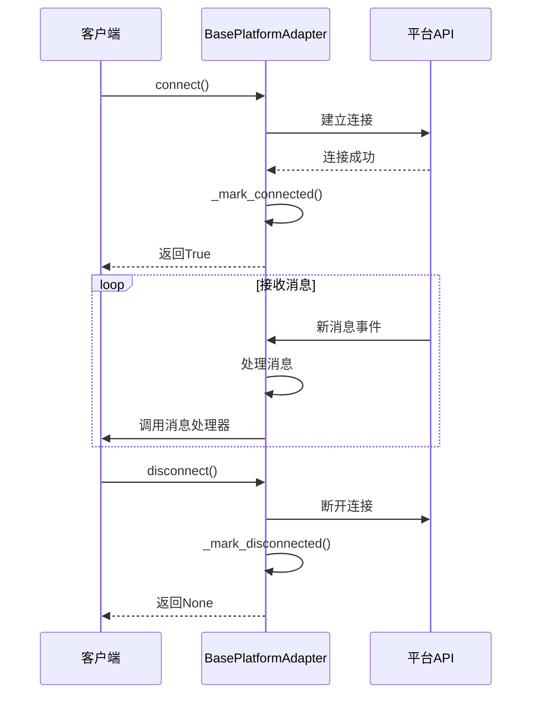
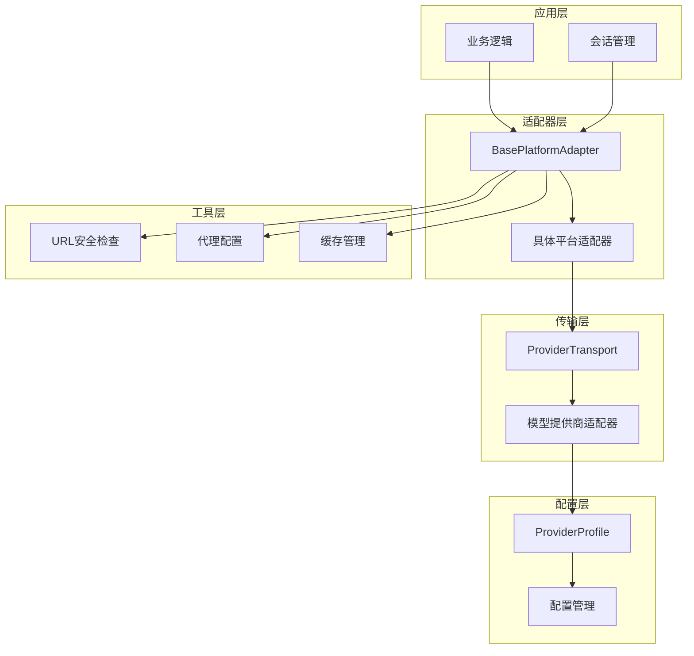
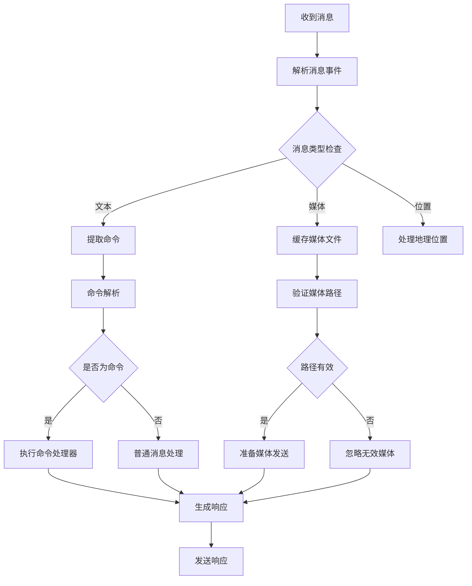
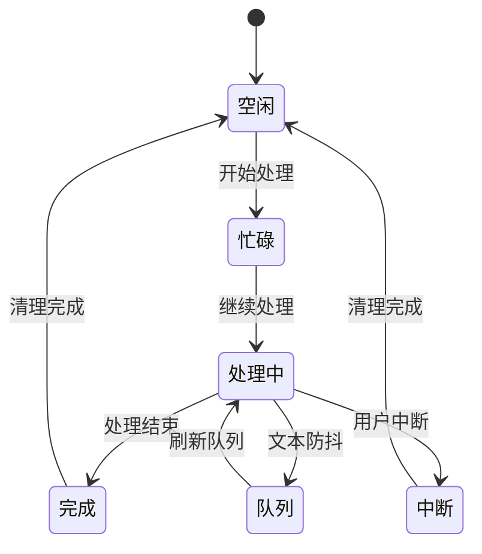
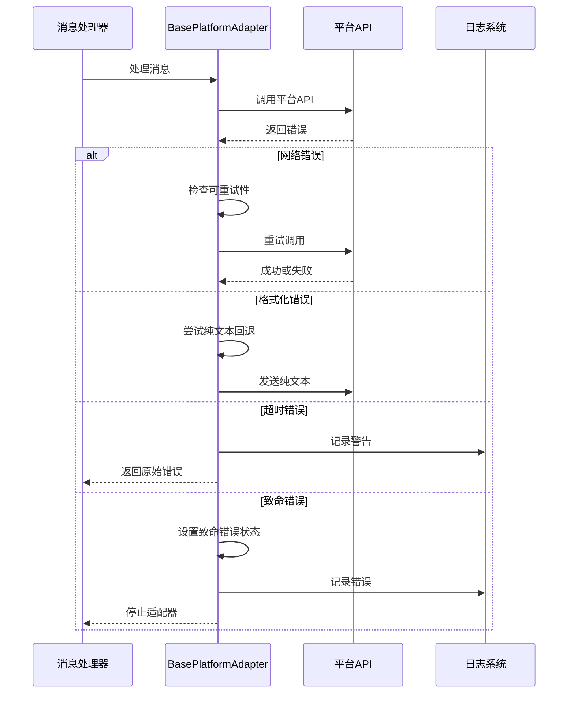
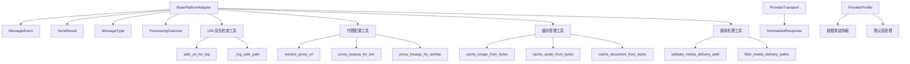

# 适配器基类接口

<cite>
**本文档引用的文件**
- [gateway/platforms/base.py](file://gateway/platforms/base.py)
- [agent/transports/base.py](file://agent/transports/base.py)
- [providers/base.py](file://providers/base.py)
- [tests/gateway/test_platform_base.py](file://tests/gateway/test_platform_base.py)
</cite>

## 目录
1. [简介](#简介)
2. [项目结构](#项目结构)
3. [核心组件](#核心组件)
4. [架构概览](#架构概览)
5. [详细组件分析](#详细组件分析)
6. [依赖分析](#依赖分析)
7. [性能考虑](#性能考虑)
8. [故障排除指南](#故障排除指南)
9. [结论](#结论)

## 简介

本文档详细介绍了 Hermes Agent 项目中的适配器基类接口，重点分析了 `BasePlatformAdapter` 抽象基类的设计理念、核心接口定义、生命周期管理机制以及通用功能实现。该基类为各种平台（如 Telegram、Discord、WhatsApp 等）提供了统一的抽象接口，确保不同平台的消息处理、发送、媒体管理和错误处理具有一致的行为模式。

## 项目结构

在 Hermes Agent 项目中，适配器基类接口主要分布在以下模块：

- **平台适配器基类**：位于 `gateway/platforms/base.py`，定义了 `BasePlatformAdapter` 抽象基类及其相关工具函数
- **传输层适配器基类**：位于 `agent/transports/base.py`，定义了 `ProviderTransport` 抽象基类
- **提供商配置基类**：位于 `providers/base.py`，定义了 `ProviderProfile` 数据类
- **测试用例**：位于 `tests/gateway/test_platform_base.py`，验证适配器基类的功能

**图表来源**
- [gateway/platforms/base.py:1802-2799](file://gateway/platforms/base.py#L1802-L2799)
- [agent/transports/base.py:16-90](file://agent/transports/base.py#L16-L90)
- [providers/base.py:38-218](file://providers/base.py#L38-L218)

## 核心组件

### BasePlatformAdapter 抽象基类

`BasePlatformAdapter` 是平台适配器的核心抽象基类，定义了所有平台适配器必须实现的接口。该类采用抽象基类（ABC）模式，确保子类实现必要的方法。

#### 核心抽象方法

1. **连接管理**
   - `connect(self) -> bool`: 建立平台连接并开始接收消息
   - `disconnect(self) -> None`: 断开平台连接

2. **消息发送**
   - `send(self, chat_id: str, content: str, reply_to: Optional[str] = None, metadata: Optional[Dict[str, Any]] = None) -> SendResult`: 发送消息到指定聊天
   - `edit_message(self, chat_id: str, message_id: str, content: str, *, finalize: bool = False) -> SendResult`: 编辑已发送消息
   - `delete_message(self, chat_id: str, message_id: str) -> bool`: 删除已发送消息

3. **媒体处理**
   - `send_image(self, chat_id: str, image_url: str, caption: Optional[str] = None, reply_to: Optional[str] = None, metadata: Optional[Dict[str, Any]] = None) -> SendResult`: 发送图片
   - `send_animation(self, chat_id: str, animation_url: str, caption: Optional[str] = None, reply_to: Optional[str] = None, metadata: Optional[Dict[str, Any]] = None) -> SendResult`: 发送动画
   - `send_voice(self, chat_id: str, audio_path: str, caption: Optional[str] = None, reply_to: Optional[str] = None, metadata: Optional[Dict[str, Any]] = None, **kwargs) -> SendResult`: 发送语音
   - `send_video(self, chat_id: str, video_path: str, caption: Optional[str] = None, reply_to: Optional[str] = None, metadata: Optional[Dict[str, Any]] = None, **kwargs) -> SendResult`: 发送视频
   - `send_document(self, chat_id: str, file_path: str, caption: Optional[str] = None, file_name: Optional[str] = None, reply_to: Optional[str] = None, metadata: Optional[Dict[str, Any]] = None, **kwargs) -> SendResult`: 发送文档

#### 生命周期管理

BasePlatformAdapter 提供了完整的生命周期管理机制：

**图表来源**
- [gateway/platforms/base.py:2298-2310](file://gateway/platforms/base.py#L2298-L2310)
- [gateway/platforms/base.py:2142-2153](file://gateway/platforms/base.py#L2142-L2153)

#### 错误处理和状态管理

适配器实现了完善的错误处理机制：

- **致命错误处理**：通过 `_set_fatal_error()` 方法设置致命错误状态
- **重试机制**：自动重试网络错误，支持指数退避策略
- **超时检测**：区分可重试的网络超时和不可重试的格式化错误
- **运行状态跟踪**：维护连接状态和运行标志

**章节来源**
- [gateway/platforms/base.py:2155-2230](file://gateway/platforms/base.py#L2155-L2230)
- [gateway/platforms/base.py:3423-3503](file://gateway/platforms/base.py#L3423-L3503)

### ProviderTransport 抽象基类

`ProviderTransport` 定义了模型提供商传输层的抽象接口，负责消息格式转换和响应标准化。

#### 核心方法

1. **api_mode 属性**：标识传输层处理的 API 模式
2. **convert_messages()**：将 OpenAI 格式消息转换为提供商原生格式
3. **convert_tools()**：将 OpenAI 工具定义转换为提供商原生格式
4. **build_kwargs()**：构建完整的 API 调用参数字典
5. **normalize_response()**：将原始提供商响应标准化为共享类型

**章节来源**
- [agent/transports/base.py:16-90](file://agent/transports/base.py#L16-L90)

### ProviderProfile 数据类

`ProviderProfile` 提供了提供商配置的声明式描述，包含认证、端点、客户端特性等信息。

#### 关键属性

- **身份信息**：名称、API 模式、别名
- **人类可读元数据**：显示名称、描述、注册链接
- **认证和端点**：环境变量、基础 URL、模型端点、认证类型
- **视觉支持**：多模态模型支持、工具消息内容支持
- **客户端特性**：默认请求头、温度设置、最大令牌数

**章节来源**
- [providers/base.py:38-218](file://providers/base.py#L38-L218)

## 架构概览

适配器基类接口采用了分层架构设计，确保平台无关性和可扩展性：

**图表来源**
- [gateway/platforms/base.py:1802-2799](file://gateway/platforms/base.py#L1802-L2799)
- [agent/transports/base.py:16-90](file://agent/transports/base.py#L16-L90)
- [providers/base.py:38-218](file://providers/base.py#L38-L218)

## 详细组件分析

### 消息处理系统

BasePlatformAdapter 实现了完整的消息处理管道，包括消息提取、验证和路由：

**图表来源**
- [gateway/platforms/base.py:1422-1506](file://gateway/platforms/base.py#L1422-L1506)
- [gateway/platforms/base.py:2971-3052](file://gateway/platforms/base.py#L2971-L3052)

#### 命令处理机制

适配器支持多种命令格式，包括斜杠命令和自然语言重启命令：

- **斜杠命令**：`/new`、`/reset`、`/restart` 等
- **自然语言命令**：如 "please restart gateway" 等重启指令
- **机器人名称**：支持 `@BotName` 格式的命令

**章节来源**
- [gateway/platforms/base.py:1479-1505](file://gateway/platforms/base.py#L1479-L1505)
- [gateway/platforms/base.py:1523-1548](file://gateway/platforms/base.py#L1523-L1548)

### 媒体处理和缓存系统

适配器实现了强大的媒体处理能力，支持多种媒体类型的本地缓存和安全传输：

#### 支持的媒体类型

| 类型 | 扩展名 | MIME 类型 |
|------|--------|-----------|
| 图片 | .png, .jpg, .jpeg, .gif, .webp, .bmp, .tiff, .svg | image/* |
| 视频 | .mp4, .mov, .avi, .mkv, .webm | video/* |
| 音频 | .mp3, .wav, .ogg, .opus, .m4a, .flac | audio/* |
| 文档 | .pdf, .docx, .doc, .odt, .rtf, .txt, .md, .epub | application/* |

#### 缓存策略

1. **图像缓存**：存储在 `{HERMES_HOME}/cache/images/` 目录
2. **音频缓存**：存储在 `{HERMES_HOME}/cache/audio/` 目录  
3. **视频缓存**：存储在 `{HERMES_HOME}/cache/videos/` 目录
4. **文档缓存**：存储在 `{HERMES_HOME}/cache/documents/` 目录

**章节来源**
- [gateway/platforms/base.py:567-700](file://gateway/platforms/base.py#L567-L700)
- [gateway/platforms/base.py:800-867](file://gateway/platforms/base.py#L800-L867)
- [gateway/platforms/base.py:1196-1213](file://gateway/platforms/base.py#L1196-L1213)

### 线程管理和并发控制

适配器实现了复杂的线程管理机制，确保多会话并发处理的安全性：

#### 会话状态管理

**图表来源**
- [gateway/platforms/base.py:3521-3599](file://gateway/platforms/base.py#L3521-L3599)

#### 防抖机制

适配器支持文本消息的防抖处理，避免过多的重复消息：

- **队列模式**：批量处理等待的消息
- **硬上限**：防止无限期等待
- **发送者识别**：确保同一发送者的消息正确合并

**章节来源**
- [gateway/platforms/base.py:3528-3599](file://gateway/platforms/base.py#L3528-L3599)

### 错误处理和异常传播

适配器实现了多层次的错误处理机制：

#### 错误分类

1. **网络错误**：可重试的临时网络问题
2. **格式化错误**：永久性的格式问题
3. **超时错误**：需要特殊处理的超时情况
4. **致命错误**：需要停止适配器运行的严重错误

#### 异常传播机制

**图表来源**
- [gateway/platforms/base.py:3382-3400](file://gateway/platforms/base.py#L3382-L3400)
- [gateway/platforms/base.py:3423-3503](file://gateway/platforms/base.py#L3423-L3503)

**章节来源**
- [gateway/platforms/base.py:3382-3400](file://gateway/platforms/base.py#L3382-L3400)
- [gateway/platforms/base.py:3423-3503](file://gateway/platforms/base.py#L3423-L3503)

## 依赖分析

适配器基类接口展现了清晰的依赖层次结构：

**图表来源**
- [gateway/platforms/base.py:1422-1599](file://gateway/platforms/base.py#L1422-L1599)
- [gateway/platforms/base.py:504-539](file://gateway/platforms/base.py#L504-L539)
- [gateway/platforms/base.py:348-448](file://gateway/platforms/base.py#L348-L448)
- [gateway/platforms/base.py:594-793](file://gateway/platforms/base.py#L594-L793)
- [agent/transports/base.py:16-90](file://agent/transports/base.py#L16-L90)
- [providers/base.py:38-218](file://providers/base.py#L38-L218)

### 测试覆盖分析

测试套件全面验证了适配器基类的功能：

#### 核心功能测试

1. **消息事件测试**：验证命令解析、文本处理等功能
2. **媒体提取测试**：测试图片和媒体标签提取
3. **路径验证测试**：验证媒体交付路径的安全性
4. **扩展名允许列表测试**：确保媒体类型的一致性

#### 测试策略

- **单元测试**：针对单个功能模块的独立测试
- **集成测试**：验证组件间的交互
- **回归测试**：防止历史问题再次出现

**章节来源**
- [tests/gateway/test_platform_base.py:1-800](file://tests/gateway/test_platform_base.py#L1-L800)

## 性能考虑

适配器基类在设计时充分考虑了性能优化：

### 缓存策略

1. **媒体缓存**：避免重复下载相同媒体文件
2. **路径验证缓存**：减少重复的文件系统检查
3. **代理配置缓存**：避免频繁的环境变量解析

### 异步处理

- **非阻塞操作**：使用异步 I/O 处理网络请求
- **并发控制**：限制同时进行的网络请求数量
- **资源管理**：及时释放连接和文件句柄

### 内存优化

- **流式处理**：大文件通过流式方式处理
- **对象复用**：重用常用对象减少内存分配
- **垃圾回收**：及时清理不再使用的对象

## 故障排除指南

### 常见问题诊断

#### 连接问题

1. **检查网络连接**：确认平台 API 可访问性
2. **验证认证凭据**：确保 API 密钥正确配置
3. **查看代理设置**：确认代理配置正确

#### 媒体处理问题

1. **检查缓存目录权限**：确保有足够的写入权限
2. **验证文件路径**：确认文件存在且可访问
3. **检查文件类型**：确认文件扩展名在允许列表中

#### 性能问题

1. **监控资源使用**：观察 CPU 和内存使用情况
2. **检查并发限制**：确认没有超过平台的速率限制
3. **优化缓存策略**：调整缓存大小和过期时间

### 调试技巧

1. **启用详细日志**：增加日志级别以获取更多信息
2. **使用测试工具**：利用提供的测试套件验证功能
3. **监控系统指标**：跟踪关键性能指标

**章节来源**
- [gateway/platforms/base.py:2162-2193](file://gateway/platforms/base.py#L2162-L2193)
- [gateway/platforms/base.py:3482-3491](file://gateway/platforms/base.py#L3482-L3491)

## 结论

适配器基类接口为 Hermes Agent 项目提供了强大而灵活的平台抽象层。通过 BasePlatformAdapter、ProviderTransport 和 ProviderProfile 三个核心组件，系统实现了：

1. **平台无关性**：统一的接口设计使得添加新平台变得简单
2. **可扩展性**：清晰的抽象层次支持功能扩展和定制
3. **可靠性**：完善的错误处理和恢复机制确保系统稳定性
4. **性能优化**：智能的缓存策略和异步处理提升整体性能

这些设计原则和实现细节为开发者提供了坚实的基础，可以在此基础上构建稳定、高效的多平台消息处理系统。