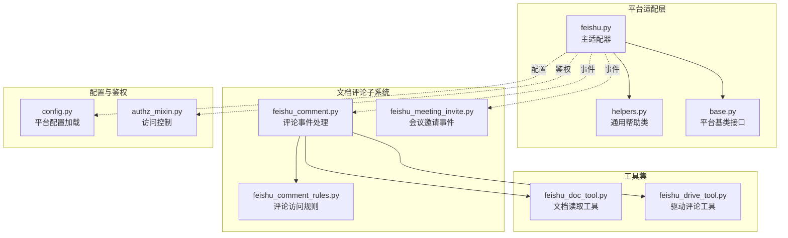
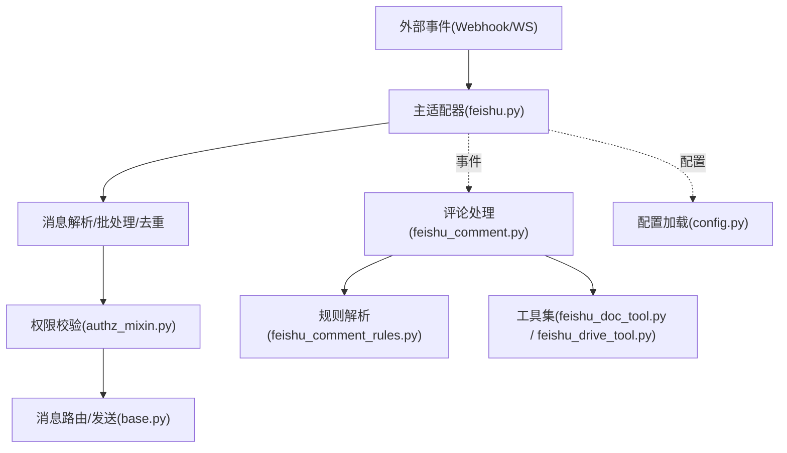
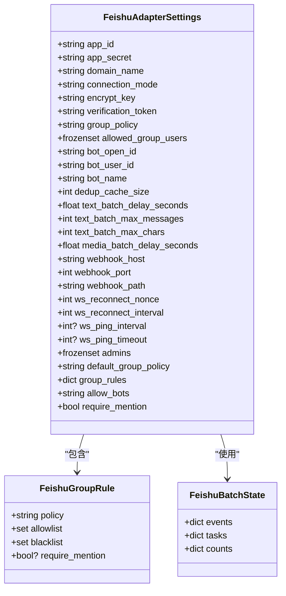
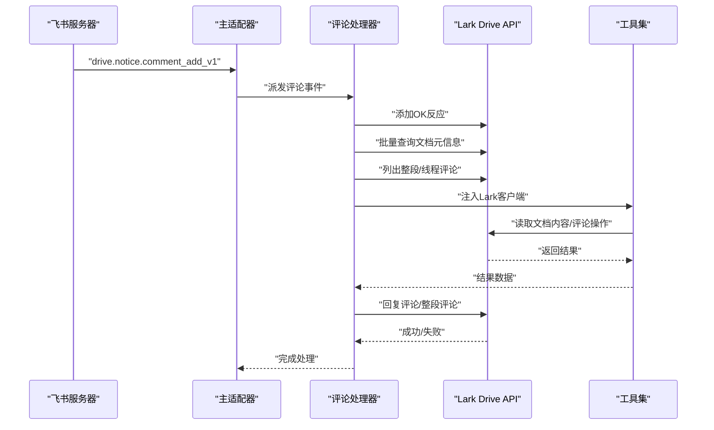
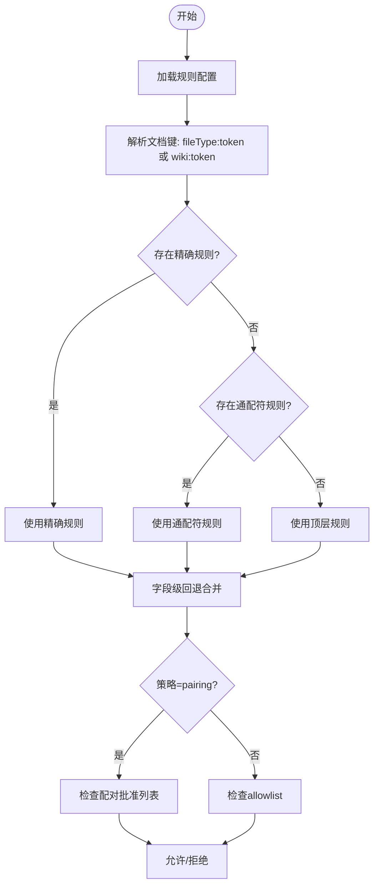
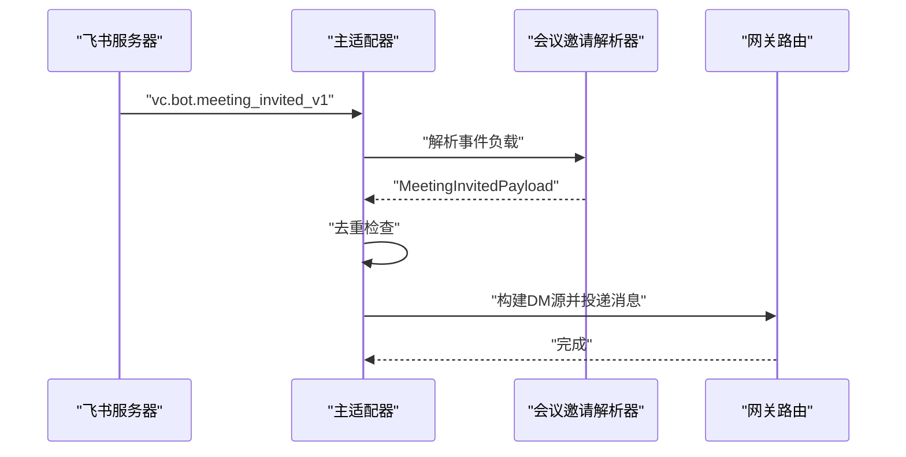
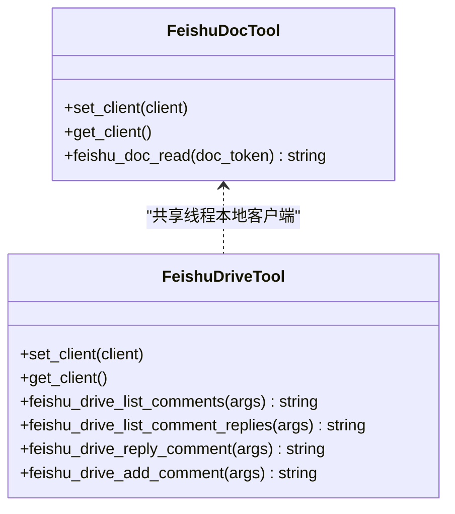
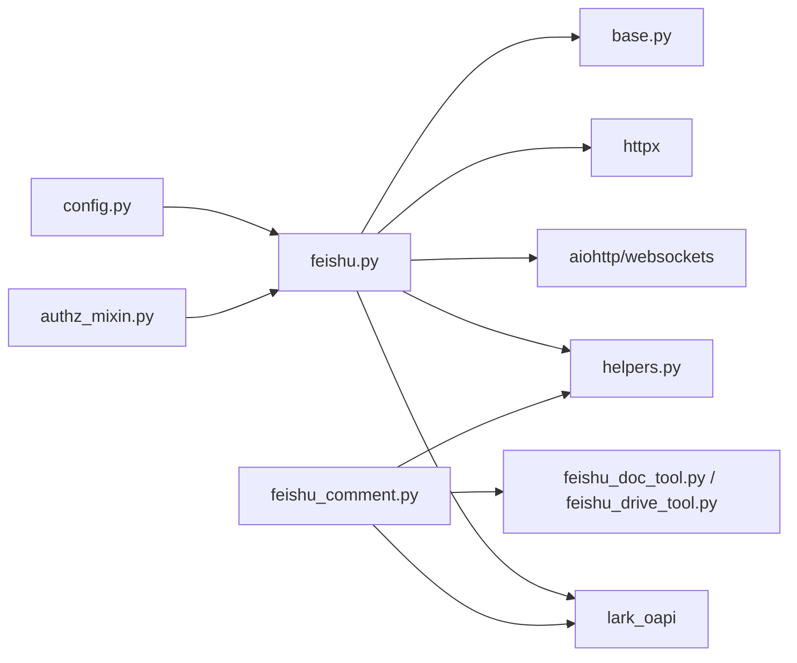

# 飞书平台适配器

<cite>
**本文档引用的文件**
- [feishu.py](file://gateway/platforms/feishu.py)
- [feishu_comment.py](file://gateway/platforms/feishu_comment.py)
- [feishu_comment_rules.py](file://gateway/platforms/feishu_comment_rules.py)
- [feishu_meeting_invite.py](file://gateway/platforms/feishu_meeting_invite.py)
- [helpers.py](file://gateway/platforms/helpers.py)
- [base.py](file://gateway/platforms/base.py)
- [feishu_doc_tool.py](file://tools/feishu_doc_tool.py)
- [feishu_drive_tool.py](file://tools/feishu_drive_tool.py)
- [config.py](file://gateway/config.py)
- [authz_mixin.py](file://gateway/authz_mixin.py)
</cite>

## 目录
1. [简介](#简介)
2. [项目结构](#项目结构)
3. [核心组件](#核心组件)
4. [架构总览](#架构总览)
5. [详细组件分析](#详细组件分析)
6. [依赖分析](#依赖分析)
7. [性能考虑](#性能考虑)
8. [故障排查指南](#故障排查指南)
9. [结论](#结论)
10. [附录](#附录)

## 简介
本文件为飞书（Lark）平台适配器的深度技术文档，覆盖以下主题：
- Lark 开放平台 API 的集成与适配
- 应用授权、消息接收与发送机制
- 飞书特有能力：多维表格评论、会议邀请、审批流程等
- 消息格式处理：富文本、卡片消息、交互组件
- 权限体系与部门管理集成
- 文档协作与评论系统实现
- 国际化与多语言处理
- 配置管理、安全设置与最佳实践
- 完整的功能演示与集成示例

## 项目结构
飞书适配器由多个模块协同组成：
- 平台适配层：负责 WebSocket/Webhook 接收、消息解析、发送与批处理、去重、权限控制等
- 文档评论子系统：独立模块，处理 drive.notice.comment_add_v1 事件，提供评论列表、回复、整段评论等能力
- 工具集：提供文档读取与驱动评论操作的工具，供 AI Agent 在评论场景中使用
- 基础设施：通用帮助类（去重、文本批处理、Markdown 清洗）、平台基类接口
- 配置与鉴权：通过环境变量注入配置，结合网关鉴权混合器进行访问控制

图示来源
- [feishu.py:1-120](file://gateway/platforms/feishu.py#L1-L120)
- [feishu_comment.py:1-60](file://gateway/platforms/feishu_comment.py#L1-L60)
- [feishu_comment_rules.py:1-40](file://gateway/platforms/feishu_comment_rules.py#L1-L40)
- [feishu_meeting_invite.py:1-30](file://gateway/platforms/feishu_meeting_invite.py#L1-L30)
- [helpers.py:1-40](file://gateway/platforms/helpers.py#L1-L40)
- [base.py:1-60](file://gateway/platforms/base.py#L1-L60)
- [feishu_doc_tool.py:1-40](file://tools/feishu_doc_tool.py#L1-L40)
- [feishu_drive_tool.py:1-40](file://tools/feishu_drive_tool.py#L1-L40)
- [config.py:1769-1795](file://gateway/config.py#L1769-L1795)
- [authz_mixin.py:238-278](file://gateway/authz_mixin.py#L238-L278)

章节来源
- [feishu.py:1-120](file://gateway/platforms/feishu.py#L1-L120)
- [feishu_comment.py:1-60](file://gateway/platforms/feishu_comment.py#L1-L60)
- [feishu_comment_rules.py:1-40](file://gateway/platforms/feishu_comment_rules.py#L1-L40)
- [feishu_meeting_invite.py:1-30](file://gateway/platforms/feishu_meeting_invite.py#L1-L30)
- [helpers.py:1-40](file://gateway/platforms/helpers.py#L1-L40)
- [base.py:1-60](file://gateway/platforms/base.py#L1-L60)
- [feishu_doc_tool.py:1-40](file://tools/feishu_doc_tool.py#L1-L40)
- [feishu_drive_tool.py:1-40](file://tools/feishu_drive_tool.py#L1-L40)
- [config.py:1769-1795](file://gateway/config.py#L1769-L1795)
- [authz_mixin.py:238-278](file://gateway/authz_mixin.py#L238-L278)

## 核心组件
- 主适配器（feishu.py）
  - 支持 WebSocket 与 Webhook 双通道
  - 处理富文本 post 解析、Markdown 渲染与回退策略
  - 提供消息批处理、去重、媒体缓存、反应标记（Processing/失败标记）
  - 统一的会话键隔离与 mention 路由
  - 群组策略与管理员白名单
- 评论子系统（feishu_comment.py）
  - 处理 drive.notice.comment_add_v1 事件
  - 与 Drive v2 评论反应 API 协作
  - 支持整段评论与局部评论线程回复
  - 文档链接提取与 wiki 节点反查
- 访问规则（feishu_comment_rules.py）
  - 基于文档类型:token 的三层规则解析（精确匹配 > 通配符 > 顶层）
  - 支持 pairing 策略与批准用户存储
- 会议邀请（feishu_meeting_invite.py）
  - 将 vc.bot.meeting_invited_v1 转换为网关消息事件
  - 构建简洁提示并路由到邀请者 DM
- 工具集（feishu_doc_tool.py、feishu_drive_tool.py）
  - 文档内容读取（raw_content）
  - 评论列表、回复、新增整段评论
- 基础设施（helpers.py、base.py）
  - 通用去重、文本批处理、Markdown 清洗
  - 平台基类接口与媒体缓存工具

章节来源
- [feishu.py:364-415](file://gateway/platforms/feishu.py#L364-L415)
- [feishu_comment.py:1-120](file://gateway/platforms/feishu_comment.py#L1-L120)
- [feishu_comment_rules.py:42-66](file://gateway/platforms/feishu_comment_rules.py#L42-L66)
- [feishu_meeting_invite.py:23-47](file://gateway/platforms/feishu_meeting_invite.py#L23-L47)
- [feishu_doc_tool.py:19-27](file://tools/feishu_doc_tool.py#L19-L27)
- [feishu_drive_tool.py:20-28](file://tools/feishu_drive_tool.py#L20-L28)
- [helpers.py:27-76](file://gateway/platforms/helpers.py#L27-L76)
- [base.py:567-700](file://gateway/platforms/base.py#L567-L700)

## 架构总览
飞书适配器采用“主适配器 + 子系统 + 工具集”的分层设计：
- 主适配器负责平台接入、消息编解码、发送与批处理
- 评论子系统独立处理文档评论事件，避免主适配器膨胀
- 工具集在评论场景中被注入 Lark 客户端，执行真实 API 调用
- 鉴权与配置通过网关统一注入，确保一致性与可运维性

图示来源
- [feishu.py:1-120](file://gateway/platforms/feishu.py#L1-L120)
- [feishu_comment.py:1-60](file://gateway/platforms/feishu_comment.py#L1-L60)
- [feishu_comment_rules.py:1-40](file://gateway/platforms/feishu_comment_rules.py#L1-L40)
- [feishu_doc_tool.py:1-40](file://tools/feishu_doc_tool.py#L1-L40)
- [feishu_drive_tool.py:1-40](file://tools/feishu_drive_tool.py#L1-L40)
- [config.py:1769-1795](file://gateway/config.py#L1769-L1795)
- [authz_mixin.py:238-278](file://gateway/authz_mixin.py#L238-L278)

## 详细组件分析

### 主适配器（feishu.py）
- 身份模型与会话隔离
  - 使用 open_id（应用域）、user_id（租户域）、union_id（开发者域）三套标识
  - 单机器人模式下以 open_id 作为唯一用户标识
  - 会话键优先 union_id（user_id_alt），提升跨应用稳定性
- 消息解析与渲染
  - 解析 post 类型富文本，支持 text/a/at/img/media/code/code_block 等标签
  - Markdown 渲染与回退策略：表格强制文本模式、代码块 fence 分割、内联代码包裹
  - 提供纯文本回退字符串（富文本、转发、分享聊天、交互消息、图片、附件）
- 发送与批处理
  - 文本批处理聚合与延迟刷新，媒体批处理与分割
  - 去重缓存（消息 ID → 时间戳），TTL 控制
  - 反馈反应：进行中 Typing、失败 CrossMark，成功以回复本身为准
- 连接与安全
  - WebSocket/Webhook 可用性检测
  - Webhook 异常追踪与速率限制
  - 验证令牌二次鉴权
- 群组策略
  - open/allowlist/blacklist/admin_only/disabled 策略
  - per-group 规则继承与覆盖

图示来源
- [feishu.py:364-398](file://gateway/platforms/feishu.py#L364-L398)
- [feishu.py:400-408](file://gateway/platforms/feishu.py#L400-L408)
- [feishu.py:410-415](file://gateway/platforms/feishu.py#L410-L415)

章节来源
- [feishu.py:18-46](file://gateway/platforms/feishu.py#L18-L46)
- [feishu.py:261-267](file://gateway/platforms/feishu.py#L261-L267)
- [feishu.py:364-398](file://gateway/platforms/feishu.py#L364-L398)
- [feishu.py:400-408](file://gateway/platforms/feishu.py#L400-L408)
- [feishu.py:410-415](file://gateway/platforms/feishu.py#L410-L415)

### 文档评论子系统（feishu_comment.py）
- 事件解析
  - 解析 drive.notice.comment_add_v1，抽取 event_id、comment_id、reply_id、file_token、file_type、from/to open_id 等字段
- 评论反应 API
  - 添加/删除 OK 反应，用于确认收到事件
- 文档元数据与评论查询
  - 批量查询文档元信息（标题、URL、类型）
  - 列出整段评论与评论线程回复，带分页与重试
- 回复路由与长文本分片
  - 整段评论：add_whole_comment
  - 局部评论：reply_to_comment，若返回特定错误码则回退为整段评论
  - 长文本按行切分，逐片发送
- 文档链接解析与 wiki 节点反查
  - 提取评论中的文档链接，识别 wiki 节点并解析为底层文档类型与 token
  - 格式化引用文档清单，嵌入提示词

图示来源
- [feishu_comment.py:103-147](file://gateway/platforms/feishu_comment.py#L103-L147)
- [feishu_comment.py:156-204](file://gateway/platforms/feishu_comment.py#L156-L204)
- [feishu_comment.py:258-298](file://gateway/platforms/feishu_comment.py#L258-L298)
- [feishu_comment.py:304-353](file://gateway/platforms/feishu_comment.py#L304-L353)
- [feishu_comment.py:470-531](file://gateway/platforms/feishu_comment.py#L470-L531)
- [feishu_doc_tool.py:69-122](file://tools/feishu_doc_tool.py#L69-L122)
- [feishu_drive_tool.py:133-166](file://tools/feishu_drive_tool.py#L133-L166)

章节来源
- [feishu_comment.py:1-120](file://gateway/platforms/feishu_comment.py#L1-L120)
- [feishu_comment.py:258-298](file://gateway/platforms/feishu_comment.py#L258-L298)
- [feishu_comment.py:304-353](file://gateway/platforms/feishu_comment.py#L304-L353)
- [feishu_comment.py:470-531](file://gateway/platforms/feishu_comment.py#L470-L531)
- [feishu_doc_tool.py:69-122](file://tools/feishu_doc_tool.py#L69-L122)
- [feishu_drive_tool.py:133-166](file://tools/feishu_drive_tool.py#L133-L166)

### 访问规则（feishu_comment_rules.py）
- 规则层级
  - 精确文档规则（fileType:token 或 wiki:token）
  - 通配符规则（*）
  - 顶层默认规则
  - 字段级回退：enabled/policy/allow_from 独立生效
- 策略
  - allowlist：仅允许指定用户
  - pairing：基于配对批准列表
- 配对存储
  - 基于 HERMES_HOME 的 JSON 文件，热加载与 mtime 缓存
  - 支持添加/移除/列出批准用户

图示来源
- [feishu_comment_rules.py:170-218](file://gateway/platforms/feishu_comment_rules.py#L170-L218)
- [feishu_comment_rules.py:224-279](file://gateway/platforms/feishu_comment_rules.py#L224-L279)

章节来源
- [feishu_comment_rules.py:42-66](file://gateway/platforms/feishu_comment_rules.py#L42-L66)
- [feishu_comment_rules.py:170-218](file://gateway/platforms/feishu_comment_rules.py#L170-L218)
- [feishu_comment_rules.py:224-279](file://gateway/platforms/feishu_comment_rules.py#L224-L279)

### 会议邀请（feishu_meeting_invite.py）
- 事件解析
  - 解析 vc.bot.meeting_invited_v1，抽取 meeting/meeting_no/topic/host_user、inviter 等
- 提示构建
  - 生成简洁提示，指导加入会议或向邀请者解释无法加入的原因
- 去重与路由
  - 基于事件 ID 或 meeting_id+inviter_id+时间戳去重
  - 通过网关源构建 DM 会话，将提示作为文本消息投递

图示来源
- [feishu_meeting_invite.py:117-136](file://gateway/platforms/feishu_meeting_invite.py#L117-L136)
- [feishu_meeting_invite.py:167-213](file://gateway/platforms/feishu_meeting_invite.py#L167-L213)

章节来源
- [feishu_meeting_invite.py:23-47](file://gateway/platforms/feishu_meeting_invite.py#L23-L47)
- [feishu_meeting_invite.py:117-136](file://gateway/platforms/feishu_meeting_invite.py#L117-L136)
- [feishu_meeting_invite.py:167-213](file://gateway/platforms/feishu_meeting_invite.py#L167-L213)

### 工具集（feishu_doc_tool.py、feishu_drive_tool.py）
- 文档读取工具
  - 通过线程本地存储注入 Lark 客户端
  - 读取文档原始内容，返回纯文本
- 驱动评论工具
  - 列出评论、列出评论回复、回复评论、新增整段评论
  - 参数校验与错误处理，返回工具结果或错误信息

图示来源
- [feishu_doc_tool.py:19-27](file://tools/feishu_doc_tool.py#L19-L27)
- [feishu_doc_tool.py:69-122](file://tools/feishu_doc_tool.py#L69-L122)
- [feishu_drive_tool.py:20-28](file://tools/feishu_drive_tool.py#L20-L28)
- [feishu_drive_tool.py:133-166](file://tools/feishu_drive_tool.py#L133-L166)

章节来源
- [feishu_doc_tool.py:19-27](file://tools/feishu_doc_tool.py#L19-L27)
- [feishu_doc_tool.py:69-122](file://tools/feishu_doc_tool.py#L69-L122)
- [feishu_drive_tool.py:20-28](file://tools/feishu_drive_tool.py#L20-L28)
- [feishu_drive_tool.py:133-166](file://tools/feishu_drive_tool.py#L133-L166)

### 基础设施与通用帮助
- 通用去重器
  - 基于 TTL 的消息 ID 去重，支持最大缓存大小裁剪
- 文本批处理聚合器
  - 将短时间内的文本事件聚合，延迟刷新，支持拆分阈值
- Markdown 清洗
  - 移除加粗、斜体、代码块、链接等格式，保留纯文本
- 图像/音频/视频缓存
  - 下载并缓存媒体资源，支持 SSRF 保护与重试

章节来源
- [helpers.py:27-76](file://gateway/platforms/helpers.py#L27-L76)
- [helpers.py:81-164](file://gateway/platforms/helpers.py#L81-L164)
- [helpers.py:180-196](file://gateway/platforms/helpers.py#L180-L196)
- [base.py:567-700](file://gateway/platforms/base.py#L567-L700)

## 依赖分析
- 组件耦合
  - 主适配器与通用帮助类松耦合，通过接口与工具函数交互
  - 评论子系统与工具集通过线程本地客户端弱耦合，便于测试与替换
  - 配置与鉴权通过环境变量注入，降低硬编码耦合
- 外部依赖
  - lark_oapi：用于调用 Lark/Open API
  - aiohttp/websockets：用于 Webhook 与 WebSocket
  - httpx：用于媒体下载与 SSRF 保护

图示来源
- [feishu.py:75-125](file://gateway/platforms/feishu.py#L75-L125)
- [feishu_comment.py:37-96](file://gateway/platforms/feishu_comment.py#L37-L96)
- [feishu_doc_tool.py:54-67](file://tools/feishu_doc_tool.py#L54-L67)
- [feishu_drive_tool.py:30-38](file://tools/feishu_drive_tool.py#L30-L38)
- [config.py:1769-1795](file://gateway/config.py#L1769-L1795)
- [authz_mixin.py:238-278](file://gateway/authz_mixin.py#L238-L278)

章节来源
- [feishu.py:75-125](file://gateway/platforms/feishu.py#L75-L125)
- [feishu_comment.py:37-96](file://gateway/platforms/feishu_comment.py#L37-L96)
- [feishu_doc_tool.py:54-67](file://tools/feishu_doc_tool.py#L54-L67)
- [feishu_drive_tool.py:30-38](file://tools/feishu_drive_tool.py#L30-L38)
- [config.py:1769-1795](file://gateway/config.py#L1769-L1795)
- [authz_mixin.py:238-278](file://gateway/authz_mixin.py#L238-L278)

## 性能考虑
- 批处理与延迟
  - 文本批处理延迟与拆分阈值可调，减少 API 调用次数
  - 媒体批处理延迟与分割，避免超长消息
- 去重与缓存
  - 去重缓存大小与 TTL 控制内存占用
  - 媒体缓存清理与过期策略
- 并发与重试
  - 评论查询与回复采用指数退避重试，提升最终一致性
- 网络与代理
  - 支持系统代理与 NO_PROXY 白名单，避免 DNS 污染与内部地址泄露

## 故障排查指南
- Webhook 异常与速率限制
  - 关注异常计数阈值与 TTL，定位持续失败的回调
- 评论回复错误码
  - 对特定错误码（如不允许回复）自动回退为整段评论
- 媒体下载失败
  - SSRF 保护触发时检查 URL 安全性与网络可达性
- 鉴权失败
  - 检查允许用户列表、群组策略、配对批准状态
- 会话键不一致
  - 确认 union_id 优先级与跨应用稳定性

章节来源
- [feishu.py:214-216](file://gateway/platforms/feishu.py#L214-L216)
- [feishu_comment.py:583-589](file://gateway/platforms/feishu_comment.py#L583-L589)
- [base.py:640-679](file://gateway/platforms/base.py#L640-L679)
- [authz_mixin.py:238-278](file://gateway/authz_mixin.py#L238-L278)

## 结论
飞书平台适配器通过清晰的分层设计与完善的基础设施，实现了对 Lark 开放平台的全面集成。主适配器负责消息编解码与发送，评论子系统独立处理文档评论事件，工具集在需要时注入真实 API 调用。配合去重、批处理、权限控制与配置管理，整体具备高可用、可扩展与易维护的特点。

## 附录

### 配置管理与安全设置
- 平台配置（环境变量）
  - FEISHU_APP_ID、FEISHU_APP_SECRET：应用凭证
  - FEISHU_DOMAIN：域名（feishu/lark）
  - FEISHU_CONNECTION_MODE：连接模式（websocket/webhook）
  - FEISHU_ENCRYPT_KEY、FEISHU_VERIFICATION_TOKEN：加密与验证
  - FEISHU_HOME_CHANNEL、FEISHU_HOME_CHANNEL_NAME、FEISHU_HOME_CHANNEL_THREAD_ID：主页频道
  - FEISHU_ALLOWED_USERS、FEISHU_ALLOW_ALL_USERS、FEISHU_ALLOW_BOTS：访问控制
- 鉴权映射
  - FEISHU_ALLOWED_USERS、FEISHU_ALLOW_ALL_USERS、FEISHU_ALLOW_BOTS 与网关鉴权混合器联动
- 最佳实践
  - 启用验证令牌与加密密钥
  - 使用 allowlist 策略，必要时启用 pairing
  - 合理设置批处理参数与去重 TTL
  - 使用代理与 NO_PROXY 白名单保障网络安全

章节来源
- [config.py:1769-1795](file://gateway/config.py#L1769-L1795)
- [authz_mixin.py:238-278](file://gateway/authz_mixin.py#L238-L278)
- [feishu.py:206-216](file://gateway/platforms/feishu.py#L206-L216)

### 功能演示与集成示例
- 接收并解析富文本消息
  - 使用主适配器的消息解析与渲染逻辑，将 post 内容转换为 Markdown 文本
- 处理文档评论
  - 监听 drive.notice.comment_add_v1，添加 OK 反应，查询文档元信息与评论线程，按需回复
- 会议邀请
  - 监听 vc.bot.meeting_invited_v1，构建提示并路由到邀请者 DM
- 工具调用
  - 在评论场景中注入 Lark 客户端，调用文档读取与评论操作工具

章节来源
- [feishu.py:612-646](file://gateway/platforms/feishu.py#L612-L646)
- [feishu_comment.py:103-147](file://gateway/platforms/feishu_comment.py#L103-L147)
- [feishu_meeting_invite.py:117-136](file://gateway/platforms/feishu_meeting_invite.py#L117-L136)
- [feishu_doc_tool.py:69-122](file://tools/feishu_doc_tool.py#L69-L122)
- [feishu_drive_tool.py:133-166](file://tools/feishu_drive_tool.py#L133-L166)