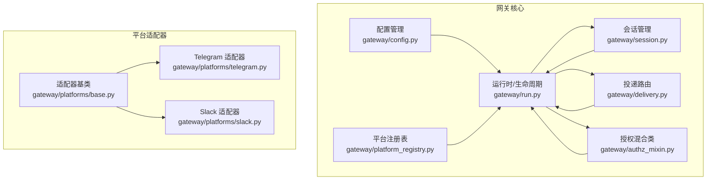
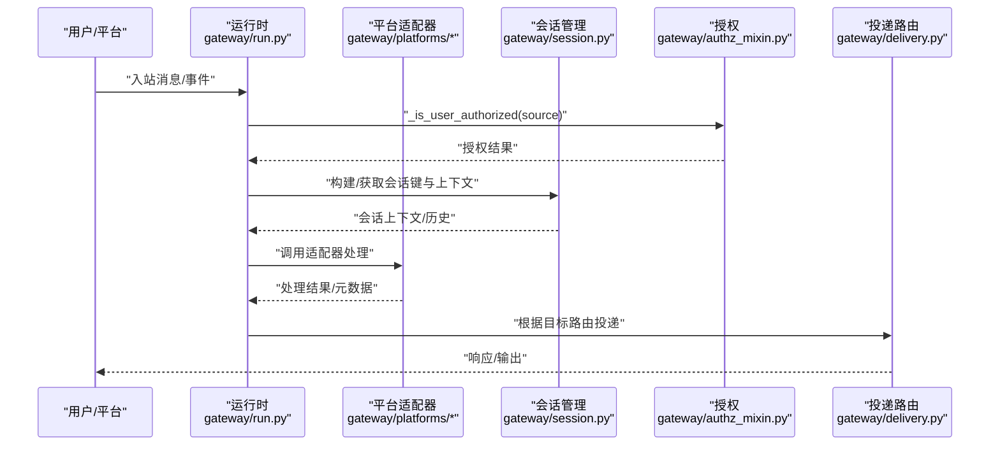
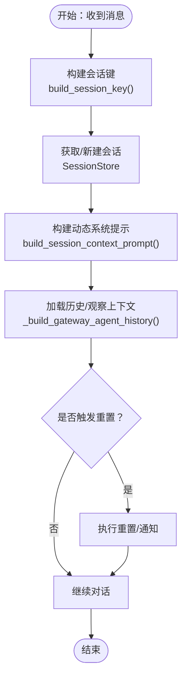
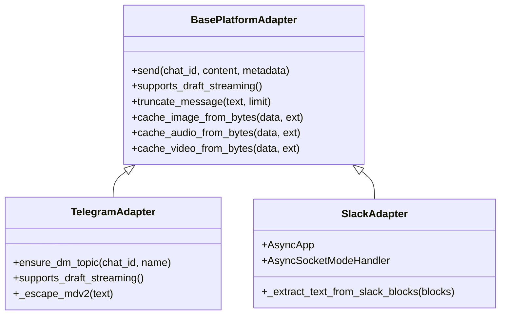
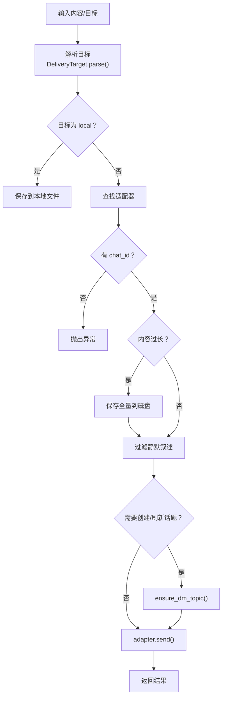
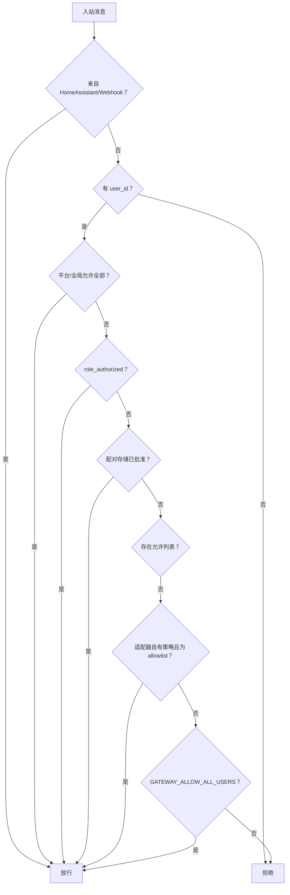
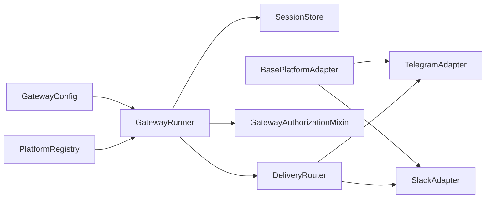

# 消息网关系统

<cite>
**本文档引用的文件**
- [gateway/__init__.py](file://gateway/__init__.py)
- [gateway/run.py](file://gateway/run.py)
- [gateway/session.py](file://gateway/session.py)
- [gateway/platform_registry.py](file://gateway/platform_registry.py)
- [gateway/config.py](file://gateway/config.py)
- [gateway/platforms/base.py](file://gateway/platforms/base.py)
- [gateway/platforms/telegram.py](file://gateway/platforms/telegram.py)
- [gateway/platforms/slack.py](file://gateway/platforms/slack.py)
- [gateway/delivery.py](file://gateway/delivery.py)
- [gateway/authz_mixin.py](file://gateway/authz_mixin.py)
</cite>

## 目录
1. [引言](#引言)
2. [项目结构](#项目结构)
3. [核心组件](#核心组件)
4. [架构总览](#架构总览)
5. [详细组件分析](#详细组件分析)
6. [依赖关系分析](#依赖关系分析)
7. [性能考虑](#性能考虑)
8. [故障排查指南](#故障排查指南)
9. [结论](#结论)
10. [附录](#附录)

## 引言
本文件面向消息网关系统的开发者与运维人员，系统性阐述网关的架构设计、实现机制与最佳实践。内容覆盖会话管理、消息路由、平台适配与扩展、认证与授权、消息接收/处理/转发/响应全流程、多平台同步与去重、冲突解决策略，以及平台特定功能（如 Telegram 的 Inline 模式、Discord 组件交互等）。同时提供部署与运维建议，包括负载均衡、故障转移与监控告警。

## 项目结构
消息网关位于仓库的 gateway 子目录，采用“按职责分层 + 平台插件化”的组织方式：
- 配置与入口：gateway/config.py、gateway/run.py、gateway/__init__.py
- 会话与上下文：gateway/session.py、gateway/session_context.py
- 平台注册与适配：gateway/platform_registry.py、gateway/platforms/base.py、各平台适配器（如 telegram.py、slack.py）
- 投递与路由：gateway/delivery.py
- 认证与授权：gateway/authz_mixin.py
- 其他支撑模块：gateway/pairing.py、gateway/status.py 等

图表来源
- [gateway/config.py](file://gateway/config.py)
- [gateway/run.py](file://gateway/run.py)
- [gateway/platform_registry.py](file://gateway/platform_registry.py)
- [gateway/session.py](file://gateway/session.py)
- [gateway/delivery.py](file://gateway/delivery.py)
- [gateway/authz_mixin.py](file://gateway/authz_mixin.py)
- [gateway/platforms/base.py](file://gateway/platforms/base.py)
- [gateway/platforms/telegram.py](file://gateway/platforms/telegram.py)
- [gateway/platforms/slack.py](file://gateway/platforms/slack.py)

章节来源
- [gateway/__init__.py:1-36](file://gateway/__init__.py#L1-L36)
- [gateway/config.py:1-200](file://gateway/config.py#L1-L200)
- [gateway/run.py:1-200](file://gateway/run.py#L1-L200)

## 核心组件
- 配置与平台枚举：定义平台类型、连接检查器、会话重置策略、流式传输参数等，支持从环境变量与 YAML 合并加载。
- 运行时与生命周期：负责启动/停止、异常兜底、事件循环安全、会话缓存与过期清理、自动续命与恢复。
- 会话管理：构建会话键、持久化会话元数据、动态系统提示注入、会话重置策略与通知。
- 平台注册表：统一注册/发现平台适配器，支持内置与插件平台；提供工厂、校验、安装提示、独立发送钩子等。
- 适配器基类：抽象出统一接口与通用能力（代理、媒体缓存、线程/主题路由、长度限制与截断）。
- 投递路由：解析目标字符串、本地落盘、平台适配器投递、静默叙述过滤、超长输出截断与保存全量。
- 授权与访问控制：基于环境变量、平台允许列表、角色授权、配对存储、适配器自有策略等综合判定。

章节来源
- [gateway/config.py:136-237](file://gateway/config.py#L136-L237)
- [gateway/run.py:560-760](file://gateway/run.py#L560-L760)
- [gateway/session.py:702-800](file://gateway/session.py#L702-L800)
- [gateway/platform_registry.py:162-261](file://gateway/platform_registry.py#L162-L261)
- [gateway/platforms/base.py:483-500](file://gateway/platforms/base.py#L483-L500)
- [gateway/delivery.py:94-173](file://gateway/delivery.py#L94-L173)
- [gateway/authz_mixin.py:31-537](file://gateway/authz_mixin.py#L31-L537)

## 架构总览
网关通过“配置驱动 + 注册表 + 适配器基类 + 路由投递 + 授权控制”形成可扩展的消息集成框架。运行时负责生命周期与稳定性，会话管理确保对话连续性，平台适配器屏蔽差异，投递路由保障输出一致性，授权混合类贯穿所有入站消息。

图表来源
- [gateway/run.py:560-760](file://gateway/run.py#L560-L760)
- [gateway/authz_mixin.py:176-453](file://gateway/authz_mixin.py#L176-L453)
- [gateway/session.py:618-700](file://gateway/session.py#L618-L700)
- [gateway/delivery.py:195-235](file://gateway/delivery.py#L195-L235)

## 详细组件分析

### 会话管理与上下文
- 会话键规则：基于平台、聊天类型、聊天标识、线程标识、参与者标识等，支持 DM、群组、论坛主题、频道等场景隔离或共享。
- 动态系统提示：根据来源平台、聊天主题、已连接平台、Home 渠道等生成上下文提示，注入到系统提示中，使代理明确其所在渠道与可用能力。
- 会话存储：SQLite 为主，兼容 JSONL 回退；支持令牌统计、成本估算、过期终结标记、挂起/恢复标记等。
- 重置策略：支持每日边界、空闲超时、两者皆是、永不重置，并可配置通知与排除平台。

图表来源
- [gateway/session.py:618-700](file://gateway/session.py#L618-L700)
- [gateway/session.py:232-440](file://gateway/session.py#L232-L440)
- [gateway/session.py:702-800](file://gateway/session.py#L702-L800)
- [gateway/run.py:715-796](file://gateway/run.py#L715-L796)

章节来源
- [gateway/session.py:618-700](file://gateway/session.py#L618-L700)
- [gateway/session.py:232-440](file://gateway/session.py#L232-L440)
- [gateway/session.py:702-800](file://gateway/session.py#L702-L800)
- [gateway/run.py:715-796](file://gateway/run.py#L715-L796)

### 平台适配器与扩展机制
- 基类能力：统一代理设置、媒体缓存（图片/音频/视频）、线程/主题路由、UTF-16 长度计算与截断、SSRF 防护、URL 安全校验等。
- 注册表：支持插件自注册，提供工厂、依赖检查、配置校验、连接状态、安装提示、独立发送钩子、显示与隐私属性等。
- 内置适配器：Telegram、Slack 等，各自实现平台特性（如 Telegram 的 Inline 模式、MarkdownV2 转义、私聊话题等；Slack 的 Socket Mode、Block Kit 文本提取、线程上下文缓存等）。

图表来源
- [gateway/platforms/base.py:483-500](file://gateway/platforms/base.py#L483-L500)
- [gateway/platforms/telegram.py:112-164](file://gateway/platforms/telegram.py#L112-L164)
- [gateway/platforms/slack.py:81-106](file://gateway/platforms/slack.py#L81-L106)

章节来源
- [gateway/platforms/base.py:483-500](file://gateway/platforms/base.py#L483-L500)
- [gateway/platform_registry.py:162-261](file://gateway/platform_registry.py#L162-L261)
- [gateway/platforms/telegram.py:112-164](file://gateway/platforms/telegram.py#L112-L164)
- [gateway/platforms/slack.py:81-106](file://gateway/platforms/slack.py#L81-L106)

### 消息路由与投递
- 目标解析：支持 origin、local、platform、platform:chat_id、platform:chat_id:thread_id 等格式。
- 本地落盘：按作业 ID/时间戳生成 Markdown 文件，记录元信息与内容。
- 平台投递：校验适配器存在与聊天 ID，必要时创建/刷新 Telegram 私聊话题，过滤静默叙述，超长输出截断并保存全量。
- 反馈与错误处理：记录失败原因，针对 Telegram 私聊话题错误进行刷新重试。

图表来源
- [gateway/delivery.py:112-173](file://gateway/delivery.py#L112-L173)
- [gateway/delivery.py:304-430](file://gateway/delivery.py#L304-L430)

章节来源
- [gateway/delivery.py:94-173](file://gateway/delivery.py#L94-L173)
- [gateway/delivery.py:304-430](file://gateway/delivery.py#L304-L430)

### 认证与授权策略
- 多级授权判定：平台允许全部标志、环境变量允许列表、角色授权、配对存储、全局允许全部、适配器自有策略（仅当策略为 allowlist 时才视为可信授权）。
- 不同平台策略：Telegram 支持按聊天 ID 授权群组；WhatsApp 支持别名展开与标准化；SimpleX 支持名称匹配。
- 未授权 DM 行为：优先配置项，其次根据是否配置了允许列表自动选择忽略或配对。

图表来源
- [gateway/authz_mixin.py:176-453](file://gateway/authz_mixin.py#L176-L453)
- [gateway/authz_mixin.py:455-537](file://gateway/authz_mixin.py#L455-L537)

章节来源
- [gateway/authz_mixin.py:31-537](file://gateway/authz_mixin.py#L31-L537)

### 平台特定功能
- Telegram
  - Inline 模式：支持内联查询与按钮交互（需平台依赖可用）。
  - 私聊话题：支持命名话题创建与回复锚定，避免跨话题漂移。
  - MarkdownV2：转义与清洗，保证在不同平台渲染一致。
  - 代理与网络：支持 SOCKS/HTTP 代理、macOS 系统代理检测、NO_PROXY 白名单。
- Slack
  - Socket Mode：异步应用与 Socket Mode Handler。
  - Block Kit：从 blocks 中提取可读文本，保留引用/列表/代码块。
  - 线程上下文缓存：减少重复拉取，提升响应速度。

章节来源
- [gateway/platforms/telegram.py:112-164](file://gateway/platforms/telegram.py#L112-L164)
- [gateway/platforms/telegram.py:172-196](file://gateway/platforms/telegram.py#L172-L196)
- [gateway/platforms/telegram.py:382-400](file://gateway/platforms/telegram.py#L382-L400)
- [gateway/platforms/base.py:348-448](file://gateway/platforms/base.py#L348-L448)
- [gateway/platforms/slack.py:81-106](file://gateway/platforms/slack.py#L81-L106)
- [gateway/platforms/slack.py:109-200](file://gateway/platforms/slack.py#L109-L200)

### 多平台同步、去重与冲突解决
- 多平台同步：通过 Home 渠道与 origin 目标实现跨平台回传与本地落盘，结合会话键保持一致性。
- 去重与静默叙述过滤：在投递前过滤静默叙述，避免模型幻觉导致的镜像循环；本地落盘路径不受此过滤影响。
- 冲突解决：Telegram 私聊话题错误时尝试刷新后重发；线程/主题元数据精确传递，避免回复错位。

章节来源
- [gateway/delivery.py:292-303](file://gateway/delivery.py#L292-L303)
- [gateway/delivery.py:337-348](file://gateway/delivery.py#L337-L348)
- [gateway/delivery.py:404-429](file://gateway/delivery.py#L404-L429)

## 依赖关系分析
- 配置驱动：GatewayConfig 提供平台、会话、投递、流式传输等配置，运行时按优先级合并环境变量与 YAML。
- 注册表优先：平台注册表优先于内置 if/elif 分支，插件平台可覆盖内置实现。
- 适配器依赖：各平台适配器依赖对应 SDK（如 python-telegram-bot、slack-bolt），缺失时支持懒安装。
- 运行时安全：事件循环异常处理器捕获瞬时网络错误，防止进程崩溃；会话缓存与过期 watcher 控制内存占用。

图表来源
- [gateway/config.py:506-604](file://gateway/config.py#L506-L604)
- [gateway/platform_registry.py:208-257](file://gateway/platform_registry.py#L208-L257)
- [gateway/run.py:560-760](file://gateway/run.py#L560-L760)
- [gateway/platforms/base.py:483-500](file://gateway/platforms/base.py#L483-L500)

章节来源
- [gateway/config.py:506-604](file://gateway/config.py#L506-L604)
- [gateway/platform_registry.py:208-257](file://gateway/platform_registry.py#L208-L257)
- [gateway/run.py:242-275](file://gateway/run.py#L242-L275)

## 性能考虑
- 会话缓存与过期：限制会话缓存大小与空闲 TTL，定期清理过期会话，避免内存膨胀。
- 流式传输：默认“自动”策略优先原生草稿预览，否则回退编辑；可调节编辑间隔与缓冲阈值以平衡实时性与限流。
- 媒体缓存：图片/音频/视频本地缓存，避免平台 URL 过期与重复下载。
- 代理与网络：统一代理解析与 NO_PROXY 白名单，降低网络波动带来的失败率。

章节来源
- [gateway/run.py:60-120](file://gateway/run.py#L60-L120)
- [gateway/config.py:392-453](file://gateway/config.py#L392-L453)
- [gateway/platforms/base.py:567-700](file://gateway/platforms/base.py#L567-L700)
- [gateway/platforms/base.py:348-448](file://gateway/platforms/base.py#L348-L448)

## 故障排查指南
- 瞬时网络错误：事件循环异常处理器会吞掉可重试的网络错误并记录警告，无需人工干预。
- Provider 错误分类：对认证失败、策略拒绝、速率限制等进行短消息提示，避免泄露敏感信息。
- 代理问题：检查环境变量（HTTPS_PROXY/HTTP_PROXY/ALL_PROXY、NO_PROXY、平台专属代理变量），确认系统代理与 SOCKS 支持。
- Telegram 私聊话题：若因话题不存在导致发送失败，将尝试创建/刷新后重发；否则抛出明确错误。
- Slack Block Kit：若文本提取异常，检查 blocks 结构与元素类型。

章节来源
- [gateway/run.py:242-275](file://gateway/run.py#L242-L275)
- [gateway/run.py:285-303](file://gateway/run.py#L285-L303)
- [gateway/platforms/base.py:348-448](file://gateway/platforms/base.py#L348-L448)
- [gateway/delivery.py:404-429](file://gateway/delivery.py#L404-L429)
- [gateway/platforms/slack.py:109-200](file://gateway/platforms/slack.py#L109-L200)

## 结论
该消息网关系统通过清晰的分层与可插拔的平台适配器，实现了多平台统一接入、稳定的会话管理与一致的投递体验。配合完善的授权与安全策略、流式传输优化与媒体缓存机制，能够在复杂生产环境中可靠运行。建议在生产部署中启用严格的允许列表、合理的会话过期策略与监控告警，持续优化代理与网络配置以提升稳定性与性能。

## 附录

### 平台适配器开发与扩展步骤
- 在平台注册表中注册新平台条目，提供工厂、依赖检查、配置校验、安装提示、独立发送钩子等。
- 实现适配器基类方法，处理消息接收/发送、线程/主题路由、媒体缓存、长度限制与截断。
- 如需平台特定功能（如 Telegram Inline 模式、Slack Block Kit 提取），在适配器中补充相应逻辑。
- 编写单元测试与集成测试，验证授权、投递、错误处理等关键路径。

章节来源
- [gateway/platform_registry.py:162-261](file://gateway/platform_registry.py#L162-L261)
- [gateway/platforms/base.py:483-500](file://gateway/platforms/base.py#L483-L500)