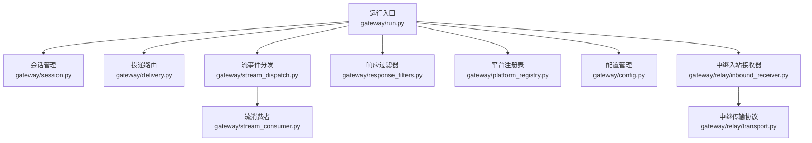
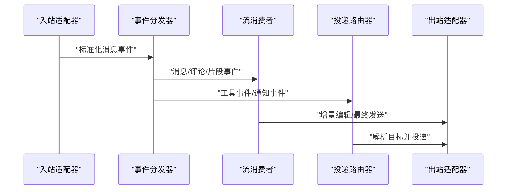
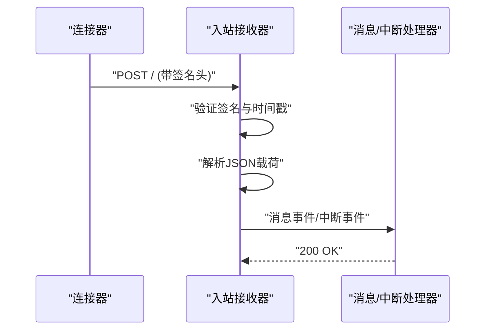
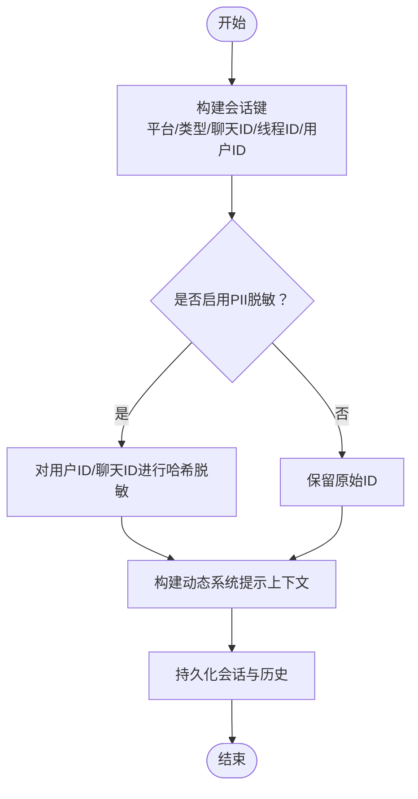
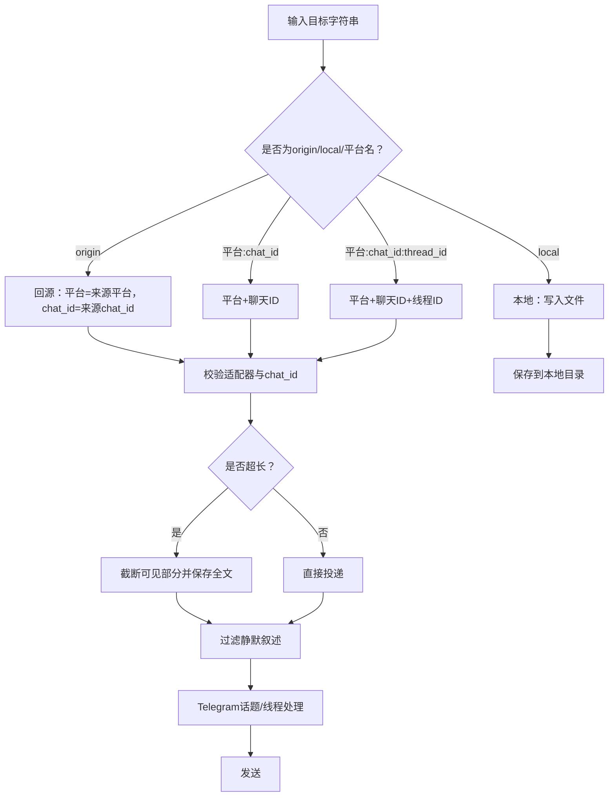
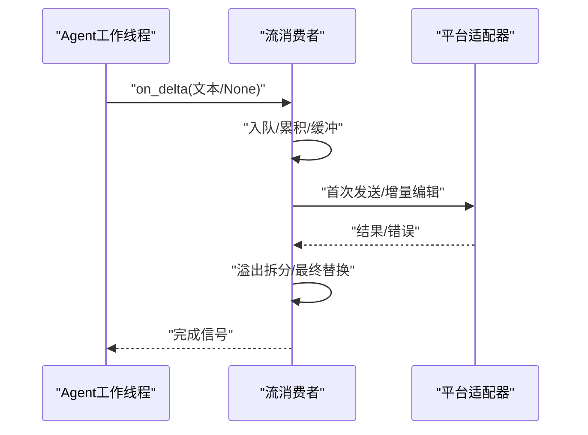
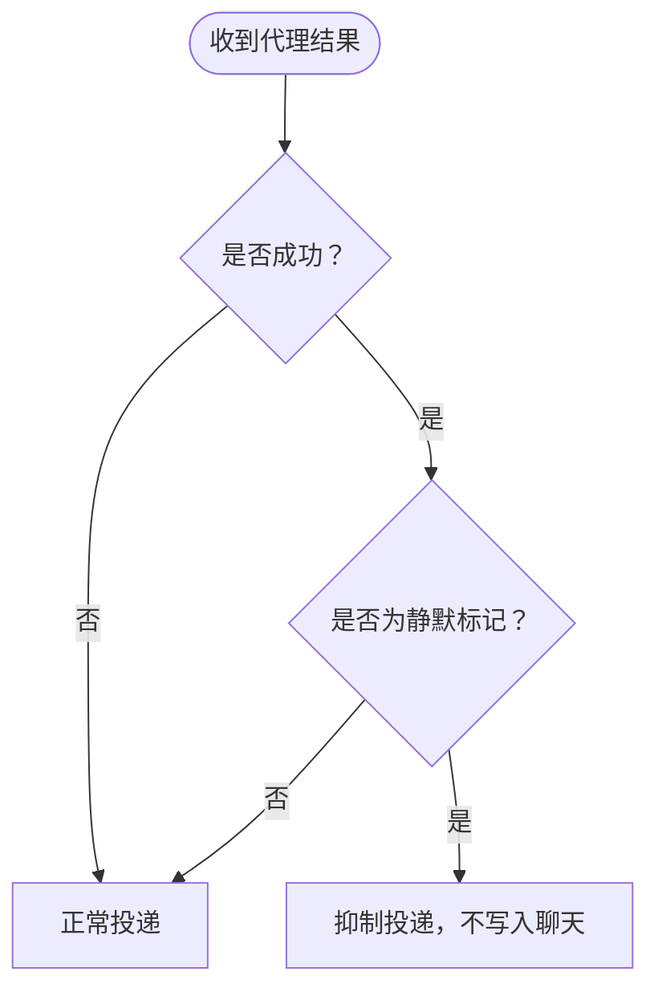
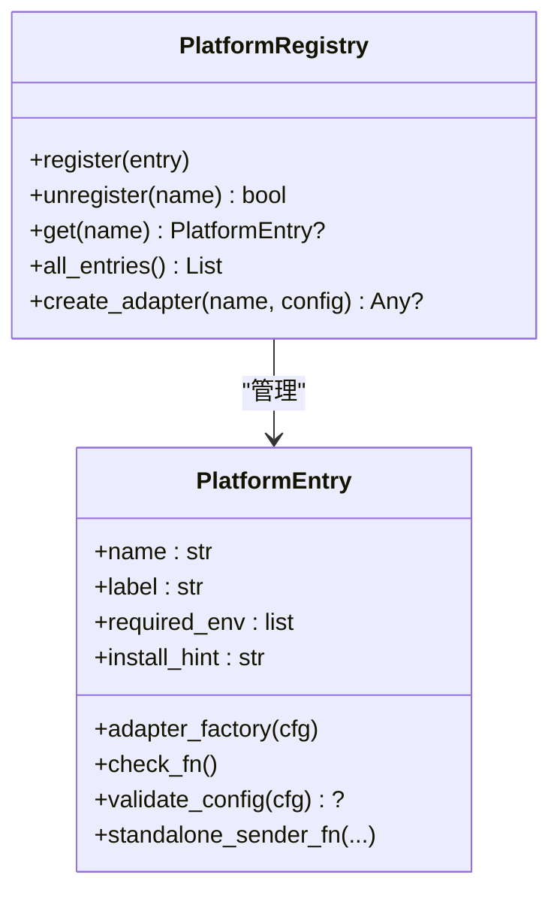
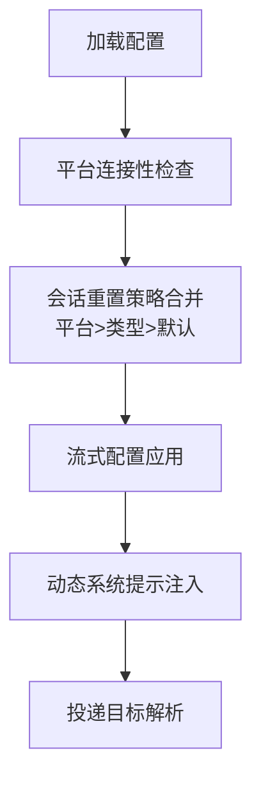
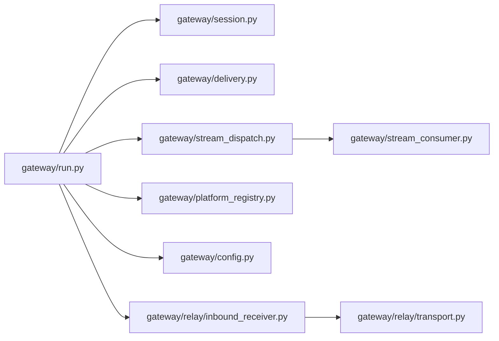

# 消息路由系统

<cite>
**本文档引用的文件**
- [gateway/run.py](file://gateway/run.py)
- [gateway/session.py](file://gateway/session.py)
- [gateway/delivery.py](file://gateway/delivery.py)
- [gateway/stream_dispatch.py](file://gateway/stream_dispatch.py)
- [gateway/stream_consumer.py](file://gateway/stream_consumer.py)
- [gateway/response_filters.py](file://gateway/response_filters.py)
- [gateway/platform_registry.py](file://gateway/platform_registry.py)
- [gateway/config.py](file://gateway/config.py)
- [gateway/relay/inbound_receiver.py](file://gateway/relay/inbound_receiver.py)
- [gateway/relay/transport.py](file://gateway/relay/transport.py)
</cite>

## 目录
1. [引言](#引言)
2. [项目结构](#项目结构)
3. [核心组件](#核心组件)
4. [架构总览](#架构总览)
5. [详细组件分析](#详细组件分析)
6. [依赖关系分析](#依赖关系分析)
7. [性能考虑](#性能考虑)
8. [故障排除指南](#故障排除指南)
9. [结论](#结论)
10. [附录](#附录)

## 引言
本技术文档面向消息路由系统，系统性阐述消息从接收、解析、过滤到转发的完整链路，覆盖基于规则的路由、动态路由与优先级调度；解释消息队列与异步处理机制；详述流式消息处理（实时分发、批量聚合、延迟处理）；说明响应过滤器的作用与实现；描述消息去重与冲突解决策略；并提供配置项与性能调优建议。

## 项目结构
消息路由系统主要由以下模块构成：
- 运行入口与生命周期管理：gateway/run.py
- 会话与上下文：gateway/session.py
- 投递与目标路由：gateway/delivery.py
- 流事件分发：gateway/stream_dispatch.py
- 流消费者与异步队列：gateway/stream_consumer.py
- 响应过滤器：gateway/response_filters.py
- 平台注册表：gateway/platform_registry.py
- 配置管理：gateway/config.py
- 中继入站接收器：gateway/relay/inbound_receiver.py
- 中继传输协议：gateway/relay/transport.py

**图表来源**
- [gateway/run.py:1-800](file://gateway/run.py#L1-L800)
- [gateway/session.py:1-800](file://gateway/session.py#L1-L800)
- [gateway/delivery.py:1-434](file://gateway/delivery.py#L1-L434)
- [gateway/stream_dispatch.py:1-133](file://gateway/stream_dispatch.py#L1-L133)
- [gateway/stream_consumer.py:1-800](file://gateway/stream_consumer.py#L1-L800)
- [gateway/response_filters.py:1-54](file://gateway/response_filters.py#L1-L54)
- [gateway/platform_registry.py:1-261](file://gateway/platform_registry.py#L1-L261)
- [gateway/config.py:1-800](file://gateway/config.py#L1-L800)
- [gateway/relay/inbound_receiver.py:1-205](file://gateway/relay/inbound_receiver.py#L1-L205)
- [gateway/relay/transport.py:1-102](file://gateway/relay/transport.py#L1-L102)

**章节来源**
- [gateway/run.py:1-800](file://gateway/run.py#L1-L800)
- [gateway/config.py:1-800](file://gateway/config.py#L1-L800)

## 核心组件
- 运行入口与生命周期：负责启动适配器、异常兜底、状态消息过滤、显示策略解析、历史重建、时间戳处理与自动续跑等。
- 会话管理：构建会话键、会话上下文、存储与过期策略、PII脱敏与隐私策略。
- 投递路由：解析目标字符串、校验平台与聊天ID、本地落盘、平台投递、静默叙述过滤、Telegram私聊话题处理。
- 流事件分发：将消息/工具/通知事件通过适配器渲染并投递至消费者或进度队列。
- 流消费者：同步回调桥接异步队列，缓冲、限速、增量编辑、溢出拆分、最终新鲜消息替换、思考块过滤、媒体标签清理。
- 响应过滤器：识别“有意保持沉默”的标记，避免投递给聊天。
- 平台注册表：插件化平台适配器自注册、工厂创建、连接性检查、环境映射与独立发送钩子。
- 配置管理：平台枚举、HomeChannel、会话重置策略、流式配置、连接性判定、快速命令、STT开关等。
- 中继入站接收器与传输协议：实验性的网关侧入站接收、签名验证、JSON载荷解析、中断与消息分发、传输契约。

**章节来源**
- [gateway/run.py:1-800](file://gateway/run.py#L1-L800)
- [gateway/session.py:1-800](file://gateway/session.py#L1-L800)
- [gateway/delivery.py:1-434](file://gateway/delivery.py#L1-L434)
- [gateway/stream_dispatch.py:1-133](file://gateway/stream_dispatch.py#L1-L133)
- [gateway/stream_consumer.py:1-800](file://gateway/stream_consumer.py#L1-L800)
- [gateway/response_filters.py:1-54](file://gateway/response_filters.py#L1-L54)
- [gateway/platform_registry.py:1-261](file://gateway/platform_registry.py#L1-L261)
- [gateway/config.py:1-800](file://gateway/config.py#L1-L800)
- [gateway/relay/inbound_receiver.py:1-205](file://gateway/relay/inbound_receiver.py#L1-L205)
- [gateway/relay/transport.py:1-102](file://gateway/relay/transport.py#L1-L102)

## 架构总览
系统采用“适配器驱动 + 事件分发 + 异步流消费者”的架构：
- 入站消息经适配器解析为标准化事件，通过事件分发器路由到流消费者或进度队列。
- 出站消息通过投递路由器解析目标，按平台与聊天ID投递，支持静默过滤与Telegram话题/私聊特殊处理。
- 会话管理贯穿全链路，确保上下文、键生成、过期与恢复逻辑一致。
- 配置中心统一提供平台能力、会话策略、流式参数与连接性判断。

**图表来源**
- [gateway/stream_dispatch.py:40-133](file://gateway/stream_dispatch.py#L40-L133)
- [gateway/stream_consumer.py:79-800](file://gateway/stream_consumer.py#L79-L800)
- [gateway/delivery.py:175-434](file://gateway/delivery.py#L175-L434)

## 详细组件分析

### 组件A：消息接收与解析（适配器与中继）
- 入站适配器将平台特定事件标准化为消息事件，包含来源、类型、文本、媒体URL等。
- 中继入站接收器对HTTP POST进行签名验证（HMAC），严格使用原始字节进行校验，拒绝任何重序列化形式，确保端到端完整性。
- 支持两类路由：消息事件与中断事件，分别交由消息处理器与中断处理器。

**图表来源**
- [gateway/relay/inbound_receiver.py:105-205](file://gateway/relay/inbound_receiver.py#L105-L205)

**章节来源**
- [gateway/relay/inbound_receiver.py:1-205](file://gateway/relay/inbound_receiver.py#L1-L205)
- [gateway/relay/transport.py:1-102](file://gateway/relay/transport.py#L1-L102)

### 组件B：会话键生成与上下文注入
- 会话键由平台、聊天类型、聊天ID、线程ID、用户ID/备用ID等决定，支持DM隔离、群组/频道共享、线程共享/隔离策略。
- 动态系统提示注入包含来源平台、聊天主题、Home通道、可投递任务选项等，支持PII脱敏与隐私策略。
- 会话存储支持SQLite与回退JSONL，提供过期策略、令牌统计、成本估算、恢复挂起标记等。

**图表来源**
- [gateway/session.py:618-700](file://gateway/session.py#L618-L700)
- [gateway/session.py:232-440](file://gateway/session.py#L232-L440)
- [gateway/session.py:702-800](file://gateway/session.py#L702-L800)

**章节来源**
- [gateway/session.py:1-800](file://gateway/session.py#L1-L800)

### 组件C：投递路由与目标解析
- 目标解析支持多种格式："origin"（回源）、"local"（本地落盘）、"平台名"（Home通道）、"平台:chat_id"、"平台:chat_id:thread_id"。
- 平台适配器存在性与聊天ID必填校验，超长输出截断并保存全文，静默叙述过滤（*(silent)* 等）在投递前丢弃。
- Telegram私聊命名话题创建与回复锚定、线程ID自动刷新等增强体验。

**图表来源**
- [gateway/delivery.py:94-173](file://gateway/delivery.py#L94-L173)
- [gateway/delivery.py:175-434](file://gateway/delivery.py#L175-L434)

**章节来源**
- [gateway/delivery.py:1-434](file://gateway/delivery.py#L1-L434)

### 组件D：流式消息处理（实时分发、批量聚合、延迟处理）
- 同步回调桥接异步队列：Agent工作线程通过on_delta同步回调，GatewayStreamConsumer将增量文本入队。
- 消费者异步运行：缓冲阈值、编辑间隔、光标、溢出拆分、最终新鲜消息替换、思考块过滤、媒体标签清理。
- 工具事件格式化与进度队列：工具事件通过适配器格式化后入队，与消息流共用进度队列，避免竞态。

**图表来源**
- [gateway/stream_consumer.py:79-800](file://gateway/stream_consumer.py#L79-L800)
- [gateway/stream_dispatch.py:40-133](file://gateway/stream_dispatch.py#L40-L133)

**章节来源**
- [gateway/stream_consumer.py:1-800](file://gateway/stream_consumer.py#L1-L800)
- [gateway/stream_dispatch.py:1-133](file://gateway/stream_dispatch.py#L1-L133)

### 组件E：响应过滤器（内容净化、格式转换、安全检查）
- 识别“有意保持沉默”的标记（如[SILENT]/NO_REPLY等），仅在成功代理回合时抑制投递。
- 与运行入口的安全策略配合：对高噪声平台（如Telegram）进行秘密与错误信息净化、提供用户友好提示。

**图表来源**
- [gateway/response_filters.py:30-54](file://gateway/response_filters.py#L30-L54)
- [gateway/run.py:343-375](file://gateway/run.py#L343-L375)

**章节来源**
- [gateway/response_filters.py:1-54](file://gateway/response_filters.py#L1-L54)
- [gateway/run.py:1-800](file://gateway/run.py#L1-L800)

### 组件F：平台注册表与动态路由
- 插件化平台适配器自注册，提供工厂、连接性检查、配置校验、安装提示、独立发送钩子等。
- 动态路由：根据平台名称解析适配器实例，支持未知平台的伪成员缓存，便于后续比较与配置。

**图表来源**
- [gateway/platform_registry.py:162-261](file://gateway/platform_registry.py#L162-L261)

**章节来源**
- [gateway/platform_registry.py:1-261](file://gateway/platform_registry.py#L1-L261)

### 组件G：配置管理与优先级调度
- 平台枚举扩展：内置平台与插件平台动态成员，统一平台标识。
- 会话重置策略：按平台/类型/默认优先级组合，支持每日边界与空闲超时。
- 流式配置：传输模式（原生草稿/编辑/关闭）、编辑间隔、缓冲阈值、最终新鲜消息替换秒数。
- 连接性判定：通用token/api_key与平台特定检查器结合，插件注册表补充。

**图表来源**
- [gateway/config.py:506-762](file://gateway/config.py#L506-L762)

**章节来源**
- [gateway/config.py:1-800](file://gateway/config.py#L1-L800)

## 依赖关系分析
- 组件耦合与内聚
  - 运行入口与会话管理、投递路由、流分发紧密耦合，形成消息主干。
  - 流消费者与适配器强耦合，但通过事件分发器解耦事件类型。
  - 平台注册表为插件化适配器提供统一入口，降低核心模块对具体平台的依赖。
- 外部依赖
  - aiohttp用于中继入站接收器的HTTP服务。
  - hermes_state用于会话数据库（SQLite）。
  - hermes_cli用于配置读取与环境变量桥接。
- 循环依赖
  - 平台枚举与注册表通过动态成员与注册表查询避免循环导入。

**图表来源**
- [gateway/run.py:1-800](file://gateway/run.py#L1-L800)
- [gateway/session.py:1-800](file://gateway/session.py#L1-L800)
- [gateway/delivery.py:1-434](file://gateway/delivery.py#L1-L434)
- [gateway/stream_dispatch.py:1-133](file://gateway/stream_dispatch.py#L1-L133)
- [gateway/stream_consumer.py:1-800](file://gateway/stream_consumer.py#L1-L800)
- [gateway/platform_registry.py:1-261](file://gateway/platform_registry.py#L1-L261)
- [gateway/config.py:1-800](file://gateway/config.py#L1-L800)
- [gateway/relay/inbound_receiver.py:1-205](file://gateway/relay/inbound_receiver.py#L1-L205)
- [gateway/relay/transport.py:1-102](file://gateway/relay/transport.py#L1-L102)

**章节来源**
- [gateway/run.py:1-800](file://gateway/run.py#L1-L800)
- [gateway/config.py:1-800](file://gateway/config.py#L1-L800)

## 性能考虑
- 缓冲与限速
  - 流消费者使用编辑间隔与缓冲阈值控制更新频率，避免平台洪水控制。
  - 溢出拆分按平台长度函数与自定义单位换算，确保拆分边界合理。
- 资源复用
  - 适配器生命周期能力缓存（如REQUIRES_EDIT_FINALIZE）减少冗余操作。
  - 会话缓存上限与空闲TTL限制，防止长期运行导致内存膨胀。
- I/O优化
  - 本地落盘采用原子替换，避免部分写入。
  - 中继入站接收器严格使用原始字节进行签名验证，避免额外序列化开销。
- 可观测性
  - 事件分发器捕获异常并记录调试日志，不影响代理主循环。
  - 运行入口对瞬时网络错误进行吞没与警告，避免进程崩溃。

[本节为通用指导，无需具体文件分析]

## 故障排除指南
- 适配器未找到或配置无效
  - 检查平台注册表是否正确注册，工厂是否可创建实例，配置校验是否通过。
- 投递失败与线程/话题问题
  - Telegram私聊命名话题需回复锚定或显式创建；线程不存在时触发刷新逻辑。
  - 静默叙述被过滤：确认过滤开关与内容匹配。
- 流式编辑失败与洪水控制
  - 观察连续洪水打击次数，系统会禁用渐进编辑并进入回退模式。
  - 检查平台长度函数与溢出拆分策略。
- 中继入站签名失败
  - 确认签名头与时间戳存在且在允许偏移范围内，原始字节与JSON解析一致。
- 会话恢复与自动续跑
  - 检查新鲜度窗口与时间戳格式，确保重启后能正确续跑。

**章节来源**
- [gateway/platform_registry.py:208-257](file://gateway/platform_registry.py#L208-L257)
- [gateway/delivery.py:304-434](file://gateway/delivery.py#L304-L434)
- [gateway/stream_consumer.py:442-751](file://gateway/stream_consumer.py#L442-L751)
- [gateway/relay/inbound_receiver.py:129-205](file://gateway/relay/inbound_receiver.py#L129-L205)
- [gateway/run.py:487-603](file://gateway/run.py#L487-L603)

## 结论
该消息路由系统以适配器为中心，结合事件分发与异步流消费者，实现了跨平台、可扩展、可观测的消息处理链路。通过会话键与动态系统提示注入保障上下文一致性，通过投递路由与过滤器确保交付质量，通过流式处理提升用户体验。平台注册表与配置中心提供了灵活的扩展与调优空间。

[本节为总结，无需具体文件分析]

## 附录

### 配置选项速览
- 平台连接性与Home通道
  - 平台启用、令牌、API密钥、Home通道、回复线程模式、重启通知开关。
- 会话重置策略
  - 默认策略、按平台/类型覆盖、每日边界小时、空闲分钟、通知开关与排除平台。
- 流式配置
  - 传输模式（auto/draft/edit/off）、编辑间隔、缓冲阈值、光标、最终新鲜消息替换秒数。
- 其他
  - 本地落盘开关、静默叙述过滤开关、STT开关、群组/线程会话隔离、并发会话上限、未授权DM行为、会话存储最大年龄天数。

**章节来源**
- [gateway/config.py:506-762](file://gateway/config.py#L506-L762)