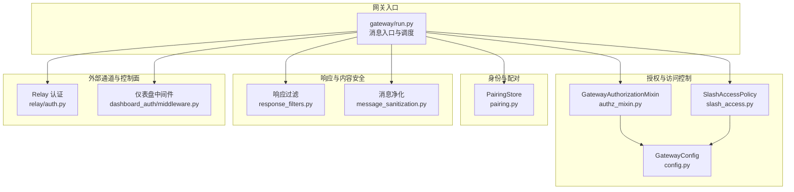
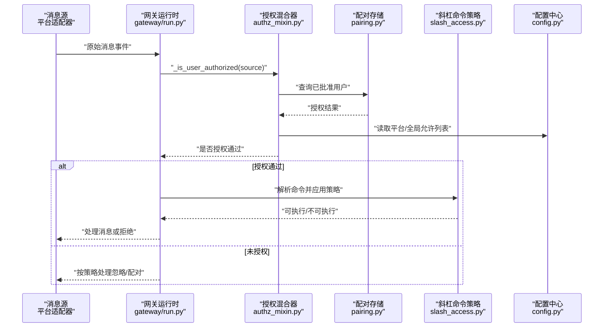
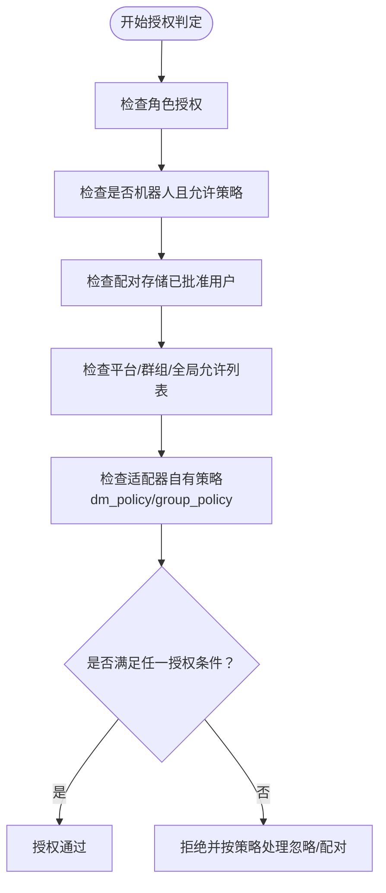
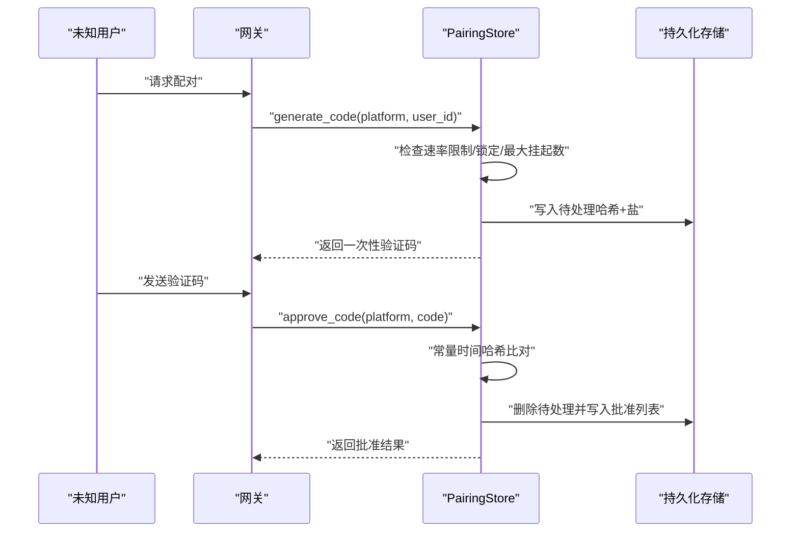
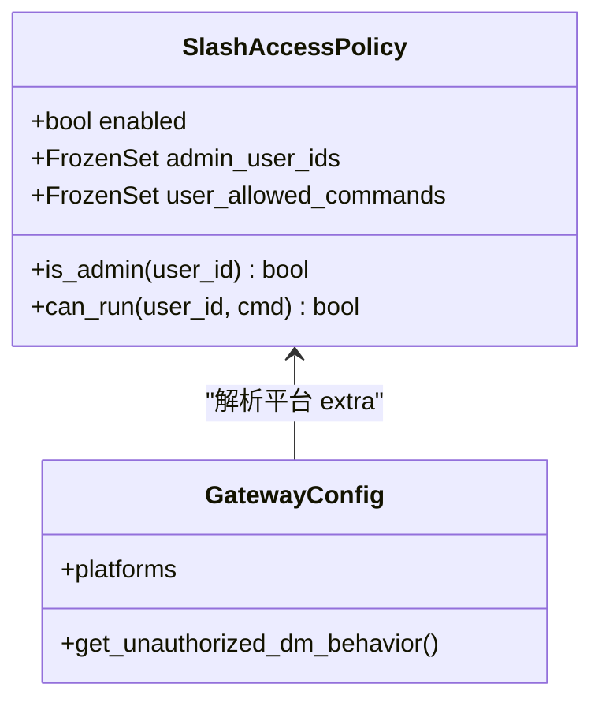
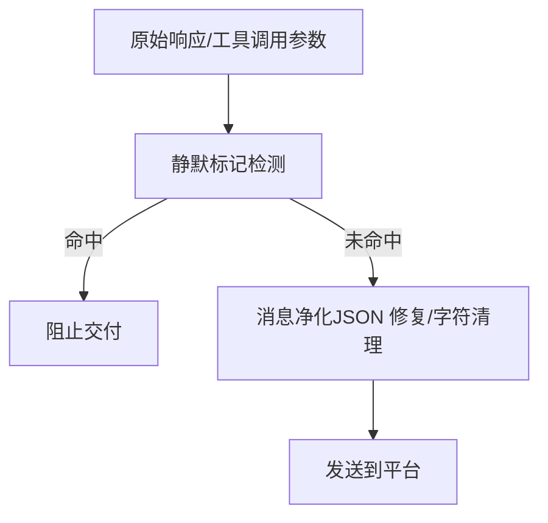
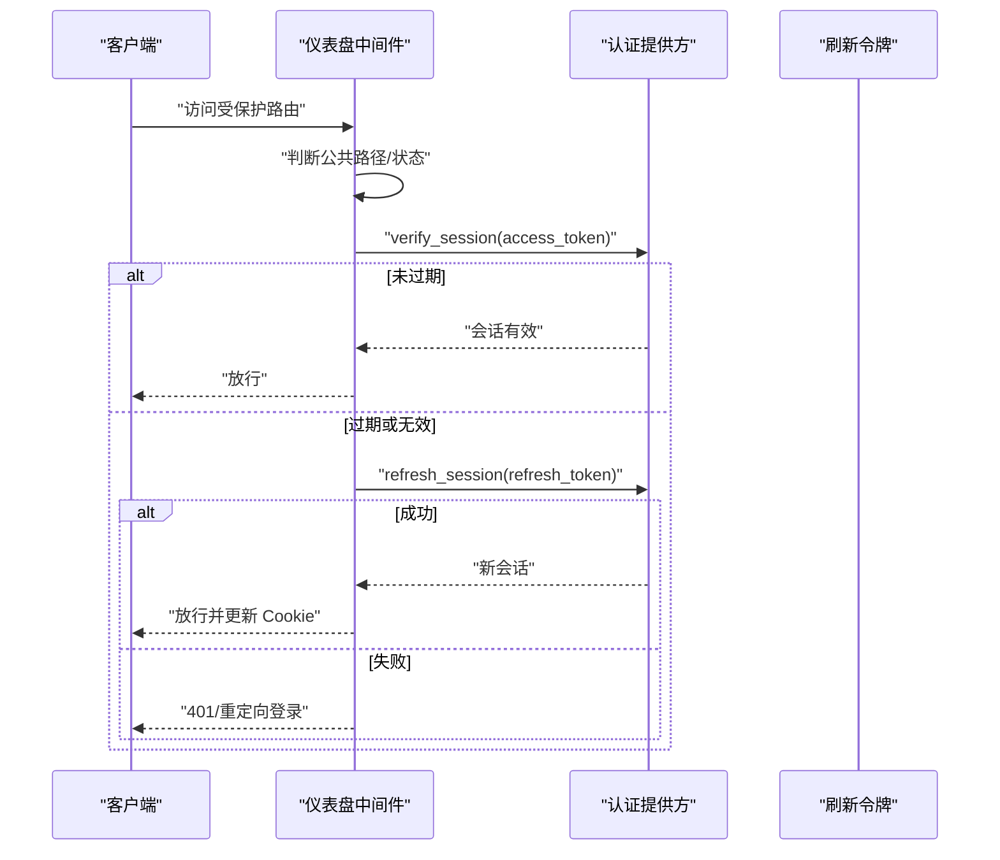
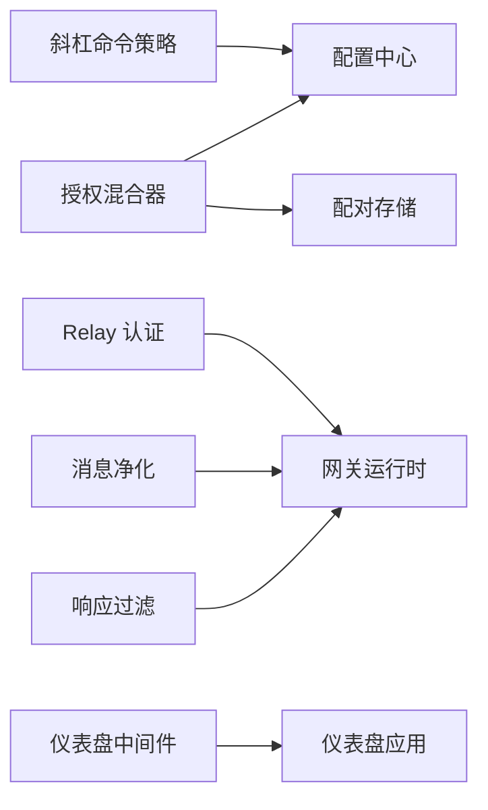

# 网关安全控制

<cite>
**本文档引用的文件**
- [gateway/pairing.py](file://gateway/pairing.py)
- [gateway/authz_mixin.py](file://gateway/authz_mixin.py)
- [gateway/slash_access.py](file://gateway/slash_access.py)
- [gateway/response_filters.py](file://gateway/response_filters.py)
- [gateway/session.py](file://gateway/session.py)
- [gateway/config.py](file://gateway/config.py)
- [gateway/relay/auth.py](file://gateway/relay/auth.py)
- [hermes_cli/dashboard_auth/middleware.py](file://hermes_cli/dashboard_auth/middleware.py)
- [agent/message_sanitization.py](file://agent/message_sanitization.py)
- [SECURITY.md](file://SECURITY.md)
</cite>

## 目录
1. [引言](#引言)
2. [项目结构](#项目结构)
3. [核心组件](#核心组件)
4. [架构总览](#架构总览)
5. [详细组件分析](#详细组件分析)
6. [依赖关系分析](#依赖关系分析)
7. [性能考虑](#性能考虑)
8. [故障排除指南](#故障排除指南)
9. [结论](#结论)
10. [附录](#附录)

## 引言
本文件系统性阐述 Hermes Agent 网关的安全控制体系，重点覆盖以下方面：
- 网关安全架构与访问控制机制（授权混合器）
- 用户配对与身份认证流程（可信用户-网关关系建立）
- 斜杠命令访问控制与权限管理（命令白名单、角色管理、动态授权）
- 消息过滤与内容安全检查（恶意内容检测与敏感信息过滤）
- 会话劫持防护与 CSRF 攻击防范策略
- 安全配置最佳实践与威胁模型分析

## 项目结构
网关安全相关代码主要分布在 gateway 子系统及关联模块中，采用“分层授权 + 平台适配 + 边界保护”的设计思路：
- 授权与访问控制：authz_mixin、slash_access、config
- 身份与配对：pairing
- 响应过滤与内容安全：response_filters、message_sanitization
- 外部通道安全：relay/auth（实验性）
- 控制面安全（仪表盘）：hermes_cli/dashboard_auth/middleware
- 安全策略与威胁模型：SECURITY.md

图表来源
- [gateway/authz_mixin.py](file://gateway/authz_mixin.py)
- [gateway/slash_access.py](file://gateway/slash_access.py)
- [gateway/config.py](file://gateway/config.py)
- [gateway/pairing.py](file://gateway/pairing.py)
- [gateway/response_filters.py](file://gateway/response_filters.py)
- [agent/message_sanitization.py](file://agent/message_sanitization.py)
- [gateway/relay/auth.py](file://gateway/relay/auth.py)
- [hermes_cli/dashboard_auth/middleware.py](file://hermes_cli/dashboard_auth/middleware.py)

章节来源
- [gateway/authz_mixin.py](file://gateway/authz_mixin.py)
- [gateway/slash_access.py](file://gateway/slash_access.py)
- [gateway/config.py](file://gateway/config.py)
- [gateway/pairing.py](file://gateway/pairing.py)
- [gateway/response_filters.py](file://gateway/response_filters.py)
- [agent/message_sanitization.py](file://agent/message_sanitization.py)
- [gateway/relay/auth.py](file://gateway/relay/auth.py)
- [hermes_cli/dashboard_auth/middleware.py](file://hermes_cli/dashboard_auth/middleware.py)

## 核心组件
- 授权混合器（GatewayAuthorizationMixin）：统一处理平台适配器的接入策略、用户授权判定、未授权 DM 行为等。
- 斜杠命令访问控制（SlashAccessPolicy）：在平台维度上对命令执行进行细粒度授权，支持管理员列表与用户命令白名单。
- 配对存储（PairingStore）：基于一次性验证码的用户批准流程，包含速率限制、锁定策略与持久化安全写入。
- 响应过滤（Response Filters）：识别并抑制“静默回复”标记，避免无意义输出泛滥。
- 消息净化（Message Sanitization）：修复工具调用参数 JSON、去除代理字符、剥离非 ASCII 字符等，提升传输稳定性与安全性。
- Relay 认证（实验性）：WebSocket 升级令牌与入站投递签名，支持多密钥轮换与重放窗口校验。
- 仪表盘中间件：基于会话 Cookie 的认证门禁，支持透明刷新与开放重定向防护。

章节来源
- [gateway/authz_mixin.py](file://gateway/authz_mixin.py)
- [gateway/slash_access.py](file://gateway/slash_access.py)
- [gateway/pairing.py](file://gateway/pairing.py)
- [gateway/response_filters.py](file://gateway/response_filters.py)
- [agent/message_sanitization.py](file://agent/message_sanitization.py)
- [gateway/relay/auth.py](file://gateway/relay/auth.py)
- [hermes_cli/dashboard_auth/middleware.py](file://hermes_cli/dashboard_auth/middleware.py)

## 架构总览
下图展示从消息进入网关到最终授权与命令执行的关键路径，以及各安全组件的协作关系：

图表来源
- [gateway/authz_mixin.py](file://gateway/authz_mixin.py)
- [gateway/pairing.py](file://gateway/pairing.py)
- [gateway/slash_access.py](file://gateway/slash_access.py)
- [gateway/config.py](file://gateway/config.py)

## 详细组件分析

### 授权混合器（GatewayAuthorizationMixin）
- 设计要点
  - 统一入口：所有平台适配器在进入业务逻辑前均需通过该混合器的授权判定。
  - 多层授权：平台允许列表、群组聊天白名单、全局允许列表、配对存储、角色授权、适配器自有策略等。
  - 默认拒绝：当未配置任何允许列表时，默认拒绝，避免“开窗”风险。
  - 信任边界：仅在适配器明确采用“allowlist”策略时才信任其“到达网关即授权”的信号。
- 关键流程
  - 优先检查平台允许标志、环境变量允许列表、群组聊天 ID 允许列表。
  - 若未显式配置允许列表，则根据适配器的 dm_policy/group_policy 判断是否信任其准入决策。
  - 最终回退至配对存储与全局允许列表。
  - 未授权 DM 的默认行为由配置决定，可选择“配对”或“忽略”。

图表来源
- [gateway/authz_mixin.py](file://gateway/authz_mixin.py)

章节来源
- [gateway/authz_mixin.py](file://gateway/authz_mixin.py)

### 用户配对与身份认证（PairingStore）
- 安全目标
  - 以一次性验证码替代静态用户 ID 允许列表，降低泄露风险。
  - 严格的速率限制、锁定策略与过期控制，抵御暴力破解。
  - 文件权限与原子写入，防止部分写入与日志泄露。
- 核心机制
  - 生成：随机 8 字符代码（排除易混淆字符），SHA-256 加盐哈希存储，带过期时间。
  - 批准：常量时间比较匹配哈希，成功后加入批准列表并清理待处理项。
  - 速率限制：按用户别名维度记录请求时间，10 分钟内最多一次。
  - 锁定：连续失败达到阈值后进入锁定期，期间拒绝所有批准请求。
  - 存储：使用临时文件 + 原子替换写入，chmod 0600 严格限制权限。

图表来源
- [gateway/pairing.py](file://gateway/pairing.py)

章节来源
- [gateway/pairing.py](file://gateway/pairing.py)

### 斜杠命令访问控制（SlashAccessPolicy）
- 设计原则
  - 双轴控制：平台 + 作用域（DM vs 群组）。
  - 向后兼容：未设置管理员列表时，关闭强制授权，保持原有行为。
  - 最小权限：非管理员仅能执行白名单中的命令；内置只读命令始终开放。
- 策略解析
  - 管理员列表：allow_admin_from（DM）/ group_allow_admin_from（群组）。
  - 用户命令白名单：user_allowed_commands（DM 可继承群组配置）。
  - 作用域映射：根据 SessionSource.chat_type 决定 DM 或群组策略。
  - 命令规范化：自动去斜杠、小写化，确保匹配一致性。

图表来源
- [gateway/slash_access.py](file://gateway/slash_access.py)
- [gateway/config.py](file://gateway/config.py)

章节来源
- [gateway/slash_access.py](file://gateway/slash_access.py)
- [gateway/config.py](file://gateway/config.py)

### 响应过滤与内容安全（Response Filters + Message Sanitization）
- 响应过滤
  - 识别“静默回复”标记（如 NO_REPLY），在成功对话回合中抑制交付，避免噪声。
- 消息净化
  - 修复工具调用参数 JSON（尾随逗号、None、控制字符等），保证上游 API 可接受。
  - 去除代理字符与非 ASCII 字符，提升跨编码环境的稳定性。
  - 在服务端不支持图像时移除图像内容，维持消息配对不变量。

图表来源
- [gateway/response_filters.py](file://gateway/response_filters.py)
- [agent/message_sanitization.py](file://agent/message_sanitization.py)

章节来源
- [gateway/response_filters.py](file://gateway/response_filters.py)
- [agent/message_sanitization.py](file://agent/message_sanitization.py)

### 外部通道与控制面安全（Relay 认证 + 仪表盘中间件）
- Relay 认证（实验性）
  - WebSocket 升级令牌：基于 HMAC-SHA256 的 bearer token，携带网关 ID 与过期时间。
  - 入站投递签名：对请求体与时间戳进行 HMAC 校验，支持多密钥轮换与重放窗口。
- 仪表盘中间件
  - 公共路径豁免：登录页、OAuth 回调、静态资源等。
  - 会话验证：尝试多个提供方的会话验证，支持透明刷新。
  - 开放重定向防护：仅允许同源相对路径作为 next 参数，避免协议相对 URL 注入。

图表来源
- [hermes_cli/dashboard_auth/middleware.py](file://hermes_cli/dashboard_auth/middleware.py)

章节来源
- [gateway/relay/auth.py](file://gateway/relay/auth.py)
- [hermes_cli/dashboard_auth/middleware.py](file://hermes_cli/dashboard_auth/middleware.py)

## 依赖关系分析
- 组件耦合
  - 授权混合器依赖配置中心与配对存储，形成“策略 + 身份”的双因子授权。
  - 斜杠命令策略依赖平台配置的 extra 字段，实现平台维度的细粒度控制。
  - 响应过滤与消息净化在网关输出链路中处于“边界保护”位置，降低上游异常影响。
- 外部依赖
  - Relay 认证依赖固定头部约定与时间戳校验，确保端到端完整性。
  - 仪表盘中间件依赖多提供方框架，支持透明刷新与错误传播。

图表来源
- [gateway/authz_mixin.py](file://gateway/authz_mixin.py)
- [gateway/slash_access.py](file://gateway/slash_access.py)
- [gateway/config.py](file://gateway/config.py)
- [gateway/pairing.py](file://gateway/pairing.py)
- [gateway/response_filters.py](file://gateway/response_filters.py)
- [agent/message_sanitization.py](file://agent/message_sanitization.py)
- [gateway/relay/auth.py](file://gateway/relay/auth.py)
- [hermes_cli/dashboard_auth/middleware.py](file://hermes_cli/dashboard_auth/middleware.py)

章节来源
- [gateway/authz_mixin.py](file://gateway/authz_mixin.py)
- [gateway/slash_access.py](file://gateway/slash_access.py)
- [gateway/config.py](file://gateway/config.py)
- [gateway/pairing.py](file://gateway/pairing.py)
- [gateway/response_filters.py](file://gateway/response_filters.py)
- [agent/message_sanitization.py](file://agent/message_sanitization.py)
- [gateway/relay/auth.py](file://gateway/relay/auth.py)
- [hermes_cli/dashboard_auth/middleware.py](file://hermes_cli/dashboard_auth/middleware.py)

## 性能考虑
- 授权判定
  - 使用冻结集合与常量时间比较，降低查找与比较成本。
  - 速率限制与锁定策略通过内存缓存与原子写入减少磁盘争用。
- 消息净化
  - 采用就地修复与惰性扫描，避免不必要的复制与遍历。
  - 对于大规模消息列表，建议在上游阶段进行必要的裁剪与压缩。
- Relay 认证
  - HMAC 校验与时间戳比较均为轻量操作，适合高频请求场景。
  - 多密钥轮换通过顺序验证，避免单点失败带来的性能抖动。

## 故障排除指南
- 授权被拒
  - 检查平台允许列表与全局允许列表是否正确配置。
  - 确认适配器 dm_policy/group_policy 是否为 allowlist，否则需要显式配置允许列表。
  - 若启用配对模式，请确认用户已在配对存储中被批准。
- 斜杠命令不可执行
  - 确认管理员列表是否已配置，未配置则强制授权关闭。
  - 检查命令是否在 user_allowed_commands 中，或是否属于内置只读命令。
- 验证码无法批准
  - 检查是否触发速率限制或锁定策略。
  - 确认验证码大小写与过期时间。
- 仪表盘登录失败
  - 检查会话 Cookie 是否存在与有效。
  - 若刷新失败，确认刷新令牌状态与提供方可达性。
- 响应未送达或异常
  - 检查是否命中静默标记。
  - 查看工具调用参数是否被净化修复。

章节来源
- [gateway/authz_mixin.py](file://gateway/authz_mixin.py)
- [gateway/slash_access.py](file://gateway/slash_access.py)
- [gateway/pairing.py](file://gateway/pairing.py)
- [hermes_cli/dashboard_auth/middleware.py](file://hermes_cli/dashboard_auth/middleware.py)
- [gateway/response_filters.py](file://gateway/response_filters.py)
- [agent/message_sanitization.py](file://agent/message_sanitization.py)

## 结论
本安全体系以“最小授权 + 边界保护 + 多层验证”为核心思想，通过授权混合器、配对存储、斜杠命令策略与响应净化等组件协同工作，构建了面向多平台的消息网关安全防线。结合威胁模型与部署硬化的最佳实践，可在不同信任边界下提供稳健的访问控制与内容安全保障。

## 附录

### 安全配置最佳实践
- 明确授权边界
  - 对每个网络暴露的适配器配置允许列表，避免默认开放。
  - 在本地 IPC 与编辑器集成场景中，依赖操作系统级访问控制。
- 密钥与凭证
  - 将凭据置于受限权限的配置文件中，避免明文存储。
  - 在容器或沙箱环境中使用凭据注入而非落盘。
- 日志与审计
  - 严格控制敏感信息输出，避免凭据与令牌泄露。
  - 启用审计日志，记录会话验证与刷新事件。
- 传输安全
  - 对外暴露的服务必须启用 TLS，并限制弱密码套件。
  - Relay 通道使用强认证与签名，开启重放窗口校验。

章节来源
- [SECURITY.md](file://SECURITY.md)
- [gateway/relay/auth.py](file://gateway/relay/auth.py)
- [hermes_cli/dashboard_auth/middleware.py](file://hermes_cli/dashboard_auth/middleware.py)