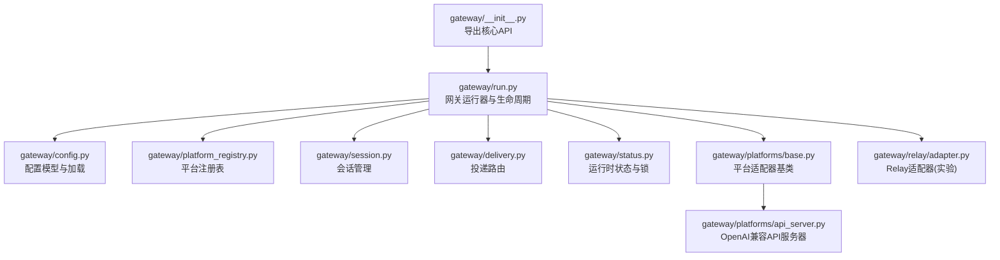
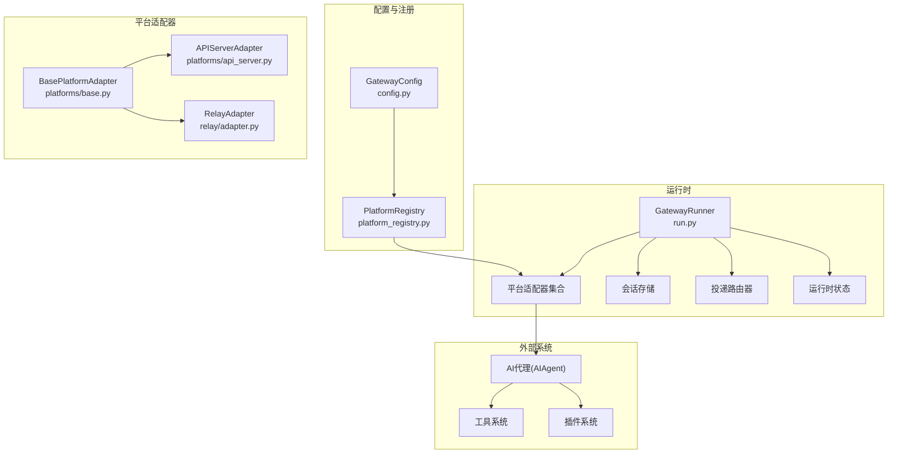
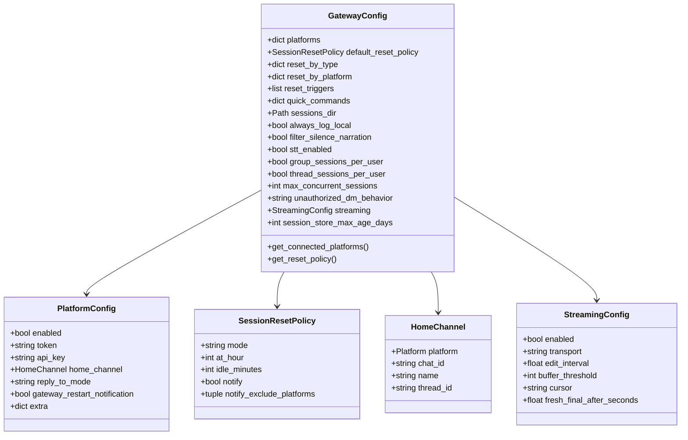
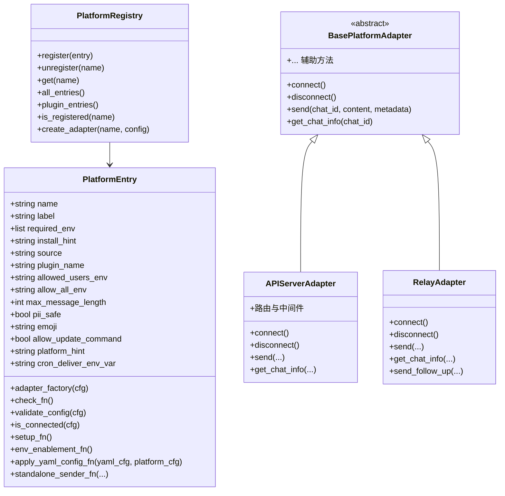
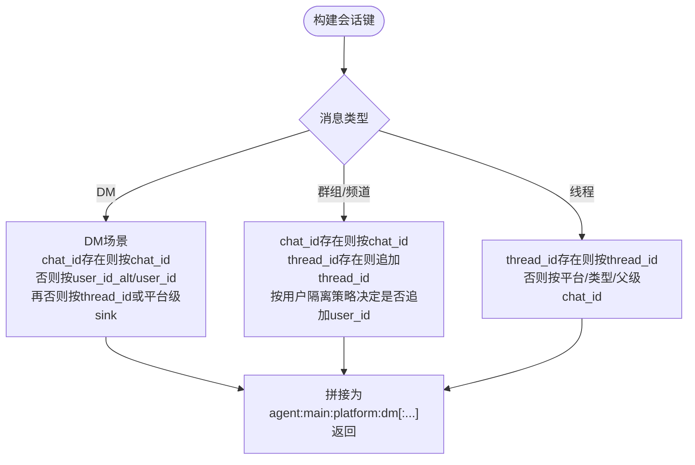
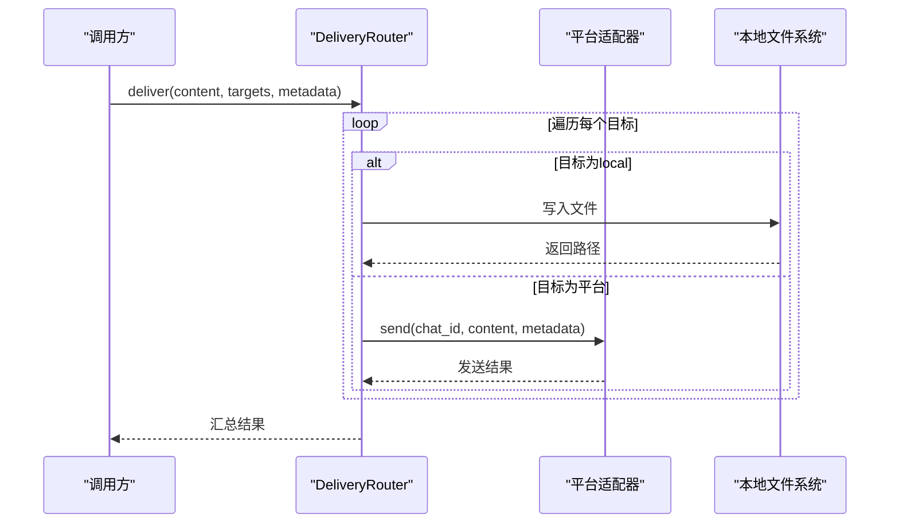
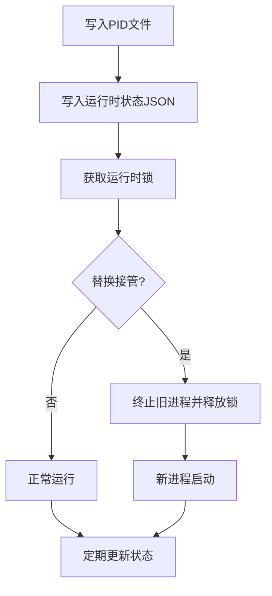
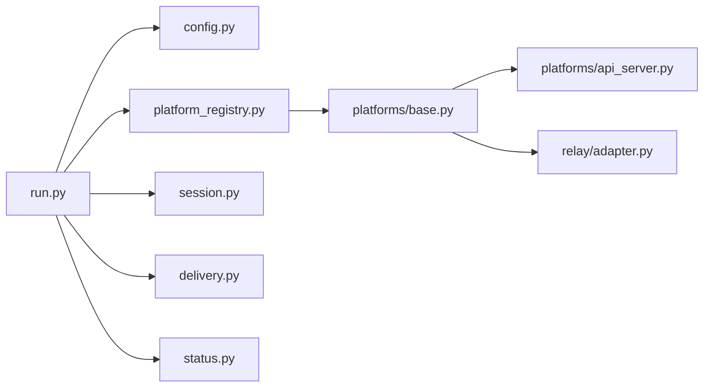

# 网关架构设计

<cite>
**本文档引用的文件**
- [gateway/__init__.py](file://gateway/__init__.py)
- [gateway/run.py](file://gateway/run.py)
- [gateway/config.py](file://gateway/config.py)
- [gateway/platform_registry.py](file://gateway/platform_registry.py)
- [gateway/session.py](file://gateway/session.py)
- [gateway/delivery.py](file://gateway/delivery.py)
- [gateway/status.py](file://gateway/status.py)
- [gateway/platforms/base.py](file://gateway/platforms/base.py)
- [gateway/platforms/api_server.py](file://gateway/platforms/api_server.py)
- [gateway/relay/adapter.py](file://gateway/relay/adapter.py)
</cite>

## 目录
1. [引言](#引言)
2. [项目结构](#项目结构)
3. [核心组件](#核心组件)
4. [架构总览](#架构总览)
5. [详细组件分析](#详细组件分析)
6. [依赖关系分析](#依赖关系分析)
7. [性能考虑](#性能考虑)
8. [故障排查指南](#故障排查指南)
9. [结论](#结论)
10. [附录](#附录)

## 引言
本技术文档面向Hermes消息网关的整体架构与实现，重点阐述其模块化设计原则、组件间依赖关系与数据流，以及配置管理、运行时状态管理与系统监控机制。同时覆盖启动流程、初始化过程与生命周期管理，并说明与AI代理、工具系统、插件系统的集成方式，扩展性与插件化架构（含平台适配器动态加载机制），以及部署拓扑与高可用性、容错机制。

## 项目结构
Hermes网关采用分层与模块化组织：顶层入口与运行时控制位于gateway包；平台适配器按平台拆分；会话与投递路由分别封装在独立模块中；状态管理与锁机制用于守护进程与运行时健康检查；Relay适配器支持实验性的连接器前端模式。



**图表来源**
- [gateway/__init__.py:1-36](file://gateway/__init__.py#L1-L36)
- [gateway/run.py:1-120](file://gateway/run.py#L1-L120)
- [gateway/config.py:1-120](file://gateway/config.py#L1-L120)
- [gateway/platform_registry.py:1-60](file://gateway/platform_registry.py#L1-L60)
- [gateway/session.py:1-120](file://gateway/session.py#L1-L120)
- [gateway/delivery.py:1-80](file://gateway/delivery.py#L1-L80)
- [gateway/status.py:1-80](file://gateway/status.py#L1-L80)
- [gateway/platforms/base.py:1-120](file://gateway/platforms/base.py#L1-L120)
- [gateway/platforms/api_server.py:1-80](file://gateway/platforms/api_server.py#L1-L80)
- [gateway/relay/adapter.py:1-60](file://gateway/relay/adapter.py#L1-L60)

**章节来源**
- [gateway/__init__.py:1-36](file://gateway/__init__.py#L1-L36)
- [gateway/run.py:1-120](file://gateway/run.py#L1-L120)

## 核心组件
- 配置管理：GatewayConfig、PlatformConfig、HomeChannel、SessionResetPolicy、StreamingConfig等，统一承载平台连接、会话策略、投递偏好与流式传输参数。
- 平台注册与适配：PlatformRegistry集中注册与发现平台适配器；BasePlatformAdapter定义统一接口；内置多平台适配器（Telegram、Discord、WhatsApp等）及API Server适配器。
- 会话管理：SessionStore持久化会话元数据与对话历史；SessionContext动态注入上下文信息；会话键构建规则确保多用户、多线程隔离。
- 投递路由：DeliveryRouter解析目标（origin/local/平台:聊天ID），执行本地落盘或平台发送；内置静默叙述过滤与超长输出截断保护。
- 运行时状态：PID文件、运行时状态JSON、跨进程锁与作用域锁，保障单实例守护、替换接管与并发安全。
- 启动与生命周期：run.py负责事件循环、异常处理、环境准备与平台适配器启动/停止。

**章节来源**
- [gateway/config.py:506-762](file://gateway/config.py#L506-L762)
- [gateway/platform_registry.py:162-261](file://gateway/platform_registry.py#L162-L261)
- [gateway/session.py:702-800](file://gateway/session.py#L702-L800)
- [gateway/delivery.py:175-236](file://gateway/delivery.py#L175-L236)
- [gateway/status.py:483-551](file://gateway/status.py#L483-L551)
- [gateway/run.py:16-120](file://gateway/run.py#L16-L120)

## 架构总览
Hermes网关通过统一运行器启动各平台适配器，适配器负责接收与发送消息；会话管理器维护对话上下文；投递路由根据目标选择本地或平台发送；配置中心提供统一的配置加载与校验；状态管理模块提供守护与健康检查能力。



**图表来源**
- [gateway/run.py:16-120](file://gateway/run.py#L16-L120)
- [gateway/config.py:506-762](file://gateway/config.py#L506-L762)
- [gateway/platform_registry.py:162-261](file://gateway/platform_registry.py#L162-L261)
- [gateway/platforms/base.py:483-520](file://gateway/platforms/base.py#L483-L520)
- [gateway/platforms/api_server.py:734-800](file://gateway/platforms/api_server.py#L734-L800)
- [gateway/relay/adapter.py:44-120](file://gateway/relay/adapter.py#L44-L120)

## 详细组件分析

### 配置管理组件
- GatewayConfig：聚合所有平台配置、会话重置策略、快速命令、存储路径、投递设置、流式传输与会话存储老化策略。
- PlatformConfig：单个平台的启用状态、令牌、额外参数、回复模式、重启通知开关等。
- HomeChannel：默认投递渠道，包含平台、聊天ID、名称与可选线程ID。
- SessionResetPolicy：按日/空闲/两者/不自动重置策略，支持通知与排除平台。
- StreamingConfig：全局流式传输策略（自动/草稿/编辑/关闭）、编辑间隔、缓冲阈值、光标与新鲜最终消息策略。



**图表来源**
- [gateway/config.py:506-762](file://gateway/config.py#L506-L762)
- [gateway/config.py:240-380](file://gateway/config.py#L240-L380)
- [gateway/config.py:275-316](file://gateway/config.py#L275-L316)
- [gateway/config.py:392-453](file://gateway/config.py#L392-L453)

**章节来源**
- [gateway/config.py:506-762](file://gateway/config.py#L506-L762)
- [gateway/config.py:240-380](file://gateway/config.py#L240-L380)
- [gateway/config.py:275-316](file://gateway/config.py#L275-L316)
- [gateway/config.py:392-453](file://gateway/config.py#L392-L453)

### 平台注册与适配器
- PlatformRegistry：集中注册平台条目（名称、标签、工厂、依赖检查、配置校验、连接性判断、安装提示、环境变量、显示属性、平台提示、YAML→环境桥接、独立发送钩子等），支持插件覆盖内置适配器。
- BasePlatformAdapter：定义统一接口（connect/disconnect/send/get_chat_info等），提供代理/网络代理解析、媒体缓存、长度计算、SSRF防护等通用能力。
- APIServerAdapter：基于aiohttp提供OpenAI兼容端点（聊天补全、响应API、会话管理、运行管理、健康检查等），内置CORS、安全头、请求体大小限制、幂等缓存与运行流。
- RelayAdapter：实验性通用适配器，由连接器协商能力描述，动态暴露最大消息长度、是否支持草稿流式等能力，支持入站接收与中断转发。



**图表来源**
- [gateway/platform_registry.py:162-261](file://gateway/platform_registry.py#L162-L261)
- [gateway/platforms/base.py:483-520](file://gateway/platforms/base.py#L483-L520)
- [gateway/platforms/api_server.py:734-800](file://gateway/platforms/api_server.py#L734-L800)
- [gateway/relay/adapter.py:44-120](file://gateway/relay/adapter.py#L44-L120)

**章节来源**
- [gateway/platform_registry.py:162-261](file://gateway/platform_registry.py#L162-L261)
- [gateway/platforms/base.py:483-520](file://gateway/platforms/base.py#L483-L520)
- [gateway/platforms/api_server.py:734-800](file://gateway/platforms/api_server.py#L734-L800)
- [gateway/relay/adapter.py:44-120](file://gateway/relay/adapter.py#L44-L120)

### 会话管理组件
- SessionSource：描述消息来源（平台、聊天ID、类型、用户ID、线程ID、群组ID等），用于路由与动态系统提示注入。
- SessionContext：会话上下文，包含来源、已连接平台、HomeChannel映射、共享会话标记与元数据。
- SessionStore：会话索引与历史存储（SQLite优先，回退JSONL），支持会话键生成、过期检测、令牌统计与恢复标记。
- 会话键规则：区分DM、群组/频道、线程场景，支持按用户ID隔离或共享，避免跨用户历史泄露。



**图表来源**
- [gateway/session.py:618-700](file://gateway/session.py#L618-L700)

**章节来源**
- [gateway/session.py:70-157](file://gateway/session.py#L70-L157)
- [gateway/session.py:160-440](file://gateway/session.py#L160-L440)
- [gateway/session.py:702-800](file://gateway/session.py#L702-L800)
- [gateway/session.py:618-700](file://gateway/session.py#L618-L700)

### 投递路由组件
- DeliveryTarget：解析目标字符串（origin/local/平台:chat_id[:thread_id]），生成目标对象。
- DeliveryRouter：根据目标调用对应适配器发送；对本地输出保存到文件；对平台输出进行静默叙述过滤与超长内容截断；支持Telegram私聊话题创建与回复锚定。
- 静默叙述过滤：识别仅包含“静默叙述”的内容，避免在机器人通道内镜像导致崩溃。
- 超长输出保护：超过阈值时保存完整输出并截断可见部分，保留指向完整文件的链接。



**图表来源**
- [gateway/delivery.py:175-236](file://gateway/delivery.py#L175-L236)
- [gateway/delivery.py:304-430](file://gateway/delivery.py#L304-L430)

**章节来源**
- [gateway/delivery.py:89-174](file://gateway/delivery.py#L89-L174)
- [gateway/delivery.py:175-236](file://gateway/delivery.py#L175-L236)
- [gateway/delivery.py:304-430](file://gateway/delivery.py#L304-L430)

### 运行时状态与守护
- PID文件：记录当前进程PID、启动时间与命令行参数，支持跨进程替换接管。
- 运行时状态JSON：持久化网关状态、退出原因、重启请求、活跃代理数、平台状态与错误信息。
- 跨进程锁与作用域锁：防止多实例竞争同一外部身份（如Bot Token），支持清理过期锁。
- 健康检查：通过进程存在性、命令行匹配与启动时间一致性验证网关存活。



**图表来源**
- [gateway/status.py:483-551](file://gateway/status.py#L483-L551)
- [gateway/status.py:508-551](file://gateway/status.py#L508-L551)
- [gateway/status.py:617-733](file://gateway/status.py#L617-L733)

**章节来源**
- [gateway/status.py:483-551](file://gateway/status.py#L483-L551)
- [gateway/status.py:508-551](file://gateway/status.py#L508-L551)
- [gateway/status.py:617-733](file://gateway/status.py#L617-L733)

### 启动流程与生命周期
- 入口与引导：run.py作为入口，确保Windows UTF-8标准输入、虚拟环境路径修复、平台导入顺序与异常处理。
- 事件循环与异常安全：安装loop级异常处理器，捕获瞬时网络错误，避免Telegram等瞬时超时导致进程崩溃。
- 平台适配器启动：依据配置加载平台，通过注册表或内置分支创建适配器实例，建立连接。
- 生命周期管理：支持优雅停机、重启请求标记、运行时状态更新与锁释放。

```mermaid
sequenceDiagram
participant Boot as "启动脚本"
participant Runner as "GatewayRunner"
participant Reg as "PlatformRegistry"
participant Plat as "平台适配器"
participant Loop as "事件循环"
Boot->>Runner : start_gateway()
Runner->>Runner : 安装异常处理器
Runner->>Reg : 解析配置并创建适配器
Reg-->>Runner : 返回适配器实例
Runner->>Plat : connect()
Plat-->>Runner : 连接成功
Runner->>Loop : 进入事件循环
Loop-->>Runner : 处理消息/定时任务
Runner->>Plat : disconnect() (停止)
```

**图表来源**
- [gateway/run.py:16-120](file://gateway/run.py#L16-L120)
- [gateway/platform_registry.py:208-257](file://gateway/platform_registry.py#L208-L257)

**章节来源**
- [gateway/run.py:16-120](file://gateway/run.py#L16-L120)
- [gateway/platform_registry.py:208-257](file://gateway/platform_registry.py#L208-L257)

## 依赖关系分析
- 组件耦合与内聚：配置模块与运行器强耦合，但通过PlatformRegistry解耦平台实现；会话与投递模块与平台适配器弱耦合，通过接口交互。
- 外部依赖：aiohttp（API Server）、SQLite（会话与响应存储）、psutil（进程检查）、代理库（代理支持）。
- 可能的循环依赖：未见直接循环导入；平台注册表在运行时才被使用，避免早期导入环。



**图表来源**
- [gateway/run.py:16-120](file://gateway/run.py#L16-L120)
- [gateway/config.py:506-762](file://gateway/config.py#L506-L762)
- [gateway/platform_registry.py:162-261](file://gateway/platform_registry.py#L162-L261)
- [gateway/session.py:702-800](file://gateway/session.py#L702-L800)
- [gateway/delivery.py:175-236](file://gateway/delivery.py#L175-L236)
- [gateway/status.py:483-551](file://gateway/status.py#L483-L551)
- [gateway/platforms/base.py:483-520](file://gateway/platforms/base.py#L483-L520)
- [gateway/platforms/api_server.py:734-800](file://gateway/platforms/api_server.py#L734-L800)
- [gateway/relay/adapter.py:44-120](file://gateway/relay/adapter.py#L44-L120)

**章节来源**
- [gateway/run.py:16-120](file://gateway/run.py#L16-L120)
- [gateway/platform_registry.py:162-261](file://gateway/platform_registry.py#L162-L261)

## 性能考虑
- 会话缓存上限与空闲TTL：限制AIAgent缓存大小与空闲淘汰，避免长期运行内存膨胀。
- 会话存储老化：按天裁剪会话索引，保持内存稳定增长。
- 流式传输优化：针对Telegram等平台的草稿流式传输与编辑节奏参数，平衡实时性与速率限制。
- 媒体缓存与重试：图片/音频下载带指数退避重试，降低CDN抖动影响。
- 请求体大小限制与幂等缓存：API Server端对请求体大小限制与幂等缓存，减少重复计算。

**章节来源**
- [gateway/run.py:60-120](file://gateway/run.py#L60-L120)
- [gateway/platforms/api_server.py:587-623](file://gateway/platforms/api_server.py#L587-L623)
- [gateway/platforms/base.py:622-793](file://gateway/platforms/base.py#L622-L793)

## 故障排查指南
- 瞬时网络错误：run.py中的loop级异常处理器会吞掉瞬时网络错误并记录警告，避免进程崩溃；若问题持续，检查平台连接与网络代理。
- 静默叙述过滤：DeliveryRouter在平台侧过滤仅包含静默叙述的内容，避免机器人通道内镜像；本地落盘不受此限制。
- 超长输出截断：当输出超过平台限制时，自动保存完整文本至文件并截断可见部分，便于定位问题。
- 运行时状态与锁：通过运行时状态JSON与锁文件定位冲突实例；必要时清理过期锁或强制终止旧进程。
- API Server安全头与CORS：确保正确配置CORS与安全头，避免跨域与安全策略导致的访问失败。

**章节来源**
- [gateway/run.py:242-275](file://gateway/run.py#L242-L275)
- [gateway/delivery.py:304-430](file://gateway/delivery.py#L304-L430)
- [gateway/status.py:617-733](file://gateway/status.py#L617-L733)
- [gateway/platforms/api_server.py:549-623](file://gateway/platforms/api_server.py#L549-L623)

## 结论
Hermes消息网关以模块化与插件化为核心设计思想，通过统一配置、平台注册表与适配器基类实现多平台无缝接入；会话与投递路由保证了上下文完整性与交付可靠性；运行时状态与锁机制提供了稳健的守护与并发控制；API Server与Relay适配器进一步拓展了集成边界。整体架构具备良好的扩展性、可观测性与容错能力，适合在复杂多平台环境中稳定运行。

## 附录
- 部署拓扑建议：生产环境建议使用容器编排与健康检查，结合运行时状态与锁机制实现多实例协调；Relay模式适用于需要连接器统一凭证与能力协商的场景。
- 高可用与容错：利用运行时状态JSON与锁文件实现替换接管与冲突检测；瞬时网络错误在事件循环层面被安全捕获；DeliveryRouter对静默叙述与超长输出进行主动保护。