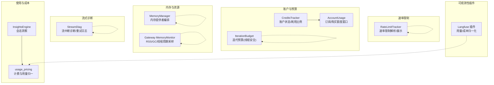
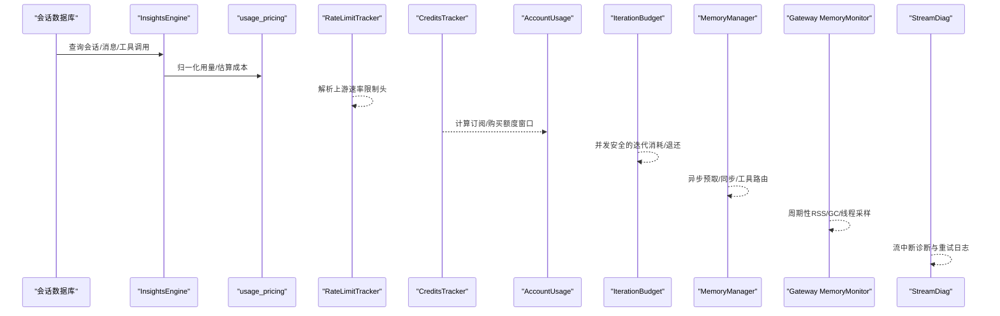
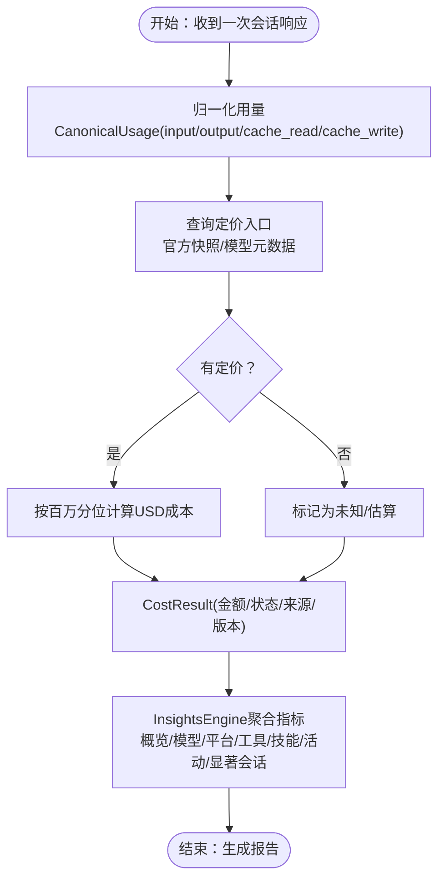
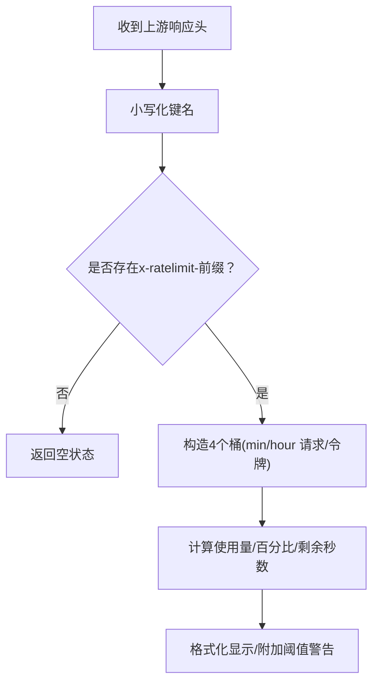
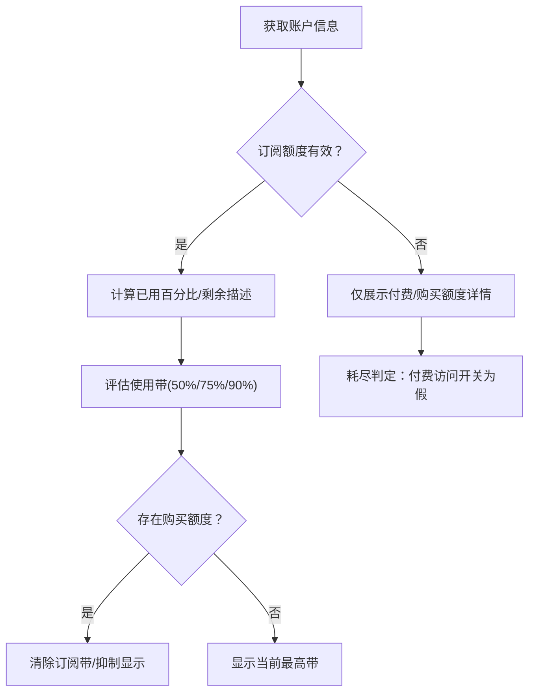
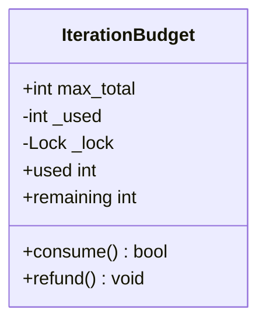
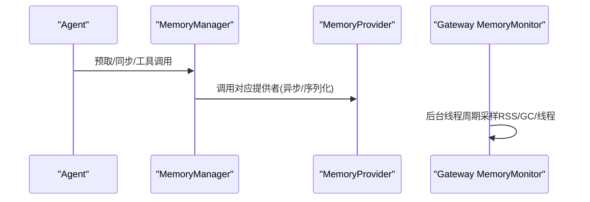
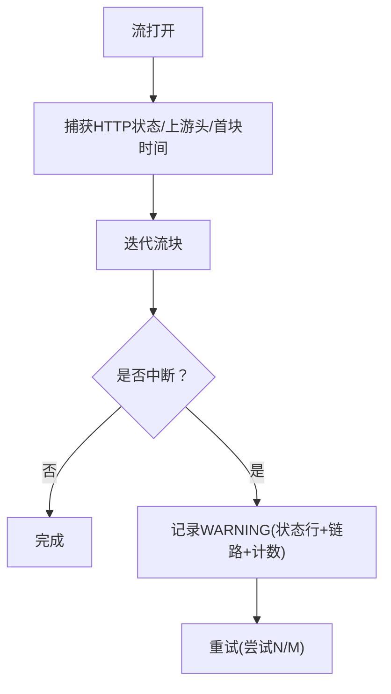
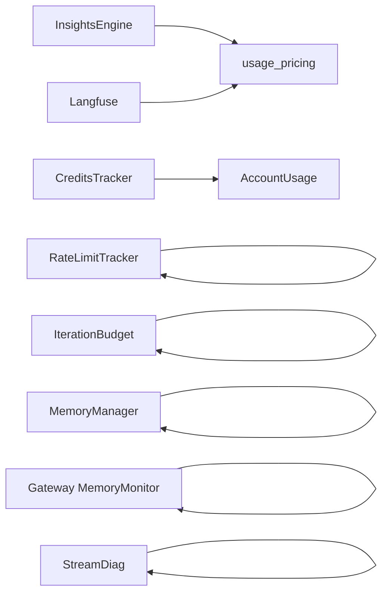

# 性能监控

<cite>
**本文引用的文件**
- [agent/insights.py](file://agent/insights.py)
- [agent/usage_pricing.py](file://agent/usage_pricing.py)
- [agent/rate_limit_tracker.py](file://agent/rate_limit_tracker.py)
- [agent/credits_tracker.py](file://agent/credits_tracker.py)
- [agent/account_usage.py](file://agent/account_usage.py)
- [agent/iteration_budget.py](file://agent/iteration_budget.py)
- [agent/stream_diag.py](file://agent/stream_diag.py)
- [gateway/memory_monitor.py](file://gateway/memory_monitor.py)
- [agent/memory_manager.py](file://agent/memory_manager.py)
- [tests/run_agent/test_iteration_budget_race.py](file://tests/run_agent/test_iteration_budget_race.py)
- [tests/agent/test_credits_policy.py](file://tests/agent/test_credits_policy.py)
- [tests/agent/test_insights.py](file://tests/agent/test_insights.py)
- [plugins/observability/langfuse/__init__.py](file://plugins/observability/langfuse/__init__.py)
</cite>

## 目录
1. [简介](#简介)
2. [项目结构](#项目结构)
3. [核心组件](#核心组件)
4. [架构总览](#架构总览)
5. [组件详解](#组件详解)
6. [依赖关系分析](#依赖关系分析)
7. [性能考量与优化建议](#性能考量与优化建议)
8. [故障排查指南](#故障排查指南)
9. [结论](#结论)
10. [附录](#附录)

## 简介
本文件面向运维与开发人员，系统化梳理 Hermes Agent 的性能监控体系，覆盖使用量统计、计费跟踪、速率限制监控、迭代预算管理、内存与资源使用监控、以及基于历史会话的性能分析与优化路径。文档以代码为依据，结合可视化图示与实操建议，帮助读者快速定位性能瓶颈并维持系统最佳运行状态。

## 项目结构
Hermes Agent 的性能监控由多模块协同实现：
- 使用量与成本：会话洞察引擎（历史聚合）、令牌与缓存统计、计费估算与来源标注
- 速率限制：从上游响应头解析并格式化展示
- 账户配额与耗用：订阅额度、购买额度、耗用比例与告警策略
- 运行预算：迭代次数预算的线程安全控制
- 内存与资源：网关进程内存周期性采样、内存提供者异步同步与上下文清洗
- 流式诊断：流中断时的诊断信息与重试日志

图表来源
- [agent/insights.py:84-164](file://agent/insights.py#L84-L164)
- [agent/usage_pricing.py:30-80](file://agent/usage_pricing.py#L30-L80)
- [agent/rate_limit_tracker.py:30-66](file://agent/rate_limit_tracker.py#L30-L66)
- [agent/credits_tracker.py:115-172](file://agent/credits_tracker.py#L115-L172)
- [agent/account_usage.py:149-322](file://agent/account_usage.py#L149-L322)
- [agent/iteration_budget.py:17-62](file://agent/iteration_budget.py#L17-L62)
- [agent/memory_manager.py:313-728](file://agent/memory_manager.py#L313-L728)
- [gateway/memory_monitor.py:1-231](file://gateway/memory_monitor.py#L1-L231)
- [agent/stream_diag.py:41-281](file://agent/stream_diag.py#L41-L281)
- [plugins/observability/langfuse/__init__.py:545-564](file://plugins/observability/langfuse/__init__.py#L545-L564)

章节来源
- [agent/insights.py:1-922](file://agent/insights.py#L1-L922)
- [agent/usage_pricing.py:1-909](file://agent/usage_pricing.py#L1-L909)
- [agent/rate_limit_tracker.py:1-247](file://agent/rate_limit_tracker.py#L1-L247)
- [agent/credits_tracker.py:115-172](file://agent/credits_tracker.py#L115-L172)
- [agent/account_usage.py:149-322](file://agent/account_usage.py#L149-L322)
- [agent/iteration_budget.py:17-62](file://agent/iteration_budget.py#L17-L62)
- [agent/memory_manager.py:313-728](file://agent/memory_manager.py#L313-L728)
- [gateway/memory_monitor.py:1-231](file://gateway/memory_monitor.py#L1-L231)
- [agent/stream_diag.py:1-281](file://agent/stream_diag.py#L1-L281)
- [plugins/observability/langfuse/__init__.py:545-564](file://plugins/observability/langfuse/__init__.py#L545-L564)

## 核心组件
- 会话洞察引擎（InsightsEngine）：从 SQLite 历史数据库聚合会话、消息、工具调用、技能使用、活动模式等，输出概览、模型/平台/工具/技能分解、活动热力与显著会话等报告，支持终端与网关两种格式化输出。
- 计费与用量归一（usage_pricing）：统一不同供应商/接口的用量字段，计算输入/输出/缓存读写令牌与推理令牌，按官方定价或模型元数据估算成本，标注来源与状态。
- 速率限制跟踪（RateLimitTracker）：解析 x-ratelimit-* 头，构建分钟/小时维度的请求数与令牌桶，格式化人类可读的使用率、剩余量与重置倒计时，并给出阈值预警。
- 账户与额度（CreditsTracker/AccountUsage）：根据订阅限额与剩余、购买额度与剩余，计算已用比例、生成订阅/购买额度窗口与详情文本；支持“耗尽”判定与带宽告警策略。
- 迭代预算（IterationBudget）：线程安全的迭代计数器，支持消耗/退还，暴露 used/remaining 属性，保障并发场景下的一致性。
- 内存监控（MemoryManager + Gateway MemoryMonitor）：内存提供者编排与异步同步；网关后台线程周期性记录 RSS、GC 统计、线程数与运行时长，便于泄漏检测与趋势分析。
- 流式诊断（StreamDiag）：在流中断时记录首次块到达时间、字节/块数、HTTP 状态、上游头（如 CF-RAY、X-OpenRouter-*）、错误链路与耗时，用于定位上游波动与超时原因。
- 可观测性插件（Langfuse）：对用量与成本进行归一化处理，优先使用官方定价条目，回退到估算结果，确保跨供应商的成本一致性。

章节来源
- [agent/insights.py:84-164](file://agent/insights.py#L84-L164)
- [agent/usage_pricing.py:30-80](file://agent/usage_pricing.py#L30-L80)
- [agent/rate_limit_tracker.py:30-66](file://agent/rate_limit_tracker.py#L30-L66)
- [agent/credits_tracker.py:115-172](file://agent/credits_tracker.py#L115-L172)
- [agent/account_usage.py:149-322](file://agent/account_usage.py#L149-L322)
- [agent/iteration_budget.py:17-62](file://agent/iteration_budget.py#L17-L62)
- [agent/memory_manager.py:313-728](file://agent/memory_manager.py#L313-L728)
- [gateway/memory_monitor.py:1-231](file://gateway/memory_monitor.py#L1-L231)
- [agent/stream_diag.py:41-281](file://agent/stream_diag.py#L41-L281)
- [plugins/observability/langfuse/__init__.py:545-564](file://plugins/observability/langfuse/__init__.py#L545-L564)

## 架构总览
下图展示性能监控各子系统之间的交互与数据流向：

图表来源
- [agent/insights.py:102-164](file://agent/insights.py#L102-L164)
- [agent/usage_pricing.py:703-852](file://agent/usage_pricing.py#L703-L852)
- [agent/rate_limit_tracker.py:92-129](file://agent/rate_limit_tracker.py#L92-L129)
- [agent/credits_tracker.py:115-172](file://agent/credits_tracker.py#L115-L172)
- [agent/account_usage.py:149-322](file://agent/account_usage.py#L149-L322)
- [agent/iteration_budget.py:37-59](file://agent/iteration_budget.py#L37-L59)
- [agent/memory_manager.py:452-571](file://agent/memory_manager.py#L452-L571)
- [gateway/memory_monitor.py:129-193](file://gateway/memory_monitor.py#L129-L193)
- [agent/stream_diag.py:58-212](file://agent/stream_diag.py#L58-L212)

## 组件详解

### 使用量统计与成本估算
- 用量归一化：统一 Anthropic/OpenAI/Codex 等不同 API 的用量字段，分离缓存读写与推理令牌，形成 CanonicalUsage。
- 成本估算：优先使用官方定价快照或模型元数据，回退至未知状态；返回金额、状态（实际/估算/包含/未知）、来源与版本信息。
- 洞察报告：按模型/平台/工具/技能聚合会话指标，计算总/平均令牌数、消息数、会话时长、峰值时段与连续活跃天数等。

图表来源
- [agent/usage_pricing.py:703-852](file://agent/usage_pricing.py#L703-L852)
- [agent/insights.py:402-474](file://agent/insights.py#L402-L474)

章节来源
- [agent/usage_pricing.py:30-80](file://agent/usage_pricing.py#L30-L80)
- [agent/usage_pricing.py:703-852](file://agent/usage_pricing.py#L703-L852)
- [agent/insights.py:402-474](file://agent/insights.py#L402-L474)
- [agent/insights.py:857-921](file://agent/insights.py#L857-L921)
- [plugins/observability/langfuse/__init__.py:545-564](file://plugins/observability/langfuse/__init__.py#L545-L564)

### 速率限制监控
- 解析：从响应头提取每分钟/每小时请求数与令牌桶的上限、剩余与重置秒数，构造 RateLimitState。
- 展示：格式化人类可读的进度条、百分比、剩余与重置倒计时；当任一桶使用率≥80%时发出警告。
- 适用：适用于 Nous/OpenRouter/OpenAI 兼容 API 的速率限制头格式。

图表来源
- [agent/rate_limit_tracker.py:92-129](file://agent/rate_limit_tracker.py#L92-L129)
- [agent/rate_limit_tracker.py:182-223](file://agent/rate_limit_tracker.py#L182-L223)

章节来源
- [agent/rate_limit_tracker.py:1-247](file://agent/rate_limit_tracker.py#L1-L247)

### 账户使用与额度窗口
- 订阅额度窗口：当订阅月度额度与剩余均为有限数值且剩余不超过限额时，计算已用百分比与“剩余可用”描述。
- 购买额度抑制：当存在购买额度时，抑制订阅额度的使用带（避免错误地将“可继续消费”的状态误判为“接近上限”）。
- 耗尽判定：仅依据“付费访问开关”为假定为耗尽，不以余额为零作为唯一标准。
- 带宽告警：定义使用带（如50%/75%/90%），仅显示最高带，跨带替换，恢复时降级。

图表来源
- [agent/account_usage.py:149-200](file://agent/account_usage.py#L149-L200)
- [agent/account_usage.py:289-322](file://agent/account_usage.py#L289-L322)
- [agent/credits_tracker.py:115-172](file://agent/credits_tracker.py#L115-L172)
- [tests/agent/test_credits_policy.py:530-576](file://tests/agent/test_credits_policy.py#L530-L576)

章节来源
- [agent/account_usage.py:149-322](file://agent/account_usage.py#L149-L322)
- [agent/credits_tracker.py:115-172](file://agent/credits_tracker.py#L115-L172)
- [tests/agent/test_credits_policy.py:516-576](file://tests/agent/test_credits_policy.py#L516-L576)

### 迭代预算管理（线程安全）
- 并发安全：consume/refund/used/remaining 在锁内操作，避免竞态导致的计数异常。
- 行为验证：测试覆盖了并发读取 used、同时 consume/refund、耗尽返回 false、退款后允许再次 consume 等边界条件。

图表来源
- [agent/iteration_budget.py:17-62](file://agent/iteration_budget.py#L17-L62)

章节来源
- [agent/iteration_budget.py:17-62](file://agent/iteration_budget.py#L17-L62)
- [tests/run_agent/test_iteration_budget_race.py:10-106](file://tests/run_agent/test_iteration_budget_race.py#L10-L106)

### 内存与资源监控
- 内存提供者编排：统一内置与外部提供者，支持异步预取/同步，序列化写入，避免阻塞主流程；提供工具 Schema 注入与路由。
- 网关内存监控：后台线程周期性记录 RSS（若不可用则记录不可用）、GC 统计、线程数与运行时长；支持启动基线、关闭最终快照与优雅停止。

图表来源
- [agent/memory_manager.py:452-571](file://agent/memory_manager.py#L452-L571)
- [gateway/memory_monitor.py:129-193](file://gateway/memory_monitor.py#L129-L193)

章节来源
- [agent/memory_manager.py:313-728](file://agent/memory_manager.py#L313-L728)
- [gateway/memory_monitor.py:1-231](file://gateway/memory_monitor.py#L1-L231)

### 流式诊断与重试日志
- 诊断快照：在流打开时捕获 HTTP 状态、上游头（CF-RAY、X-OpenRouter-* 等）、首块到达时间、累计字节/块数。
- 错误链路：扁平化异常链，展示外层/内层错误类型与摘要，辅助定位底层连接/协议错误。
- 用户可见提示：简洁的状态行提示（含耗时），结构化 WARNING 日志保留完整诊断细节。

图表来源
- [agent/stream_diag.py:58-87](file://agent/stream_diag.py#L58-L87)
- [agent/stream_diag.py:120-212](file://agent/stream_diag.py#L120-L212)
- [agent/stream_diag.py:214-271](file://agent/stream_diag.py#L214-L271)

章节来源
- [agent/stream_diag.py:1-281](file://agent/stream_diag.py#L1-L281)

## 依赖关系分析
- 组件内聚与耦合
  - InsightsEngine 依赖 usage_pricing 提供的 CanonicalUsage 与 CostResult，形成“数据采集→归一化→估算→聚合”的清晰链路。
  - RateLimitTracker 与 StreamDiag 分别独立于上游响应头与流中断事件，耦合度低，便于扩展。
  - CreditsTracker 与 AccountUsage 通过共享“订阅/购买额度”与“耗用比例”形成策略闭环。
  - MemoryManager 与 Gateway MemoryMonitor 分别负责“功能编排”和“系统级采样”，职责清晰。
- 外部依赖
  - Langfuse 插件通过统一的用量/成本归一化接口，增强跨供应商成本一致性。
  - psutil/resource 用于内存采样（Windows/Linux/macOS），在缺失时降级记录不可用。

图表来源
- [agent/insights.py:25-30](file://agent/insights.py#L25-L30)
- [agent/usage_pricing.py:1-11](file://agent/usage_pricing.py#L1-L11)
- [plugins/observability/langfuse/__init__.py:545-564](file://plugins/observability/langfuse/__init__.py#L545-L564)

章节来源
- [agent/insights.py:1-922](file://agent/insights.py#L1-L922)
- [agent/usage_pricing.py:1-909](file://agent/usage_pricing.py#L1-L909)
- [plugins/observability/langfuse/__init__.py:545-564](file://plugins/observability/langfuse/__init__.py#L545-L564)

## 性能考量与优化建议
- 使用量与成本
  - 利用 InsightsEngine 的“模型/平台/工具/技能”分解，识别高消耗来源，优化模型选择与工具调用频率。
  - 结合 usage_pricing 的成本估算与来源标注，优先采用官方定价快照，减少估算误差。
- 速率限制
  - 当任一桶使用率接近阈值（≥80%）时，提前降低并发或增加退避，避免大规模限流触发。
  - 通过 RateLimitTracker 的“剩余重置倒计时”动态调整节奏，避免在重置前最后一波冲击。
- 额度与预算
  - 购买额度存在时，订阅额度带不应误导告警；关注“耗尽”判定与带宽切换逻辑，合理设置预算上限。
  - 迭代预算在并发场景下必须保证 used 的原子读取，避免竞态导致的“看似未耗尽却失败”的问题。
- 内存与资源
  - Gateway MemoryMonitor 的周期性 RSS/GC/线程采样可用于发现缓慢内存泄漏或线程泄漏；结合日志 grep 定位时间窗口。
  - MemoryManager 的异步同步与序列化写入可避免慢提供者阻塞主流程，但需关注队列积压与执行器生命周期。
- 流式稳定性
  - 通过 StreamDiag 的异常链与上游头信息，区分“连接失败”与“上游超时/空闲断开”，针对性优化重试策略与超时配置。

章节来源
- [agent/rate_limit_tracker.py:215-223](file://agent/rate_limit_tracker.py#L215-L223)
- [agent/iteration_budget.py:37-59](file://agent/iteration_budget.py#L37-L59)
- [gateway/memory_monitor.py:129-193](file://gateway/memory_monitor.py#L129-L193)
- [agent/memory_manager.py:575-642](file://agent/memory_manager.py#L575-L642)
- [agent/stream_diag.py:185-212](file://agent/stream_diag.py#L185-L212)

## 故障排查指南
- 会话洞察为空
  - 检查时间窗口参数与过滤条件；InsightsEngine 在无数据时返回空报告，确认数据库连接与查询范围。
- 速率限制显示异常
  - 确认上游响应头是否包含 x-ratelimit-* 字段；检查解析函数对大小写与缺失值的处理。
- 额度告警与耗尽误报
  - 核对“付费访问开关”与“购买额度”状态；仅当付费访问为假才视为耗尽。
- 迭代预算并发问题
  - 确保所有读取 used 的路径均持有锁；参考并发测试用例验证行为。
- 内存泄漏怀疑
  - 使用 MemoryMonitor 的“baseline/shutdown”标签快照，观察 RSS 是否持续上升；结合 GC 统计判断是否为对象未回收。
- 流中断频繁
  - 查看 agent.log 中的 WARNING 条目，关注 cf-ray、X-OpenRouter-*、HTTP 状态与耗时；区分“连接失败”与“中途断开”。

章节来源
- [agent/insights.py:121-141](file://agent/insights.py#L121-L141)
- [agent/rate_limit_tracker.py:92-129](file://agent/rate_limit_tracker.py#L92-L129)
- [agent/credits_tracker.py:127-134](file://agent/credits_tracker.py#L127-L134)
- [tests/run_agent/test_iteration_budget_race.py:10-106](file://tests/run_agent/test_iteration_budget_race.py#L10-L106)
- [gateway/memory_monitor.py:178-193](file://gateway/memory_monitor.py#L178-L193)
- [agent/stream_diag.py:185-212](file://agent/stream_diag.py#L185-L212)

## 结论
Hermes Agent 的性能监控体系以“可观测性数据采集—归一化—策略与展示”为主线，覆盖使用量、成本、速率限制、账户额度、迭代预算、内存与资源、以及流式稳定性等关键领域。通过历史会话洞察与实时指标联动，可有效识别瓶颈并指导优化；配合严格的线程安全与降级策略，可在复杂生产环境中保持稳定与可维护性。

## 附录
- 关键接口与数据结构
  - CanonicalUsage：输入/输出/缓存读写/推理令牌
  - CostResult：金额、状态、来源、版本、注释
  - RateLimitState/Bucket：桶维度的上限/剩余/重置/使用率
  - CreditsState：订阅限额/剩余/耗用比例/付费访问状态
  - AccountUsageWindow：订阅/购买额度窗口与详情
  - IterationBudget：最大总量、已用、剩余、线程安全属性
- 建议的监控仪表盘要素
  - 实时：速率限制桶使用率、订阅/购买额度带、迭代预算剩余、内存 RSS/GC/线程数
  - 历史：会话时长分布、令牌增长趋势、工具/模型/平台占比、峰值时段与连续活跃天数