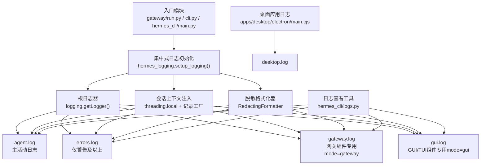
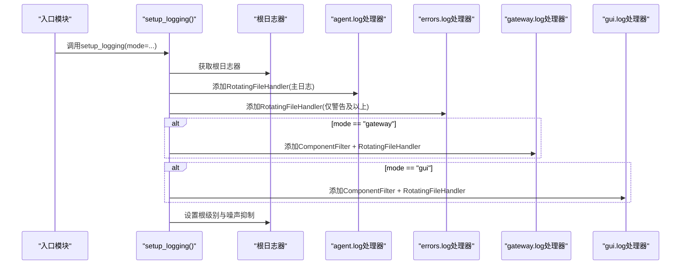
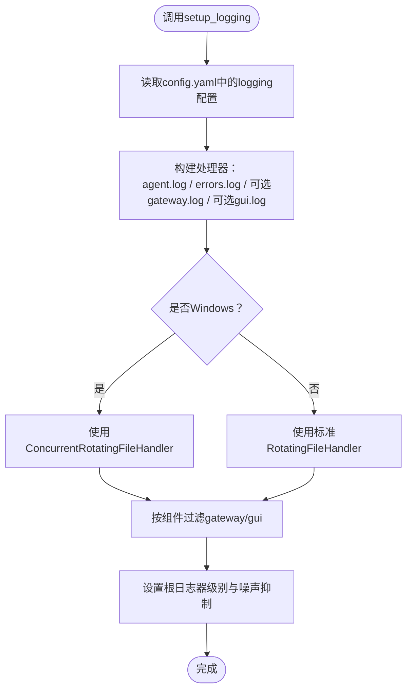
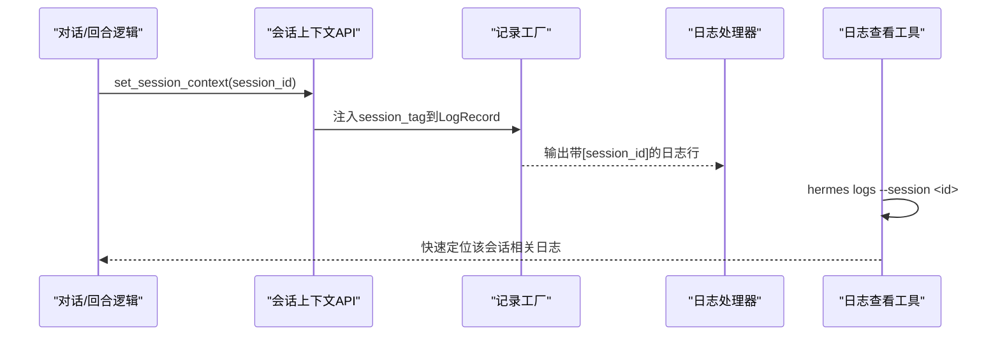
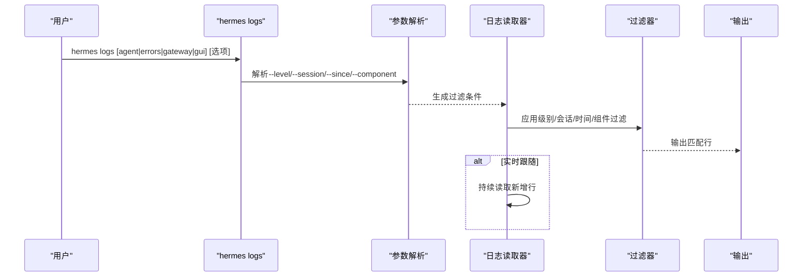
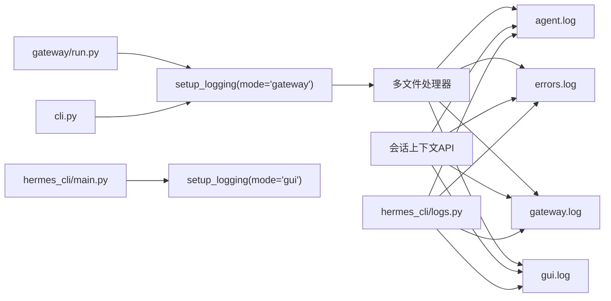

# 日志系统

<cite>
**本文档引用的文件**
- [hermes_logging.py](file://hermes_logging.py)
- [logs.py](file://hermes_cli/logs.py)
- [logs子命令解析器.py](file://hermes_cli/subcommands/logs.py)
- [redact.py](file://agent/redact.py)
- [main.py](file://hermes_cli/main.py)
- [gateway运行入口.py](file://gateway/run.py)
- [CLI入口.py](file://cli.py)
- [对话循环.py](file://agent/conversation_loop.py)
- [会话上下文.py](file://agent/turn_context.py)
- [对话压缩.py](file://agent/conversation_compression.py)
- [测试：hermes_logging.py](file://tests/test_hermes_logging.py)
- [桌面应用日志（Electron）.py](file://apps/desktop/electron/main.cjs)
- [调试工具.py](file://hermes_cli/debug.py)
</cite>

## 目录
1. [简介](#简介)
2. [项目结构](#项目结构)
3. [核心组件](#核心组件)
4. [架构总览](#架构总览)
5. [详细组件分析](#详细组件分析)
6. [依赖关系分析](#依赖关系分析)
7. [性能考量](#性能考量)
8. [故障排除指南](#故障排除指南)
9. [结论](#结论)
10. [附录](#附录)

## 简介
本文件面向Hermes Agent的日志系统，提供从架构到实现细节的完整技术文档。重点覆盖：
- 集中式日志配置与启动流程
- 多文件日志轮转机制与平台差异处理
- 会话上下文日志标记与过滤
- 日志文件组织结构与用途（agent.log、errors.log、gateway.log、gui.log、desktop.log）
- 日志级别配置与过滤策略
- Windows平台并发日志处理方案（ConcurrentRotatingFileHandler）
- 最佳实践与故障排除

## 项目结构
日志系统由以下模块协同构成：
- hermes_logging.py：集中式日志初始化、处理器装配、格式化与过滤、会话上下文注入
- agent/redact.py：敏感信息脱敏格式化器
- hermes_cli/logs.py：日志查看与过滤工具（tail/follow/按级别/按组件/按会话/按时间范围）
- hermes_cli/subcommands/logs.py：CLI子命令参数定义
- gateway/run.py、cli.py、hermes_cli/main.py：在各入口调用setup_logging
- agent/conversation_loop.py、agent/turn_context.py、agent/conversation_compression.py：会话上下文设置与清理
- apps/desktop/electron/main.cjs：桌面应用日志写入与轮转（独立于Python日志）
- tests/test_hermes_logging.py：日志系统行为与边界测试

图表来源
- [hermes_logging.py:231-348](file://hermes_logging.py#L231-L348)
- [logs.py:142-251](file://hermes_cli/logs.py#L142-L251)
- [gateway运行入口.py:16711-16712](file://gateway/run.py#L16711-L16712)
- [CLI入口.py:712-713](file://cli.py#L712-L713)
- [main.py:5375-5377](file://hermes_cli/main.py#L5375-L5377)

章节来源
- [hermes_logging.py:1-566](file://hermes_logging.py#L1-L566)
- [logs.py:1-395](file://hermes_cli/logs.py#L1-L395)
- [logs子命令解析器.py:1-79](file://hermes_cli/subcommands/logs.py#L1-L79)

## 核心组件
- 集中式日志初始化：统一入口setup_logging，支持按模式创建gateway.log/gui.log，读取配置文件参数，设置根日志器级别与第三方噪声抑制。
- 多文件轮转：基于RotatingFileHandler（Windows替换为ConcurrentRotatingFileHandler），支持最大大小与备份数量控制。
- 脱敏格式化：RedactingFormatter在输出前对敏感信息进行掩码处理。
- 会话上下文：set_session_context/clear_session_context在线程本地存储中注入会话标识，记录工厂自动附加到每条日志。
- 组件过滤：_ComponentFilter按logger名称前缀路由到特定日志文件。
- 平台适配：Windows使用ConcurrentRotatingFileHandler避免rename冲突；POSIX下Managed模式确保组可写权限并检测外部轮转。

章节来源
- [hermes_logging.py:231-348](file://hermes_logging.py#L231-L348)
- [hermes_logging.py:387-504](file://hermes_logging.py#L387-L504)
- [hermes_logging.py:195-224](file://hermes_logging.py#L195-L224)
- [hermes_logging.py:141-153](file://hermes_logging.py#L141-L153)
- [redact.py:489-498](file://agent/redact.py#L489-L498)

## 架构总览
日志系统采用“集中初始化 + 多处理器 + 统一格式化 + 会话注入”的架构。所有组件共享根日志器，通过不同处理器写入不同文件，必要时通过过滤器限定来源。

图表来源
- [hermes_logging.py:231-348](file://hermes_logging.py#L231-L348)

## 详细组件分析

### 集中式日志初始化与多文件轮转
- 初始化入口：setup_logging接受hermes_home、log_level、max_size_mb、backup_count、mode、force等参数，读取config.yaml中的logging配置作为默认值，最终创建agent.log与errors.log，并根据mode创建gateway.log/gui.log。
- 轮转策略：每个文件独立配置最大大小与备份数；默认agent.log 5MB×3份，errors.log 2MB×2份，gateway.log 5MB×3份，gui.log 10MB×5份。
- 平台差异：Windows使用ConcurrentRotatingFileHandler以避免rename冲突；POSIX下使用标准RotatingFileHandler。
- Managed模式兼容：_ManagedRotatingFileHandler在NixOS托管模式下确保新文件继承组权限（0660），并在外部轮转（如logrotate）后自动重开文件句柄，防止静默丢失日志。

图表来源
- [hermes_logging.py:231-348](file://hermes_logging.py#L231-L348)
- [hermes_logging.py:387-504](file://hermes_logging.py#L387-L504)

章节来源
- [hermes_logging.py:231-348](file://hermes_logging.py#L231-L348)
- [hermes_logging.py:387-504](file://hermes_logging.py#L387-L504)

### 脱敏格式化器与安全输出
- RedactingFormatter在format阶段对日志内容执行敏感信息掩码，确保密钥、令牌、数据库连接串、私钥等不会落盘。
- 支持通过环境变量或配置关闭脱敏（不推荐），但默认开启以保障安全。

章节来源
- [redact.py:489-498](file://agent/redact.py#L489-L498)
- [redact.py:58-67](file://agent/redact.py#L58-L67)

### 会话上下文日志标记
- set_session_context/clear_session_context在当前线程设置/清除会话ID，记录工厂在每条日志记录上注入session_tag字段，格式化字符串自动包含该字段，便于跨进程/多线程关联同一会话的所有日志。
- 典型使用场景：在对话开始时设置会话ID，在结束时清理，配合hermes logs --session进行快速定位。

图表来源
- [hermes_logging.py:141-153](file://hermes_logging.py#L141-L153)
- [hermes_logging.py:159-188](file://hermes_logging.py#L159-L188)
- [对话循环.py:61](file://agent/conversation_loop.py#L61)
- [会话上下文.py:106](file://agent/turn_context.py#L106)
- [对话压缩.py:535-537](file://agent/conversation_compression.py#L535-L537)

章节来源
- [hermes_logging.py:141-153](file://hermes_logging.py#L141-L153)
- [hermes_logging.py:159-188](file://hermes_logging.py#L159-L188)
- [对话循环.py:61](file://agent/conversation_loop.py#L61)
- [会话上下文.py:106](file://agent/turn_context.py#L106)
- [对话压缩.py:535-537](file://agent/conversation_compression.py#L535-L537)

### 组件过滤与日志文件分工
- _ComponentFilter按logger名称前缀将记录路由至对应文件：gateway.log接收gateway.*与hermes_plugins.*；gui.log接收hermes_cli.web_server、hermes_cli.pty_bridge、tui_gateway.*、uvicorn.*。
- agent.log作为兜底，接收所有其他记录；errors.log仅接收WARNING及以上级别。

章节来源
- [hermes_logging.py:195-224](file://hermes_logging.py#L195-L224)
- [hermes_logging.py:312-334](file://hermes_logging.py#L312-L334)

### 日志查看与过滤工具
- hermes logs支持：尾随显示、实时跟随、按级别过滤、按组件过滤、按会话ID过滤、按相对时间范围过滤。
- 内置正则解析时间戳、级别与logger名称，支持大文件高效读取与增量跟随。

图表来源
- [logs.py:142-251](file://hermes_cli/logs.py#L142-L251)
- [logs子命令解析器.py:13-79](file://hermes_cli/subcommands/logs.py#L13-L79)

章节来源
- [logs.py:142-251](file://hermes_cli/logs.py#L142-L251)
- [logs子命令解析器.py:13-79](file://hermes_cli/subcommands/logs.py#L13-L79)

### Windows平台并发日志处理
- 问题背景：Windows下标准RotatingFileHandler在doRollover()中调用os.rename()，当有其他进程持有文件追加句柄时会触发PermissionError，导致agent.log卡在固定大小且不断报错。
- 解决方案：在Windows平台将RotatingFileHandler别名为ConcurrentRotatingFileHandler，通过跨进程文件锁确保同一时刻仅一个进程执行轮转，其他进程等待。
- 限制与权衡：此替换仅限Windows，POSIX下保留标准实现以满足NixOS托管模式对文件打开/轮转生命周期的严格要求。

章节来源
- [hermes_logging.py:38-65](file://hermes_logging.py#L38-L65)

### 桌面应用日志（desktop.log）
- 桌面应用（Electron）独立维护desktop.log，包含缓冲区、异步刷写、同步/异步轮转检查与最佳努力策略，确保应用启动/关闭过程中的日志不阻塞。
- 文件路径位于~/.hermes/logs/desktop.log，可通过hermes logs desktop进行查看与跟随。

章节来源
- [桌面应用日志（Electron）.py:738-834](file://apps/desktop/electron/main.cjs#L738-L834)
- [logs.py:32-38](file://hermes_cli/logs.py#L32-L38)

## 依赖关系分析
- 启动入口依赖：gateway/run.py、cli.py、hermes_cli/main.py均调用setup_logging，确保在各自运行环境中正确初始化日志。
- 会话上下文依赖：对话循环、回合上下文、对话压缩在关键节点设置/清理会话ID，保证日志可追踪性。
- 过滤与查看依赖：hermes_cli/logs.py依赖hermes_logging.COMPONENT_PREFIXES进行组件过滤，同时解析日志行提取级别与logger名称。

图表来源
- [gateway运行入口.py:16711-16712](file://gateway/run.py#L16711-L16712)
- [CLI入口.py:712-713](file://cli.py#L712-L713)
- [main.py:5375-5377](file://hermes_cli/main.py#L5375-L5377)
- [hermes_logging.py:231-348](file://hermes_logging.py#L231-L348)
- [logs.py:142-251](file://hermes_cli/logs.py#L142-L251)

章节来源
- [gateway运行入口.py:16711-16712](file://gateway/run.py#L16711-L16712)
- [CLI入口.py:712-713](file://cli.py#L712-L713)
- [main.py:5375-5377](file://hermes_cli/main.py#L5375-L5377)
- [hermes_logging.py:231-348](file://hermes_logging.py#L231-L348)
- [logs.py:142-251](file://hermes_cli/logs.py#L142-L251)

## 性能考量
- 轮转成本：轮转操作涉及文件重命名与权限调整，建议合理设置max_size_mb与backup_count，避免频繁轮转造成I/O抖动。
- 外部轮转检测：_ManagedRotatingFileHandler在每次emit前对inode进行轻量级校验，开销极低（内核缓存元数据），有效避免logrotate等外部轮转导致的静默丢失。
- 控制台输出：setup_verbose_logging启用DEBUG级别控制台输出，配合RedactingFormatter与安全stderr包装，减少编码错误导致的崩溃。
- 日志查看：hermes logs对大文件采用分块读取策略，避免一次性加载造成内存压力。

章节来源
- [hermes_logging.py:486-504](file://hermes_logging.py#L486-L504)
- [hermes_logging.py:351-381](file://hermes_logging.py#L351-L381)
- [logs.py:282-336](file://hermes_cli/logs.py#L282-L336)

## 故障排除指南
- Windows轮转失败/卡住
  - 现象：agent.log达到阈值后无法轮转，stderr出现PermissionError。
  - 原因：多个进程同时持有文件追加句柄导致rename冲突。
  - 处理：确认已使用ConcurrentRotatingFileHandler（Windows自动切换），避免手动替换处理器类型。
  - 参考：[hermes_logging.py:38-65](file://hermes_logging.py#L38-L65)

- POSIX托管模式权限问题
  - 现象：多用户共享日志文件权限不足。
  - 处理：_ManagedRotatingFileHandler在_open与doRollover后强制chmod 0660，确保组可读写。
  - 参考：[_ManagedRotatingFileHandler._chmod_if_managed:422-427](file://hermes_logging.py#L422-L427)

- 外部轮转导致日志丢失
  - 现象：使用logrotate或手动mv后，部分写入落到旧文件名。
  - 处理：_ManagedRotatingFileHandler在emit前检测inode变化并自动重开文件。
  - 参考：[_ManagedRotatingFileHandler.emit/_reopen_if_externally_rotated:486-484](file://hermes_logging.py#L486-L484)

- 日志查看无输出或过滤异常
  - 现象：hermes logs无结果或过滤无效。
  - 排查：确认目标日志文件存在且非空；检查--level、--session、--since、--component参数格式；确认组件前缀是否正确。
  - 参考：[logs.py:142-251](file://hermes_cli/logs.py#L142-L251)

- 桌面应用日志未生成
  - 现象：desktop.log缺失。
  - 处理：确认应用已启动并产生日志；检查日志目录权限；使用hermes logs desktop -f观察实时输出。
  - 参考：[桌面应用日志（Electron）.py:738-834](file://apps/desktop/electron/main.cjs#L738-L834)

- 脱敏策略影响排查
  - 现象：日志中敏感信息被掩码，影响定位。
  - 处理：临时关闭脱敏（不推荐）或使用--level/--session/--since缩小范围；生产环境保持默认脱敏。
  - 参考：[redact.py:58-67](file://agent/redact.py#L58-L67)

章节来源
- [hermes_logging.py:38-65](file://hermes_logging.py#L38-L65)
- [hermes_logging.py:422-427](file://hermes_logging.py#L422-L427)
- [hermes_logging.py:486-484](file://hermes_logging.py#L486-L484)
- [logs.py:142-251](file://hermes_cli/logs.py#L142-L251)
- [桌面应用日志（Electron）.py:738-834](file://apps/desktop/electron/main.cjs#L738-L834)
- [redact.py:58-67](file://agent/redact.py#L58-L67)

## 结论
Hermes Agent的日志系统通过集中式初始化、多文件轮转、组件过滤与会话上下文注入，实现了高可用、可追踪、可审计的日志能力。Windows平台采用并发轮转处理器解决rename冲突，POSIX托管模式下通过自定义轮转处理器确保权限与一致性。结合脱敏格式化器与强大的日志查看工具，既能满足日常运维与问题诊断，又能保障敏感信息安全。

## 附录

### 日志文件组织与用途
- agent.log：主活动日志，记录所有组件的INFO及以上级别事件。
- errors.log：仅记录WARNING及以上级别，便于快速定位问题。
- gateway.log：仅接收gateway.*与hermes_plugins.*组件记录，用于网关侧问题诊断。
- gui.log：仅接收hermes_cli.web_server、hermes_cli.pty_bridge、tui_gateway.*、uvicorn.*组件记录，用于GUI/TUI侧问题诊断。
- desktop.log：桌面应用（Electron）日志，独立维护轮转与缓冲策略。

章节来源
- [hermes_logging.py:7-28](file://hermes_logging.py#L7-L28)
- [logs.py:32-38](file://hermes_cli/logs.py#L32-L38)

### 日志级别与过滤机制
- 级别：DEBUG < INFO < WARNING < ERROR < CRITICAL
- 过滤：支持按级别（--level）、按会话ID（--session）、按组件（--component）、按相对时间（--since）进行组合过滤。
- 查看：hermes logs默认显示agent.log最后50行，支持实时跟随（-f）。

章节来源
- [logs.py:57-140](file://hermes_cli/logs.py#L57-L140)
- [logs子命令解析器.py:58-77](file://hermes_cli/subcommands/logs.py#L58-L77)

### 最佳实践
- 在生产环境保持默认脱敏策略，避免敏感信息落盘。
- 使用--component与--session组合过滤快速定位问题域。
- 合理设置轮转参数，平衡磁盘占用与I/O开销。
- 在Windows环境下无需手动干预，系统自动使用并发轮转处理器。
- 对于多用户共享环境，确保日志目录具备正确的组权限（Managed模式下由系统自动处理）。

### 关键入口与调用点
- 网关模式：gateway/run.py调用setup_logging(mode="gateway")
- CLI模式：cli.py调用setup_logging(mode="cli")
- GUI模式：hermes_cli/main.py调用setup_logging(mode="gui")

章节来源
- [gateway运行入口.py:16711-16712](file://gateway/run.py#L16711-L16712)
- [CLI入口.py:712-713](file://cli.py#L712-L713)
- [main.py:5375-5377](file://hermes_cli/main.py#L5375-L5377)