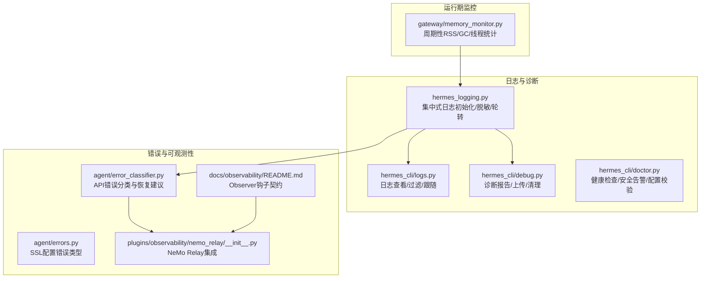
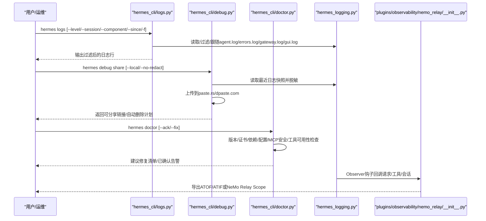
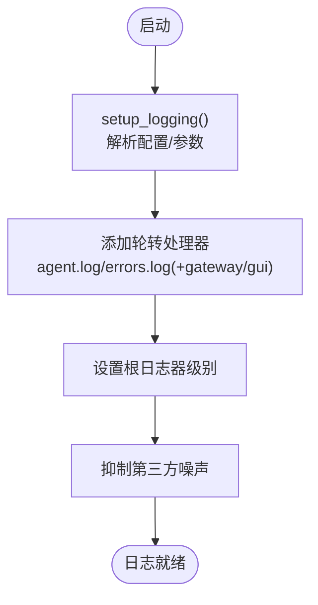
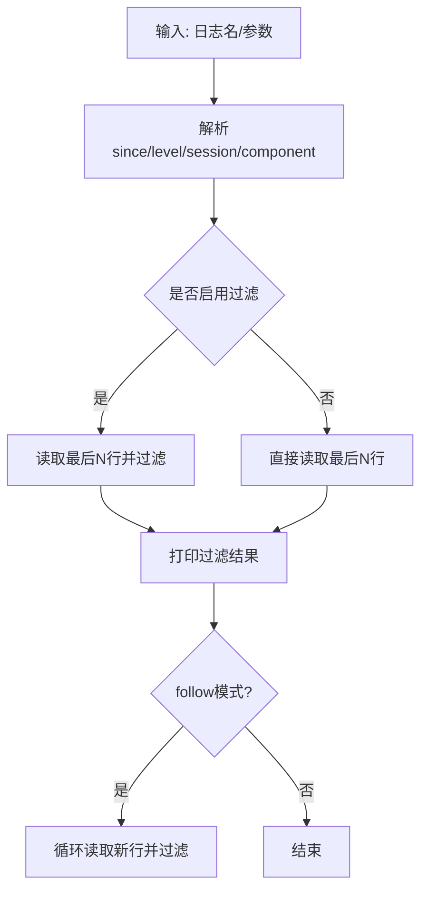
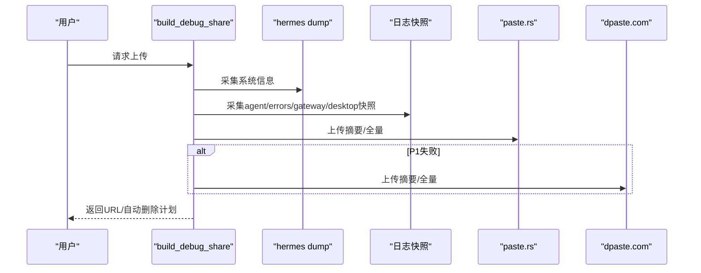
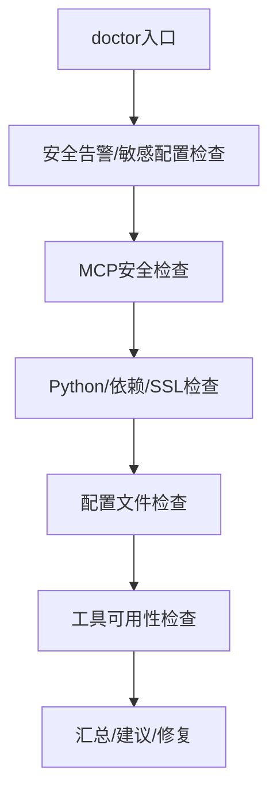
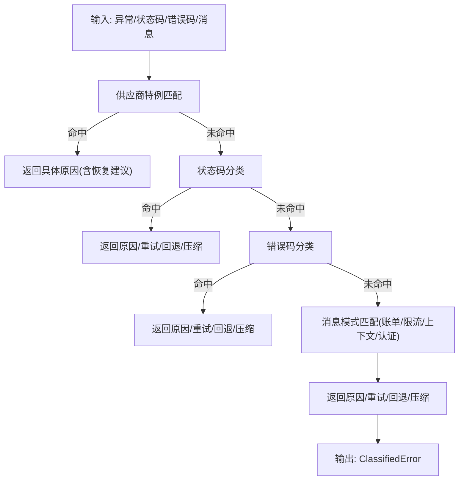
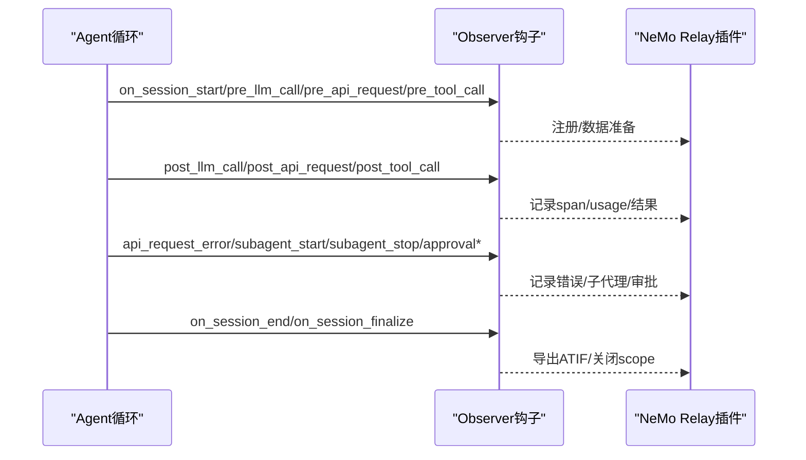
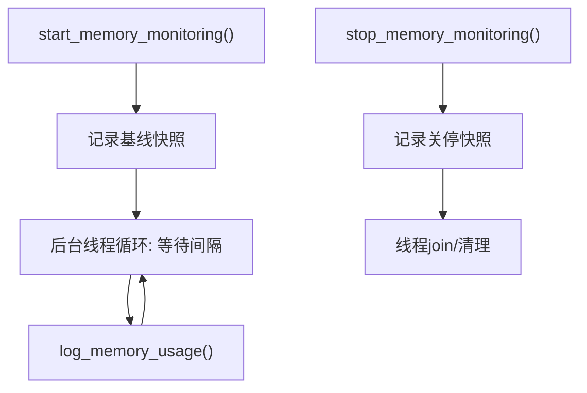
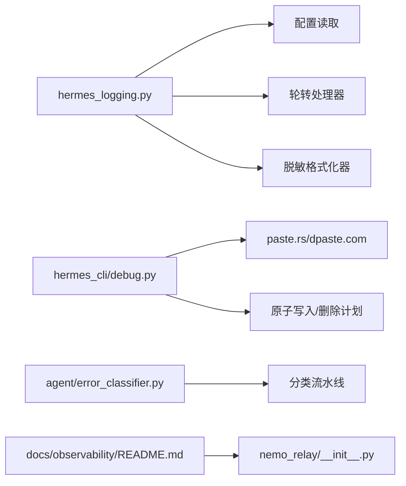

# 监控与调试

<cite>
**本文引用的文件**   
- [hermes_logging.py](file://hermes_logging.py)
- [logs.py](file://hermes_cli/logs.py)
- [debug.py](file://hermes_cli/debug.py)
- [doctor.py](file://hermes_cli/doctor.py)
- [error_classifier.py](file://agent/error_classifier.py)
- [errors.py](file://agent/errors.py)
- [README.md](file://docs/observability/README.md)
- [memory_monitor.py](file://gateway/memory_monitor.py)
- [nemo_relay/__init__.py](file://plugins/observability/nemo_relay/__init__.py)
</cite>

## 目录
1. [简介](#简介)
2. [项目结构](#项目结构)
3. [核心组件](#核心组件)
4. [架构总览](#架构总览)
5. [详细组件分析](#详细组件分析)
6. [依赖分析](#依赖分析)
7. [性能考虑](#性能考虑)
8. [故障排除指南](#故障排除指南)
9. [结论](#结论)
10. [附录](#附录)

## 简介
本文件面向运维与开发者，系统化梳理 Hermes Agent 的监控与调试能力，覆盖日志架构与级别管理、结构化日志与敏感信息脱敏、错误分类与异常处理、性能指标采集与分析、诊断工具链（doctor、logs、debug）、可观测性钩子与第三方集成（Langfuse、NeMo Relay），以及远程调试与生产环境诊断策略。目标是帮助读者快速定位问题、优化性能、稳定交付。

## 项目结构
围绕监控与调试的关键模块分布如下：
- 日志子系统：集中式日志初始化、按组件路由、轮转与脱敏、会话上下文注入
- CLI 调试工具：日志查看与过滤（logs）、诊断报告上传（debug share）、健康检查（doctor）
- 错误分类与恢复：统一的 API 错误分类流水线，指导重试、降级与压缩
- 可观测性钩子：Observer 合约与插件实现，支持 trace/metrics/审计导出
- 内存监控：网关长生命周期进程内存使用周期性记录
- 性能分析：桌面端流式帧率与长任务统计脚本（辅助前端渲染性能）

**图表来源**
- [hermes_logging.py:231-348](file://hermes_logging.py#L231-L348)
- [logs.py:142-251](file://hermes_cli/logs.py#L142-L251)
- [debug.py:604-691](file://hermes_cli/debug.py#L604-L691)
- [doctor.py:465-800](file://hermes_cli/doctor.py#L465-L800)
- [error_classifier.py:441-742](file://agent/error_classifier.py#L441-L742)
- [errors.py:1-4](file://agent/errors.py#L1-L4)
- [README.md:1-317](file://docs/observability/README.md#L1-L317)
- [memory_monitor.py:129-231](file://gateway/memory_monitor.py#L129-L231)
- [nemo_relay/__init__.py:404-620](file://plugins/observability/nemo_relay/__init__.py#L404-L620)

**章节来源**
- [hermes_logging.py:1-566](file://hermes_logging.py#L1-L566)
- [logs.py:1-395](file://hermes_cli/logs.py#L1-L395)
- [debug.py:1-830](file://hermes_cli/debug.py#L1-L830)
- [doctor.py:1-2315](file://hermes_cli/doctor.py#L1-L2315)
- [error_classifier.py:1-1366](file://agent/error_classifier.py#L1-L1366)
- [errors.py:1-4](file://agent/errors.py#L1-L4)
- [README.md:1-317](file://docs/observability/README.md#L1-L317)
- [memory_monitor.py:1-231](file://gateway/memory_monitor.py#L1-L231)
- [nemo_relay/__init__.py:1-963](file://plugins/observability/nemo_relay/__init__.py#L1-L963)

## 核心组件
- 日志子系统：提供统一入口、多文件轮转、组件路由、会话上下文注入、控制台冗余抑制与安全脱敏
- 日志查看器：支持尾读、实时跟随、级别/会话/组件/时间范围过滤
- 诊断工具：生成系统信息与日志快照，上传至公共粘贴服务，支持自动删除与隐私提示
- 健康检查：版本一致性、证书有效性、依赖包、配置文件、MCP 安全、工具可用性等
- 错误分类：基于状态码、错误码、消息模式与传输错误类型的优先级流水线
- 观测性钩子：Observer 合约定义、插件注册、NeMo Relay 导出
- 内存监控：网关后台线程周期记录 RSS/GC/线程数，支持基线与关停快照
- 性能分析：桌面端脚本统计帧耗时、长任务、变更频率与增长速率

**章节来源**
- [hermes_logging.py:231-348](file://hermes_logging.py#L231-L348)
- [logs.py:142-251](file://hermes_cli/logs.py#L142-L251)
- [debug.py:604-691](file://hermes_cli/debug.py#L604-L691)
- [doctor.py:465-800](file://hermes_cli/doctor.py#L465-L800)
- [error_classifier.py:441-742](file://agent/error_classifier.py#L441-L742)
- [README.md:1-317](file://docs/observability/README.md#L1-L317)
- [memory_monitor.py:129-231](file://gateway/memory_monitor.py#L129-L231)

## 架构总览
下图展示“日志—诊断—错误分类—可观测性”的闭环协作：

**图表来源**
- [logs.py:142-251](file://hermes_cli/logs.py#L142-L251)
- [debug.py:604-774](file://hermes_cli/debug.py#L604-L774)
- [doctor.py:465-800](file://hermes_cli/doctor.py#L465-L800)
- [hermes_logging.py:231-348](file://hermes_logging.py#L231-L348)
- [nemo_relay/__init__.py:404-620](file://plugins/observability/nemo_relay/__init__.py#L404-L620)

## 详细组件分析

### 日志架构与级别管理
- 初始化与入口
  - 统一入口：集中式日志初始化，支持最小级别、轮转大小、备份数量、组件模式
  - 多文件输出：agent.log（主活动）、errors.log（警告及以上）、gateway.log（仅网关组件）、gui.log（仅GUI组件）
  - 平台适配：Windows 使用并发安全轮转处理器；POSIX 使用标准轮转处理器
- 结构化与脱敏
  - 记录工厂：为每条日志注入会话标签，便于关联对话
  - 脱敏格式化器：对输出进行敏感信息脱敏，避免明文写盘
  - 过滤器：按组件前缀路由到不同日志文件
- 控制台与噪声抑制
  - 详细模式：启用DEBUG控制台输出，降低第三方库噪声
  - 噪声抑制：默认抑制常见第三方库的DEBUG/INFO噪声
- 配置与回退
  - 从配置文件读取日志级别、轮转大小、备份数量
  - idempotent 初始化，支持强制重置

**图表来源**
- [hermes_logging.py:231-348](file://hermes_logging.py#L231-L348)
- [hermes_logging.py:351-381](file://hermes_logging.py#L351-L381)
- [hermes_logging.py:506-566](file://hermes_logging.py#L506-L566)

**章节来源**
- [hermes_logging.py:231-348](file://hermes_logging.py#L231-L348)
- [hermes_logging.py:351-381](file://hermes_logging.py#L351-L381)
- [hermes_logging.py:506-566](file://hermes_logging.py#L506-L566)

### 日志查看与过滤（hermes logs）
- 功能特性
  - 尾读与跟随：支持指定行数、实时跟随、Ctrl+C 停止
  - 过滤维度：级别（>=）、会话（包含字符串）、组件（按前缀）、相对时间（如1h/30m）
  - 文件枚举：列出日志目录下的日志文件及大小/年龄
- 实现要点
  - 时间戳/级别/日志器名称正则抽取
  - 大文件高效尾读（分块读取/解码）
  - 过滤器组合：时间阈值、级别阈值、会话包含、组件前缀匹配

**图表来源**
- [logs.py:142-251](file://hermes_cli/logs.py#L142-L251)
- [logs.py:253-336](file://hermes_cli/logs.py#L253-L336)
- [logs.py:338-361](file://hermes_cli/logs.py#L338-L361)

**章节来源**
- [logs.py:142-251](file://hermes_cli/logs.py#L142-L251)
- [logs.py:253-336](file://hermes_cli/logs.py#L253-L336)
- [logs.py:338-361](file://hermes_cli/logs.py#L338-L361)

### 诊断报告与上传（hermes debug share）
- 报告组成
  - 系统信息：通过 hermes dump 生成
  - 日志快照：agent.log/errors.log/gateway.log/desktop.log 的最近若干行与上限大小截断
  - 全量日志：可选上传，带“截断”提示
- 隐私与脱敏
  - 默认强制脱敏（含邮箱地址替换），可选关闭
  - 上传前附加脱敏横幅，便于审查者识别
- 上传与清理
  - 优先 paste.rs，失败回退 dpaste.com
  - 自动删除：6小时后删除；pending.json 记录URL与到期时间
  - 支持手动删除 paste.rs 链接
- 本地模式
  - 不联网，仅在本地打印报告与全量日志

**图表来源**
- [debug.py:535-582](file://hermes_cli/debug.py#L535-L582)
- [debug.py:604-691](file://hermes_cli/debug.py#L604-L691)
- [debug.py:341-382](file://hermes_cli/debug.py#L341-L382)
- [debug.py:317-339](file://hermes_cli/debug.py#L317-L339)

**章节来源**
- [debug.py:535-582](file://hermes_cli/debug.py#L535-L582)
- [debug.py:604-691](file://hermes_cli/debug.py#L604-L691)
- [debug.py:341-382](file://hermes_cli/debug.py#L341-L382)
- [debug.py:317-339](file://hermes_cli/debug.py#L317-L339)

### 健康检查（hermes doctor）
- 安全与合规
  - 已知漏洞包检测与处置建议
  - MCP 服务器 stdio 命令可疑项检查
- 环境与依赖
  - Python 版本与虚拟环境
  - 必需/可选包安装状态
  - SSL 证书有效性
- 配置与文件
  - ~/.hermes/.env 与 config.yaml 存在性与基本校验
  - provider 与模型配置合法性
- 工具可用性
  - 工具集可用性与运行时门禁（如 kanban worker 环境变量）
  - Honcho/MCP 等外部服务可用性探测

**图表来源**
- [doctor.py:465-800](file://hermes_cli/doctor.py#L465-L800)

**章节来源**
- [doctor.py:465-800](file://hermes_cli/doctor.py#L465-L800)

### 错误分类与异常处理
- 分类体系
  - 认证/授权（瞬时/永久）
  - 账单/配额（透支/限额）
  - 服务器错误（500/502/503/529）
  - 传输错误（超时/连接/SSL告警）
  - 上下文/负载（上下文溢出/负载过大/图片过大）
  - 模型/策略（模型不存在/内容策略拒绝/供应商策略阻断）
  - 请求格式（400/非法加密内容/多模态工具内容不支持）
  - 供应商特例（思考块签名/长上下文等级/OAuth订阅限制/语法模式）
- 分类流水线
  - 优先级：供应商特例 → 状态码 → 错误码 → 消息模式 → SSL告警 → 服务器断开 + 大会话 → 传输错误 → 未知
  - 输出：原因、状态码、提供商/模型、消息、上下文、是否可重试/是否压缩/是否换凭证/是否回退
- 异常类型
  - SSL 配置错误类型，用于证书有效性检查

**图表来源**
- [error_classifier.py:441-742](file://agent/error_classifier.py#L441-L742)

**章节来源**
- [error_classifier.py:24-91](file://agent/error_classifier.py#L24-L91)
- [error_classifier.py:441-742](file://agent/error_classifier.py#L441-L742)
- [errors.py:1-4](file://agent/errors.py#L1-L4)

### 观测性钩子与第三方集成
- Observer 合约
  - 生命周期：会话开始/结束/最终化/重置
  - 轮次：预/后 LLM 调用
  - 请求：预/后 API 请求、请求错误
  - 工具：预/后工具调用、结果转换
  - 审批与子代理事件
  - 关联ID：session_id、task_id、turn_id、api_request_id、tool_call_id 等
- 插件实现
  - 注册钩子与中间件
  - NeMo Relay：会话scope、LLM/工具span、ATOF/ATIF导出、嵌入式子代理导出模式
- 性能与成本
  - 仅在存在钩子时构建清洗后的请求/响应载荷
  - 钩子回调应快速、失败不中断流程

**图表来源**
- [README.md:17-317](file://docs/observability/README.md#L17-L317)
- [nemo_relay/__init__.py:404-620](file://plugins/observability/nemo_relay/__init__.py#L404-L620)

**章节来源**
- [README.md:1-317](file://docs/observability/README.md#L1-L317)
- [nemo_relay/__init__.py:404-620](file://plugins/observability/nemo_relay/__init__.py#L404-L620)

### 内存监控（网关）
- 设计目标
  - 长生命周期进程的内存泄漏检测：周期性记录RSS、GC统计、线程数
  - 起始基线、关停终态快照、守护线程、平台兼容（resource/psutil）
- 接口
  - 启动/停止/查询运行状态
  - 手动记录（生命周期关键节点）
- 配置
  - 间隔秒数、开关位置于配置文件

**图表来源**
- [memory_monitor.py:129-231](file://gateway/memory_monitor.py#L129-L231)

**章节来源**
- [memory_monitor.py:1-231](file://gateway/memory_monitor.py#L1-L231)

### 性能指标采集与分析（桌面端）
- 指标
  - 帧耗时分布（<=16.7ms、16.7-33ms、…、>200ms）
  - FPS、P50/P95/P99 帧耗时
  - 长任务（Long Tasks）总量/最大/95分位
  - DOM变更频率（P50/P95变更间隔）
  - 文本增长速率（字符/秒）
- 应用场景
  - 流式渲染性能评估
  - UI卡顿与主线程压力定位

**章节来源**
- [measure-synthetic-stream.mjs:226-258](file://apps/desktop/scripts/measure-synthetic-stream.mjs#L226-L258)
- [measure-real-stream.mjs:205-240](file://apps/desktop/scripts/measure-real-stream.mjs#L205-L240)
- [profile-tui.py:263-358](file://scripts/profile-tui.py#L263-L358)

## 依赖分析
- 日志子系统
  - 依赖：配置读取、路径解析、第三方日志库、平台特定轮转器
  - 低耦合：通过过滤器与记录工厂实现组件分离
- 诊断工具
  - 依赖：系统信息采集、网络上传、原子文件写入、粘贴服务API
  - 解耦：上传失败回退、自动删除独立调度
- 错误分类
  - 依赖：异常类型/状态码/错误码/消息体提取
  - 可扩展：新增供应商特例与模式规则
- 观测性
  - 依赖：NeMo Relay 运行时、插件配置、导出器
  - 松耦合：钩子注册/中间件包装，不影响主流程

**图表来源**
- [hermes_logging.py:231-348](file://hermes_logging.py#L231-L348)
- [debug.py:317-339](file://hermes_cli/debug.py#L317-L339)
- [error_classifier.py:441-742](file://agent/error_classifier.py#L441-L742)
- [README.md:1-317](file://docs/observability/README.md#L1-L317)
- [nemo_relay/__init__.py:404-620](file://plugins/observability/nemo_relay/__init__.py#L404-L620)

**章节来源**
- [hermes_logging.py:231-348](file://hermes_logging.py#L231-L348)
- [debug.py:317-339](file://hermes_cli/debug.py#L317-L339)
- [error_classifier.py:441-742](file://agent/error_classifier.py#L441-L742)
- [README.md:1-317](file://docs/observability/README.md#L1-L317)
- [nemo_relay/__init__.py:404-620](file://plugins/observability/nemo_relay/__init__.py#L404-L620)

## 性能考虑
- 日志性能
  - 轮转与脱敏：I/O 成本可控，Windows 并发轮转避免权限冲突
  - 过滤与噪声抑制：减少控制台冗余，降低终端渲染压力
- 诊断与上传
  - 上传失败回退与自动删除：避免阻塞主流程
  - 截断与脱敏：控制上传体积，兼顾隐私
- 观测性开销
  - 按需构建清洗载荷，仅在存在钩子时才构造
  - 钩子回调应快速、失败不中断
- 内存监控
  - 守护线程、非阻塞退出、平台兼容

**章节来源**
- [hermes_logging.py:351-381](file://hermes_logging.py#L351-L381)
- [debug.py:317-339](file://hermes_cli/debug.py#L317-L339)
- [README.md:243-256](file://docs/observability/README.md#L243-L256)
- [memory_monitor.py:129-231](file://gateway/memory_monitor.py#L129-L231)

## 故障排除指南
- 常见问题与定位步骤
  - 日志找不到/为空
    - 确认已运行一次交互会话以生成日志
    - 使用 hermes logs 列表查看日志文件是否存在
  - 日志过大/滚动频繁
    - 调整轮转大小与备份数量（配置文件或运行参数）
  - 会话关联困难
    - 在会话开始时设置会话上下文，确保日志包含会话标签
  - 诊断报告泄露敏感信息
    - 默认启用强制脱敏；如需保留原始内容，使用本地模式
  - SSL/TLS 证书问题
    - doctor 检查证书有效性；必要时修正系统证书或代理配置
  - API 错误反复重试
    - 查看错误分类结果，确认是否账单/配额/内容策略导致不可重试
  - 内存缓慢增长
    - 启用内存监控，观察RSS/GC/线程趋势；结合日志定位泄漏点
- 建议操作清单
  - 运行 doctor 获取一次性健康检查报告
  - 使用 logs 增量查看最近错误与告警
  - 生成并上传 debug share，附上链接给支持团队
  - 对于生产环境，先本地模式验证，再上传

**章节来源**
- [logs.py:362-395](file://hermes_cli/logs.py#L362-L395)
- [debug.py:694-774](file://hermes_cli/debug.py#L694-L774)
- [doctor.py:465-800](file://hermes_cli/doctor.py#L465-L800)
- [error_classifier.py:441-742](file://agent/error_classifier.py#L441-L742)
- [memory_monitor.py:129-231](file://gateway/memory_monitor.py#L129-L231)

## 结论
本文件提供了从日志、诊断、错误分类到可观测性的完整技术视图。通过统一的日志入口、强大的日志查看与诊断工具、严谨的错误分类与恢复建议、可扩展的 Observer 合约与 NeMo Relay 集成，以及运行期内存监控与性能分析脚本，Hermes Agent 能够在开发与生产环境中实现高效的问题定位与稳定性保障。建议在 CI/CD 中集成 doctor 检查，在生产中开启内存监控与必要的日志级别，并定期导出与归档诊断报告。

## 附录
- 常用命令速查
  - hermes logs：查看/过滤/跟随日志
  - hermes debug share：生成并上传诊断报告
  - hermes doctor：一次性健康检查
- 最佳实践
  - 生产环境：保持 errors.log 与 agent.log 的轮转策略；启用内存监控；使用 doctor 定期巡检
  - 开发环境：开启详细日志与控制台输出；利用 logs 的实时跟随与过滤
  - 诊断流程：先 doctor，再 logs，最后 debug share