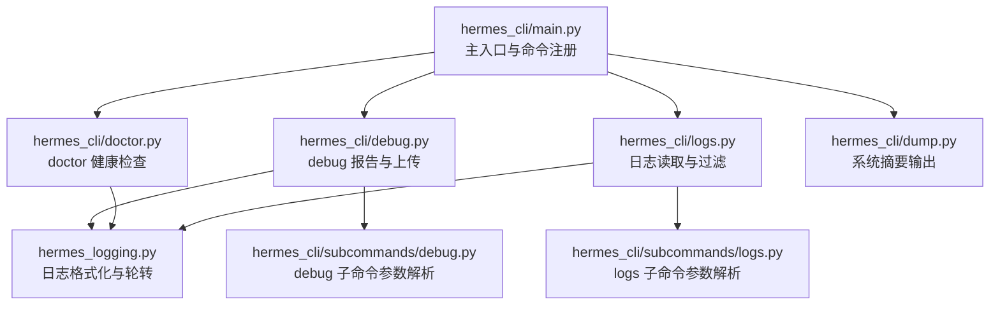
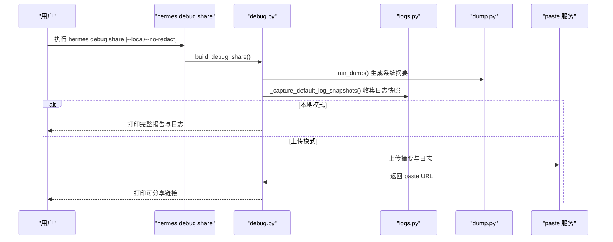
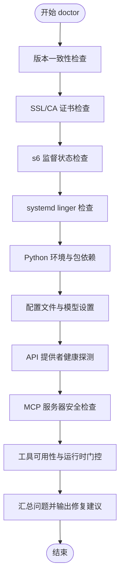
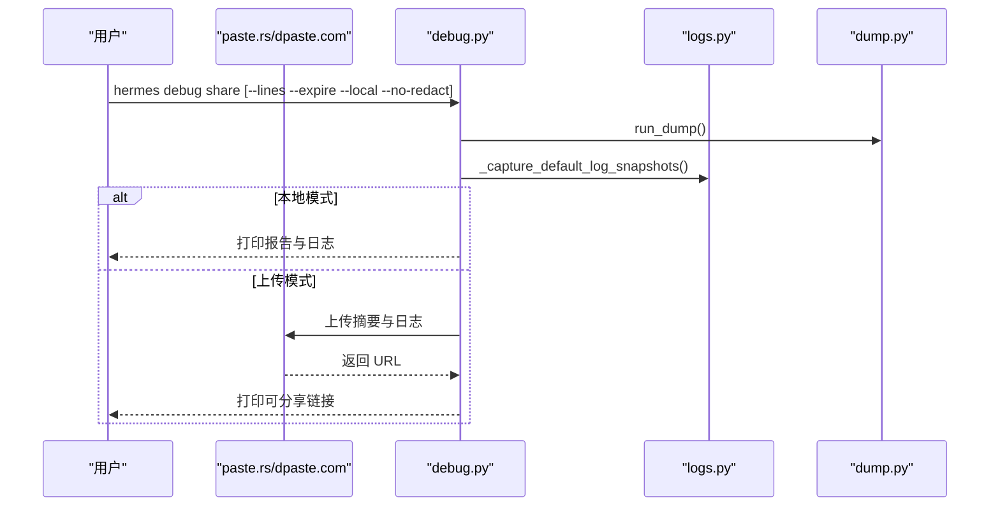
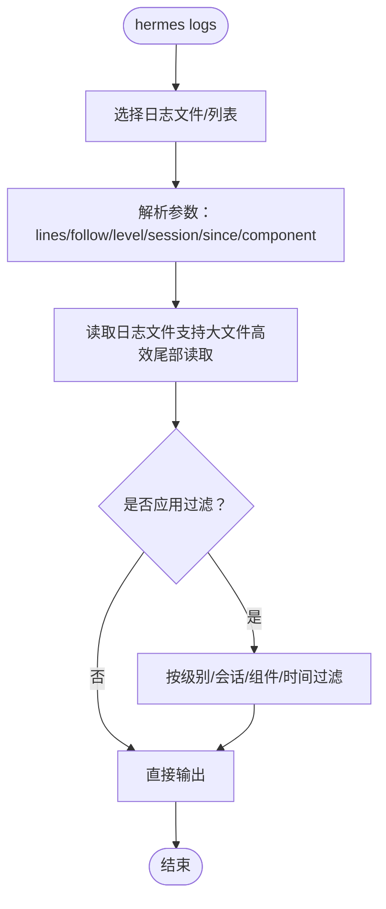
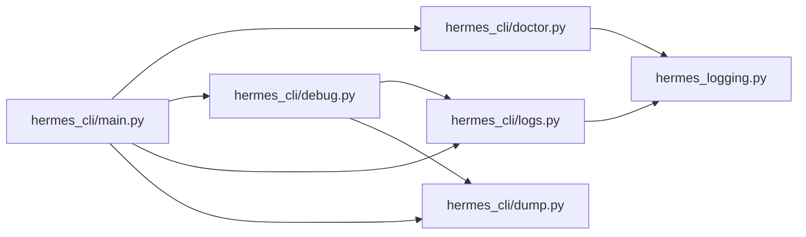

# 调试工具

<cite>
**本文引用的文件**
- [hermes_cli/main.py](file://hermes_cli/main.py)
- [hermes_cli/subcommands/debug.py](file://hermes_cli/subcommands/debug.py)
- [hermes_cli/debug.py](file://hermes_cli/debug.py)
- [hermes_cli/subcommands/logs.py](file://hermes_cli/subcommands/logs.py)
- [hermes_cli/logs.py](file://hermes_cli/logs.py)
- [hermes_cli/dump.py](file://hermes_cli/dump.py)
- [hermes_cli/doctor.py](file://hermes_cli/doctor.py)
- [hermes_logging.py](file://hermes_logging.py)
- [tools/debug_helpers.py](file://tools/debug_helpers.py)
- [tests/tools/test_debug_helpers.py](file://tests/tools/test_debug_helpers.py)
- [optional-skills/software-development/rest-graphql-debug/SKILL.md](file://optional-skills/software-development/rest-graphql-debug/SKILL.md)
</cite>

## 目录
1. [简介](#简介)
2. [项目结构](#项目结构)
3. [核心组件](#核心组件)
4. [架构总览](#架构总览)
5. [详细组件分析](#详细组件分析)
6. [依赖分析](#依赖分析)
7. [性能考虑](#性能考虑)
8. [故障排查指南](#故障排查指南)
9. [结论](#结论)
10. [附录](#附录)

## 简介
本指南面向使用 Hermes Agent 的开发者与运维人员，系统讲解调试工具链的使用方法与最佳实践，覆盖以下主题：
- doctor 命令：系统健康检查与自动诊断
- debug 模式与日志：详细日志输出与隐私保护
- 日志查看与过滤：按级别、会话、组件、时间范围筛选
- 调试报告生成与分享：本地/云端上传、自动删除策略
- 配置验证与网络连通性测试：API 密钥、证书、代理、DNS、TLS 等
- 性能分析与常见问题定位：慢响应、超时、证书问题、容器监督等
- 高级用法与批量诊断：多日志快照、批量上传、自动化清理

## 项目结构
调试工具主要由 CLI 子命令与底层支持模块构成：
- CLI 解析与入口：在主入口中注册子命令解析器
- doctor 子命令：集中执行系统健康检查
- debug 子命令：生成调试报告并可上传或本地打印
- logs 子命令：查看与过滤日志文件
- dump 子命令：输出简洁的系统信息摘要
- hermes_logging：统一的日志初始化、格式化与轮转

图表来源
- [hermes_cli/main.py:1-200](file://hermes_cli/main.py#L1-L200)
- [hermes_cli/doctor.py:1-200](file://hermes_cli/doctor.py#L1-L200)
- [hermes_cli/debug.py:1-200](file://hermes_cli/debug.py#L1-L200)
- [hermes_cli/logs.py:1-120](file://hermes_cli/logs.py#L1-L120)
- [hermes_cli/dump.py:1-120](file://hermes_cli/dump.py#L1-L120)
- [hermes_logging.py:1-120](file://hermes_logging.py#L1-L120)

章节来源
- [hermes_cli/main.py:1-200](file://hermes_cli/main.py#L1-L200)

## 核心组件
- doctor 健康检查：扫描版本一致性、证书、服务监督、配置文件、模型提供者、MCP 安全、Python 环境、包依赖、网关服务残留状态等，并汇总可自动修复项与手动修复项。
- debug 调试报告：收集系统摘要（dump）与最近日志快照，支持强制脱敏与本地打印；可上传到 paste 服务并自动记录过期删除。
- logs 日志查看：支持按级别、会话、组件、相对时间范围过滤，支持实时跟随输出。
- dump 系统摘要：输出版本、平台、Python、OpenAI SDK、终端后端、已配置的 API 密钥、功能概要、配置覆盖项等，便于快速上下文传递。

章节来源
- [hermes_cli/doctor.py:465-620](file://hermes_cli/doctor.py#L465-L620)
- [hermes_cli/debug.py:535-620](file://hermes_cli/debug.py#L535-L620)
- [hermes_cli/logs.py:142-250](file://hermes_cli/logs.py#L142-L250)
- [hermes_cli/dump.py:243-404](file://hermes_cli/dump.py#L243-L404)

## 架构总览
调试工具链围绕“采集—处理—输出/上传”三阶段工作：
- 采集：从配置、环境、日志、系统信息等来源收集数据
- 处理：对日志进行脱敏、裁剪、合并；对敏感信息进行隐私保护
- 输出/上传：本地打印或上传至 paste 服务，支持自动删除

图表来源
- [hermes_cli/debug.py:604-692](file://hermes_cli/debug.py#L604-L692)
- [hermes_cli/logs.py:487-510](file://hermes_cli/logs.py#L487-L510)
- [hermes_cli/dump.py:243-404](file://hermes_cli/dump.py#L243-L404)

## 详细组件分析

### doctor 健康检查
doctor 是系统健康检查的核心，涵盖：
- 版本一致性校验：pyproject.toml 与运行版本是否一致
- SSL/CA 证书有效性：避免首次 HTTPS 调用前的 SSL 错误
- s6 容器监督状态：在容器内显示 main-hermes、dashboard、per-profile gateway 的运行状态
- systemd 用户服务残留：检测 linger 状态，提示启用以避免退出后服务停止
- Python 环境与包依赖：Python 版本、虚拟环境、必要/可选包
- 配置文件与模型设置：.env、config.yaml 的存在与关键字段校验
- API 提供者健康探测：对多种提供者的 /models 或自定义端点进行并发探测
- MCP 服务器安全：检查 stdio 命令是否存在可疑模式
- 工具可用性：根据运行时上下文调整“仅在特定进程可见”的工具展示

图表来源
- [hermes_cli/doctor.py:465-620](file://hermes_cli/doctor.py#L465-L620)
- [hermes_cli/doctor.py:2047-2075](file://hermes_cli/doctor.py#L2047-L2075)

章节来源
- [hermes_cli/doctor.py:465-620](file://hermes_cli/doctor.py#L465-L620)
- [hermes_cli/doctor.py:2047-2075](file://hermes_cli/doctor.py#L2047-L2075)

### debug 调试报告
debug 子命令用于生成并分享调试报告，支持：
- 参数
  - --lines：每文件包含的日志行数（默认 200）
  - --expire：粘贴过期天数（默认 7）
  - --local：仅本地打印，不上传
  - --no-redact：禁用上传时的强制脱敏
  - delete：删除之前上传的 paste
- 行为
  - 收集系统摘要（来自 dump）、agent/errors/gateway/desktop 最近日志快照
  - 可选地对日志内容进行强制脱敏（upload-time），并在公共 paste 中添加横幅说明
  - 上传失败时提供本地回退路径
  - 记录 paste 并在 6 小时后自动删除（通过定时任务清理）

图表来源
- [hermes_cli/debug.py:694-796](file://hermes_cli/debug.py#L694-L796)
- [hermes_cli/debug.py:535-620](file://hermes_cli/debug.py#L535-L620)
- [hermes_cli/logs.py:487-510](file://hermes_cli/logs.py#L487-L510)
- [hermes_cli/dump.py:243-404](file://hermes_cli/dump.py#L243-L404)

章节来源
- [hermes_cli/subcommands/debug.py:13-78](file://hermes_cli/subcommands/debug.py#L13-L78)
- [hermes_cli/debug.py:694-796](file://hermes_cli/debug.py#L694-L796)
- [hermes_cli/debug.py:535-620](file://hermes_cli/debug.py#L535-L620)

### logs 日志查看与过滤
logs 子命令支持：
- 查看指定日志文件（agent、errors、gateway、gui、desktop）
- 实时跟随输出（类似 tail -f）
- 过滤条件：最小日志级别、会话 ID、组件（gateway/agent/tools/cli/cron/gui）、相对时间范围（如 1h、30m、2d）
- 列出所有可用日志文件及其大小与年龄

图表来源
- [hermes_cli/subcommands/logs.py:13-79](file://hermes_cli/subcommands/logs.py#L13-L79)
- [hermes_cli/logs.py:142-250](file://hermes_cli/logs.py#L142-L250)

章节来源
- [hermes_cli/subcommands/logs.py:13-79](file://hermes_cli/subcommands/logs.py#L13-L79)
- [hermes_cli/logs.py:142-250](file://hermes_cli/logs.py#L142-L250)

### dump 系统摘要
dump 输出简洁明了的系统摘要，便于复制粘贴到支持渠道：
- 版本、操作系统、Python、OpenAI SDK
- 当前配置文件中的模型与提供者
- 终端后端（考虑环境覆盖）
- 已配置的 API 密钥（可选择显示或脱敏）
- 功能概要：工具集、MCP 服务器数量、内存提供者、网关状态、平台、计划任务、技能数量
- 非默认配置覆盖项

章节来源
- [hermes_cli/dump.py:243-404](file://hermes_cli/dump.py#L243-L404)

### 日志系统与脱敏
hermes_logging 提供统一的日志初始化、格式化与轮转：
- 多文件日志：agent.log（主活动）、errors.log（警告及以上）、gateway.log（网关组件）、gui.log（仪表盘/TUI 网关）
- 轮转策略：Windows 使用并发安全处理器，POSIX 使用标准轮转处理器
- 格式化：包含时间戳、级别、可选会话标签、记录器名称与消息
- 脱敏：所有写入磁盘的日志均经过脱敏格式化，避免敏感信息落盘
- 组件路由：通过过滤器将不同组件日志定向到对应文件
- 会话上下文：为每条线程注入会话标签，便于关联同一会话的多条日志

章节来源
- [hermes_logging.py:1-120](file://hermes_logging.py#L1-L120)
- [hermes_logging.py:231-382](file://hermes_logging.py#L231-L382)

### 工具调试辅助（工具层）
部分工具支持调试会话记录，便于定位工具调用问题：
- 通过环境变量控制调试开关
- 自动保存工具调用历史到 JSON 文件
- 提供会话信息查询接口

章节来源
- [tools/debug_helpers.py](file://tools/debug_helpers.py)
- [tests/tools/test_debug_helpers.py:73-109](file://tests/tools/test_debug_helpers.py#L73-L109)

## 依赖分析
调试工具链的关键依赖关系如下：
- 主入口负责注册 doctor、debug、logs、dump 等子命令
- debug 依赖 logs 与 dump 模块来采集日志快照与系统摘要
- logs 依赖 hermes_logging 的组件前缀映射实现按组件过滤
- doctor 依赖配置加载、环境变量、第三方提供者健康探测、MCP 安全校验等

图表来源
- [hermes_cli/main.py:1-200](file://hermes_cli/main.py#L1-L200)
- [hermes_cli/debug.py:535-620](file://hermes_cli/debug.py#L535-L620)
- [hermes_cli/logs.py:142-250](file://hermes_cli/logs.py#L142-L250)
- [hermes_cli/dump.py:243-404](file://hermes_cli/dump.py#L243-L404)
- [hermes_logging.py:210-225](file://hermes_logging.py#L210-L225)

章节来源
- [hermes_cli/main.py:1-200](file://hermes_cli/main.py#L1-L200)

## 性能考虑
- 日志读取优化：大文件采用分块从末尾读取，减少内存占用与 IO 开销
- 并发探测：doctor 对多个提供者健康探测使用线程池，限制最大并发以避免噪声输出
- 轮转与权限：在受管环境中确保日志文件组可读写，避免外部轮转导致的静默丢失
- 上传限流：paste 服务有容量限制，合理设置日志截断大小与过期时间

章节来源
- [hermes_cli/logs.py:282-336](file://hermes_cli/logs.py#L282-L336)
- [hermes_cli/doctor.py:2047-2075](file://hermes_cli/doctor.py#L2047-L2075)
- [hermes_logging.py:387-504](file://hermes_logging.py#L387-L504)

## 故障排查指南

### 常见问题与定位步骤
- 无法访问外部 HTTPS 端点
  - 使用 doctor 检查 SSL/CA 证书有效性
  - 若失败，先修复证书再重试
- 网络连通性问题
  - DNS 解析失败：使用 nslookup/curl 验证
  - 防火墙/代理：确认代理配置与放行规则
  - TLS 证书问题：使用 curl -vI 检查证书链、过期与主机名匹配
- 超时与慢响应
  - 使用 curl -w 显示各阶段耗时，区分 DNS/连接/握手/首字节延迟
  - 在代码中始终传入 (connect_timeout, read_timeout) 元组
- MCP 服务器安全风险
  - 检查 stdio 命令是否存在可疑模式，必要时移除或加固
- 网关服务残留
  - systemd linger 未启用可能导致退出后服务停止，需启用 lingering
  - 容器内检查 s6 监督状态与 per-profile gateway 注册情况
- 日志过大或轮转异常
  - 使用 logs 子命令按组件/级别/时间范围快速缩小范围
  - Windows 上注意并发轮转锁，避免 PermissionError

章节来源
- [hermes_cli/doctor.py:309-324](file://hermes_cli/doctor.py#L309-L324)
- [hermes_cli/doctor.py:326-368](file://hermes_cli/doctor.py#L326-L368)
- [hermes_cli/doctor.py:261-307](file://hermes_cli/doctor.py#L261-L307)
- [hermes_cli/logs.py:142-250](file://hermes_cli/logs.py#L142-L250)
- [hermes_logging.py:387-504](file://hermes_logging.py#L387-L504)
- [optional-skills/software-development/rest-graphql-debug/SKILL.md:107-150](file://optional-skills/software-development/rest-graphql-debug/SKILL.md#L107-L150)

### 快速诊断清单
- 运行 doctor 获取系统健康快照
- 使用 logs --level WARNING --since 1h 快速定位最近问题
- 生成并分享 debug 报告，附带 paste 链接以便支持团队复现
- 如遇证书问题，先修复证书再重试；如遇超时，使用 curl 分段计时定位瓶颈

章节来源
- [hermes_cli/doctor.py:465-620](file://hermes_cli/doctor.py#L465-L620)
- [hermes_cli/logs.py:142-250](file://hermes_cli/logs.py#L142-L250)
- [hermes_cli/debug.py:694-796](file://hermes_cli/debug.py#L694-L796)

## 结论
Hermes Agent 的调试工具链提供了从系统健康检查、日志过滤、到调试报告生成与分享的完整闭环。通过 doctor 的自动化检查、logs 的细粒度过滤、debug 的隐私保护上传与 dump 的简洁摘要，开发者可以快速定位问题、隔离影响面并高效协作修复。

## 附录

### 常用命令速查
- hermes doctor：系统健康检查
- hermes logs：查看日志（支持级别/会话/组件/时间过滤）
- hermes debug share：生成并分享调试报告（支持本地打印与强制脱敏）
- hermes dump：输出系统摘要（便于复制粘贴）

章节来源
- [hermes_cli/main.py:1-200](file://hermes_cli/main.py#L1-L200)
- [hermes_cli/subcommands/logs.py:13-79](file://hermes_cli/subcommands/logs.py#L13-L79)
- [hermes_cli/subcommands/debug.py:13-78](file://hermes_cli/subcommands/debug.py#L13-L78)
- [hermes_cli/dump.py:243-404](file://hermes_cli/dump.py#L243-L404)