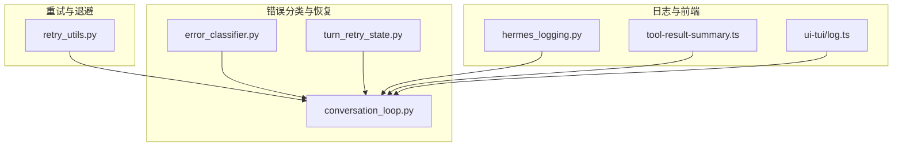
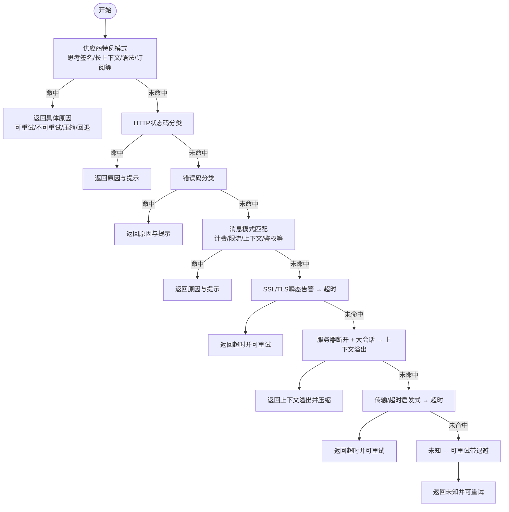
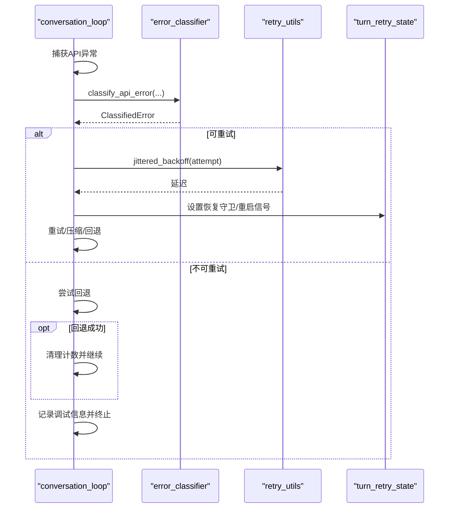
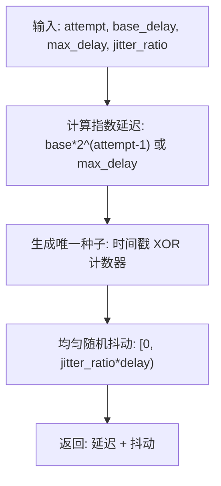
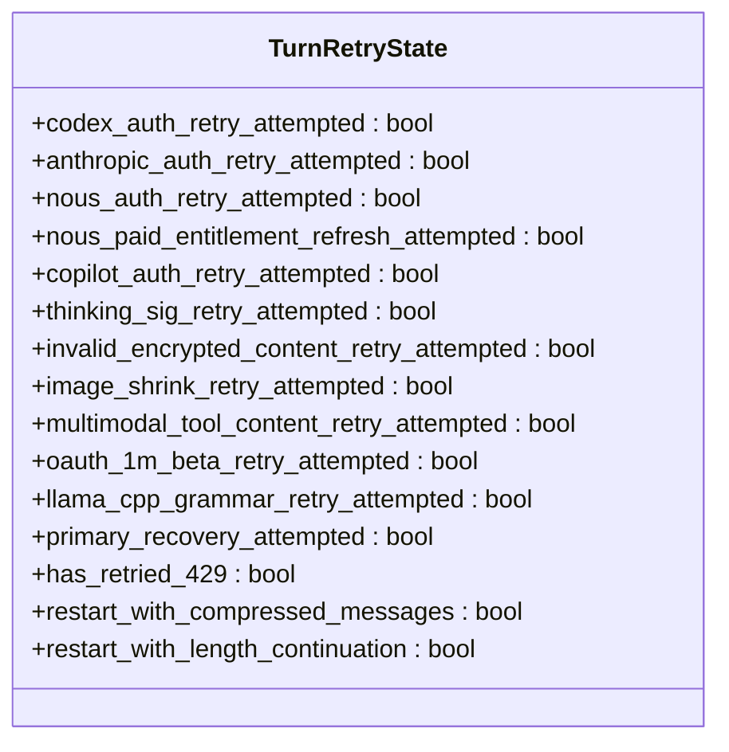
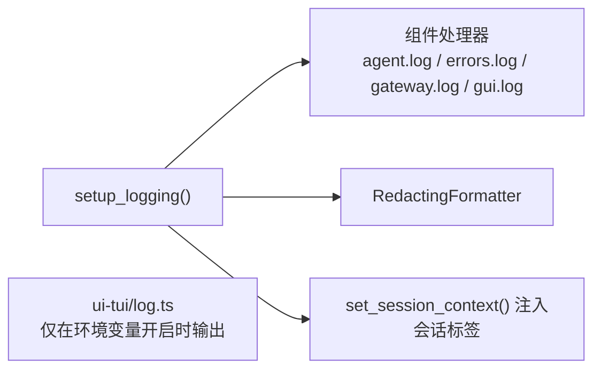
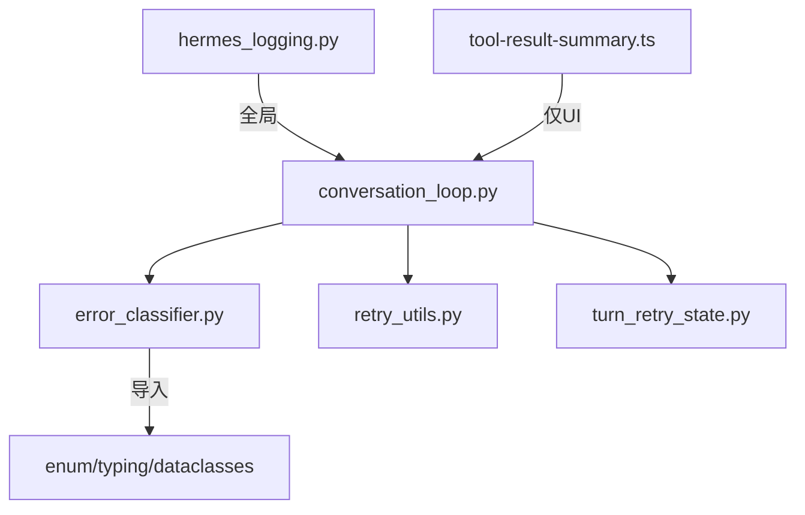

# 错误处理

<cite>
**本文引用的文件**
- [agent/error_classifier.py](file://agent/error_classifier.py)
- [agent/errors.py](file://agent/errors.py)
- [agent/retry_utils.py](file://agent/retry_utils.py)
- [agent/turn_retry_state.py](file://agent/turn_retry_state.py)
- [agent/conversation_loop.py](file://agent/conversation_loop.py)
- [hermes_logging.py](file://hermes_logging.py)
- [tests/agent/test_error_classifier.py](file://tests/agent/test_error_classifier.py)
- [tests/run_agent/test_jsondecodeerror_retryable.py](file://tests/run_agent/test_jsondecodeerror_retryable.py)
- [tests/tools/test_mcp_cancelled_error_propagation.py](file://tests/tools/test_mcp_cancelled_error_propagation.py)
- [tests/tools/test_mcp_empty_error_message.py](file://tests/tools/test_mcp_empty_error_message.py)
- [tests/tools/test_search_error_guard.py](file://tests/tools/test_search_error_guard.py)
- [tests/test_retry_utils.py](file://tests/test_retry_utils.py)
- [tests/agent/test_turn_retry_state.py](file://tests/agent/test_turn_retry_state.py)
- [apps/desktop/src/lib/tool-result-summary.ts](file://apps/desktop/src/lib/tool-result-summary.ts)
- [ui-tui/packages/hermes-ink/src/utils/log.ts](file://ui-tui/packages/hermes-ink/src/utils/log.ts)
</cite>

## 目录
1. [简介](#简介)
2. [项目结构](#项目结构)
3. [核心组件](#核心组件)
4. [架构总览](#架构总览)
5. [详细组件分析](#详细组件分析)
6. [依赖分析](#依赖分析)
7. [性能考量](#性能考量)
8. [故障排查指南](#故障排查指南)
9. [结论](#结论)
10. [附录](#附录)

## 简介
本技术文档聚焦于 Hermes Agent 的错误处理机制，系统性阐述错误分类体系与异常处理策略、异常传播与恢复路径、错误信息标准化与日志记录规范，并给出内置恢复与降级策略（重试、回退、容错）及最佳实践与自定义错误处理器开发指南。目标是帮助开发者在复杂多模型、多适配器的运行环境中，快速定位问题、理解错误语义、选择合适的恢复动作，并扩展或定制错误处理能力。

## 项目结构
围绕错误处理的关键模块分布如下：
- 错误分类与恢复：agent/error_classifier.py、agent/conversation_loop.py
- 重试与退避：agent/retry_utils.py、agent/turn_retry_state.py
- 日志与可观测性：hermes_logging.py、ui-tui/packages/hermes-ink/src/utils/log.ts
- 工具结果错误提取：apps/desktop/src/lib/tool-result-summary.ts
- 测试与验证：tests 下多个测试文件



**图表来源**
- [agent/error_classifier.py](file://agent/error_classifier.py)
- [agent/conversation_loop.py](file://agent/conversation_loop.py)
- [agent/turn_retry_state.py](file://agent/turn_retry_state.py)
- [agent/retry_utils.py](file://agent/retry_utils.py)
- [hermes_logging.py](file://hermes_logging.py)
- [apps/desktop/src/lib/tool-result-summary.ts](file://apps/desktop/src/lib/tool-result-summary.ts)
- [ui-tui/packages/hermes-ink/src/utils/log.ts](file://ui-tui/packages/hermes-ink/src/utils/log.ts)

**章节来源**
- [agent/error_classifier.py](file://agent/error_classifier.py)
- [agent/conversation_loop.py](file://agent/conversation_loop.py)
- [agent/retry_utils.py](file://agent/retry_utils.py)
- [agent/turn_retry_state.py](file://agent/turn_retry_state.py)
- [hermes_logging.py](file://hermes_logging.py)
- [apps/desktop/src/lib/tool-result-summary.ts](file://apps/desktop/src/lib/tool-result-summary.ts)
- [ui-tui/packages/hermes-ink/src/utils/log.ts](file://ui-tui/packages/hermes-ink/src/utils/log.ts)

## 核心组件
- 错误分类器：对 API 异常进行结构化分类，输出可执行的恢复建议（是否可重试、是否压缩上下文、是否轮换凭证、是否回退）
- 会话循环：在对话回合中驱动重试、回退、上下文压缩、传输恢复等策略
- 重试状态：单次尝试内的“一次性”恢复守卫与重启信号
- 退避策略：去相关抖动退避，避免并发风暴
- 日志系统：统一日志入口、按组件分文件、带会话上下文、脱敏格式化
- 工具结果错误提取：从工具返回体中抽取错误文本，辅助诊断

**章节来源**
- [agent/error_classifier.py](file://agent/error_classifier.py)
- [agent/conversation_loop.py](file://agent/conversation_loop.py)
- [agent/turn_retry_state.py](file://agent/turn_retry_state.py)
- [agent/retry_utils.py](file://agent/retry_utils.py)
- [hermes_logging.py](file://hermes_logging.py)
- [apps/desktop/src/lib/tool-result-summary.ts](file://apps/desktop/src/lib/tool-result-summary.ts)

## 架构总览
下图展示错误从发生到恢复的整体流程：调用失败后由分类器给出原因与恢复提示，会话循环据此决定重试、压缩、回退或终止；同时结合退避策略与会话状态，确保恢复过程可控且高效。

```mermaid
sequenceDiagram
participant Caller as "调用方"
participant Loop as "conversation_loop"
participant Classifier as "error_classifier"
participant Retry as "retry_utils"
participant State as "turn_retry_state"
Caller->>Loop : 发起API调用
Loop-->>Caller : 抛出异常/返回错误
Loop->>Classifier : classify_api_error(ex, provider, model, tokens, context)
Classifier-->>Loop : ClassifiedError(reason, retryable, should_compress, should_fallback)
alt 可重试
Loop->>Retry : 计算退避延迟
Retry-->>Loop : 延迟秒数
Loop->>State : 更新恢复守卫/重启信号
Loop->>Loop : 重试或压缩/回退
else 不可重试
Loop->>Loop : 终止并记录调试信息
end
```

**图表来源**
- [agent/conversation_loop.py](file://agent/conversation_loop.py)
- [agent/error_classifier.py](file://agent/error_classifier.py)
- [agent/retry_utils.py](file://agent/retry_utils.py)
- [agent/turn_retry_state.py](file://agent/turn_retry_state.py)

## 详细组件分析

### 错误分类体系与算法
- 分类维度：认证/授权、计费/配额、服务端错误、传输超时、上下文/负载过大、模型/策略限制、请求格式、特定供应商问题、未知
- 结构化输出：包含原因、状态码、提供商/模型、消息、上下文元数据以及恢复提示（可重试、是否压缩、是否轮换凭证、是否回退）
- 分类优先级：供应商特例模式 → HTTP 状态码 + 消息细化 → 错误码分类 → 消息模式匹配 → SSL/TLS 传输告警 → 服务器断开 + 大会话 → 传输超时启发式 → 未知（带退避）



**图表来源**
- [agent/error_classifier.py](file://agent/error_classifier.py)

**章节来源**
- [agent/error_classifier.py](file://agent/error_classifier.py)

### 异常传播与恢复策略
- 会话循环在捕获异常后，先进行分类，再依据恢复提示执行相应动作：
  - 可重试：计算退避延迟，更新恢复守卫，重试或切换压缩/回退路径
  - 不可重试：尝试回退，若无回退则记录调试信息并终止
  - 传输错误：尝试重建主客户端以修复连接池/TCP复位等问题
- 提供商特例处理：
  - 思考块签名问题：剥离推理内容后重试
  - 长上下文分级门限：触发上下文压缩
  - 语法模式不兼容：移除正则/格式约束后重试
  - 订阅权限不足：标记不可重试并尝试回退



**图表来源**
- [agent/conversation_loop.py](file://agent/conversation_loop.py)
- [agent/error_classifier.py](file://agent/error_classifier.py)
- [agent/retry_utils.py](file://agent/retry_utils.py)
- [agent/turn_retry_state.py](file://agent/turn_retry_state.py)

**章节来源**
- [agent/conversation_loop.py](file://agent/conversation_loop.py)
- [agent/error_classifier.py](file://agent/error_classifier.py)
- [agent/turn_retry_state.py](file://agent/turn_retry_state.py)
- [agent/retry_utils.py](file://agent/retry_utils.py)

### 重试与退避策略
- 退避函数采用去相关抖动指数退避，避免多个会话在同一时刻重试导致“惊群效应”
- 使用单调计数器与时间戳混合作为随机种子，保证并发场景下的 decorrelation
- 最大延迟与基础延迟可配置，确保不会无限增长



**图表来源**
- [agent/retry_utils.py](file://agent/retry_utils.py)

**章节来源**
- [agent/retry_utils.py](file://agent/retry_utils.py)

### 会话内恢复状态管理
- 单次尝试内的“一次性”恢复守卫，防止重复执行同一恢复分支
- 包含认证刷新、格式修复、图像尺寸调整、语法降级、传输恢复等守卫
- 提供重启信号（如压缩消息、长度续写），由外层循环读取并决定重建请求



**图表来源**
- [agent/turn_retry_state.py](file://agent/turn_retry_state.py)

**章节来源**
- [agent/turn_retry_state.py](file://agent/turn_retry_state.py)

### 错误信息标准化与日志记录
- 日志统一入口，按组件拆分文件（agent、errors、gateway、gui），使用旋转文件处理器并启用脱敏格式化
- 会话上下文注入：每个线程设置会话ID后，所有日志行自动携带会话标签，便于关联与过滤
- 前端调试开关：仅在开启环境变量时输出错误堆栈，避免生产噪声



**图表来源**
- [hermes_logging.py](file://hermes_logging.py)
- [ui-tui/packages/hermes-ink/src/utils/log.ts](file://ui-tui/packages/hermes-ink/src/utils/log.ts)

**章节来源**
- [hermes_logging.py](file://hermes_logging.py)
- [ui-tui/packages/hermes-ink/src/utils/log.ts](file://ui-tui/packages/hermes-ink/src/utils/log.ts)

### 工具结果错误提取与诊断
- 从工具返回体中递归查找错误键值，抽取有意义的错误文本，支持嵌套包装对象
- 识别错误信号（success/false、状态关键字、错误键存在等），并裁剪过长文本，便于在 UI 中展示

**章节来源**
- [apps/desktop/src/lib/tool-result-summary.ts](file://apps/desktop/src/lib/tool-result-summary.ts)

## 依赖分析
- 错误分类器独立于业务逻辑，仅依赖标准库与枚举/数据类，便于单元测试与跨模块复用
- 会话循环依赖分类器、退避策略与恢复状态，形成闭环控制
- 日志系统为全局单例，通过记录工厂注入会话上下文，不引入循环依赖
- 工具结果提取与前端 UI 解耦，仅在展示层使用



**图表来源**
- [agent/error_classifier.py](file://agent/error_classifier.py)
- [agent/conversation_loop.py](file://agent/conversation_loop.py)
- [agent/retry_utils.py](file://agent/retry_utils.py)
- [agent/turn_retry_state.py](file://agent/turn_retry_state.py)
- [hermes_logging.py](file://hermes_logging.py)
- [apps/desktop/src/lib/tool-result-summary.ts](file://apps/desktop/src/lib/tool-result-summary.ts)

**章节来源**
- [agent/error_classifier.py](file://agent/error_classifier.py)
- [agent/conversation_loop.py](file://agent/conversation_loop.py)
- [agent/retry_utils.py](file://agent/retry_utils.py)
- [agent/turn_retry_state.py](file://agent/turn_retry_state.py)
- [hermes_logging.py](file://hermes_logging.py)
- [apps/desktop/src/lib/tool-result-summary.ts](file://apps/desktop/src/lib/tool-result-summary.ts)

## 性能考量
- 退避策略采用去相关抖动，降低并发重试峰值，提升整体吞吐稳定性
- 分类器优先级链路短、分支明确，避免深度解析与昂贵操作
- 会话内恢复守卫确保每种恢复只执行一次，减少无效重试
- 日志轮转与脱敏在 Windows 平台采用并发安全处理器，避免阻塞

[本节为通用指导，无需列出具体文件来源]

## 故障排查指南
- 快速定位
  - 查看 errors.log 中的警告/错误级别条目，结合会话标签筛选
  - 在 UI 中启用前端错误输出（环境变量），获取更详细的堆栈
- 诊断工具结果
  - 使用工具结果摘要提取函数，从返回体中抽取错误文本，辅助判断上游错误来源
- 常见问题线索
  - 认证/授权失败：检查凭证轮换与提供商刷新流程
  - 限流/配额耗尽：观察退避延迟与回退策略是否生效
  - 上下文溢出：确认是否已触发压缩与消息截断
  - 传输超时：检查网络与连接池状态，必要时重建主客户端
- 单元测试参考
  - 错误分类器行为、重试工具、回合重试状态等均有对应测试用例，可对照期望行为验证实现

**章节来源**
- [hermes_logging.py](file://hermes_logging.py)
- [ui-tui/packages/hermes-ink/src/utils/log.ts](file://ui-tui/packages/hermes-ink/src/utils/log.ts)
- [apps/desktop/src/lib/tool-result-summary.ts](file://apps/desktop/src/lib/tool-result-summary.ts)
- [tests/agent/test_error_classifier.py](file://tests/agent/test_error_classifier.py)
- [tests/test_retry_utils.py](file://tests/test_retry_utils.py)
- [tests/agent/test_turn_retry_state.py](file://tests/agent/test_turn_retry_state.py)

## 结论
Hermes Agent 的错误处理以“结构化分类 + 智能恢复 + 可观测性”为核心，通过优先级分类链路、去相关退避、一次性恢复守卫与会话上下文日志，实现了高鲁棒性的多模型/多适配器运行环境。该体系既保证了常见错误的自动化恢复，也为复杂场景提供了可扩展的诊断与回退路径。

[本节为总结性内容，无需列出具体文件来源]

## 附录

### 错误类型与恢复提示一览
- 认证/授权：auth/auth_permanent
- 计费/配额：billing/rate_limit
- 服务端：overloaded/server_error
- 传输：timeout
- 上下文/负载：context_overflow/payload_too_large/image_too_large
- 模型/策略：model_not_found/provider_policy_blocked/content_policy_blocked
- 请求格式：format_error/invalid_encrypted_content/multimodal_tool_content_unsupported
- 供应商特例：thinking_signature/long_context_tier/oauth_long_context_beta_forbidden/llama_cpp_grammar_pattern
- 未知：unknown

**章节来源**
- [agent/error_classifier.py](file://agent/error_classifier.py)

### 自定义错误处理器开发指南
- 扩展分类器
  - 新增供应商特例模式：在分类器中添加新的模式匹配与恢复提示
  - 新增错误码/消息模式：维护模式列表并在相应阶段加入匹配
- 扩展恢复动作
  - 在会话循环中新增恢复守卫与重启信号，确保只执行一次
  - 在退避策略中调整参数或引入新策略
- 规范化错误输出
  - 使用日志系统统一记录，设置会话上下文，避免敏感信息泄露
  - 在 UI 层启用调试输出以便快速定位问题
- 验证与回归
  - 编写单元测试覆盖新增分支，参考现有测试文件组织风格

**章节来源**
- [agent/error_classifier.py](file://agent/error_classifier.py)
- [agent/conversation_loop.py](file://agent/conversation_loop.py)
- [agent/retry_utils.py](file://agent/retry_utils.py)
- [agent/turn_retry_state.py](file://agent/turn_retry_state.py)
- [hermes_logging.py](file://hermes_logging.py)
- [tests/agent/test_error_classifier.py](file://tests/agent/test_error_classifier.py)
- [tests/test_retry_utils.py](file://tests/test_retry_utils.py)
- [tests/agent/test_turn_retry_state.py](file://tests/agent/test_turn_retry_state.py)