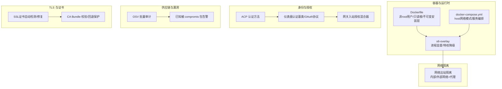
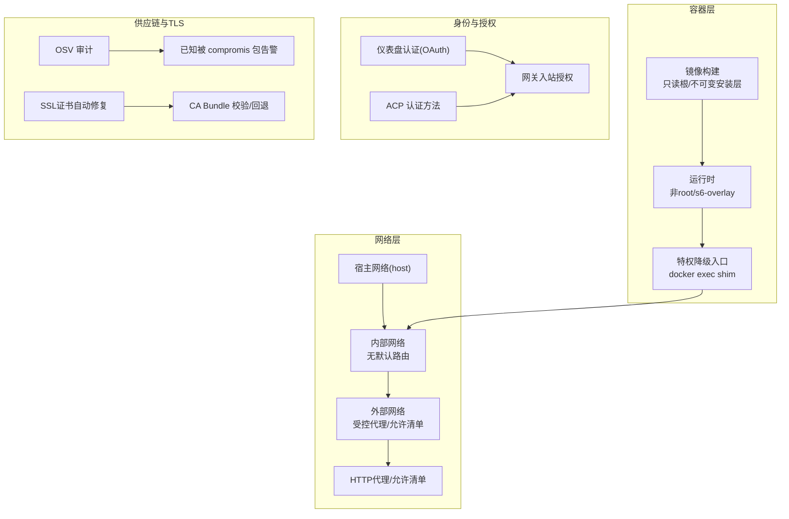
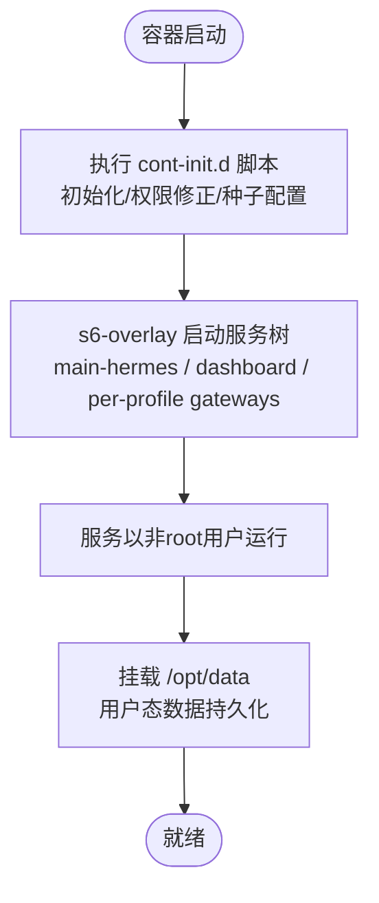
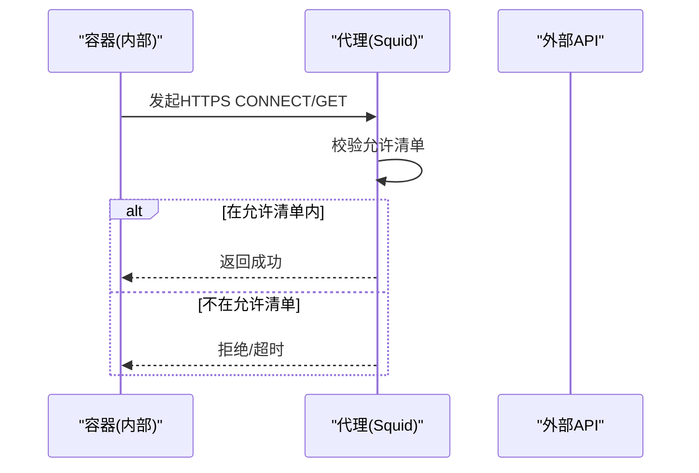
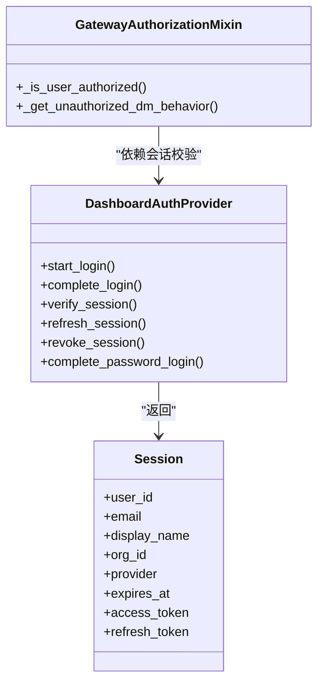
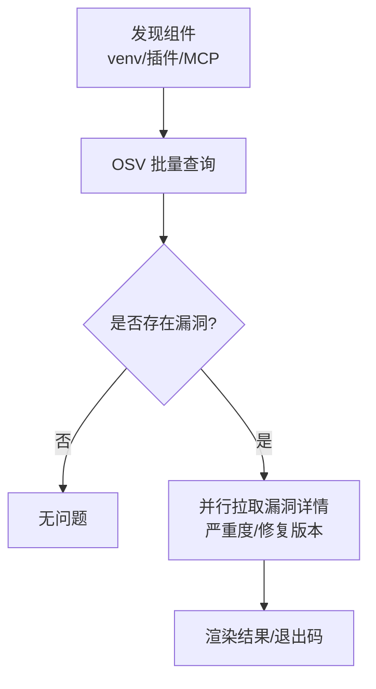
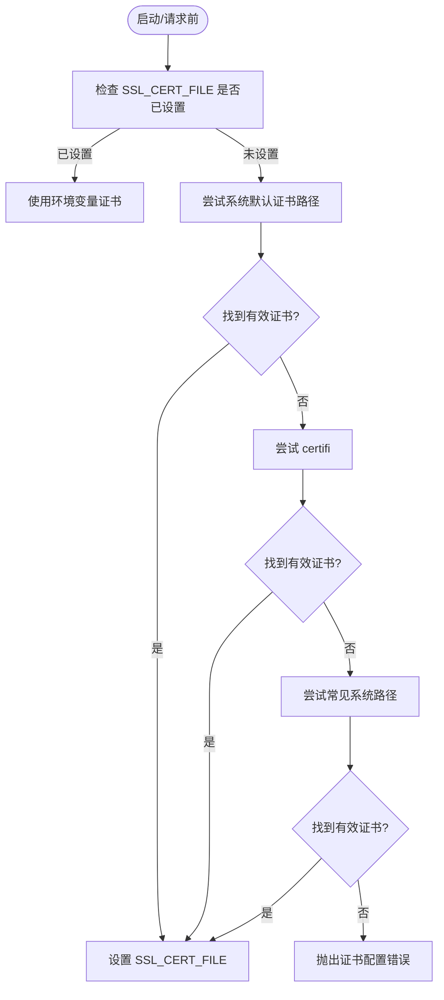
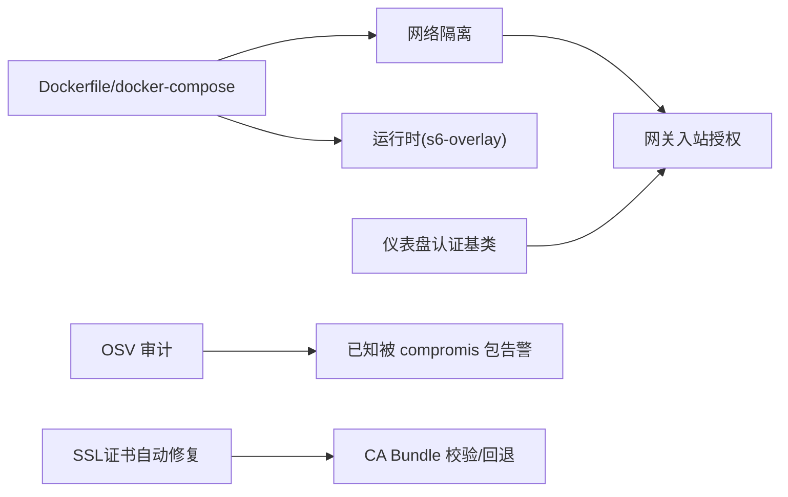

# 安全加固

<cite>
**本文引用的文件**
- [SECURITY.md](file://SECURITY.md)
- [Dockerfile](file://Dockerfile)
- [docker-compose.yml](file://docker-compose.yml)
- [network-egress-isolation.md](file://docs/security/network-egress-isolation.md)
- [auth.py](file://acp_adapter/auth.py)
- [base.py](file://hermes_cli/dashboard_auth/base.py)
- [authz_mixin.py](file://gateway/authz_mixin.py)
- [security_audit.py](file://hermes_cli/security_audit.py)
- [security_advisories.py](file://hermes_cli/security_advisories.py)
- [errors.py](file://agent/errors.py)
- [test_ssl_ca_guard.py](file://tests/agent/test_ssl_ca_guard.py)
- [test_ssl_cert_detection.py](file://tests/gateway/test_ssl_cert_detection.py)
- [test_ssl_certs.py](file://tests/gateway/test_ssl_certs.py)
</cite>

## 目录
1. [引言](#引言)
2. [项目结构](#项目结构)
3. [核心组件](#核心组件)
4. [架构总览](#架构总览)
5. [详细组件分析](#详细组件分析)
6. [依赖分析](#依赖分析)
7. [性能考虑](#性能考虑)
8. [故障排查指南](#故障排查指南)
9. [结论](#结论)
10. [附录](#附录)

## 引言
本文件面向“安全加固”的全面实施方案，结合仓库中的信任模型、容器与网络隔离、身份认证与授权、供应链审计与告警、TLS 证书保障等现有能力，系统化梳理可落地的安全实践，并给出可操作的配置建议与流程规范，覆盖镜像安全扫描、运行时安全防护、网络隔离、权限控制、数据与隐私保护、身份认证与授权、漏洞管理与补丁更新、安全监控与事件响应等。

## 项目结构
围绕安全加固的关键位置与职责划分如下：
- 容器与运行时：Dockerfile、docker-compose.yml、s6-overlay 进程监督、非 root 用户运行、只读根文件系统、不可变安装层、特权降级入口
- 网络隔离：默认 host 模式下的 egress 隔离（内部/外部网络）、代理允许清单
- 身份与授权：ACP 认证方法、仪表盘 OAuth 基础协议、网关入站消息授权混合器
- 供应链与漏洞：OSV 批量查询审计、已知被 compromis 包告警、启动横幅提示与忽略机制
- TLS 与证书：自动检测与修复 SSL 证书链、CA Bundle 校验与回退保护

图示来源
- [Dockerfile:1-338](file://Dockerfile#L1-L338)
- [docker-compose.yml:1-77](file://docker-compose.yml#L1-L77)
- [network-egress-isolation.md:1-196](file://docs/security/network-egress-isolation.md#L1-L196)
- [auth.py:1-80](file://acp_adapter/auth.py#L1-L80)
- [base.py:1-221](file://hermes_cli/dashboard_auth/base.py#L1-L221)
- [authz_mixin.py:1-537](file://gateway/authz_mixin.py#L1-L537)
- [security_audit.py:1-577](file://hermes_cli/security_audit.py#L1-L577)
- [security_advisories.py:1-454](file://hermes_cli/security_advisories.py#L1-L454)

章节来源
- [Dockerfile:1-338](file://Dockerfile#L1-L338)
- [docker-compose.yml:1-77](file://docker-compose.yml#L1-L77)
- [network-egress-isolation.md:1-196](file://docs/security/network-egress-isolation.md#L1-L196)

## 核心组件
- 容器与运行时安全
  - 非 root 用户运行、只读根文件系统、不可变安装层、特权降级入口、s6-overlay 进程监督
- 网络隔离
  - 默认 host 模式下通过双网络与代理实现 egress 隔离，限制工具命令外联
- 身份与授权
  - ACP 提供运行时凭据认证；仪表盘认证基类定义 OAuth 生命周期与错误语义；网关入站授权混合器统一处理平台允许清单、配对、全局允许等策略
- 供应链与漏洞
  - OSV 批量查询审计（venv、插件、MCP），已知被 compromis 包告警与忽略机制
- TLS 与证书
  - 自动检测/修复 SSL 证书链，CA Bundle 校验与回退保护，避免空/缺失证书导致的连接失败

章节来源
- [Dockerfile:90-216](file://Dockerfile#L90-L216)
- [docker-compose.yml:13-27](file://docker-compose.yml#L13-L27)
- [network-egress-isolation.md:62-155](file://docs/security/network-egress-isolation.md#L62-L155)
- [auth.py:11-80](file://acp_adapter/auth.py#L11-L80)
- [base.py:75-221](file://hermes_cli/dashboard_auth/base.py#L75-L221)
- [authz_mixin.py:176-537](file://gateway/authz_mixin.py#L176-L537)
- [security_audit.py:84-280](file://hermes_cli/security_audit.py#L84-L280)
- [security_advisories.py:95-189](file://hermes_cli/security_advisories.py#L95-L189)

## 架构总览
下图展示从容器到网络、身份、供应链与 TLS 的整体安全架构映射：

图示来源
- [Dockerfile:200-240](file://Dockerfile#L200-L240)
- [docker-compose.yml:35-76](file://docker-compose.yml#L35-L76)
- [network-egress-isolation.md:25-155](file://docs/security/network-egress-isolation.md#L25-L155)
- [auth.py:41-80](file://acp_adapter/auth.py#L41-L80)
- [base.py:75-155](file://hermes_cli/dashboard_auth/base.py#L75-L155)
- [authz_mixin.py:176-537](file://gateway/authz_mixin.py#L176-L537)
- [security_audit.py:414-458](file://hermes_cli/security_audit.py#L414-L458)
- [security_advisories.py:167-189](file://hermes_cli/security_advisories.py#L167-L189)

## 详细组件分析

### 容器安全配置
- 非 root 运行与权限最小化
  - 使用非 root 用户运行，镜像构建阶段设置 hermes 用户与家目录，运行时通过 s6-overlay 将服务切换到该用户
  - docker exec 提供特权降级入口，避免以 root 写入宿主路径
- 只读根文件系统与不可变安装层
  - 安装内容位于不可变层，用户数据、技能、插件、配置、日志、上传等位于 /opt/data 卷内，降低被篡改风险
- 进程监督与生命周期
  - s6-overlay 作为 PID 1，负责 cont-init.d 初始化脚本、服务注册与重启策略，确保容器健康与一致性

图示来源
- [Dockerfile:241-262](file://Dockerfile#L241-L262)
- [Dockerfile:287-312](file://Dockerfile#L287-L312)
- [docker-compose.yml:35-76](file://docker-compose.yml#L35-L76)

章节来源
- [Dockerfile:90-216](file://Dockerfile#L90-L216)
- [Dockerfile:241-262](file://Dockerfile#L241-L262)
- [Dockerfile:287-312](file://Dockerfile#L287-L312)
- [docker-compose.yml:13-27](file://docker-compose.yml#L13-L27)

### 网络隔离与出站控制
- 默认 host 模式风险
  - 默认使用 host 网络，容器内任意命令可直接访问宿主与互联网，存在被注入命令外联的风险
- 双网络与代理隔离
  - 将 agent/dashboard/gateway 分别置于内部网络（无默认路由）与外部网络（仅允许代理）
  - 通过 HTTP 代理（如 Squid）配置允许清单，仅放行必要的 LLM 平台与消息平台域名
- 验证与限制
  - 提供验证脚本，确认内部可达、外部受限、代理允许清单生效
  - 明确 DNS 解析仍可能外联，需额外本地 DNS 屏蔽策略

图示来源
- [network-egress-isolation.md:62-155](file://docs/security/network-egress-isolation.md#L62-L155)

章节来源
- [network-egress-isolation.md:12-196](file://docs/security/network-egress-isolation.md#L12-L196)
- [docker-compose.yml:35-76](file://docker-compose.yml#L35-L76)

### 身份认证与授权机制
- ACP 认证方法
  - 动态探测运行时提供商与凭据，向编辑器侧适配器暴露可用认证方式，支持终端引导配置
- 仪表盘认证基类
  - 定义 OAuth 生命周期（开始登录、完成登录、会话校验、刷新、撤销），错误类型与安全语义（CSRF、PKCE、HttpOnly/SameSite、防穷举）
- 网关入站授权混合器
  - 统一处理平台允许清单、群组/频道/私聊策略、配对存储、全局允许开关、未授权 DM 行为（忽略/配对）

图示来源
- [base.py:75-155](file://hermes_cli/dashboard_auth/base.py#L75-L155)
- [authz_mixin.py:176-537](file://gateway/authz_mixin.py#L176-L537)
- [auth.py:41-80](file://acp_adapter/auth.py#L41-L80)

章节来源
- [auth.py:11-80](file://acp_adapter/auth.py#L11-L80)
- [base.py:75-221](file://hermes_cli/dashboard_auth/base.py#L75-L221)
- [authz_mixin.py:176-537](file://gateway/authz_mixin.py#L176-L537)

### 供应链审计与已知风险告警
- OSV 批量审计
  - 发现 venv 已安装包、用户插件 requirements/pyproject 版本、MCP 服务器命令行中带版本号的包，批量查询 OSV 获取漏洞信息
- 已知被 compromis 包告警
  - 对 PyPI 已知被污染包进行快速检测，提供一键忽略与横幅提示，支持按时间窗口重复提醒
- 与信任模型的关系
  - 供应链审计是“边界之外”的主动防御，配合信任模型与隔离策略共同降低供应链攻击面

图示来源
- [security_audit.py:414-458](file://hermes_cli/security_audit.py#L414-L458)
- [security_advisories.py:167-189](file://hermes_cli/security_advisories.py#L167-L189)

章节来源
- [security_audit.py:84-280](file://hermes_cli/security_audit.py#L84-L280)
- [security_audit.py:300-409](file://hermes_cli/security_audit.py#L300-L409)
- [security_advisories.py:95-189](file://hermes_cli/security_advisories.py#L95-L189)

### TLS 证书保障
- 自动检测与修复
  - 若未设置 SSL_CERT_FILE，自动尝试系统默认证书路径、certifi、常见系统证书路径，确保 HTTPS 请求可用
- CA Bundle 校验与回退保护
  - 对 CA Bundle 进行完整性检查，缺失或空文件触发明确错误；提供兼容包装函数；支持跳过标志用于受管信任存储场景
- 测试覆盖
  - 单测覆盖了缺失/空文件/回退逻辑与跳过标志

图示来源
- [test_ssl_cert_detection.py:6-45](file://tests/gateway/test_ssl_cert_detection.py#L6-L45)
- [test_ssl_certs.py:16-40](file://tests/gateway/test_ssl_certs.py#L16-L40)
- [test_ssl_ca_guard.py:12-82](file://tests/agent/test_ssl_ca_guard.py#L12-L82)
- [errors.py:1-3](file://agent/errors.py#L1-L3)

章节来源
- [test_ssl_cert_detection.py:6-45](file://tests/gateway/test_ssl_cert_detection.py#L6-L45)
- [test_ssl_certs.py:16-40](file://tests/gateway/test_ssl_certs.py#L16-L40)
- [test_ssl_ca_guard.py:12-82](file://tests/agent/test_ssl_ca_guard.py#L12-L82)
- [errors.py:1-3](file://agent/errors.py#L1-L3)

## 依赖分析
- 组件耦合与边界
  - 容器层与网络层解耦：通过 compose 的网络分离与代理，将“需要外联”的服务与“仅内网”的服务隔离
  - 身份层与授权层解耦：仪表盘认证独立于网关授权，二者通过会话令牌与平台策略协同
  - 供应链审计与告警独立于业务流程：作为独立 CLI 子命令与启动横幅触发
- 外部依赖与集成点
  - OSV.dev 批量接口、证书来源（系统/证书包/常见路径）
- 潜在循环依赖
  - 认证基类采用抽象协议与惰性导入，避免模块级循环

图示来源
- [Dockerfile:241-262](file://Dockerfile#L241-L262)
- [docker-compose.yml:35-76](file://docker-compose.yml#L35-L76)
- [authz_mixin.py:176-537](file://gateway/authz_mixin.py#L176-L537)
- [base.py:75-155](file://hermes_cli/dashboard_auth/base.py#L75-L155)
- [security_audit.py:300-409](file://hermes_cli/security_audit.py#L300-L409)
- [security_advisories.py:167-189](file://hermes_cli/security_advisories.py#L167-L189)

章节来源
- [authz_mixin.py:176-537](file://gateway/authz_mixin.py#L176-L537)
- [base.py:75-155](file://hermes_cli/dashboard_auth/base.py#L75-L155)
- [security_audit.py:300-409](file://hermes_cli/security_audit.py#L300-L409)

## 性能考虑
- 容器层
  - 只读根与不可变安装层减少写放大与磁盘 IO；s6-overlay 以轻量监督替代 tini，降低僵尸进程与阻塞开销
- 网络层
  - 代理允许清单带来少量 CPU 开销，但显著降低外联风险；建议在代理层启用缓存与连接复用
- 供应链审计
  - 批量查询与并行详情拉取，建议在 CI 或离线时段执行，避免影响在线服务
- TLS
  - 证书自动修复仅在启动/首次请求时发生，后续复用环境变量，开销极低

## 故障排查指南
- 容器与运行时
  - 症状：docker exec 写入的文件属主为 root，无法被服务读取
  - 处理：使用内置特权降级入口，避免以 root 身份写入 /opt/data
- 网络隔离
  - 症状：工具命令无法访问外部 API
  - 处理：检查代理允许清单是否包含目标域名；确认内部网络连通性；验证 NO_PROXY 配置
- 身份与授权
  - 症状：OAuth 登录失败或会话无效
  - 处理：检查 Cookie 安全属性（HttpOnly/Secure/SameSite）、IDP 可达性、ProviderError/InvalidCodeError
- 供应链与告警
  - 症状：审计失败或告警频繁
  - 处理：确认网络可达 OSV 接口；检查版本固定策略；忽略已知无需关注的告警
- TLS 证书
  - 症状：HTTPS 请求失败或证书校验错误
  - 处理：确认 SSL_CERT_FILE 设置；检查 CA Bundle 文件存在且非空；必要时使用回退保护或跳过标志（仅受管环境）

章节来源
- [Dockerfile:287-312](file://Dockerfile#L287-L312)
- [network-egress-isolation.md:156-196](file://docs/security/network-egress-isolation.md#L156-L196)
- [base.py:44-73](file://hermes_cli/dashboard_auth/base.py#L44-L73)
- [security_audit.py:528-577](file://hermes_cli/security_audit.py#L528-L577)
- [test_ssl_ca_guard.py:22-82](file://tests/agent/test_ssl_ca_guard.py#L22-L82)

## 结论
本方案基于仓库现有的信任模型与工程能力，形成“容器最小权限 + 网络隔离 + 身份与授权 + 供应链审计 + TLS 证书保障”的闭环安全加固路径。建议在生产环境中强制启用 egress 隔离与代理允许清单、严格平台允许清单、定期执行供应链审计、完善证书自动修复与校验流程，并配套安全监控与事件响应机制，持续提升整体安全韧性。

## 附录
- 安全加固实施清单
  - 容器与运行时
    - 使用非 root 用户运行；只读根文件系统；不可变安装层；s6-overlay 进程监督
  - 网络隔离
    - 替换 host 网络为双网络；启用代理允许清单；验证内外网连通性
  - 身份与授权
    - 启用平台允许清单；配置 OAuth/密码登录；统一网关入站授权策略
  - 供应链与漏洞
    - 定期执行 OSV 审计；处理已知被 compromis 包告警；建立补丁更新流程
  - TLS 证书
    - 自动检测/修复 SSL 证书；CA Bundle 校验与回退；必要时使用跳过标志（受管环境）
- 参考文件
  - [SECURITY.md](file://SECURITY.md)
  - [Dockerfile](file://Dockerfile)
  - [docker-compose.yml](file://docker-compose.yml)
  - [network-egress-isolation.md](file://docs/security/network-egress-isolation.md)
  - [auth.py](file://acp_adapter/auth.py)
  - [base.py](file://hermes_cli/dashboard_auth/base.py)
  - [authz_mixin.py](file://gateway/authz_mixin.py)
  - [security_audit.py](file://hermes_cli/security_audit.py)
  - [security_advisories.py](file://hermes_cli/security_advisories.py)
  - [errors.py](file://agent/errors.py)
  - [test_ssl_ca_guard.py](file://tests/agent/test_ssl_ca_guard.py)
  - [test_ssl_cert_detection.py](file://tests/gateway/test_ssl_cert_detection.py)
  - [test_ssl_certs.py](file://tests/gateway/test_ssl_certs.py)